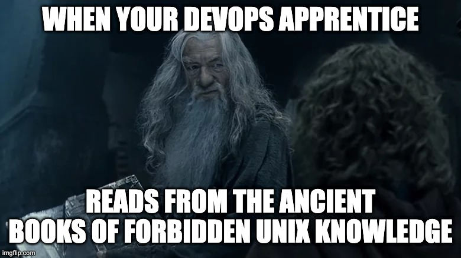
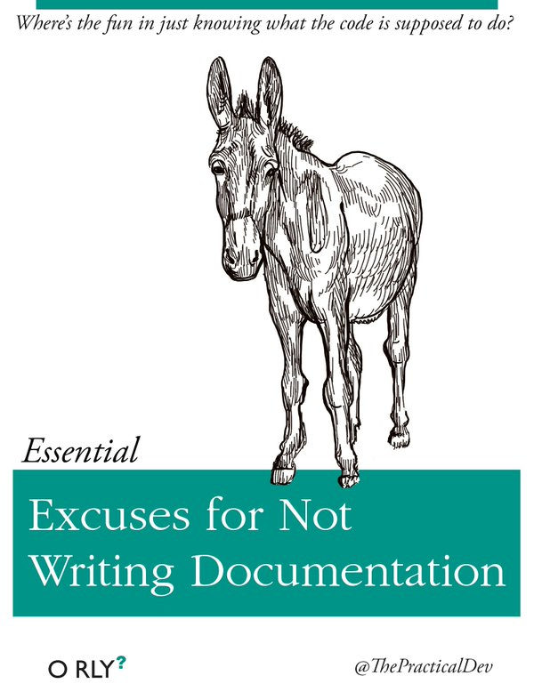

# Hari Sekhon - Knowledge Base from 20 years in DevOps, Linux, Cloud, Big Data, Security, AWS, GCP etc

Repo focused on advanced knowledge, tips & tricks, debugging & fixes.

I'm gradually migrating my huge private personal knowledge base into this public repo.

Hit the watch button on the top right for updates.

Some of these pages are still in progress pending porting and populated yet from my private knowledge base pages,
some are stubs pending migration.

Much more advanced knowledge is captured in code and code comments. References to my major
[GitHub Repos](https://github.com/HariSekhon?tab=repositories&q=&type=&language=&sort=stargazers) are provided
throughout where relevant.

References to official docs and some classic books are provided for those who want to thoroughly cover the basics.

## Index

<!-- INDEX_START -->

- [Travel Notes Touring the World](#travel-notes-touring-the-world)
- [GitHub Repos](#github-repos)
- [Systems](#systems)
  - [Operating Systems](#operating-systems)
  - [Core Services - DNS, DHCP, SSH, FTP](#core-services---dns-dhcp-ssh-ftp)
  - [Editors](#editors)
  - [Terminal Multiplexers](#terminal-multiplexers)
- [Architecture & Documentation](#architecture--documentation)
- [Git](#git)
- [Cloud](#cloud)
- [Containerization](#containerization)
  - [Docker](#docker)
  - [Kubernetes](#kubernetes)
    - [Kubernetes Core](#kubernetes-core)
    - [Cloud Hosted Kubernetes](#cloud-hosted-kubernetes)
    - [On-premise Kubernetes](#on-premise-kubernetes)
    - [Local Kubernetes Dev](#local-kubernetes-dev)
    - [Kubernetes Applications & Lifecycle Management](#kubernetes-applications--lifecycle-management)
  - [Container Registries](#container-registries)
  - [Container Security](#container-security)
- [Programming](#programming)
  - [Languages](#languages)
  - [Build Systems](#build-systems)
  - [Mobile Builds](#mobile-builds)
  - [Artifact Registries](#artifact-registries)
  - [Code Scanning](#code-scanning)
- [Infrastructure-as-Code](#infrastructure-as-code)
- [Configuration Management](#configuration-management)
- [CI/CD](#cicd)
- [Internet Services](#internet-services)
- [Databases / RDBMS](#databases--rdbms)
  - [MPP Databases](#mpp-databases)
  - [Hosted MPP Databases](#hosted-mpp-databases)
  - [Database Management](#database-management)
- [NoSQL](#nosql)
  - [Caching](#caching)
  - [Search](#search)
- [Coordination & Discovery Services](#coordination--discovery-services)
- [Pub / Sub & Message Queues](#pub--sub--message-queues)
- [Data](#data)
  - [Data Formats](#data-formats)
  - [Hadoop Ecosystem](#hadoop-ecosystem)
  - [Data Science & Machine Learning](#data-science--machine-learning)
  - [Time Series Databases](#time-series-databases)
  - [Visualization](#visualization)
- [Security](#security)
- [Virtualization](#virtualization)
- [Hardware](#hardware)
- [Networking](#networking)
  - [Load Balancing](#load-balancing)
- [Monitoring](#monitoring)
  - [Performance Engineering](#performance-engineering)
- [AI & Automation](#ai--automation)
- [Work](#work)
  - [Remote Working & Digital Nomad](#remote-working--digital-nomad)
  - [Training & Interview Materials](#training--interview-materials)
  - [Banking Industry](#banking-industry)
  - [Travel](#travel)
- [Miscellaneous](#miscellaneous)
  - [Dev / DevOps / Open Source / Agile](#dev--devops--open-source--agile)
  - [Vendors](#vendors)
  - [Multimedia](#multimedia)
  - [Marketing](#marketing)
  - [Crypto](#crypto)
  - [Old Docs](#old-docs)
- [Star History](#star-history)
- [Memes](#memes)
  - [This is the Lost Documentation](#this-is-the-lost-documentation)
- [More Core Repos](#more-core-repos)
  - [Knowledge](#knowledge)
  - [DevOps Code](#devops-code)
  - [Containerization](#containerization)
  - [CI/CD](#cicd)
  - [DBA - SQL](#dba---sql)
  - [DevOps Reloaded](#devops-reloaded)
  - [Templates](#templates)
  - [Misc](#misc)
- [Other Resources](#other-resources)

<!-- INDEX_END -->

## Travel Notes Touring the World

- [Travel Page](travel.md) - tips from travelling the world extensively for work consulting and as a tourist:
  - my favourite restaurants
  - flights & accommodation
  - mobile internet access & e-sim providers
  - visas
  - driving around Europe on road trips each summer
  - various other travel tips specific to each of 40+ countries and 100+ cities

## GitHub Repos

Full of open source tools and scripts used throughout the rest of these docs to make it easier to install and operate these technologies:

- [DevOps-Bash-tools](devops-bash-tools.md) - 1000+ Bash scripts, advanced shell environment customizations, quick installation scripts and dot configs
- [DevOps-Python-tools](devops-python-tools.md) - 80+ Python programs for DevOps & Data
- [DevOps-Perl-tools](devops-perl-tools.md) - 25+ Perl programs for DevOps
- [DevOps-Golang-tools](devops-golang-tools.md) - a handful of Golang programs
- [Kubernetes-configs](https://github.com/HariSekhon/Kubernetes-configs) -
  many Kubernetes applications and advanced templates with Tips & Tricks from production environments
- [SQL-scripts](https://github.com/HariSekhon/SQL-scripts) - 100+ database scripts
- [Templates](https://github.com/HariSekhon/Templates) - templates for many common file formats for programming languages, build systems and DevOps configs
- [Diagrams-as-Code](https://github.com/HariSekhon/Diagrams-as-Code.md) - Cloud & Open Source architecture diagrams

This one is used widely throughout these pages:

## Systems

### Operating Systems

- [Linux](linux.md)
  - [Debian](debian.md)
  - [Ubuntu](ubuntu.md)
  - [Redhat](redhat.md)
  - [Alpine](alpine.md)
  - [Gentoo](gentoo.md)
- [Windows](windows.md)
- [Mac](mac.md)
  - [Homebrew](brew.md)
- [Shell](shell.md)
  - [Bash](bash.md)
  - [direnv / `.envrc`](direnv.md)
  - [Shell One Liners](shell-one-liners.md)
  - [Advanced & Third Party Commands](commands.md)
- [Disk Management](disk.md)
- [Logging](logging.md)
  - [Syslog-ng](syslog-ng.md)
  - [RSyslog](rsyslog.md)

### Core Services - DNS, DHCP, SSH, FTP

- [SSH](ssh.md)
  - [SSH Tunnelling](ssh-tunnelling.md)
- [FTP](ftp.md)
- [DNS](dns.md)
- [DHCP](dhcp.md)

### Editors

- [Editors & IDEs](editors.md)
  - [Vim](vim.md)
  - [IntelliJ](intellij.md)
  - [VS Code](vs-code.md)
- [Coder](coder.md)

### Terminal Multiplexers

- [Screen](screen.md)
- [Tmux](tmux.md)

## Architecture & Documentation

- [Architecture](architecture.md) TODO
- [Best Practices](best-practices.md)
- [Product Selection](product-selection.md) TODO
- [Diagrams-as-Code](diagrams.md)
  - [D2 lang](d2.md)
  - [MermaidJS](mermaidjs.md)
- [Documentation](documentation.md)
  - [Markdown](markdown.md)
  - [MkDocs](mkdocs.md)
- [Microservices](microservices.md) TODO
- [Medium.com](medium.md) (blog)
- [System Design](system-design.md)

## Git

- [Git](git.md)
  - [Git Workflow Branching Strategies](git-workflow-branching-strategies.md)
- Git Repo Hosting Providers:
  - [GitHub](github.md) (TODO: partially ported)
  - [GitLab](gitlab.md)
  - [Azure DevOps](azure-devops.md)
  - [Bitbucket](bitbucket.md) (TODO: partially ported)
- [Pre-Commit](pre-commit.md)

## Cloud

- [Cloud](cloud.md)
- Cloud Platforms:
  - [AWS](aws.md)
    - [AMI Scanning](ami-scanning.md)
  - [GCP](gcp.md)
    - [Firebase](firebase.md)
  - [Azure](azure.md)
  - [Digital Ocean](digital-ocean.md)
- Third Party Tools:
  - [MinIO](minio.md)
  - [HashiCorp Vault](vault.md)
  - [Keeper](keeper.md)
- [PaaS](paas.md)

## Containerization

### Docker

- [Docker](docker.md)
  - [Dockerfile](dockerfile.md) TODO
  - [Docker Compose](docker-compose.md)
  - [Docker Swarm](docker-swarm.md)
- [Podman](podman.md)
- [Dockerfiles](https://github.com/HariSekhon/Dockerfiles) for many technologies:

### Kubernetes

#### Kubernetes Core

- [Kubernetes](kubernetes.md)
- [Kubernetes Upgrades](kubernetes-upgrades.md)
- [Kubernetes Configs](https://github.com/HariSekhon/Kubernetes-configs)
- [Kubernetes Production Ready Checklist](kubernetes-production-ready-checklist.md)
- [Traefik](traefik.md)
- [Kong API Gateway](kong.md)
- [Istio](istio.md) TODO
  - [Kiali](kiali.md)
- [Kubeflow](kubeflow.md) TODO

#### Cloud Hosted Kubernetes

- [AWS EKS](eks.md) TODO partial
  - [EKS Upgrades](eks-upgrades.md)
- [GKE](gke.md) TODO
- [AKS](aks.md) TODO
- [Karpenter](karpenter.md)

#### On-premise Kubernetes

- [K3s](k3s.md)
- [Rancher](rancher.md)
- [RKE2](rke2.md)
- [Portworx](portworx.md)

#### Local Kubernetes Dev

- [Docker Desktop](https://www.docker.com/products/docker-desktop/) embedded Kubernetes (easiest to use)
- [MiniKube](https://minikube.sigs.k8s.io/docs/start/)
- [MiniShift](https://github.com/minishift/minishift) - for OpenShift upstream [okd](https://www.okd.io/)
- [K3d](k3d.md)
- [Kind](kind.md)

#### Kubernetes Applications & Lifecycle Management

- [Helm](helm.md)
- [Kustomize](kustomize.md)
  - [Helm vs Kustomize](helm-vs-kustomize.md)
- [ArgoCD](argocd.md)
- [Cert Manager](cert-manager.md)
- [Kubernetes Configs](https://github.com/HariSekhon/Kubernetes-configs):

### Container Registries

- [DockerHub](https://hub.docker.com/)
- AWS [ECR](https://aws.amazon.com/ecr/)
- GCP [GAR](https://cloud.google.com/artifact-registry)
  - GCP [GCR](https://cloud.google.com/container-registry/pricing) (deprecated / shut down)
- Azure [ACR](https://azure.microsoft.com/en-us/products/container-registry)
- GitHub [GHCR](https://docs.github.com/en/packages/working-with-a-github-packages-registry/working-with-the-container-registry)
- Redhat [Quay.io](https://quay.io/) (there is an on-prem installable too)
- JFrog [Container Registry](https://jfrog.com/container-registry/)
- [Nexus](https://www.sonatype.com/nexus/repository-manager)
- [Harbor](https://goharbor.io/)
- [Chart Museum](https://chartmuseum.com/docs/#)

### Container Security

- [Container Scanning](container-scanning.md)
- [Trivy](trivy.md)
- [Grype](grype.md)
- [Clair](clair.md)

## Programming

- [Programming](programming.md)
- [Binaries Debugging](binaries-debugging.md)

### Languages

- [Perl](perl.md)
- [Python](python.md)
  - [Anaconda](anaconda.md)
- [Golang](golang.md) TODO
- [Rust](rust.md)
- [Ruby](ruby.md)
- [R](r.md) TODO
- [TCL / Expect](programming.md#expect)
- JVM:
  - [Java](java.md) TODO
  - [JDBC](jdbc.md)
  - [JVM Performance Tuning](java-jvm-performance-tuning.md)
  - [Groovy](groovy.md)
  - [Scala](scala.md) TODO
  - [Jython](python.md#jython)
  - [JRuby](ruby.md#jruby)
  - [SDKman](sdkman.md)
  - [log4j](log4j.md)
- [JavaScript / NodeJS](javascript.md)
- [APIs](api.md)
- [Regular Expressions](regex.md)
- [Testing](testing.md)

### Build Systems

- [Build Systems](build-systems.md)
- [Make](make.md)
- [Maven](maven.md)
- [Gradle](gradle.md)
- [SBT](sbt.md)
- [Fastlane](fastlane.md)

### Mobile Builds

- [Mobile Builds](mobile-builds.md)
- [iOS](ios.md)
  - [iXGuard](ixguard.md)
- [Android](android.md)
- [Fastlane](fastlane.md)

### Artifact Registries

- [Artifact Registries](artifact-registries.md)
- [Artifactory](artifactory.md)
- [Nexus](nexus.md) TODO

### Code Scanning

- [Code Scanning](code-scanning.md)
  - [Trivy](trivy.md)
  - [Grype](grype.md)
- [Code Quality](code-quality.md)
  - [SonarQube](sonarqube.md)
  - [SonarCloud](sonarcloud.md)
  - [CodeClimate](codeclimate.md)

## Infrastructure-as-Code

- [Terraform](terraform.md)
  - [tfenv](tfenv.md)
  - [Terragrunt](terragrunt.md)
    - [tgswitch](tgswitch.md)
  - [Atlantis](atlantis.md)
- [Pulumi](pulumi.md)
- [Packer](packer.md)

## Configuration Management

- [Ansible](ansible.md)
- [Puppet](puppet.md) TODO
- [YAML](yaml.md)

<!--

- [Salt](salt.md)  TODO
- [Chef](chef.md)  TODO

-->

## CI/CD

- [CI/CD](cicd.md)
- [Mobile CI/CD](cicd-mobile.md)
  - [Mobile Builds](mobile-builds.md)
  - [Fastlane](fastlane.md)
  - [Firebase](firebase.md)
- Self-Hosted CI/CD:
  - [Jenkins](jenkins.md)
    - [Jenkins-on-Kubernetes](jenkins-on-kubernetes.md)
    - [HariSekhon/Jenkins](https://github. com/HariSekhon/Jenkins) - master `Jenkinsfile` template and Groovy Shared Library functions
  - [TeamCity](teamcity.md) TODO
    - [HariSekhon/TeamCity-CI](https://github.com/HariSekhon/Teamcity-CI)
  - [Concourse](concourse.md)
  - [GoCD](gocd.md) TODO
- Git Repo Providers hosted CI/CD:
  - [GitHub Actions](github-actions.md)
  - [GitLab CI](gitlab-ci.md) TODO
  - [Azure DevOps](azure-devops.md) TODO
  - [Bitbucket Pipelines](bitbucket.md) TODO
- 3rd Party hosted CI/CD:
  - [CircleCI](circleci.md)
  - [TravisCI](travis.md)
  - [Codefresh](codefresh.md)
  - [Drone.io](drone.io.md)

## Internet Services

- [Web](web.md)
- [CDNs](cdn.md)
  - [Cloudflare](cloudflare.md)
- [HTTP Proxying](http-proxying.md)
- [APIs](api.md)

## Databases / RDBMS

- [SQL](sql.md) TODO
- [SQL scripts](https://github.com/HariSekhon/SQL-scripts)
- [Databases](databases.md)
- [Data Warehousing](data-warehousing.md) TODO
- [MySQL](mysql.md) TODO
- [PostgreSQL](postgres.md) TODO
- [Oracle](oracle.md)
- [CloudBeaver](cloudbeaver.md)

### MPP Databases

Massively Parallel Processing databases - horizontally scaling databases:

- [Vertica](vertica.md)
- [Greenplum](greenplum.md)
- [Impala](impala.md) TODO
- [Presto](presto.md)
- [Apache Drill](drill.md)

### Hosted MPP Databases

- [Distributed SQL](distributed-sql.md)
- [Snowflake](snowflake.md)
- [Google BigQuery](bigquery.md) TODO
- [AWS Redshift](redshift.md) TODO

See also the [Hadoop Ecosystem](#hadoop-ecosystem) section further down for more distributed SQL databases.

### Database Management

- [LiquiBase](liquibase.md) TODO
- [AtlasGo](atlasgo.md)
- [ByteBase](bytebase.md) TODO

## NoSQL

- [Cassandra](cassandra.md) TODO
- [Couchbase](couchbase.md)
- [HBase](hbase.md) TODO
- [MongoDB](mongo.md) TODO
- [Neo4j](neo4j.md)

### Caching

- [Redis](redis.md) TODO
- [Memcached](memcached.md)
- [Couchbase](couchbase.md)
- [Oracle Coherence](coherence.md)

### Search

- [Search](search.md)
- [Elasticsearch](elasticsearch.md)
  - [Kibana](kibana.md)
- [Solr](solr.md)
- [Logstash](logstash.md) TODO

## Coordination & Discovery Services

- [Consul](consul.md)
- [Etcd](etcd.md)
- [ZooKeeper](zookeeper.md)

## Pub / Sub & Message Queues

- [Pub / Sub & Message Queues](pubsub.md)
- [Kafka](kafka.md)
- [RabbitMQ](rabbitmq.md)
- [Celery](celery.md)
- [AWS](aws.md) Kinesis

## Data

- [Data](data.md)
- [Big Data](big-data.md)
- [Data Warehousing](data-warehousing.md) TODO
- [Spark](spark.md) TODO
- [Airflow](airflow.md) TODO
- [Apache Camel](camel.md)
- [JSON](json.md)
- [DVC](dvc.md)
- [Informatica](informatica.md)

### Data Formats

- [Data Formats](data-formats.md)
- [Avro](avro.md)
- [Parquet](parquet.md)
- [JSON](json.md)

### Hadoop Ecosystem

- [Spark](spark.md) TODO
- [Kafka](kafka.md)
- [Hadoop](hadoop.md) TODO
  - [Kerberos Hadoop](hadoop-kerberos.md) TODO
  - [YARN](yarn.md) TODO
  - [HDFS](hdfs.md) TODO
- [Pig](pig.md) TODO
- [Hive](hive.md) TODO
  - [Sqoop](sqoop.md)
- [Impala](impala.md) TODO
- [Presto](presto.md)
- [Apache Drill](drill.md)
- [Kudu](kudu.md)
- [Kylin](kylin.md)
- [Storm](storm.md) TODO
- [Mahout](mahout.md)
- [ZooKeeper](zookeeper.md)

### Data Science & Machine Learning

- [Data Science](data-science.md) TODO
- [Machine Learning](machine-learning.md) TODO
- [Python](python.md)
  - [Anaconda](anaconda.md)
- [DVC](dvc.md)
- [R](r.md) TODO
- [Octave](octave.md) TODO

### Time Series Databases

- [OpenTSDB](opentsdb.md)
  - [TCollector](tcollector.md)
- [T.I.C.K. platform](tick.md):
  - [Telegraf](telegraf.md) TODO
  - [InfluxDB](influxdb.md)
  - [Chronograf](chronograf.md) TODO
  - [Kapacitor](kapacitor.md)

### Visualization

- [Visualization](visualization.md)
- [Tableau](tableau.md)

## Security

- [Security](security.md) TODO
- [Encryption](encryption.md):
  - [SSL](ssl.md) TODO
  - [VeraCrypt](veracrypt.md)
  - [Mac Native Encryption](mac.md#encrypt-apfs-filesystem)
- [Kerberos](kerberos.md) TODO
- [FreeIPA](freeipa.md) TODO
- [Keycloak](keycloak.md)
- [Penetration Testing](pentesting.md) TODO
- [Secret Managers](secret-managers.md)
  - [HashiCorp Vault](vault.md)
  - [Keeper](keeper.md)
- [SOC - Security Operations Center](security-operations-center.md)
- [Code Scanning](code-scanning.md)
- [Code Quality](code-quality.md)
- [Container Scanning](container-scanning.md)
- [AMI Scanning](ami-scanning.md)

## Virtualization

- [Virtualization](virtualization.md)
- [VirtualBox](virtualbox.md)
- [Vagrant](vagrant.md)
- [Packer](packer.md)
- [OpenStack](openstack.md) TODO
- [KVM](kvm.md)

## Hardware

- [Hardware](hardware.md)
- [Storage](storage.md)

## Networking

- [Networking](networking.md) TODO
- [Firewalls](firewalls.md)
- [VPNs](vpn.md)
- [Cisco](cisco.md) TODO
- [Juniper](juniper.md) TODO
- [Foundry](foundry.md) TODO
- [Keepalived](keepalived.md)

### Load Balancing

- [Load Balancing](load-balancing.md) TODO
- [HAProxy](haproxy.md)
- [F5](f5.md)

## Monitoring

- [Monitoring](monitoring.md)
- [Nagios](nagios.md)
- [Prometheus](prometheus.md)
- [Thanos](thanos.md) TODO
- [Grafana](grafana.md) TODO (partial)
- [Notifications](notifications.md)
  - [OpsGenie](opsgenie.md)
  - [PagerDuty](pagerduty.md) TODO
- [Fluentd](fluentd.md)

### Performance Engineering

- [Performance Engineering](performance.md)
- [Stress Testing](stress-testing.md)

## AI & Automation

- [AI](ai.md)
- [Automation](automation.md)

## Work

### Remote Working & Digital Nomad

- [Remote Working & Digital Nomad](remote-working.md)
  - [Travel](travel.md)

### Training & Interview Materials

- [Training](training.md)
- [Interview Materials](interview.md)

### Banking Industry

- [Banking Industry](banking-industry.md)

### Travel

- [Travel](travel.md)

## Miscellaneous

### Dev / DevOps / Open Source / Agile

- [DevOps Misc](devops.md)
- [Dev Misc](dev.md)
- [Open Source](open-source.md)
- [Internet Miscellaneous](internet-misc.md)
- [TamperMonkey](tampermonkey.md)
- [Jira](jira.md)
- [Agile](agile.md)
- [Spreadsheets](spreadsheets.md)
- [IRC](irc.md)
- [Communications - Chat & Video Conferencing](comms.md)

### Vendors

- [Hashicorp](hashicorp.md)
- [Confluent](confluent.md)
- [Atlassian](atlassian.md)
  - [Jira](jira.md)

### Multimedia

- [Multimedia](multimedia.md)
  - [PDF](pdf.md)
  - [Image](image.md)
  - [Video](video.md)
  - [Audio](audio.md)
- [Download Tools](downloads.md)
- [File Upload & Code Pastebin Sites](upload-sites.md)
- [Memes](memes.md)
- [Social Media](social-media.md)

### Marketing

- [Marketing](marketing.md)

### Crypto

This section is probably the most financially important thing you'll ever learn.

- [Bitcoin](bitcoin.md)
  - more financially beneficial than your Tech knowledge
  - the most important knowledge along with avoiding
  [feminist divorce law](https://www.amazon.co.uk/Men-Strike-Boycotting-Marriage-Fatherhood/dp/1594037620/)
- [Crypto](crypto.md) - TODO
  - every day you're not in crypto you're losing money due to constant inflationary money printing by central banks and
  governments to fund budgetary deficits caused by universal suffrage spending liabilities
  - even many investments, which are also taxed and often confiscated by governments or ex-wives, are losing ground to
  inflation in real terms

### Old Docs

- [Hazelcast](hazelcast.md)
- [Mesos](mesos.md)
- [DataHash](datahash.md)

## Star History

## Memes

### This is the Lost Documentation

Here the TODOs are all getting filled in gradually... because we've all been here:

<!--

  Doesn't render in IntelliJ markdown if the key=value pairs are split over lines

    https://youtrack.jetbrains.com/issue/IDEA-365229/Markdown-plugin-Preview-does-not-show-Image-from-HTML-tag-if-the-keyvalue-pairs-are-split-over-newlines

-->

From my [LinkedIn](https://linkedin.com/in/HariSekhon):

<!--

-->

 
 

 

I tried to make these docs as short as possible... but as you can see above, I didn't quite make it.

I've been both the bottom and top of this meme:

<!--

-->

## More Core Repos

<!-- OTHER_REPOS_START -->

### Knowledge

<!--

Not support on GitHub Markdown:

<iframe src="https://raw.githubusercontent.com/HariSekhon/HariSekhon/main/knowledge.md" width="100%" height="500px"></iframe>

Does nothing:

<embed src="https://raw.githubusercontent.com/HariSekhon/HariSekhon/main/knowledge.md" width="100%" height="500px" />

-->

### DevOps Code

<!--

-->

### Containerization

### CI/CD

### DBA - SQL

### DevOps Reloaded

### Templates

### Misc

The rest of my original source repos are
[here](https://github.com/HariSekhon?tab=repositories&q=&type=source&language=&sort=stargazers).

Pre-built Docker images are available on my [DockerHub](https://hub.docker.com/u/harisekhon/).

<!-- 1x1 pixel counter to record hits -->

<!-- OTHER_REPOS_END -->

## Other Resources

[:octocat: papers-we-love/papers-we-love](https://github.com/papers-we-love/papers-we-love)
