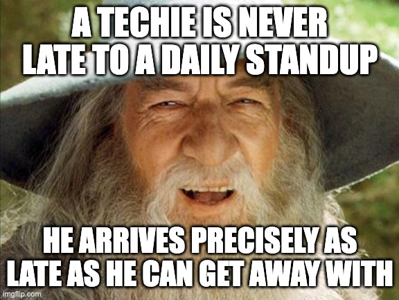
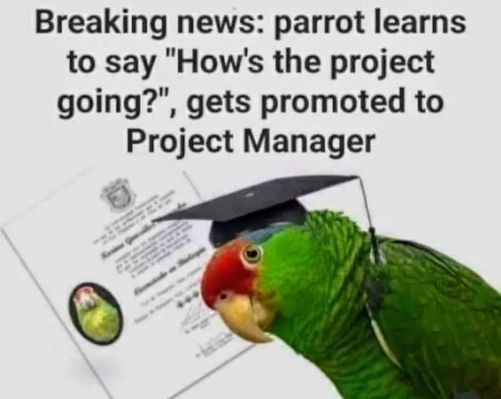

# Agile

<!-- INDEX_START -->

- [Meetings](#meetings)
- [Memes](#memes)
  - [Hired Project Manager](#hired-project-manager)
  - [Parrot](#parrot)

<!-- INDEX_END -->

## Meetings

Agile meetings suck.

Run one of these live meeting cost tickers during it to remind people what a waste of time and money it is:

- <https://meetingcost.live/>
- <https://meeting-cost-ticker.com/>

## Memes

### Hired Project Manager

### A Techie is Never Late to Daily Standup

A waste of time from an engineer's perspective that could be replaced with 2-3 bullet points in a chat message...

### Parrot

