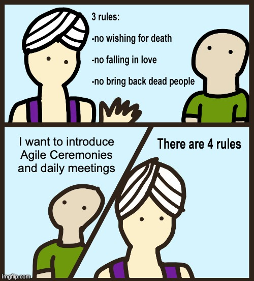
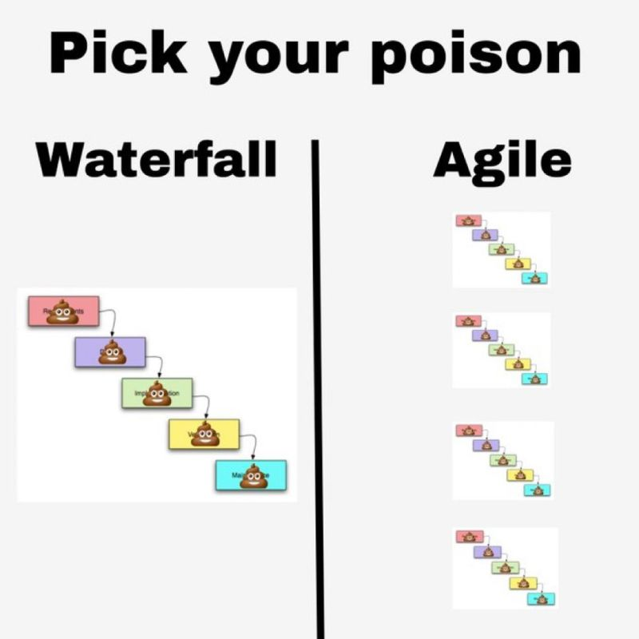
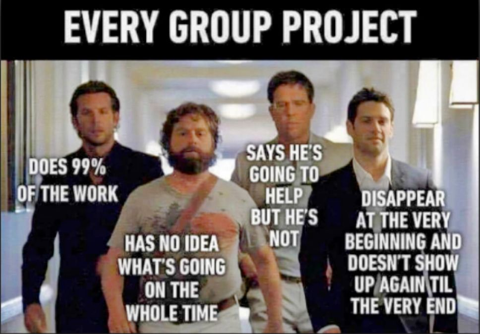
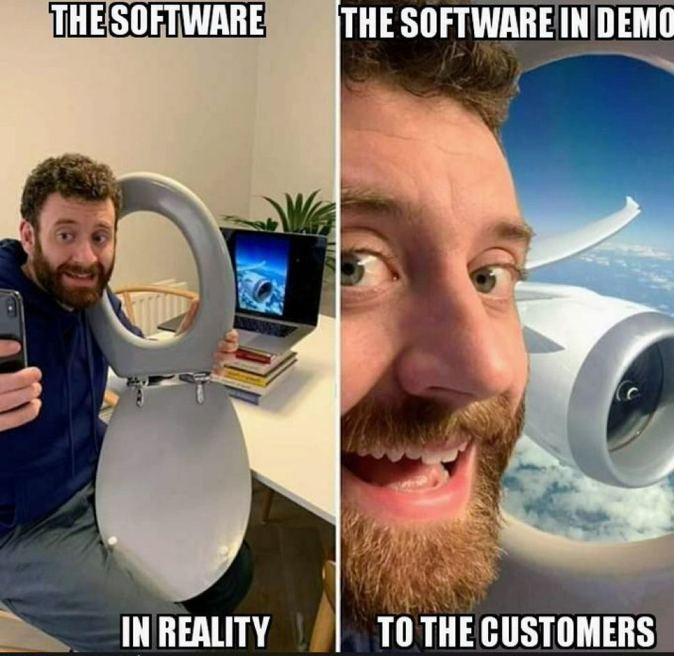
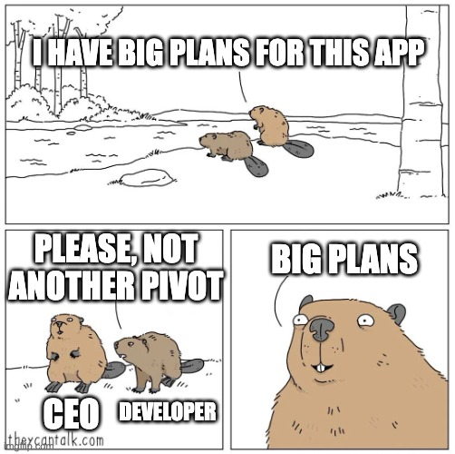

# Agile

<!-- INDEX_START -->

- [Meetings](#meetings)
- [Memes](#memes)
  - [Hired Project Manager](#hired-project-manager)
  - [Parrot](#parrot)
  - [Genie - 3 Rules](#genie---3-rules)
  - [A Techie is Never Late to Daily Standup](#a-techie-is-never-late-to-daily-standup)
  - [Waterfall vs Agile - Pick Your Poison](#waterfall-vs-agile---pick-your-poison)
  - [Every Group Project](#every-group-project)
  - [Agile MVP](#agile-mvp)
  - [Big Plans Beaver CEO](#big-plans-beaver-ceo)

<!-- INDEX_END -->

## Meetings

Agile meetings suck.

Run one of these live meeting cost tickers during it to remind people what a waste of time and money it is:

- <https://meetingcost.live/>
- <https://meeting-cost-ticker.com/>

## Memes

### Hired Project Manager

### Parrot

### Genie - 3 Rules

### A Techie is Never Late to Daily Standup

A waste of time from an engineer's perspective that could be replaced with 2-3 bullet points in a chat message...

### Waterfall vs Agile - Pick Your Poison

### Every Group Project

### Agile MVP

### Big Plans Beaver CEO

