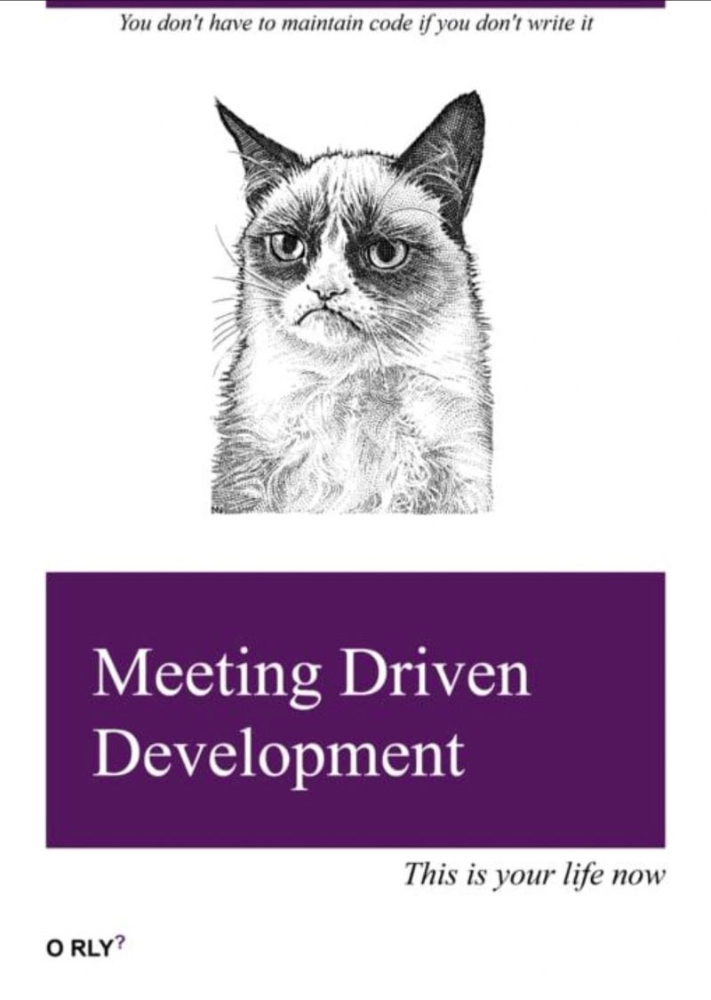

# Agile

<!-- INDEX_START -->

- [Meetings](#meetings)
- [Memes](#memes)
  - [Hired Project Manager](#hired-project-manager)
  - [Parrot](#parrot)
  - [Genie - 3 Rules](#genie---3-rules)
  - [A Techie is Never Late to Daily Standup](#a-techie-is-never-late-to-daily-standup)
  - [Waterfall vs Agile - Pick Your Poison](#waterfall-vs-agile---pick-your-poison)
  - [Every Group Project](#every-group-project)
  - [Agile MVP](#agile-mvp)
  - [Big Plans Beaver](#big-plans-beaver)
  - [Born Too Early, Late](#born-too-early-late)
  - [Ask Dedicated Scrum Master What They Do After Scrum Meeting](#ask-dedicated-scrum-master-what-they-do-after-scrum-meeting)
  - [The Morning After a Night of Heavy Drinking](#the-morning-after-a-night-of-heavy-drinking)
  - [Meeting Driven Development](#meeting-driven-development)
  - [Agile - Change a Lightbulb](#agile---change-a-lightbulb)

<!-- INDEX_END -->

## Meetings

Agile meetings suck.

Run one of these live meeting cost tickers during it to remind people what a waste of time and money it is:

- <https://meetingcost.live/>
- <https://meeting-cost-ticker.com/>

## Memes

### Hired Project Manager

### Parrot

### Genie - 3 Rules

### A Techie is Never Late to Daily Standup

A waste of time from an engineer's perspective that could be replaced with 2-3 bullet points in a chat message...

### Waterfall vs Agile - Pick Your Poison

### Every Group Project

### Agile MVP

### Big Plans Beaver

### Born Too Early, Late

### Ask Dedicated Scrum Master What They Do After Scrum Meeting

### The Morning After a Night of Heavy Drinking

The morning after a night of heavy drinking, when she advocated in favour of Agile...

### Meeting Driven Development

### Agile - Change a Lightbulb

