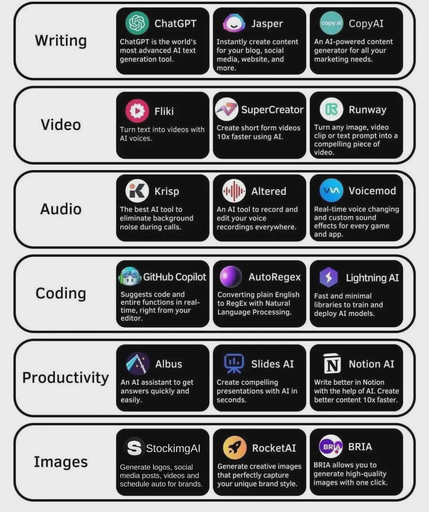
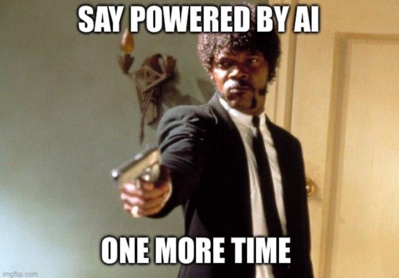

# AI - Artificial Intelligence

Mostly narrow AI.

General AI mirroring what humans have is not real yet.

<!-- INDEX_START -->

- [Learning](#learning)
- [Chat](#chat)
  - [ChatGPT](#chatgpt)
  - [SQL Chat](#sql-chat)
  - [LLM](#llm)
    - [Ollama](#ollama)
- [Text to Speech](#text-to-speech)
- [Grammar](#grammar)
- [Video](#video)
- [UI](#ui)
- [Coding](#coding)
- [Meme](#meme)
  - [Say Powered by AI One More Time](#say-powered-by-ai-one-more-time)
  - [Coding with GPT](#coding-with-gpt)

<!-- INDEX_END -->

## Learning

<https://www.cloudskillsboost.google/paths/118>

## Chat

### ChatGPT

<https://chat.openai.com/chat>

### SQL Chat

- [SQL Chat](https://github.com/sqlchat/sqlchat) - chat-based interface to querying DBs

### LLM

#### Ollama

<https://www.ollama.com>

<https://github.com/ollama/ollama>

Ollama Open WebUI + engine which is prompt-based, similar to ChatGPT, ask questions, get responses.
It's completely local, it doesn't go to the internet.

Engine nodes run on GPUs.

The query response is very slow and prints a few words a second when using CPUs instead of GPUs.

Performance decline after consecutive questions.

Why does the performance degrade after one query?

## Text to Speech

- [ElevenLabs](https://elevenlabs.io)

## Grammar

- [Grammarly](https://app.grammarly.com>)
- [HemingwayApp](https://hemingwayapp.com)

## Video

- [InVideo AI](https://invideo.io/)

## UI

- [Uizard](https://uizard.io) - <https://app.uizard.io>

## Coding

- [GitHub CoPilot](https://github.com/features/copilot)
- [TabNine](https://www.tabnine.com) - support for all major IDEs including my favourite [IntelliJ](intellij.md)
- [Cursor AI](https://www.cursor.com) - separate Editor that requires download, limited completions in free edition

## List of AI Tools By Categories

## Meme

### Say Powered by AI One More Time

### Coding with GPT

Watch out for that quality and not knowing WTF you're doing!

