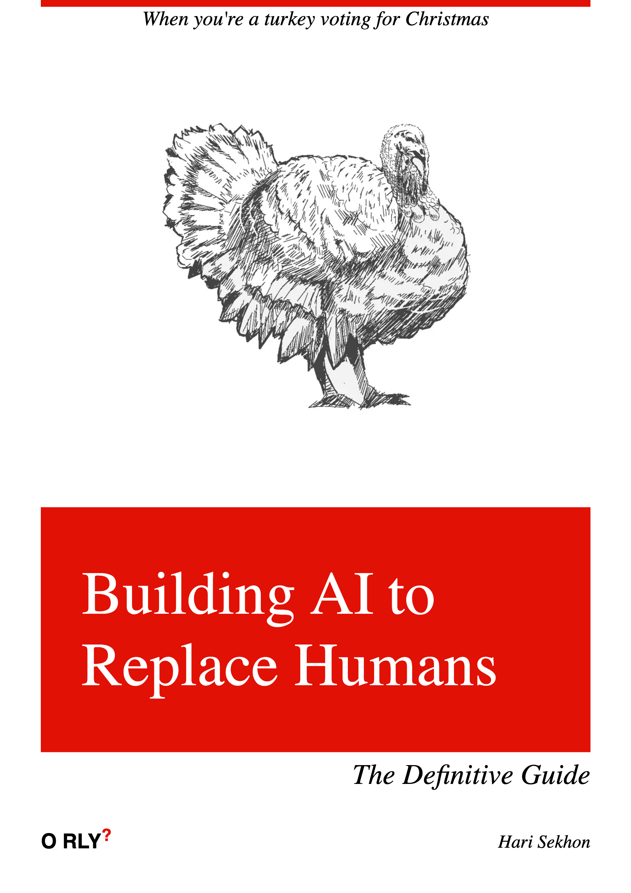
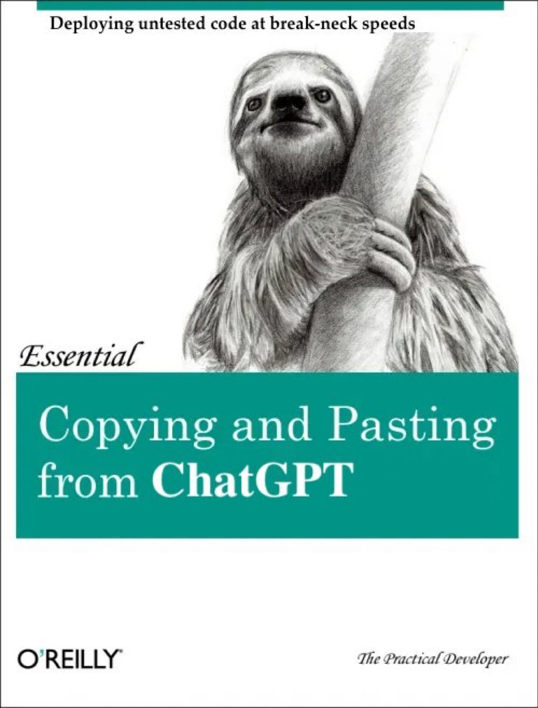
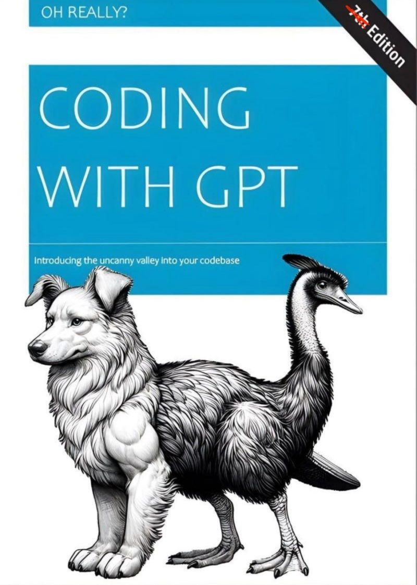
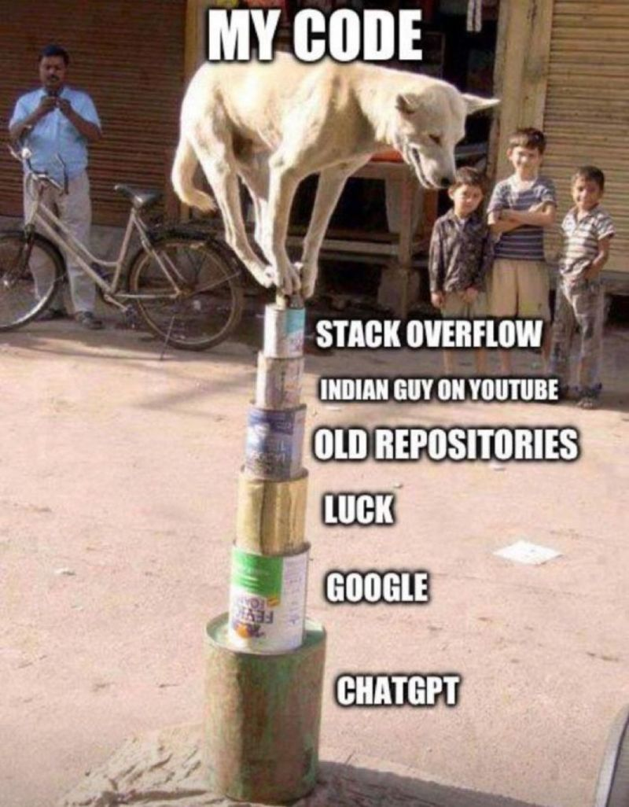
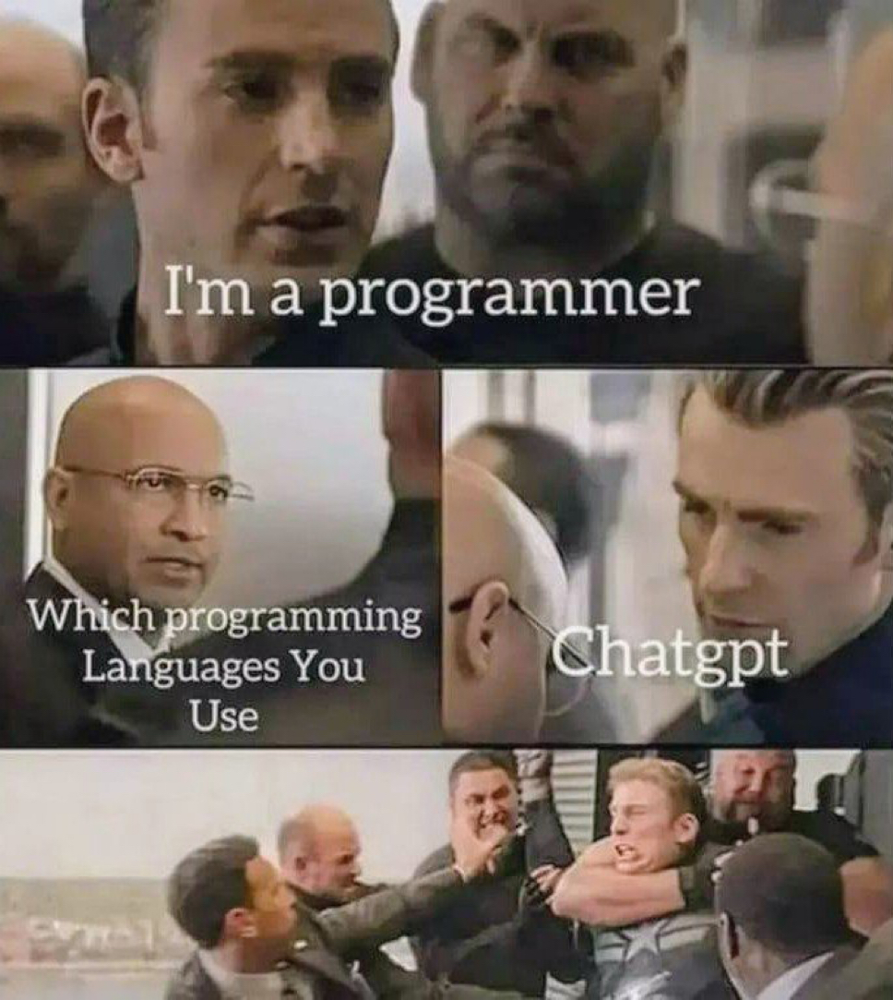
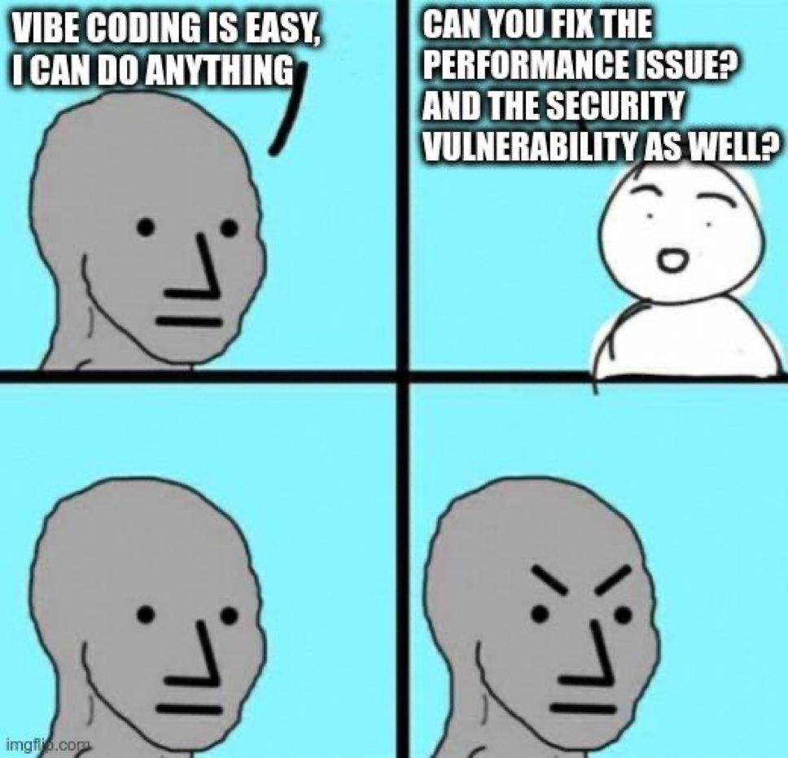
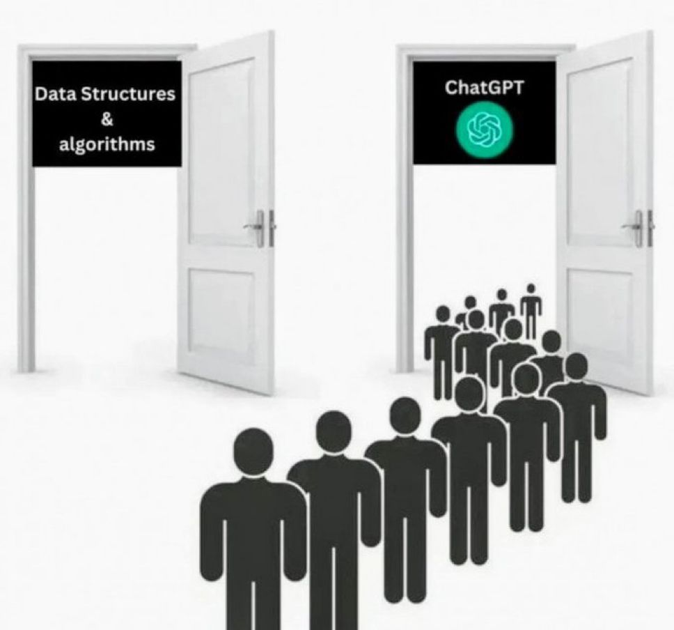
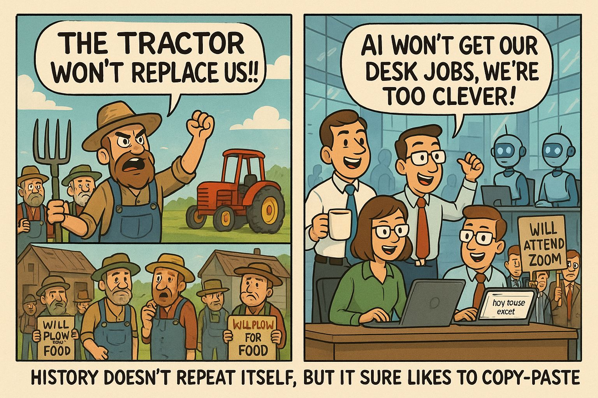
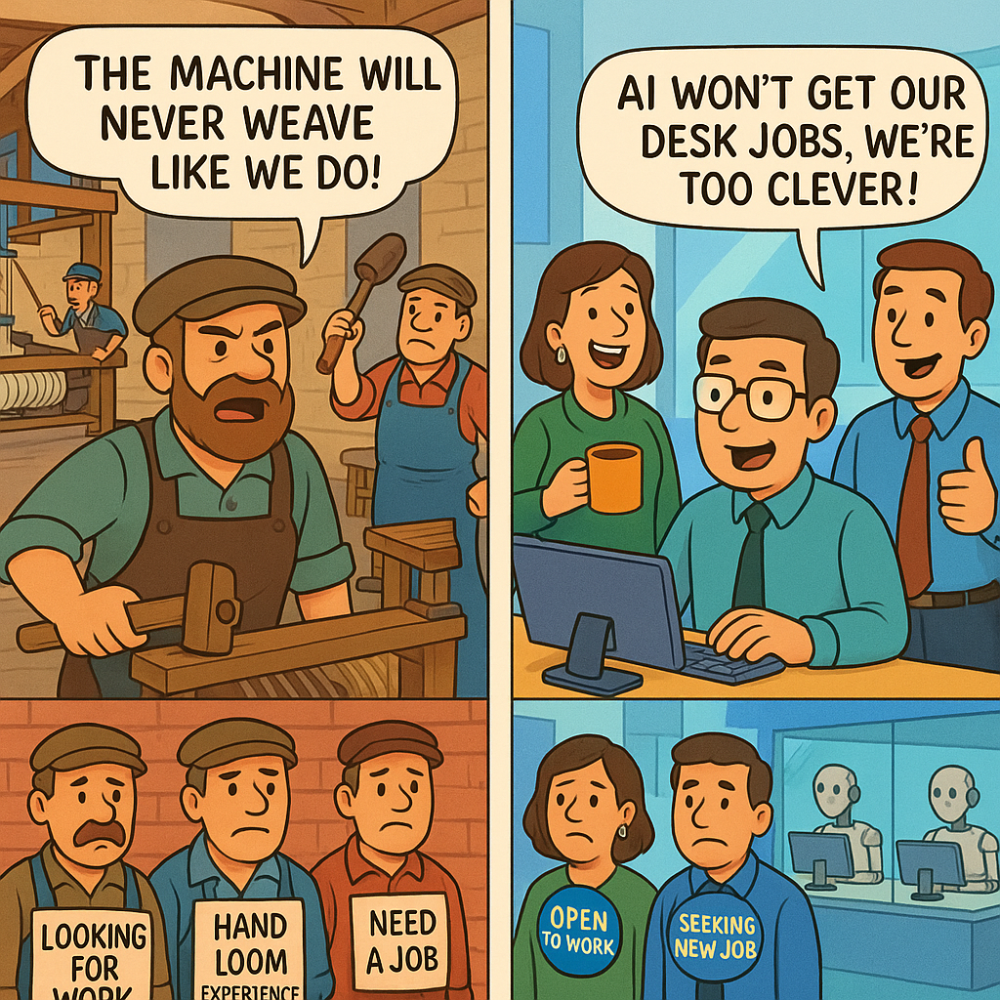
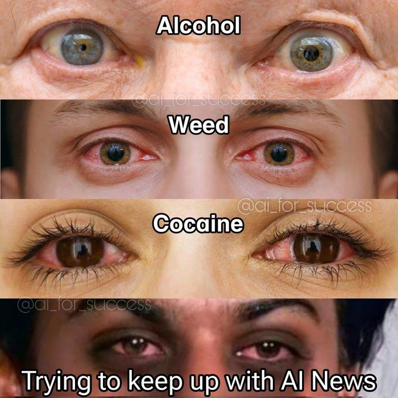

# AI - Artificial Intelligence

These are _"Narrow AI"_ - specialized for specific tasks only.

AGI - _"Artificial General Intelligence"_ - mirroring everything humans can do - is not real yet.

<!-- INDEX_START -->

- [Learning](#learning)
- [Run AI with API](#run-ai-with-api)
- [Chat LLMs](#chat-llms)
  - [ChatGPT](#chatgpt)
  - [Deepseek](#deepseek)
  - [Grok](#grok)
  - [Claude](#claude)
  - [Google Gemini](#google-gemini)
    - [Google AI Studio - Gemini](#google-ai-studio---gemini)
  - [Meta AI](#meta-ai)
  - [Perplexity](#perplexity)
  - [SQL Chat](#sql-chat)
  - [Open Source LLMs](#open-source-llms)
    - [Ollama](#ollama)
- [Chat LLM Tips](#chat-llm-tips)
  - [Reliability](#reliability)
  - [Safety](#safety)
  - [Current Knowledge](#current-knowledge)
  - [Context Windows](#context-windows)
  - [Thinking vs Non-Thinking Models](#thinking-vs-non-thinking-models)
  - [Tool Use](#tool-use)
- [Text to Speech](#text-to-speech)
- [Speech to Text](#speech-to-text)
  - [Wordly.ai](#wordlyai)
  - [Otter.ai](#otterai)
  - [Plaud.ai](#plaudai)
  - [OpenAI Whisper](#openai-whisper)
    - [OpenAI Whisper Install](#openai-whisper-install)
    - [OpenAI Whisper Run CLI](#openai-whisper-run-cli)
    - [OpenAI Whisper Run from Python](#openai-whisper-run-from-python)
- [Grammar](#grammar)
- [Visual](#visual)
  - [Image](#image)
  - [Video](#video)
  - [Presentation](#presentation)
    - [Gamma](#gamma)
- [UI](#ui)
- [App Generation](#app-generation)
- [Coding](#coding)
- [RAG - Retrieval Augmented Generation](#rag---retrieval-augmented-generation)
- [Debugging](#debugging)
- [Job Search](#job-search)
- [List of AI Tools By Categories](#list-of-ai-tools-by-categories)
- [Memes](#memes)
  - [LLM - How to Plagiarize Like a Pro](#llm---how-to-plagiarize-like-a-pro)
  - [Building AI to Replace Humans](#building-ai-to-replace-humans)
  - [Fewer Devs, Fewer Managers](#fewer-devs-fewer-managers)
- [Copying and Pasting from ChatGPT](#copying-and-pasting-from-chatgpt)
  - [Say Powered by AI One More Time](#say-powered-by-ai-one-more-time)
  - [Coding with GPT](#coding-with-gpt)
  - [My Code Stack Overflow, ChatGPT](#my-code-stack-overflow-chatgpt)
  - [Speak Softly in House](#speak-softly-in-house)
  - [Chuck Norris](#chuck-norris)
  - [Your Future Doctor is using ChatGPT to Pass Exams](#your-future-doctor-is-using-chatgpt-to-pass-exams)
  - [I'm a Programmer](#im-a-programmer)
  - [AI Finger Hack - Inadmissable Evidence](#ai-finger-hack---inadmissable-evidence)
  - [Sales Guys wants to use Blockchain & AI](#sales-guys-wants-to-use-blockchain--ai)
  - [Vibe Coding is Easy](#vibe-coding-is-easy)
  - [Guys Who Thank ChatGPT](#guys-who-thank-chatgpt)
  - [ChatGPT vs Learning Data Structure and Algorithms](#chatgpt-vs-learning-data-structure-and-algorithms)
  - [AI vs Jobs](#ai-vs-jobs)
  - [Trying to Keep Up With AI News](#trying-to-keep-up-with-ai-news)

<!-- INDEX_END -->

## Learning

<https://www.cloudskillsboost.google/paths/118>

## Run AI with API

- [Replicate](https://replicate.com/)

## Chat LLMs

### ChatGPT

<https://chat.openai.com/chat>

[:octocat: Awesome ChatGPT Prompts](https://github.com/f/awesome-chatgpt-prompts)

By OpenAI, not open, closed source, but the first public LLM.

[OpenAI Cookbook](https://cookbook.openai.com/)

### Deepseek

<https://chat.deepseek.com/>

### Grok

<https://x.com/i/grok>

By X (formerly Twitter) and Elon Musk.

### Claude

<https://claude.ai>

By Anthropic, known to be better for coding.

### Google Gemini

<https://gemini.google.com>

#### Google AI Studio - Gemini

<https://aistudio.google.com/>

### Meta AI

<https://www.meta.ai/>

### Perplexity

<https://www.perplexity.ai/>

### SQL Chat

- [SQL Chat](https://github.com/sqlchat/sqlchat) - chat-based interface to querying DBs

### Open Source LLMs

#### Ollama

<https://www.ollama.com>

<https://github.com/ollama/ollama>

Ollama Open WebUI + engine which is prompt-based, similar to ChatGPT, ask questions, get responses.
It's completely local, it doesn't go to the internet.

Engine nodes run on GPUs.

The query response is very slow and prints a few words a second when using CPUs instead of GPUs.

Performance decline after consecutive questions.

Why does the performance degrade after one query?

## Chat LLM Tips

### Reliability

LLMs are probabilistic and sometimes hallucinate wrong answers.

You should be double checking answers, but this leads to an obvious problem,
what is the point of asking something when you are not confident of the answers?

This is safer for simple things which you can immediately verify yourself,
such as some bit of knowledge you forgot but recognize when you see it,
or where it is giving you citation source links to web pages that you can click through to double check.

### Safety

It is not safe to just copy and paste code from AI -
it is often not just sub-optimal but actually contains serious security vulnerabilities such as SQL Injection or
Code Injection.

Only veteran senior engineers who already know all this stuff and can spot and correct such things should be using AI
for coding.

You wouldn't for example let an AI handle anything important without knowing what you're doing in that field yourself so
you can catch mistakes that could have serious real-life consequences.

### Current Knowledge

Since pre-training is expensive and time consuming, LLMs knowledge is often a few months out of date.

More recent LLM models (ChatGPT, Grok, Perplexity)
now detect and search the internet for knowledge
not contained in them model in order to deliver answers on things that are more recent,
such as new TV episodes or current events.

If the model cannot do an internet search for the the new information,
it will usually tell you that it doesn't contain the knowledge you've asked since it was trained before the relevant
date.

Models with internet search are more useful
because you can use them to querying many recent web pages and summarize what you want to know very quickly.

It's also important when querying for things that might change, such as current events,
such as asking about a given company or technology's capabilities, which could be added or updated any time,
you want a model that can search and check the latest information on the internet for you.

### Context Windows

Since LLMs are predicting the next word based on tokens,
start a New Chat for a clean context when switching topics to improve the accuracy and speed of the response
without the model getting distracted or confused by previous tokens in the context window.

### Thinking vs Non-Thinking Models

Thinking models have better reasoning but they are slower and more expensive to run,
and therefore usually behind paywall subscriptions in the services below.

So simple knowledge recall a non-thinking model with sufficient and faster.

Thinking models may give better results for complex problem solving, such as debugging code.

There is usually a drop down or button in the web page to switch between the different generations of models,
some of which are thinking, some of which aren't, so you can tune which one is more appropriate to your use case.

### Tool Use

Some LLMs like ChatGPT recognize when to outsource to tools to get answers,
such as automatically running a
[Python](python.md) or
[Javascript](javascript.md) interpreter and then feeding the result back.

A simple example is a basic multiplication that can be done via memory recall, like we humans do, versus a more complex
maths calculation that it needs to use a calculator or programming interpreter like Python or Javascript to solve.

## Text to Speech

- [ElevenLabs](https://elevenlabs.io)

## Speech to Text

### Wordly.ai

<https://attend.wordly.ai> - I found out about this by a guy sitting next to me getting a real-time translation at
BTC Prague 2025.

### Otter.ai

<https://otter.ai/>

Proprietary subscription, not bothering with it, used OpenAI Whisper below for free instead.

### Plaud.ai

<https://www.plaud.ai/>

Portable devices to record and transcript using AI.

### OpenAI Whisper

[:octocat: openai/whisper](https://github.com/openai/whisper)

#### OpenAI Whisper Install

Installs locally, downloads a model and runs on a local video or audio file.

Install on Mac:

```shell
brew install openai-whisper
```

or generic Python install

```shell
pip install openai-whisper
```

Also requires `ffmpeg` to be installed.

On Mac:

```shell
brew install ffmpeg
```

or on Debian / Ubuntu Linux:

```shell
sudo apt update &&
sudo apt install ffmpeg -y
```

#### OpenAI Whisper Run CLI

List of [Available Models](https://github.com/openai/whisper#available-models-and-languages).

Run whisper, using the `--turbo` model (will take a while to download the model the first time):

```shell
whisper "$file" --turbo
```

Outputs the text transcript from the video or audio file to stdout,
as well as creating `.txt`, `.srt`, `.json`, `.tsv` and `.vtt` formatted transcripts for further processing.

#### OpenAI Whisper Run from Python

```python
import whisper

model = whisper.load_model("turbo")
result = model.transcribe("audio.mp3")
print(result["text"])
```

## Grammar

- [Grammarly](https://app.grammarly.com>)
- [HemingwayApp](https://hemingwayapp.com)

## Visual

### Image

<https://www.meta.ai/>

### Video

- [InVideo AI](https://invideo.io/) - generate high production quality videos from text prompts
- [LumaLabs Dream Machine](https://lumalabs.ai/dream-machine) - pics or video
- [Kawping](https://www.kapwing.com/)
- [Canva](https://www.canva.com/)

<!--

#### Translate Video

<https://clideo.com/translate-instagram-video>

#### Translate Video on Instagram

<https://videotranslator.blipcut.com/instagram-video-translator.html>

-->

### Presentation

#### Gamma

<https://gamma.app/>

Designs presentations, websites, social media posts etc.

## UI

- [Uizard](https://uizard.io) - <https://app.uizard.io>

## App Generation

Idea to app in seconds.

- [Replit](https://replit.com/)
- [Lovable](https://lovable.dev/)
- [Bubble](https://bubble.io/)
- [Flutterflow](https://www.flutterflow.io/)
- [Relevance AI](https://relevanceai.com/)
- [GenSpark](https://www.genspark.ai/)
- [Manus](https://manus.im/)
- [MKStack](https://mkstack.xyz) - build Nostr apps from prompt

## Coding

- [GitHub CoPilot](https://github.com/features/copilot)
  - [CoPilot Chat Cookbook](https://docs.github.com/en/copilot/copilot-chat-cookbook)
- [TabNine](https://www.tabnine.com) - support for all major IDEs including my favourite [IntelliJ](intellij.md), no longer a free tier
- [Cursor AI](https://www.cursor.com) - separate Editor that requires download, limited completions in free edition
- [Agentic](https://www.agentic.ai/)
- [Windsurf](https://windsurf.com/editor)

## RAG - Retrieval Augmented Generation

Combines LLM with referencing an authoritative traditional Knowledge Base before it answers.

<https://www.promptingguide.ai/techniques/rag>

<https://blogs.nvidia.com/blog/what-is-retrieval-augmented-generation/>

<https://cloud.google.com/use-cases/retrieval-augmented-generation?hl=en>

<https://aws.amazon.com/what-is/retrieval-augmented-generation/>

<https://learn.microsoft.com/en-us/azure/search/retrieval-augmented-generation-overview>

## Debugging

- [:octocat: robusta-dev/holmesgpt](https://github.com/robusta-dev/holmesgpt)

## Job Search

- [MobiusAI](https://www.mobiusengine.ai/)

## List of AI Tools By Categories


## Memes

### LLM - How to Plagiarize Like a Pro


### Building AI to Replace Humans



### Fewer Devs, Fewer Managers


## Copying and Pasting from ChatGPT



### Say Powered by AI One More Time


### Coding with GPT

Watch out for that quality and not knowing WTF you're doing!



### My Code Stack Overflow, ChatGPT



### Speak Softly in House


### Chuck Norris


### Your Future Doctor is using ChatGPT to Pass Exams


### I'm a Programmer



### AI Finger Hack - Inadmissable Evidence


### Sales Guys wants to use Blockchain & AI


### Vibe Coding is Easy



### Guys Who Thank ChatGPT


### ChatGPT vs Learning Data Structure and Algorithms



### AI vs Jobs

Credit to [Claudio Viola](https://www.linkedin.com/in/claudio-remote-full-stack-software-engineer/) on LinkedIn
for creating these using the ChatGPT AI.





### Trying to Keep Up With AI News


