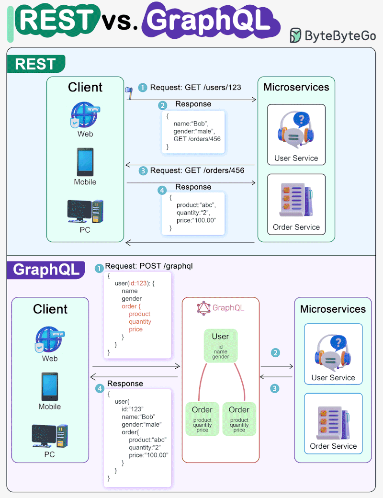

# APIs

Application Programming Interfaces.

<!-- INDEX_START -->

- [Rest APIs](#rest-apis)
- [Rest vs GraphQL](#rest-vs-graphql)
- [Memes](#memes)
  - [When API Design Sucks](#when-api-design-sucks)

<!-- INDEX_END -->

## Rest APIs

<https://www.redhat.com/en/topics/api/what-is-a-rest-api>

## Rest vs GraphQL

## Memes

### When API Design Sucks

GraphQL returns 200 OK contrary to other API standards, making error handling more annoying / difficult.

