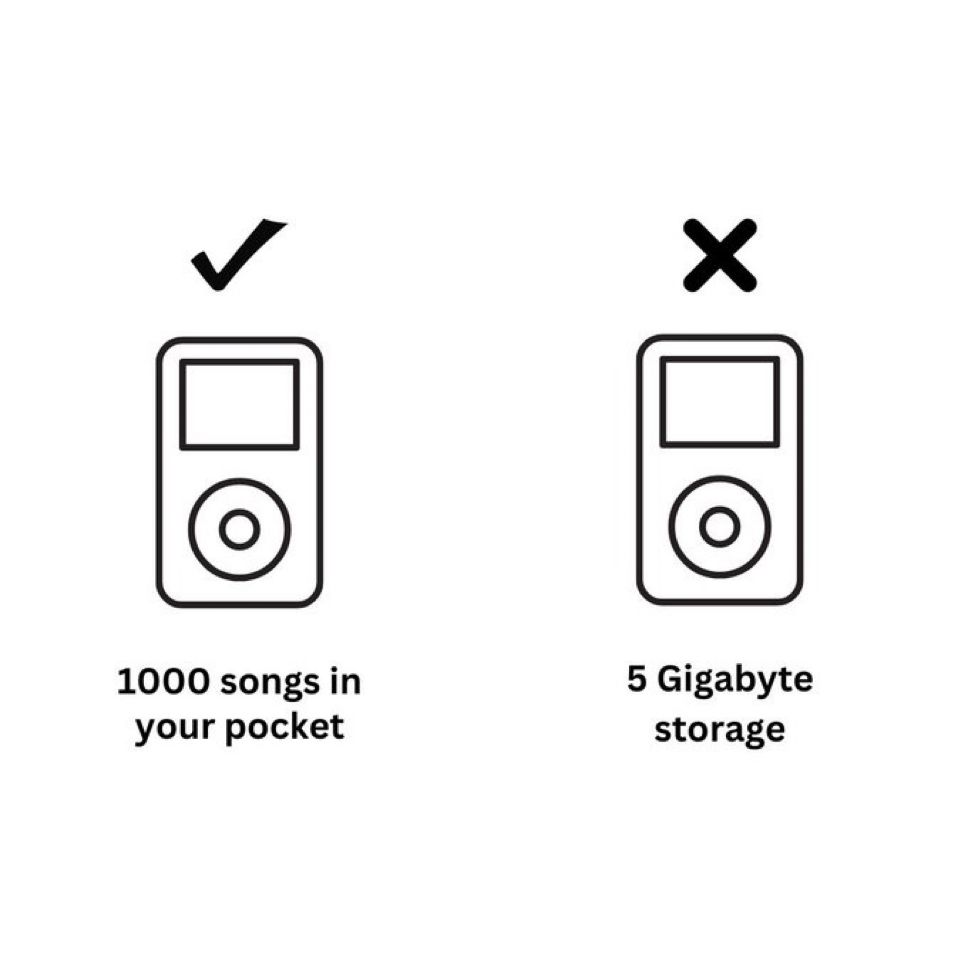

# Audio

<!-- INDEX_START -->

- [Spotify](#spotify)
  - [Clear Local Spotify Desktop Cache](#clear-local-spotify-desktop-cache)
- [Shazam Songs while using Headphones on Mac](#shazam-songs-while-using-headphones-on-mac)
  - [Automatically Switch to Using Multi-Output Device when Connecting Headphones](#automatically-switch-to-using-multi-output-device-when-connecting-headphones)
- [MP3 metadata editing](#mp3-metadata-editing)
  - [Setting Author and Album metadata](#setting-author-and-album-metadata)
  - [Setting Track Number metadata](#setting-track-number-metadata)
  - [Recursively Set Metadata](#recursively-set-metadata)
    - [Recursively Set Artist and Album](#recursively-set-artist-and-album)
    - [Recursively Set Track Order](#recursively-set-track-order)
- [Memes](#memes)
  - [Marketing Matters](#marketing-matters)

<!-- INDEX_END -->

## Spotify

### Clear Local Spotify Desktop Cache

Close Spotify, delete the cache and then re-open the app.

On Mac:

```shell
rm -rf ~/Library/"Application Support"/Spotify/PersistentCache/Storage
```

On Linux:

```shell
rm -rf ~/.cache/spotify/Storage
```

## Shazam Songs while using Headphones on Mac

Capture those tunes from your favourite movies or TV shows while you're listening with headphones.

Create an aggregate multi-output audio device with your headphones and a dummy output,
and then point Shazam to the dummy output to link it to the audio.

On Mac, you can do this by:

1. install [Blackhole](https://existential.audio/blackhole/) (choose the 2ch device)

```shell
brew install --cask blackhole-2ch
```

2. restart for the new Blackhole 2ch device to be usable

3. `Cmd`+`Space` to open Spotlight  and search for `Audio Midi Setup App`

or from the command line:

```shell
open -a "Audio Midi Setup"
```

4. Click `+` and `Create Multi-Output Device`
5. Add your headphones and `Blackhole 2ch` to the multi-output audio device
6. Switch the sound output to use the new Multi-Output Device, via GUI or on the command line:

```shell
brew install switchaudio-osx
```

```shell
SwitchAudioSource -t output -s "Multi-Output Device"
```

7. The Shazam app settings follows the system sound input device, set it to use the `Blackhole 2ch` device

```shell
SwitchAudioSource -t input -s "BlackHole 2ch"
```

8. Shazam away!

```shell
open -a Shazam
```

### Automatically Switch to Using Multi-Output Device when Connecting Headphones

When I connect my AirPods they become the sound input and output device,
and this needs to be switched back to the blackhole input and multi-output device to be able to Shazam again.

You can automate this by triggering the `SwitchAudioSource` command upon a system event using Hammerspoon to trigger
whenever AirPods connect to bluetooth.

Install Hammerspoon as a system event handler to trigger your `SwitchAudioSource` command.

See the Mac page's [Hammerspoon - System Event Handler](mac.md#hammerspoon---system-event-handler) section for
setting up Hammerspoon with the exact Hammerspoon Lua code
I use to trigger this automated switch back to the first Multi-Output and BlackHole input devices found.

## MP3 metadata editing

Use the `id3v2` program to set metadata on mp3 files.

Useful to group a bunch of mp3 files for an audiobook.

### Setting Author and Album metadata

Set the `--author` / `-a` and `--album` / `-A` tags at once so Mac's `Books.app` groups them properly into one audiobook:

```shell
id3v2 -a "MyAuthor" -A "MyAlbum" *.mp3
```

The scripts `mp3_set_artist.sh` and `mp3_set_album.sh` in the [DevOps-Bash-tools](devops-bash-tools.md) repo's `media/`
directory make it slightly easier.

### Setting Track Number metadata

Set the `--track` number for each mp3 file, so they play in the right order:

```shell
i=0
for x in *.mp3; do
  ((i+=1))
  id3v2 -T $i "$x"
done
```

The scripts `mp3_set_track_order.sh` and `mp3_set_track_name.sh` in the [DevOps-Bash-tools](devops-bash-tools.md) repo's `media/`
directory make this slightly easier.

### Recursively Set Metadata

#### Recursively Set Artist and Album

**XXX: Danger - use only in an audiobook subdirectory, otherwise it'll ruin the metadata of your MP3 library!**

```shell
find . -maxdepth 2 -iname '*.mp3' |
{
  i=0
  while read mp3; do
    ((i+=1))
    id3v2 -a "MyAuthor" -A "MyAlbum" "$mp3"
  done
}
```

#### Recursively Set Track Order

For subdirectories eg. CD1, CD2 etc...

**XXX: Danger - use with care - if misused at the top dir it'd ruin your MP3 library's metadata!**

```shell
find . -maxdepth 2 -iname '*.mp3' |
{
  i=0
  while read mp3; do
    ((i+=1))
    id3v2 -T $i "$mp3"
  done
}
```

## Memes

### Marketing Matters


