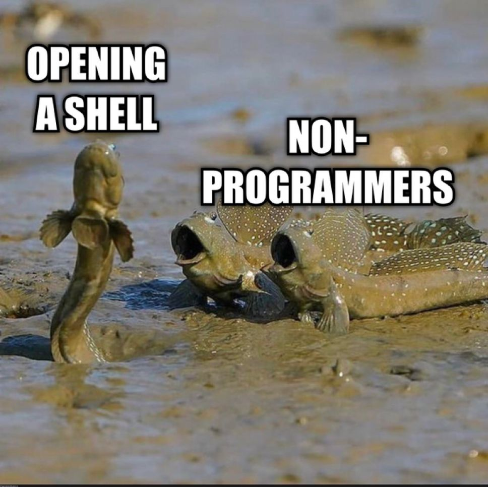

# Bash - Shell & Scripting

This is the standard modern shell. You should always script in Bash for portability.

It's a rare exception where you'd need to script in the original Bourne shell
(bootstrapping [Alpine](https://github.com/HariSekhon/Dockerfiles/blob/master/alpine-dev/Dockerfile)
is one of the few use cases for that).

## Index

<!-- INDEX_START -->

- [Core Reading Material](#core-reading-material)
  - [Books](#books)
  - [Free](#free)
- [Bash vs Other Languages](#bash-vs-other-languages)
  - [Error Handling in Bash](#error-handling-in-bash)
- [Advanced Library of Scripts](#advanced-library-of-scripts)
- [Perl, Awk, Sed](#perl-awk-sed)
- [JSON](#json)
- [Binaries Debugging](#binaries-debugging)
- [Commands](#commands)
- [Tips & Tricks](#tips--tricks)
  - [Shell One Liners](#shell-one-liners)
  - [Pass Process Output as a File Handle](#pass-process-output-as-a-file-handle)
  - [Fifos](#fifos)
  - [Miscellaneous Bash Bangs](#miscellaneous-bash-bangs)
  - [Flush Stdout Immediately](#flush-stdout-immediately)
  - [Native Regex Capture](#native-regex-capture)
  - [Readline Support - `rlwrap`](#readline-support---rlwrap)
  - [Copy to Both Clipboard and Stdout simultaneously](#copy-to-both-clipboard-and-stdout-simultaneously)
  - [Wait for a Terminal prompt from inside a while loop](#wait-for-a-terminal-prompt-from-inside-a-while-loop)
- [Debugging](#debugging)
  - [Shell executing tracing](#shell-executing-tracing)
  - [Fail on any error exit code](#fail-on-any-error-exit-code)
  - [Fail if accessing any unset variable](#fail-if-accessing-any-unset-variable)
  - [Clean Shell](#clean-shell)
- [Other Cool Resources](#other-cool-resources)
- [Style Guide](#style-guide)
- [More Useful Commands](#more-useful-commands)
  - [Delete a trailing blank line of a file](#delete-a-trailing-blank-line-of-a-file)
- [Memes](#memes)
  - [Opening a Shell, Non-Programmers](#opening-a-shell-non-programmers)
  - [Bash Scripting: Essential DevOps](#bash-scripting-essential-devops)

<!-- INDEX_END -->

## Core Reading Material

### Books

- [Classic Shell Scripting](https://www.amazon.com/Classic-Shell-Scripting-Arnold-Robbins/dp/0596005954)
- [Bash CookBook](https://www.amazon.com/bash-Cookbook-Solutions-Examples-Users/dp/1491975334/)
- [Unix Power Tools](https://www.amazon.com/Power-Tools-Third-Shelley-Powers/dp/0596003307/)

### Free

- [Advanced Bash Scripting Guide (HTML)](https://tldp.org/LDP/abs/html/)
- [Advanced Bash Scripting Guide (PDF)](https://tldp.org/LDP/abs/abs-guide.pdf)

## Bash vs Other Languages

You may occasionally see the following in DevOps job specs:

> 10 lines of Bash is better than 100 lines of Java

This true, but also, if you're only writing 100 lines of Java you probably don't have enough error handling.

### Error Handling in Bash

All scripts should have the following set at the top of them.

If you haven't accounted for all the exit codes and variables in the script,
it should crash for safety like other languages until you fix your code.

```shell
set -euo pipefail
```

See the [Debugging](#debugging) section further down for details.

## Advanced Library of Scripts

1000+ DevOps Bash Scripts

AWS, GCP, Kubernetes, Docker, CI/CD, APIs, SQL, PostgreSQL, MySQL, Hive, Impala, Kafka,
Hadoop, Jenkins, GitHub, GitLab, BitBucket, Azure DevOps, TeamCity, Spotify, MP3, LDAP, Code/Build Linting, pkg mgmt
for Linux, Mac, Python, Perl, Ruby, NodeJS, Golang etc.

Also contains advanced configs. eg: `.bashrc`, `.vimrc`, `.gitconfig`, `.
screenrc`, `.tmux.conf` etc.

[:octocat: HariSekhon/DevOps-Bash-tools](https://github.com/HariSekhon/DevOps-Bash-tools)

[](https://github.com/HariSekhon/DevOps-Bash-tools)

This is more than the manuals above, you could study this repo for years, or just run its scripts today to save you
the time.

## Perl, Awk, Sed

You need to learn at least some basic one-liners of [Perl](perl.md), Awk and Sed to be proficient in shell scripting.

You also need to learn [Regex](regex.md) to use these tools effectively.

## JSON

See the [JSON](json.md) doc for commands to help with processing JSON which is often output by modern Rest APIs.

## Binaries Debugging

See the [Binaries Debugging](binaries-debugging.md) doc for commands to examine and work with binaries.

## Commands

See Also:

- [Disk Management](disk.md) commands

Some less well known commands to remember:

| Command                                 | Description                                                                                                                                                                                                |
|-----------------------------------------|------------------------------------------------------------------------------------------------------------------------------------------------------------------------------------------------------------|
| `mktemp`                                | Creates an empty file atomically for you to use, avoiding race conditions of clashing with other scripts                                                                                                   |
| `cmp`                                   | compare whether two files diff. Shorter than doing an `md5sum` on both (`md5` on Mac)                                                                                                                      |
| `comm`                                  | print or omit lines are common or unique between two files                                                                                                                                                 |
| `expand`                                | expands tabs to spaces                                                                                                                                                                                     |
| `unexpand`                              | converts spaces to tabs                                                                                                                                                                                    |
| `fmt`                                   |                                                                                                                                                                                                            |
| `join`                                  | join matching records from multiple files                                                                                                                                                                  |
| `logger`                                | sends messages to the system log ie. syslog `/var/log/messages`                                                                                                                                            |
| `mail`                                  | send email from the command line                                                                                                                                                                           |
| `whatis`/ `proppos` / `man -k`          | search for man pages containing the argument string                                                                                                                                                        |
| `command`                               | execute a binary from the path instead of a function of the same name                                                                                                                                      |
| `builtin`                               | execute a shell builtin instead of a function of the same name                                                                                                                                             |
| `dialog`                                | create an interactive curses menu                                                                                                                                                                          |
| `say`                                   | Mac command that speaks the words piped in. I use this to impress my kids by making the computers talk                                                                                                     |
| `type`                                  | Tells you what a command is, path to binary or shell builtin. `-P` returns only binary                                                                                                                     |
| `xev`                                   | Prints the keystrokes to the Linux X server GUI                                                                                                                                                            |
| `tail --follow=name --retry <filename>` | GNU tail can retry and continue following a file if it's renamed                                                                                                                                           |
| `split`                                 | Split a text file into smaller parts by lines or bytes. Useful for parallel data processing                                                                                                                |
| `csplit`                                | Split with context by splitting on pattern such as regex                                                                                                                                                   |
| `pr -m`                                 | Prints files into columns                                                                                                                                                                                  |
| `column -t`                             | Prints stdin into aligned columns to tidy up output (used in various scripts in [DevOps-Bash-tools](https://github.com/HariSekhon/DevOps-Bash-tools)                                                       |
| `paste`                                 | merges text files to stdout eg. `paste -s -d+ \| bc`                                                                                                                                                       |
| `open`                                  | Mac command to open a URL in the default web browser                                                                                                                                                       |
| `xmessage`                              | Linux X GUI pop-up message command                                                                                                                                                                         |
| `xclip`                                 | Copy stdin to the Linux X UI clipboard, or the clipboard to stdout                                                                                                                                         |
| `pbcopy`                                | Copy stdin to the Mac UI clipboard                                                                                                                                                                         |
| `pbpaste`                               | Prints the Mac UI clipboard to stdout                                                                                                                                                                      |
| `gprof`                                 | Profile output of an executable's time in each system call. Compile with `gcc -pg` first                                                                                                                   |
| `expect`                                | Controls interactive programs by sending them timed input from an 'expect' script                                                                                                                          |
| `autoexpect`                            | Generate an `expect` script automatically from an interactive run                                                                                                                                          |
| `flock`                                 | File lock, useful for advanced scripting. I'd previously written [flock.pl](https://github.com/HariSekhon/DevOps-Perl-tools/blob/master/flock.pl) to allow shell scripts to using programming file locking |
| `script`                                | Copy everything you write in the shell to a file to record an outline of a script for you                                                                                                                  |
| `tee`                                   | Pipes output to one or more file arguments as well as stdout for further piping. The `-a` switch appends instead of overwrites the file                                                                    |
| `fold`                                  | Wraps text to the width specified by `-w N`. Use `-s`  to only fold on spaces, not mid-word                                                                                                                |
| `pandoc`                                | Universal document converter<br/>(eg. [generate_repos_markdown_table.sh](https://github.com/HariSekhon/Kubernetes-configs/blob/master/generate_repos_markdown_table.sh))                                   |
| `iconv`                                 | Convert between character encodings                                                                                                                                                                        |
| `hexyl`                                 | Hex terminal viewer [:octocat: sharkdp/hexyl](https://github.com/sharkdp/hexyl)                                                                                                                            |
| `file`                                  | Determines file type                                                                                                                                                                                       |
| `pig`                                   | Parallel implementation of `gzip`. Call in tar using the `-I` option: `tar czvf -I 'pigz -9' myfile.tar.gz *`                                                                                              |
| `runuser`                               | run a command with substitute user and group ID. Does not ask for a password because it may be executed by the root user only eg. when SSH to `ec2-user` on AWS EC2 VMs, `sudo runuser...`                 |
| `pstree`                                | Prints the process list as a tree to make it easier to see parent / child process relationships                                                                                                            |
| `stdbuf`                                | Immediately flush each stdout line for the command using `stdbuf -oL <command>`                                                                                                                            |
| `unbuffer`                              | Immediately flush each stdout line. From the `expect` package                                                                                                                                              |

Environment variables to keep in mind:

| Variable  | Description                                                                                        |
|-----------|----------------------------------------------------------------------------------------------------|
| `EDITOR`  | Set the editor to open automatically in unix commands like `visudo`                                |
| `CDPATH`  | List of directories that a `cd` command will take you to with only the basename                    |
| `RANDOM`  | A random integer up to 5 digits. Substring it for shorter eg. `${RANDOM:0:2}`                      |
| `TMOUT`   | Times out an interactive shell, script or `read` builtin after N seconds without input             |
| `SECONDS` | Incrementing integer of seconds, `SECONDS=0` to use it as a simple timer in a script or even shell |

## Tips & Tricks

### Shell One Liners

See the [Shell One Liners](shell-one-liners.md) page.

### Pass Process Output as a File Handle

Treat a process as a file handle to read from:

```shell
<(somecommand)
```

Treat a process as a file handle to write in to:

```shell
>(somecommand)
```

A neat trick is to `tee /dev/stderr` to have the output appear on your screen while also sending it onwards for further
processing in a shell pipeline.

```shell
echo stuff | tee /dev/stderr | xargs echo processing
```

Tee to two programs:

```shell
echo stuff | tee >(cat) | cat
```

### Fifos

Something that seemed cool in the 2000s was FIFO pipes (first in first out). These are special files that one process
can write into and another process can read from:

```shell
mkfifo /tmp/test.fifo
```

this hangs if there isn't another process reading from the fifo pseudo-file:

```shell
echo stuff > /tmp/test.fifo
```

in another shell:

```shell
cat /tmp/test.fifo
```

In practice, I can't recall finding a need for this since the 2000s. There usually better solutions.

FIFOs have no real security though and rely on file permissions to stop somebody or some other program writing unexpected
input into the listening program, which may not be coded defensively enough. In practice people just use temporary files
between processes not started in the same shell if they really have to. Situations which require long-running IPC would
probably be better done in a real programming language.

This is much easier than screwing around with complex sed magic or awk blocks.

### Miscellaneous Bash Bangs

- `!n` - re-runs command number `n` from the `history`
- `!$` - the last argument of the previous command, usually a filename from a previous command. Useful to run another
  command on the previous file operated on
- `!:n*` - takes the Nth arg to the end from the last command

### Flush Stdout Immediately

```shell
stdbuf -oL $command
```

```shell
script -q /dev/null $command
```

If `expect` package is installed:

```shell
unbuffer $command
```

For Awk:

```shell
awk '{ print $0; fflush() }'
```

For [Python](python.md) programs:

```shell
export PYTHONUNBUFFERED=1
```

or

```shell
python -u "$script"
```

### Native Regex Capture

```shell
regex='([[:alpha:]]+)-([[:digit:]]+)'

if [[ "ubuntu-22" =~ $regex ]]; then

    whole_match="${BASH_REMATCH[0]}"

    word="${BASH_REMATCH[1]}"

    integer="${BASH_REMATCH[2]}"

    echo "Whole Match: $whole_match"
    echo "Word Match: $word"
    echo "Integer Match: $integer"
fi
```

### Readline Support - `rlwrap`

Add readline support (command history - the ability to press `Up`-`Enter` to re-execute previous commands)
to tools that lack it like [Oracle](oracle.md)'s SQL*Plus.

Prefix any command with `rlwrap`:

```properties
rlwrap <command>
```

This works by intercepting user input and storing it and replacing it when you press `Up` or `Down`,
essentially giving you command history.

This is usually available in the `rlwrap` package on [RHEL](redhat.md) and [Debian](debian.md)-based Linux systems
and [brew](brew.md) on Mac.

### Copy to Both Clipboard and Stdout simultaneously

`tee` to both a command to copy to clipboard as well as stdout.

Use `/dev/stdout` for further pipeline processing, not `/dev/tty`, as the latter outputs directly to the terminal.

The `copy_to_clipboard.sh` script from [DevOps-Bash-tools](devops-bash-tools.md) works on both Linux and Mac:

```shell
echo test | tee >("copy_to_clipboard.sh") /dev/stdout
```

### Wait for a Terminal prompt from inside a while loop

```shell
echo "
entry1
entry2
" |
while read -r line; do
    echo "Processing: $line"
    echo "Press enter to process next entry"
    read -r < /dev/tty
done
```

If you're calling a script like `git_diff_commit.sh` from somewhere that doesn't allocate a tty,
such as a hotkey in [IntelliJ](intellij.md), then this is the workaround to the workaround:

First duplicate the `/dev/stdin` file descriptor `0` to a new file descriptor `3`,
then `read` from file descriptor 3 instead of 0 which the while loop consumes.

You have to print the prompt yourself and can't use `read -p` to do this because `read` won't print when using redirects
due to POSIX behaviour.

```shell
exec 3<&0

echo "
entry 1
entry 2
" |
while read -r line; do
    echo "Processing: $line"
    echo "Press enter to process next entry"
    read -r <&3  # not eaten by while loop
 done
```

You can see the real world use case in `git_diff_commit.sh` which prompts to confirm before committing each file in a
loop, allowing the user to review the printed `git diff` first.

## Debugging

### Shell executing tracing

Prints commands as a script runs so you can see what command generated an error:

```shell
set -x
```

### Fail on any error exit code

Fail if any command returns an unhandled non-zero exit code.

If you have unhandled errors your script should die so you know what the script is doing at all times and doesn't result
in unintended consequences:

```shell
set -e
```

In Bash, but not available in old Bourne shell:

```shell
set -o pipefail
```

Which fails on non-zero exit codes from commands in pipes
which otherwise get masked by the exit code of the last command in the shell pipeline.

### Fail if accessing any unset variable

This prevents commands running on typo variables or empty variables
(a variable set to the result of a command that returned nothing instead of the expected output) as that can have
disastrous consequences:

```shell
set -u
```

Imagine `rm -fr "/apps/$empty_variable"` which would delete all the apps instead of the expected one,
or worse on `/` would delete the entire operating system and all data on it.

### Clean Shell

Start a clean shell without any functions, aliases or other settings to help in debugging:

```shell
env - bash --norc --noprofile
```

In [DevOps-Bash-tools](devops-bash-tools.md) this a function called `cleanshell`.

## Other Cool Resources

- [Greg's Wiki - Wooledge.org](https://mywiki.wooledge.org) - the grumpy old greycat guy on IRC in the 2000s would
  often send noobs to his classic resource
  - [Bash Guide](https://mywiki.wooledge.org/BashGuide)
  - [Bash FAQ](https://mywiki.wooledge.org/BashFAQ)
  - [Bash Pitfalls](https://mywiki.wooledge.org/BashPitfalls)
  - [Bash Programming](https://mywiki.wooledge.org/BashProgramming)
  - [Bash Reference Sheet](https://mywiki.wooledge.org/BashSheet)
- [Shelldorado](http://www.shelldorado.com/)
- [explainshell.com](https://explainshell.com) - explains a bash shell statement
- [Reddit - r/bash](https://www.reddit.com/r/bash/)
- [ShellCheck](https://www.shellcheck.net/) - online version of the popular `shellcheck` command line tool to find bugs and improvements to make in shell code

## Style Guide

[Google Shell Guide](https://google.github.io/styleguide/shellguide.html) - I don't always agree with everything in here but here it is if you're interested

Points I disagree with the Google style guide on:

- 2 space indentation - Python already set the standard with 4 space indentation for ease of readability 20+ years ago
- 80 character width is also antiquated. 100 or 120 char width is probably fine for most people, you are unlikely to be editing scripts on an old 80 character console
- shell pipes should not all be on one line unless they're a trivial mere couple commands
  - because any changes will have a larger blast radius in trying to scan what part of the line changed
  - split command pipes one command per line for easier `git diff`ing showing the command that changed
- `${var}` variables surrounded by braces is only needed for variables that touch other strings and would otherwise be misinterpreted. You don't get paid to put in extra characters everywhere
- the Google guideline then tells you not to bother doing it for single character variables unless they touch another adjacent string, but doesn't follow this same logic for full word variables
- `[[` is more advanced and less portable than `[` - only use it when you need regex matching

## More Useful Commands

### Delete a trailing blank line of a file

[Pre-commit](pre-commit.md) CI/CD checks will fail if there are trailing blank lines.

```shell
sed -i -e '${/^$/d}' "$file"
```

On Mac, use GNU sed for compatibility, call `gsed` instead of `sed`:

```shell
gsed -i -e '${/^$/d}' "$file"
```

## Memes

### Opening a Shell, Non-Programmers



### Bash Scripting: Essential DevOps


**Partial port from private Knowledge Base page 2008+**
