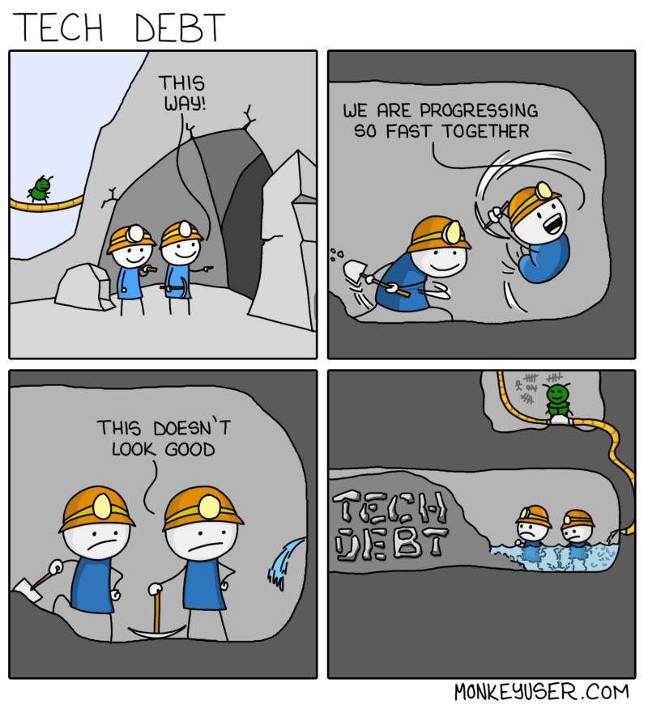
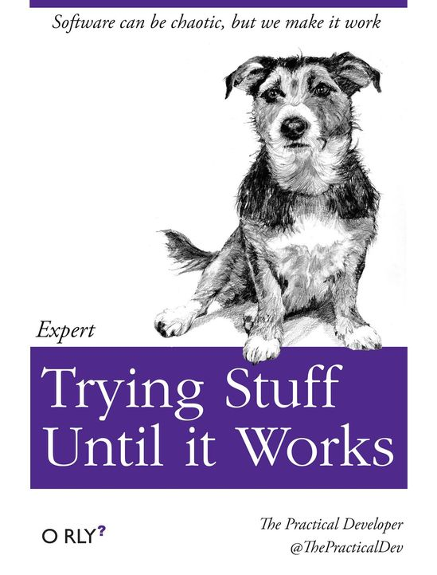
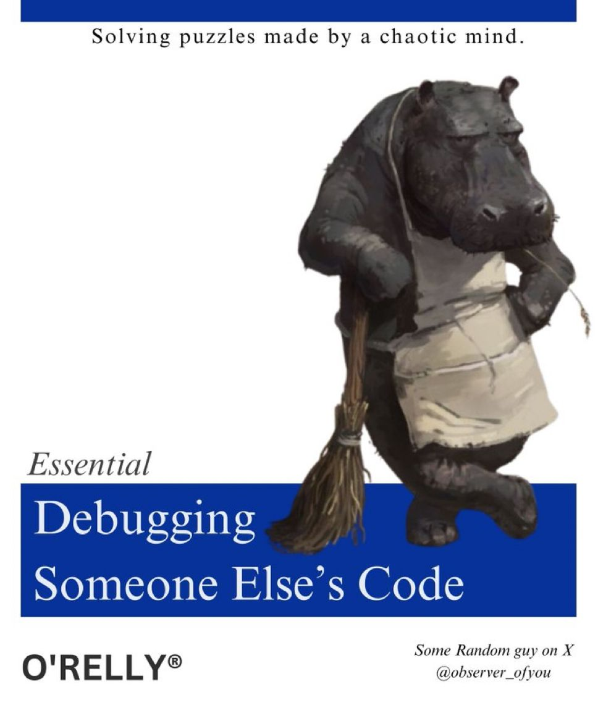
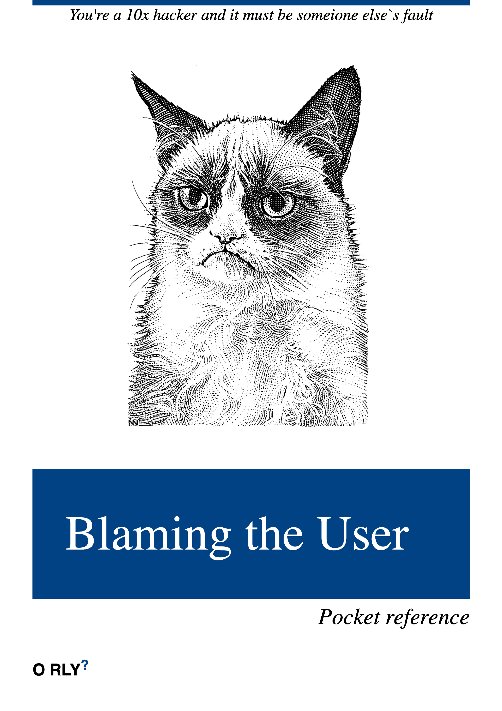

# IT Best Practices

<!-- INDEX_START -->

- [The Cardinal Rule of IT](#the-cardinal-rule-of-it)
- [Hiring Best Practices](#hiring-best-practices)
  - [Hire Talent Above All Else](#hire-talent-above-all-else)
- [Budget vs Reality](#budget-vs-reality)
- [High Availability and Multi-Datacenter](#high-availability-and-multi-datacenter)
- [Use Version Control for Everything Textual - Code, Configs & Docs](#use-version-control-for-everything-textual---code-configs--docs)
- [Releases](#releases)
  - [No production releases on Friday afternoons or after 4pm any day](#no-production-releases-on-friday-afternoons-or-after-4pm-any-day)
- [Versioning](#versioning)
  - [Use a sane versioning system](#use-a-sane-versioning-system)
    - [Software Versioning](#software-versioning)
    - [Live Websites / SaaS](#live-websites--saas)
- [Command Line vs UI](#command-line-vs-ui)
- [Automation](#automation)
  - [Code Builds](#code-builds)
  - [CI/CD](#cicd)
  - [Infrastructure-as-Code](#infrastructure-as-code)
- [Principle: Portability](#principle-portability)
- [Documentation](#documentation)
- [Principle: Clarity](#principle-clarity)
- [Principle: Intuitive Design](#principle-intuitive-design)
- [Principle: Time Amplification Effect](#principle-time-amplification-effect)
- [Principle: Keep It Simple](#principle-keep-it-simple)
- [Principle: Clever Code is Hard to Debug](#principle-clever-code-is-hard-to-debug)
- [Vendors](#vendors)
- [Avoid Vendor Lock In](#avoid-vendor-lock-in)
- [Minimize / Manage Technical Debt](#minimize--manage-technical-debt)
- [Technology Specific Best Practices](#technology-specific-best-practices)
  - [Dates - always use ISO8601 Date Format](#dates---always-use-iso8601-date-format)
  - [Docker Best Practices](#docker-best-practices)
  - [Kubernetes - Production Ready Checklist](#kubernetes---production-ready-checklist)
  - [GitHub Actions CI/CD Best Practices](#github-actions-cicd-best-practices)
- [Memes](#memes)
  - [Trying Stuff Until It Works](#trying-stuff-until-it-works)
  - [Getting Good At Engineering](#getting-good-at-engineering)
  - [Debugging Someone Else's Code](#debugging-someone-elses-code)
  - [Commercial Negotiations - Out Foxing Vendors](#commercial-negotiations---out-foxing-vendors)
  - [The Mobile Developer](#the-mobile-developer)
  - [Ignoring Non-Critical Problems At Work](#ignoring-non-critical-problems-at-work)
  - [Writing Code That Nobody Else Can Read](#writing-code-that-nobody-else-can-read)
  - [Blaming the User](#blaming-the-user)

<!-- INDEX_END -->

## The Cardinal Rule of IT

**Make things simple for other people.**

This includes:

- make things easy to install
- make things easy to maintain
- use automation where ever reasonable
- document your work concisely
- use diagrams where possible

## Hiring Best Practices

Hire for:

- Talent
- Motivation
- Meritocracy - no DEI aka reverse discrimination under any circumstances
- IQ
- Grit & Determination
  - this is a key difference between junior / mid and senior engineers
  - if you're the 3rd line or lead engineer there is nobody to go to, you have to figure it out one way or another.
  - cheating on solving problems due to time pressures or lack of determination to get to the best result just creates
    technical debt for some other poor person to have to deal with later
    - which is often even worse as it's much harder and more risky to make big fixes to production systems
- Enthusiasm
- Positive can-do attitude (needs to still be realistic)

### Hire Talent Above All Else

If you get this right, the rest of this list will solve itself via IQ and experience.

**Do not cheap out on hiring.**

It's better to hire fewer more senior engineers.

It's better to save money on software licensing
and have good people working for you using open source technology or cost optimizing your [Cloud](cloud.md) usage.

I've worked for roughly two dozen companies and seen teams of all configurations and ideologies.

The best were always the senior teams.

This means no DEI hiring discrimination - only hard Meritocracy.

Hiring people who need to have their hands held will degrade the performance of your seniors.

Natural churn in the industry is roughly 18 months - spending 2 years training someone up, means they will often leave
for another company before you gain a return on your investment.

The market is already globally saturated with tech talent.
If you can't find it, that's a reflection on your hiring policies.

Offer 100% Remote work-from-anywhere and a decent global salary you will get real talent.

The rest of your work life will get easier having people you can depend on to do good work and do the right thing
without having to be on their case.

If you insist on hiring in San Francisco or London where life is unaffordable for many people, then you had better be
prepared to pay huge money for them to pay rent or mortgage.
It's a failing strategy.


## Budget vs Reality

Make sure the money you intend to spend on IT is worth it.

There is no point doing gold-plated multi-datacenter setups that take you forever to implement on salary / contractor
time if the value of the service being offline is negligible.

Big online businesses like social media companies,
ad tech and trading can lose a fortune
and so there it's worth **Sparing No Expense**
because the cost of the IT will usually be far less than the cost of a single outage:


## High Availability and Multi-Datacenter

Ensure every service should have redundancy at both the:

- local service level (server clustering)
  - many technologies such as [ElasticSearch](elasticsearch.md) and [Cassandra](cassandra.md)
    have native high availability clustering
  - for web farms this means using [Load Balancing](load-balancing.md)
  - traditional RDBMS databases often have active/standby failover mechanisms and master write / slave read too
- across datacenters in different geographical locations
  - in case there is a :
    - natural disaster or
    - power cut at one geographic location
  - eg. using Global Server Load Balancing
    - (DNS record updates & weightings based on healthchecks to each site)

The cost of doing this must be balanced against the value of the service - see [Budget vs Reality](#budget-vs-reality).

Sometimes it's better to just live with the lack of redundancy if the cost outweighs the value.

## Use Version Control for Everything Textual - Code, Configs & Docs

Put everything in [Git](git.md).

Don't waste your time on other legacy version control systems.

GitHub README [Markdown](markdown.md) files and [MkDocs](mkdocs.md) mean you can track all your documentation changes
easily using [Git](git.md) just like you do for your code & configs.

For techies, this is better than relying on a separate proprietary mechanism than [Confluence](atlassian.md).

You can even do your [Diagrams-as-Code](diagrams.md) and store them in Git too.

Even if you have to do diagrams in Draw.io or WYSIWYG tool, often they can export XML.
Backport that XML to Git to revision control it to track changes over time
and be able to revert if you messed something up  .

## Releases

### No production releases on Friday afternoons or after 4pm any day

People want to go home and enjoy their lives, not be stuck debugging problems you've caused.

Some people will say this is fine because you should have extensive tests etc etc... and this is true,
you should have plenty of [CI/CD](cicd.md) and [Tests](testing.md) but in practice Tech is now so complex that there's
always a risk that someone can go wrong that is unforeseen, and possibly related to live dependencies that you haven't
accounted for.

If you are going to insist on breaking this rule, at least have a fast detection and rollback strategy.

You don't want to be at dinner with your girlfriend in the evening taking calls
and scrambling because someone only noticed the problem you caused 3 hours later when you'd left work.

Keep It Simple - don't break this rule. It will bite you one day, one way or another.


## Versioning

### Use a sane versioning system

#### Software Versioning

For published software use the [semver](https://semver.org/) standard.

#### Live Websites / SaaS

For websites, the versioning can be something simple and predictable like `YYYY.NN` format for simplicity
since you're probably doing trunk based development and only roll forwards to fix issues.

Example the first release in the year 2024 is simply `202401`.

Estimate how many releases you'll do in a year
and pad the `NN` to that many digits so the versions stay lexically aligned.

## Command Line vs UI

Command line is crucial for techies.

This makes it easier to store and share, but also to automate things via [shell scripts](bash.md) or [CI/CD](cicd.md)

## Automation

### Code Builds

You should have a build system for whatever [programming](programming.md) language you use.

For JVM languages like [Java](java.md) / [Groovy](groovy.md) it'll be [Maven](maven.md),
[Gradle](gradle.md) or similar.
Other language like [Python](python.md), [Perl](perl.md), [NodeJS](javascript.md)
each have their own such as `pip`, `cpan` or `npm` etc.

This should be combined with [CI/CD](cicd.md) for automation.

### CI/CD

CI/CD should use some combination of command line scripts ([Bash](bash.md) / [Python](python.md)),
code build systems as mentioned above, and native reusable workflows ([GitHub-Actions](github-actions.md))
or shared libraries ([Jenkins](jenkins.md)).

### Infrastructure-as-Code

Your work isn't production grade until it's automated with tools like [Terraform](terraform.md), [Ansible](ansible.md),
or other code where ever possible.

If your colleagues can't reproduce what you've done in 1 short command, 2 maximum, then you've probably not made it
simple and automated enough.

You also don't want to have to struggle to remember how you built or set something up last year.

Do not rely on your memory, it will inevitably fail you eventually.

## Principle: Portability

1. If you can't run local CLI commands you don't have portable understanding
1. If ever there was an outage of your CI/CD tooling or other automation system and you needed to do a production hotfix
   urgently, you could always fall back to running it locally

## Documentation

Write a quick cheatsheet documentation page for everything you do.

There should be 1 page on every official technology and every internal project.

If it takes me more than 5-10 mins for me to see what you've done, then you've not done a good enough job.

Do not rely on your memory, it will inevitably fail you eventually, write everything down in markdown.

See the [Documentation](documentation.md) page.

## Principle: Clarity

Concise is better than long winded.

Don't save 1-2 characters at the expense of easy legibility.

## Principle: Intuitive Design

If want you're doing isn't obvious to someone who understands the technology, you are probably doing it wrong.

## Principle: Time Amplification Effect

Do not waste your colleagues time.

If you've spent hours reading through a vendor's code base of Terraform code they want you to deploy
or retrofit to your AWS environment, then write a 1 page summary on it so
all your colleagues don't have to waste their time repeating the same work!

## Principle: Keep It Simple

Don't overcomplicate things.

You will pay for it later when you have to maintain it, or worse, some other poor engineer has to maintain it.

## Principle: Clever Code is Hard to Debug

Debugging code is twice as difficult as writing it in the first place.

So if you write very clever code, even you by definition will struggle to debug it at a much later date when you've
forgotten about it.

If you really can't any other way except to use some clever trick,
document it throughly so you remember what the hell you were thinking at the time, or so your successor knows.

## Vendors

Ask to see the vendor's documentation and API.

If they don't have good documentation and a good API that you can use, then their product is not mature.

Go with someone else.

## Avoid Vendor Lock In

Vendors can increase costs on you at yearly renewals.

Maintain portability and use open source usage where ever possible.

Only use proprietary technology when you must and when it has a huge advantage.

Negotiable in contract maximum yearly rate increases to prevent large jumps eg.
20% as one notorious legacy DB vendor did to an investment bank I worked at.


## Minimize / Manage Technical Debt

Minimize or manage technical debt carefully.

Try to not take shortcuts that result in technical debt, but if you really have to, create a [Jira](jira.md)
or similar ticket to record it on the backlog and come back to it rather than forget about it and get bitten later when
you are under time pressure for something else



## Technology Specific Best Practices

### Dates - always use ISO8601 Date Format

<https://www.iso.org/iso-8601-date-and-time-format.html>

```text
YYYY-MM-DD HH:mm:ss
```

or

```text
YYYY-MM-DDTHH:mm:ss
```

It standardized and easily sortable lexically by left-most characters even as strings.

Don't use the American `MM/DD/YYYY` format - it's irregular and not for engineering.


### Docker Best Practices

<https://docs.docker.com/build/building/best-practices>

### Kubernetes - Production Ready Checklist

See the [Kubernetes Production Ready Checklist](kubernetes-production-ready-checklist.md) doc.

### GitHub Actions CI/CD Best Practices

See the [GitHub Actions](github-action,md) doc.

## Memes

### Trying Stuff Until It Works

Don't just barely get things working.

Do the best that can be done, even if you have to work late - be proud of your work.



### Getting Good At Engineering


### Debugging Someone Else's Code

Always make your code as readable and clear as possible.

Avoid fancy tricks.

Since debugging is twice as hard as writing code in the first place,
if you write very clever code, then by definition you may not be clever enough to debug it!

Don't make your life or that of your peers difficult.



### Commercial Negotiations - Out Foxing Vendors


### The Mobile Developer

The loyalty of a cat watching you get axed murdered...

Given the average tenure in Tech is ~18 months... you think you have time to train guys up?

This is why companies hunt for seniors instead of saving money on juniors at the expense of 2-3 years of training them
up to proficient level only for them to leave for another company to reap the benefits...


### Ignoring Non-Critical Problems At Work

Sometimes you just have to prioritize because there isn't enough time for everything and sleep keeps you alive...


### Writing Code That Nobody Else Can Read

Pull Request reviews are here to preven this...


### Blaming the User


