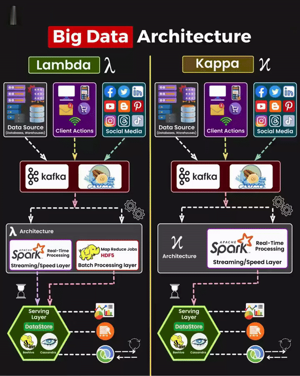

# Big Data

<!-- INDEX_START -->

- [Hadoop](#hadoop)
- [Spark](#spark)
- [Kafka](#kafka)
- [Apache Drill](#apache-drill)
- [Apache Flink](#apache-flink)
- [Apache Beam](#apache-beam)
- [Druid DB](#druid-db)
- [Diagram](#diagram)
  - [Lambda vs Kappa Architecture](#lambda-vs-kappa-architecture)

<!-- INDEX_END -->

## Hadoop

See [Hadoop](hadoop.md) doc.

## Spark

See [Spark](spark.md) doc.

## Kafka

See [Kafka](kafka.md) doc.

## Apache Drill

See [Apache Drill](drill.md) doc.

## Apache Flink

Used by CapitalOne: <http://www.slideshare.net/FlinkForward/flink-case-study-capital-one>

- streaming iterative data flow framework
- DataSet API    (batch)     - Java/Scala/Python
- DataStream API (streaming) - Java/Scala

`Kafka` -> `Apache Flink` -> `Elasticsearch` -> `Kibana 4`
        -> `HDFS` long term storage + batch processing

- real-time
- stateful
- checkpointing
- exactly once event processing (no duplicate re-computation)
- accurate
- event-time-based windowing - even when events arrive out of order or arrive delayed
- flexible windowsing - can't wait forever
- alerts, transformations, enrichments, lookups, very low overhead in real-time
- advanced windowing, machine learning (event correlation, fraud detection, event clustering, anomaly detection, user session analysis)
- creates plan like Spark, execute() call triggers action
- auto-updates its state without explicit function like Spark
- Spark must define micro-batches in either time or size
- Flink does not require defining a batch size

## Apache Beam

<https://beam.apache.org/>

- analytics abstraction layer
- engine backends to:
  - Spark
  - Flink
  - Apex
  - Google Cloud DataFlow
- APIs:
  - Python
  - Java

## Druid DB

See also: Pivot - an exploratory analytics UI for Druid

- OLAP ad-hoc interactive low latency queries "slice-n-dice"
- inverted index for needle-in-a-haystack queries
- columnar DB
- optimized for scans
- real-time ingest
- fast aggregation + ingest
- rollups on ingest (may reduce storage by 100x)
- schema required (for roll-ups)
- does not support full-text search like Elasticsearch
- use Spark to process and upload results to Druid
- doesn't support full joins (only large to small table joins)

## Diagram

### Lambda vs Kappa Architecture

**Ported from various private Knowledge Base pages 2010+**
