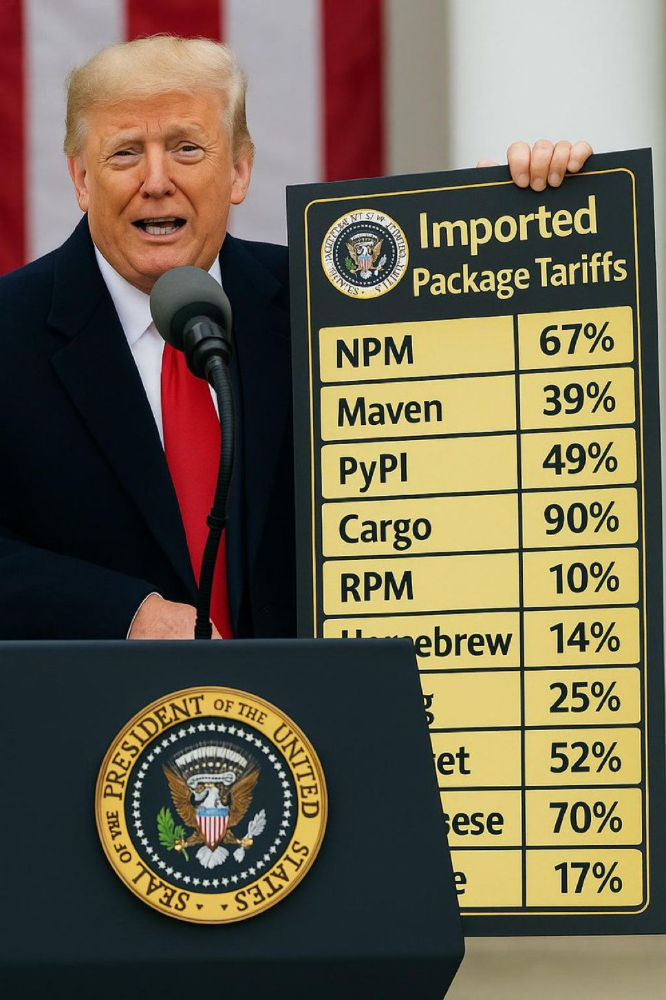

# Homebrew

<https://brew.sh/>

[Homebrew](https://brew.sh/) is the best package manager for Mac.

The guy who wrote this didn't get hired by Google ffs... who cares about old bubble sort comp-sci bullshit. Seriously.

<!-- INDEX_START -->

- [Install](#install)
- [Package Lists](#package-lists)
- [Package Management](#package-management)
- [Info](#info)
- [Environment Variables](#environment-variables)
- [Troubleshooting](#troubleshooting)
- [Memes](#memes)
  - [Imported Package Tariffs](#imported-package-tariffs)

<!-- INDEX_END -->

## Install

```shell
/bin/bash -c "$(curl -fsSL https://raw.githubusercontent.com/Homebrew/install/HEAD/install.sh)"
```

## Package Lists

All the packages I use on Mac are stored in the [DevOps-Bash-tools](devops-bash-tools.md) repo.

[Core Packages](https://github.com/HariSekhon/DevOps-Bash-tools/blob/master/setup/brew-packages.txt) -
core build packages and utils needed by almost everything

[Desktop Packages](https://github.com/HariSekhon/DevOps-Bash-tools/blob/master/setup/brew-packages-desktop.txt) - long list of cool & techie packages for Mac

[Desktop Casks](https://github.com/HariSekhon/DevOps-Bash-tools/blob/master/setup/brew-packages-desktop-casks.txt) - major GUI 3rd party apps

[Desktop Taps](https://github.com/HariSekhon/DevOps-Bash-tools/blob/master/setup/brew-packages-desktop-taps.txt) - more 3rd party apps

## Package Management

```shell
brew install "$package"
```

```shell
brew reinstall "$package"
```

```shell
brew remove "$package"
```

## Info

```shell
brew info "$package"
```

List files for package:

```shell
brew ls --verbose "$package"
```

## Environment Variables

<https://docs.brew.sh/Manpage#environment>

Some environment variables to take note of:

- `HOMEBREW_CLEANUP_MAX_AGE_DAYS` - 120 by default, you might want to reduce this
- `HOMEBREW_DISPLAY_INSTALL_TIMES` - if set, print install times for each formula at the end of the run

Some ones you might want to use in [Mobile CI/CD](cicd-mobile.md) builds:

- `HOMEBREW_DEBUG`
- `HOMEBREW_VERBOSE`
- `HOMEBREW_VERBOSE_USING_DOTS` - prints a `.` no more than once a minute to avoid long-running Homebrew
  commands being killed due to no output
- `HOMEBREW_NO_COLOR`
- `HOMEBREW_NO_ANALYTICS` - don't send [Analytics](https://docs.brew.sh/Analytics)
- `HOMEBREW_NO_AUTOREMOVE`
- `HOMEBREW_NO_AUTO_UPDATE`
  (VM will be discarded at end of build anyway)
- `HOMEBREW_NO_INSTALL_CLEANUP`
- `HOMEBREW_NO_INSTALL_UPGRADE`
- `HOMEBREW_NO_CLEANUP_FORMULAE`
- `HOMEBREW_NO_BOOTSNAP` - do not use Bootsnap to speed up repeated brew calls
- `HOMEBREW_NO_INSECURE_REDIRECT`

The usual [HTTP Proxy](http-proxying.md) environment variables of `http_proxy`, `https_proxy` and `no_proxy` also work.

## Troubleshooting

Fix SSL of a package:

[brew_fix_openssl_dependencies.sh](https://github.com/HariSekhon/DevOps-Bash-tools/blob/master/setup/brew_fix_openssl_dependencies.sh)

## Memes

### Imported Package Tariffs



**Partial port from private Knowledge Base page 2013+**
