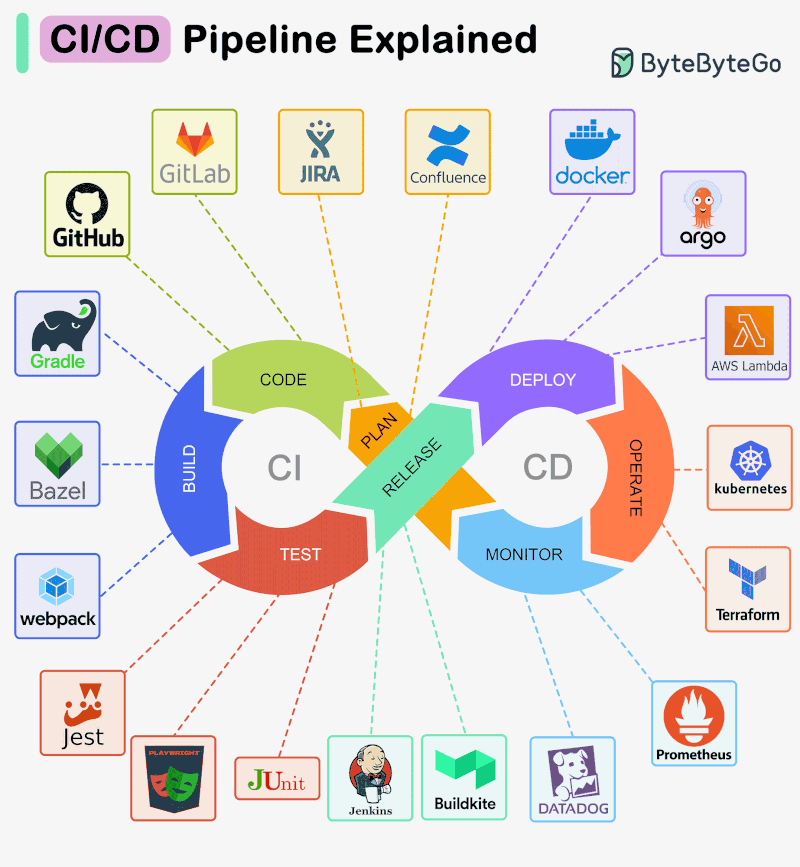

# CI/CD - Continuous Integration / Continuous Delivery

Continually tests, builds your code packages and deploys them.

**TL;DR use GitHub Actions for fully hosted and Jenkins for self-hosted, more flexibility or advanced use cases.**

GitHub Actions self-hosted runners are also a reasonable option.

CI/CD pipeline configurations for the below CI/CD platforms can be found throughout my public
[GitHub repos](https://github.com/HariSekhon?tab=repositories&q=&type=&language=&sort=stargazers)
with hundreds of live CI/CD builds for my many open source projects.

All my GitHub repos are also mirrored to all 4 major repo providers to use their CI/CD and management systems too - GitHub, GitLab, Azure DevOps and Bitbucket.

API code for many of the following technologies can also be found in my
[DevOps-Bash-tools](https://github.com/HariSekhon/DevOps-Bash-tools) repo.

<!-- INDEX_START -->

- [Self-Hosted CI/CD](#self-hosted-cicd)
  - [[Jenkins](https://www.jenkins.io/)](#jenkinshttpswwwjenkinsio)
  - [[TeamCity](https://www.jetbrains.com/teamcity/)](#teamcityhttpswwwjetbrainscomteamcity)
  - [[Concourse](https://concourse-ci.org/)](#concoursehttpsconcourse-ciorg)
  - [[GoCD](https://www.gocd.org/index.html)](#gocdhttpswwwgocdorgindexhtml)
- [Hosted CI/CD by Git repo providers](#hosted-cicd-by-git-repo-providers)
  - [[GitHub Actions](https://github.com/features/actions)](#github-actionshttpsgithubcomfeaturesactions)
  - [[GitLab CI](https://docs.gitlab.com/ee/ci/)](#gitlab-cihttpsdocsgitlabcomeeci)
  - [[Azure DevOps Pipelines](https://azure.microsoft.com/en-gb/products/devops/pipelines)](#azure-devops-pipelineshttpsazuremicrosoftcomen-gbproductsdevopspipelines)
  - [[Bitbucket Pipelines](https://bitbucket.org/product/features/pipelines)](#bitbucket-pipelineshttpsbitbucketorgproductfeaturespipelines)
- [Hosted CI/CD - Cloud](#hosted-cicd---cloud)
  - [[AWS CodeBuild](https://aws.amazon.com/codebuild/)](#aws-codebuildhttpsawsamazoncomcodebuild)
  - [[GCP CloudBuild](https://cloud.google.com/build?hl=en)](#gcp-cloudbuildhttpscloudgooglecombuildhlen)
  - [Azure DevOps Pipelines](#azure-devops-pipelines)
- [Hosted CI/CD - 3rd Party (all are legacy)](#hosted-cicd---3rd-party-all-are-legacy)
  - [[CircleCI](https://circleci.com/)](#circlecihttpscirclecicom)
  - [[Travis CI](https://www.travis-ci.com/)](#travis-cihttpswwwtravis-cicom)
  - [[BuildKite](https://buildkite.com/)](#buildkitehttpsbuildkitecom)
  - [[AppVeyor](https://www.appveyor.com/)](#appveyorhttpswwwappveyorcom)
  - [[Cirrus CI](https://cirrus-ci.org/)](#cirrus-cihttpscirrus-ciorg)
  - [[Codefresh](https://codefresh.io/)](#codefreshhttpscodefreshio)
  - [[DroneIO](https://www.drone.io/)](#droneiohttpswwwdroneio)
  - [[Semaphore CI](https://semaphoreci.com/)](#semaphore-cihttpssemaphorecicom)
  - [[CodeShip](https://www.cloudbees.com/products/codeship)](#codeshiphttpswwwcloudbeescomproductscodeship)
  - [Shippable](#shippable)
  - [NimbleCI](#nimbleci)
- [Portable Code Design](#portable-code-design)
- [Code Quality](#code-quality)
- [Diagram - CI/CD Pipeline Explained](#diagram---cicd-pipeline-explained)

<!-- INDEX_END -->

## Self-Hosted CI/CD

### [Jenkins](https://www.jenkins.io/)

The gold standard open source CI/CD - powerful, extensible, simple to complex to suit any need.

- see docs: [Jenkins](jenkins.md) and [Jenkins-on-Kubernetes](jenkins-on-kubernetes.md)
- [HariSekhon/Jenkins](https://github.com/HariSekhon/Jenkins) - advanced `Jenkinsfile` master template and Groovy Shared Library of functions and pipelines
- [HariSekhon/DevOps-Bash-tools `jenkins/`](https://github.com/HariSekhon/DevOps-Bash-tools#cicd---continuous-integration--continuous-deployment) -
  many Jenkins admin scripts using the Jenkins API and CLI tool

### [TeamCity](https://www.jetbrains.com/teamcity/)

Proprietary by JetBrains (makers of IntelliJ, expert coders and UX).

- decent
- good UI
- free for 3 agents, requires license otherwise - this is a tough hard sell vs free Jenkins

### [Concourse](https://concourse-ci.org/)

Simple, lean, open source CI/CD tool.

- `fly` CLI is easier to use than Jenkins CLI for easy triggering and testing
- [HariSekhon/Templates - .concourse.yml](https://github.com/HariSekhon/Templates/blob/master/.concourse.yml)
- [HariSekhon/DevOps-Bash-tools `cicd/`](https://github.com/HariSekhon/DevOps-Bash-tools#cicd---continuous-integration--continuous-deployment) -
  Concourse one-shot bootstrap in Docker - starts, opens UI, loads `cicd/.concourse.yml` in local repo and runs build

### [GoCD](https://www.gocd.org/index.html)

Open source by ThoughtWorks.

- half-way between Concourse simplicity and Jenkins extensibility
- [HariSekhon/Templates - .gocd.yml](https://github.com/HariSekhon/Templates/blob/master/.gocd.yml)
- [HariSekhon/DevOps-Bash-tools `cicd/`](https://github.com/HariSekhon/DevOps-Bash-tools#cicd---continuous-integration--continuous-deployment) -
  GoCD one-shot bootstrap in Docker - starts, opens UI, loads `cicd/.gocd.yml` in local repo and runs build

## Hosted CI/CD by Git repo providers

Already available on the major Git repo providers.

All are yaml-based configuration CI/CD with no installation or administration required.

Optional self-hosted runners are available to install on your own hardware or [Kubernetes](kubernetes.md),
to have more control of your execution environment or offload build minutes costs if used heavily.

### [GitHub Actions](https://github.com/features/actions)

The 800lb gorilla of modern CI/CD.

- easily the best choice overall for hosted CI/CD
- unlimited free minutes for public projects
- 50,000 build minutes included in any GitHub Enterprise Cloud plan makes this a CircleCI killer on cost alone
- Massive community support and extensibility via [GitHub Actions Marketplace](https://github.com/marketplace?type=actions)
- 3rd party actions by many prominent tech vendors like AWS and Docker
- 1st class support - every tech vendor targets GitHub Actions as their primary CI/CD client as they're following both the tech and the market
- [GitHub Enterprise Server](https://docs.github.com/en/enterprise-server@3.9/admin/overview/about-github-enterprise-server) for on-premise (government, banks etc.)
- self-hosted [runners](https://github.com/HariSekhon/Kubernetes-configs/tree/master/github-actions) can be run on Kubernetes for Cloud hosted version
- [HariSekhon/GitHub-Actions](https://github.com/HariSekhon/GitHub-Actions) - library of parameterized reusable workflows and master templates for workflows and actions
- [HariSekhon/DevOps-Bash-tools `github/`](https://github.com/HariSekhon/DevOps-Bash-tools#cicd---continuous-integration--continuous-deployment) -
  many GitHub Actions admin scripts using the GitHub API and CLI tool
- GitHub, like LinkedIn, is now owned by Microsoft, so it's beating its own Azure DevOps below

### [GitLab CI](https://docs.gitlab.com/ee/ci/)

The second-best repo provider and CI/CD.

- uses a single yaml, but that yaml can include other yamls to reproduce something similar to what GitHub does implicitly
  - but lacks different badges for different checks so slower CI/CD failure root cause analysis
- not as flexible as GitHub Actions
- good API and documentation - similar endpoints and parity of functionality with GitHub
- lacks GitHub Actions marketplace
- self-hosted [runners](https://docs.gitlab.com/runner/) can be run on Kubernetes
- 400 free build minutes a month
  - has relegated this to a legacy CI/CD for open source - GitHub gives unlimited free build minutes for all public projects
- [GitLab server](https://about.gitlab.com/install/) for on-premise (government, banks etc.)
- [HariSekhon/Templates - .gitlab-ci.yml](https://github.com/HariSekhon/Templates/blob/master/.gitlab-ci.yml)
- [HariSekhon/DevOps-Bash-tools `gitlab/`](https://github.com/HariSekhon/DevOps-Bash-tools#cicd---continuous-integration--continuous-deployment) -
  several GitLab admin scripts using the GitLab API
- do not use GitLab over GitHub unless you're going Enterprise and are forced to use it

### [Azure DevOps Pipelines](https://azure.microsoft.com/en-gb/products/devops/pipelines)

Microsoft's offering to accompany their Git repo hosting.

- uses a single yaml, but can include/extend from other templates
  - but lacks different badges for different checks so slower CI/CD failure root cause analysis
- not as flexible as GitHub Actions or GitLab
- worse UI than GitHub and GitLab
- worse functionality
- fewer integrations than GitHub
- worst API
- [Azure DevOps Server](https://azure.microsoft.com/en-us/products/devops/server) for on-premise is a rebranding of the legacy Team Foundation Server (TFS)
- [HariSekhon/Templates - azure-pipelines.yml](https://github.com/HariSekhon/Templates/blob/master/azure-pipelines.yml)
- [HariSekhon/Templates - azure-pipeline-template.yml](https://github.com/HariSekhon/Templates/blob/master/azure-pipeline-template.yml)
- [HariSekhon/DevOps-Bash-tools `azure_devops/`](https://github.com/HariSekhon/DevOps-Bash-tools#cicd---continuous-integration--continuous-deployment) -
  several Azure DevOps admin scripts using the Azure DevOps API
- Legacy. Do not use Azure DevOps unless your company absolutely forces you to, GitHub and GitLab are both better choices

### [Bitbucket Pipelines](https://bitbucket.org/product/features/pipelines)

The weakest repo provider and weakest CI/CD system.

- not as many features
- not a great API
- 50 free build minutes a month
- when they dropped the free build minutes this rendered this useless for open source projects
- unless you like getting constant emails of build failures upon every git push due to no build minutes
- [Bitbucket Data Center](https://confluence.atlassian.com/bitbucketserver/bitbucket-data-center-documentation-776639749.html) is the on-premise installable version
- this product is one of Atlassian's rare fails to compete in the software market as they have many more widely used products like Jira, Confluence, Fisheye etc.
- [HariSekhon/Templates - bitbucket-pipelines.yml](https://github.com/HariSekhon/Templates/blob/master/bitbucket-pipelines.yml)
- [HariSekhon/DevOps-Bash-tools `bitbucket/`](https://github.com/HariSekhon/DevOps-Bash-tools#git---github-gitlab-bitbucket-azure-devops) -
  several BitBucket admin scripts using the Bitbucket API
- Legacy. Do not use Bitbucket - pick anything else.

## Hosted CI/CD - Cloud

### [AWS CodeBuild](https://aws.amazon.com/codebuild/)

- cheap pay-as-you-go integrated with your existing AWS bill, convenient for no additional accounts, approvals or purchase orders
- too basic in functionality - poor man's CI/CD
- good security integration with other AWS services due to all being under AWS IAM
- most companies use GitHub Actions instead for good reason - if you're in the cloud anyway, GitHub has better features, security and integrations
- [HariSekhon/Templates- AWS CodeBuild buildspec.yaml](https://github.com/HariSekhon/Templates/blob/master/buildspec.yml)

### [GCP CloudBuild](https://cloud.google.com/build?hl=en)

- formerly called Container Builder which should give you a hint as to its intended purpose
- similar advantages and drawbacks to AWS CodeBuild
- basic functionality
- cheap with integrated pay-as-you-go billing inside your existing Google Cloud account, no extra purchase orders and approvals needed in your enterprise
- good security integration with other GCP services due to all being under GCP IAM
- [Kaniko](https://github.com/GoogleContainerTools/kaniko) integration but in my experience your mileage may vary
- [HariSekhon/Templates - cloudbuild.yaml](https://github.com/HariSekhon/Templates/blob/master/cloudbuild.yaml) and [cloudbuild-golang.yaml](https://github.com/HariSekhon/Templates/blob/master/cloudbuild-golang.yaml)

### Azure DevOps Pipelines

- Legacy
- see details in [Hosted Repo Providers](#hosted-cicd-by-git-repo-providers) section above as it's closer to them as a legacy TFS rebranding than the above cloud-native integrated offerings

## Hosted CI/CD - 3rd Party (all are legacy)

### [CircleCI](https://circleci.com/)

Mature long-standing frontrunner among hosted CI/CD systems.

- good interactive UI
- free tier with 6000 build minutes a month and 30 parallel builds
- self-hosted [runners](https://github.com/HariSekhon/Kubernetes-configs/tree/master/circleci) can be run on Kubernetes
- legacy enterprise licensing model requires up front yearly usage estimation
- very expensive compared to GitHub Actions
- [HariSekhon/Templates - .circleci/config](https://github.com/HariSekhon/Templates/blob/master/circleci-config.yml)
- [HariSekhon/DevOps-Bash-tools `circleci/`](https://github.com/HariSekhon/DevOps-Bash-tools#cicd---continuous-integration--continuous-deployment) -
  several CircleCI admin scripts using the CircleCI API

### [Travis CI](https://www.travis-ci.com/)

One of the first best hosted CI/CD systems.

- used to be free for open source on travis-ci.org which has been shut down
  - legacy now as a result
  - [HariSekhon/Templates - .travis-ci.yml](https://github.com/HariSekhon/Templates/blob/master/.travis.yml)
  - Real world usage example -
    [HariSekhon/DevOps-Bash-tools .travis-ci.yml](https://github.com/HariSekhon/DevOps-Bash-tools/blob/master/travis/.travis.yml)

### [BuildKite](https://buildkite.com/)

Cloud control panel with self-hosted agents.

- easy to use
- good API
- the most modern freshest feeling CI/CD solution in this section
- drawback is no fully-hosted runners, they provide the control plane and you must host yourself
- Docker / Kubernetes agents
- [HariSekhon/DevOps-Bash-tools `buildkite/`](https://github.com/HariSekhon/DevOps-Bash-tools#cicd---continuous-integration--continuous-deployment) -
  many BuildKite admin scripts using the above API

### [AppVeyor](https://www.appveyor.com/)

Has Windows builds if you're into that sort of legacy thing.

- [HariSekhon/Templates .appveyor.yml](https://github.com/HariSekhon/Templates/blob/master/.appveyor.yml)
- [HariSekhon/DevOps-Bash-tools `appveyor/`](https://github.com/HariSekhon/DevOps-Bash-tools/tree/master/appveyor) -
  a few scripts for AppVeyor API and self-hosted agents

### [Cirrus CI](https://cirrus-ci.org/)

Nothing special, yet another yaml CI/CD.

- [HariSekhon/Templates .cirrus.yml](https://github.com/HariSekhon/Templates/blob/master/.cirrus.yml)

### [Codefresh](https://codefresh.io/)

- don't like the UI
- had many issues with this platform
- better at blogging about CI/CD
- [HariSekhon/Templates codefresh.yml](https://github.com/HariSekhon/Templates/blob/master/codefresh.yml)

### [DroneIO](https://www.drone.io/)

- Python/Scala (beta), Groovy (new)
- unlimited for public project builds but soft limit 30 mins
- see adjacent doc: [drone.io.md](drone.io.md)
- [HariSekhon/Templates - drone.yml](https://github.com/HariSekhon/Templates/blob/master/.drone.yml)
- [HariSekhon/DevOps-Bash-tools drone/](https://github.com/HariSekhon/DevOps-Bash-tools/tree/master/drone) -
  a couple scripts for Drone.io's API and self-hosted runners

### [Semaphore CI](https://semaphoreci.com/)

Nothing special, has its own Python environment quirks I've had to work around.

- [HariSekhon/Templates - semaphore.yml](https://github.com/HariSekhon/Templates/blob/master/semaphore.yml)

### [CodeShip](https://www.cloudbees.com/products/codeship)

- docker support
- pricey
- Dead
- Acquired by CloudBees, no longer free
  - not sure why they bothered when [CloudBees](jenkins.md#cloudbees) are Jenkins experts. Hosted Jenkins is what people really want. That or GitHub Actions whose yaml is simpler than Jenkinsfiles

### Shippable

- 1 parallel build :-/
- [Acquired](https://jfrog.com/blog/weve-acquired-shippable-to-complete-devops-pipeline-automation-from-code-to-production/) by JFrog
- Decommissioned / Dead

### NimbleCI

- only 300 build minutes per month
- Decommissioned / Dead

## Portable Code Design

Anything you put in CI/CD should ideally be easily runnable locally from the command line.

This is important for local testing and debugging, eg.
being able to test code builds using [Build Systems](build-systems.md) or run [Terraform](terraform.md) /
[Terragrunt](terragrunt.md) plans before committing code, as well as deploy urgent production hotfixes even in cases
where the CI/CD system may be unavailable due to a public outage (all the major vendors have them from time to time)
or a self-managed maintenance window for an upgrade or similar.

Also, if you ever want to migrate to another CI/CD system, having a portable set of scripts, [Makefiles](make.md) and
similar makes it much easier to do so.

Advanced library usage such as in [HariSekhon/GitHub-Actions](https://github.com/HariSekhon/GitHub-Actions) and
[HariSekhon/Jenkins](https://github.com/HariSekhon/Jenkins) sacrifice some of this portability in exchange for advanced
functionality and code reuse.

## Code Quality

See [Code Quality](code-quality.md).

## Diagram - CI/CD Pipeline Explained

**Ported from private Knowledge Base page 2014+**
