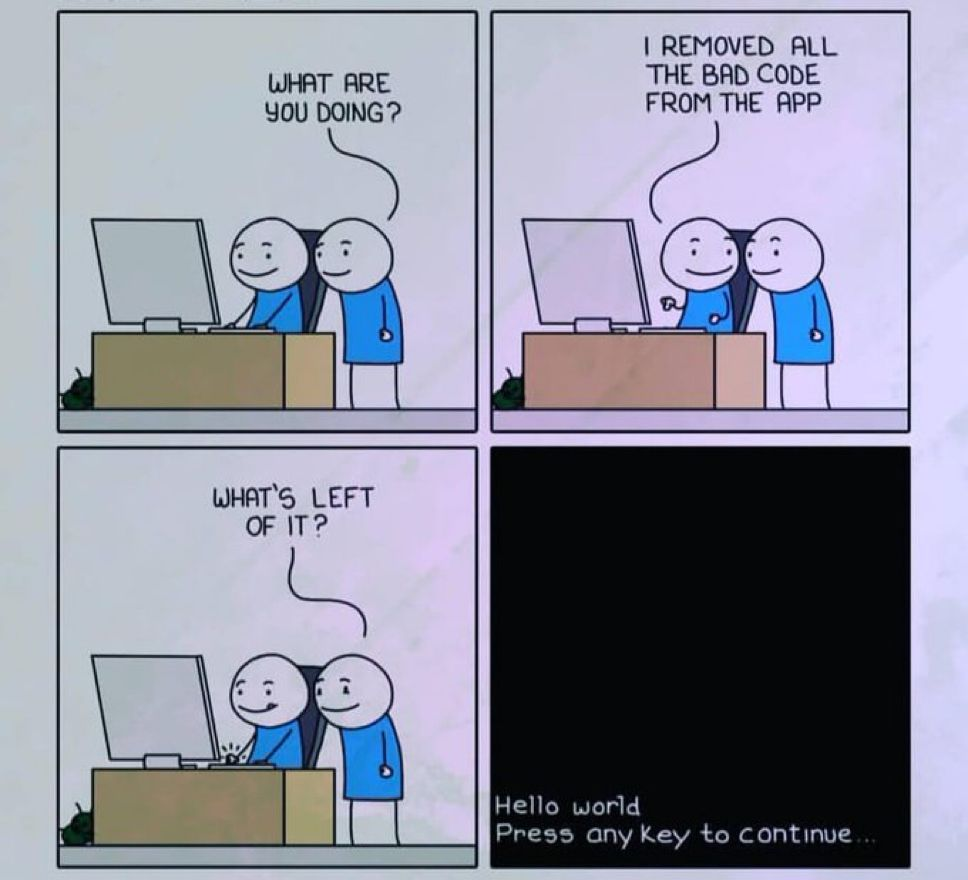
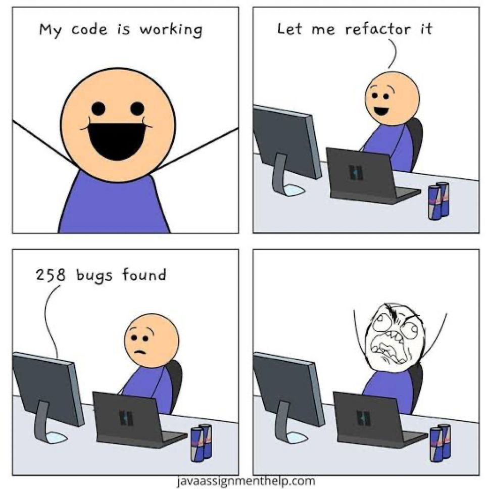
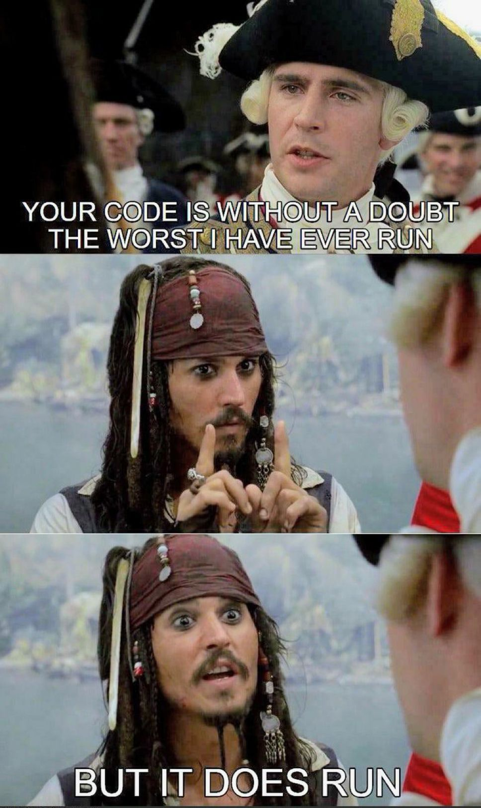
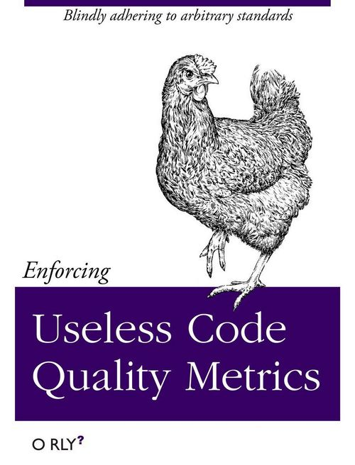

# Code Quality & Code Coverage

<!-- INDEX_START -->

- [Code Quality](#code-quality)
- [Peer Review](#peer-review)
- [Code Coverage](#code-coverage)
- [Meme](#meme)
  - [Removed Bad Code](#removed-bad-code)
  - [Refactoring](#refactoring)
  - [Worst Code I've Ever Run](#worst-code-ive-ever-run)
  - [Code Quality Metrics](#code-quality-metrics)

<!-- INDEX_END -->

## Code Quality

These often include code coverage as well as best practices for common programming languages.

- [SonarQube](https://www.sonarsource.com/open-source-editions/sonarqube-community-edition/) - self-hosted open source and commercial versions
  - supports all the usual languages: Java, Groovy, Python etc.
  - widely used - easily the most well known and popular code quality tool
  - deploys on [Kubernetes](kubernetes.md) - see ready-made config in [HariSekhon/Kubernetes - sonarqube](https://github.com/HariSekhon/Kubernetes-configs/tree/master/sonarqube)
  - see [SonarQube doc](sonarqube.md) in this knowledge base for more
- [Codacy](https://www.codacy.com/) - my favourite hosted code quality tool
  - good quality UI
  - easy to use
  - configurable
  - supports all the usual languages: Java, Scala, Python, Ruby, PHP, Javascript etc.
- [CodeClimate](https://codeclimate.com/)
  - Python, Go, Ruby, PHP, Javascript etc.
  - CLI runs engines locally inside Docker
  - VIM plugin to run CLI - <https://docs.codeclimate.com/docs/vim-plugin>
  - see docs/codeclimate
- [GoReportCard](https://goreportcard.com/) - widely used for Golang projects only
- QuantifiedCode - Python only, shut down Aug 2016

## Peer Review

Hosted Git providers like GitHub and GitLab already have mature peer review in their Pull Requests / Merge Requests
(they're named differently in GitHub and GitLab but they're the same thing).

- [Gerrit](https://www.gerritcodereview.com/) - free web based code review tool

## Code Coverage

- [Coveralls.io](https://coveralls.io/)
- Coverage
- [Codecov](https://about.codecov.io/)
- [Coverity](https://scan.coverity.com/)

## Meme

### Removed Bad Code

### Refactoring

Imagine how bad this would be if trying to refactor AI generated code…

Not that anyone in the new generation will know what refactoring is… 😂

### Worst Code I've Ever Run

Let's be honest, you've been on both sides of this PR review.

If you haven't, send your PR to me to review and you will be... 😂

### Code Quality Metrics

