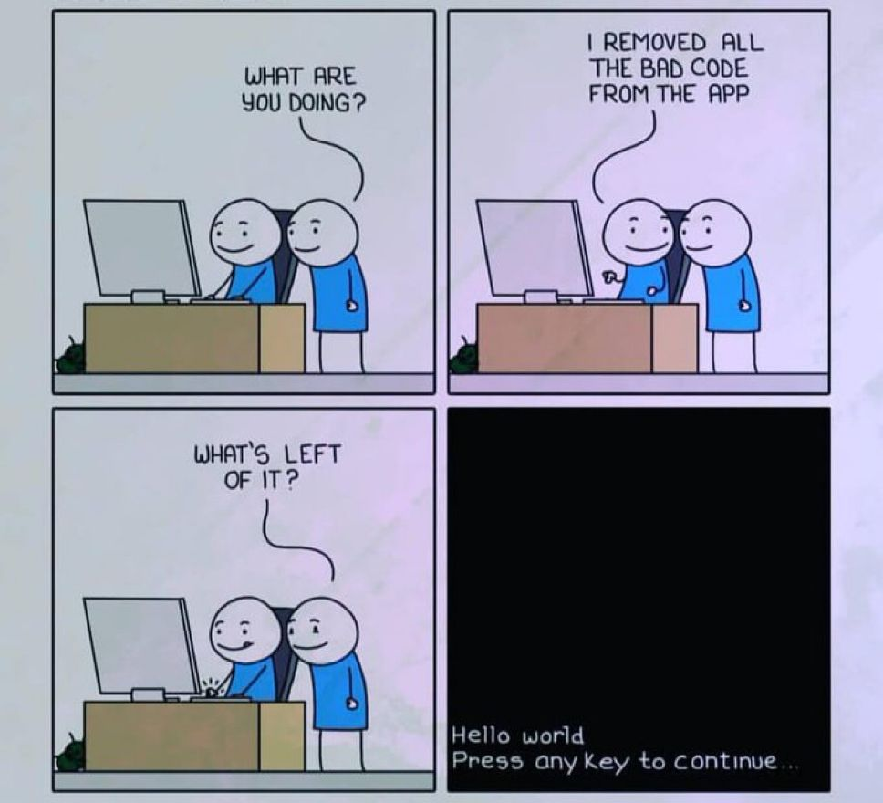

# Code Scanning

<!-- INDEX_START -->

- [Checkov & Bridgecrew Cloud](#checkov--bridgecrew-cloud)
  - [Bridgecrew Cloud](#bridgecrew-cloud)
    - [Cost](#cost)
- [Memes](#memes)
  - [Removed Bad Code](#removed-bad-code)

<!-- INDEX_END -->

Code scanning includes:

- [Security](security.md) scanning - password and API tokens committed to Git, vunerabilities in code patterns or [CVEs](https://cve.mitre.org/) in libraries
- [Code Quality](code-quality.md) - there for SonarQube, Codacy, CodeClimate, Codefresh etc.

## Checkov & Bridgecrew Cloud

Checkov is an open source Infrastructure-as-Code scanner.

[HariSekhon/GitHub Actions - checkov.yaml](https://github.com/HariSekhon/GitHub-Actions/blob/master/.github/workflows/checkov.yaml) - GitHub Actions reusable workflow imported to my repos

GitHub Actions marketplace action - [bridgecrewio/checkov-action](https://github.com/marketplace/actions/checkov-github-action)

### Bridgecrew Cloud

Bridgecrew Cloud dashboard:

<https://www.bridgecrew.cloud/>

- dashboard
- CIS benchmarks - Kubernetes, Docker, EKS, GKE etc
- auto-fix - raises Pull Requests with the fixes
- IDE integration - catches errors in your IDE using an API token to send the file contents up for scanning and tooltip pop-ups how to fix before commit - 1 step earlier than CI/CD committed
- policies to block builds based on criteria such as severity

#### Cost

- RRP $180 per credit - each credit covers 3 resources - essentially $60 RRP per resource (could get expensive as you scale a larger codebase)
- Discount: 1500 - 3000 credits = 25% discount
- Only resources in blocks are charged - modules are not charged
- Script to scan IaC to figure out how many resources you have to pay for
- Re-quote every few months if increased usage.
- Shame this the legacy purchase order up-front estimate model rather than a Pay-As-You-Go model like cloud vendors or GitHub.

## Memes

### Removed Bad Code

