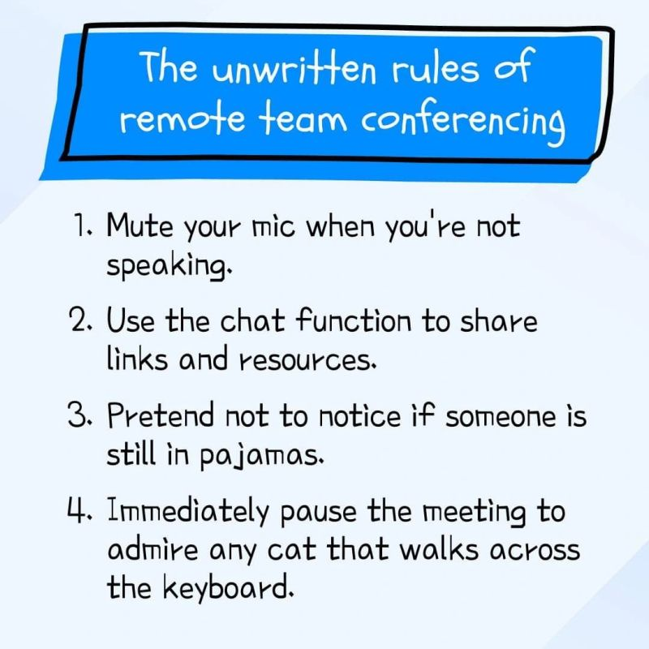

# Communications

<!-- INDEX_START -->

- [Slack](#slack)
- [Microsoft Teams](#microsoft-teams)
- [Zoom](#zoom)
- [Skype](#skype)
- [WebEx](#webex)
- [Meme](#meme)
  - [Unwritten Rules of Remote Team Conferencing](#unwritten-rules-of-remote-team-conferencing)

<!-- INDEX_END -->

## Slack

<https://slack.com/>

This is the best for chat.

Not so great for video conf calls.

Shame it's proprietary.

## Microsoft Teams

<https://www.microsoft.com/en-us/microsoft-teams/group-chat-software>

Good for video conf calls but not that nice for chat.

Everybody loves to hate on it because it's not as slick as Slack.

## Zoom

<https://www.zoom.com/>

Specializes in video conf calling

The free version cuts you off after some time, which isn't cool.

## Skype

<https://www.skype.com/en/>

Used to be big but seems to have fallen out of favour in recent years.

## WebEx

<https://www.webex.com/>

Cisco WebEx was one of the originals, but has fallen out of favour in recent years.

## Meme

### Unwritten Rules of Remote Team Conferencing

