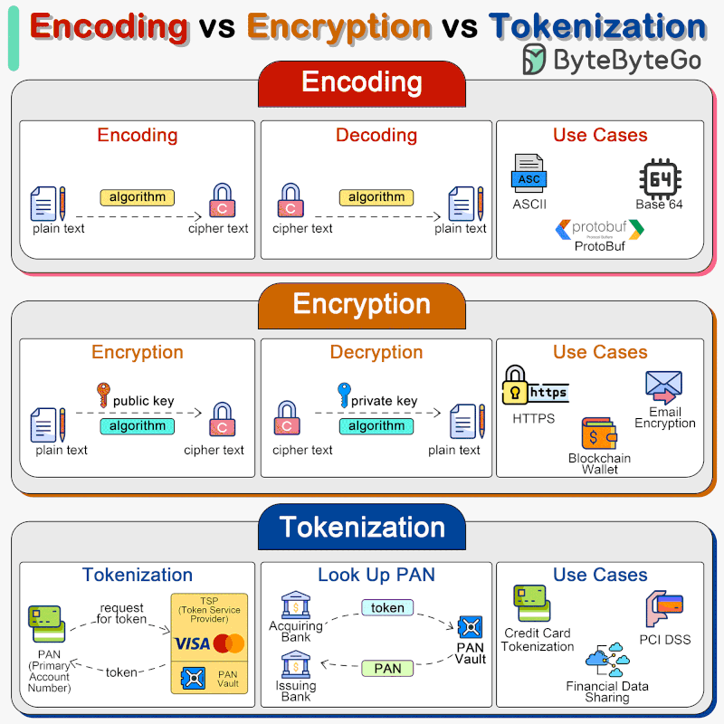

# Data

<!-- INDEX_START -->

- [Big Data](#big-data)
- [Data Validation](#data-validation)
- [Data Integration](#data-integration)
  - [Mulesoft](#mulesoft)
  - [Spring Integration](#spring-integration)
- [Data Visualization](#data-visualization)
- [Diagrams](#diagrams)
  - [Top 9 Systems Integrations](#top-9-systems-integrations)
  - [Encoding vs Encryption vs Tokenization](#encoding-vs-encryption-vs-tokenization)

<!-- INDEX_END -->

## Big Data

See [big-data.md](big-data.md)

## Data Validation

Start by validating data formats for correctness.

Scripts for this can be found in both the [DevOps-Python-tools](devops-python-tools.md)
and [DevOps-Bash-tools](devops-bash-tools.md) repos.

Then proceed to more advanced content validation.

## Data Integration

- [DBT](https://www.getdbt.com) - open-source data pipeline workflow tool
- [Informatica](informatica.md) - proprietary legacy now available via SaaS, with self-hosted agents on VMs or Kubernetes
- [Airbyte](https://airbyte.com/product/airbyte-open-source) - [open source](https://github.com/airbytehq/airbyte)
  self-hosted or SaaS proprietary with 300+ connectors
- [Apache Camel](camel.md) - open source with 100+ connectors
- Spring Integration - XML config, only use for Spring heavy shops
- Mulesoft - XML config, only use for proprietary connectors

### Mulesoft

- lightweight enterprise service bus + integration framework
- proprietary connectors
- Anypoint Studio (Eclipse-based IDE)
- Anypoint Enterprise Security - security features, transactions

### Spring Integration

TODO

## Data Visualization

See the [Diagrams](diagrams.md) and [Visualization](visualization.md) docs.

## Diagrams

### Top 9 Systems Integrations

### Encoding vs Encryption vs Tokenization

**Ported from private Knowledge Base pages 2016+**
