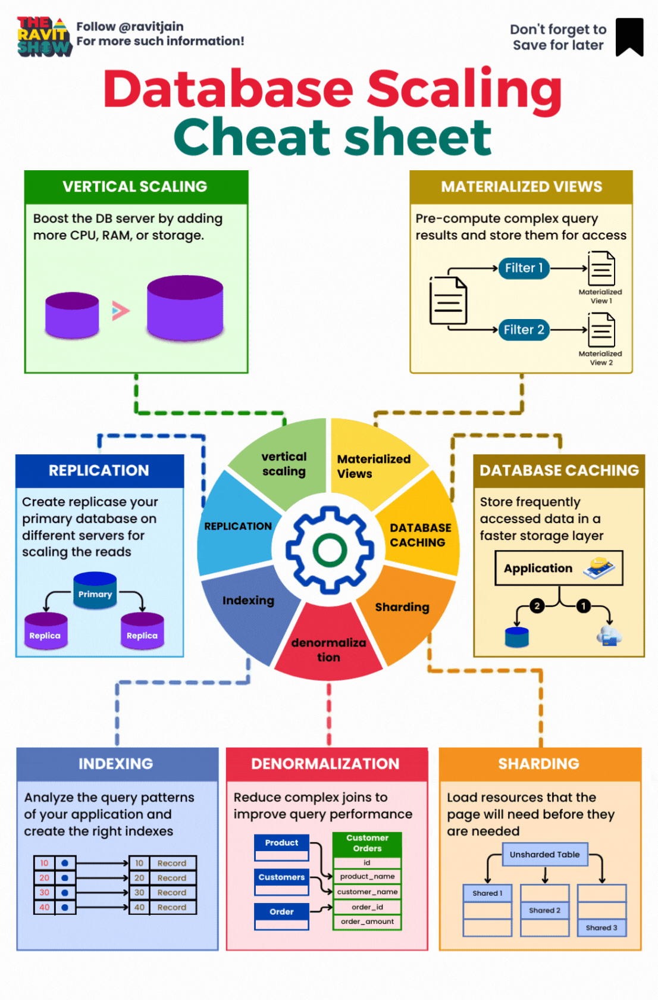
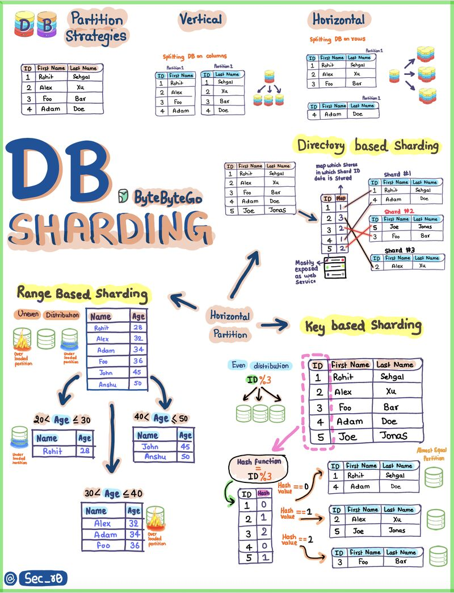
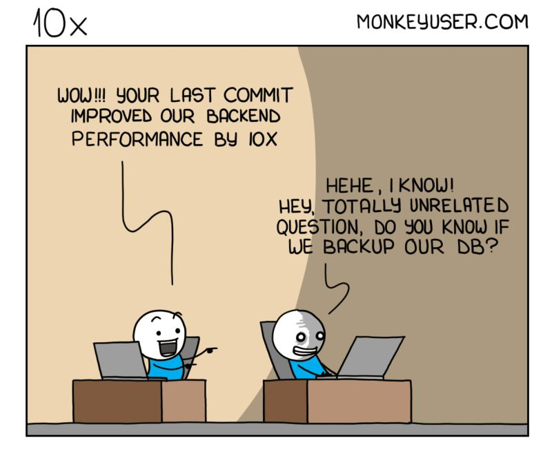

# SQL Databases

These are mostly [SQL](sql.md) databases of various forms,
usually [RDBMS](README.md#databases--rdbms) or
[MPP](README.md#mpp-databases), but some without referential integrity or ACID compliance.

<!-- INDEX_START -->

- [DB Rankings](#db-rankings)
- [Open Source Databases](#open-source-databases)
  - [Open Source RDBMS](#open-source-rdbms)
  - [Open Source MPP Databases](#open-source-mpp-databases)
  - [Open Source Small Embedded Databases](#open-source-small-embedded-databases)
- [Cloud Databases](#cloud-databases)
- [Proprietary / Legacy Databases](#proprietary--legacy-databases)
- [Databases Scaling Cheatsheet](#databases-scaling-cheatsheet)
- [Database Sharding](#database-sharding)
- [Memes](#memes)
  - [If Coffee Doesn't Wake You Up](#if-coffee-doesnt-wake-you-up)
  - [10x Performance - Backed up DB?](#10x-performance---backed-up-db)

<!-- INDEX_END -->

## DB Rankings

<https://db-engines.com/en/ranking>

## Open Source Databases

### Open Source RDBMS

- [MySQL](mysql.md) - easy to use with easy DB replication features
- [PostgreSQL](postgres.md) - high quality open source database - the natural open source choice to move away from
  Oracle (one company where I was a semi Oracle DBA for a few years did exactly this migration after my time)

These are so popular that every major cloud provider has a managed service to host them for you -
eg. AWS [RDS](https://aws.amazon.com/rds/),
GCP [Cloud SQL](https://cloud.google.com/sql),
Azure [Databases](https://azure.microsoft.com/en-us/products/category/databases) and
Digital Ocean [Managed Databases](https://www.digitalocean.com/products/managed-databases).

### Open Source MPP Databases

- [Presto](https://prestodb.io/)
- [Apache Drill](https://drill.apache.org/)

### Open Source Small Embedded Databases

Useful for local or embedded usage rather than multi-user servers like most major RDBMS systems.

- [SQLite](sqlite.md) - small fast local SQL DB that can store data in a simple file
  [DevOps-Bash-tools](devops-bash-tools.md) repo
- [DuckDB](https://duckdb.org/) - single process local SQL DB akin to SQLite with minimal dependencies

## Cloud Databases

- [AWS Redshift](https://aws.amazon.com/redshift/) - managed SQL cluster,
  built on [ParAccel](https://en.wikipedia.org/wiki/ParAccel)
  MPP columnar DB built on PostgreSQL, charges on a VMs running basis
- [AWS Athena](https://aws.amazon.com/athena/) - serverless DB that operates on AWS S3 files or various data formats
  and charges by query
- [GCP BigQuery](https://cloud.google.com/bigquery/) - serverless DB that charges by query

## Proprietary / Legacy Databases

- [Oracle](oracle.md) - an OG of RDBMS databases with good performance, durability and PL/SQL advanced SQL
  dialect. Notoriously expensive
- [Microsoft SQL Server](https://www.microsoft.com/en-us/sql-server/sql-server-downloads) - slightly more user friendly
  than Oracle, with Transact SQL aka TSQL
- [Netezza](https://www.ibm.com/products/netezza) - specialist rack appliance, even more expensive than Oracle

## Databases Scaling Cheatsheet

## Database Sharding

## Memes

### If Coffee Doesn't Wake You Up

### 10x Performance - Backed up DB?

