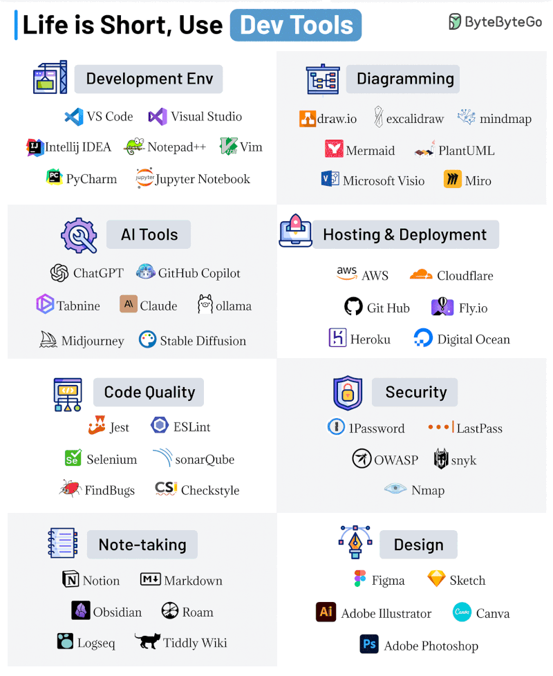
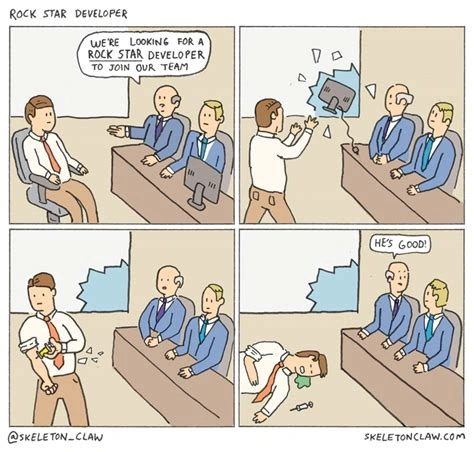

# Dev Misc

**TODO: move to other more specific detailed pages**

<!-- INDEX_START -->

- [Jira](#jira)
- [Packaging](#packaging)
- [Dependency Tracking](#dependency-tracking)
- [Memes](#memes)
  - [Rock Star Developer](#rock-star-developer)

<!-- INDEX_END -->

- Heroku
  - free tier - 512MB 1 web / 1 worker
  - sleeps after 30 mins

 

- SMTP4Dev - Windows app, runs dummy SMTP server, does not delivery but shows emails in the system tray

## Jira

See [Atlassian](atlassian.md) page.

## Packaging

[Packager.io](https://packager.io/) - auto-builds rpm / deb packages for Ruby, NodeJS, Golang

## Dependency Tracking

- VersionEye:
  - supports: Java, Ruby, Python, Node.JS, PHP, JavaScript, CSS, Objective-C, R, Clojure
  - coming: .NET, Perl
  - Maven, SBT, Gradle plugins
  - checks license violations, permissive vs copyleft for closed source software
  - checks security databases for Java, Python, PHP, Node.JS and Ruby
  - cannot yet handle moved packages eg. pdfbox:pdfbox:0.7.3 moved to org.apache.pdfbox:pdfbox:1.8.9
  - Enterprise
  - on-prem version
  - crawls internal repos eg. Nexus Pro (Java), Artifactory Enterprise (Java), CocoaPods (Objective-C), Satis (PHP)

- PyUP
- Requires.io - Python only
- sibbell.com - charges $2 to choose repos, $2 for weekly digest etc :-/
- libraries.io
- dependencyci.com - new, no account settings, didn't catch Cassandra 3.5.0 vs Cassandra 3.6.0 like Gemnasium did

- Gemnasium:
  - acquired by GitLab and shut down :-(
  - parses Gemfile (Bundler) / gemspec, requirements.txt (pip), package.json (npm), composer.json and bower.json
  - GitHub / BitBucket webhooks trigger re-evaluation on push
  - no support for Perl or JVM languages
  - green (ok), yellow (behind latest stable), red (behind on security fixes)
  - CLI - [:octocat: gemnasium/toolbelt](https://github.com/gemnasium/toolbelt)
  - Enterprise on-prem version

## Memes

### Rock Star Developer

**Ported from private Knowledge Base page 2016+**
