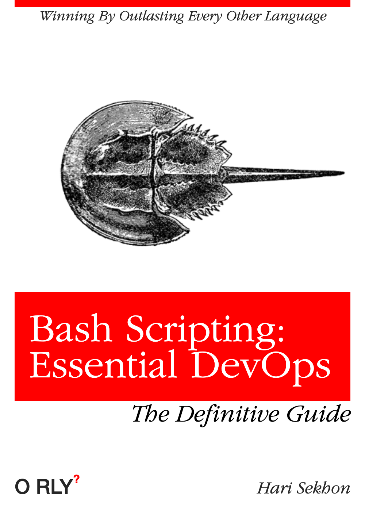
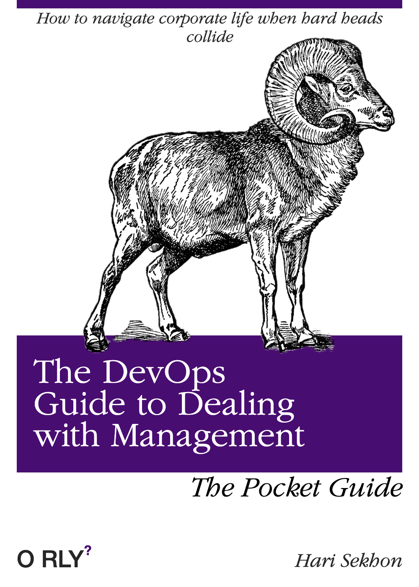

# DevOps Misc

<!-- INDEX_START -->

- [Misc Tools Pending Reallocation](#misc-tools-pending-reallocation)
- [DevOps is not entry-level](#devops-is-not-entry-level)
- [Meme](#meme)
  - [Rock Star Developer](#rock-star-developer)
  - [Bash Scripting: Essential DevOps](#bash-scripting-essential-devops)
  - [The Dev to Ops Developer](#the-dev-to-ops-developer)
  - [The Desert Developer](#the-desert-developer)
  - [The Lead Developer](#the-lead-developer)
  - [The DevOps Guide to Dealing with Management](#the-devops-guide-to-dealing-with-management)

<!-- INDEX_END -->

## Misc Tools Pending Reallocation

**TODO: move to other more specific detailed pages**

- Bamboo
- Chaos Monkey
- CloudTest
- LoadStorm
- KeyNote

<!-- -->

- [JFrog Artifactory](artifactory.md) - repository mirror -  Maven, PyPI, NPM, Docker etc...

<!-- -->

- Jira - see [Atlassian](atlassian.md) page
- Confluence - see [Atlassian](atlassian.md) page

<!-- -->

- Rundeck - open core scheduler

## DevOps is not entry-level

There is almost an inhuman amount of tools and knowledge required.

It requires extensive experience in the following areas:

- Systems Engineering
  - [resources/ByteByteGo-Big-Archive-System-Design-2023.pdf](resources/ByteByteGo-Big-Archive-System-Design-2023.pdf)
- Debugging a vast array of technologies
- [Linux](linux.md)
- [Windows](windows.md)
- [Storage](storage.md)
- Process Management
- [Networking](networking.md), TCP/IP in depth, Routing, IP address calculations, Common Ports etc.
- [Firewalls](firewalls.md)
- [DNS](dns.md)
- Web technologies
- [Load Balancing](load-balancing.md)
- [Security](security.md)
- [Programming](programming.md) - usually at least 1-2 languages just to start, you'll probably know 6-10 languages
  if you're any good
- [Shell Scripting](shell.md)
- [Cloud](cloud.md) - at least one cloud platform 6-12 technologies each, probably 2-3 such platforms
- [CI/CD](cicd.md) - at least 1-2 technologies
- [Databases](databases.md), DBA administration & [SQL](sql.md) - usually at least 2-3 different databases, probably more
- [NoSQL](README.md#nosql) - at least 1-2 technologies
- [Caching](README.md#caching)
- [Terraform](terraform.md), [Terragrunt](terragrunt.md)

and a tonne of other areas I've probably forgotten to mention.

It is probably one of the hardest fields of IT due to the fact you can be asked anything from a large array of
decades of technologies on any given day.

This is why you will see most of the best DevOps guys have 15-20 years of experience at this point.

Unless you a top 1% IQ talent, do not expect to be that good after a mere 5 years.

## Meme

### Rock Star Developer

### Bash Scripting: Essential DevOps

### The Dev to Ops Developer

### The Desert Developer

### The Lead Developer

### The DevOps Guide to Dealing with Management

**Ported from private Knowledge Base pages 2015+**
