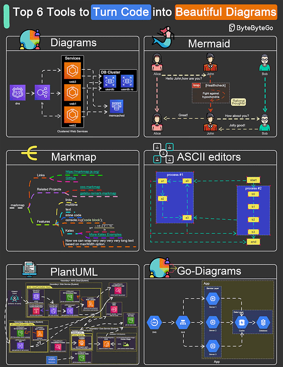
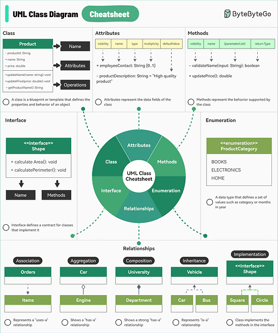

# Diagrams

Diagrams are key for top architects and engineers.

> The ability to create meaningful diagrams is the pinnacle of communication skills as an engineer

There are GUI architecture tools, but they tend to be more difficult to reproduce, you're often starting from scratch for each client.

The cutting edge is Diagrams-as-Code.

<!-- INDEX_START -->

- [Real World Architecture Diagrams](#real-world-architecture-diagrams)
- [Templates](#templates)
- [Diagrams-as-Code Languages](#diagrams-as-code-languages)
- [GUI / Online Diagrams tools](#gui--online-diagrams-tools)
- [Important Icon Sets](#important-icon-sets)
- [Interactive Playground Editors](#interactive-playground-editors)
- [GraphViz](#graphviz)
- [Hex Colour Codes](#hex-colour-codes)
- [Diagram Design](#diagram-design)
  - [Complexity](#complexity)
- [Diagram of Diagrams-as-Code Tools](#diagram-of-diagrams-as-code-tools)
- [UML Class Diagrams](#uml-class-diagrams)

<!-- INDEX_END -->

See also the [Documentation](documentation.md) and [Markdown](markdown.md) pages for tips on things like embedding
diagrams in `README.md`, as well Badges.

## Real World Architecture Diagrams

[HariSekhon/Diagrams-as-Code](https://github.com/HariSekhon/Diagrams-as-Code) - ready made architecture diagrams

Mainly D2lang, Python diagrams, MermaidJS, GNUplot and a little Draw.io / LucidChart.

[GitHub Actions](github-actions.md) CI/CD pipelines auto-regenerate the diagrams upon any code changes and they appear
directly in the rendered README.md as the resultant `.png` images are sourced in the markdown code.

[](https://github.com/HariSekhon/Diagrams-as-Code)

## Templates

[Templates](https://github.com/HariSekhon/Templates) for D2 language and Python diagrams are found here, especially
[diagram.d2](https://github.com/HariSekhon/Templates/blob/master/diagram.d2) and
[diagram.py](https://github.com/HariSekhon/Templates/blob/master/diagram.py).

[](https://github.com/HariSekhon/Templates)

## Diagrams-as-Code Languages

[Text-to-Diagram Comparison Playground](https://text-to-diagram.com/)

Diagrams-as-Code are both cool, easier to reuse prior work and often easier to maintain.

A quick edit and they reshuffle themselves.

The lack of placement layout control (D2 issue [#1285](https://github.com/terrastruct/d2/issues/1285),
Python Diagrams issues
[#44](https://github.com/mingrammer/diagrams/issues/44) and [#819](https://github.com/mingrammer/diagrams/issues/891))
is the main problem on more complex diagrams, for which you may want to switch to one of the top GUI tools from the
next section.

- [D2 lang](https://d2lang.com/) - excellent, easy to use DSL, my favourite
  - See [D2 lang](d2.md) doc page for details
  - See thse D2 [Code](https://github.com/search?q=repo%3AHariSekhon%2FDiagrams-as-Code+path%3A*.d2&type=code) files
- [Python Diagrams](https://diagrams.mingrammer.com/) - my prior favourite
  - good for basic Cloud Architecture diagrams with icons
  - See thse Python Diagrams [Code](https://github.com/search?q=repo%3AHariSekhon%2FDiagrams-as-Code+path%3A*.py&type=code) files
- [GraphViz](https://graphviz.org/) - the classic
  - its `dot` format is output by [Terraform](terraform.md)'s `terraform graph` command
  - this is the technology under the hood of Python diagrams above which makes it easier to use for Pythonistas
- [GNUplot](http://www.gnuplot.info/) - classic code diagram CLI tool that can plot from data files in different formats
  and output in many different formats
  - See these GNUplot [Code](https://github.com/search?q=repo%3AHariSekhon%2FDiagrams-as-Code+path%3A*.gnuplot&type=code) files
- [MermaidJS](https://mermaid.js.org/) - best for embedded live diagrams in GitHub [Markdown](markdown.md) (`README.md`) files
  - Flow Chart, Git Commit Log Charts, Gantt diagrams etc.
  - recently added Cloud [Architecture](https://mermaid.js.org/syntax/architecture.html)
    - D2 and Python diagrams are most established for this
    - but MermaidJS has placement or at least direction support control which they don't
  - Under active development
  - Huge number of diagram types and more being added
  - can do icons now, see [example](https://text-to-diagram.com/?example=icons&b=mermaid) by D2 comparison site
  - see [HariSekhon/Diagrams-as-Code](https://github.com/HariSekhon/Diagrams-as-Code)
    repo for live embedded MermaidJS diagrams
    [GitHub Flow with Jira integration](https://github.com/HariSekhon/Diagrams-as-Code/blob/master/README.md#github-flow-with-jira-ticket-integration)
    and [Git Environment Branches](https://github.com/HariSekhon/Diagrams-as-Code/blob/master/README.md#git---environment-branches)
  - MermaidJS has added `%%` as their comment prefix now
  - CLI - [mermaid-js/mermaid-cli](https://github.com/mermaid-js/mermaid-cli)
  - See these MermaidJS [Code](https://github.com/search?q=repo%3AHariSekhon%2FDiagrams-as-Code+path%3A*.mmd&type=code) files
- [Go Diagrams](https://github.com/blushft/go-diagrams) - a port of Python Diagrams
- [Cloudgram](https://cloudgram.dedalusone.com/index.html) - another DSL language
- [Structurizer](https://structurizr.com/dsl) - C4 architecture diagrams
- [PlantUML](https://plantuml.com/) - creates UML diagrams eg. class diagrams, sequence diagrams, use case diagrams
- [MarkMap](https://github.com/markmap/markmap) - visualize your Markdown as mindmaps, nice, can open your GitHub repo's
  Markdown directly, although it looks like my
  [DevOps-Bash-tools](https://github.com/HariSekhon/DevOps-Bash-tools)
  repo is far too huge a
  [map](https://markmap.js.org/repl#?d=github%3AHariSekhon%2FDevOps-Bash-tools%40master%3AREADME.md)

[Best Comparison Site](https://text-to-diagram.com/) (run by D2)

## GUI / Online Diagrams tools

For more control and complex architecture diagrams.

- [Draw.io](https://app.diagrams.net) - mature and can export to XML
  - integrates with Confluence to embed diagrams straight into Confluence wiki pages
- [LucidChart](https://lucid.app/) - used this for a GCP architecture diagram for a startup interview (I got the job)
  - pre-made VPC, region, zones - quicker to start
- [CloudCraft](https://app.cloudcraft.co/) - cloud focused diagrams
  - still only AWS and Azure diagrams as of March 2024
- [Creately](https://app.creately.com/) - AWS, Azure and GCP diagrams
- [Excalidraw](https://excalidraw.com/) - simple whiteboard style drawings - also useful for ad-hock drawings to explain things to colleagues
- [Miro](https://miro.com/app/dashboard/) - collaborative workflow and diagram tool
- [Prezi](https://prezi.com/) - focused on presentations
- [Sketch](https://www.sketch.com/)
- [Cacoo](https://nulab.com/cacoo/)
- [Gliffy](https://www.gliffy.com/)
- [Visual Paradigm](https://www.visual-paradigm.com/) - enterprise, does archimate diagrams, complicated, I used this at an investment bank, not my favourite, fine for enterprise architects rather than engineers
- [Cloudairy](https://chart.cloudairy.com/cloudchart) - new, buggy UI when I tried it
- [Swimm](https://docs.swimm.io/) - AI to generate diagrams from code and documentation sources

## Important Icon Sets

Especially to import into D2, but also to supplement other languages and libraries as necessary.

Python Diagrams has the best in-built library, some highlights are below, but check their adjacent categories too:

- [D2 Icons](https://icons.terrastruct.com/)

<!-- -->

- [Python Diagrams On-Premise](https://diagrams.mingrammer.com/docs/nodes/onprem)
- [Python Diagrams AWS](https://diagrams.mingrammer.com/docs/nodes/aws)
- [Python Diagrams GCP](https://diagrams.mingrammer.com/docs/nodes/gcp)
- [Python Diagrams Azure](https://diagrams.mingrammer.com/docs/nodes/azure)
- [Python Diagrams Generic](https://diagrams.mingrammer.com/docs/nodes/generic) - OS, Virtualization, Network Hardware
- [Python Diagrams Kubernetes](https://diagrams.mingrammer.com/docs/nodes/k8s)

<!-- -->

- [Official Kubernetes Icons](https://github.com/kubernetes/community/tree/master/icons)

<!-- -->

- [CNCF technologies Icons](https://landscape.cncf.io/card-mode)

<!-- -->

- [SimpleIcons](https://simpleicons.org/)

<!-- -->

- [Official AWS Icons](https://aws.amazon.com/architecture/icons/)

<!-- -->

- [Official GCP Icons](https://cloud.google.com/icons)

<!-- -->

- [Official Azure Icons](https://learn.microsoft.com/en-us/azure/architecture/icons/)
- [Benco Azure Icons](https://code.benco.io/icon-collection/azure-icons/)
- [Icon8 Azure Icons](https://icons8.com/icons/set/azure)

<!-- -->

- [FlatIcon](https://www.flaticon.com/)

<!-- -->

- [IconFinder](https://www.iconfinder.com/)

<!-- -->

- [Icons8](https://icons8.com/)

## Interactive Playground Editors

- [Text-to-Diagram Comparison Playground](https://text-to-diagram.com/)
- [D2 lang](https://play.d2lang.com/)
- [MermaidJS](https://mermaid.live/)
- [CloudGram](https://cloudgram.dedalusone.com/index.html)
- GraphViz:
  - <https://dreampuf.github.io/GraphvizOnline>
  - <http://magjac.com/graphviz-visual-editor/>
  - <https://edotor.net/>
- [MarkMap](https://markmap.js.org/repl)
- Draw.io:
  - [Draw.io pre-loaded with AWS, GCP and Azure icons](https://app.diagrams.net/?splash=0&ui=dark&libs=aws3;aws3d;aws4;azure;gcp2;network;webicons)
  - [Draw.io pre-loaded with AWS icons](https://app.diagrams.net/?splash=0&ui=dark&libs=aws3;aws3d;aws4)
  - [Draw.io pre-loaded with Azure icons](https://app.diagrams.net/?splash=0&ui=dark&libs=azure)
  - [Draw.io pre-loaded with GCP icons](https://app.diagrams.net/?splash=0&ui=dark&libs=gcp;gcp2)
- [LucidChart](https://lucid.app/)
- [CloudCraft](https://app.cloudcraft.co/)
- [Creately](https://app.creately.com/)
- [Visual Paradigm](https://online.visual-paradigm.com/)
  - [Online Dashboard](https://online.visual-paradigm.com/drive/#diagramlist:proj=0&dashboard)
- [Structurizer](https://structurizr.com/dsl)

## GraphViz

in [HariSekhon/Templates](https://github.com/HariSekhon/Templates)

generate `.png` using the `dot` command:

```shell
dot -T png template.gv -o file.png >/dev/null
```

open the generated `.png` file:

```shell
if uname -s | grep -q Darwin; then
  open file.png  # Mac
else
  sxiv file.png  # Linux
fi
```

or better use the `imageopen.sh` script from the [DevOps-Bash-tools](devops-bash-tools.md) repo
which tries more different tools on Linux to open the image:

[HariSekhon/DevOps-Bash-tools - imageopen.sh](https://github.com/HariSekhon/DevOps-Bash-tools/blob/master/bin/imageopen.sh)

## Hex Colour Codes

See [Visualization](visualization.md) doc's [Colours](visualization.md#colours) section.

## Diagram Design

### Complexity

[Diagrams-as-Code](#diagrams-as-code-languages) languages currently have no placement control placement layout control
(D2 issue [#1285](https://github.com/terrastruct/d2/issues/1285),
Python Diagrams issues
[#44](https://github.com/mingrammer/diagrams/issues/44)
and [#819](https://github.com/mingrammer/diagrams/issues/891)).

This limits the complexity of diagrams that can be generated from code because they can very quickly get out of
control and ugly as a result, costing you lots of time trying to get them to generate sane looking diagrams.

For complex diagrams you really need to switch to [GUI tools](#gui--online-diagrams-tools) for better control.

However, that being said, one diagram can only become so complicated before it becomes difficult for humans to easily
interpret due to too much detail.

For this reason, I recommend favouring an approach of multiple levels of simpler diagrams:

- an architecture overview diagram
- sub-diagrams that drill down into the implementation details of the different components eg. how it runs on Kubernetes
  or with high availability

The diagrams can be more easily read one after another.

You see examples of diagrams at different levels of drill-down from architecture to Kubernetes components in the
[HariSekhon/Diagrams-as-Code](https://github.com/HariSekhon/Diagrams-as-Code/Diagrams-as-Code) repo.

Some components like Grafana and [Vault](vault.md) are very relevant in architecture diagrams
and should be present but can be represented by a since simple icon,
with their implementation showing how they're running on Kubernetes
or achieving high availability being left to separate diagrams for each one.

## Diagram of Diagrams-as-Code Tools



## UML Class Diagrams



**Ported from various private Knowledge Base pages 2020+**
