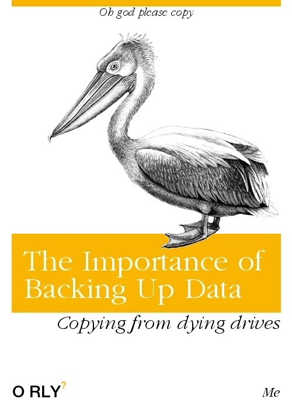

# Disk Management

<!-- INDEX_START -->

- [Mac](#mac)
- [Linux](#linux)
  - [Detect New Disk](#detect-new-disk)
  - [Create Partitions](#create-partitions)
  - [Format the partition](#format-the-partition)
  - [Verify the new formatting](#verify-the-new-formatting)
  - [Mount the new volume by unchanging UUID for maximum stability](#mount-the-new-volume-by-unchanging-uuid-for-maximum-stability)
  - [/tmp permissions](#tmp-permissions)
- [Analyzing Disk Space](#analyzing-disk-space)
- [Meme](#meme)
  - [Backing Up Data](#backing-up-data)

<!-- INDEX_END -->

## Mac

See [Mac - Disk Management](mac.md#disk-management)

## Linux

This example is from [Adding a new EBS volume to a running AWS EC2 instance](aws.md#add-an-ec2-ebs-volume).

### Detect New Disk

```shell
cat /proc/partitions
```

```text
major minor  #blocks  name

 259        0  314572800 nvme0n1
 259        1       1024 nvme0n1p1
 259        2     204800 nvme0n1p2
 259        3     512000 nvme0n1p3
 259        4  313853935 nvme0n1p4
 259        5  524288000 nvme1n1  # <-- this is the new disk which has no partitions yet
```

If you can't see it yet, run `partprobe`

```shell
sudo partprobe
```

and then repeat the above `cat /proc/partitions` (it has also appeared after a few seconds on EC2 without this)

### Create Partitions

You can create partitions using `fdisk`, `gdisk` or `parted`.

I prefer `parted` now because it's easier to script than `fdisk`, which I used to use interactively in the early to mid
2000s.

Create a new GPT partition table on the new disk:

```shell
sudo parted /dev/nvme1n1 --script mklabel gpt
```

Create a new partition that spans the entire disk:

```shell
sudo parted /dev/nvme1n1 --script mkpart primary 0% 100%
```

See the new partition:

```shell
cat /proc/partitions
```

```text
...
 259        7  524285952 nvme1n1p1
```

### Format the partition

Ext4:

```shell
sudo mkfs.ext4 /dev/nvme1n1p1
```

or

XFS:

```shell
sudo mkfs.xfs /dev/nvme1n1p1
```

### Verify the new formatting

```shell
lsblk -f /dev/nvme1n1
```

or

```shell
sudo blkid /dev/nvme1n1p1
```

### Mount the new volume by unchanging UUID for maximum stability

Since device numbers can change on rare occasion such as when adding IDE/SCSI/SAS disks to cables / disk
controller cards shunting the ordering of device numbers, find and use the UUID instead using one of these commands:

I like this one best for scripting due to its simple 2 column output format which is easy to parse:

```shell
lsblk -o NAME,UUID
```

this one requires root permission:

```shell
sudo blkid
```

```shell
ls -l /dev/disk/by-uuid/
```

```shell
findmnt -o TARGET,UUID
```

requires root:

```shell
sudo fdisk -l
```

otherwise gets this error as regular user:

```text
fdisk: cannot open /dev/nvme0n1: Permission denied
```

requires root or returns blank:

```shell
sudo parted -l
```

Add it to `/etc/fstab` with a line like this, substituting the UUID from the above commands:

```shell
UUID=xxxxxxxx-xxxx-xxxx-xxxx-xxxxxxxxxxxx /tmp xfs defaults 0 2
```

If you're using a new mount point instead of `/tmp` that doesn't exist yet, then create it:

```shell
sudo mkdir -p /mnt/newdisk
```

If the mount point is `/tmp` make sure you shut down any processes that might be using it first like
[Informatica](informatica.md) agent.

Then mount it using this short form of the `mount` command which tests the fstab at the same time:

```shell
sudo mount /tmp
```

```shell
mount: (hint) your fstab has been modified, but systemd still uses
       the old version; use 'systemctl daemon-reload' to reload.
```

```shell
sudo systemctl daemon-reload
```

Check new mounted partition and space is available:

```shell
df -Th /tmp
```

```text
Filesystem     Type  Size  Used Avail Use% Mounted on
/dev/nvme1n1p1 xfs   500G  3.6G  497G   1% /tmp
```

### /tmp permissions

If you've just mounted a new `/tmp` make sure to set a sticky bit and world writable permissions for people and apps
to be able to use it:

```shell
sudo chmod 1777 /tmp
```

## Analyzing Disk Space

- [df](https://linux.die.net/man/1/df)
- [du](https://linux.die.net/man/1/du)
- [ncdu](https://dev.yorhel.nl/ncdu) - interactive 'ncurses du' that allows you to easily drill down into the biggest
  directories
- [WinDirStat](https://windirstat.net/) - Windows GUI app showing block representations of files and directories by size
- [KDirStat](https://github.com/jeromerobert/k4dirstat) - same as WinDirStat but for Linux
- [QDirStat](https://github.com/shundhammer/qdirstat) - alternative to KDirStat without needing KDE

## Meme

### Backing Up Data


