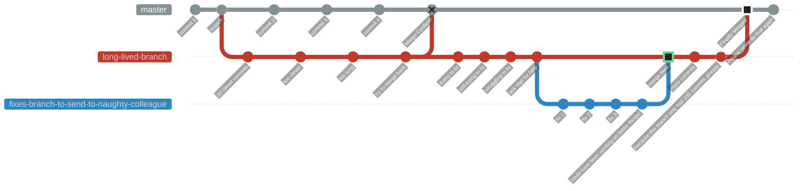

# Git Workflow Branching Strategies

### GitHub Flow - Simplest

Best for personal projects

https://guides.github.com/introduction/flow/

### GitLab Flow

https://docs.gitlab.com/ee/topics/gitlab_flow.html

### Gitflow - Most Complicated

Best for legacy versioned software maintaining minor and patches semver versioning

https://datasift.github.io/gitflow/IntroducingGitFlow.html

https://nvie.com/posts/a-successful-git-branching-model/

### Great Tips

https://docs.microsoft.com/en-us/azure/devops/repos/git/git-branching-guidance?view=azure-devops

## Environment Branching Strategy

This is an unofficial strategy that I've seen used in the real world because it's simple and it works.

It's basically the [GitHub Flow](#github-flow---simplest) strategy
except you have a branch for each of your 3 environments - Dev, Staging and Production.

TODO: Mermaid Diagram

### GitHub Flow with Jira ticket integration

Prefix Git branches with Jira ticket numbers in Jira's `AA-NNN` format for GitHub Pull Requests to automatically appear in Jira tickets (see this [doc](https://support.atlassian.com/jira-cloud-administration/docs/integrate-with-github/)):

### Git - why you shouldn't use long-lived feature branches

\* [Environment Branches](https://github.com/HariSekhon/Diagrams-as-Code/blob/master/README.md#git---environment-branches) may be one of the few exceptions but requires workflow discipline.

See Also: 100+ scripts for Git and the major Git repo providers like GitHub, GitLab, Bitbucket, Azure DevOps in my [DevOps-Bash-tools](https://github.com/HariSekhon/DevOps-Bash-tools) repo.

