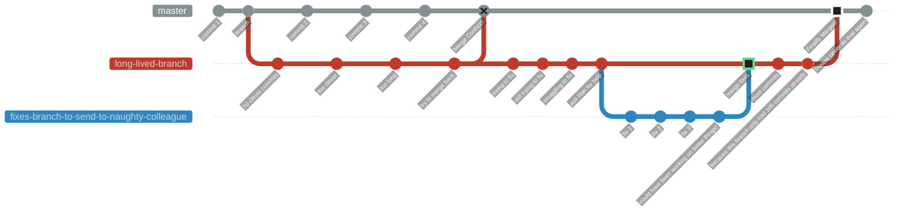

# Git Workflow Branching Strategies

<!-- INDEX_START -->

- [GitHub Flow - Simplest](#github-flow---simplest)
- [GitLab Flow](#gitlab-flow)
- [Gitflow - Most Complicated](#gitflow---most-complicated)
- [Great Tips](#great-tips)
- [Feature Flags](#feature-flags)
- [Environment Branching Strategy](#environment-branching-strategy)
- [GitHub Flow with Jira ticket integration](#github-flow-with-jira-ticket-integration)
- [Why you shouldn't use long-lived feature branches](#why-you-shouldnt-use-long-lived-feature-branches)
- [The Evils of Rebasing](#the-evils-of-rebasing)
  - [Cautionary Tale from Experience](#cautionary-tale-from-experience)
  - [Rebase Requires Force Push Overwrites Which Can Lose Code Permanently](#rebase-requires-force-push-overwrites-which-can-lose-code-permanently)
- [Squash Commits](#squash-commits)
  - [Squash Merges Require Force Deleting Branches](#squash-merges-require-force-deleting-branches)
    - [Script to safely Delete Squash Merged Branches](#script-to-safely-delete-squash-merged-branches)
  - [Squash & Merge - multiple email addresses on your GitHub account](#squash--merge---multiple-email-addresses-on-your-github-account)
- [Why You Shouldn't Use Long Lived Branches](#why-you-shouldnt-use-long-lived-branches)

<!-- INDEX_END -->

## GitHub Flow - Simplest

Best for personal projects.

<https://guides.github.com/introduction/flow/>

## GitLab Flow

<https://docs.gitlab.com/ee/topics/gitlab_flow.html>

## Gitflow - Most Complicated

Best for legacy versioned software maintaining minor and patches semver versioning.

<https://datasift.github.io/gitflow/IntroducingGitFlow.html>

<https://nvie.com/posts/a-successful-git-branching-model/>

## Great Tips

<https://docs.microsoft.com/en-us/azure/devops/repos/git/git-branching-guidance?view=azure-devops>

## Feature Flags

<https://github.blog/engineering/infrastructure/ship-code-faster-safer-feature-flags/>

## Environment Branching Strategy

This is an unofficial strategy that I've seen used in the real world because it's simple and it works.

It's basically the [GitHub Flow](#github-flow---simplest) strategy
except you have a branch for each of your 3 environments - Dev, Staging and Production.

Not everybody likes environment branches, but they worked in production for over 2 years and they are easy to use.

At least they don't [only test in Production](https://github.com/HariSekhon/Diagrams-as-Code/blob/master/README.md#devs-test-in-production)!

Another internet facing client refused to use tagging because they didn't want to have to think up version or release numbers for their website releases.

Also, contrary to some naysayers it's quite easy to diff environment branches as everything should be in Git, so you can get a very quick and easy difference between your environments in a single `git diff` command. It's also easy to automate backporting hotfixes to lower environments:

- GitHub repo: [HariSekhon/Jenkins](https://github.com/HariSekhon/Jenkin)
  - [gitMerge.groovy](https://github.com/HariSekhon/Jenkins/blob/master/vars/gitMerge.groovy)
  - [gitMergePipeline.groovy](https://github.com/HariSekhon/Jenkins/blob/master/vars/gitMergePipeline.groovy)


Note: I did eventually move this client to tagged releases using `YYYY.NN` release format, just incrementing `NN` which is a no brainer ([githubNextRelease.groovy](https://github.com/HariSekhon/Jenkins/blob/master/vars/githubNextRelease.groovy)). It turns out the developers had eventually started using releases in Jira labelled as `YYYY.NN` to track which tickets were going into which production deployment, so when I pushed for this, it made sense to them finally as not being too great an inconvenience! It's also easy to automate by creating GitHub Releases in Jenkins ([githubCreateRelease.groovy](https://github.com/HariSekhon/Jenkins/blob/master/vars/githubCreateRelease.groovy)).

## GitHub Flow with Jira ticket integration

Prefix Git branches with Jira ticket numbers in Jira's `AA-NNN` format for GitHub Pull Requests to automatically appear in Jira tickets (see this [doc](https://support.atlassian.com/jira-cloud-administration/docs/integrate-with-github/)):


## Why you shouldn't use long-lived feature branches

[Environment Branches](#environment-branching-strategy) may be one of the few exceptions but requires workflow discipline.

See Also: 100+ scripts for Git and the major Git repo providers like GitHub, GitLab, Bitbucket, Azure DevOps in my [DevOps-Bash-tools](https://github.com/HariSekhon/DevOps-Bash-tools) repo.



## The Evils of Rebasing

Some people like rebasing to make their `git log --graph` look like a straight line,
albeit with out of order timestamps 🙄.

This violates the classic version control principle of not altering history.

Git lets you get away with this because Git is ultra powerful, but...

### Cautionary Tale from Experience

While consulting in Denmark, I was called over to a desk by my colleague who had a little Git problem.

He's tried to do a "git rebase" but was hitting merge conflict after merge conflict and didn't know how to get out of it.

We spent half an hour hacking and edit through files in merge conflict after merge conflict, on two dozen commits.

These were commits that would have been auto-resolved by a default merge commit (which is why it's the default) instead
of a rebase, as the end states were the same on both branches and only the intermediate commits were different.

You thought one merge conflict was bad? Try two dozen in a row…

Welcome to "Rebase Hell".

Even if the two branches end states weren't quite the same or auto-mergeable, it would have been only a single merge
conflict to resolve instead of two dozen, some of which were futile merge resolutions because those code files were
corrected in future commits anyway, which you don't know until you've wasted your time fixing them to get to the next
commits.

Yes, I know two people shouldn't have been producing similar fixes on two branches but sometimes people are in a
rush and these things happen. Besides, this is supposed to be distributed concurrent version control.

If you think that's bad, I've worked for another company which has both `develop` and `master` branches being used
in production but which have diverged by 10,000 commits such that they cannot merge or reconcile them and must
manually copy code changes and commit to both branches.

Anyway, this "Rebase Hell" situation resulted in needless hassle and potential for introducing code editing errors on
each rebase-fix-commit step, multiplied by two dozen commits, and further multiplied by the number of files changed with
conflicts in those commits.

Never again.

It just isn't worth the trouble.

People who don't have a Git guru on hand in the team often get in such a mess that they don't know how to fix it and
just copy their code files out, delete their cloned checkout and then copy the files back in and re-commit them.

You think I'm joking, I've had colleagues who've done this and admitted it.

Yes I laughed, I couldn't help it.

### Rebase Requires Force Push Overwrites Which Can Lose Code Permanently

If you've already pushed your branch upstream, you then have to force push to overwrite your own upstream commit history
after a rebase. Yuck.

If you still insist on doing rebasing for the love of goodness please use `--force-with-lease` instead of `--force`.

This switch checks that the remote branch hasn't been changed since your last fetch since you're overwriting it,
which would otherwise lose those commits.

But unfortunately even this is trivially defeated, read the [git push](https://git-scm.com/docs/git-push) man page on
this for more details.

Do you get why you shouldn't rebase to try to have a single straight `git log --graph` line yet?

Yes you can accidentally delete code even after it's been pushed and lose it forever in Git. This is not Subversion.

With great power comes great responsibility...


## Squash Commits

Squash commit have a similar issue to rebasing in that they lose intermediate commits and keep only the last
version of a series of commits, losing the process and any code / comments that might have been useful to keep as
references in the history.

Future engineers doing `git log` will not be able to see the process of the evolution of your code,
only the very final version, somewhat defeating the purpose of version control history!

One can make the argument that squash commit merges result in only the good parts going into the trunk and keeping the
history much simpler and perhaps atomically viable (although that's what tags are for, homies). I can live with that.

If I had to pick my battles and let my engineers do one or the other,
I'd ban rebasing though after my Denmark experience.

### Squash Merges Require Force Deleting Branches

Squash merges make you _"force delete"_ your merged branches because the local git client can't tell that those
commits were merged into the trunk branch since their hashrefs are essentially lost.

This is risky because you can lose an entire branch of work if you get this wrong (eg. have similarly named branches
over time when repeatedly working on an area).

If anybody has a better solution not requiring to force delete branches on cleanup of squash merges, please let me know.

GitHub can automatically delete the upstream branch in repo, but you still have to force delete your local branch and
hope it isn't one that hasn't been pushed yet.

**You essentially lose local branch deletion safety when using squash merges.**

#### Script to safely Delete Squash Merged Branches

This script detects changes between a branch and the trunk branch before doing a branch deletion.

```shell
git_branch_delete_squash_merged.sh "$your_branch"
```

Find it in my [DevOps-Bash-tools](devops-bash-tools.md) repo.

### Squash & Merge - multiple email addresses on your GitHub account

Squash & Merge of Pull Requests is sometimes enforced by teams disallowing Merge Commits in order to keep the trunk
branch history very looking clean, at the expense of losing the intermediate commits as mentioned above.

The Squash Commit in the GitHub UI will default to using your primary email address, which is usually your
personal email address.

So be careful not to click through too quickly and commit using your personal email address into the corporate repo
(you can tell I've done this once).

Use the drop down to select your corporate email address, and subsequent Squash & Merges will remember and use that
email from that point onwards.

**Do not set your primary email address to be your corporate email address in case you use it on your public repos and expose your corporate email address publicly**

## Why You Shouldn't Use Long Lived Branches

See if you can follow this diagram from left to right:


