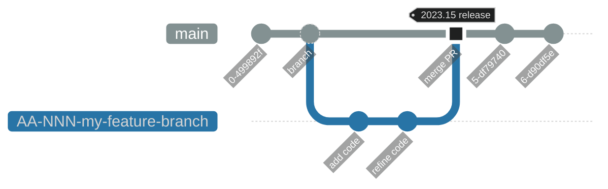
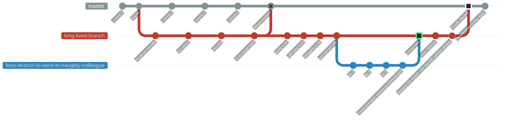

# Git Workflow Branching Strategies

<!-- INDEX_START -->

- [GitHub Flow - Simplest](#github-flow---simplest)
- [GitLab Flow](#gitlab-flow)
- [Gitflow - Most Complicated](#gitflow---most-complicated)
- [Great Tips](#great-tips)
- [Environment Branching Strategy](#environment-branching-strategy)
- [GitHub Flow with Jira ticket integration](#github-flow-with-jira-ticket-integration)
- [Why you shouldn't use long-lived feature branches](#why-you-shouldnt-use-long-lived-feature-branches)

<!-- INDEX_END -->

## GitHub Flow - Simplest

Best for personal projects.

<https://guides.github.com/introduction/flow/>

## GitLab Flow

<https://docs.gitlab.com/ee/topics/gitlab_flow.html>

## Gitflow - Most Complicated

Best for legacy versioned software maintaining minor and patches semver versioning.

<https://datasift.github.io/gitflow/IntroducingGitFlow.html>

<https://nvie.com/posts/a-successful-git-branching-model/>

## Great Tips

<https://docs.microsoft.com/en-us/azure/devops/repos/git/git-branching-guidance?view=azure-devops>

## Environment Branching Strategy

This is an unofficial strategy that I've seen used in the real world because it's simple and it works.

It's basically the [GitHub Flow](#github-flow---simplest) strategy
except you have a branch for each of your 3 environments - Dev, Staging and Production.

Not everybody likes environment branches, but they worked in production for over 2 years and they are easy to use.

At least they don't [only test in Production](https://github.com/HariSekhon/Diagrams-as-Code/blob/master/README.md#devs-test-in-production)!

Another internet facing client refused to use tagging because they didn't want to have to think up version or release numbers for their website releases.

Also, contrary to some naysayers it's quite easy to diff environment branches as everything should be in Git, so you can get a very quick and easy difference between your environments in a single `git diff` command. It's also easy to automate backporting hotfixes to lower environments:

- GitHub repo: [HariSekhon/Jenkins](https://github.com/HariSekhon/Jenkin)
  - [gitMerge.groovy](https://github.com/HariSekhon/Jenkins/blob/master/vars/gitMerge.groovy)
  - [gitMergePipeline.groovy](https://github.com/HariSekhon/Jenkins/blob/master/vars/gitMergePipeline.groovy)

Note: I did eventually move this client to tagged releases using `YYYY.NN` release format, just incrementing `NN` which is a no brainer ([githubNextRelease.groovy](https://github.com/HariSekhon/Jenkins/blob/master/vars/githubNextRelease.groovy)). It turns out the developers had eventually started using releases in Jira labelled as `YYYY.NN` to track which tickets were going into which production deployment, so when I pushed for this, it made sense to them finally as not being too great an inconvenience! It's also easy to automate by creating GitHub Releases in Jenkins ([githubCreateRelease.groovy](https://github.com/HariSekhon/Jenkins/blob/master/vars/githubCreateRelease.groovy)).

## GitHub Flow with Jira ticket integration

Prefix Git branches with Jira ticket numbers in Jira's `AA-NNN` format for GitHub Pull Requests to automatically appear in Jira tickets (see this [doc](https://support.atlassian.com/jira-cloud-administration/docs/integrate-with-github/)):

## Why you shouldn't use long-lived feature branches

\* [Environment Branches](#environment-branching-strategy) may be one of the few exceptions but requires workflow discipline.

See Also: 100+ scripts for Git and the major Git repo providers like GitHub, GitLab, Bitbucket, Azure DevOps in my [DevOps-Bash-tools](https://github.com/HariSekhon/DevOps-Bash-tools) repo.

