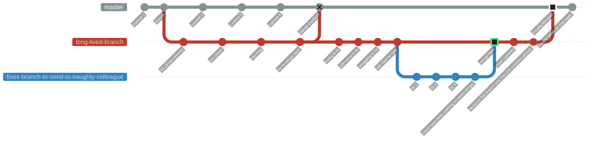

# Git

## Index

<!-- INDEX_START -->

- [Workflow Branching Strategies](#workflow-branching-strategies)
- [Advanced Git Config](#advanced-git-config)
- [GitHub SSH Key SSO Authorization](#github-ssh-key-sso-authorization)
- [Git HTTPS Authentication](#git-https-authentication)
- [CLIs](#clis)
- [GitHub Badges](#github-badges)
- [The Evils of Rebasing](#the-evils-of-rebasing)
  - [Cautionary Tale from Experience](#cautionary-tale-from-experience)
  - [Rebase Requires Force Push Overwrites Which Can Lose Code Permanently](#rebase-requires-force-push-overwrites-which-can-lose-code-permanently)
- [Squash Commits](#squash-commits)
  - [Squash Commits Require Force Deleting Branches](#squash-commits-require-force-deleting-branches)
  - [Squash & Merge - multiple email addresses on your GitHub account](#squash--merge---multiple-email-addresses-on-your-github-account)
- [Why You Shouldn't Use Long Lived Branches](#why-you-shouldnt-use-long-lived-branches)
- [Git LFS](#git-lfs)
  - [Why You Need Git LFS for Large Files](#why-you-need-git-lfs-for-large-files)
  - [Git LFS on other hosting providers](#git-lfs-on-other-hosting-providers)
- [Tips & Tricks](#tips--tricks)
  - [Git Clone using a specific SSH Key](#git-clone-using-a-specific-ssh-key)
  - [Show files not being tracked due to global & local `.gitignore` files](#show-files-not-being-tracked-due-to-global--local-gitignore-files)
  - [Find line in `.gitignore` which is causing a given file to be ignored](#find-line-in-gitignore-which-is-causing-a-given-file-to-be-ignored)
  - [Trigger CI/CD using empty commit](#trigger-cicd-using-empty-commit)
  - [Copy a file from another branch](#copy-a-file-from-another-branch)
  - [Pull from Upstream Origin in a local Fork](#pull-from-upstream-origin-in-a-local-fork)
  - [Multi-Origin Remotes](#multi-origin-remotes)
    - [Advanced - push to different branch on remote](#advanced---push-to-different-branch-on-remote)
  - [Fix Author / Email in Git Pull Request or History](#fix-author--email-in-git-pull-request-or-history)
  - [Erase Leaked Credential in Pull Request](#erase-leaked-credential-in-pull-request)
  - [Git Filter-Repo](#git-filter-repo)
  - [Git Filter-Repo Analyze](#git-filter-repo-analyze)
  - [Git Filter-Repo Replace Text in Commit History](#git-filter-repo-replace-text-in-commit-history)
  - [Git Filter-Repo Remove File(s) from Commit History](#git-filter-repo-remove-files-from-commit-history)
  - [Erase Leaked Credential in Git History](#erase-leaked-credential-in-git-history)
  - [Merge a branch from another repo into the current repo](#merge-a-branch-from-another-repo-into-the-current-repo)
  - [Reset and Re-download Git Submodule](#reset-and-re-download-git-submodule)
  - [Get the Default Branch](#get-the-default-branch)
  - [Get Current Branch](#get-current-branch)
  - [Find which upstream `<remote>/<branch>` the current branch is set to track](#find-which-upstream-remotebranch-the-current-branch-is-set-to-track)
  - [List files changed on current branch vs default branch](#list-files-changed-on-current-branch-vs-default-branch)
  - [List files added on current branch vs default branch](#list-files-added-on-current-branch-vs-default-branch)
  - [Push New Branch and Set Upstream in One Command](#push-new-branch-and-set-upstream-in-one-command)
  - [Push New Branch and Raise Pull Request in One Command](#push-new-branch-and-raise-pull-request-in-one-command)
    - [On GitHub](#on-github)
    - [On GitLab](#on-gitlab)

<!-- INDEX_END -->

## Workflow Branching Strategies

See the [Git Workflow Branching Strategies](git-workflow-branching-strategies.md) page.

## Advanced Git Config

[HariSekhon/DevOps-Bash-tools - .gitconfig](https://github.com/HariSekhon/DevOps-Bash-tools/blob/master/.gitconfig)

[HariSekhon/DevOps-Bash-tools - .gitignore](https://github.com/HariSekhon/DevOps-Bash-tools/blob/master/.gitignore)

You can inherit all configs by just cloning the [repo](https://github.com/HariSekhon/DevOps-Bash-tools#readme) and `make link` to symlink them to your home directory:

```shell
git clone https://github.com/HariSekhon/DevOps-Bash-tools bash-tools
```

```shell
cd bash-tools
make link
```

## GitHub SSH Key SSO Authorization

See [GitHub page - SSH Key SSO Authorization](github.md#github-ssh-key-sso-authorization)

## Git HTTPS Authentication

Using HTTPS for `git clone` / `pull` / `push` are more likely to bypass egress content filters on wifi portals for those of you
who travel a lot such as remote workers and digital nomads.

Credential helper config for this can be added to an individual git repo or at the global level
which is shown in the advanced [.gitconfig](https://github.com/HariSekhon/DevOps-Bash-tools/blob/master/.gitconfig) introduced above.

There is a script to add it to your local repo in the [DevOps-Bash-tools](devops-bash-tools.md):

```shell
git_remotes_set_https_creds_helpers.sh
```

After that you need either `$GH_TOKEN` or `$GITHUB_TOKEN` (in that order of precedence) in your environment variables.

Create your GitHub Personal Access Token (PAT) here:

<https://github.com/settings/tokens>

Or you can install
[Git Credentials Manager](https://docs.github.com/en/get-started/getting-started-with-git/caching-your-github-credentials-in-git#git-credential-manager)
which will prompt for your credentials and cache them the first time you `git pull` over HTTPS.

## CLIs

Standard Git CLI is already provided by XCode on Mac but you can also install it from Homebrew to get a different version:

```shell
brew install git
```

GitHub CLI:

```shell
brew install gh
```

You will need to export `$GH_TOKEN` for the GitHub CLI. Create your token [here](https://github.com/settings/tokens).

GitHub specific git commands to make things like cloning GitHub repos shorter:

```shell
brew install hub
```

GitLab CLI:

```shell
gem install --user-install gitlab
```

Bitbucket CLI:

```shell
pip install --user bitbucket-cli
```

## GitHub Badges

<https://github.com/commonality/architecture-decision-records/wiki/GitHub-repository-status-badges>

## The Evils of Rebasing

Some people like rebasing to make their `git log --graph` look like a straight line,
albeit with out of order timestamps 🙄.

This violates the classic version control principle of not altering history.

Git lets you get away with this because Git is ultra powerful, but...

### Cautionary Tale from Experience

While consulting in Denmark, I was called over to a desk by my colleague who had a little Git problem.

He's tried to do a "git rebase" but was hitting merge conflict after merge conflict and didn't know how to get out of it.

We spent half an hour hacking and edit through files in merge conflict after merge conflict, on two dozen commits.

These were commits that would have been auto-resolved by a default merge commit (which is why it's the default) instead
of a rebase, as the end states were the same on both branches and only the intermediate commits were different.

You thought one merge conflict was bad? Try two dozen in a row…

Welcome to "Rebase Hell".

Even if the two branches end states weren't quite the same or auto-mergeable, it would have been only a single merge
conflict to resolve instead of two dozen, some of which were futile merge resolutions because those code files were
corrected in future commits anyway, which you don't know until you've wasted your time fixing them to get to the next
commits.

Yes, I know two people shouldn't have been producing similar fixes on two branches but sometimes people are in a
rush and these things happen. Besides, this is supposed to be distributed concurrent version control.

If you think that's bad, I've worked for another company which has both `develop` and `master` branches being used
in production but which have diverged by 10,000 commits such that they cannot merge or reconcile them and must
manually copy code changes and commit to both branches.

Anyway, this "Rebase Hell" situation resulted in needless hassle and potential for introducing code editing errors on
each rebase-fix-commit step, multiplied by two dozen commits, and further multiplied by the number of files changed with
conflicts in those commits.

Never again.

It just isn't worth the trouble.

People who don't have a Git guru on hand in the team often get in such a mess that they don't know how to fix it and
just copy their code files out, delete their cloned checkout and then copy the files back in and re-commit them.

You think I'm joking, I've had colleagues who've done this and admitted it.

Yes I laughed, I couldn't help it.

### Rebase Requires Force Push Overwrites Which Can Lose Code Permanently

If you've already pushed your branch upstream, you then have to force push to overwrite your own upstream commit history
after a rebase. Yuck.

If you still insist on doing rebasing for the love of goodness please use `--force-with-lease` instead of `--force`.

This switch checks that the remote branch hasn't been changed since your last fetch since you're overwriting it,
which would otherwise lose those commits.

But unfortunately even this is trivially defeated, read the [git push](https://git-scm.com/docs/git-push) man page on
this for more details.

Do you get why you shouldn't rebase to try to have a single straight `git log --graph` line yet?

Yes you can accidentally delete code even after it's been pushed and lose it forever in Git. This is not Subversion.

With great power comes great responsibility...

## Squash Commits

Squash commit have a similar issue to rebasing in that they lose intermediate commits and keep only the last
version of a series of commits, losing the process and any code / comments that might have been useful to keep as
references in the history.

Future engineers doing `git log` will not be able to see the process of the evolution of your code,
only the very final version, somewhat defeating the purpose of version control history!

One can make the argument that squash commits result in only the good parts going into the trunk and keeping the history
much simpler and perhaps atomically viable (although that's what tags are for, homies). I can live with that.

### Squash Commits Require Force Deleting Branches

Squash merges make you _"force delete"_ your merged branches because the local git client can't tell that those
commits were merged into the trunk branch since their hashrefs are essentially lost.

This is risky because you can lose an entire branch of work if you get this wrong (eg. have similarly named branches
over time when repeatedly working on an area).

If anybody has a better solution not requiring to force delete branches on cleanup of squash merges, please let me know.

GitHub can automatically delete the upstream branch in repo, but you still have to force delete your local branch and
hope it isn't one that hasn't been pushed yet.

**You essentially lose local branch deletion safety when using squash merges.**

If I had to pick my battles and let my engineers do one or the other,
I'd ban rebasing though after my Denmark experience.

### Squash & Merge - multiple email addresses on your GitHub account

Squash & Merge of Pull Requests is sometimes enforced by teams disallowing Merge Commits in order to keep the trunk
branch history very looking clean, at the expense of losing the intermediate commits as mentioned above.

The Squash Commit in the GitHub UI will default to using your primary email address, which is usually your
personal email address.

So be careful not to click through too quickly and commit using your personal email address into the corporate repo
(you can tell I've done this once).

Use the drop down to select your corporate email address, and subsequent Squash & Merges will remember and use that
email from that point onwards.

**Do not set your primary email address to be your corporate email address in case you use it on your public repos and expose your corporate email address publicly**

## Why You Shouldn't Use Long Lived Branches

See if you can follow this diagram from left to right:



## Git LFS

<https://git-lfs.com/>

Store big files in GitHub repos (1GB limit for free accounts).

I used this to store old training materials like videos, PDFs, zip files etc. so they are safe and I can then save space locally.

GitHub will block files over 100MB from being `git push` otherwise.

Install Git LFS extension on Mac:

```shell
brew install git-lfs
```

Install the Git LFS config into your `$HOME/.gitconfig`:

```shell
git lfs install
```

In your repo add the big file types to be tracked in your local repo (configures `.gitattributes`):

```shell
git lfs track '*.mp4'
```

Commit the `.gitattributes` changes:

```shell
git add .gitattributes
git commit -m "add mp4 file type to be tracked by Git LFS in .gitattributes"
```

Override global extensive [.gitignore](https://github.com/HariSekhon/DevOps-Bash-tools/blob/master/.gitignore)
if you've copied it from or installed [DevOps-Bash-tools](https://github.com/HariSekhon/DevOps-Bash-tools#readme) using a local repo `.gitignore`.

See [files being ignored](#show-files-not-being-tracked-due-to-global--local-gitignore-files).

```shell
echo '!*.mp4' >> .gitignore
git commit -m "allowed .mp4 files to be git committed in .gitignore"
```

```shell
git add *.mp4
```

```shell
git commit -m "added mp4 videos"
```

Automatically uploads the files to GitHub or whatever is configured as your upstream Git server using LFS storage:

```shell
git push
```

See LFS details:

```shell
git lfs env
```

On another computer you must install Git LFS before you clone.

Otherwise you'll get a checkout with 4K pointer files instead of the actual file contents because Git LFS smudges the checkout to
download the file blobs to replace in your checkout.

### Why You Need Git LFS for Large Files

You'll get errors like this trying to push large files to GitHub:

```shell
$ git push -u origin master
Enumerating objects: 52, done.
Counting objects: 100% (52/52), done.
Delta compression using up to 4 threads
Compressing objects: 100% (52/52), done.
Writing objects: 100% (52/52), 584.76 MiB | 2.05 MiB/s, done.
Total 52 (delta 0), reused 0 (delta 0)
remote: warning: File COURSE.pdf is 69.89 MB; this is larger than GitHub's recommended maximum file size of 50.00 MB
remote: warning: File COURSE2.pdf is 64.61 MB; this is larger than GitHub's recommended maximum file size of 50.00 MB
remote: error: Trace: 98e304dad85b91bcb5f726886ddce1b51a5b450523fc93f44ea51e64b444b69c
remote: error: See https://gh.io/lfs for more information.
remote: error: File COURSE.mp4 is 100.27 MB; this exceeds GitHub's file size limit of 100.00 MB
remote: error: GH001: Large files detected. You may want to try Git Large File Storage - https://git-lfs.github.com.
To github.com:HariSekhon/training-old.git
 ! [remote rejected] master -> master (pre-receive hook declined)
error: failed to push some refs to 'git@github.com:HariSekhon/training-old.git'
```

### Git LFS on other hosting providers

GitLab works fine for both push and clone.

Azure DevOps seems to work for push but doesn't show the file contents in the web UI preview and cloning resulted in a checkout error after clone and neither `git restore --source=HEAD :/` nor `git reset HEAD --hard` worked to get Git LFS to smudge and download the large files.

Unfortunately GitHub limits large files to only 1GB for free accounts, so only use it for files over 100MB. GitHub will disable your LFS after you go over the thresholds for storage or bandwidth usage for the month.

Bitbucket is useless because the [free tier](https://bitbucket.org/harisekhon/workspace/settings/plans) only gives 1GB storage (use GitHub instead):

```shell
$ git push bitbucket
Uploading LFS objects:   0% (0/51), 0 B | 0 B/s, done.
batch response:
********************************************************************************
[ERROR] Your LFS push failed because you're out of file storage
[ERROR] Change your plan to get more file storage:
[ERROR] https://bitbucket.org/account/user/harisekhon/plans
********************************************************************************

error: failed to push some refs to 'git@bitbucket.org:HariSekhon/training-old.git'
```

Bitbucket also requires disabling locking:

```shell
git config lfs.https://ssh.dev.azure.com/v3/<user>/<project>/<repo>.git/info/lfs.locksverify false
```

[Multi-origin](#multi-origin-remotes) pushes fail and require individual remote pushes:

```shell
$ git push
...
remote: GitLab: LFS objects are missing. Ensure LFS is properly set up or try a manual "git lfs push --all".
To gitlab.com:HariSekhon/training-old.git
 ! [remote rejected] master -> master (pre-receive hook declined)
error: failed to push some refs to 'git@gitlab.com:HariSekhon/training-old.git'
...

$ git push gitlab
```

## Tips & Tricks

### Git Clone using a specific SSH Key

Git SSH Clone with a specific private key:

```shell
GIT_SSH_COMMAND="ssh -i teamcity_github_ssh_key" git clone git@github.com:ORG/REPO
```

### Show files not being tracked due to global & local `.gitignore` files

```shell
git status --ignored
```

### Find line in `.gitignore` which is causing a given file to be ignored

If you have a large [.gitignore](https://github.com/HariSekhon/DevOps-Bash-tools/blob/master/.gitignore)
and want to find which line is causing a file to be ignored, do this:

```shell
git check-ignore -v -- .github/scripts/
```

output:

```none
/Users/h.sekhon/.gitignore:3711:[Ss]cripts      .github/scripts/
```

### Trigger CI/CD using empty commit

Use for cases where PR checks are failing on PR metadata
and you just need a fresh run triggered but don't need to change your branch contents.

This has the advantage of avoiding dismissing your already hard earnt GitHub Pull Request approvals and re-bugging your
colleagues to re-approve some trivial unnecessary change.

```shell
git commit --allow-empty -m 'Empty commit to trigger CI'
```

### Copy a file from another branch

```shell
git checkout "$branch" "$filename"
```

This puts it straight into the cache for commit, so you'll need to `git reset` if you don't want to commit it.

### Pull from Upstream Origin in a local Fork

To make it easier to stay up to date with an upstream source repo when you're in a clone of its fork, add it:

```shell
git remote add upstream "$url_to_original_repo"
```

You can then pull from the upstream to your local fork branch:

```shell
git pull upstream main
```

Remember not to make any commits to your fork's main trunk branch.

It needs to stay cleanly aligned with the upstream and only be used to merge upstream updates into your personal feature branch in your fork.

That personal feature branch will contain your changes to raise pull requests back to the main trunk branch of the upstream repo.

### Multi-Origin Remotes

Store your repo on multiple Git repo providers.

Useful for backups in case there is an outage to [GitHub](https://github.com) / [GitLab](https://gitlab.com) / [Bitbucket](https://bitbucket.org) / [Azure DevOps](https://dev.azure.com) - you can still pull / push to the other.

Add one or more remote repo URLs to the current git checkout:

See [bash-tools/git/git_remotes_set_multi_origin.sh](https://github.com/HariSekhon/DevOps-Bash-tools/blob/master/git/git_remotes_set_multi_origin.sh) which automates this to all major Git hosting providers

```shell
git remote set-url --add origin $url2
git remote set-url --add origin $url3
```

See the remotes configured for origin:

```shell
$ git remote -v
origin  git@github.com:HariSekhon/DevOps-Bash-tools (fetch)
origin  git@github.com:HariSekhon/DevOps-Bash-tools (push)
origin  git@gitlab.com:HariSekhon/DevOps-Bash-tools (push)
origin  git@bitbucket.org:HariSekhon/DevOps-Bash-tools (push)
origin  git@ssh.dev.azure.com:v3/harisekhon/GitHub/DevOps-Bash-tools (push)
```

A standard git push will then push to all URLs for upstream hosted repos:

```shell
git push
```

Pull from all remotes:

```shell
git pull --all
```

Fetch all branches from all remotes but does not merge changes in, similar to `git fetch` but for all branches:

```shell
git remote update
```

#### Advanced - push to different branch on remote

Configures the remote to push local master branch to dev branch upstream

```shell
git config remote.<name>.push master:dev
```

### Fix Author / Email in Git Pull Request or History

If you've accidentally committed using your personal email at work or worse, your work email in your public github
projects, I've written a script to make this easy by wrapping `git filter-branch`.

A force push would be required which will replace all later hash refs after the first change and cause conflicts
with existing checkouts which if merged could re-introduce the bit you don't want. You must coordinate with your peers
to replace their clones in that case if they're already pulled.

```shell
git clone https://github.com/HariSekhon/DevOps-Bash-tools bash-tools
bash-tools/git/git_filter_branch_fix_author.sh --help  # for details
```

### Erase Leaked Credential in Pull Request

GitHub has added automation for [support ticket](https://support.github.com/tickets) requests to delete a pull request containing a credential.

If you reset the branch contents and force push without the credential then you may not need to even delete the PR
as it'll replace the diff.

**First remove the credential from the file(s).**

Find the common divergence point for your branch:

```shell
base_branch="master"  # or main
your_branch="$(git branch --show-current)"
base_commit="$(git merge-base "$base_branch" "$yourbranch")"

git diff --name-only "$base_branch".."$your_branch" >> filelist.txt
```

Roll back the branch to the fork point:

```shell
git reset "$base_commit"
```

Re-add all the files you add/updated in this branch:

```shell
git add $(cat filelist.txt)
```

Re-commit all the changed files:

```shell
git commit -m "squashed all branch changes into one commit to wipe out the credential that shouldn't have been in there")
```

Then force push to overwrite the Pull Request contents to wipe out the leaked credential:

```shell
git push --force
```

(if you get an error you need to temporarily disable the force push branch protection)

### Git Filter-Repo

<https://github.com/newren/git-filter-repo>

3rd party Git command add-on that's useful for replacing a token, author name/email, or excluding files and is recommended over the lower-level `git filter-branch`.

### Git Filter-Repo Analyze

Creates a bunch of text files with interesting stats on the contents of the repo to figure out what to replace:

```shell
git filter-repo --analyze

less .git/filter-repo/analysis/*
```

### Git Filter-Repo Replace Text in Commit History

Useful to remove tokens accidentally committed.

It's too late if the commits with the token have been pushed as the upstream repo could have been cloned after push so
you can't get it back. If nobody has cloned you can force push to wipe it from the upstream history but you can't
guarantee that the repo wasn't pulled/cloned and that the token isn't compromised so it should be rotated and
invalidated for safety.

See [git_filter_repo_replace_text.sh](https://github.com/HariSekhon/DevOps-Bash-tools/blob/master/git/git_filter_repo_replace_text.sh)

### Git Filter-Repo Remove File(s) from Commit History

Remove all the paths specified in the text file:

```shell
git filter-repo --invert-paths --paths-from-file paths_to_remove.txt  # --force
```

(`git filter-repo --help` for details on the path file format)

See [git_files_in_history.sh](https://github.com/HariSekhon/DevOps-Bash-tools/blob/master/git/git_filter_repo_replace_text.sh)
to see what files are in the git history that you might want to remove.

### Erase Leaked Credential in Git History

Can also be used to remove reference to client names in public projects.

First clone [DevOps-Bash-tools](devops-bash-tools.md), then run the script in there:

```shell
bash-tools/git/git_filter_repo_replace_text.sh --help  # for details
```

### Merge a branch from another repo into the current repo

```shell
git fetch "$git_repo_url_or_checkout_directory" +"$remote_branch":"$locally_mirrored_branch"
```

Merge it into the current branch, eg. `main`

```shell
git merge --allow-unrelated-histories "$locally_mirrored_branch"
```

Then see the [Git Filter-Repo Remove File(s) from Commit History](#git-filter-repo-remove-files-from-commit-history)
section to remove files from the history of the other repo that you don't want polluting and bloating your new repo.

### Reset and Re-download Git Submodule

To resolve submodule update merge conflicts:

1. Delete the submodule directory
2. Delete the `.git/modules` cache of the submodule

```shell
rm -fr ".git/modules/$name"
```

3. Re-initialize the submodule

```shell
git submodule update --init --recursive
```

### Get the Default Branch

```shell
git symbolic-ref refs/remotes/origin/HEAD | sed 's|.*/||'
```

### Get Current Branch

```shell
git rev-parse --abbrev-ref HEAD
```

In newer versions of Git version 2.22 (Q2 2019+):

```shell
git branch --show-current
```

### Find which upstream `<remote>/<branch>` the current branch is set to track

```shell
git for-each-ref --format='%(upstream:short)' "$(git symbolic-ref -q HEAD)"
```

### List files changed on current branch vs default branch

First find the trunk default branch to compare to the current branch:

```shell
default_branch="$(git symbolic-ref refs/remotes/origin/HEAD | sed 's|.*/||')"
```

Then find the changed files since branching from the trunk default branch:

```shell
git diff --name-only "$default_branch"..
```

or

```shell
git log --name-only --pretty="" "origin/$default_branch".. | sort -u
```

If you forget to the set the `default_branch` by running the first command you'll get this error:

```none
fatal: ..: '..' is outside repository at '/Users/hari/github/bash-tools'
```

### List files added on current branch vs default branch

```shell
default_branch="$(git symbolic-ref refs/remotes/origin/HEAD | sed 's|.*/||')"
```

```shell
git log --diff-filter=A --name-only --pretty="" "origin/$default_branch".. | sort -u
```

### Push New Branch and Set Upstream in One Command

```shell
git push --set-upstream origin "$(git rev-parse --abbrev-ref HEAD)"
```

### Push New Branch and Raise Pull Request in One Command

Using [DevOps-Bash-tools](devops-bash-tools.md) repo scripts:

#### On GitHub

Push and open the PR in your web browser to click complete:

```shell
github_push_pr_preview.sh
```

Push and create the PR immediately (see `--help` description for options including immediately merge):

```shell
github_push_pr.sh
```

#### On GitLab

Push and open the PR in your web browser to click complete:

```shell
gitlab_push_pr_preview.sh
```

Push and create the PR immediately (see `--help` description for options including immediately merge):

```shell
gitlab_push_pr.sh
```

If sourcing [DevOps-Bash-tools](devops-bash-tools.md) `.bashrc` then you can simply type:

```shell
pushu  # to push and preview the PR
```

or

```shell
pushup  # to push and raise the PR
```

**Partial port from private Knowledge Base page 2012+**
