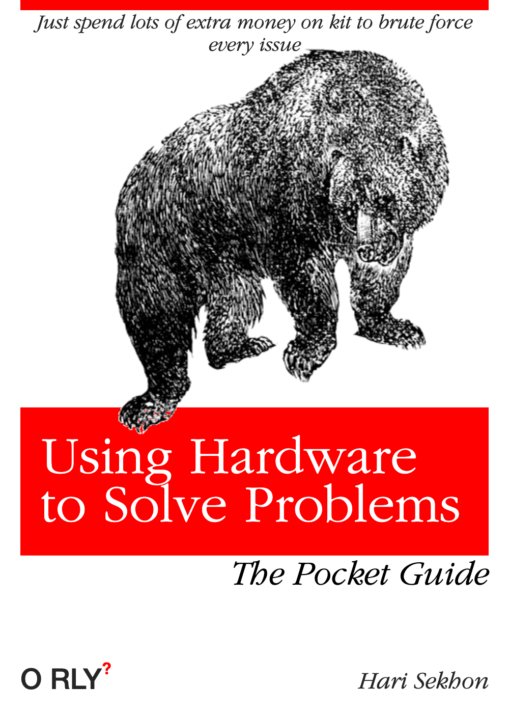

# Hardware

See also [Performance Engineering](performance.md).

<!-- INDEX_START -->

- [HP](#hp)
  - [HP Proliant Array Configuration Utility](#hp-proliant-array-configuration-utility)
- [Dell](#dell)
  - [DRAC - Dell Remote Access Controller](#drac---dell-remote-access-controller)
    - [`racadm` Commands](#racadm-commands)
- [Broadcom MegaRaid](#broadcom-megaraid)
  - [MegaCLI](#megacli)
- [See Also](#see-also)
- [Meme](#meme)
  - [Using Hardware to Solve Problems](#using-hardware-to-solve-problems)

<!-- INDEX_END -->

## HP

### HP Proliant Array Configuration Utility

[Official Doc & Download](https://support.hpe.com/hpesc/public/docDisplay?docId=c02759395&docLocale=en_US)

[DataDisk.co.uk Reference](http://www.datadisk.co.uk/html_docs/redhat/hpacucli.htm)

[Ben Tasker's Cheatsheet](https://snippets.bentasker.co.uk/page-1708021003-HPACUCLI-Cheat-Sheet-BASH.html)

[Cheatography Cheatsheet](https://cheatography.com/the-iceman-blog/cheat-sheets/hpacucli/)

```shell
hpacucli controller all show config
```

## Dell

### DRAC - Dell Remote Access Controller

Hardware card with a second networking interface and IP address for out-of-bounds management of a server
and remote hardware and console to recover servers.

<https://www.dell.com/en-uk/lp/dt/open-manage-idrac>

Default user is `root`, default password is `calvin`.

```shell
ssh root/calvin@<drac_ip>
```

Change the DRAC admin password:

```shell
racadm config -g cfgUserAdmin -o cfgUserAdminPassword -i 2 $new_passwd
```

Run a check against your DRACs to ensure their passwords are changed:

in [HariSekhon/Nagios-Plugins](https://github.com/HariSekhon/Nagios-Plugins):

[check_ssh_login.pl](https://github.com/HariSekhon/Nagios-Plugins/blob/master/check_ssh_login.pl) - written specifically to automatically test my server fleets for any remaining default passwords, an inherited check on every server added to Nagios or any [compatible enterprise monitoring system](https://github.com/HariSekhon/Nagios-Plugins#enterprise-monitoring-systems).

#### `racadm` Commands

```shell
racadm serveraction hardreset
```

```shell
racadm serveraction gracereboot
```

```shell
racadm serveraction graceshutdown
```

```shell
racadm serveraction powercycle
```

```shell
racadm serveraction powerup
```

```shell
racadm serveraction powerdown
```

```shell
omreport chassis [memory]
```

## Broadcom MegaRaid

### MegaCLI

Use `-NoLog` arg, otherwise `megacli` drops a little log in your `$PWD`.

The capitalization is not required in general, so `-LdPdInfo` is the same as `-ldpdinfo`.

Show status:

```shell
MegaCli64 -AdpAllInfo -aAll
```

Get physical drive info:

```shell
MegaCli64 -PDList -aAll
```

Get virtual disk info:

```shell
MegaCli64 -LDInfo -Lall -aAll
```

Display configuration:

```shell
MegaCli64 -CfgDsply -aAll
```

Dump eventlog events to file 'events' and open it:

```shell
MegaCli64 -AdpEventLog -GetEvents -f events -aAll && less events
```

Show you the logical to physical disk mapping:

```shell
MegaCli64 -ldpdinfo -aAll
```

Build a logical disk:

```shell
MegaCli64 -CfgLdAdd -r$raid_level[$enclosure_id:$drive,$enclosure_id:$drive...] -a0
```

Show info from single disk:

```shell
MegaCli64 -pdInfo -PhysDrv[$enclosure_id:$disk] -aAll
```

## See Also

[Storage](storage.md)

## Meme

### Using Hardware to Solve Problems



**Ported from private Knowledge Base page 2010+**
