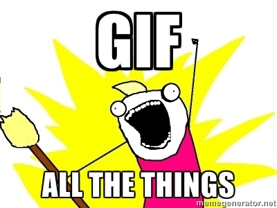

# Image

<!-- INDEX_START -->

- [Open an image file from the command line](#open-an-image-file-from-the-command-line)
- [Check & Change the default Application for a given file type](#check--change-the-default-application-for-a-given-file-type)
- [Convert Webp to PNG format](#convert-webp-to-png-format)
- [Convert SVG to PNG format](#convert-svg-to-png-format)
- [Trim Pixels off one side of an Image](#trim-pixels-off-one-side-of-an-image)
- [Join Two Images Together](#join-two-images-together)
- [Create Animated GIFs of Terminal Commands](#create-animated-gifs-of-terminal-commands)
- [Inspect Image File Metadata](#inspect-image-file-metadata)
- [Look for Watermarks](#look-for-watermarks)
- [Steghide](#steghide)
- [Image Upload Sites](#image-upload-sites)

<!-- INDEX_END -->

## Open an image file from the command line

From [DevOps-Bash-tools](devops-bash-tools.md) repo,
determines whatever tool is available on either Linux or Mac and uses that to open the image file:

```shell
imageopen.sh "$filename"
```

This uses the default application for the file type.

## Check & Change the default Application for a given file type

```shell
brew install duti
```

Check default Application for a given file type:

```shell
duti -x svg
```

Change this from say Inkscape which is a slow editor for just file viewing, to Google Chrome which is faster:

```shell
duti -s com.google.Chrome public.svg-image all
```

## Convert Webp to PNG format

[medium.com](medium.md) doesn't support using newer webp format images on the site so you need to convert them first:

On Mac, install the Imagemagick or Webp [homebrew](brew.md) packages:

```shell
brew install imagemagick
```

or

```shell
brew install webp
```

Convert the image using ImageMagick:

```shell
magick "$name.webp" "$name.png"
```

or using `dwebp`:

```shell
dwebp "$name.webp" -o "$name.png"
```

or more simply use this script in [DevOps-Bash-tools](devops-bash-tools.md) repo
which will find / install and use one of the above tools, and protect against overwriting:

```shell
webp_to_png.sh "$name.webp"
```

You can also inspect the webp header like this:

```shell
webpinfo "$name.webp"
```

## Convert SVG to PNG format

Many major websites like [LinkedIn](https://linkedin.com), [Medium](https://medium.com) and [Reddit](https://reddit.com)
do not accept SVG images so you must convert to another supported format like PNG.

Using ImageMagick:

```shell
convert "$name.svg" "$name.png"
```

or using Inkscape (slower than ImageMagick):

```shell
inkscape "$name.svg" --export-filename="$name.png"
```

or using `rsvg-convert`:

```shell
rsvg-convert "$name.svg" -o "$name.png"
```

or more simply use this script in [DevOps-Bash-tools](devops-bash-tools.md) repo
which will find / install and use one of the above tools and protect against overwriting:

```shell
svg_to_png.sh "$name.svg"
```

## Trim Pixels off one side of an Image

Useful for tweaking Screenshots before sharing them.

You can use Imagemagick to do this from the command line more easily than using Gimp.

Use this script from [DevOps-Bash-tools](devops-bash-tools.md) repo,
as it's easier than using UI tools like Gimp or even ImageMagick directly etc.

```shell
image_trim_pixels.sh "$image" <top|bottom|left|right> "$num_pixels"
```

## Join Two Images Together

Useful to create memes.

Since images can have different widths and end up with whitespace around the smaller image,
use this script from the [DevOps-Bash-tools](devops-bash-tools.md) repo
to joins them after matching their heights or widths so they align correctly:

```shell
image_join_vertical.sh "$top_image" "$bottom_image" "joined_image.png"
```

```shell
image_join_horizontal.sh "$left_image" "$right_image" "joined_image.png"
```

## Create Animated GIFs of Terminal Commands

[:octocat: icholy/ttygif](https://github.com/icholy/ttygif)

[:octocat: asciinema/asciinema](https://github.com/asciinema/asciinema)

[:octocat: faressoft/terminalizer](https://github.com/faressoft/terminalizer)

From [DevOps-Bash-tools](https://github.com/HariSekhon/DevOps-Bash-tools#terminal-gif-capture):

```shell
ttygif.sh
```

```shell
asciinema.sh
```

```shell
terminalizer.sh
```

Create custom Terminalizer config:

```shell
terminalizer init
```

```text
The global config directory is created at
/Users/hari/.config/terminalizer
```

Then edit:

```shell
vim ~/.config/terminalizer/config.yml
```



## Inspect Image File Metadata

```shell
exiftool "$file"
```

Identify command from imagemagick is more verbose:

```shell
identify -verbose "$file"
```

Exiv2 is less reliable:

```shell
exiv2 "$file"
```

## Look for Watermarks

```shell
magick "$file" -edge 1 output.jpg
```

Then visually inspect the `output.jpg` which is blacked out to see sillouttes more easily.

You can also try converting to black & white (grey):

```shell
magick "$file" -channel Red -separate output.jpg
```

## Steghide

This on only works if you've hidden something inside the image and know the password to extract it:

```shell
steghide info "$file"
```

Looks like this is removed from Mac Homebrew, launch it in a debian docker container instead:

```shell
steghide extract -sf "$file"
```

## Image Upload Sites

See the [File Upload & Code PasteBin sites](upload-sites.md) doc.
