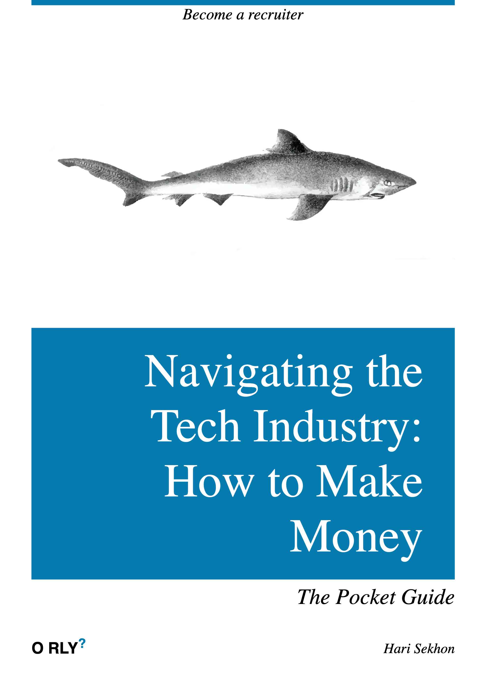

# Interview Materials

<!-- INDEX_START -->

- [Reading Materials](#reading-materials)
- [Interview Tips](#interview-tips)
  - [Pre-Interview Preparation](#pre-interview-preparation)
  - [First Impressions](#first-impressions)
  - [The STAR Method](#the-star-method)
  - [Composure](#composure)
  - [End Strong](#end-strong)
- [Memes](#memes)
  - [Technical Interview vs Actual Job](#technical-interview-vs-actual-job)
  - [Navigating the Tech Industry - How to Make Money](#navigating-the-tech-industry---how-to-make-money)
  - [Skills Need to Get Job vs Do Job](#skills-need-to-get-job-vs-do-job)
  - [Recruitment - Vetting Candidates by Parroting Keywords](#recruitment---vetting-candidates-by-parroting-keywords)
  - [Careers today are a walk in the park...](#careers-today-are-a-walk-in-the-park)

<!-- INDEX_END -->

## Reading Materials

- <https://www.theintrovertedrecruiter.co.uk/50-common-behavioural-job-interview/>

## Interview Tips

### Pre-Interview Preparation

Spend at least 1 hour.

- Research the company - Google, [Crunchbase](https://www.crunchbase.com/) etc.
- Stalk your interviewer's LinkedIn profile (but don’t connect)
- Spot a recent win or post
- Drop it naturally into the conversation to show you've done your homework and taken an interest

### First Impressions

The first 30 seconds set the tone.

- Be presentable (even on Zoom)
- Have good posture, sit tall
- Smile before you speak
- Mirror the interviewer's energy and pacing for balance, letting both sides speak back and forth for good converation

### The STAR Method

Situation, Task, Action, Result.

What did you do and what was the outcome.

another version:

Problem → Action → Result → Lesson.

Prepare 3 stories:

- Leadership
- Success
- Failure

Be able to deliver each story within 2 minutes.

### Composure

Pause before answering tough questions.

This shows composure and thoughtfulness, not confusion or rushing.

Thoughtful and measured beats fast and rushed.

### End Strong

Ask about their biggest challenges.

Link your experience to solving it.

Ask 2-3 good questions based on your discussions during the interview, I've given the first one above that I always use.

Be genuinely interested in the situation of their environment.

## Memes

### Technical Interview vs Actual Job

### Navigating the Tech Industry - How to Make Money

### Skills Need to Get Job vs Do Job

### Recruitment - Vetting Candidates by Parroting Keywords

### Careers today are a walk in the park...

