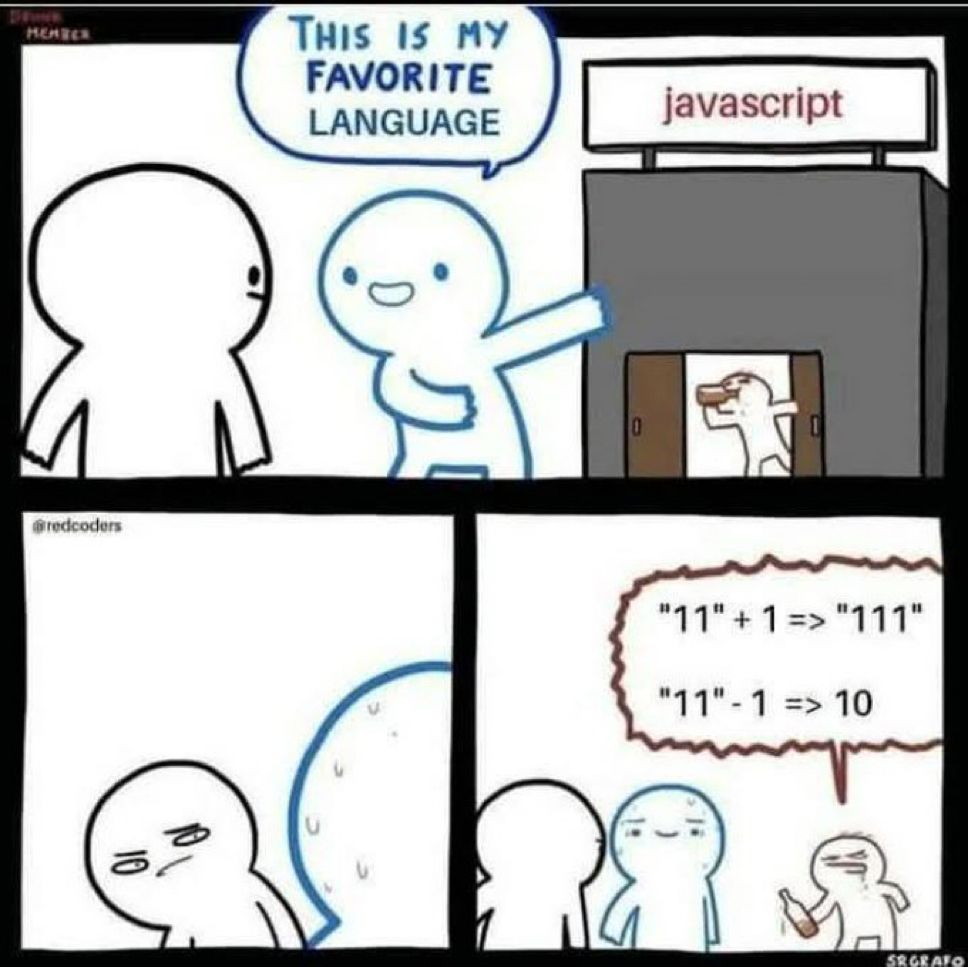

# JavaScript

It's nothing to do with Java.

<!-- INDEX_START -->

- [NodeJS](#nodejs)
  - [NPM](#npm)
  - [REPL](#repl)
- [TypeScript](#typescript)
  - [Install TypeScript](#install-typescript)
  - [Convert TypeScript to JavaScript](#convert-typescript-to-javascript)
  - [TypeScript Config](#typescript-config)
- [Libraries](#libraries)
- [Repos](#repos)
- [Memes](#memes)
  - [JavaScript - The Good Parts](#javascript---the-good-parts)
  - [JavaScript TypeScript Friends](#javascript-typescript-friends)
  - [Men Who Take Risks](#men-who-take-risks)

<!-- INDEX_END -->

## NodeJS

NodeJS or Node.js is a server-side JavaScript engine built on Google Chrome's V8 JavaScript engine
that can be used for both frontend and backend development.

Uses a non-blocking, event-driven architecture, making it ideal for building scalable and high-performance applications
that handle a large number of simultaneous connections.

NodeJS operates on a single-threaded event loop model, but it uses non-blocking asynchronous I/O operations to handle concurrency efficiently

Like [Python](python.md), NodeJS has a vast ecosystem of libraries, which you can search at
[npmjs.com](https://www.npmjs.com/).

NodeJS is used for everything from web development, to APIs and microservices, to CLI tools
(although there are better languages for CLI like [Golang](go.md), [Python](python.md), [Perl](perl.md) and [Bash](bash.md)).

### NPM

NodeJS Package Manager.

Install it using your system package manager and then use it to install your NodeJS libraries.

```shell
brew install npm
```

On any Mac or Linux, from [DevOps-Bash-tools](devops-bash-tools.md):

```shell
install_packages.sh npm
```

NPM install package:

```shell
npm install "$package"
```

**Remember to commit the resulting `package.json` and `package-lock.json` files to [Git](git.md).**

Both files as in [JSON](json.md) format.

- `package.json` - lists packages you've installed directly
- `package-lock.json` - lists the exact versions of all package dependencies so you can reproduce without annoying
  library version change related issues

Install all packages of the exact versions from ``packages-lock.json`:

```shell
npm install
```

### REPL

To start an interactive Javascript shell, just type:

```shell
node
```

Then behold this horror:

```javascript
> "11" + 1
'111'
> "11" - 1
10
```



Which brings us on to... strict variable typing...

## TypeScript

Type safe superset of JavaScript with optional static type checking.

Transpiles (converts) to JavaScript eg. `src/*.ts` => `dist/index.js`.

Not compiles since it doesn't translate to binary or byte code.

Example variable type enforcement, just suffix the `: <type>` to a variable:

```typescript
let name: string = "Hari";

name = 1; // type error
```

### Install TypeScript

```shell
npm install -g typescript
```

### Convert TypeScript to JavaScript

```text
tsc example.ts
```

Generates `example.js`.

Run it:

```shell
node example.js
```

### TypeScript Config

Create a `tsconfig.json` for project settings:

```shell
tsc --init
```

## Libraries

- [:octocat: cure53/DOMPurify](https://github.com/cure53/DOMPurify) - sanitize HTML to avoid XSS attacks.
  You can see this used in my [TamperMonkey](tampermonkey.md) script
  [jira_description_autofill.js](https://github.com/HariSekhon/TamperMonkey/blob/main/jira_description_autofill.js).
- [:octocat: https://github.com/highlightjs/highlight.js](https://github.com/highlightjs/highlight.js) -
  syntax highlighter
  - <https://highlightjs.org/>
  - online [Demo](https://highlightjs.org/demo)
  - [NPM package - highlight.js](https://www.npmjs.com/package/highlight.js)
  - [ReadTheDocs - HighlightJS](https://highlightjs.readthedocs.io/en/latest/readme.html)

## Repos

[](https://github.com/HariSekhon/TamperMonkey)

## Memes

### JavaScript - The Good Parts


### JavaScript TypeScript Friends


### Men Who Take Risks


