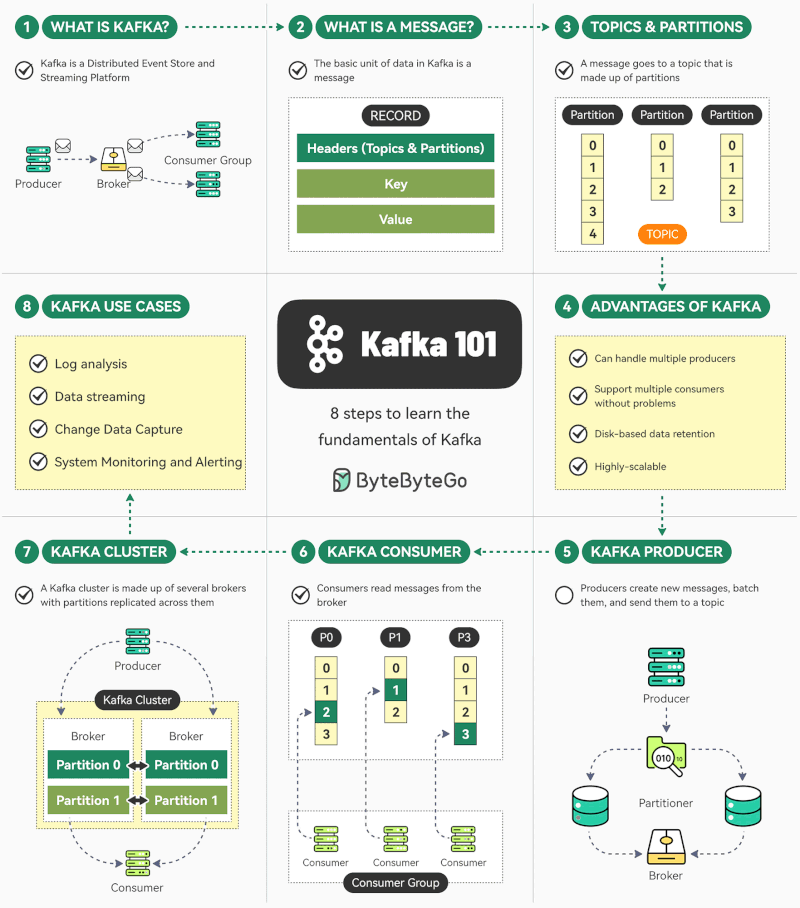

# Kafka

TODO: port Kafka notes here

<!-- INDEX_START -->

- [Nagios-Plugin-Kafka with Kerberos support](#nagios-plugin-kafka-with-kerberos-support)
- [Nagios Plugins for Kafka API written in Python & Perl](#nagios-plugins-for-kafka-api-written-in-python--perl)
- [Diagram - Kafka Flink Elasticsearch](#diagram---kafka-flink-elasticsearch)
- [Kafka 101](#kafka-101)

<!-- INDEX_END -->

## Nagios-Plugin-Kafka with Kerberos support

[HariSekhon/Nagios-Plugin-Kafka](https://github.com/HariSekhon/Nagios-Plugin-Kafka)

API monitoring plugin does full pub-sub unique message with Kerberos support. Written in [Scala](scala.md).

## Nagios Plugins for Kafka API written in Python & Perl

[HariSekhon/Nagios-Plugins](https://github.com/HariSekhon/Nagios-Plugins)

## Diagram - Kafka Flink Elasticsearch

## Kafka 101

