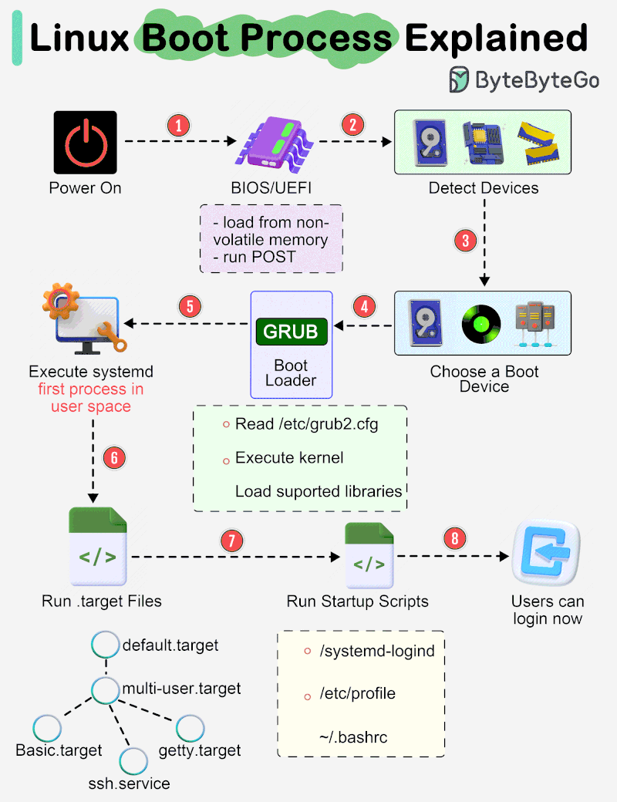
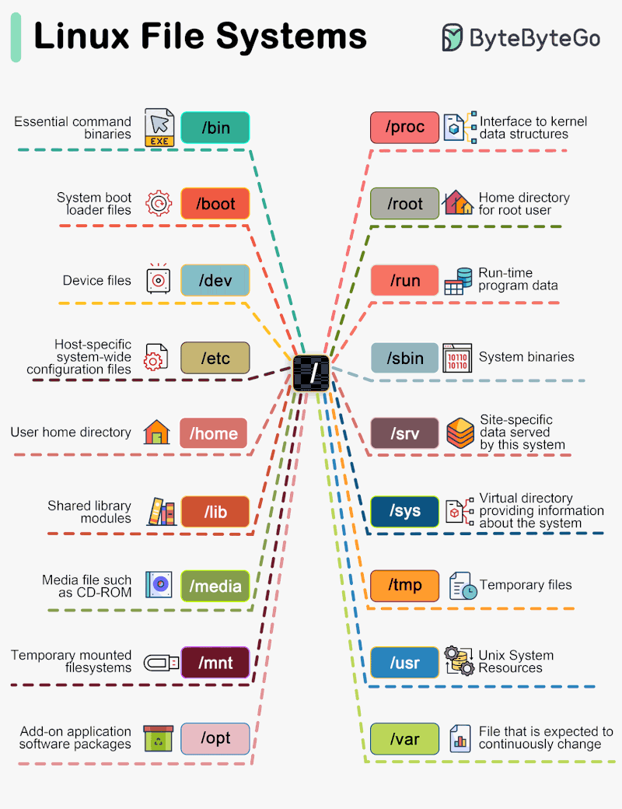
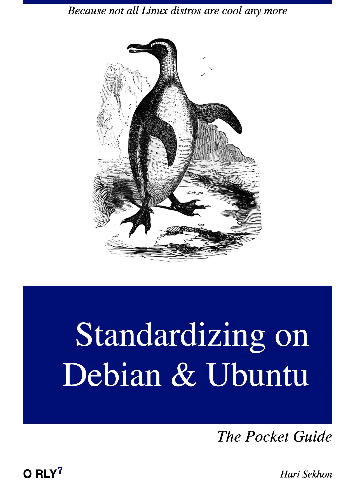

# Linux

<!-- INDEX_START -->

- [Shell](#shell)
- [Distributions & Lineage](#distributions--lineage)
  - [Distribution Version](#distribution-version)
- [Cron](#cron)
  - [User Crons](#user-crons)
- [Timezone](#timezone)
- [Networking](#networking)
  - [IPtables](#iptables)
  - [DHCP](#dhcp)
    - [Test DHCP](#test-dhcp)
- [CGroups](#cgroups)
- [Disk Management](#disk-management)
  - [/etc/fstab](#etcfstab)
- [DRBD](#drbd)
- [Binaries Debugging](#binaries-debugging)
- [Linux Boot Process](#linux-boot-process)
- [Linux Filesystem Layout](#linux-filesystem-layout)
- [OOM Killer](#oom-killer)
- [eBPF](#ebpf)
- [Meme](#meme)
  - [How I Sleep](#how-i-sleep)
  - [Standardizing on Distro](#standardizing-on-distro)

<!-- INDEX_END -->

## Shell

[Shell](shell.md) - the command line program with some scripting constructs that calls the binary programs in
`/bin`, `/usr/bin` and similar directories.

Start with [Bash](bash.md) which is the standard open source Linux shell.

## Distributions & Lineage

- [Debian](debian.md) - the standard open source distribution
  - [Ubuntu](ubuntu.md) - more updated distro, originally Desktop focused then expanded into cloud distro focus too

- [Redhat](redhat.md) - used to the standard enterprise distro but has killed its open source credentials by strangling
  CentOS and consequently become legacy
  - Amazon Linux
  - Centos
  - Fedora
  - RockyLinux

- [Gentoo](gentoo.md) - l33t but takes time to compile.

- [Alpine](alpine.md) - slim distribution designed for Docker

### Distribution Version

The generic way:

```shell
cat /etc/*-release
```

These files have different contents:

| Distro       | File                                                                                              |
|--------------|---------------------------------------------------------------------------------------------------|
| Alpine       | `/etc/os-release` <br> `/etc/alpine-release`                                                      |
| Amazon Linux | `/etc/os-release` <br> `/etc/system-release` <br>`/etc/amazon-release`                            |
| CentOS       | `/etc/os-release` <br> `/etc/system-release` <br> `/etc/redhat-release` <br>`/etc/centos-release` |
| Debian       | `/etc/os-release`                                                                                 |
| Gentoo       | `/etc/os-release` <br> `/etc/gentoo-release`                                                      |
| Redhat       | `/etc/os-release` <br> `/etc/system-release` <br> `/etc/redhat-release`                           |
| RockyLinux   | `/etc/os-release` <br> `/etc/system-release` <br> `/etc/redhat-release` <br> `/etc/rocky-release` |
| Ubuntu       | `/etc/os-release` <br> `/etc/lsb-release`                                                         |

## Cron

In RHEL 6

`/etc/cron.allow`

`/etc/cron.deny`

`/var/spool/cron` root:root 700

### User Crons

Stored in `/var/spool/cron/$USER`.

`crontab` command is suid to allow user to manage it.

Opens the crontab in `$EDITOR` (default `vi` if `$EDITOR` environment variable is not set):

```shell
crontab -e
```

## Timezone

This affects the cron scheduling above and recorded dates of jobs eg. data loading and recording.

For modern Linux systems with systemd:

```shell
timedatectl list-timezones
```

Servers should usually be set to UTC for consistent easy comparison across international systems unless this affects
data loading dates from cron above.

```shell
timedatectl set-timezone UTC
```

## Networking

See [Networking](networking.md) doc.

### IPtables

Top for iptables, awesome!

```shell
iptstate
```

List rules with line numbers:

```shell
iptables -nL -line-numbers
```

### DHCP

Install ISC DHCPd:

```shell
yum install -y dhcp
```

Edit config:

```shell
vim /etc/dhcp/dhcpd.conf
```

Enable it at boot:

```shell
systemctl enable dhcpd.service
```

Start the service:

```shell
systemctl start dhcpd.service
```

#### Test DHCP

Install `dhcping` tool:

```shell
yum install -y dhcping
```

Test DHCP response:

```shell
dhcping -s localhost
```

## CGroups

Limit resource usage.

This is used by modern containerization like `containerd` and [Docker](docker.md).

Can limit:

- CPU Time
- CPU core assignments
- Memory
- Devices
- Disk / Block I/O
- Network bandwidth

```shell
yum install -y libcgroup
```

```shell
service cgconfig start
```

```shell
ls /cgroup
```

```shell
lscgroup
```

Create cgroup - `/etc/cgconfig.conf`:

```text
group blah {
  cpu {
    cpu.shares = 400;
  }
}
```

```shell
service cgconfig restart
```

then add processes (tasks) into cgroups according to parameters in the file:

`/etc/cgrules.conf`:

```text
<user> <subsystems> <control_group>
@<group> <subsystems> <control_group>
<user>:<command> <subsystems> <control_group>
eg.
*:firefox cpu,memory browsers/
```

```shell
service cgred start
```

Sysconfig services can instead add this to their `/etc/sysconfig/<servicename>` file

```shell
CGROUP_DAEMON="<subsystem>:<control_group>"
```

## Disk Management

List disk space of mounted partitions:

```shell
df -h
```

List partitions:

```shell
cat /proc/partitions
```

Format a spare partition:

```shell
mkfs.ext4 /dev/sda2
```

Check and recover filesystem, replay journal, prompts for fixes:

```shell
fsck /dev/sda2
```

Mount a filesystem to the directory `/data`:

```shell
mount /dev/sda2 /data
```

### /etc/fstab

Ensure the partition is:

1. mounted by UUID as device numbers can change
1. has `nofail` option set to make sure that a machine will attempt
   to come up to be able to [SSH](ssh.md) manage it otherwise you may end up in an
   [AWS EC2 Disk Mount Recovery](aws.md##ec2-disk-mount-recovery) situation.

First inspect your `/etc/fstab`:

```shell
cat /etc/fstab
```

Back up `/etc/fstab` before editing it:

```shell
sudo cp -av /etc/fstab /etc/fstab.bak."$(date +%F_%H%S)"
```

Add the `nofail` option on any lines on which it does not exist:

```shell
sudo sed -i '/nofail/ ! s/defaults/defaults,nofail/' /etc/fstab
```

Inspect the changes:

```shell
cat /etc/fstab
```

Each line in the `/etc/fstab` should then look like:

```shell
UUID=xxxxxxxx-xxxx-xxxx-xxxx-xxxxxxxxxxxx    /tmp    xfs    defaults,nofail    0    2
```

Validate your `/etc/fstab` by mounting using the short form of the `mount` command that reads and uses the `/etc/fstab`:

```shell
mount /tmp
```

## DRBD

- awesome disk replication, used this in the mid to late 2000s
- mainline Linux kernel now
- dual-primary (0.9+)mount
  - requires clustered filesystem (GFS, OCFS2)
- `mount -o ro` to avoid complexity of dual primary cluster filesystems
- sync + async repl options
- get check_drbd nagios plugin to see how far behind replica is, automatically catches up, low maintenance once set up

## Binaries Debugging

See the [Binaries Debugging](binaries-debugging.md) doc for commands to examine and work with binaries.

## Linux Boot Process



## Linux Filesystem Layout



## OOM Killer

Out of Memory Killer will `kill -9` forcibly terminate the largest RAM consuming process when the OS runs out of RAM.

This is considered the better alternative than letting the whole OS crash.


## eBPF

Kernel level for networking observability, tracing, and security

<https://ebpf.io/>

## Meme

### How I Sleep

But then you discover [Macs](mac.md) and spend it anyway...


### Standardizing on Distro



**Ported from various private Knowledge Base pages 2002+**
