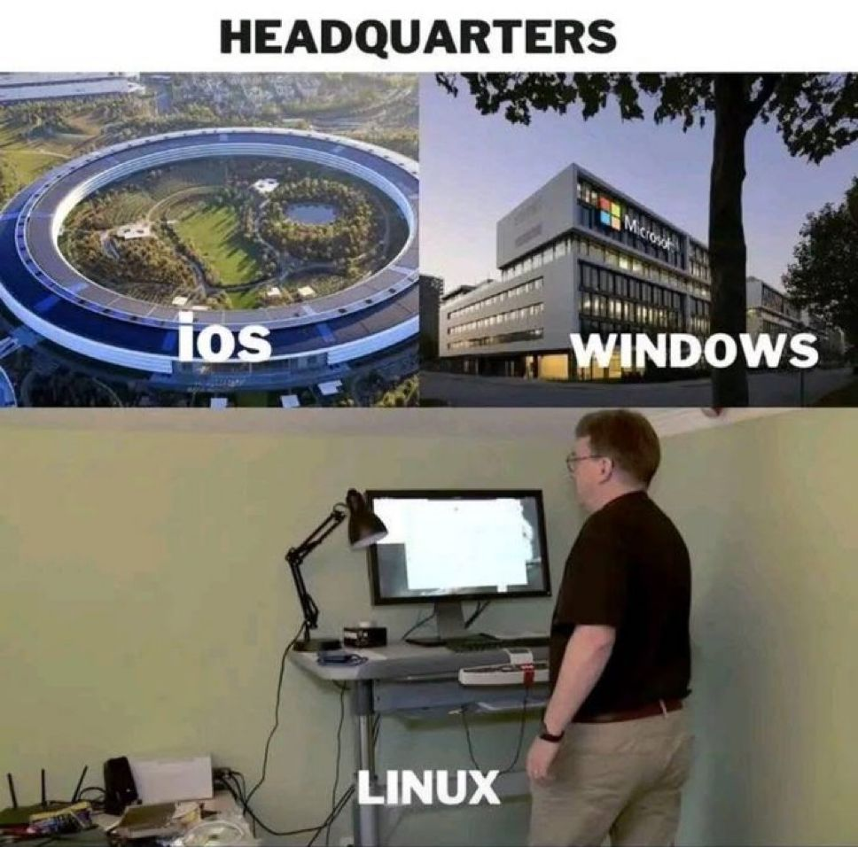
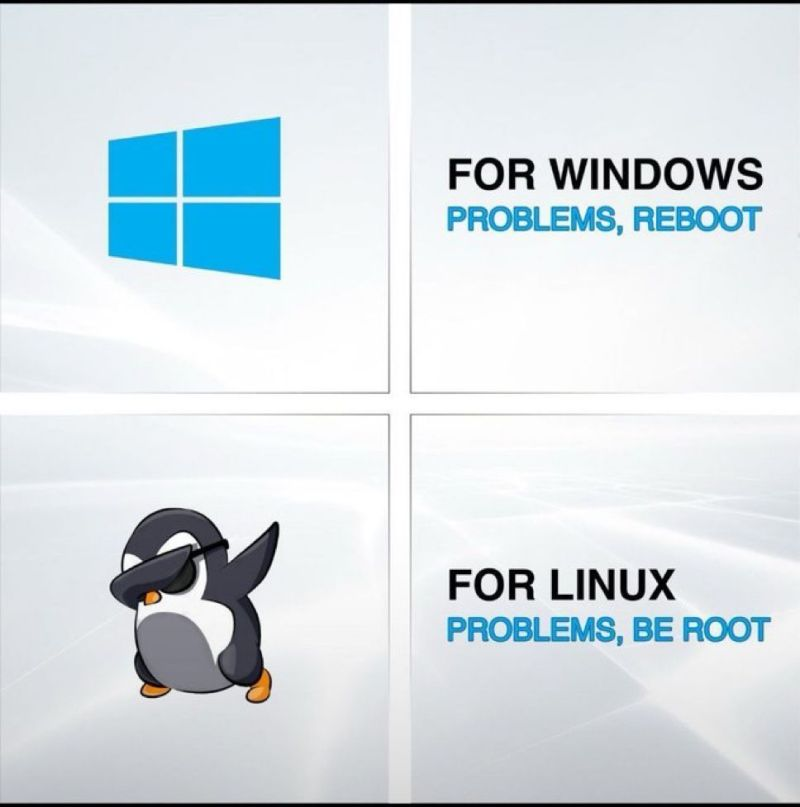
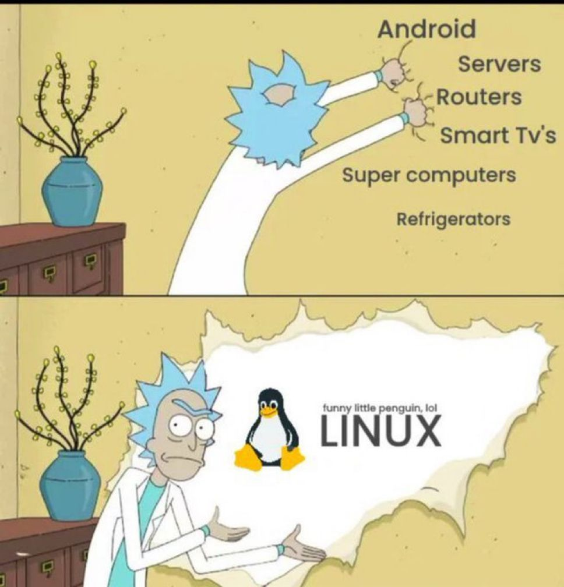

# Linux

<!-- INDEX_START -->

- [Shell](#shell)
- [Distributions & Lineage](#distributions--lineage)
  - [Distribution Version](#distribution-version)
- [Cron](#cron)
  - [User Crons](#user-crons)
- [At](#at)
- [Timezone](#timezone)
- [Networking](#networking)
  - [IPtables](#iptables)
  - [DHCP](#dhcp)
    - [Test DHCP](#test-dhcp)
- [CGroups](#cgroups)
- [Disk Management](#disk-management)
  - [/etc/fstab](#etcfstab)
  - [Disable tmpfs](#disable-tmpfs)
- [RamDisk](#ramdisk)
- [DRBD](#drbd)
- [Binaries Debugging](#binaries-debugging)
- [Linux Boot Process](#linux-boot-process)
- [Linux Filesystem Layout](#linux-filesystem-layout)
- [OOM Killer](#oom-killer)
- [eBPF](#ebpf)
- [Meme](#meme)
  - [Headquarters](#headquarters)
  - [How I Sleep](#how-i-sleep)
  - [Standardizing on Distro](#standardizing-on-distro)
  - [Linux Cars](#linux-cars)
  - [Windows Problems vs Linux Problems](#windows-problems-vs-linux-problems)
  - [Linux Inside](#linux-inside)
  - [Linux Users Switching Back After 10 Minutes of Using Windows](#linux-users-switching-back-after-10-minutes-of-using-windows)

<!-- INDEX_END -->

## Shell

[Shell](shell.md) - the command line program with some scripting constructs that calls the binary programs in
`/bin`, `/usr/bin` and similar directories.

Start with [Bash](bash.md) which is the standard open source Linux shell.

## Distributions & Lineage

- [Debian](debian.md) - the standard open source distribution
  - [Ubuntu](ubuntu.md) - more updated distro, originally Desktop focused then expanded into cloud server focus too -
    now the most widely used cloud distro

- [Redhat](redhat.md) - Redhat Enterprise Linux (RHEL) and its clone CentOS used to the standard enterprise distro but
  has killed its open source credentials by strangling CentOS and consequently become legacy
  - Amazon Linux
  - Centos
  - Fedora
  - RockyLinux

- [Gentoo](gentoo.md) - l33t but takes time to compile.

- [Alpine](alpine.md) - slim distribution designed for Docker

Debian stable is the most stable and reliable Linux out there since at least the 2000s, at the cost of lagging on
package versions and its UIs are usually not as glossy. It is one of the top picks ever for servers for the reason of
stability, rivalled only by commercial RHEL.

More people prefer Ubuntu for desktops for a bit more gloss and user focus, which was based on Debian and has been
mature for many years - you can also pick Ubuntu Long Term Support releases for extra stability, people usually use
those for servers - it’s been the number 1 cloud server distro for a decade+.

Fedora is ok for desktops, but it’s not as stable by design as Ubuntu LTS or the daddy Debian.

I think that Redhat after IBM acquisition has damaged the Redhat lineage by trying to squeeze out more profits by
killing CentOS to force people to pay for their Enterprise Linux.

The history of Linux shows it’s hard to beat free over the long term.

### Distribution Version

The generic way:

```shell
cat /etc/*-release
```

These files have different contents:

| Distro       | File                                                                                              |
|--------------|---------------------------------------------------------------------------------------------------|
| Alpine       | `/etc/os-release` <br> `/etc/alpine-release`                                                      |
| Amazon Linux | `/etc/os-release` <br> `/etc/system-release` <br>`/etc/amazon-release`                            |
| CentOS       | `/etc/os-release` <br> `/etc/system-release` <br> `/etc/redhat-release` <br>`/etc/centos-release` |
| Debian       | `/etc/os-release`                                                                                 |
| Gentoo       | `/etc/os-release` <br> `/etc/gentoo-release`                                                      |
| Redhat       | `/etc/os-release` <br> `/etc/system-release` <br> `/etc/redhat-release`                           |
| RockyLinux   | `/etc/os-release` <br> `/etc/system-release` <br> `/etc/redhat-release` <br> `/etc/rocky-release` |
| Ubuntu       | `/etc/os-release` <br> `/etc/lsb-release`                                                         |

## Cron

In RHEL 6

`/etc/cron.allow`

`/etc/cron.deny`

`/var/spool/cron` root:root 700

### User Crons

Stored in `/var/spool/cron/$USER`.

`crontab` command is suid to allow user to manage it.

Opens the crontab in `$EDITOR` (default `vi` if `$EDITOR` environment variable is not set):

```shell
crontab -e
```

Reference:

```shell
man 5 crontab
```

Put this at the top of your user crontab file for easy reference:

```text
# ┌──────── minute (0 - 59)
# │ ┌────── hour (0 - 23)
# │ │ ┌──── day of month (1 - 31)
# │ │ │ ┌── month (1 - 12)
# │ │ │ │ ┌─ day of week (0 - 7) (Sun=0 or 7)
# │ │ │ │ │
# * * * * * command
```

You can also use one of these timing shorthands:

```text
@reboot
@yearly
@monthly
@weekly
@daily
@hourly
```

You may also find this site useful:

<https://crontab.guru>

## At

For quick one off jobs, use `at`.

```shell
at 03:44 make
```

List scheduled jobs:

```shell
atq
```

```text
1       Fri Jan  9 03:44:00 2026
```

See the job command, environment variables and directory it will execute in.

By default at will `cd` to the directory you invoked `at` in and then run the given command.

This is useful when you hit things like HTTP 429 Too Many Requests errors
and need to back off for a long period and re-run your command later.

I use this when downloading my [Spotify-Playlists](https://github.com/HariSekhon/Spotify-Playlists) if I hit Spotify
HTTP 429 Too Many Requests errors, despite my best efforts to throttle my code reasonably (`export DEBUG` mode catches
the `retry-after` header and calculates the human time to retry at).

## Timezone

This affects the cron scheduling above and recorded dates of jobs eg. data loading and recording.

For modern Linux systems with systemd:

```shell
timedatectl list-timezones
```

Servers should usually be set to UTC for consistent easy comparison across international systems unless this affects
data loading dates from cron above.

```shell
timedatectl set-timezone UTC
```

## Networking

See [Networking](networking.md) doc.

### IPtables

Top for iptables, awesome!

```shell
iptstate
```

List rules with line numbers:

```shell
iptables -nL -line-numbers
```

### DHCP

Install ISC DHCPd:

```shell
yum install -y dhcp
```

Edit config:

```shell
vim /etc/dhcp/dhcpd.conf
```

Enable it at boot:

```shell
systemctl enable dhcpd.service
```

Start the service:

```shell
systemctl start dhcpd.service
```

#### Test DHCP

Install `dhcping` tool:

```shell
yum install -y dhcping
```

Test DHCP response:

```shell
dhcping -s localhost
```

## CGroups

Limit resource usage.

This is used by modern containerization like `containerd` and [Docker](docker.md).

Can limit:

- CPU Time
- CPU core assignments
- Memory
- Devices
- Disk / Block I/O
- Network bandwidth

```shell
yum install -y libcgroup
```

```shell
service cgconfig start
```

```shell
ls /cgroup
```

```shell
lscgroup
```

Create cgroup - `/etc/cgconfig.conf`:

```text
group blah {
  cpu {
    cpu.shares = 400;
  }
}
```

```shell
service cgconfig restart
```

then add processes (tasks) into cgroups according to parameters in the file:

`/etc/cgrules.conf`:

```text
<user> <subsystems> <control_group>
@<group> <subsystems> <control_group>
<user>:<command> <subsystems> <control_group>
eg.
*:firefox cpu,memory browsers/
```

```shell
service cgred start
```

Sysconfig services can instead add this to their `/etc/sysconfig/<servicename>` file

```shell
CGROUP_DAEMON="<subsystem>:<control_group>"
```

## Disk Management

List disk space of mounted partitions:

```shell
df -h
```

List partitions:

```shell
cat /proc/partitions
```

Format a spare partition:

```shell
mkfs.ext4 /dev/sda2
```

Check and recover filesystem, replay journal, prompts for fixes:

```shell
fsck /dev/sda2
```

Mount a filesystem to the directory `/data`:

```shell
mount /dev/sda2 /data
```

### /etc/fstab

Ensure the partition is:

1. mounted by UUID as device numbers can change
1. has `nofail` option set to make sure that a machine will attempt
   to come up to be able to [SSH](ssh.md) manage it otherwise you may end up in an
   [AWS EC2 Disk Mount Recovery](aws.md##ec2-disk-mount-recovery) situation.

First inspect your `/etc/fstab`:

```shell
cat /etc/fstab
```

Back up `/etc/fstab` before editing it:

```shell
sudo cp -av /etc/fstab /etc/fstab.bak."$(date +%F_%H%S)"
```

Add the `nofail` option on any lines on which it does not exist:

```shell
sudo sed -i '/nofail/ ! s/defaults/defaults,nofail/' /etc/fstab
```

Inspect the changes:

```shell
cat /etc/fstab
```

Each line in the `/etc/fstab` should then look like:

```shell
UUID=xxxxxxxx-xxxx-xxxx-xxxx-xxxxxxxxxxxx    /tmp    xfs    defaults,nofail    0    2
```

Validate your `/etc/fstab` by mounting using the short form of the `mount` command that reads and uses the `/etc/fstab`:

```shell
mount /tmp
```

### Disable tmpfs

`tmpfs` stores `/tmp` files in a ramdisk, limited by the machine's RAM.

This is a trade off of memory vs `/tmp` files performance.

But this can also be a problem if you have a large volume of data going through `/tmp`,
in which case you might want to disable it to avoid running out of RAM or `/tmp` space.

To disable on a systemd based Linux distro like RHEL-based variants, including [Amazon Linux](aws.md):

```shell
sudo systemctl stop tmp.mount
```

```shell
sudo systemctl mask tmp.mount
```

Output:

```text
Created symlink /etc/systemd/system/tmp.mount → /dev/null.
```

## RamDisk

Create a RamDisk:

```shell
mount -t tmpfs tmpfs /mnt/ramdisk -o size=1024m
```

## DRBD

- awesome disk replication, used this in the mid to late 2000s
- mainline Linux kernel now
- dual-primary (0.9+)mount
  - requires clustered filesystem (GFS, OCFS2)
- `mount -o ro` to avoid complexity of dual primary cluster filesystems
- sync + async repl options
- get check_drbd nagios plugin to see how far behind replica is, automatically catches up, low maintenance once set up

## Binaries Debugging

See the [Binaries Debugging](binaries-debugging.md) doc for commands to examine and work with binaries.

## Linux Boot Process


## Linux Filesystem Layout


## OOM Killer

Out of Memory Killer will `kill -9` forcibly terminate the largest RAM consuming process when the OS runs out of RAM.

This is considered the better alternative than letting the whole OS crash.


## eBPF

Kernel level for networking observability, tracing, and security

<https://ebpf.io/>

## Meme

### Headquarters



### How I Sleep

But then you discover [Macs](mac.md) and spend it anyway...


### Standardizing on Distro


### Linux Cars


### Windows Problems vs Linux Problems

Mac falls somewhere in between the two, depending on the problem...



### Linux Inside



### Linux Users Switching Back After 10 Minutes of Using Windows


**Ported from various private Knowledge Base pages 2002+**
