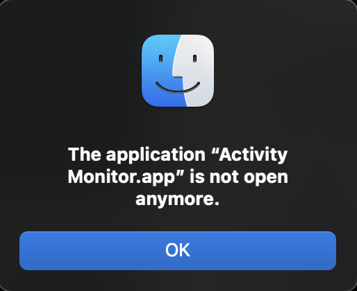
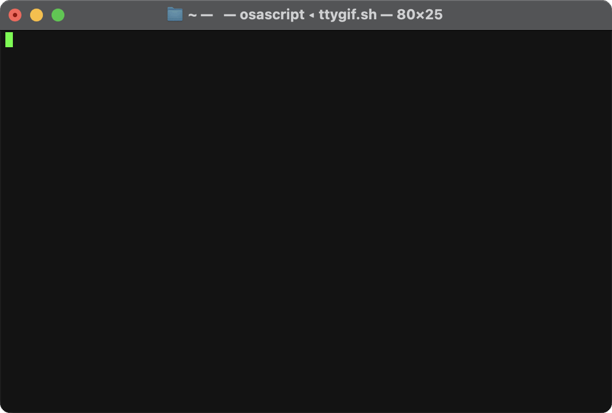
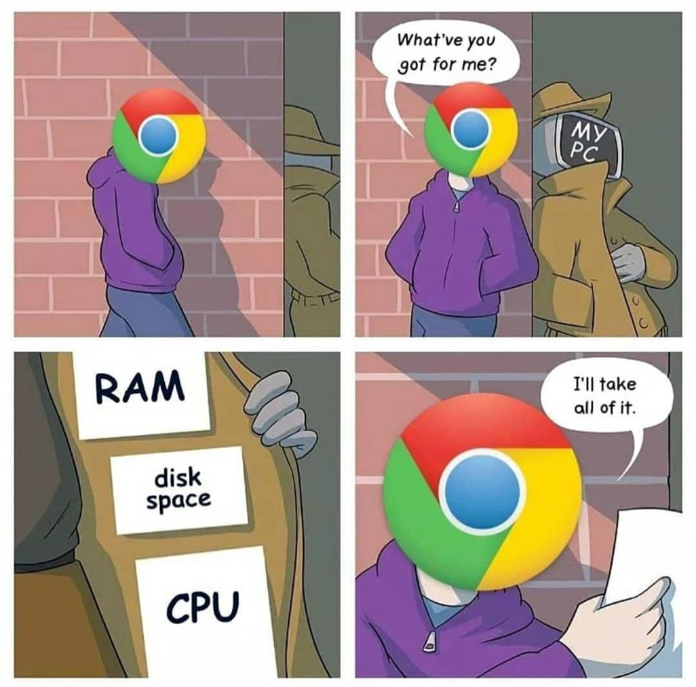

# Mac

The best laptop money can buy:

<https://www.apple.com/uk/macbook-pro/>

If you don't have an M3 Pro / Max - you're missing out on an excellent (but overpriced) machine.

On balance of price vs performance the Macbook Air M3 is excellent, and even thinner and lighter than the
Macbook Pro - a real joy to use. Even when you're using more RAM than the physical 16GB max and swapping, the
performance is still so good you don't notice significant performance degradation for most usage, even when using
heavyweight IDEs like [IntelliJ](intellij.md).

<!-- INDEX_START -->

- [WARNING: Battery Life](#warning-battery-life)
  - [Mac battery runs hotter during charging](#mac-battery-runs-hotter-during-charging)
  - [Do not let your Macbook Pro get hot it will destroy the battery!!](#do-not-let-your-macbook-pro-get-hot-it-will-destroy-the-battery)
  - [Performance Falls through the floor on last 5-10% of battery life](#performance-falls-through-the-floor-on-last-5-10-of-battery-life)
- [Terminal](#terminal)
- [Homebrew - Package Management](#homebrew---package-management)
- [Mas - App Store CLI for App Management](#mas---app-store-cli-for-app-management)
- [Activity Monitor](#activity-monitor)
- [Force Quit Applications](#force-quit-applications)
- [Stats Bar](#stats-bar)
- [Pingr](#pingr)
- [Flux](#flux)
- [Rearrange Status Bar Icons](#rearrange-status-bar-icons)
- [Reducing Desktop Workspaces](#reducing-desktop-workspaces)
- [Sending Control-Alt-Delete to Windows through Remote Desktop](#sending-control-alt-delete-to-windows-through-remote-desktop)
- [Virtualization](#virtualization)
- [Anti-Virus](#anti-virus)
  - [ClamAV Setup](#clamav-setup)
- [Raycast](#raycast)
- [Alfred](#alfred)
- [AppleScript](#applescript)
- [Commands](#commands)
  - [Spotlight - Search for or Open anything](#spotlight---search-for-or-open-anything)
  - [Open URL from Terminal output](#open-url-from-terminal-output)
  - [Open](#open)
    - [Open URL in the default web browser](#open-url-in-the-default-web-browser)
    - [Open current directory in Finder](#open-current-directory-in-finder)
    - [Open image in the default app (usually Preview)](#open-image-in-the-default-app-usually-preview)
    - [Show the File in Finder](#show-the-file-in-finder)
    - [Check default Application for a given file type](#check-default-application-for-a-given-file-type)
    - [Change the default Application for a given file type](#change-the-default-application-for-a-given-file-type)
      - [Set VLC to open AVI files](#set-vlc-to-open-avi-files)
      - [Set Chrome to open SVG files](#set-chrome-to-open-svg-files)
    - [Open an Application from the command line](#open-an-application-from-the-command-line)
  - [Clipboard](#clipboard)
  - [System Information](#system-information)
  - [Screenshots](#screenshots)
    - [Set Screenshot Location](#set-screenshot-location)
    - [Screenshot the Whole Screen](#screenshot-the-whole-screen)
    - [Screenshot a Selection - Drag a Rectangle](#screenshot-a-selection---drag-a-rectangle)
    - [The Screenshot.app](#the-screenshotapp)
    - [The ScreenCapture CLI](#the-screencapture-cli)
  - [Screen Recording](#screen-recording)
  - [DNS](#dns)
    - [Show DNS Settings](#show-dns-settings)
    - [Set DNS Servers](#set-dns-servers)
    - [Set DNS Search Domain](#set-dns-search-domain)
    - [Set Hostname](#set-hostname)
    - [Flush the DNS Cache](#flush-the-dns-cache)
  - [Network Quality](#network-quality)
  - [Wifi](#wifi)
    - [Get Current Wifi Network Name](#get-current-wifi-network-name)
    - [Get Current Wifi Network Password](#get-current-wifi-network-password)
    - [List all Configured Wifi Networks](#list-all-configured-wifi-networks)
  - [Say - text-to-speech](#say---text-to-speech)
  - [Finding Files - Spotlight Search and Index Management](#finding-files---spotlight-search-and-index-management)
  - [Power Management](#power-management)
    - [Show Power Management Settings](#show-power-management-settings)
    - [Show Power Status, Batteries & UPS](#show-power-status-batteries--ups)
    - [Show Power Adapter Details](#show-power-adapter-details)
    - [Sleep Immediately](#sleep-immediately)
    - [Prevent Sleep](#prevent-sleep)
  - [Packages](#packages)
    - [Install Package](#install-package)
    - [Automating Installer Choices](#automating-installer-choices)
    - [Inspect Package Contents Before Installing](#inspect-package-contents-before-installing)
    - [List Installed Packages](#list-installed-packages)
  - [Launchctl](#launchctl)
  - [Start At Login](#start-at-login)
  - [Disk Management](#disk-management)
    - [Disk Utility](#disk-utility)
    - [Disk Space Analysis](#disk-space-analysis)
    - [Disk Space Commands](#disk-space-commands)
    - [Check USB Bus Speed](#check-usb-bus-speed)
    - [Disk Management Tutorials](#disk-management-tutorials)
    - [List disks](#list-disks)
    - [Mount a partition](#mount-a-partition)
    - [Partition and Format a disk](#partition-and-format-a-disk)
      - [Multiple Partition and Format](#multiple-partition-and-format)
    - [Encrypt APFS Filesystem](#encrypt-apfs-filesystem)
    - [Create an Encrypted File Volume](#create-an-encrypted-file-volume)
      - [GUI - Disk Management Utility](#gui---disk-management-utility)
      - [CLI - HDIutil](#cli---hdiutil)
    - [Erase a disk before decommissioning it](#erase-a-disk-before-decommissioning-it)
  - [Service Management](#service-management)
  - [Sound Management](#sound-management)
    - [Set Sound Output Volume](#set-sound-output-volume)
    - [Switch Sound Output](#switch-sound-output)
- [Shazam Songs while using Headphones](#shazam-songs-while-using-headphones)
- [Hammerspoon - System Event Handler](#hammerspoon---system-event-handler)
- [KeyChain Access](#keychain-access)
- [Binaries Debugging](#binaries-debugging)
- [Creating Bootable CDs & USBs from ISOs](#creating-bootable-cds--usbs-from-isos)
  - [Other Options](#other-options)
    - [CLI](#cli)
- [Asahi Linux on Apple Silicon](#asahi-linux-on-apple-silicon)
- [XCode Mobile App Builds](#xcode-mobile-app-builds)
- [Time Machine](#time-machine)
  - [WARNING: Vendor Encrypted Drives Cannot Be Used to Restore Data in the macOS Recovery Mode](#warning-vendor-encrypted-drives-cannot-be-used-to-restore-data-in-the-macos-recovery-mode)
  - [Exclude Paths from Backups](#exclude-paths-from-backups)
    - [Add Path to Backup Exclusions](#add-path-to-backup-exclusions)
    - [Remove Path from Backup Exclusions](#remove-path-from-backup-exclusions)
  - [Trigger Backup](#trigger-backup)
  - [List Backups](#list-backups)
  - [Restore a file from latest backup](#restore-a-file-from-latest-backup)
  - [Find Unexpected Big Files Going in to the Current Backup](#find-unexpected-big-files-going-in-to-the-current-backup)
  - [Sharing a Time Machine disk with Data](#sharing-a-time-machine-disk-with-data)
- [External Disk Management](#external-disk-management)
  - [Delete Large Directories](#delete-large-directories)
  - [Disable Indexing on the Disk](#disable-indexing-on-the-disk)
  - [Delete the Index](#delete-the-index)
  - [Manually Delete the `.Spotlight-V100` folder](#manually-delete-the-spotlight-v100-folder)
  - [Delete Versioned Backups](#delete-versioned-backups)
  - [Restart `mds`, `mds_stores` and `revisiond`](#restart-mds-mds_stores-and-revisiond)
  - [Verify Free Space](#verify-free-space)
- [Troubleshooting](#troubleshooting)
  - [Discrepancy Between `df` and `du`](#discrepancy-between-df-and-du)
  - [Spotlight Search failing to find App](#spotlight-search-failing-to-find-app)
  - [XCodeBuild error complaining XCode only has command line tools](#xcodebuild-error-complaining-xcode-only-has-command-line-tools)
  - [Various Applications Fail to Open](#various-applications-fail-to-open)
  - [Cannot Delete - No Space Left on Device](#cannot-delete---no-space-left-on-device)
  - [Emergency Backup](#emergency-backup)
  - [Bootup Hangs on Black Screen after Full Data Disk](#bootup-hangs-on-black-screen-after-full-data-disk)
  - [Emergency File Backup from Recovery Mode](#emergency-file-backup-from-recovery-mode)
  - [Reinstall macOS & Restore Data](#reinstall-macos--restore-data)
- [Relevant GitHub Repos](#relevant-github-repos)
- [Memes](#memes)
  - [Headquarters](#headquarters)
  - [Mac User Been Here](#mac-user-been-here)
  - [Using Hardware to Solve Problems](#using-hardware-to-solve-problems)
  - [So you can have 50G RAM of Chrome tabs](#so-you-can-have-50g-ram-of-chrome-tabs)
  - [And IntelliJ hogging 20GB RAM](#and-intellij-hogging-20gb-ram)
  - [Chrome Take All of It](#chrome-take-all-of-it)
  - [Macbook USB Stick](#macbook-usb-stick)
  - [If Apple Sold Mugs](#if-apple-sold-mugs)

<!-- INDEX_END -->

## WARNING: Battery Life

### Mac battery runs hotter during charging

Ensure it is on a table and not heat capturing linen like you bed, especially if travelling.

### Do not let your Macbook Pro get hot it will destroy the battery!!

Within a few weeks of digitial nomadding working on beds with my laptop on the bed cover,
I had degraded the battery of my new Macbook Pro M3 Max to 85%, and even after being more careful, after a year it was
down to 79%.


<!-- Seems to be fine now
that I've had to fall back to doing this after magsafe cable got wet in heavy rains and is not working

### Do Not Charge Through USB Port

Charging through the USB port off a portable power bank also seemed
to heat up the machine and deteriorate the battery by another couple percent after just half an hour.

-->

### Performance Falls through the floor on last 5-10% of battery life

This screenshot from [Stats Bar](#stats-bar) shows why - it's using only Efficiency Cores rather than Performance Cores:


## Terminal

This is where you should be spending your life if you're a techie, with a browser to supplement referencing documentation.

- `$COLUMNS`
  - 179 column width on my MacBook Pro 13" terminal
  - 204 on my MacBook Pro Retina 15" terminal
  - 215 on my Macbook Pro M3 2023 terminal - resolution gets better over time

## Homebrew - Package Management

The best most widely used package manager for Mac.

See the [Homebrew.md](brew.md) page for how to use it and great package lists I've spent years discovering and
building up.

## Mas - App Store CLI for App Management

Command line interface to the macOS App Store.

See the [Mas](mas.md) page for how to install and use it.

## Activity Monitor

See your CPU, RAM, Disk, Network and Energy usage of applications.

Sorting by CPU and RAM descending on their tabs is usually your first port of call.

To open Activity Monitor you can type `Cmd-Space` to open Spotlight search bar and the start typing `Activity Monitor`
to find it and hit enter to open it.

On the command line you can also just run this:

```shell
open -a "Activity Monitor"
```

## Force Quit Applications

You can use Activity Monitor above or bring up the Force Quit Applications dialogue box using this key combo:

`Cmd` + `Option` + `Esc`

## Stats Bar

[Stats](https://github.com/exelban/stats) gives many nice toolbar stats on your Mac's performance for:

- CPU
- GPU
- RAM
- Disk
- Network
- Battery

```shell
brew install stats
```

```shell
open -a "Stats"
```

Battery even tells you:

- time to discharge
- time to charge
- number of charge cycles
- battery health %
- remaining charge / capacity in mAh (the capacity decreases as the battery health degrades - this is very useful to
  see)
- which apps which are consuming a lot of energy for you to kill them if you're not needing them, helping your battery
  life when on the move

Start `Stats.app` at login - configure this in its settings or run this command to do it automatically:

```shell
osascript -e 'tell application "System Events" to make login item at end with properties {path:"/Applications/Stats.app", hidden:false}'
```

## Pingr

Another useful menu app for constant wifi network monitoring for those unreliable hotel wifis:

<https://getpingr.app/>

Better than leaving a ping running in a terminal.

This isn't available in Homebrew unfortunately as of time of writing
so you actually have to click through and install it manually
and then click the menu bar drop down to have it start automatically at login.

The Stats bar's network tool gives far more detailed info such as connectivity history graph,
latency, bandwith usage and per app network breakdowns.
I like the green dot item, but for the graph directly in menu bar, this app is nice.

## Flux

[Flux](https://justgetflux.com/) dims your display to remove blue light that keeps you awake.

```shell
brew install --cask flux-app
```

Start Flux:

```shell
open -a Flux
```

<!-- You don't need this, it automatically adds itself to the startup login items

Start at login:

```shell
osascript -e 'tell application "System Events" to make login item at end with properties {path:"/Applications/Flux.app", hidden:false}'
```

-->

## Rearrange Status Bar Icons

Now 14" Macbook Pros are powerful enough, but the screen space is very limited and you lose the top middle for the
camera you end up losing icons behind the camera portion of the screen.

Rearrange your icons to put the most important and frequently used icons to the left while leaving icons you rarely
click on like Google Drive to the left to be pushed underneath the camera.

To rearrange icons:

`Cmd` + Click + drag each icon to where you want it

## Reducing Desktop Workspaces

If like me, you hate the time lost in graphics sliding effect from one desktop workspace to another, especially caused
by apps like Windows Virtual Desktop in Remote Desktop opening to full screen, and just prefer good old fashioned
`Cmd`-`Tab`, then you can remove the extra workspaces as
[described here](https://discussions.apple.com/thread/8118894?sortBy=best)
by pressing F3 and then hovering on and clicking the X to delete the extra workspaces.

Unfortunately, Remote Desktop still seems to slide and send to fullscreen in another temporary desktop workspace.

## Sending Control-Alt-Delete to Windows through Remote Desktop

`Fn` + `Control` + `Option` + `Delete`

## Virtualization

If you need to run some Windows or Linux on your Mac.

Use [UTM](https://mac.getutm.app/) as a user friendly frontend to Qemu virtualization on Apple Silicon chips.

Use [Virtualbox](virtualbox.md) if you're still on older x86_64.

You can also use Multipass.

See [Virtualization](virtualization.md) page.

## Anti-Virus

macOS has some built-in malware protection via XProtect;

<https://support.apple.com/en-ae/guide/security/sec469d47bd8/web>

Free Anti-Virus for Mac:

- [Avast](https://www.avast.com/) - easy click install, follow instructions to grant permissions
- [AVG Free](https://www.avg.com/en-us/store#mac) - similar to above, can only install one of AVG or Avast as they
  conflict and are owned by the same company
- [Avira](https://www.avira.com/) - easy click install, follow instructions to grant permissions
  then run a deep scan
- [ClamAV](https://www.clamav.net/) - free open-source command line anti-virus
  - [ClamXAV](https://www.clamxav.com/) - proprietary, developed by another company on top of ClamAV, with an added GUI
    and scheduling, more user friendly

### ClamAV Setup

<https://docs.clamav.net/manual/Installing.html>

```shell
brew install clamav
```

Description of components:

<https://docs.clamav.net/manual/Usage.html>

```shell
cd /opt/homebrew/etc/clamav/
```

If [DevOps-Bash-tools](devops-bash-tools.md) is cloned to `$HOME/github`,
link to its config, otherwise download it from GitHub.com:

```shell
for x in freshclam.conf clamd.conf; do
    if test -f ~/github/bash-tools/configs/"$x"; then
        ln -sv ~/github/bash-tools/configs/"$x" .
    else
        wget -nc "https://raw.githubusercontent.com/HariSekhon/DevOps-Bash-tools/refs/heads/master/configs/$x"
    fi
done
```

Verify configs:

```shell
clamconf
```

Start a manual `freshclam` foreground run to download the anti-virus signatures:

```shell
freshclam
```

If this succeeds, start `freshclam` as a background service:

```shell
freshclam -d
```

Start the background ClamAV daemon:

```shell
sudo brew services start clamav
```

The daemon is owned by root, so is its socket,
so you need to `sudo` calls to access its socket for `clamd` to receive commands:

```shell
sudo clamdscan "$file"
```

Monitor ClamD instances resource usage, jobs queued and signature databases loaded in an ncurses style interactive terminal output

```shell
sudo clamdtop
```

Press `q` to quit / exit.

Standalone scanning without going through `clamd`:

```shell
clamscan "$file"
```

```shell
clamscan .
```

```shell
clamscan --recursive .
```

## Raycast

Shortcut to everything.

Use as a drop in replacement for Spotlight which is full of garbage results like web pages in recent versions
of Mac.

macOS power users often switch to Raycast or Alfred to use as app launchers as they are more predictable
and respect local app priority rather than Spotlight which has been ruined trying to be a universal search usually
resulting in poor results not giving you the local app you want to launch.

See [Raycast](raycast.md) page for installation and usage instructions as well as some useful extensions.

## Alfred

More mature app launcher replacement for Spotlight.

More configurable and extensible than Raycast.

The search bar looks simpler than Raycast,
but has more options under the hood with workflows and powerpacks.

Install Alfred:

```shell
brew install --cask alfred
```

Start Alfred in the background:

```shell
open -a "Alfred 5"
```

or in case the version number changes:

```shell
open -a "$(echo /Applications/Alfred\ *.app)"
```

Launch Alfred search bar:

`Option` + `Space`

## AppleScript

Applescript sucks by comparison to [Bash](bash.md), and the debugging is even worse - from a trivial 10-20 line
script you can get an error like this:

```text
/get_application_names.scpt:882:889: script error: Expected “from”, etc. but found identifier. (-2741)
```

Line number `882:889` in a 20 line script?? Good luck finding the offending line.
Now imagine that was a 100 or 1000 line script.
Debugging Hell.

Still, there are some macOS UI related things for which this is the native code, see some such scripts under
the `applescript/` directory in my [DevOps-Bash-tools](https://github.com/HariSekhon/DevOps-Bash-tools) repo which
has many more Bash scripts that work on macOS and a bit of [Python](python.md) with the Quartz library for macOS:

[](https://github.com/HariSekhon/DevOps-Bash-tools)

## Commands

A list of commands is provided at <https://ss64.com/mac/>.

### Spotlight - Search for or Open anything

`Cmd`-`Space` - opens Spotlight search (or preferably [Raycast](#raycast) if you followed the section above) to
auto-complete and open anything quickly.

If this doesn't find an app which you know is there such as typing `Spotify` only returns Google Chrome or other wrong
results despite confirming that `/Applications/Spotify.app` exists, then see
[Spotlight Search failing to find App](#spotlight-search-failing-to-find-app) in the Troubleshooting section.

### Open URL from Terminal output

`Cmd` + Click on the URL.

### Open

Open a file / folder / URL / Application. Use `-a` to select which app to use to open it.
Use `-e` to edit the file in TextEdit.

#### Open URL in the default web browser

```shell
open https://google.com
```

#### Open current directory in Finder

```shell
open .
```

#### Open image in the default app (usually Preview)

```shell
open file.jpg
```

You can also drag to the Terminal to paste a file or directory's path, or right-click copy and paste into the terminal
to get its path on your command line.

#### Show the File in Finder

If you have a big directory listing, sometimes it's easier to just

```shell
open -R "$file"
```

This will open Finder with the file highlighted.

#### Check default Application for a given file type

```shell
brew install duti
```

Check default Application for a given file type (eg `.avi` or `.svg`):

```shell
duti -x avi
```

```shell
duti -x svg
```

#### Change the default Application for a given file type

##### Set VLC to open AVI files

Check the ID of the app you want to set it to:

```shell
osascript -e 'id of app "VLC"'
```

output:

```shell
org.videolan.vlc
```

Change all `.avi` files to be opened by VLC instead of the default QuickTime Player which will fail to open them:

```shell
duti -s org.videolan.vlc avi all
```

##### Set Chrome to open SVG files

Change all `.svg`files  to be opened by Google Chrome which is much faster for viewing than whatever heavyweight image
editing application it is already set to (eg. Gimp or Inkscape):

```shell
duti -s com.google.Chrome public.svg-image all
```

#### Open an Application from the command line

Use the name as seen under `/Applications/` without the `.app` extension which is optional:

```shell
open -a "Google Chrome"
```

```shell
open -a "SQLDeveloper"
```

```shell
open -a "DBeaver"
```

### Clipboard

Copy from stdin to clipboard:

```shell
pbcopy < input.txt
```

Paste from clipboard to stdout:

```shell
pbpaste > output.txt
```

### System Information

You may want to put the next couple of commands in initial debug steps for your [Mobile iOS builds](cicd-mobile.md):

Model:

```shell
sysctl -n machdep.cpu.brand_string
```

```text
Apple M3 Max
```

Specs Summary:

```shell
system_profiler SPHardwareDataType
```

```text
Hardware:

    Hardware Overview:

      Model Name: MacBook Pro
      Model Identifier: Mac15,8
      Model Number: Z1AU001K1B/A
      Chip: Apple M3 Max
      Total Number of Cores: 16 (12 performance and 4 efficiency)
      Memory: 128 GB
      System Firmware Version: nnnnn.nn.nn
      OS Loader Version: nnnnn.nn.nn
      Serial Number (system): xxxxxxxxxx
      Hardware UUID: xxxxxxxx-xxxx-xxxx-xxxx-xxxxxxxxxxxx
      Provisioning UDID: xxxxxxxx-xxxxxxxxxxxxxxxx
      Activation Lock Status: Enabled
```

RAM:

```shell
system_profiler SPMemoryDataType
```

Disk Info:

```shell
diskutil list
```

```shell
system_profiler SPStorageDataType
```

USB Info (for external USD backup disks):

```shell
system_profiler SPUSBDataType
```

Graphics card:

```shell
system_profiler SPDisplaysDataType
```

Network info:

```shell
system_profiler SPNetworkDataType
```

### Screenshots

#### Set Screenshot Location

Set screenshots to go to a dedicated folder:

```shell
defaults write com.apple.screencapture location -string ~/Desktop/Screenshots
```

This is cleaner than having them all over your Desktop background and easier to search for them
(hint: organize the `~/Desktop/Screenshots` folder by date).

Pre-create the directory:

```shell
mkdir -v ~/Desktop/Screenshots
```

<!--

```shell
open ~/Desktop/Screenshots
```

-->

Set the `Screenshots` directory as a list view

```shell
osascript -e '
tell application "Finder"
    activate
    open POSIX file "'"$HOME/Desktop/Screenshots"'"
    delay 1
    set the windowRef to Finder window 1
    set current view of the windowRef to list view
end tell'
```

Then click the `Date Modified` column header at the top to make your recent screenshots come to the top to be easy to
find.

(can't find a command line way to set the folder to sort by date. Add here if you know how)

Drag the `Screenshots` directory to the left-hand Favourites panel for quick easy access in future.

#### Screenshot the Whole Screen

`Cmd` + `Shift` + `3`

#### Screenshot a Selection - Drag a Rectangle

Switches to a cross-hair to drag to what you want to screenshot.

`Cmd` + `Shift` + `4`

More details on Mac's native Screen Capture tool is [here](https://support.apple.com/en-ae/guide/mac-help/mh26782/mac).

#### The Screenshot.app

The `Screenshot.app` in the Utilities folder is easy to use.

You can open it with the key combination:

`Cmd` + `Shift` + `5`

or this command:

```shell
open /System/Applications/Utilities/Screenshot.app
```

or

```shell
open -a Screenshot
```

#### The ScreenCapture CLI

You may be prompted to allow Terminal to record the screen under `Privacy & Security` -> `Screen Recording` the first
time - it'll tell you that you have to restart the Terminal, but it worked for me without a restart.

Switches to select window to capture:

```shell
screencapture -W /tmp/screenshot.png
```

Interactive mode with full toolbar, same as the `Screenshot.app`:

```shell
screencapture -i -U /tmp/screenshot.png
```

Video recording mode for 10 seconds (without `-V` it will record until you `Ctrl`-`c` it):

```shell
screencapture -v -V 10 /tmp/videocapture.mp4
```

So many great options from delayed screenshots, copy to clipboard, open in Preview, capture a coordinate rectangle
(great for automation!), see:

```shell
screencapture --help
```

### Screen Recording

Open the `Screenshot.app` using key combination:

`Cmd` + `Shift` + 5

or this command:

```shell
open /System/Applications/Utilities/Screenshot.app
```

or

```shell
open -a Screenshot
```

Click `Record Entire Screen` or `Record Selected Portion`.

This will create a `.mov` file in your screenshots directory (`~/Desktop` by default unless you've
[Set Screenshot Location](#set-screenshot-location)).

Share this with tech support without breaking your email storage capacity by using a
[file upload site](upload-sites.md#file-upload-sites)
such as <https://0x0.st>.

More details on Mac's native Screen Capture tool is [here](https://support.apple.com/en-ae/guide/mac-help/mh26782/mac).

Alternatively you can do this from the command line using the `screencapture` command
as shown in [The ScreenCapture CLI](#the-screencapture-cli) section above.

Another alternative is to use the QuickTime app,
which gives you the same rectangle selection for video recording as the Screenshot app does.

Start the QuickTime player:

```shell
open -a "QuickTime Player.app"
```

And then select `File` -> `New Screen Recording` or use shortcut `Control` + `Command` +`N`.

### DNS

#### Show DNS Settings

```shell
scutil --dns
```

#### Set DNS Servers

Sometimes you want to use public DNS servers for better performance than the local DHCP given ones:

```shell
sudo networksetup -setdnsservers en0 4.2.2.1 4.2.2.2
```

To set back to DHCP DNS servers, just clear the list:

```shell
sudo networksetup -setdnsservers en0 "Empty"
```

In [DevOps-Bash-tools](devops-bash-tools.md) the shell has a function `dhcpdns` to do this for all network
interfaces and remove the DNS search domains since you should inherit them from DHCP and not leak those FQDN
searches to the internet if on public networks.

#### Set DNS Search Domain

```shell
sudo networksetup -setsearchdomains en0 mydomain.com
```

In [DevOps-Bash-tools](devops-bash-tools.md) the shell has a function `set_dns` to do this for all network interfaces to
make this easier.

You should see these search domains appear in the class unix file `/etc/resolv.conf` managed by apple networking.

To remove DNS search domains:

```shell
sudo networksetup -setsearchdomains en0 "Empty"
```

or `clear_dns_search` function in [DevOps-Bash-tools](devops-bash-tools.md) to do this for all interfaces.

#### Set Hostname

```shell
hostname=whitestar
```

```shell
sudo hostname "$hostname"
sudo scutil --set HostName      "$hostname"
sudo scutil --set ComputerName  "$hostname"
sudo scutil --set LocalHostName "$hostname"
```

```shell
scutil --get HostName
scutil --get ComputerName
scutil --get LocalHostName
```

#### Flush the DNS Cache

```shell
dscacheutil -flushcache
sudo killall -HUP mDNSResponder
```

### Network Quality

Built-in available in macOS Monterey or later:

```shell
networkquality
```

```text
==== SUMMARY ====
Uplink capacity: 68.173 Mbps
Downlink capacity: 77.023 Mbps
Responsiveness: Low (322.581 milliseconds | 186 RPM)
Idle Latency: 204.167 milliseconds | 294 RPM
```

### Wifi

#### Get Current Wifi Network Name

```shell
networksetup -getairportnetwork en0 | awk -F': ' '{print $2}'
```

#### Get Current Wifi Network Password

Prompts with a UI pop-up for administrative access to the system's keychain (`sudo` doesn't prevent this unfortunately):

```shell
security find-generic-password -g -w -D "AirPort network password" \
    -a "$(networksetup -getairportnetwork en0 |
          awk -F': ' '{print $2}')"
```

#### List all Configured Wifi Networks

```shell
networksetup -listpreferredwirelessnetworks en0 |
sed '/Preferred networks on/d;
     s/^[[:space:]]*//' |
sort -f
```

### Say - text-to-speech

Make your Mac speak.

I used this to impress my kids, or even send a message from my loft study to my living room computer
by running `say` over an SSH login to the computer downstairs for them to hear!

```shell
say "Daddy is the greatest"
```

You can also pipe in text:

```shell
echo "Daddy is the greatest" | say
```

Try different voices, list them like this:

```shell
say -v ?
```

Speak from a text file and save it to an audio file:

```shell
say -f words.txt -o myaudioclip.aiff
```

### Finding Files - Spotlight Search and Index Management

The equivalent of `locate` on Linux, uses the Spotlight index:

```shell
mdfind [-onlyin /path/to/directory] [-name "$filename"] "$term"
```

Check an app like Whatsapp is in the Spotlight index:

```shell
app=WhatsApp

mdfind "kMDItemKind == 'Application' && kMDItemFSName == '$app.app'"
```

Erase and rebuild the Spotlight index:

```shell
mdutil -E
```

Disable Spotlight indexing:

```shell
mdutil -a -i off
```

Enable Spotlight indexing:

```shell
mdutil -a -i on
```

Check indexing status:

```shell
mdutil -s /
```

Check indexing status for a specific folder (perhaps after disabling indexing on large or sensitive folders):

```shell
mdutil -s ~/Downloads
```

### Power Management

#### Show Power Management Settings

```shell
pmset -g
```

```text
System-wide power settings:
Currently in use:
 standby              1
 Sleep On Power Button 1
 hibernatefile        /var/vm/sleepimage
 powernap             1
 networkoversleep     0
 disksleep            10
 sleep                0 (sleep prevented by coreaudiod, coreaudiod, sharingd, powerd)
 hibernatemode        3
 ttyskeepawake        1
 displaysleep         180
 tcpkeepalive         1
 powermode            0
 womp                 1
```

#### Show Power Status, Batteries & UPS

```shell
pmset -g ps
```

```text
Now drawing from 'AC Power'
 -InternalBattery-0 (id=nnnnnnnn)       86%; charging; 0:35 remaining present: true
```

#### Show Power Adapter Details

Only on Macbook / Macbook Pro:

```shell
pmset -g ac
```

Output depends on whether you're plugged into AC power or not:

```text
No adapter attached.
```

or

```text
 Wattage = 94W
 Current = 4690mA
 Voltage = 20000mV
 AdapterID = nnnnn
 Manufacturer = Apple Inc.
 Family Code = 0xe000400a
 Serial String = xxxxxxxxxxxxxxxxx
 Adapter Name = 96W USB-C Power Adapter
 Hardware Version = 1.0
 Firmware Version = 01090057
```

#### Sleep Immediately

Put the machine to sleep immediately using this command:

```shell
sudo pmset sleepnow
```

#### Prevent Sleep

```shell
sudo caffeinate -i
```

Prevent sleep, but only if on AC power:

```shell
sudo caffeinate -s
```

### Packages

Packages installed via native `.pkg` installers.

#### Install Package

```text
sudo installer -pkg ~/Downloads/"$name".pkg -target /
```

#### Automating Installer Choices

To avoid pop-ups for things like [CI/CD](cicd.md):

```shell
installer -showChoicesXML -pkg "$name".pkg |
tee choices.xml
```

This is a plist xml file. Edit it:

```shell
"$EDITOR" choices.xml
```

Then re-run the installer with it:

```shell
sudo installer -applyChoiceChangesXML choices.xml -pkg "$name".pkg
```

#### Inspect Package Contents Before Installing

```shell
pkgutil --expand ~/Downloads/"$name".pkg /tmp/pkg_contents
```

Then just browse the `/tmp/package_contents/...` which may look similar to this:

```shell
tree /tmp/pkg_contents
```

```text
/tmp/pkg_contents
├── Distribution
├── Resources
│   ├── ixguard-white.png
│   └── ixguard.png
└── ixguard.pkg
    ├── Bom
    ├── PackageInfo
    ├── Payload
    └── Scripts
        ├── postinstall
        └── preinstall

4 directories, 8 files
```

#### List Installed Packages

List all `.pkg` installations:

```shell
pkgutil --pkgs | sort
```

This will be a long list of inverse domains for each package, such as:

```text
com.amazon.aws.cli2
...
com.apple.pkg.CLTools_Executables
com.apple.pkg.CLTools_SDK_macOS13
com.apple.pkg.CLTools_SDK_macOS14
com.apple.pkg.CLTools_SwiftBackDeploy
com.apple.pkg.CLTools_macOS_SDK
...
com.apple.pkg.Xcode
...
com.google.drivefs.arm64
com.google.drivefs.shortcuts
...
com.guardsquare.ixguard
...
com.internet.wifispeed.speedtest
com.keepersecurity.commander.binary
com.keepersecurity.commander.launcher
...
com.microsoft.powershell
com.microsoft.rdc.macos
com.microsoft.teams
com.microsoft.teams2
com.ookla.speedtest-macos
com.openspeedtest.server
com.paloaltonetworks.globalprotect.pkg
...
com.vagrant.vagrant
...
net.whatsapp.WhatsApp
org.openvpn.client.pkg
org.openvpn.client_framework.pkg
org.openvpn.client_launch.pkg
org.openvpn.client_uninstall.pkg
org.openvpn.helper_framework.pkg
org.openvpn.helper_launch.pkg
ru.keepcoder.Telegram
us.zoom.pkg.videomeeting
```

### Launchctl

This accesses `launchd`, Mac's init script equivalent.

See which `launchd` scripts are loaded:

```shell
launchctl list
```

Stop and unload script, add `-w` to remove it from the boot sequence:

```shell
sudo launchctl unload [path/to/script]
```

Launch scripts are found in the following locations:

```text
~/Library/LaunchAgents
/Library/LaunchAgents
/Library/LaunchDaemons
/System/Library/LaunchAgents
/System/Library/LaunchDaemons
```

[Launchd documentation](https://developer.apple.com/library/archive/documentation/MacOSX/Conceptual/BPSystemStartup/Chapters/CreatingLaunchdJobs.html)

[Blog post](https://paul.annesley.cc/2012/09/mac-os-x-launchd-is-cool/) on cool things launchd can do, like watching and
executing on files that are dropped into directories.

### Start At Login

See which apps are configured to start at login:

```shell
osascript -e 'tell application "System Events" to get the name of every login item'
```

You should see a selection of apps:

```text
Google Drive, ProtonVPN, WhatsApp, Stats, Terminal, SanDiskSecurityHelper, Flux, Hammerspoon
```

Add an app to start at login:

```shell
osascript -e 'tell application "System Events" to make login item at end with properties {path:"/Applications/Hammerspoon.app", hidden:false}'
```

Ignore this quirky output:

```text
login item UNKNOWN
```

This does work,
which you can verify by running the above `osascript` command again to see it's in the list of login items.

You can also see this in the Mac UI of `Settings Settings` -> `General` -> `Login Items` (Ventura / Sonoma):

```shell
open "x-apple.systempreferences:com.apple.LoginItems-Settings.extension"
```

or `System Preferences` -> `Users & Groups` -> `Login Items` (Monterey / Big Sur):

```shell
open "x-apple.systempreferences:com.apple.preference.users?LoginItems"
```

To add it if not already added:

```shell
osascript <<EOF
tell application "System Events"
    if not (exists login item "Hammerspoon") then
        make login item at end with properties {path:"/Applications/Hammerspoon.app", hidden:false}
    end if
end tell
EOF
```

### Disk Management

#### Disk Utility

Using graphical Disk Utility is easiest:

```shell
open -a 'Disk Utility'
```

#### Disk Space Analysis

Mac built in `System Settings` -> `General` -> `Storage` will give a good high-level overview of what
is taking up your disk space:

```shell
open "x-apple.systempreferences:com.apple.settings.Storage"
```

You can see this [Apple support article](https://support.apple.com/en-us/102624) on optimizing space.

My favourite of all time is [Disk Inventory X](https://www.derlien.com/):

```shell
brew install disk-inventory-x
```

```shell
open -a 'Disk Inventory X' /
```

[GrandPerspective](https://grandperspectiv.sourceforge.net/) is another similar GUI disk space analysis app:

```shell
brew install --cask grandperspective
```

```shell
open -a GrandPerspective /
```

[OmniDiskSweeper](https://www.omnigroup.com/more) is another option:

```shell
brew install --cask omnidisksweeper
```

```shell
open -a OmniDiskSweeper /
```

[BaoBab](https://apps.gnome.org/Baobab/) is available on both Linux & Mac:

```shell
brew install baobab
```

```shell
baobab /
```

But for CLI junkies there is also ...

#### Disk Space Commands

Aside from the classic portable unix `df` and `du` commands...

... there is this cool interactive 'ncurses du'
which allows you
to easily drill down to find the biggest directories and files:

```shell
brew install ncdu
```

```shell
sudo ncdu /
```

The biggest directories and files are automatically sorted to the top for convenience at each level you drill in to.

Type `?` for the interactive help menu.

#### Check USB Bus Speed

USB bus makes a huge difference between USB 2 and USB 3.

On a Time Machine restore of my hosed mac,
this was the difference between 80-90 hour s and 2-3 hours projected completion time.

```shell
system_profiler SPUSBDataType
```

Even among USB 3.1 look at the speed difference different cables can make with identical model SanDisk Extreme Pro SSD
disks:

```shell
system_profiler SPUSBDataType | grep -e Bus -e Speed -e Manufacturer
```

```text
    USB 3.1 Bus:
          Speed: Up to 480 Mb/s
          Manufacturer: SanDisk
    USB 3.1 Bus:
          Speed: Up to 10 Gb/s
          Manufacturer: SanDisk
    USB 3.1 Bus:
```

#### Disk Management Tutorials

[Part 1](http://www.theinstructional.com/guides/disk-management-from-the-command-line-part-1) -
List, Verify, Repair, Rename, Erase volumes

[Part 2](https://www.theinstructional.com/guides/disk-management-from-the-command-line-part-2) -
Partition, Format, Split / Merge Partitions

[Part 3]() - Create `.dmg` disk images from a Volume / Folder, Encrypted Disk Image, Resize Image, Restore Image

#### List disks

```shell
diskutil list
```

`diskutil mount` and `diskutil mountDisk` are the same

#### Mount a partition

```shell
diskutil mount /dev/disk4s2
```

```shell
diskutil unmount /dev/disk4s2
```

Unmount all filesystems on a disk:

```shell
diskutil unmountDisk force "/dev/$disk"
```

or by volume location:

```shell
diskutil unmount "/Volumes/$NAME"
```

Mount a partition read-only if having trouble and trying to recover data:

```shell
diskutil mount readOnly /dev/disk4s2
```

Mount at a different location to the default `/Volumes/<partition_metadata_name>`:

```shell
diskutil mount /dev/disk4s2 -mountPoint /path/to/dir
```

Mount / unmount partitions on a whole disk by reading its partition table:

```shell
diskutil mountDisk disk10
```

```shell
diskutil unmountDisk disk10
```

Verify a volume:

```shell
diskutil verifyVolume "/Volumes/$NAME"
```

Repair volume:

```shell
diskutil repairVolume "/Volumes/$NAME"
```

```shell
diskutil verifyPermissions "/Volumes/$NAME"
```

```shell
diskutil repairPermissions "/Volumes/$NAME"
```

**These operations are risky as you might get the disk wrong - it's much easier and safer to do this in Disk Utility!**

Format a partition:

**Risky because there is no confirmation and you could end up doing this to the wrong disk!!**

```shell
diskutil eraseDisk "$filesystem" "$name" "/dev/$diskN"
```

See which filesystems are available for formatting:

```shell
diskutil listFilesystems
```

```text
Formattable file systems

These file system personalities can be used for erasing and partitioning.
When specifying a personality as a parameter to a verb, case is not considered.
Certain common aliases (also case-insensitive) are listed below as well.

-------------------------------------------------------------------------------
PERSONALITY                     USER VISIBLE NAME
-------------------------------------------------------------------------------
Case-sensitive APFS             APFS (Case-sensitive)
  (or) APFSX
APFS                            APFS
  (or) APFSI
ExFAT                           ExFAT
Free Space                      Free Space
  (or) FREE
MS-DOS                          MS-DOS (FAT)
MS-DOS FAT12                    MS-DOS (FAT12)
MS-DOS FAT16                    MS-DOS (FAT16)
MS-DOS FAT32                    MS-DOS (FAT32)
  (or) FAT32
HFS+                            Mac OS Extended
Case-sensitive HFS+             Mac OS Extended (Case-sensitive)
  (or) HFSX
Case-sensitive Journaled HFS+   Mac OS Extended (Case-sensitive, Journaled)
  (or) JHFSX
Journaled HFS+                  Mac OS Extended (Journaled)
  (or) JHFS+
```

Rename a disk:

```shell
diskutil rename "$volume_name" "$new_volume_name"
```

#### Partition and Format a disk

**These operations are risky as you might get the disk wrong - it's much easier and safer to do this in Disk Utility!**

APFS requires GPT partition table.

```shell
disk="disk4"
partition_table="GPT"
name="MyVolume"
filesystem="APFSX"  # AppleFS case-sensitive, found from 'diskutil listFilesystems' above
size="0b"           # integer + units suffix (b, m or g for bytes, megabytes or gigabytes) - '0b' uses all space
```

```shell
diskutil partitionDisk "/dev/$disk" "$partition_table" "$filesystem" "$name" "$size"
```

##### Multiple Partition and Format

```shell
diskutil partitionDisk /dev/"$disk" "$partition_table" "$filesystem" "First"  "$size" \
                                                       "$filesystem" "Second" "$size" \
                                                       "$filesystem" "Third"  "$size" \
                                                       "$filesystem" "Fourth" "$size" \
                                                       "$filesystem" "Fifth"   0b  # '0b' to use up all remaining space
```

Partition splitting doesn't seem to work with APFS, only macOS Extended, as APFS tells you to
`diskutil apfs deleteContainer disk10` instead which leaves you with free space to create a new partition.

#### Encrypt APFS Filesystem

If you partitioned it without APFS, reformat the disk with APFS:

```shell
diskutil eraseDisk APFS "$name" "/dev/$disk"
```

Alternatively, if you already have GPT parititioned disk and only want to format the partition:

```shell
diskutil eraseVolume "APFSX" "MyEncryptedDisk" "/dev/${synthesized_disk}s1"
```

Notice the disk here will be different to the physical disk, it'll be the synthesized disk of an increment higher disk
number as shown by `diskutil list`.

Then encrypt the APFS container partition, in this case the first partition `s1`:

```shell
diskutil apfs encryptVolume "/dev/${synthesized_disk}s1" -user disk -passphrase "$password"
```

Or better pass via stdin:

```shell
diskutil apfs encryptVolume "/dev/${synthesized_disk}s1" -user disk -stdinpassphrase <<< "$password"
```

If you omit the `<<< "$passphrase"` part of the command, it'll wait for you without a prompt to enter the passphrase
interactively on the command line, so not storing it in shell history (alternatively if using [Bash](bash.md) `unset HISTFILE` to prevent it
being written to `~/.bash_history`):

```shell
diskutil apfs encryptVolume "/dev/${synthesized_disk}s1" -user disk -stdinpassphrase
```

Decrypt the volume:

```shell
diskutil apfs decryptVolume "${synthesized_disk}s1" -user disk -stdinpassphrase <<< "$password"
```

If you want to add a password hint you'll need to do this via the macOS GUI via Disk Utility instead:

```shell
open -a "Disk Utility"
```

#### Create an Encrypted File Volume

To create an encrypted volume within a file...

##### GUI - Disk Management Utility

From the top menu in Disk Management:

`File` -> `New Image` -> `Blank Image`:

- Set the File Name
- Set the fields at the bottom:
  - `Volume Name` - how it appears when mounted
  - `Encryption` - set to 256-AES encryption
  - `Size` - eg. 100mb
  - `Image Format` - set to `sparse disk image` (not `sparse bundle disk image` which uses a directory with 8MB fragments,
    which is more efficient for backups but harder to manage as you need to keep the directory structure intact).

##### CLI - HDIutil

Stick if on an APFS encrypted USB using the sections above for extra security.

```shell
cd /Volumes/MyEncryptedUSB
```

```shell
hdiutil create -encryption AES-256 -size 100m -fs APFS -type SPARSE -volname "$name" "$name.dmg"
```

```shell
hdiutil attach "$name.dmg"
```

```shell
hdiutil deattach "$name.dmg"
```

#### Erase a disk before decommissioning it

Either use Disk Utility above, a command like `diskutil eraseDisk ...` or the more portable unix command `dd` with a
custom command like this to do a moderate 3 pass overwrite
(tune number of `passes` variable to suit your level of data recovery paranoia, eg. DoD standard 7 passes):

**WARNING: disk numbers may shunt up in numbers as you insert more removal drives, especially for 'synthesized' virtual disks that display for volume containers**

```shell
passes=3
time \
for number in $(seq $passes); do
    echo pass $number
    echo
    time sudo dd if=/dev/urandom of=/dev/disk4 bs=1M
    echo
done
```

Note: multiple passes are only for old inaccurate HDDs rotating mechanical metal platter disk.
For SSDs, you only need a single pass.

### Service Management

List services:

```shell
sudo launchctl list
```

Load and start a service from a `plist` file:

```shell
sudo launchctl load -F "/System/Library/LaunchDaemons/$name.plist"
sudo launchctl start "com.apple.$name"
```

Stop and unload a service:

```shell
sudo launchctl stop "com.apple.$name"
sudo launchctl unload "/System/Library/LaunchDaemons/$name.plist"
```

See [dhcp.md](dhcp.md) for a practical example of using this for the built-in tftp server for PXE boot installing Debian off your Mac.

You can also go to Finder and delete the App with `Ctrl`-`Backspace`
which gives a pop-up to remove its system extensions (also stops its services),
eg. for otherwise stubborn services like Avira antivirus.

### Sound Management

#### Set Sound Output Volume

```shell
osascript -e "set volume output volume 50"
```

#### Switch Sound Output

Install switchaudio-osx:

```shell
brew install switchaudio-osx
```

List sound outputs:

```shell
SwitchAudioSource -a -t output
```

```text
Hari’s AirPods Pro
BlackHole 2ch
MacBook Pro Speakers
Microsoft Teams Audio
Multi-Output Device
```

Choose one:

```shell
SwitchAudioSource -s "MacBook Pro Speakers"
```

```shell
SwitchAudioSource -s "Hari’s AirPods Pro"
```

```shell
SwitchAudioSource -s "Multi-Output Device"
```

## Shazam Songs while using Headphones

Capture the songs from your favourites movies or TV shows while listening with headphones.

See the instructions on the [audio](audio.md#shazam-songs-while-using-headphones-on-mac) page.

## Hammerspoon - System Event Handler

[:octocat: Hammerspoon/hammerspoon](https://github.com/Hammerspoon/hammerspoon)

Hammerspoon is a system event handler for Mac.

The code is written in Lua.

```shell
brew install hammerspoon --cask
```

Then create a `~/.hammerspoon/init.lua` to register your event handlers.

My code is found at
[:octocat: HariSekhon/Hammerspoon](https://github.com/HariSekhon/Hammerspoon).

```shell
mkdir -p -v ~/github
```

```shell
git clone https://github.com/HariSekhon/Hammerspoon ~/github/hammerspoon
```

```shell
ln -svFhw ~/github/hammerspoon ~/.hammerspoon
```

Output:

```text
/Users/hari/.hammerspoon -> /Users/hari/github/hammerspoon
```

As documented on this [Audio page section](https://github.com/HariSekhon/Knowledge-Base/blob/main/audio.md#shazam-songs-while-using-headphones-on-mac)
I use this to be able to Shazam songs from movies or TV shows while watching them on AirPods,
and used this code to automatically switch to the multi-output audio device to be able to do so.

Finally, start Hammerspoon, you should see its icon in the menu bar.

```shell
open -a Hammerspoon
```

Set Hammerspoon to start at login (you can tick this in the Hammerspoon Preferences UI) or just run this:

```shell
osascript -e 'tell application "System Events" to make login item at end with properties {path:"/Applications/Hammerspoon.app", hidden:false}'
```

Optionally allow pop-up desktop notifications from Hammerspoon
so that your code can notify you when it's done something for you
(I recommend Banners that automatically disappear without having to click them).

`System Settings` -> `Notifications` ->`Hammerspoon`:

```shell
open "x-apple.systempreferences:com.apple.Notifications-Settings.extension?bundleId=org.hammerspoon.Hammerspoon"
```

## KeyChain Access

```shell
open -a "Keychain Access"
```

## Binaries Debugging

See the [Binaries Debugging](binaries-debugging.md) doc for commands to examine and work with binaries.

## Creating Bootable CDs & USBs from ISOs

Macs and many computers don't come with CD/DVD anymore to save space, so you can either buy an external USB dvd-writer or create bootable USBs.

To create a bootable USBs from ISO image files intended for CD/DVDs in order to use them to install Linux
or use a disk wiping distro like DBAN or ShredOS,
you can download [Etcher](https://etcher.balena.io/) or use
[mac_iso_to_usb.sh](https://github.com/HariSekhon/DevOps-Bash-tools/blob/master/bin/mac_iso_to_usb.sh)
from [DevOps-Bash-tools](devops-bash-tools.md):

```shell
mac_iso_to_usb.sh "$iso"  # /dev/disk4
```

### Other Options

1. UNetbootin app from github
2. DiskUtility
3. CLI

#### CLI

Set your filename in a variable so the following commands can be executed as is without editing:

```shell
export ISO="memtest86+-5.01.iso"
```

Convert it to make it bootable - will automatically add `.dmg` suffix => `.img.dmg`:

```shell
hdiutil convert -format UDRW -o "$ISO.img" "$ISO"
```

Figure out which is the USB disk - be careful or you'll destroy your system!

```shell
diskutil list
```

```shell
diskutil unmountDisk /dev/diskN
```

Tip: prefixing disk with 'r' uses raw disk which is faster:

```shell
sudo dd if="$ISO.img" of=/dev/rdiskN bs=1m # or 1M
```

```shell
diskutil eject /dev/diskN
```

Burn CD - insert blank CD then:

```shell
hdiutil burn "$ISO"
```

## Asahi Linux on Apple Silicon

<https://asahilinux.org/>

Use at your own risk.

There is a reason I put this just before the Troubleshooting section... :wink:

## XCode Mobile App Builds

See [Mobile Builds](mobile-builds.md) doc.

## Time Machine

### WARNING: Vendor Encrypted Drives Cannot Be Used to Restore Data in the macOS Recovery Mode

If you choose to use the device vendor's encryption on your external drive, this usually requires an app provided by
the vendor, it may seem fine at first as you'll be unable to back up and restore in normal full macOS installation but
if you've hit a [bootup problem](#bootup-hangs-on-black-screen-after-full-data-disk) and need to work in recovery mode,
then you'll be unable to unlock and access the vendor encrypted disk as the vendor software will not work in macOS
recovery mode which is a very cut down version.

In that case, your options will be to use another disk or do an emergency file backup & recovery.

See the [Emergency File Backup from Recovery Mode](#emergency-file-backup-from-recovery-mode)
and [Reinstall macOS & Restore Data](#reinstall-macos--restore-data) sections under Troubleshooting further down.

### Exclude Paths from Backups

#### Add Path to Backup Exclusions

You can do this in the Time Machine UI, but it's easier to do this on the command line:

```shell
sudo tmutil addexclusion -p "$path"
```

Omitting the `-p` switch sets it on the directory attributes rather than in Time Machine, making it sticky if the folder
is moved.

Unfortunately without the `-p` switch the folder does not appear in the Time Machine UI,
and you can only find this by querying all the directories one by one

```text
xattr -p com.apple.metadata:com_apple_backup_excludeItem "$path"
```

which is of course a terribly non-scalable O(1) operation to try to find what is excluded...

So ensure you use the `-p` switch to record it in the UI instead for clarity, at the expense of not tracking the
directory moves.

**WARNING: omitting the `-p` switch leaves you blind and you may get a shock that a directory you thought was backed up is in fact
not**

If you have played around with this and want to do a deep search, use this script from
[DevOps-Bash-tools](devops-bash-tools.md):

```shell
mac_backup_find_excluded_paths.sh
```

The following script in [DevOps-Bash-tools](devops-bash-tools.md) adds the common cache paths to the exclusion list in the correct way
that you can see in the UI.
You can quickly add your local repo's `build` and `Pods` directories as args too:

```shell
mac_backup_exclude_paths.sh "$PWD/build" "$PWD/Pods"
```

#### Remove Path from Backup Exclusions

This attempts to remove the xattr on the path itself:

```shell
sudo tmutil removeexclusion "$path"
```

Use `-p` if it was set at global path level using `sudo tmutil addexclusion -p ...`

```shell
sudo tmutil removeexclusion -p ~/github/go-tools/ath
```

If you get an error like this:

```shell
sudo tmutil removeexclusion ~/github/go-tools/ath
```

```text
/Users/hari/github/go-tools/ath: Error (-43) while attempting to change exclusion setting.
```

Compare the path to the paths in:

```shell
defaults read /Library/Preferences/com.apple.TimeMachine SkipPaths
```

Try using `-p` if it was set with that and also the exact absolute path `/Users/hari/github/...` matching the above
output instead of `~/github/...`:

```shell
sudo tmutil removeexclusion -p /Users/hari/github/go-tools/ath
```

### Trigger Backup

```shell
tmutil startbackup
```

Backup status:

```shell
tmutil status
```

Cancel backup:

```shell
tmutil stopbackup
```

### List Backups

List time machine backups:

```shell
tmutil destinationinfo
```

Only the disks that show a line `Mount Point` like this are currently plugged in and mounted to be available:

```text
Mount Point   : /Volumes/<name>...
```

Determine the Mount Point of the backup disk:

```shell
BACKUP_MOUNTPOINT="$(tmutil destinationinfo | awk -F " : " '/^Mount Point/{print $2; exit}' | tee /dev/stderr)"
```

List all backups:

```shell
tmutil listbackups
```

The latest one is at the bottom of the list as it's in date timestamp ascending order.

### Restore a file from latest backup

Save the latest one:

```shell
LATEST_BACKUP="$(tmutil latestbackup | tee /dev/stderr)"
```

or

```shell
LATEST_BACKUP="$(tmutil listbackups | tail -n 1 | tee /dev/stderr)"
```

Sometimes this will print a path like this that doesn't exist:

```text
/Volumes/.timemachine/12A345B6-7CDE-8FA9-0B1C-2D34567EF890/1234-56-78-901234/2025-02-21-012346.backup/2025-02-21-012346.backup
```

when in fact it would be:

```text
$BACKUP_MOUNTPOINT/2025-02-21-012346.backup
```

So check the path and try different variations for the `LATEST_BACKUP` path.

Restore a file:

```shell
tmutil restore "$LATEST_BACKUP/Data/$PWD/$filename" "$PWD/$filename"
```

To handle these variations and test the backups for the latest version which has it,
from [DevOps-Bash-tools](devops-bash-tools.md):

```text
mac_restore_file.sh "$filename"
```

### Find Unexpected Big Files Going in to the Current Backup

Sometimes it's perplexing
why Time Machine is taking so long or backing up large volume of hundreds of GB
when you know nothing much has changed in your data or applications since the last backup:

After trying many crappy `tmutil` commands that don't work any more and random things off the internet,
it turns out this old skool method is the most reliable to find out what is going in there:

```shell
sudo du -max /Volumes/*/$(date '+%F')-*.inprogress/ | sort -k1n | tail -n 1000
```

This is scripted more easily in `mac_backup_du_in_progress.sh` in [DevOps-Bash-tools](devops-bash-tools.md)
which will try for an `inprogress` dir for today or yesterday if today's one is not found,
as if you're a night owl like me the backup might have started before midnight.

If the backup has finished, then just find the latest backup and do the same:

```shell
sudo du -max /Volumes/*/$(date '+%F')-*.previous/ | sort -k1n | tail -n 1000
```

I found out this unexpected culprit:

```shell
1660 2025-12-08-224300.inprogress//Macintosh HD - Data/System/Library/AssetsV2/com_apple_MobileAsset_MacSoftwareUpdate
```

macOS was wasting my time backing up the software update download 😒.

I've added this to:

```shell
mac_backup_exclude_paths.sh
```

in the [Exclude Paths From Backups](#exclude-paths-from-backups) section above.

### Sharing a Time Machine disk with Data

Time Machine requires formatting a complete disk to structure it correctly.

Do not copy data to your Time Machine volume,
disk snapshots may prevent space reclamation when you try to delete your files.

Instead, create an additional volume using Disk Utility or the command line and store your files on the second Data
volume.

Both the Time Machine volume and the Data volume on the disk will share the overall disk space dynamically
as they fill up, but this way, removing files from the Data volume will actually reclaim the space from the overall disk
as it it will not be affected by time machine snapshots.

## External Disk Management

To reclaim space on the external disk...

### Delete Large Directories

Find and delete large directories such as `.TemporaryItems`, `.fseventsd`, `.Trashes`

```shell
sudo rm -rf "/Volumes/$NAME/.fseventsd" \
            "/Volumes/$NAME/.TemporaryItems" \
            "/Volumes/$NAME/.Trashes"
```

### Disable Indexing on the Disk

```shell
sudo mdutil -i off "/Volumes/$NAME"
```

### Delete the Index

```shell
sudo mdutil -E "/Volumes/$NAME"
```

### Manually Delete the `.Spotlight-V100` folder

If it still remains:

```shell
sudo rm -rf "/Volumes/$NAME/.Spotlight-V100"
```

### Delete Versioned Backups

```shell
sudo rm -rf "/Volumes/$NAME/.DocumentRevisions-V100"
```

### Restart `mds`, `mds_stores` and `revisiond`

To allow space to be reclaimed:

```shell
sudo killall mds mds_stores revisiond
```

### Verify Free Space

```shell
df -h "/Volumes/$NAME"
```

## Troubleshooting

### Discrepancy Between `df` and `du`

```shell
sudo du -csh "/Volumes/$NAME"
```

```text
2.2T    /Volumes/$NAME
2.2T    total
```

```shell
df -h "/Volumes/$NAME"
```

```text
Filesystem      Size    Used   Avail Capacity iused ifree %iused  Mounted on
/dev/disk5s2   3.6Ti   3.6Ti    59Gi    99%    4.8M  618M    1%   /Volumes/$NAME
```

This can be caused by files being held open (kill the process):

```shell
sudo lsof +L1
```

Or in my case Time Machine APFS snapshots which are counted by `df` but not by `du`:

```shell
tmutil listlocalsnapshots "/Volumes/$NAME"
```

```text
/Volumes/NAME is an APFS backup disk. Use 'tmutil listbackups' to list APFS backup snapshots.
```

```shell
tmutil listbackups
```

```text
/Volumes/.timemachine/A1BCD23E-45F6-78AB-901C-2DE34567FAB8/2025-03-28-015336.backup/2025-03-28-015336.backup
```

I deleted the backup so I could free up space, but you may want to keep your backup:

```shell
sudo tmutil delete -d "/Volumes/$NAME" -t 2025-03-28-015336
```

```text
1 backups deleted
```

Another thing to check is for `.interrupted` and `.incomplete` directories of backups that failed to complete, such as
the machine sleeping and disconnecting the external disk.

```shell
cd "/Volumes/$NAME" && rm -fr *.previous *.interrupted
```

After this `du` and `df` reconciled.

### Spotlight Search failing to find App

If `Cmd`-`Space`
Spotlight pop up search is failing
to find an app like `Spotify.app` and instead only giving you Google Chrome or other results wrong results,
try erasing and re-indexing the Spotlight index:

```shell
sudo mdutil -E /
```

This fixed it for me.

Also check that you haven't excluded a location under `System` -> `Siri & Spotlight` ->
`Spotlight Privacy` (exclusions at the bottom).

### XCodeBuild error complaining XCode only has command line tools

```text
xcode-select: error: tool 'xcodebuild' requires Xcode, but active developer directory '/Library/Developer/CommandLineTools' is a command line tools instance
```

Switch to full Xcode:

```shell
sudo xcode-select -switch /Applications/Xcode.app/Contents/Developer
```

Verify the change:

```shell
xcode-select -p
```

Output:

```text
/Applications/Xcode.app/Contents/Developer
```

Accept license if you have to:

```shell
sudo xcodebuild -license
```

### Various Applications Fail to Open

Often with this pop-up error:



```text
The application “Microsoft Remote Desktop.app” is not open anymore.
```

This is the same whether you open it via an icon or Spotlight `Cmd` + `Space` and autocomplete.

This even happens with Activity Monitor.

Same with [IntelliJ IDEA](intellij.md):

```shell
$ open -a "IntelliJ IDEA CE"
The application /Applications/IntelliJ IDEA CE.app cannot be opened for an unexpected reason, error=Error Domain=NSOSStatusErrorDomain Code=-600 "procNotFound: no eligible process with specified descriptor" UserInfo={_LSLine=4141, _LSFunction=_LSOpenStuffCallLocal}
```

Same with Settings:

```shell
$ open -a "Settings"
The application /System/Applications/System Settings.app cannot be opened for an unexpected reason, error=Error Domain=NSOSStatusErrorDomain Code=-600 "procNotFound: no eligible process with specified descriptor" UserInfo={_LSLine=388, _LSFunction=_LSAnnotateAndSendAppleEventWithOptions}
```

Same with Microsoft Remote Desktop.

Clicking the icon results in a pop up with this error:

```text
The application “Activity Monitor.app” is not open anymore.
```

```text
The application “Microsoft Remote Desktop.app” is not open anymore.
```

```shell
open -a "Microsoft Remote Desktop"
The application /Applications/Microsoft Remote Desktop.app cannot be opened for an unexpected reason, error=Error Domain=NSOSStatusErrorDomain Code=-600 "procNotFound: no eligible process with specified descriptor" UserInfo={_LSLine=388, _LSFunction=_LSAnnotateAndSendAppleEventWithOptions}
```

Only Finder seems to work:

```shell
open -a "Finder"
```

**Fix**: Reboot the Mac... tried a few other things like killing all the stale processes but none of them worked
and when your Terminal window gets closed and you get the same error trying to re-open another one, it's game over.
Reboot.

### Cannot Delete - No Space Left on Device

APFS requires a small amount of space to even be able to delete files.

Workarounds:

- Empty Trash
- try `echo > "$filename"` or `truncate -s 0 "$filename"` instead of `rm`
- delete the `VM` apfs volume containing the sleep image and give enough space for APFS to maneuvre again

If even after freeing a bit of space from an adjacent volume like `VM` you still get the `no space left on device` error
from `rm` then it's possible you have catastrophic APFS corruption of the metadata.

This has happened to me under heavy writes and deletes at the same time, and in that case the only way to recover is to
reinstall macOS to recreate the special Data linked partition and then restore from Time Machine Backup.

See the [Reinstall macOS & Restore Data](#reinstall-macos--restore-data) section below, but first, do your backups!

### Emergency Backup

If you hit the above APFS catastrophic metadata corruption and are unable to delete anything from a drive to recover and
start using it again, then your only choice is to reinstall macOS and then restore your data from your latest time
machine backup.

If you are able to plug your Time Machine backup disk in, take a full backup.

If you cannot take a time machine backup or your machine no longer boots then follow the next section.

### Bootup Hangs on Black Screen after Full Data Disk

If your macOS fails to boot due to the full Data disk then you will need to enter Recovery Mode and do your
emergency backup and recovery from there.

On newer Apple Silicon Macs hold the power button for 5-10 seconds to start up to the Options menu.

In the menu, click `Options` to the right, and then Recovery Mode.

If your existing backups are not completely up to date (as is often the case if you're on a laptop and therefore not
leaving your backup disk plugged in to for hourly backups due to moving moving around), then you will need to do an
emergency time machine backup from recovery mode and then restore that.

Once you've taken a backup in recovery mode you'll then need to reinstall macOS and restore your data using the
latest Time Machine backup as per the section below.

If instead you want to a potentially more selective emergency file level backup, if you are able to boot macOS normally
then run rsync to copy your files off to the backup disk.

If you're not able to boot macOS though, you'll need to do an emergency file backup as per the next section.

If you have made the
[mistake of using vendor encryption](#warning-vendor-encrypted-drives-cannot-be-used-to-restore-data-in-the-macos-recovery-mode)
on your external disk then you will not be able to unlock it in macOS recovery mode to take a time machine backup and
must use another disk to do either a time machine backup or a file level backup.

### Emergency File Backup from Recovery Mode

If you can't access your time machine backup disk from recovery mode due to it being vendor encrypted,
then you'll have to get another disk and either do a time machine backup to that or do a file level backup.

The file level backup has the benefit of giving you the option of only backing up a few key paths such as your latest
work directories (be careful you don't miss anything important though).
For this, the trusty old `rsync` command is recommended.

Recovery Mode is extremely limited though, it doesn't even have `rsync`,
so you'll need to download the right `rsync` binary using your phone or another computer from here:

<https://download.samba.org/pub/rsync/binaries/>

For macOS specifically:

<https://download.samba.org/pub/rsync/binaries/macos-12.6-arm64/latest.tar.gz>

and then transfer it to the portable disk to use it in recovery mode.

```shell
tar zxvf latest.tar.gz
```

```shell
rsync -av ...
```

### Reinstall macOS & Restore Data

You cannot just delete and recreate the internal home Data APFS volume because it is a special volume.

It must be paired with the installation at install time.

This means that under catastrophic APFS corruption failure scenario you need to reinstall macOS
and then restore your Time Machine backup.

On newer Apple Silicon Macs hold the power button for 5-10 seconds to start up to the options menu.

Under `Options` there is a hidden partition that allows you to reinstall macOS and recreate the Data partition.

First, however, you need to erase the entire `Macintosh HD` container, not the volume, but the container itself.

Using `Disk Utility` in Recovery Mode, `Erase` the Container holding `Macintosh HD` with the following options:

| Field  | Value                                        |
|--------|----------------------------------------------|
| Name   | Macintosh HD                                 |
| Format | APFS                                         |
| Scheme | GUID Partition Map (if it shows this option) |

Then exit Disk Utility and from the Options menu click the option to Reinstall macOS.

The reinstall will probably take 1-2 hours.

After that, restore your latest Time Machine backup,
which if you've got a good fast SSD and USB 3 cable took me 2-3 hours for 4TB.

If you've had to do an [Emergency File Backup from Recovery Mode](#emergency-file-backup-from-recovery-mode),
then rsync the newer files that changed since your last Time Machine backup.

## Relevant GitHub Repos

[](https://github.com/HariSekhon/DevOps-Bash-tools)

## Memes

### Headquarters


### Mac User Been Here


### Using Hardware to Solve Problems

This includes your MacBook Pro - 128GB RAM ftw...


### So you can have 50G RAM of Chrome tabs


ps. gif screencapture scripts for the two styles, above and below, are in the
[DevOps-Bash-tools](devops-bash-tools.md) repo.

### And IntelliJ hogging 20GB RAM



### Chrome Take All of It



### Macbook USB Stick


### If Apple Sold Mugs


**Ported from various private Knowledge Base pages 2010+**
