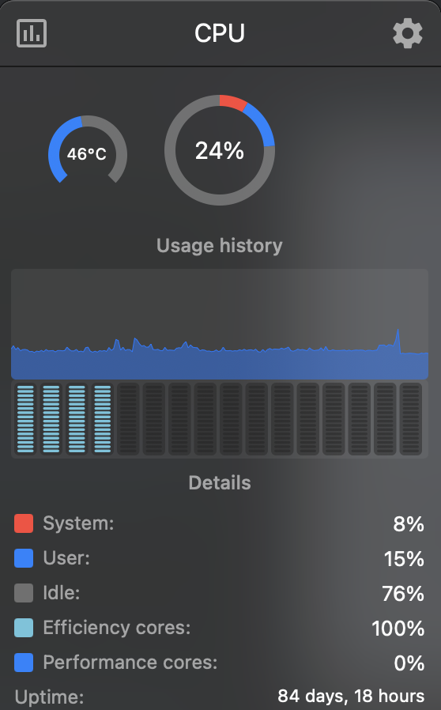

# Mac

The best laptop money can buy:

<https://www.apple.com/uk/macbook-pro/>

If you don't have an M3 Pro / Max - you're missing out on an excellent (but overpriced) machine.

On balance of price vs performance the Macbook Air M3 is excellent, and even thinner and lighter than the
Macbook Pro - a real joy to use. Even when you're using more RAM than the physical 16GB max and swapping, the
performance is still so good you don't notice significant performance degradation for most usage, even when using
heavyweight IDEs like [IntelliJ](intellij.md).

<!-- INDEX_START -->

- [WARNING: Battery Life](#warning-battery-life)
  - [Mac battery runs hotter during charging](#mac-battery-runs-hotter-during-charging)
  - [Do not let your Macbook Pro get hot it will destroy the battery!!](#do-not-let-your-macbook-pro-get-hot-it-will-destroy-the-battery)
  - [Do Not Charge Through USB Port](#do-not-charge-through-usb-port)
  - [Performance Falls through the floor on last 5-10% of battery life](#performance-falls-through-the-floor-on-last-5-10-of-battery-life)
- [Terminal](#terminal)
- [Homebrew - Package Management](#homebrew---package-management)
- [Activity Monitor](#activity-monitor)
- [Stats Bar](#stats-bar)
- [Rearrange Status Bar Icons](#rearrange-status-bar-icons)
- [Reducing Desktop Workspaces](#reducing-desktop-workspaces)
- [Raycast](#raycast)
- [AppleScript](#applescript)
- [Commands](#commands)
  - [Search for or open anything](#search-for-or-open-anything)
  - [Open URL from Terminal output](#open-url-from-terminal-output)
  - [Open](#open)
    - [Open URL in the default web browser](#open-url-in-the-default-web-browser)
    - [Open current directory in Finder](#open-current-directory-in-finder)
    - [Open image in the default app (usually Preview)](#open-image-in-the-default-app-usually-preview)
    - [Open an Application from the command line](#open-an-application-from-the-command-line)
  - [Clipboard](#clipboard)
  - [Screenshots](#screenshots)
    - [Screenshot the Whole Screen](#screenshot-the-whole-screen)
    - [Screenshot a Selection - Drag a Rectangle](#screenshot-a-selection---drag-a-rectangle)
    - [The Screenshot.app](#the-screenshotapp)
    - [The Screencapture CLI](#the-screencapture-cli)
  - [Flush the DNS Cache](#flush-the-dns-cache)
  - [Set DNS Servers](#set-dns-servers)
  - [Set DNS Search Domain](#set-dns-search-domain)
  - [Set Hostname](#set-hostname)
  - [Get Current Wifi Network Name](#get-current-wifi-network-name)
  - [Get Current Wifi Network Password](#get-current-wifi-network-password)
  - [List all Configured Wifi Networks](#list-all-configured-wifi-networks)
  - [Say - text-to-speech](#say---text-to-speech)
  - [Finding Files - Spotlight Search and Index Management](#finding-files---spotlight-search-and-index-management)
  - [Launchctl](#launchctl)
  - [Disk Management](#disk-management)
    - [CLI Disk Management](#cli-disk-management)
    - [List disks](#list-disks)
    - [Mount a partition](#mount-a-partition)
    - [Partition and Format a disk](#partition-and-format-a-disk)
      - [Multiple Partition and Format](#multiple-partition-and-format)
    - [Erase a disk before decommissioning it](#erase-a-disk-before-decommissioning-it)
      - [WARNING: disk numbers may shunt up in numbers as you insert more removal drives, especially for 'synthesized' virtual disks that display for volume containers](#warning-disk-numbers-may-shunt-up-in-numbers-as-you-insert-more-removal-drives-especially-for-synthesized-virtual-disks-that-display-for-volume-containers)
  - [Service Management](#service-management)
- [Binaries Debugging](#binaries-debugging)
- [Creating Bootable CDs & USBs from ISOs](#creating-bootable-cds--usbs-from-isos)
  - [Other Options](#other-options)
    - [CLI](#cli)
- [Troubleshooting](#troubleshooting)
  - [Various Applications Fail to Open](#various-applications-fail-to-open)
    - [Clicking Activity Monitor results in this pop-up error: `The application “Activity Monitor.app” is not open anymore.`](#clicking-activity-monitor-results-in-this-pop-up-error-the-application-activity-monitorapp-is-not-open-anymore)
    - [IntelliJ fails to open](#intellij-fails-to-open)
    - [Settings fails to open](#settings-fails-to-open)
    - [Microsoft Remote Desktop fails to open](#microsoft-remote-desktop-fails-to-open)
- [Relevant GitHub Repos](#relevant-github-repos)

<!-- INDEX_END -->

## WARNING: Battery Life

### Mac battery runs hotter during charging

Ensure it is on a table and not heat capturing linen like you bed, especially if travelling.

### Do not let your Macbook Pro get hot it will destroy the battery!!

Within a few weeks of digitial nomadding working on beds with my laptop on the bed cover,
I had degraded the battery of my new Macbook Pro M3 Max by 85%.


### Do Not Charge Through USB Port

Charging through the USB port off a portable power bank also seemed
to heat up the machine and deteriorate the battery by another couple percent after just half an hour.

### Performance Falls through the floor on last 5-10% of battery life

This screenshot from [Stats Bar](#stats-bar) shows why - it's using only Efficiency Cores rather than Performance Cores:



## Terminal

This is where you should be spending your life if you're a techie, with a browser to supplement referencing documentation.

- `$COLUMNS`
  - 179 column width on my MacBook Pro 13" terminal
  - 204 on my MacBook Pro Retina 15" terminal
  - 215 on my Macbook Pro M3 2023 terminal - resolution gets better over time

## Homebrew - Package Management

The best most widely used package manager for Mac.

See [brew.md](brew.md) for how to use it and great package lists I've spent years discovering and building up.

## Activity Monitor

See your CPU, RAM, Disk, Network and Energy usage of applications.

Sorting by CPU and RAM descending on their tabs is usually your first port of call.

To open Activity Monitor you can type `Cmd-Space` to open Spotlight search bar and the start typing `Activity Monitor`
to find it and hit enter to open it.

On the command line you can also just run this:

```shell
open -a "Activity Monitor"
```

## Stats Bar

[Stats](https://github.com/exelban/stats) gives many nice toolbar stats on your Mac's performance for CPU, GPU, RAM, Disk, Network and Battery.

Battery even tells you:

- time to discharge
- time to charge
- number of cycles (although this one I'm sure is only since installation of Stats)
- battery health
- which apps which are consuming a lot of energy for you to kill them if you're not needing them, helping your battery life when on the move

## Rearrange Status Bar Icons

Now 14" Macbook Pros are powerful enough, but the screen space is very limited and you lose the top middle for the
camera you end up losing icons behind the camera portion of the screen.

Rearrange your icons to put the most important and frequently used icons to the left while leaving icons you rarely
click on like Google Drive to the left to be pushed underneath the camera.

To rearrange icons:

`Cmd` + Click + drag each icon to where you want it

## Reducing Desktop Workspaces

If like me, you hate the time lost in graphics sliding effect from one desktop workspace to another, especially caused
by apps like Windows Virtual Desktop in Remote Desktop opening to full screen, and just prefer good old fashioned
`Cmd`-`Tab`, then you can remove the extra workspaces as
[described here](https://discussions.apple.com/thread/8118894?sortBy=best)
by pressing F3 and then hovering on and clicking the X to delete the extra workspaces.

Unfortunately, Remote Desktop still seems to slide and send to fullscreen in another temporary desktop workspace.

## Raycast

Shortcut to everything - install and then hit `Option` + `Space` to bring it up.

<https://www.raycast.com/>

## AppleScript

Applescript sucks by comparison to [Bash](bash.md), and the debugging is even worse - from a trivial 10-20 line
script you can get an error like this:

```text
/get_application_names.scpt:882:889: script error: Expected “from”, etc. but found identifier. (-2741)
```

Line number `882:889`?? Good luck finding the offending line. Now imagine that was a 100 or 1000 line script.
Debugging Hell.

Still, there are some macOS UI related things for which this is the native code, see some such scripts under
the `applescript/` directory in my [DevOps-Bash-tools](https://github.com/HariSekhon/DevOps-Bash-tools) repo which
has many more Bash scripts that work on macOS and a bit of [Python](python.md) with the Quartz library for macOS:

[](https://github.com/HariSekhon/DevOps-Bash-tools)

## Commands

A list of commands is provided at <https://ss64.com/mac/>.

### Search for or open anything

`Cmd`-`Space` - opens Spotlight search to auto-complete and open anything quickly.

### Open URL from Terminal output

`Cmd` + Click on the URL.

### Open

Open a file / folder / URL / Application. Use `-a` to select which app to use to open it.
Use `-e` to edit the file in TextEdit.

#### Open URL in the default web browser

```shell
open https://google.com
```

#### Open current directory in Finder

```shell
open .
```

#### Open image in the default app (usually Preview)

```shell
open file.jpg
```

You can also drag to the Terminal to paste a file or directory's path, or right-click copy and paste into the terminal
to get its path on your command line.

#### Open an Application from the command line

```shell
open -a "SQLDeveloper.app"
```

### Clipboard

Copy from stdin to clipboard:

```shell
pbcopy < input.txt
```

Paste from clipboard to stdout:

```shell
pbpaste > output.txt
```

### Screenshots

#### Screenshot the Whole Screen

`Cmd` + `Shift` + `3`

#### Screenshot a Selection - Drag a Rectangle

Switches to a cross-hair to drag to what you want to screenshot.

`Cmd` + `Shift` + `4`

#### The Screenshot.app

in the Utilities folder is easy to use:

```shell
open /System/Applications/Utilities/Screenshot.app
```

#### The Screencapture CLI

You may be prompted to allow Terminal to record the screen under `Privacy & Security` -> `Screen Recording` the first
time - it'll tell you that you have to restart the Terminal, but it worked for me without a restart.

Switches to select window to capture:

```shell
screencapture -W /tmp/screenshot.png
```

Interactive mode with full toolbar, same as the `Screenshot.app`:

```shell
screencapture -i -U /tmp/screenshot.png
```

Video recording mode for 10 seconds (without `-V` it will record until you `Ctrl`-`c` it):

```shell
screencapture -v -V 10 /tmp/videocapture.mp4
```

So many great options from delayed screenshots, copy to clipboard, open in Preview, capture a coordinate rectangle
(great for automation!), see:

```shell
screencapture --help
```

### Flush the DNS Cache

```shell
dscacheutil -flushcache
sudo killall -HUP mDNSResponder
```

### Set DNS Servers

Sometimes you want to use public DNS servers for better performance than the local DHCP given ones:

```shell
sudo networksetup -setdnsservers en0 4.2.2.1 4.2.2.2
```

To set back to DHCP DNS servers, just clear the list:

```shell
sudo networksetup -setdnsservers en0 "Empty"
```

In [DevOps-Bash-tools](devops-bash-tools.md) the shell has a function `dhcpdns` to do this for all network
interfaces and remove the DNS search domains since you should inherit them from DHCP and not leak those FQDN
searches to the internet if on public networks.

### Set DNS Search Domain

```shell
sudo networksetup -setsearchdomains en0 mydomain.com
```

In [DevOps-Bash-tools](devops-bash-tools.md) the shell has a function `set_dns` to do this for all network interfaces to
make this easier.

You should see these search domains appear in the class unix file `/etc/resolv.conf` managed by apple networking.

To remove DNS search domains:

```shell
sudo networksetup -setsearchdomains en0 "Empty"
```

or `clear_dns_search` function in [DevOps-Bash-tools](devops-bash-tools.md) to do this for all interfaces.

### Set Hostname

```shell
hostname=whitestar
```

```shell
sudo hostname "$hostname"
sudo scutil --set HostName      "$hostname"
sudo scutil --set ComputerName  "$hostname"
sudo scutil --set LocalHostName "$hostname"
```

```shell
scutil --get HostName
scutil --get ComputerName
scutil --get LocalHostName
```

### Get Current Wifi Network Name

```shell
networksetup -getairportnetwork en0 | awk -F': ' '{print $2}'
```

### Get Current Wifi Network Password

Prompts with a UI pop-up for administrative access to the system's keychain (`sudo` doesn't prevent this unfortunately):

```shell
security find-generic-password -g -w -D "AirPort network password" \
    -a "$(networksetup -getairportnetwork en0 |
          awk -F': ' '{print $2}')"
```

### List all Configured Wifi Networks

```shell
networksetup -listpreferredwirelessnetworks en0 |
sed '/Preferred networks on/d;
     s/^[[:space:]]*//' |
sort -f
```

### Say - text-to-speech

Make your Mac speak.

I used this to impress my kids, or even send a message from my loft study to my living room computer
by running `say` over an SSH login to the computer downstairs for them to hear!

```shell
say "Daddy is the greatest"
```

You can also pipe in text:

```shell
echo "Daddy is the greatest" | say
```

Try different voices, list them like this:

```shell
say -v ?
```

Speak from a text file and save it to an audio file:

```shell
say -f words.txt -o myaudioclip.aiff
```

### Finding Files - Spotlight Search and Index Management

The equivalent of `locate` on Linux, uses the Spotlight index:

```shell
mdfind [-onlyin /path/to/directory] [-name "$filename"] "$term"
```

Erase and rebuild the Spotlight index:

```shell
mdutil -E
```

Enable / disable Spotlight indexing for a given volume or entirely:

```shell
mdutil -i
```

### Launchctl

This accesses `launchd`, Mac's init script equivalent.

See which `launchd` scripts are loaded:

```shell
launchctl list
```

Stop and unload script, add `-w` to remove it from the boot sequence:

```shell
sudo launchctl unload [path/to/script]
```

Launch scripts are found in the following locations:

```text
~/Library/LaunchAgents
/Library/LaunchAgents
/Library/LaunchDaemons
/System/Library/LaunchAgents
/System/Library/LaunchDaemons
```

[Launchd documentation](https://developer.apple.com/library/archive/documentation/MacOSX/Conceptual/BPSystemStartup/Chapters/CreatingLaunchdJobs.html)

[Blog post](https://paul.annesley.cc/2012/09/mac-os-x-launchd-is-cool/) on cool things launchd can do, like watching and
executing on files that are dropped into directories.

### Disk Management

Using graphical Disk Utility is easiest:

```shell
open /System/Applications/Utilities/Disk\ Utility.app
```

#### CLI Disk Management

Great tutorial:

[Part 1](http://www.theinstructional.com/guides/disk-management-from-the-command-line-part-1) -
List, Verify, Repair, Rename, Erase volumes

[Part 2](https://www.theinstructional.com/guides/disk-management-from-the-command-line-part-2) -
Partition, Format, Split / Merge Partitions

[Part 3]() - Create `.dmg` disk images from a Volume / Folder, Encrypted Disk Image, Resize Image, Restore Image

#### List disks

```shell
diskutil list
```

`diskutil mount` and `diskutil mountDisk` are the same

#### Mount a partition

```shell
diskutil mount /dev/disk4s2
```

```shell
diskutil unmount /dev/disk4s2
```

or by volume location:

```shell
diskutil unmount "/Volumes/$NAME"
```

Mount a partition read-only if having trouble and trying to recover data:

```shell
diskutil mount readOnly /dev/disk4s2
```

Mount at a different location to the default `/Volumes/<partition_metadata_name>`:

```shell
diskutil mount /dev/disk4s2 -mountPoint /path/to/dir
```

Mount / unmount partitions on a whole disk by reading its partition table:

```shell
diskutil mountDisk disk10
```

```shell
diskutil unmountDisk disk10
```

Verify a volume:

```shell
diskutil verifyVolume "/Volumes/$NAME"
```

Repair volume:

```shell
diskutil repairVolume "/Volumes/$NAME"
```

```shell
diskutil verifyPermissions "/Volumes/$NAME"
```

```shell
diskutil repairPermissions "/Volumes/$NAME"
```

Format a partition This is risky because there is no confirmation, better to do this from Disk Utility:

```shell
diskutil eraseDisk "$filesystem" "$name" "/dev/$diskN"
```

See which filesystems are available for formatting:

```shell
diskutil listFilesystems
```

Rename a disk:

```shell
diskutil rename "$volume_name" "$new_volume_name"
```

#### Partition and Format a disk

APFS requires GPT partition table

```shell
disk="disk4"
partition_table="GPT"
name="MyVolume"
filesystem="APFSX"  # AppleFS case-sensitive, found from 'diskutil listFilesystems' above
size="0b"           # integer + units suffix (b, m or g for bytes, megabytes or gigabytes) - '0b' uses all space
```

```shell
diskutil partitionDisk "/dev/$disk" "$partition_table" "$filesystem" "$name" "$size"
```

##### Multiple Partition and Format

```shell
diskutil partitionDisk /dev/"$disk" "$partition_table" "$filesystem" "First"  "$size" \
                                                       "$filesystem" "Second" "$size" \
                                                       "$filesystem" "Third"  "$size" \
                                                       "$filesystem" "Fourth" "$size" \
                                                       "$filesystem" "Fifth"   0b  # '0b' to use up all remaining space
```

Partition splitting doesn't seem to work with APFS, only macOS Extended, as APFS tells you to
`diskutil apfs deleteContainer disk10` instead which leaves you with free space to create a new partition.

#### Erase a disk before decommissioning it

Either use Disk Utility above, a command like `diskutil eraseDisk ...` or the more portable unix command `dd` with a
custom command like this to do a moderate 3 pass overwrite
(tune number of `passes` variable to suit your level of data recovery paranoia, eg. DoD standard 7 passes):

##### WARNING: disk numbers may shunt up in numbers as you insert more removal drives, especially for 'synthesized' virtual disks that display for volume containers

```shell
passes=3
time \
for number in $(seq $passes); do
    echo pass $number
    echo
    time sudo dd if=/dev/urandom of=/dev/disk4 bs=1M
    echo
done
```

Note: multiple passes are only for old inaccurate HDDs rotating mechanical metal platter disk.
For SSDs, you only need a single pass.

### Service Management

List services:

```shell
sudo launchctl list
```

Load and start a service from a `plist` file:

```shell
sudo launchctl load -F "/System/Library/LaunchDaemons/$name.plist"
sudo launchctl start "com.apple.$name"
```

Stop and unload a service:

```shell
sudo launchctl stop "com.apple.$name"
sudo launchctl unload "/System/Library/LaunchDaemons/$name.plist"
```

See [dhcp.md](dhcp.md) for a practical example of using this for the built-in tftp server for PXE boot installing Debian off your Mac.

## Binaries Debugging

See the [Binaries Debugging](binaries-debugging.md) doc for commands to examine and work with binaries.

## Creating Bootable CDs & USBs from ISOs

Macs and many computers don't come with CD/DVD anymore to save space, so you can either buy an external USB dvd-writer or create bootable USBs.

To create a bootable USBs from ISO image files intended for CD/DVDs in order to use them to install Linux
or use a disk wiping distro like DBAN or ShredOS,
you can download [Etcher](https://etcher.balena.io/) or use
[mac_iso_to_usb.sh](https://github.com/HariSekhon/DevOps-Bash-tools/blob/master/bin/mac_iso_to_usb.sh)
from [DevOps-Bash-tools](devops-bash-tools.md):

```shell
mac_iso_to_usb.sh "$iso"  # /dev/disk4
```

### Other Options

1. UNetbootin app from github
2. DiskUtility
3. CLI

#### CLI

Set your filename in a variable so the following commands can be executed as is without editing:

```shell
export ISO="memtest86+-5.01.iso"
```

Convert it to make it bootable - will automatically add `.dmg` suffix => `.img.dmg`:

```shell
hdiutil convert -format UDRW -o "$ISO.img" "$ISO"
```

Figure out which is the USB disk - be careful or you'll destroy your system!

```shell
diskutil list
```

```shell
diskutil unmountDisk /dev/diskN
```

Tip: prefixing disk with 'r' uses raw disk which is faster:

```shell
sudo dd if="$ISO.img" of=/dev/rdiskN bs=1m # or 1M
```

```shell
diskutil eject /dev/diskN
```

Burn CD - insert blank CD then:

```shell
hdiutil burn "$ISO"
```

## Troubleshooting

### Various Applications Fail to Open

#### Clicking Activity Monitor results in this pop-up error: `The application “Activity Monitor.app” is not open anymore.`

Even trying it from the command line to try to debug it results in this error:

```shell
$ open -a "Activity Monitor"
The application /Applications/IntelliJ IDEA CE.app cannot be opened for an unexpected reason, error=Error Domain=NSOSStatusErrorDomain Code=-600 "procNotFound: no eligible process with specified descriptor" UserInfo={_LSLine=4141, _LSFunction=_LSOpenStuffCallLocal}
```

Meanwhile this works:

```shell
open -a "Finder"
```

**Fix**: Short of rebooting...

#### IntelliJ fails to open

```shell
$ open -a "IntelliJ IDEA CE"
The application /Applications/IntelliJ IDEA CE.app cannot be opened for an unexpected reason, error=Error Domain=NSOSStatusErrorDomain Code=-600 "procNotFound: no eligible process with specified descriptor" UserInfo={_LSLine=4141, _LSFunction=_LSOpenStuffCallLocal}
```

#### Settings fails to open

```shell
$ open -a "Settings"
The application /System/Applications/System Settings.app cannot be opened for an unexpected reason, error=Error Domain=NSOSStatusErrorDomain Code=-600 "procNotFound: no eligible process with specified descriptor" UserInfo={_LSLine=388, _LSFunction=_LSAnnotateAndSendAppleEventWithOptions}
```

#### Microsoft Remote Desktop fails to open

```shell
open -a "Microsoft Remote Desktop"
The application /Applications/Microsoft Remote Desktop.app cannot be opened for an unexpected reason, error=Error Domain=NSOSStatusErrorDomain Code=-600 "procNotFound: no eligible process with specified descriptor" UserInfo={_LSLine=388, _LSFunction=_LSAnnotateAndSendAppleEventWithOptions}
```

## Relevant GitHub Repos

[](https://github.com/HariSekhon/DevOps-Bash-tools)

**Ported from various private Knowledge Base pages 2010+**
