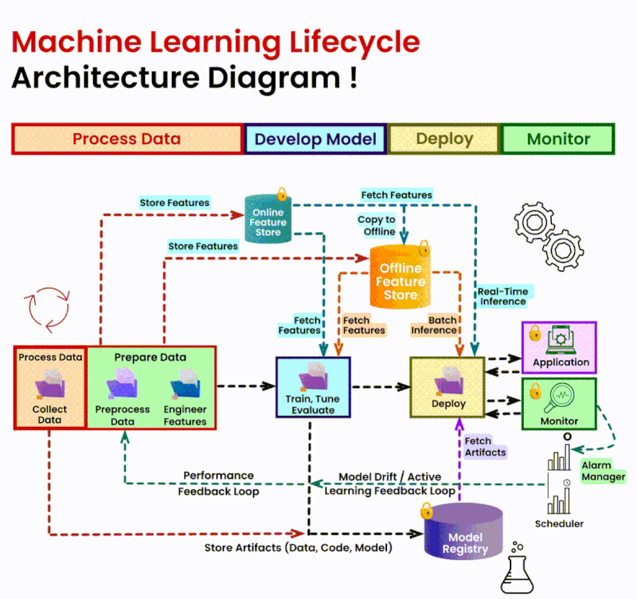

# Machine Learning

<!-- INDEX_START -->

- [Diagram](#diagram)
  - [Machine Learning Lifecycle](#machine-learning-lifecycle)
- [Other Resources](#other-resources)

<!-- INDEX_END -->

## Diagram

### Machine Learning Lifecycle

## Other Resources

[:octocat: guillaume-chevalier/Awesome-Deep-Learning-Resources](https://github.com/guillaume-chevalier/Awesome-Deep-Learning-Resources)
