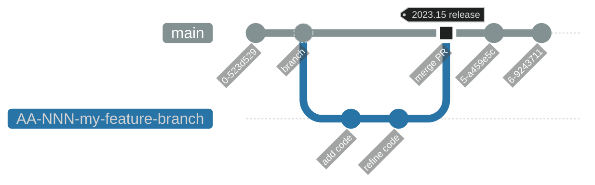
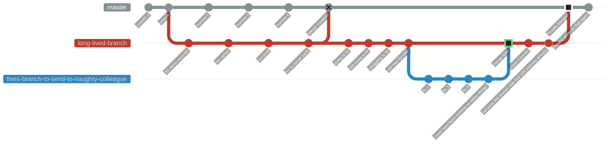
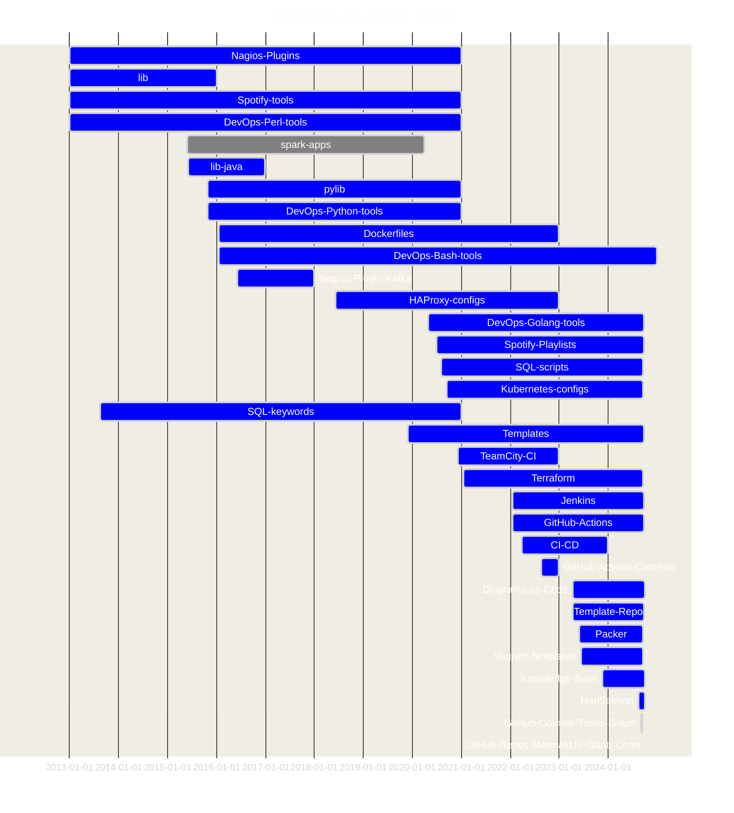

# MermaidJS

<https://mermaid.js.org/>

<!-- INDEX_START -->

- [Live Online Interactive Editor](#live-online-interactive-editor)
- [CLI](#cli)
  - [Install CLI](#install-cli)
  - [Convert `.mmd` code file into a diagram](#convert-mmd-code-file-into-a-diagram)
- [Real World Examples](#real-world-examples)
  - [GitHub Flow with Jira ticket integration](#github-flow-with-jira-ticket-integration)
  - [Git - why you shouldn't use long-lived feature branches](#git---why-you-shouldnt-use-long-lived-feature-branches)
- [Gantt Chart of my Experience](#gantt-chart-of-my-experience)
- [Gantt Chart of my GitHub Repos](#gantt-chart-of-my-github-repos)

<!-- INDEX_END -->

Excellent [Diagrams-as-Code](diagrams.md) tool with the widest variety of formats and structures
that allows it to do things that most other Diagrams-as-Code tools simply can't do.

Best tool for embedded live diagrams in GitHub [Markdown](markdown.md) (`README.md`) files -
GitHub natively integrates to support it so that MermaidJS code blocks in GitHub Markdown are automatically rendered.

- Huge number of diagram types and more being added
- Flow Chart, Git Commit Log Charts, Gantt diagrams etc.
- recently added Cloud [Architecture](https://mermaid.js.org/syntax/architecture.html)
  - [D2](d2.md) and [Python diagrams](diagrams.md#diagrams-as-code-languages) are most established for this
  - square only but MermaidJS has direction control between icons so you can do shapes D2 / Python Diagrams can't
- Under active development
- can do icons now, see [example](https://text-to-diagram.com/?example=icons&b=mermaid) by D2 comparison site
- [Live Online Interactive Editor](#live-online-interactive-editor) to interactively see the results as you type
- CLI - [mermaid-js/mermaid-cli](https://github.com/mermaid-js/mermaid-cli)
- [Cloud Dashboard](https://www.mermaidchart.com/app/dashboard) - free for up to 5 diagrams
- See these MermaidJS [Code](https://github.com/search?q=repo%3AHariSekhon%2FDiagrams-as-Code+path%3A*.mmd&type=code) files

- `%%` as comment prefixes

## Live Online Interactive Editor

<https://mermaid.live/edit>

A fantastic tool to interactively develop and see the changes in real-time.

Comes with a range of sample diagrams to get you started that you can modify interactively to experiment with.

## CLI

:octocat: [mermaid-js/mermaid-cli](https://github.com/mermaid-js/mermaid-cli)

This can compile local `.mmd` code into svg or png graphs.

### Install CLI

```shell
npm install -g @mermaid-js/mermaid-cli
```

### Convert `.mmd` code file into a diagram

```shell
mmdc -i input.mmd -o output.svg
```

## Real World Examples

Also available in the :octocat: [HariSekhon/Diagrams-as-Code](https://github.com/HariSekhon/Diagrams-as-Code)
repo:

### GitHub Flow with Jira ticket integration

Prefix Git branches with Jira ticket numbers in Jira's `AA-NNN` format for GitHub Pull Requests to automatically appear in Jira tickets (see this [doc](https://support.atlassian.com/jira-cloud-administration/docs/integrate-with-github/)):



### Git - why you shouldn't use long-lived feature branches

\* [Environment Branches](https://github.com/HariSekhon/Diagrams-as-Code/blob/master/README.md#git---environment-branches) may be one of the few exceptions but requires workflow discipline.

See Also: 100+ scripts for Git and the major Git repo providers like GitHub, GitLab, Bitbucket, Azure DevOps in my [DevOps-Bash-tools](https://github.com/HariSekhon/DevOps-Bash-tools) repo.



## Gantt Chart of my Experience

This should give you some idea of my long evolution having reached the level of lead engineer and architect
by the mid-to-late 2000s.

<!--
%% MermaidJS inline colour customization is not documented properly:
%%
%%    https://github.com/mermaid-js/mermaid/issues/5915
%%
%% Have to infer the settings from here:
%%
%%    https://github.com/mermaid-js/mermaid/blob/develop/packages/mermaid/src/diagrams/gantt/styles.js
%%
%% and especially the styles here:
%%
%%    https://github.com/mermaid-js/mermaid/blob/develop/packages/mermaid/src/themes/theme-default.js
%%
%% Have to use 'base' theme because the 'dark' theme has hardcoded red for 'crit'
%%
%% This is here because we can't have %% comments in the %%{ init: { } } section below
%%
%% Even a trailing comma, breaks the colour customization
%%
%%          'altSectionBkgColor': 'lightgrey',
%%          'sectionBkgColor': 'lightgrey',
%%          'sectionBkgColor2': 'darkgrey',
-->

```mermaid
%%{ init: {
        "logLevel": "debug",
        'theme': 'dark',
        'themeVariables': {
          'activeTaskBkgColor': '#27ae60',
          'activeTaskBorderColor': 'lightgrey',
          'critBkgColor': 'blue',
          'critBorderColor': 'lightgrey',
          'doneTaskBkgColor': 'grey',
          'doneTaskBorderColor': 'lightgrey',
          'excludeBkgColor': '#eeeeee',
          'gridColor': 'lightgrey',
          'taskBkgColor': 'black',
          'taskBorderColor': 'black',
          'taskTextClickableColor': 'white',
          'taskTextColor': 'white',
          'taskTextDarkColor': 'white',
          'taskTextLightColor': 'black',
          'taskTextOutsideColor': 'white',
          'todayLineColor': 'red'
        }
    }
}%%

gantt
    title Hari Sekhon's Technology Skills & Experience
    dateFormat  YYYY-MM-DD

    20+ years of Skillz to Pay the Billz : 2002-06-01, 2024-12-31

    section Operating Systems
    Linux                    : crit, 2002-12-01, 2024-12-31
    Windows Active Directory : done, 2003-01-01, 2009-11-10
    %%Redhat Linux             : active, 2002-12-01, 2024-12-31
    %%Debian Linux             : active, 2003-01-01, 2024-12-31
    %%Gentoo Linux             : done, 2004-06-01, 2009-11-10
    %%Ubuntu Linux             : active, 2006-06-01, 2024-12-31
    %%Alpine Linux             : done, 2016-01-01, 2024-12-31
    Mac                      : active, 2010-02-01, 2024-12-31

    section Coding
    Coding                 : crit, 2002-12-01, 2024-12-31
    Bash                   : active, 2002-12-01, 2024-12-31
    Python                 : active, 2005-11-01, 2024-12-31
    APIs                   : active, 2006-06-01, 2024-12-31
    %%VBScript               : done, 2005-05-01, 2009-11-01
    Perl                   : active, 2009-11-13, 2024-12-31
    Git                    : active, 2012-06-01, 2024-12-31
    %%Ruby                   : done, 2009-11-13, 2013-01-31
    Java                   : active, 2013-01-13, 2024-12-31
    %%Jython                 : done, 2013-01-13, 2015-12-31
    %%JRuby                  : done, 2013-03-01, 2013-08-31
    %%Scala                  : done, 2014-01-01, 2015-12-31
    Golang                 : active, 2015-06-01, 2024-12-31
    Groovy                 : active, 2016-01-01, 2024-12-31

    %%section Build Systems
    %%Make                   : active, 2006-06-01, 2024-12-31
    %%Maven                  : active, 2013-02-01, 2024-12-31
    %%SBT                    : active, 2014-01-01, 2024-12-31
    %%Gradle                 : active, 2014-06-01, 2024-12-31

    %%section Version Control Systems
    %%Subversion             : done, 2005-11-13, 2012-06-01
    %%Mercurial              : done, 2011-06-01, 2013-06-01
    %%Git                    : active, 2012-06-01, 2024-12-31
    %%GitHub                 : active, 2012-12-31, 2024-12-31

    section Networking
    Networking             : crit, 2004-03-01, 2024-12-31
    %%VPNs                   : active, 2006-06-01, 2024-12-31
    %%Cisco - IOS / NX-OS    : done, 2004-03-01, 2024-12-31
    %%Juniper - Netscreen / SSG / SRX / ScreenOS / JunOS : done, 2007-01-01, 2013-01-18
    %%Netgear                : done, 2005-01-01, 2012-12-31

    section Load Balancers

    section Security
    Security               : crit, 2004-10-01, 2024-12-31
    %%Kerberos               : active, 2006-06-01, 2024-12-31
    %%LDAP                   : active, 2006-06-01, 2024-12-31

    section DevOps
    DevOps                   : crit, 2005-11-11, 2024-12-31

    section Data
    Data                   : active, 2005-11-11, 2024-12-31
    %%Data Validation        : done, 2006-06-01, 2024-12-31
    %%Data Science           : done, 2013-01-18, 2024-12-31

    section Architecture
    Architecture            : crit,   2005-11-11, 2024-12-31
    Web-Scale Architecture  : active, 2009-11-01, 2024-12-31
    MicroServices           : active, 2018-10-01, 2024-12-31
    Diagrams-as-Code        : active, 2023-04-14, 2024-12-31

    section Databases (RDBMS)
    Databases (RDBMS)      : crit, 2004-01-01, 2024-12-31
    SQL                    : active, 2004-01-01, 2024-12-31
    Microsoft SQL Server   : done, 2004-01-01, 2005-10-31
    Oracle                 : done, 2005-11-01, 2009-09-10
    MySQL                  : active, 2007-01-01, 2024-12-31
    PostgreSQL             : active, 2008-01-01, 2024-12-31

    section Web & CDNs
    Web                    : crit, 2005-01-01, 2024-12-31
    APIs                   : active, 2006-06-01, 2024-12-31

    Load Balancers         : active, 2009-07-01, 2024-12-31
    %%LVS                    : done, 2009-01-01, 2009-11-11
    %%Foundry - ServerIron XL / 4G : done, 2009-10-13, 2011-11-31
    %%F5 BigIP               : done, 2010-06-01, 2013-01-18
    %%HAProxy                : active, 2018-04-01, 2024-12-31
    %%Kong                   : active, 2023-03-01, 2024-12-31
    %%Traefik                : active, 2023-03-01, 2024-12-31

    Web-Scale Architecture : active, 2009-11-01, 2024-12-31
    CDNs                   : active, 2009-12-01, 2024-12-31
    %%UlraDNS                : done, 2009-11-01, 2012-06-31
    %%Cotendo                : done, 2012-06-01, 2013-01-13
    %%Cloudflare             : active, 2020-08-20, 2024-12-31
    MicroServices            : active, 2018-10-01, 2024-12-31

    section Virtualization & Containerization
    Virtualization         : crit, 2005-01-01, 2024-12-31
    %%VMware ESX, ESXi, VirtualBox : done, 2005-01-01, 2017-02-16
    %%Vagrant                : active, 2013-01-01, 2023-12-31
    Containerization       : crit, 2014-06-01, 2024-12-31
    Docker                 : active, 2014-06-01, 2024-12-31
    Kubernetes             : active, 2018-09-01, 2024-12-31
    MicroServices          : active, 2018-10-01, 2024-12-31
    ArgoCD                 : active, 2021-01-01, 2024-12-31

    section IaaC & Configuration Management
    Configuration Management :crit, 2006-01-01, 2024-12-31
    Puppet Config Mgmt     : done, 2008-09-01, 2014-02-18
    Ansible                : active, 2014-06-01, 2024-12-31
    IaaC                   :crit, 2008-01-01, 2024-12-31
    Terraform              :active, 2019-09-01, 2024-12-31
    %%Terraform Cloud        : active, 2021-09-01, 2022-09-31
    %%Kickstart              : active, 2008-01-01, 2024-12-31
    %%Preseed                : active, 2009-01-01, 2024-12-31
    %%AutoInstall            : active, 2023-01-01, 2024-12-31

    section CI/CD
    CI/CD                  : crit, 2010-06-01, 2024-12-31
    Jenkins                : active, 2010-06-01, 2024-12-31
    Travis CI              : done, 2014-05-01, 2023-05-08
    CircleCI               : done, 2019-09-01, 2021-12-31
    BuildKite              : done, 2019-09-01, 2021-12-31
    GitHub Actions         : active, 2019-09-01, 2024-12-31
    %%GitLab                 : active, 2019-09-01, 2022-12-31
    %%Azure DevOps           : done, 2019-09-01, 2022-12-31
    %%Bitbucket              : done, 2019-09-01, 2022-12-31
    %%Concourse              : active, 2019-11-01, 2020-03-20
    %%TeamCity               : active, 2020-08-20, 2021-02-31
    CloudBuild             : active, 2020-08-20, 2023-09-30

    section Monitoring
    Monitoring             : crit, 2006-06-01, 2024-12-31
    Nagios                 : active, 2006-06-01, 2019-07-31
    OpenTSDB               : done, 2016-09-01, 2019-07-31
    Grafana                : active, 2018-01-01, 2024-12-31
    Prometheus             : active, 2018-06-01, 2024-12-31
    %%Pingdom                : done, 2020-08-20, 2023-09-17
    %%Datadog                : done, 2022-08-20, 2023-09-17

    section Big Data
    Big Data               : crit, 2009-11-13, 2019-07-31
    Hadoop                 : done, 2009-11-13, 2019-07-31
    %%HDFS                   : done, 2009-11-13, 2019-07-31
    %%MapReduce              : done, 2012-06-01, 2019-07-31
    Cloudera / Hortonworks : done, 2012-08-01, 2020-03-20
    Hive                   : done, 2013-01-18, 2019-07-31
    HBase                  : active, 2013-02-01, 2019-07-31
    Impala                 : done, 2013-04-01, 2015-06-30
    Spark                  : active, 2014-01-01, 2019-07-31
    Kafka                  : active, 2014-01-01, 2019-07-31
    Apache Drill           : active, 2014-06-01, 2018-12-31

    section NoSQL
    NoSQL                  : crit, 2009-11-13, 2024-12-31
    HBase                  : active, 2013-02-01, 2019-07-31
    %%MongoDB                : done, 2013-06-01, 2013-12-31
    Cassandra              : active, 2013-08-01, 2024-12-31
    Couchbase              : done, 2013-11-01, 2024-03-01

    section Caching
    Caching                : crit, 2009-11-31, 2024-12-31
    Memcached              : done, 2009-11-31, 2024-12-31
    Redis                  : active, 2013-03-01, 2024-12-31

    section Cloud
    Cloud            : crit, 2012-09-01, 2024-12-31
    AWS              : active, 2012-09-01, 2024-12-31
    GCP              : active, 2018-09-01, 2024-12-31
    Azure            : active, 2020-08-01, 2024-12-31

    section Search
    Search                 : crit, 2013-03-31, 2024-12-31
    Elasticsearch          : active, 2013-03-31, 2024-12-31
    %%LogStash               : done, 2013-03-31, 2024-12-31
    %%Fluentd                : crit, 2018-03-31, 2024-12-31
    %%Kibana                 : crit, 2013-03-31, 2024-12-31
    SolrCloud              : done, 2013-04-01, 2024-03-01
```



## Gantt Chart of my GitHub Repos


