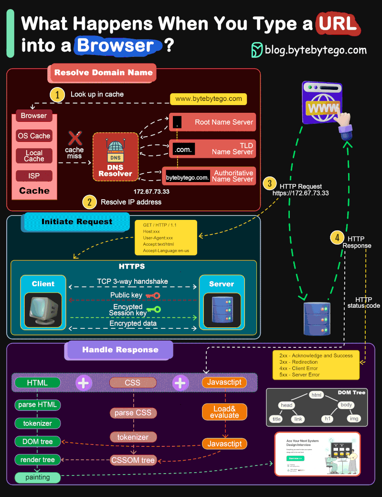

# Networking

<!-- INDEX_START -->

- [CIDR visualizer](#cidr-visualizer)
- [VPNs](#vpns)
- [Browser Fingerprinting](#browser-fingerprinting)
- [I2P](#i2p)
- [Commands](#commands)
  - [Show routing table](#show-routing-table)
  - [DNS lookup](#dns-lookup)
  - [Add static route](#add-static-route)
  - [Show your public IP](#show-your-public-ip)
  - [Linux - show your local IP Tables software firewall rules](#linux---show-your-local-ip-tables-software-firewall-rules)
- [Diagrams](#diagrams)
  - [Network - Layer 2 - Local - ARP](#network---layer-2---local---arp)
  - [Network - Layer 3 - Remote - IP](#network---layer-3---remote---ip)
  - [Web Basics](#web-basics)
  - [Browser Flow](#browser-flow)

<!-- INDEX_END -->

## CIDR visualizer

Shows bits, netmask, first IP, last IP, number of IPs in range

<http://cidr.xyz/>

## VPNs

See [VPNs](vpn.md).

## Browser Fingerprinting

[fingerprint.com](https://fingerprint.com/) can still sort of identify you using a hash of common characteristics.
Click the link from Incognito/Private Browsing and on/off VPN to see

Documentation:

<https://dev.fingerprint.com/>

Open source library (TODO read this code):

<https://github.com/fingerprintjs/fingerprintjs>

## I2P

<https://geti2p.net/>

Invisible Internet Protocol.

Anonymous internet network layer to route traffic through.

## Commands

```shell
ping 4.2.2.1
```

### Show routing table

On Linux:

```shell
route -n
```

On Windows or Mac:

```shell
netstat -rn
```

### DNS lookup

Look up a well known public DNS address:

On Linux or Mac:

```shell
host google.com
```

On Windows:

```shell
nslookup google.com
```

### Add static route

[man route](https://linux.die.net/man/8/route)

```shell
route add ...
```

[man ip-route](https://man7.org/linux/man-pages/man8/ip-route.8.html)

```shell
ip route ...
```

### Show your public IP

...that you are NAT'd through as well as geolocation and other details:

```shell
curl ifconfig.co
```

### Linux - show your local IP Tables software firewall rules

```shell
iptables -nL -line-numbers
```

## Diagrams

From the [HariSekhon/Diagrams-as-Code](https://github.com/HariSekhon/Diagrams-as-Code) repo:

### Network - Layer 2 - Local - ARP


### Network - Layer 3 - Remote - IP


### Web Basics


### Browser Flow


