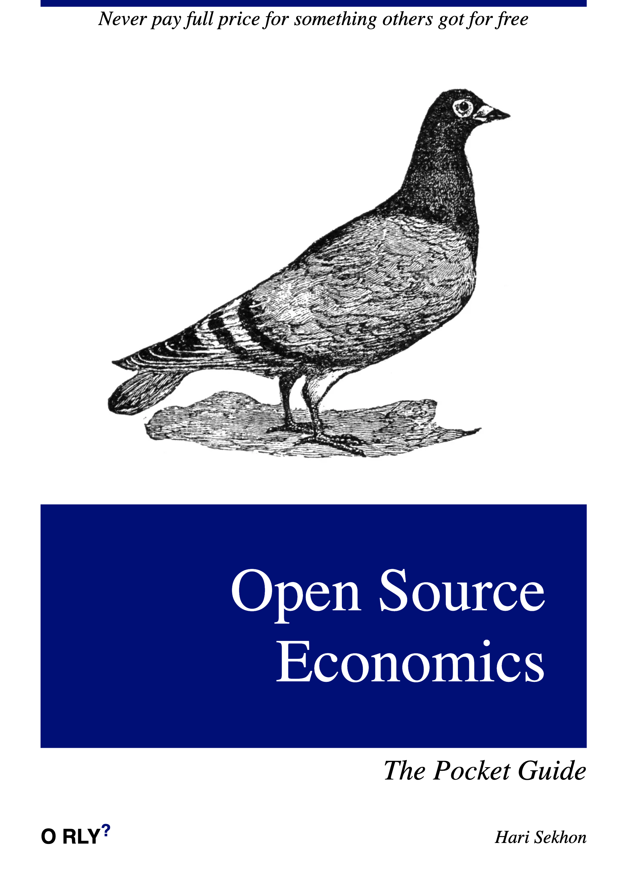

# Open Source Applications

[Black Duck](https://openhub.net) - open source software tracking and governance

<!-- INDEX_START -->

- [Open Source](#open-source)
- [Not open source](#not-open-source)
- [Meme](#meme)
  - [Open Source Economics](#open-source-economics)

<!-- INDEX_END -->

## Open Source

Miscellaneous open source applications worthy of note.

- [ListMonk](https://listmonk.app/) - self-hosted newsletter and mailing list manager

- Video Conferencing
  - <https://www.mynaparrot.com/blog/215-7-free-open-source-video-conference-systems>

## Not open source

Bu perhaps worth a look.

- [Revolt](https://revolt.chat/)

## Meme

### Open Source Economics

It's not just about open source... :wink:

