# Programming

<!-- INDEX_START -->

- [Languages](#languages)
- [Expect](#expect)
- [Free Programming Courses](#free-programming-courses)
- [Testing](#testing)
- [Code Pastebin Sites](#code-pastebin-sites)
- [Big O Notation](#big-o-notation)
- [Count Lines of Code](#count-lines-of-code)
- [Memes](#memes)
  - [Hello World](#hello-world)
  - [Practice](#practice)
  - [Documentation](#documentation)
  - [Run It Again](#run-it-again)
  - [Like Coding, Good at Math](#like-coding-good-at-math)
  - [Software Development Process](#software-development-process)
  - [Are You Really Sure You Want to be a Software Developer??](#are-you-really-sure-you-want-to-be-a-software-developer)
  - [Coding with GPT](#coding-with-gpt)
  - [Senior Devs Fixing Bugs in Production](#senior-devs-fixing-bugs-in-production)
  - [Theory vs Practice](#theory-vs-practice)
  - [Concurrent Programming](#concurrent-programming)
  - [Meme Driven Development](#meme-driven-development)
  - [OverEngineering Simple Solutions](#overengineering-simple-solutions)
  - [Hating on Languages You Don't Use](#hating-on-languages-you-dont-use)
  - [H8 PHP Range Rover](#h8-php-range-rover)
  - [C++ for Python Developers](#c-for-python-developers)
  - [Hell is Debugging Other People's Code](#hell-is-debugging-other-peoples-code)
  - [Developers at Beginning vs End of of Project](#developers-at-beginning-vs-end-of-of-project)

<!-- INDEX_END -->

## Languages

1. [Bash](bash.md) - the gold standard for shell scripting
1. [Python](python.md) - general purpose object oriented language, easy to write, widely used but hard to maintain due
   to environment differences, language and library changes over time
1. [Golang](golang.md) - imperative compiled self-contained binaries, simple toolchain, smashes Python in portability,
   maintainability, build time etc.
1. [Perl](perl.md) - fast to write imperative code, stable, the gold standard for regex string processing, works
   everywhere and doesn't break every few years like Python
1. [Groovy](groovy.md) - a better version of Java, with interactive REPL and some language construct conveniences.
   Hard to want to write in Java again after getting spoilt by Groovy
1. [Java](java.md) - battle tested, but slower to develop in than the above languages
1. [Scala](scala.md) - was supposed to be the next Java but wasn't
1. Kotlin - another next Java, we'll see
1. Clojure - another JVM language
1. [R](r.md) - old data analytics languages, matrices, awkward, but widely used and lots of libraries
1. [Expect](#expect) - an extension of the Tcl language specialized in interactive text interface automation and
   keystroke control
1. [HTMX](https://htmx.org/) - [:octocat: bigskysoftware/htmx](https://github.com/bigskysoftware/htmx) -
   power tools for HTML

Beware the `"Hello World"`... see [this meme](#hello-world) further down.

## Expect

Excellent TCL language framework for automating systems which have no alternative but interactive timed text inputs.

[Autoexpect](https://linux.die.net/man/1/autoexpect) - generates an expect script from an interactive session, tune from there

[Expect](https://linux.die.net/man/1/expect) has libraries in most languages.

For example, used Perl's `Net::SSH::Expect` library to test [iDRAC and iLO controllers](hardware.md)
in [check_ssh_login.pl](https://github.com/HariSekhon/Nagios-Plugins/blob/master/check_ssh_login.pl)

Add this to the top of an expect script to debug output:

```shell
exp_internal 1
```

## Free Programming Courses

You are limited only by time and effort.

- [Coursera](https://www.coursera.org/)
- [edX](https://www.edx.org/learn/coding)
- [FreeCodeCamp](https://www.freecodecamp.org/)
- [CodeCademy](https://www.codecademy.com/)
- [Udemy](https://www.udemy.com/topic/programming-fundamentals/free/)
- [LearnCodeTheHardWay](https://learncodethehardway.org/)
- [Khan Academy](https://www.khanacademy.org/computing/computer-programming)
- [Class Central](https://www.classcentral.com/subject/programming-and-software-development)

<https://www.digitalocean.com/community/tutorials/gangs-of-four-gof-design-patterns>

## Testing

See [Testing](testing.md)

## Code Pastebin Sites

If you need to share code privately or publicly to ask for help, you'll need a Pastebin site,
se the [File Upload & Code Pastbin Sites](upload-sites.md) doc.

## Big O Notation


## Count Lines of Code

[:octocat: AlDanial/cloc](https://github.com/AlDanial/cloc/)

Counts lines of code vs comments vs blanks.

Install on Mac:

```shell
brew install cloc
```

Install on Debian / Ubuntu:

```shell
sudo apt install cloc
```

Run it against a directory of code to count the lines of code:

```text
cloc /path/to/git/checkout
```

```shell
cloc ~/github/bash-tools
```

```text
github.com/AlDanial/cloc v 2.02  T=3.16 s (1084.1 files/s, 260706.2 lines/s)
---------------------------------------------------------------------------------
Language                       files          blank        comment           code
---------------------------------------------------------------------------------
JSON                              33              5              0         528324
Bourne Shell                    1594          26338          38702          70205
YAML                             885           6568          29712          41929
HCL                              192           3965           4595          16567
Markdown                          70           3964            321          13016
Text                              56            323              0           5004
SQL                              233            862           5533           4182
Groovy                           140            924           4122           3933
Bourne Again Shell                97           1219           3904           2337
XML                               24              9              9           1490
make                              21            352            373           1320
INI                               12            148              0            804
Maven                              1             62             68            342
Python                             7            108            401            235
Perl                               5             67             74            230
m4                                 5             55              3            216
Go                                 1             12             20             97
Ruby                              13             16            247             81
Dockerfile                         1             66            181             78
Properties                         8             54            133             77
Java                               4             31             54             63
Scala                              4             27             69             42
Gradle                             2             13             60             39
Jinja Template                     1              2              0             33
JavaScript                         3             31            152             30
Expect                             2              5             15             22
Puppet                             3              7             61             20
ASP                                1              4              1             11
SVG                                6              0              0              6
C                                  1              3              6              3
zsh                                1              1             13              3
PHP                                1              3              6              2
DOS Batch                          1              2              5              1
Visual Basic Script                1              3              5              1
Pig Latin                          1              2             14              0
---------------------------------------------------------------------------------
SUM:                            3430          45251          88859         690743
---------------------------------------------------------------------------------
```

Script in [DevOps-Bash-tools](devops-bash-tools.md) to count lines across all public original GitHub repos:

```shell
github_public_lines_of_code.sh
```

## Memes

### Hello World

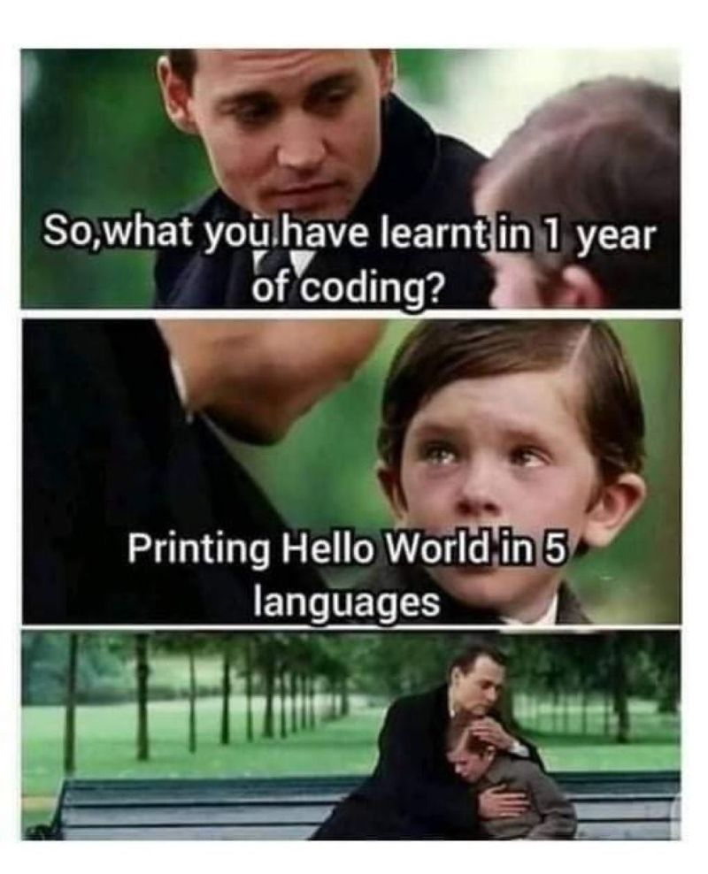

### Practice

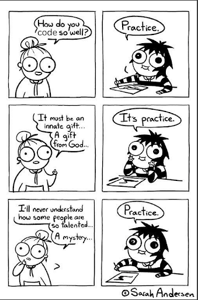

### Documentation

The importance of documentation:

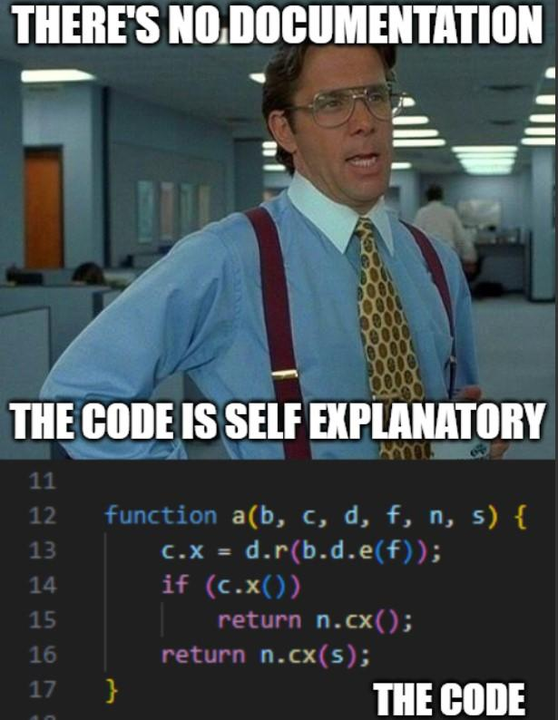

### Run It Again

Every one of you engineers has done this…

Don’t pretend you haven’t !!

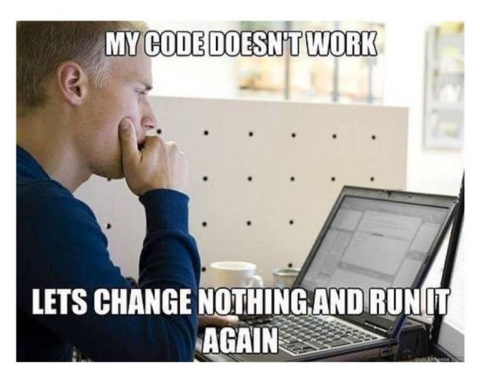

### Like Coding, Good at Math

Not any more 😭

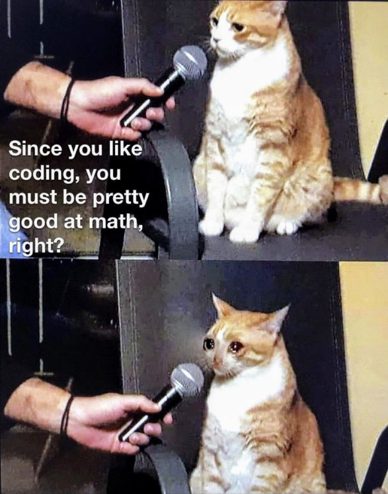

### Software Development Process

How many times have you tech bros questioned your life choices?

Be honest now…

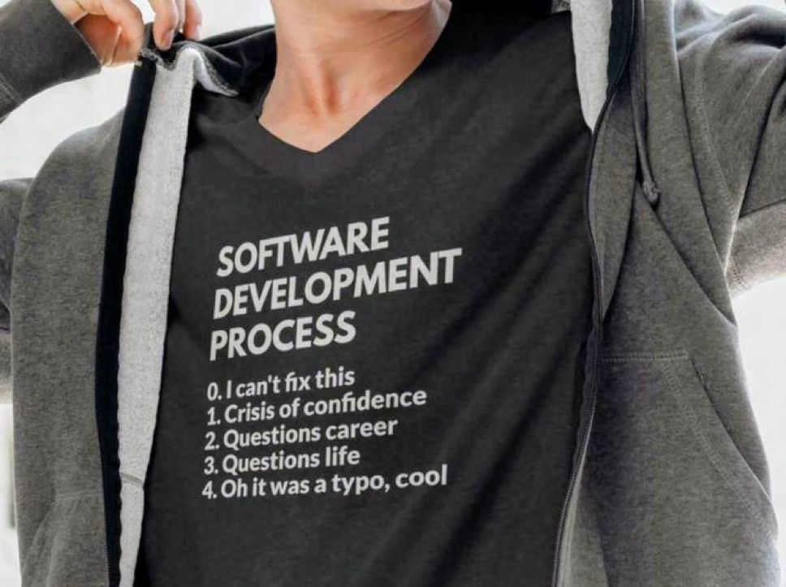

### Are You Really Sure You Want to be a Software Developer??

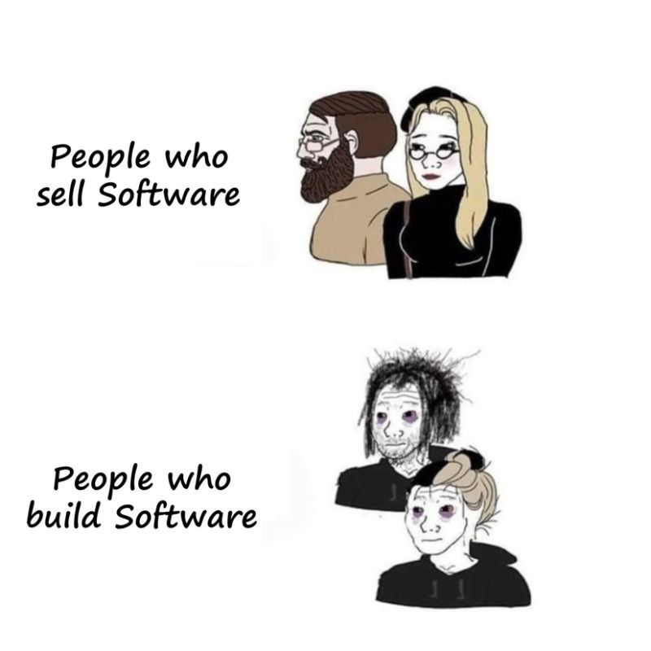

### Coding with GPT

Watch out for that quality and not knowing WTF you're doing!

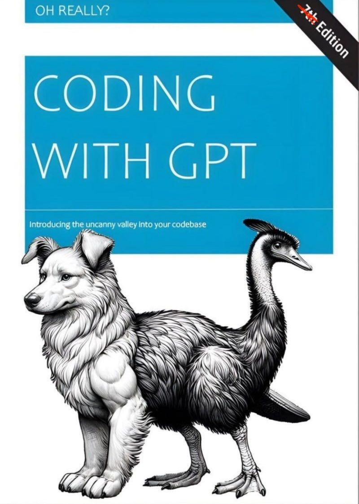

### Senior Devs Fixing Bugs in Production


### Theory vs Practice

I suspect this is only when recruiters try programming... :wink:

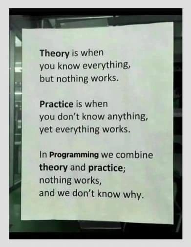

### Concurrent Programming

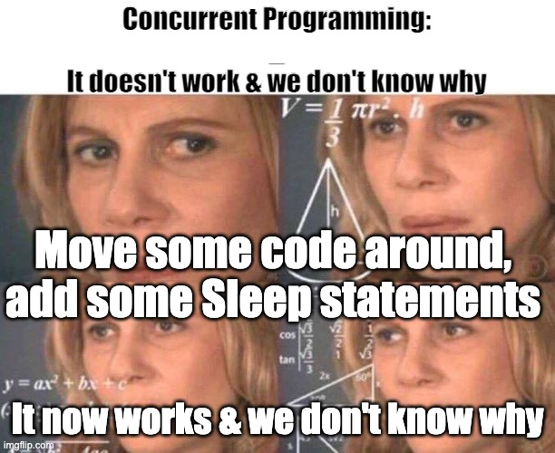

### Meme Driven Development

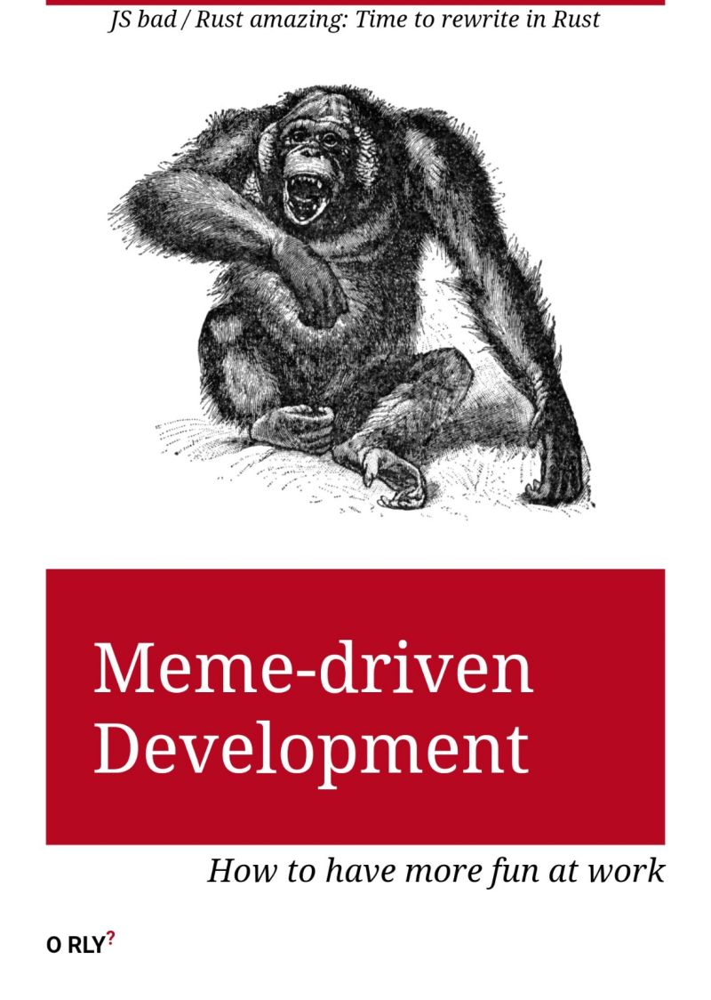

### OverEngineering Simple Solutions

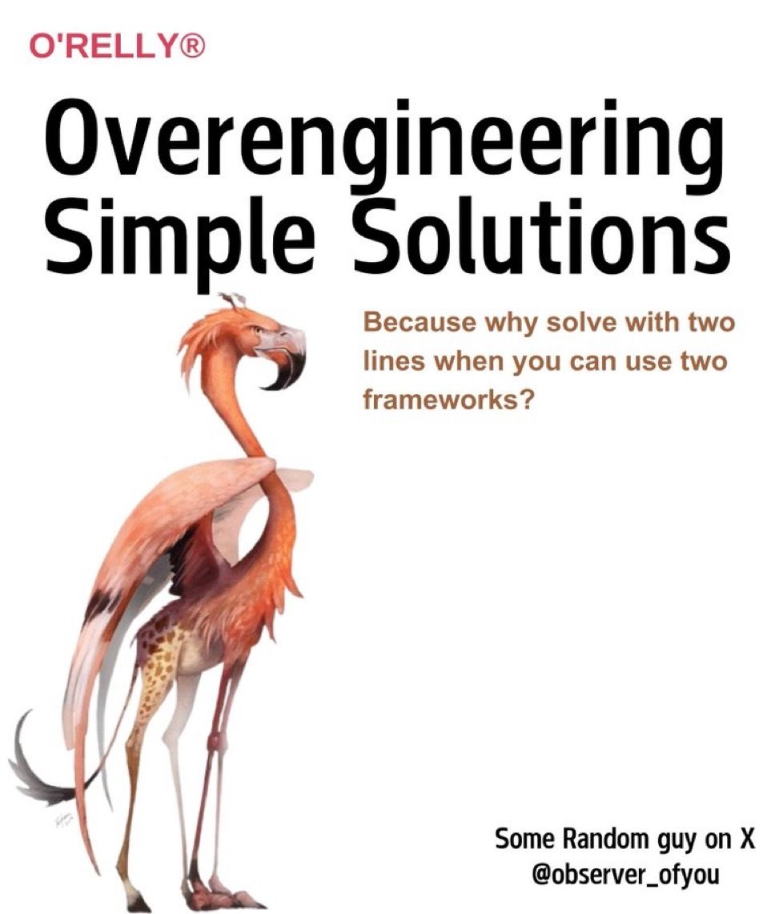

### Hating on Languages You Don't Use

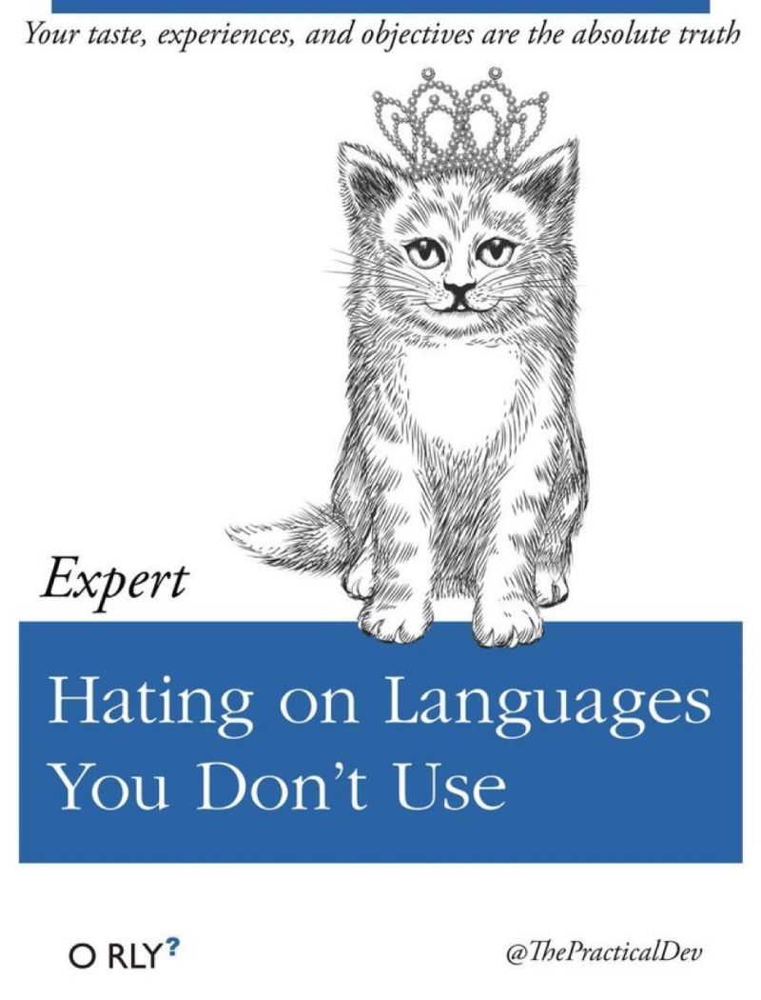

### H8 PHP Range Rover

Hate PHP... but PHP paid for the Range Rover...


### C++ for Python Developers


### Hell is Debugging Other People's Code

Or even your own code from a while ago if you haven't written it carefully and commented any fancy tricks
(avoid using fancy tricks).

This is at best janitorial work.

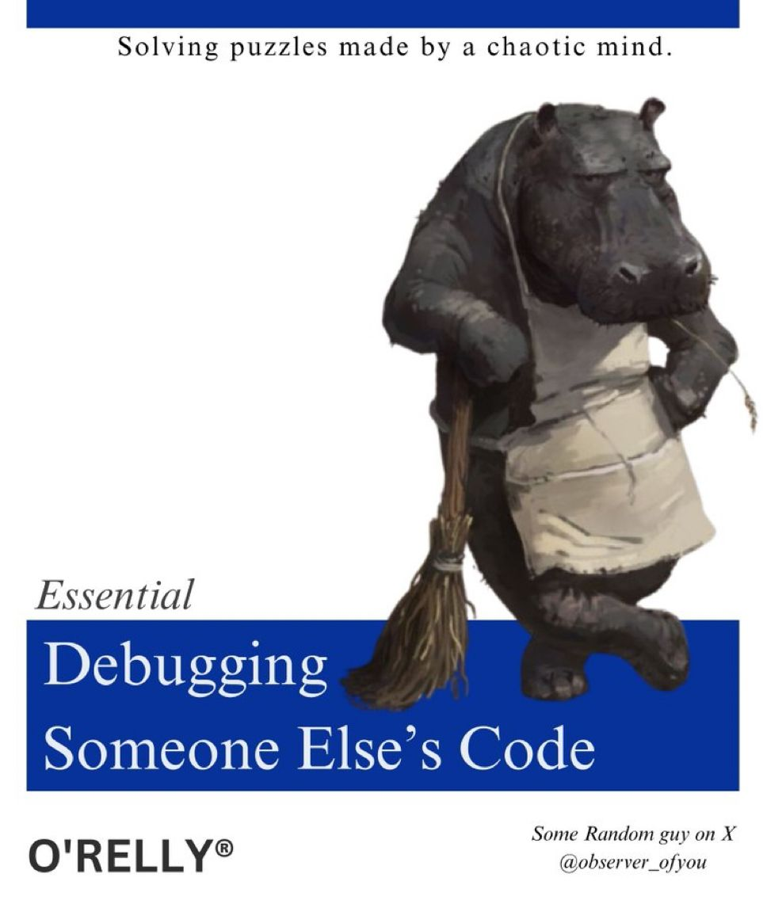

### Developers at Beginning vs End of of Project


**Ported from various private Knowledge Base pages 2008+**
