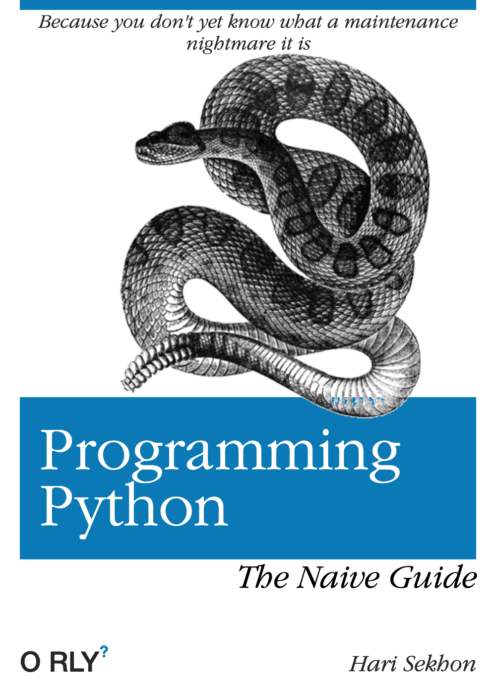

# Python

NOT FULLY PORTED YET.

Python is a popular and easy to use general purpose programming language that is heavily used in Data Analytics and
Data Science as well as systems administration.

It's not as amazing for one-liners as [Perl](perl.md) is though, which can boost [shell scripts](shell.md) more easily.

<!-- INDEX_START -->

- [Core Reading](#core-reading)
- [DevOps Python  tools](#devops-python--tools)
- [Shell scripts with Python](#shell-scripts-with-python)
- [Nagios Plugins in Python](#nagios-plugins-in-python)
- [Python Library with Unit Tests](#python-library-with-unit-tests)
- [Python HTTP Server](#python-http-server)
- [VirtualEnv](#virtualenv)
- [Pipenv](#pipenv)
- [Poetry](#poetry)
- [Jupyter Notebook](#jupyter-notebook)
- [Libraries](#libraries)
  - [General](#general)
  - [Web](#web)
  - [Databases](#databases)
  - [Cloud](#cloud)
  - [CI/CD & Linting](#cicd--linting)
  - [Unit Testing](#unit-testing)
  - [Virtualization & Containerization](#virtualization--containerization)
  - [Pub/Sub](#pubsub)
  - [Big Data & NoSQL](#big-data--nosql)
  - [Data Formats & Analysis](#data-formats--analysis)
  - [Data Visualization](#data-visualization)
- [Jython](#jython)
  - [Install](#install)
  - [Run](#run)
  - [Code](#code)
- [Python Hosting Sites](#python-hosting-sites)
  - [Hosted Python WebApps](#hosted-python-webapps)
  - [Hosted Jupyter Notebooks](#hosted-jupyter-notebooks)
  - [Other Hosted Python](#other-hosted-python)
- [Troubleshooting](#troubleshooting)
  - [Python Fault Handler](#python-fault-handler)
    - [Enable Python Fault Handler](#enable-python-fault-handler)
  - [Alpine `ModuleNotFoundError: No module named 'pip._vendor.six.moves'`](#alpine-modulenotfounderror-no-module-named-pip_vendorsixmoves)
  - [Small vs Big Integers - is vs ==](#small-vs-big-integers---is-vs-)
- [Meme](#meme)
  - [Programming Python](#programming-python)
  - [Porting Your Language to the JVM](#porting-your-language-to-the-jvm)
  - [ChatGPT Python - What I Expected vs What I Got](#chatgpt-python---what-i-expected-vs-what-i-got)
  - [Imported Package Tariffs](#imported-package-tariffs)
  - [Friend Showing C++ Code](#friend-showing-c-code)
  - [Lines of Code vs Understanding Methods](#lines-of-code-vs-understanding-methods)

<!-- INDEX_END -->

## Core Reading

[Learning Python](https://www.amazon.com/Learning-Python-5th-Mark-Lutz/dp/1449355730/)

## DevOps Python  tools

[HariSekhon/DevOps-Python-tools](https://github.com/HariSekhon/DevOps-Python-tools)

[](https://github.com/HariSekhon/DevOps-Python-tools)

## Shell scripts with Python

Shell scripts using Python and making it easier to install Python pip libraries from PyPI.

[HariSekhon/DevOps-Bash-tools](https://github.com/HariSekhon/DevOps-Bash-tools)

[](https://github.com/HariSekhon/DevOps-Bash-tools)

## Nagios Plugins in Python

[HariSekhon/Nagios-Plugins](https://github.com/HariSekhon/Nagios-Plugins)

[](https://github.com/HariSekhon/Nagios-Plugins)

## Python Library with Unit Tests

[HariSekhon/pylib](https://github.com/HariSekhon/pylib)

## Python HTTP Server

When you need a quick HTTP server to serve out local files at:

<http://$HOSTNAME:8000/>

```shell
python -m SimpleHTTPServer
```

This is useful for temporary file sharing for things like making automated installer configurations available, such as
for [Redhat](redhat.md) Kickstart, [Debian](debian.md) Preseeding or [Ubuntu](ubuntu.md) Autoinstall.

## VirtualEnv

Creates a virtual environment in the local given sub-directory in which to install PyPI modules to avoid clashes with system python libraries.

```shell
virtualenv "$directory_name_to_create"
```

I like top always the directory name `venv` for the virtualenv:

```shell
virtualenv venv
```

Then to use it before you starting `pip` installing:

```shell
source venv/bin/activate
```

This prepends to `$PATH` to use the `bin/python` and `lib/python-3.12/site-packages` under the local `venv` directory:

Now install PyPI modules as usual.

The `venv/pyvenv.cfg` file will contain some metadata like this:

```properties
home = /opt/homebrew/Cellar/python@3.12/3.12.3/bin
implementation = CPython
version_info = 3.12.3.final.0
virtualenv = 20.25.3
include-system-site-packages = false
base-prefix = /opt/homebrew/Cellar/python@3.12/3.12.3/Frameworks/Python.framework/Versions/3.12
base-exec-prefix = /opt/homebrew/Cellar/python@3.12/3.12.3/Frameworks/Python.framework/Versions/3.12
base-executable = /opt/homebrew/Cellar/python@3.12/3.12.3/Frameworks/Python.framework/Versions/3.12/bin/python3.12
```

## Pipenv

<https://pipenv.pypa.io/en/latest/>

[:octocat: pypa/pipenv](https://github.com/pypa/pipenv)

Combines Pip and VirtualEnv into one command.

```shell
brew install pipenv
```

Creates a `Pipfile` and `Pipfile.lock`,
plus a virtualenv in a standard location `$HOME/.local/share/virtualenvs/` if not already inside one.

```shell
pipenv install
```

Activates the virtualenv

```shell
pipenv shell
```

Automatically converts a `requirements.txt` file into a `Pipfile`:

```shell
pipenv check
```

Dependency graph:

```shell
pipenv graph
```

## Poetry

[:octocat: python-poetry/poetry](https://github.com/python-poetry/poetry)

Replaces `pip` `requirements.txt` for PyPI library management with a simple `pyproject.yaml`:

Writes a lockfile to save versions like `npm` and `go mod` do.

## Jupyter Notebook

(formerly called IPython Notebook)

<https://ipython.org/notebook.html>

Interactive web page where you can mix code blocks, rich notes and graphs on the same page, click to execute code blocks
and form a page oriented workflow of results and analysis for sharing and demonstrating.

## Libraries

You can search for libraries at [pypi.org](https://pypi.org/).

Some libraries you may find useful are below.

You can see most of these used throughout my GitHub repos, eg:

- [HariSekhon/DevOps-Python-tools](https://github.com/HariSekhon/DevOps-Python-tools)
- [HariSekhon/Nagios-Plugins](https://github.com/HariSekhon/Nagios-Plugins)
- [HariSekhon/DevOps-Bash-tools](https://github.com/HariSekhon/DevOps-Bash-tools)
- [HariSekhon/pylib](https://github.com/HariSekhon/pylib)

### General

- `GitPython` - [Git](git.md)
- `sh` - execute shell commands more easily
- `jinja2` - [Jinja2](https://jinja.palletsprojects.com) templating
- `humanize` - converts units to human readable
- `pyobjc-framework-Quartz` - control Mac UI
- `psutil`
- `PyInstaller` - bundle Python code into standalone executablers (doesn't work for advanced code)
- `sasl`

### Web

- `requests` - easy HTTP request library
- `beautifulsoup4` - HTML parsing library
- [Scrapy](https://scrapy.org/) - web scraping
- [pycookiecheat](https://github.com/n8henrie/pycookiecheat) - use or extract cookies from your browser's cookie jar to
  query websites directly or using curl
- `selenium` - Selenium web testing framework

### Databases

- `mysqlclient` - [MySQL](mysql.md) client
- `psycopg2` - [PostgreSQL](postgres.md)
- `psycopg2-binary`

### Cloud

- `boto3` - [AWS](aws.md)
- `aws-consoler`

### CI/CD & Linting

- `python-jenkins` - [Jenkins](jenkins.md)
- `TravisPy` - for [Travis CI](travis.md)
- `pylint` - Python linting CLI tool
- `grip` - [Grip](https://github.com/joeyespo/grip) renders local markdown using a local webserver
- `Markdown`
- `MarkupSafe`
- `checkov`
- `semgrep` - security / misconfiguration scanning
- `jsonlint`
- `yamllint` - CLI [YAML](yaml.md) linting tool

### Unit Testing

- `unittest2`
- `nose`
- [Faker](https://github.com/joke2k/faker) - generate fake but realistic data for unit testing, Python version of the
  original [Perl](https://metacpan.org/dist/Data-Faker) library,
  comes with a `faker` command convenient for shell scripts:

Generate 10 fake addresses:

```shell
faker -r 10 address
```

### Virtualization & Containerization

- `docker` - control local [Docker](docker.md)
- `kubernetes` - [Kubernetes](kubernetes.md)
- `pyvmomi` - VMware

### Pub/Sub

- `kafka-python` - [Kafka](kafka.md)
- `pika` - [RabbitMQ](rabbitmq.md)

### Big Data & NoSQL

- `elasticsearch` - [Elasticsearch](elasticsearch.md)
- `happybase` - [HBase](hbase.md)
- `impyla` - [Impala](impala.md)
- `kazoo` - [ZooKeeper](zookeeper.md)
- `PyHive` - for Apache [Hive](hive.md)
- `python-krbV` - [Kerberos](kerberos.md) support, often pulled as a dependency for `snakebite[kerberos]`
- `snakebite` - [HDFS](hdfs.md)

### Data Formats & Analysis

- `avro` - [Avro](avro.md)
- `ldif3` - LDAP LDIF format
- `jsonlint`
- `Markdown`
- `MarkupSafe`
- `numpy` - [NumPy](https://numpy.org/) for scientific numeric processing
- `pandas` - [Pandas](https://pandas.pydata.org/) for data analysis
- `python-cson`
- `pyarrow` - Apache Arrow and Parquet support, but Parquet support in this is weak, prefer
              [Parquet Tools](parquet.md#parquet-tools)
- `python-ldap`
- `python-snappy` - work with Snappy compression format, often pulled as a dependency
- `PyYAML` - work with [YAML](yaml.md) files in Python
- `sciki-learn` - [SciKit Learn](https://scikit-learn.org/stable/)
- `toml`
- `xmltodict`
- `yamllint` - CLI [YAML](yaml.md) linting tool

<!-- -->

- [Faker](https://github.com/joke2k/faker) - generate fake but realistic data for unit testing, Python version of the
  original [Perl](https://metacpan.org/dist/Data-Faker) library,
  comes with a `faker` command convenient for shell scripts:

Generate 10 fake addresses:

```shell
faker -r 10 address
```

### Data Visualization

- `matplotlib` - General-purpose plotting, highly customizable
- `seaborn` - built on `matplotlib`, higher level to make it easier to great aesthetic visualizations
- `plotly` - Interactive graphs, dashboards, 3D plots
- `bokeh` - Interactive, web-ready visualizations
- `pandas` - Quick and easy plots directly from dataframes
- `networkx` - Graph theory, network analysis
- `altair` - Declarative statistical visualizations
- `pygal` - Vector (SVG) visualizations, interactive
- `graph-tool` - Scalable and efficient for large graph analysis

## Jython

<https://www.jython.org/>

Python on the [Java JVM](java.md).

The ease of Python coding with full access to Java APIs and libraries.

Useful when there aren't Python libraries available or they aren't as fully featured as the Java versions
(eg. for [Hadoop](hadoop.md)).

Today, I'd prefer to write in the native JVM language [Groovy](groovy.md).

### Install

From [DevOps-Python-tools](devops-python-tools.md):

```python
jython_install.sh
```

### Run

Interactive REPL:

```python
$ jython
Jython 2.7.3 (tags/v2.7.3:5f29801fe, Sep 10 2022, 18:52:49)
[OpenJDK 64-Bit Server VM (Eclipse Adoptium)] on java17.0.1
Type "help", "copyright", "credits" or "license" for more information.
>>>
```

Run a Jython script and add Java classpath to find any jar dependencies that the script uses:

```python
jython -J-cp "$CLASSPATH" "file.py"
```

### Code

Some Jython programs, such as those using [Hadoop](hadoop.md) [HDFS](hdfs.md) Java API can be found in the
[DevOps-Python-tools](devops-python) repo.

## Python Hosting Sites

### Hosted Python WebApps

- [Heroku](https://www.heroku.com/python/)
- [Vercel](https://vercel.com/)
- [Render](https://render.com/)
- [PythonAnywhere](https://www.pythonanywhere.com/) - fully hosted Python apps / webapps with a
  `<username>.pythonanywhere.com` domain and long list of libraries pre-installed
  [batteries included](https://www.pythonanywhere.com/batteries_included/)

### Hosted Jupyter Notebooks

- [Google Collab](https://colab.research.google.com/) - Jupyter Notebooks in the cloud with free access to GPUs
- [Binder](https://mybinder.org/) - run Jupyter Notebooks from GitHub repos

### Other Hosted Python

- [Replit](https://replit.com/) - cloud-base IDE with AI to generate code from ideas
- [Glitch](https://glitch.com/) - good for prototyping small webapps
- [fly.io](https://fly.io/) - code execution sandbox, runs any Docker image
- [Code Ocean](https://codeocean.com/) - for scientific bioinformatics and R&D

## Troubleshooting

### Python Fault Handler

Prints stack trace on crash.

Useful for debugging native-level crashes, C extensions, system calls, OS signals.

Activates handling of signals like:

| Signal     | Description              |
|------------|--------------------------|
| `SIGSEGV`  | Segmentation fault       |
| `SIGFPE`   | Floating-point exception |
| `SIGBUS`   | Bus error                |
| `SIGABRT`  | Abort signal             |
| `SIGILL`   | Illegal instruction      |

Normally, these signals cause Python to crash without much useful information,
but with the fault handler enabled, it'll output a traceback before the crash to help debug.

Minimal performance overhead, but bigger logs, and possibly dumps sensitive info.

#### Enable Python Fault Handler

```shell
export PYTHONFAULTHANDLER=1
```

or

```shell
python -X faulthandler "file.py"
```

or

```python
import faulthandler
faulthandler.enable()
```

### Alpine `ModuleNotFoundError: No module named 'pip._vendor.six.moves'`

```shell
ModuleNotFoundError: No module named 'pip._vendor.six.moves'
```

Fix:

```shell
apk del py3-pip py-pip
apk add py3-pip
```

### Small vs Big Integers - is vs ==

Consider:

```python
> a = 10
> b = 10
> a is b
False
```

```python
> a = 500
> b = 500
> a is b
True
```

This is due to caching small integer objects but not integers over 256.

This is rarely an issue in practice though since the `==` comparison operator works as expected and most people will
only use that.

Instead, people should try to maintain open source Python over a decade of bloody code changes and trying to keep it working in
different CI/CD systems to try to retain portability across different environments...

Python maintainability makes Java Null Pointer Exceptions look like the cheap “billion dollar mistake”.

## Meme

### Programming Python



### Porting Your Language to the JVM

I wish I had discovered [Groovy](groovy.md) before [Jython](#jython)...


### ChatGPT Python - What I Expected vs What I Got


### Imported Package Tariffs


### Friend Showing C++ Code


### Lines of Code vs Understanding Methods


**Partial port from private Knowledge Base page 2008+**
