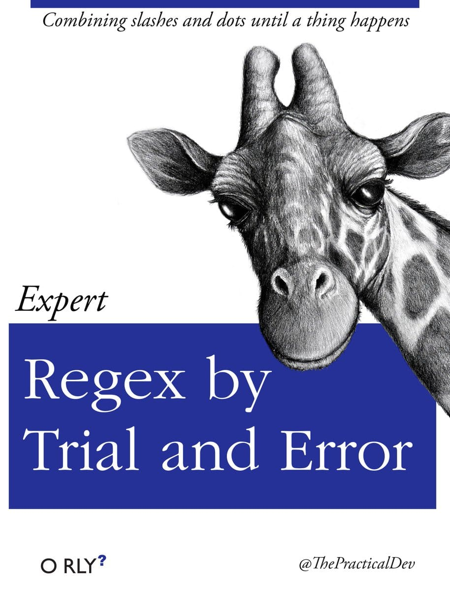

# Regex

Regular expressions are a core skill for any half decent programmer.

There is a saying:

> _"The plural of regex is regrets"_

But it would be more accurate to say:

> _"Not learning regex properly leads to regrets"_

One regex, many regex... on [my GitHub](https://github.com/HariSekhon).

I use them extensively in languages from Python and Perl to Java/Scala/Groovy and even in many shell scripts in Bash
for grep, sed & awk.

<!-- INDEX_START -->

- [Online Regex Testing](#online-regex-testing)
  - [Sed Regex Testing](#sed-regex-testing)
- [PCRE vs BRE vs ERE](#pcre-vs-bre-vs-ere)
  - [PCRE - Perl Compatible Regular Expressions](#pcre---perl-compatible-regular-expressions)
- [BRE - Basic Regular Expression](#bre---basic-regular-expression)
- [ERE - Extended Regular Expressions](#ere---extended-regular-expressions)
- [Core Reading](#core-reading)
- [Library of Regex in Perl](#library-of-regex-in-perl)
- [Library of Regex in Python](#library-of-regex-in-python)
- [Library of Regex in Bash](#library-of-regex-in-bash)
- [Examples of Real-world Regex Used Extensively](#examples-of-real-world-regex-used-extensively)
- [Meme](#meme)
  - [Googling for the Regex](#googling-for-the-regex)
  - [Expert Regex](#expert-regex)

<!-- INDEX_END -->

## Online Regex Testing

<https://regex101.com/>

<https://regexr.com/>

### Sed Regex Testing

Test your sed regex here:

<https://sed.js.org/>

## PCRE vs BRE vs ERE

### PCRE - Perl Compatible Regular Expressions

The gold standard from [Perl](perl.md) which most popular languages aspire to

GNU grep has a `grep -P` switch to use PCRE but beware it's not portable. It won't work on BSD based systems like macOS.

On Mac you can install coreutils to get the better GNU Grep

```shell
brew install coreutils
```

but then you'll have to use the `ggrep` command instead.

Your shell scripts will have to figure our if they're on Mac and override the grep command (examples in
[DevOps-Bash-tools](https://github.com/HariSekhon/DevOps-Bash-tools) repo).

## BRE - Basic Regular Expression

This is the neutered regex that old grep uses.

## ERE - Extended Regular Expressions

Slightly better than BRE but still weak & awkward compared to PCRE.

Don't support back references.

Grep on most systems can support EREs via the `grep -E` switch.

Awk also uses EREs.

## Core Reading

[Master Regular Expressions](https://www.amazon.com/Mastering-Regular-Expressions-Jeffrey-Friedl/dp/0596528124/)

## Library of Regex in Perl

PCRE regex:

[HariSekhon/lib](https://github.com/HariSekhon/lib)

## Library of Regex in Python

PCRE regex:

[HariSekhon/pylib](https://github.com/HariSekhon/pylib)

## Library of Regex in Bash

BRE / ERE Regex:

[HariSekhon/DevOps-Bash-tools](https://github.com/HariSekhon/DevOps-Bash-tools)

## Examples of Real-world Regex Used Extensively

PCRE regex - see especially anonymize.py / anonymize.pl in these repos among many other scripts:

[HariSekhon/DevOps-Python-tools](https://github.com/HariSekhon/DevOps-Python-tools)

[HariSekhon/DevOps-Perl-tools](https://github.com/HariSekhon/DevOps-Perl-tools)

[HariSekhon/Nagios-Plugins](https://github.com/HariSekhon/Nagios-Plugins)

[](https://github.com/HariSekhon/DevOps-Python-tools)

[](https://github.com/HariSekhon/DevOps-Perl-tools)

[](https://github.com/HariSekhon/Nagios-Plugins)

## Meme

### Googling for the Regex


### Expert Regex


