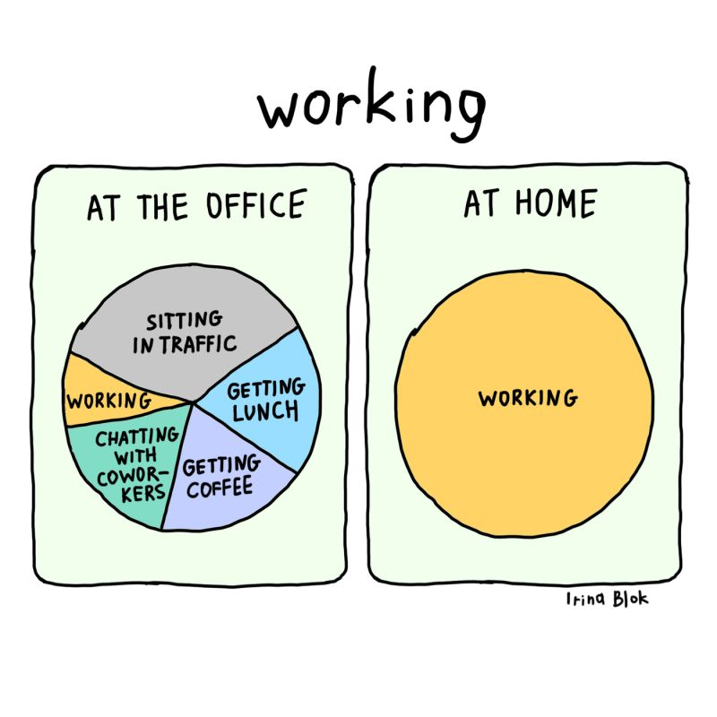
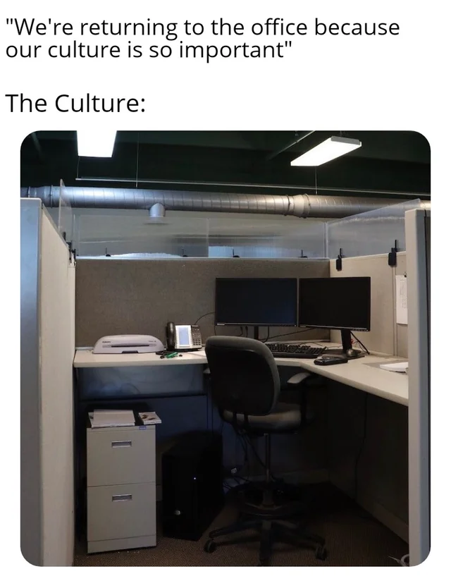
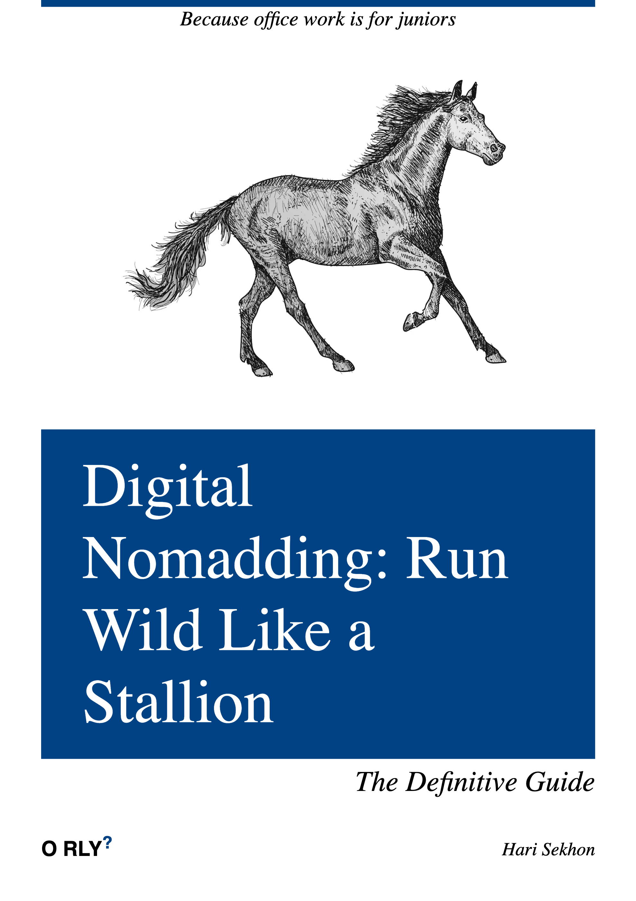
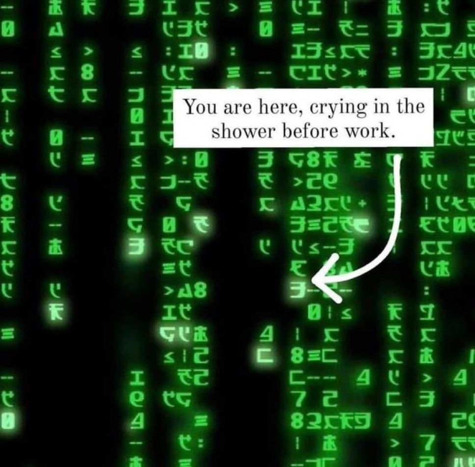
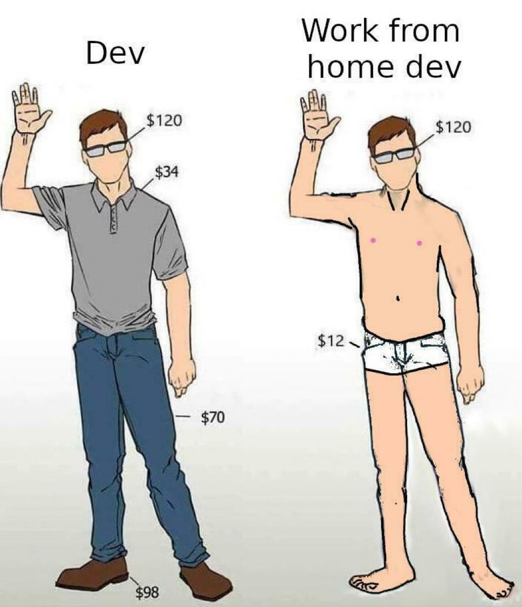

# Remote Working & Digital Nomad

<!-- INDEX_START -->

- [Travel](#travel)
- [Freelance](#freelance)
- [Remote Jobs](#remote-jobs)
- [Digital Nomad](#digital-nomad)
- [Offshore Payroll is Super Easy](#offshore-payroll-is-super-easy)
- [Offshore Contractual Terms](#offshore-contractual-terms)
- [Avoid Taxes Legally](#avoid-taxes-legally)
- [Overseas Companies](#overseas-companies)
  - [No UK Ltds - Boycott This](#no-uk-ltds---boycott-this)
  - [US LLC](#us-llc)
    - [US Bank Account](#us-bank-account)
  - [Hong Kong](#hong-kong)
  - [Singapore](#singapore)
  - [Dubai](#dubai)
- [Meme](#meme)
  - [Work from Home](#work-from-home)
  - [Working at Office vs Home](#working-at-office-vs-home)
  - [Office Culture](#office-culture)
  - [Digital Nomadding - Run Wild Like a Stallion](#digital-nomadding---run-wild-like-a-stallion)
  - [Matrix - You Are Here](#matrix---you-are-here)
  - [Build A Life You Don't Need a Vacation From](#build-a-life-you-dont-need-a-vacation-from)
  - [Dev vs Dev Working From Home](#dev-vs-dev-working-from-home)
  - [Careers today are a walk in the park...](#careers-today-are-a-walk-in-the-park)

<!-- INDEX_END -->

## Travel

See the extensive [Travel Page](travel.md) for country and city specific information and general booking and travel
tips.

## Freelance

- [TopTal](https://www.toptal.com/) - preferred over UpWork, no time tracker, better rates
- [UpWork](https://www.upwork.com/)

## Remote Jobs

- [WeWorkRemotely](https://weworkremotely.com/)
- [Remote.co](https://remote.co/)
- [EuroTopTechJobs](https://www.eurotoptechjobs.com/)

Not Remote, but this might help:

- [MobiusAI](https://www.mobiusengine.ai/)

## Digital Nomad

A person who works 100% Remote from any location they like,
such as tropical beaches or back home with their family roots.

## Offshore Payroll is Super Easy

There's no excuse for a company to not hire someone in another country
or who lives as a Digital Nomad today
since contracts and payments are now simplified and automated via companies such as:

- [Deel](https://www.deel.com/)
- [Skuad](https://www.skuad.io/)
- [Wellwork Global](https://workwell-global.com/)

This is the same as every other B2B payment a company has to make to be able to exist
and every legacy 20th century company's accounting department can handle this.

If it's a 21st century company such as a startup, they could also just pay you via crypto.

## Offshore Compliance

Companies can choose whatever contract they want, including claiming their preferred legal jurisdiction (you see this in
English law contracts).

Law can be applied internationally -
one hedge fund I worked for had an employee who quit without returning his laptop arrested at an airport in China and
imprisoned for 4 years.

So compliance, contracts and enforcement are no excuses either.

## Avoid Taxes Legally

**Do not pay taxes to legacy high tax Western democracies with their failing social contract.**

You get little to nothing back for your losses.

💥Bombshell💥: Western countries are failing because of Democracy.

Half the adult voter base doesn't even pay income tax but votes to heavily tax
& exploit you to transfer the benefits to themselves -
this has eviscerated the productive working and middle classes at both economic and demographic levels in the West.

Don't believe me? Read this article and see the widespread UK decline across the country in pictures, despite record
high taxes since WWII:

[The UK Decline — What I Learnt on my UK Tour 2024](https://medium.com/@harisekhon/the-uk-decline-what-i-learnt-from-my-uk-tour-2024-84347efced9b)

Feminist-socialist voting majority democracy clearly doesn't work.
It would need to switch to TaxPayer Suffrage for the West to not die slowly.

So until the inevitable collapse / replacement / revolution in the West...
structure your life and finances to not pay taxes to countries that are democratically corrupted, failing and
exploiting you:

[Tax Advice for Emigrating or going Digital Nomad](https://medium.com/@harisekhon/tax-advice-for-emigrating-or-going-digital-nomad-c100fba461ed)

[How Do I Follow You to Emigrate and Escape the UK Decline?](https://medium.com/@harisekhon/how-do-i-follow-you-to-emigrate-and-escape-from-the-uk-decline-bff1ca8996d5)

## Overseas Companies

### No UK Ltds - Boycott This

**Do not run a UK Ltd (Limited Company).**

It is a waste of taxes (see [Avoid Taxes Legally](#avoid-taxes-legally) section above for why).

UK corporation tax is currently an internationally uncompetitive 25% at time of writing as of 2024-2025.

(The 19-25% sliding tax scale merely complicates it and doesn't save you much in practice)

To make matters even worse the UK government exposes retained capital / assets on
Companies House public website with no paywall such that anybody on the internet can search your name & business and
then choose to attack you legally for money they didn't earn and have no right to (eg.
vexatious litigants such as unscrupulous bitter exes or patent trolls).

Additionally,
money left in UK bank accounts can be seized by various government authorities or any judge in any case from any
vexatious litigant above.

The UK legal system is not safe, similar to many dying Western democracies which all have that same universal suffrage
democratic disease.

### US LLC

0% tax as a Non-Resident LLC as long as you don't hire anybody in the US, don't live in the US, and don't have a business address in the US.

Profits are paid out and taxes are handled in the resident country.

WARNING: UAE has 0% personal tax, but watch out you may become liable for the new 9% UAE corporate tax now.

US LLC is useful to get access to US banking for things like selling online courses.
Charging from a foreign company such as in UAE may result in a bunch of declined card payments (eg.
from [Stripe](https://stripe.com/)), leading to sales attrition and loss of conversions.
People will also feel more comfortable buying from a US company than some random overseas company.

- [Doola](https://www.doola.com/)

#### US Bank Account

- [Mercury](https://mercury.com/r/internet-made-coder-llc) - technically not a bank, but rather a fintech company.
  WARNING: Mercury uses partner banks, who de-risked causing thousands of client accounts being closed.

[Offshore Banking Advice Video](https://www.youtube.com/watch?v=IAZ1SOUi0HQ)

### Hong Kong

0% tax

### Singapore

TODO

### Dubai

9% corporation tax now unfortunately.

## Meme

### Work from Home

### Working at Office vs Home

### Office Culture

### Digital Nomadding - Run Wild Like a Stallion

### Matrix - You Are Here

If you keep paying ~50% tax and the rest on cost of living...

…then of course you’re going to stay trapped in the Matrix.

### Build A Life You Don't Need a Vacation From

### Dev vs Dev Working From Home

You guys bother wearing your glasses and trunks when working from home? 😂

### Careers today are a walk in the park...

