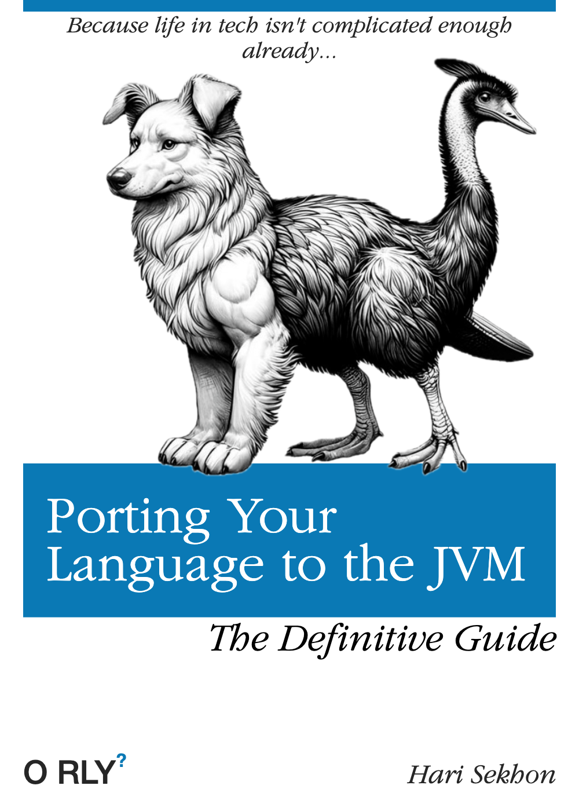

# Ruby

<https://www.ruby-lang.org/en/>

Dynamically typed open-source programming language known for its simplicity, flexibility, and focus on developer
happiness.

Not my main language but it's an easy language to pick up so I've written a few bits and pieces over the years
eg. [check_puppet.rb](https://github.com/HariSekhon/Nagios-Plugins/blob/master/check_puppet.rb).

<!-- INDEX_START -->

- [Popularity Over the Years](#popularity-over-the-years)
- [Poignant Guide to Ruby](#poignant-guide-to-ruby)
- [IRB](#irb)
  - [JIRB](#jirb)
- [Gem](#gem)
  - [Install Gems](#install-gems)
  - [Interesting Gems](#interesting-gems)
  - [List Installed Gems](#list-installed-gems)
  - [Install from Custom Gem Server](#install-from-custom-gem-server)
- [rbenv](#rbenv)
  - [rbenv install](#rbenv-install)
  - [rbenv install ruby versions](#rbenv-install-ruby-versions)
  - [rbenv local](#rbenv-local)
  - [rbenv global](#rbenv-global)
  - [rbenv shell](#rbenv-shell)
  - [rbenv gem](#rbenv-gem)
- [RVM - Ruby Version Manager](#rvm---ruby-version-manager)
  - [RVM Install](#rvm-install)
  - [RVM Usage](#rvm-usage)
- [Code](#code)
- [Linting](#linting)
  - [Rubocop](#rubocop)
- [JRuby](#jruby)
  - [Rubinius](#rubinius)
  - [Ludicrous](#ludicrous)
- [Ruby IDEs](#ruby-ides)
  - [RubyMine](#rubymine)
  - [Alternatives](#alternatives)
- [Meme](#meme)
  - [Porting Your Language to the JVM](#porting-your-language-to-the-jvm)

<!-- INDEX_END -->

## Popularity Over the Years

IMO was at peak popularity in the late 2000s when [Puppet](puppet.md) was the big thing
(Puppet was written in Ruby) and was the first widely used configuration language
([CFengine](https://cfengine.com/) wasn't as widely used).

Update: a quick Google found [this article](https://berk.es/2022/03/08/the-waning-of-ruby-and-rails/)
showing Ruby actually peaked in the mid 2000s rather than the late 2000s.
I probably should have made more notes here at that time...

## Poignant Guide to Ruby

A popular source for learning Ruby.

<https://poignant.guide/book/>

<http://www.rubyinside.com/media/poignant-guide.pdf>

## IRB

Interactive Ruby interpreter.

(if you need to install the `irb` Gem see next section)

Start the `irb` interactive ruby interpreter:

```shell
irb
```

### JIRB

JRuby interactive Ruby interpreter.

Start the `jirb` interactive ruby interpreter:

```shell
jirb
```

GUI irb using swing:

```shell
jruby -S jirb_swing
```

```ruby
java_import java.lang.System
version = System.getProperties["java.runtime.version"]
```

## Gem

### Install Gems

```shell
gem install "$name"
```

Install the `mdl` gem for markdown linting (used heavily to check the docs in this repo):

```shell
gem install mdl
```

Run `mdl` to check an `.md` file:

```shell
mdl README.md
```

### Interesting Gems

- `dotenv` - load `.env` or `.envrc` files
- `irb` - Interactive Ruby interpreter
- `mdl` - Markdown lint
- `lolcat` - turns text into rainbow colours
- `gitlab` - GitLab CLI
- `fastlane` - see [Fastlane](fastlane.md) doc
- `jgrep`
- `httparty`
- `gist`
- `kramdown`

### List Installed Gems

```shell
gem list
```

Configure `gem` command to install gems to user writable `$HOME/.gem/ruby/<version>/gems/` directory:

In `$HOME/.gemrc`:

```text
gem: --user-install
```

`gem install` then installs to `~/.gem/ruby/<version>/gems`.

Then make sure to add `$HOME/.gem/ruby/<version>/bin` to `$PATH` environment to be able to run commands installed by
gems:

```shell
gem env
```

Runs server on <http://localhost:8808> to show installed gems:

```shell
gem server
```

```shell
gem install ruby-debug
```

```shell
gem install cheat
```

### Install from Custom Gem Server

```shell
gem install --source http://server
```

## rbenv

[:octocat: rbenv/rbenv](https://github.com/rbenv/rbenv)

[:octocat: rbenv/ruby-build](https://github.com/rbenv/ruby-build)

### rbenv install

Installs to `~/rbenv` (`RBENV_ROOT`):

```shell
brew install rbenv
```

Adds to `~/.bash_profile`:

```shell
rbenv init
```

Open a new login shell:

```shell
bash -l
```

or source:

```shell
source ~/.bash_profile
```

### rbenv install ruby versions

List installed ruby versions:

```shell
rbenv versions
```

```text
* system
```

List latest stable versions:

```shell
rbenv install -l
```

List all local versions:

```shell
rbenv install -L
```

Install a Ruby version:

```shell
rbenv install 3.4.1
```

### rbenv local

Set the local Ruby version for this directory (creates a `.ruby-version` file):

```shell
rbenv local 3.4.1
```

Show the local configured version:

```shell
rbenv local
```

Undo the local ruby setting:

```shell
rbenv local --unset
```

### rbenv global

Set the global ruby version by setting `~/.rbenv/version`:

```shell
rbenv global 3.4.1
```

### rbenv shell

Set the Ruby version in the local shell only with environment variable `RBENV_VERSION`:

```shell
rbenv shell 3.4.1
```

```shell
which irb
```

```text
/Users/hari/.rbenv/shims/irb
```

```shell
rbenv which irb
```

```text
/Users/hari/.rbenv/versions/3.4.1/bin/irb
```

### rbenv gem

Check your gem is using the rbenv ruby version:

```shell
gem env home
```

```text
/Users/hari/.rbenv/versions/3.4.1/lib/ruby/gems/3.4.0
```

```shell
rbenv which gem
```

```text
/Users/hari/.rbenv/versions/3.4.1/bin/gem
```

Then gem install as usual:

```shell
gem install bundler
```

```shell
rbenv versions
```

```text
rbenv versions
  system
* 3.4.1 (set by /Users/hari/github/.../.ruby-version)
```

```shell
rbenv version
```

```text
rbenv version
3.4.1 (set by /Users/hari/github/.../.ruby-version)
```

## RVM - Ruby Version Manager

<https://rvm.io/>

Installs multiple Ruby environments, interpreters and `gem` commands under

Like VirtualEnv in Python - multiple ruby environments, interpreters and gems

### RVM Install

Install GPG Keys:

```shell
gpg2 --keyserver keyserver.ubuntu.com \
     --recv-keys 409B6B1796C275462A1703113804BB82D39DC0E3 \
                 7D2BAF1CF37B13E2069D6956105BD0E739499BDB
```

On Mac, had to do this instead:

```shell
gpg --keyserver hkps://keys.openpgp.org \
    --recv-keys 409B6B1796C275462A1703113804BB82D39DC0E3 \
                7D2BAF1CF37B13E2069D6956105BD0E739499BDB
```

Prompts to import GPG keys if you skipped the step above:

```shell
curl -sSL https://get.rvm.io | bash -s stable
```

or with Ruby-on-Rail (compiles, takes ages):

```shell
curl -sSL https://get.rvm.io | bash -s stable --rails
```

You will likely get a warning to remove the user gem setting from `$HOME/.gemrc` as it'll clash with RVM:

In `$HOME/.gemrc`, remove:

```text
gem: --user-install
```

### RVM Usage

[:octocat: rvm/rvm](https://github.com/rvm/rvm)

<https://rvm.io/rvm/basics>

See available interpreters:

```shell
rvm list known
```

Install a recent Ruby interpreter:

```shell
rvm install ruby
```

Further help:

```shell
rvm help
```

## Code

| Code        | Description                                                                       |
|-------------|-----------------------------------------------------------------------------------|
| `foo`       | local    variable <br> (default: `NameError: undefined local variable` exception) |
| `$foo`      | global   variable <br> (default: `nil`)                                           |
| `@foo`      | instance variable <br> (default: `nil`)                                           |
| `@@foo`     | class    variable <br> (default: `NameError` exception)                           |
| `^[A-Z]...` | constant          <br> (default: `NameError` exception)                           |

```ruby
puts object.inspect
```

```ruby
object.to_yaml
```

Path to code modules:

```text
$LOAD_PATH
```

## Linting

### Rubocop

[:octocat: rubocop/rubocop](https://github.com/rubocop/rubocop)

```shell
gem install rubocop
```

```shell
rubocop
```

Auto-correct the file(s) at your own peril:

(make sure you `git commit` before running this to see the changes / revert)

```shell
rubocop -a
```

will annoyingly space all:

```ruby
#comment_out_code
```

lines to

```ruby
# comment_out_code
```

but where they are opening blocks it won't indent the block contents to stay aligned by 2 space indents:

```ruby
# lane :build do |options|
#  puts "Building version #{options[:version]}"
# end
```

## JRuby

Run Ruby on the [Java JVM](java.md) with full access to Java libraries.

See also [Jython](python.md#jython).

Personally, I much prefer [Groovy](groovy.md).

Use Java library jar:

```ruby
require '/path/to/my.jar'
```

Not needed in `jirb` (JRuby's interactive interpreter):

```ruby
require 'java'
```

```java
import java.lang.System
```

Newer safer way to import from Java:

```ruby
java_import java.lang.System
```

```ruby
version = System.getProperties["java.runtime.version"]
```

this does equiv of: `import org.xxx.yyy` and `includes *`:

```ruby
include_package "org.xxx.yyy"
```

### Rubinius

[:octocat: rubinius/rubinius](https://github.com/rubinius/rubinius#readme)

JIT for Ruby

### Ludicrous

<http://rubystuff.org/ludicrous/>

JIT for Ruby

Experimental last I checked and performance roughly on par with YARV (Yet Another Ruby VM bytecode interpreter) which
has since been merged into official Ruby 1.9 interpreter 2007.

## Ruby IDEs

### RubyMine

<https://www.jetbrains.com/ruby/>

Ruby-specific IDE by Jebrains, based off [IntelliJ IDEA](intellij.md).

Unfortuntely,
this is proprietary paid for only and doesn't have a free version like [PyCharm](#pycharm) or main
[IntelliJ](intellij.md).

### Alternatives

VS Code, Sublime or Gleany.

See [Editors & IDEs](editors.md) page.

## Meme

### Porting Your Language to the JVM



**Ported from private Knowledge Base page 2012+**
