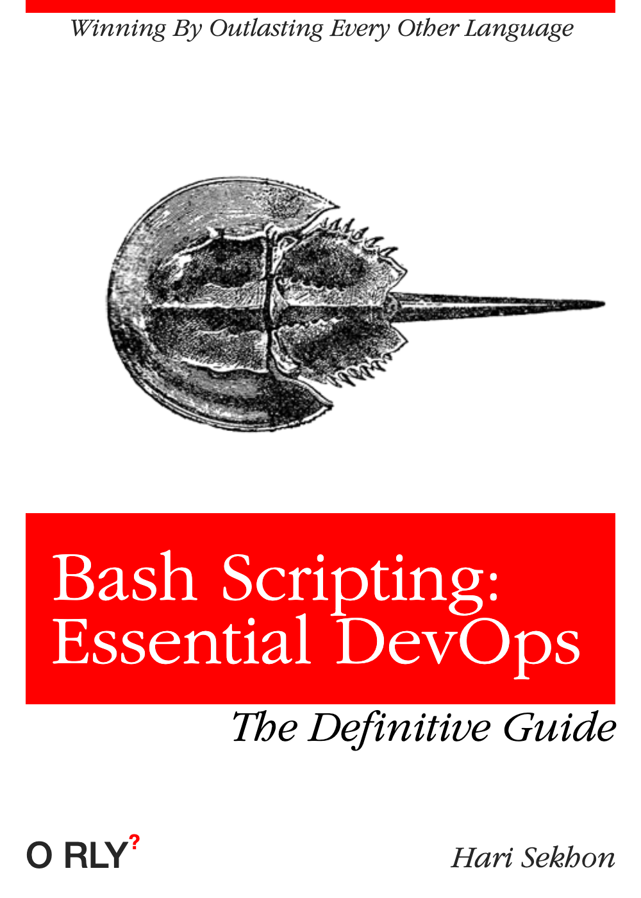

# Shell

<!-- INDEX_START -->

- [List](#list)
- [Fish](#fish)
- [Shell One Liners](#shell-one-liners)
- [Memes](#memes)
  - [Opening a Shell, Non-Programmers](#opening-a-shell-non-programmers)
  - [Bash Scripting: Essential DevOps](#bash-scripting-essential-devops)

<!-- INDEX_END -->

## List

- Bash - the gold standard in shell scripting - see [bash.md](bash.md)
- Bourne - the original unix shell - Bash is the Bourne Again Shell - next generation Bourne shell
- Ksh - Korn shell - another old unix shell
- Tcsh - BSD shell - just use Bash
- Zsh - slightly more feature rich shell than Bash. Not sure it's worth the hassle aside from `**` directory recursion globbing
- Fish - friendly interactive shell - meaning user friendly

## Fish

Friendly Interactive Shell

- awesome colourization
- tab complete from parsing man pages
- typing up/down selects historical commands for same command
- inline auto-suggestions based on history
- syntax highlighting files/dirs that exist / don't exist blue/red

```shell
.config/fish/config.sh
```

- Oh My Fish - omf - package manager
- Spacefish - awesome prompt, rich git info
- superceded by Spaceship
- `brew install spaceship` - available for each shell Bash/Zsh/Fish

amazing website built-in
fish_config

## Shell One Liners

See the [Shell One Liners](shell-one-liners.md) page.

## Memes

### Opening a Shell, Non-Programmers


### Bash Scripting: Essential DevOps



**Ported from various private Knowledge Base pages 2002+**
