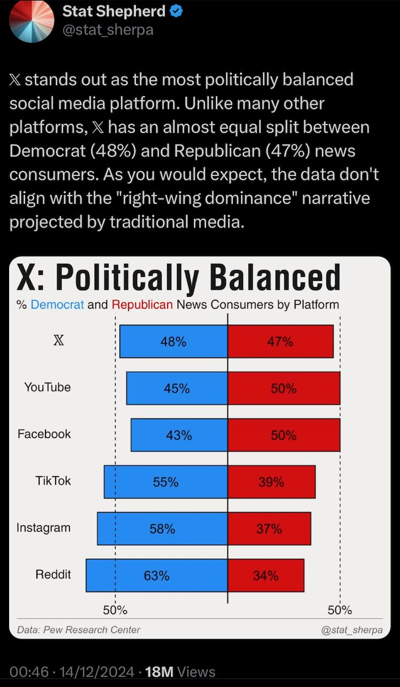

# Social Media

<!-- INDEX_START -->

- [LinkedIn](#linkedin)
- [X / Twitter](#x--twitter)
- [Instagram](#instagram)
  - [Instagram Bio Search](#instagram-bio-search)
- [YouTube](#youtube)
- [Rumble](#rumble)
- [TikTok](#tiktok)
- [Nostr](#nostr)
- [Reddit](#reddit)
- [Facebook](#facebook)
- [MySpace](#myspace)

<!-- INDEX_END -->

## LinkedIn

Professional networking site, but maddening censored. X is better in most ways.

Stupid LinkedIn has blocked my account so many times when travelling the world,
and then you have to go through government ID Persona verification via a QR code then scanning your passport or driver's
license and then taking a live selfie.

And sometimes that doesn't even work, it says "request already submitted",
and you have to contact LinkedIn support,
which is of course hard to find via Googling because they don't want people contacting actual humans they have to pay,
so here is the link:

<https://www.linkedin.com/help/linkedin/ask/sdsupport>

Tell them to stop being so stupid automatically blocking accounts all the time.

## X / Twitter

<https://x.com>

The most free speech platform thanks to Elon Musk and number one news app.

You will learn many inconvenient truths here suppressed on other platforms.

The social media artist formerly known as Twitter.

## Instagram

<https://www.instagram.com/>

Photo based social media.

### Instagram Bio Search

<https://influencers.club/instagram-bio-search/>

## YouTube

<https://www.youtube.com/>

Vids on just about everything except inconvenient truths for which they have deplatformed many people,
which should be illegal manipulation of culture IMO.

## Rumble

<https://rumble.com/>

More free speech version of YouTube which deplatformed people have fled to.

## TikTok

<https://www.tiktok.com/>

ADHD inducing social media short vidz popular with kids.

China owns this and gives their kids educational vids and western kids twerking vidz.

## Nostr

<https://nostr.com/>

Decentralized.

## Reddit

<https://www.reddit.com/>

Terribly inferior anonymous user base.

## Facebook

<https://www.facebook.com/>

Legacy, used by older people.

## MySpace

<https://myspace.com/>

Legacy, got rebuilt but was never cool again.

I actually worked here during the rebuild in 2011-2013.

Good engineers can't make up for bad management or marketing.
