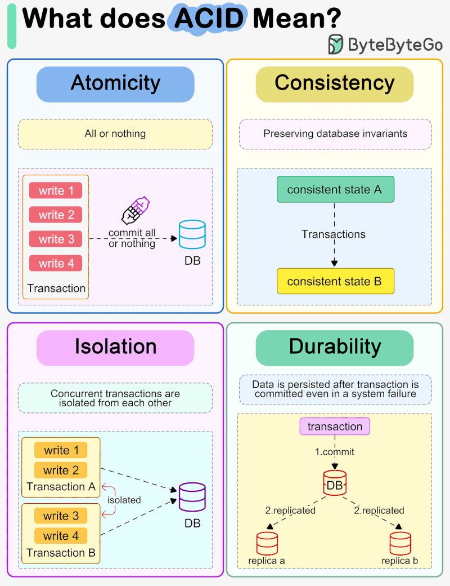
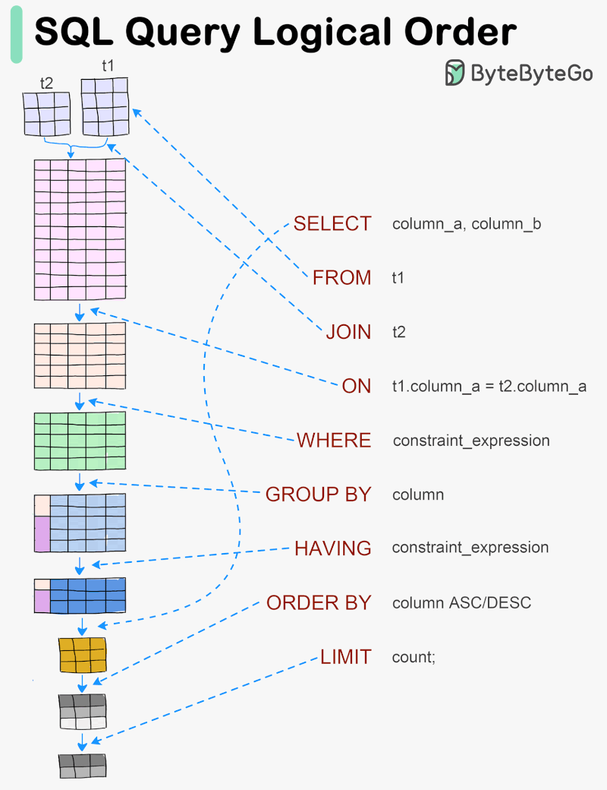

# SQL

<!-- INDEX_START -->

- [SQL Scripts](#sql-scripts)
- [SQL Clients](#sql-clients)
  - [DBeaver](#dbeaver)
- [SQL Linting](#sql-linting)
- [SQL Basics](#sql-basics)
  - [DDL - Data Definition Language](#ddl---data-definition-language)
  - [DML - Data Modification Language](#dml---data-modification-language)
  - [Query Predicates](#query-predicates)
  - [Functions](#functions)
    - [Aggregate Functions](#aggregate-functions)
      - [Nesting Aggregate Functions](#nesting-aggregate-functions)
  - [`SORT` and `ORDER`](#sort-and-order)
  - [JOINs](#joins)
  - [Database vs Schema](#database-vs-schema)
  - [Tables vs Views vs Materialized Views](#tables-vs-views-vs-materialized-views)
  - [Rows vs Records vs Columns vs Fields](#rows-vs-records-vs-columns-vs-fields)
  - [Constraints](#constraints)
  - [Keys - Primary vs Secondary vs Composite vs Surrogate](#keys---primary-vs-secondary-vs-composite-vs-surrogate)
- [ACID](#acid)
- [SQL Query Logical Order](#sql-query-logical-order)
- [Meme](#meme)
  - [Update One Record](#update-one-record)
- [Troubleshooting](#troubleshooting)
  - [SQuirreL SQL](#squirrel-sql)

<!-- INDEX_END -->

## SQL Scripts

Scripts for [PostgreSQL](postgres.md), [MySQL](mysql.md), AWS Athena and Google BigQuery:

[HariSekhon/SQL-scripts](https://github.com/HariSekhon/SQL-scripts)

[](https://github.com/HariSekhon/SQL-scripts)

## SQL Clients

Preference is given to free tools.

- [DBeaver](#dbeaver) - open source universal database client - supports many DBs
- [CloudBeaver](cloudbeaver.md) - web UI SQL client
- [DBGate](https://dbgate.org/) - SQL + NoSQL client
- [BeeKeeperStudio](https://www.beekeeperstudio.io/)
- [SQLectron](https://github.com/sqlectron/sqlectron-gui) - lightweight client
- [HeidiSQL](https://www.heidisql.com/)
- [DBVisualizer](https://www.dbvis.com/)
- [SQuirreL](https://squirrel-sql.sourceforge.io/)
- [Tora](https://github.com/tora-tool/tora/wiki)
- [PgAdmin](https://www.pgadmin.org/) - PostgreSQL web UI
- [phpMyAdmin](https://www.phpmyadmin.net/) - MySQL web UI
- [SQL Chat](https://github.com/sqlchat/sqlchat) - chat-based interface to querying DBs
- [Datagrip](https://www.jetbrains.com/datagrip/) - paid for RDBMS & NoSQL client by Jetbrains
  (makers of [IntelliJ](intellij.md))
- [Dataspell](https://www.jetbrains.com/dataspell/) - paid for data & analytics clients by Jetbrains

### DBeaver

<https://dbeaver.io/>

Open source universal database client that supports many databases.

Prompts to download JDBC drivers from Maven Central for the database you're connecting to at first connection test time.

Download: <https://dbeaver.io/download/>

On Mac, you can install using [Homebrew](brew.md):

```shell
brew install dbeaver-community
```

and then find the application icon under `Applications` as standard or open from the command line:

```shell
open -a "DBeaver"
```

In the SQL Console, `Cmd`-`Enter` on Mac
or `Ctrl`-`Enter` on Windows to execute SQL query under cursor,
similar to [SQL Developer](oracle.md#sql-developer-ide).

## SQL Linting

- [SQLFluff](https://sqlfluff.com) -
  Extensible and customizable SQL linter with support for multiple dialects, allowing for strict style enforcement
- [SQLLint (SQL-Lint)](https://sql-lint.github.io) -
  Simple, fast, and open-source SQL linter that checks for common issues in SQL queries
- [SQLCheck](https://github.com/jarulraj/sqlcheck) -
  Focuses on detecting anti-patterns in SQL queries to optimize performance and maintainability
- [SQLint](https://github.com/purcell/sqlint) -
  Minimalist linter for SQL code, primarily for catching syntax errors in your queries
- [Popeye](https://github.com/derailed/popeye) -
  A Kubernetes reporting tool that also helps analyze and lint database configurations
- [SonarQube with SQL Plugin](https://www.sonarqube.org) -
  SonarQube supports SQL linting through its plugin system, helping enforce best practices and maintainability
- [ALE (Asynchronous Lint Engine)](https://github.com/dense-analysis/ale) -
  A linter for many languages, including SQL, integrated into Vim/Neovim for real-time feedback
- [SQLcodegen](https://sqlcodegen.com) -
  A tool that can help generate SQL code based on linting requirements and other features
- [TSQLlint](https://github.com/tsqllint/tsqllint) - Microsoft SQL Server specific linting - used by Codacy, some quite
  good findings albeit false positives when applied to my [Oracle](oracle.md) scripts in my
  [SQL-scripts](https://github.com/HariSekhon/SQL-scripts) repo

**TODO**

- [SQLMesh](https://sqlmesh.com/)

## SQL Basics

### DDL - Data Definition Language

- `CREATE` - create objects in the database eg. schemas / databases, tables within schemas, or indices on tables
- `ALTER` - change objects in the database eg. schemas / databases, tables, or indexes
- `DROP`-  delete objects from the database eg. schemas / databases, tables or indexes
- `TRUNCATE` - deletes all data from a table
- `COMMENT` - adds comments to the data dictionary
- `RENAME` - renames an object in the database eg. table

### DML - Data Modification Language

- `SELECT` - get rows from a table or view
- `INSERT` -  add new rows into a table
- `UPDATE` - change rows in a table
- `DELETE` - delete rows from a table
- `MERGE` - perform an UPSERT operation (Insert or Update depending on whether a matching row already exists or not)
- `CALL` -  runs a PL/SQL procedure or Java program
- `EXPLAIN PLAN` - explain the way the data is loaded
- `LOCK TABLE` - control concurrency (TODO: by blocking writes? Explain this better)

### Query Predicates

- `WHERE` - returns rows that match the WHERE's expression argument
  - eg. `WHERE age >= 18` to return only people who are 18 years or older
  - eg. `WHERE age >= 18 AND age <= 25` - to return only people of prime biological age (which I am well past! :cry:)
  - can result in better performance to filtering early in the query execution to read less data from a table
    (especially in columnar [databases](databases.md) like MPP systems)
- `BETWEEN` - checks if the value of a field is in within a range of two values, usually numbers of some kind -
  - eg. `WHERE age BETWEEN 18 AND 25`
    integer, float / decimal etc.
- `IN` - checks if the value of a field is an exact match to one of a given enumeration of possible literal values
  - eg. `WHERE first_name in ("Hari", "Neo", "Morpheus")` - return only people with cool names from this pre-approved
    list
- `HAVING` - like `WHERE` but filters late in the query execution, evaluated after `GROUP BY` since `WHERE` filter
  cannot operate on values calculated by aggregate functions since they have no yet been calculated when `WHERE` is
  filtering rows
  - `WHERE` happens before the `GROUP BY`, so there is no way for `WHERE` clause to know what the value of the
    aggregate function is
  - eg. restricting the results to only rows where the `MAX(field)` is greater than `N`, you cannot `WHERE` on the
    `MAX()` because it doesn't exist at the time the WHERE is evaluated
  - eg. `SELECT MAX(age) max_age FROM my_table WHERE job = "Engineer" HAVING max_age > 40` - find only engineers over 40

### Functions

Functions following usual programming syntax `SOMEFUNCTION(value)` taking an input `value`
and replace themselves with the function's calculated value based on this input.

- `DISTINCT` - deduplicates records in a `SELECT` query

#### Aggregate Functions

Functions that summarize a column from rows data into a single value, usually using common mathematical functions like:

- `COUNT` - returns the number of rows or if given a column the number of non-`NULL` values in that column in the table
  or for the `GROUP BY` clause
- `SUM` - returns the sum of the numeric values in the given column (eg. bill total of all individual item purchases)
- `MIN` - returns the minimum numeric value for the given field in all the `SELECT`'d rows
- `MAX` - returns the maximum numeric value for the given field in all the `SELECT`'d rows
- `AVG` - returns everage value of the given field in all the `SELECT`'d rows

Often used with a `GROUP BY` clause to get the aggregates for each of a category defined by the `GROUP BY` clause.

COUNT(column) vs COUNT(DISTINCT(column)):

- COUNT(column) - returns number of non-`NULL` values in the given column
  - eg. `SELECT COUNT(category) FROM my_table` - how many rows have a category defined
- COUNT(DISTINCT(column)) - returns the number of unique non-`NULL` values in the given column
  - eg. `SELECT COUNT(DISTINCT(category)) FROM my_table GROUP BY category` - how many different categories are there

##### Nesting Aggregate Functions

Yyou can nest aggregate functions up to two levels deep.

Eg. this query finds the category with the most records:

```sql
SELECT category, MAX(COUNT(1)) FROM mytable GROUP BY category;
```

### `SORT` and `ORDER`

TODO: I always get these confused - SORT or ORDER - I swear different systems use different keywords

- `SORT BY` - return the rows in the order of the given column, by default in ascending values (`ASC`) unless (`DESC`) is
  specified
  - eg. `SORT BY name`
  - eg. `SORT BY age DESC` - put older people at the top of the results
- `ORDER BY` -

### JOINs

Returns a data set by merging the rows of two tables on given fields which are expected to have matching values
representing that their rows are linked.

- Inner Join - returns records that exist in both tables
  - Natural Join - an inner join on two tables that have the same column names
- `LEFT JOIN` / `LEFT OUTER JOIN` - returns records that exist in the left table regardless of whether they are
  found in the right table. Shows `NULL`s for fields that don't exist in the other table
- `RIGHT JOIN` / `RIGHT OUTER JOIN` - returns records that exist in the right table regardless of whether they are
  found in the left table. Shows `NULL`s for fields that don't exist in the other table
- `Full JOIN` / `FULL Outer JOIN` - returns records that exist in either table - shows `NULL`s for fields that don't
  exist in the other table
- `CROSS JOIN` - returns all combinations of all records in both tables (cartesian product)
  - there is no join field for this by definition since all rows from one table are multiplied by all rows from the
    other table
- `SELF JOIN` - a join from one table to another record in the same table
  - used where a field in the table refers to another field in the same table such as hierarchical structures
    - eg. in an employees table the `manager_id` field refers to the `employee_id` of the manager who exists in another
      row the same table

### Database vs Schema

Schema is the logical container separating a group of tables by team or application.

'Database' can refer to the software code product that manages the data, or to the logical schema.

### Tables vs Views vs Materialized Views

Tables - the structures contains the rows of data.

Views - logical abstractions on top of tables that are queryable just like ordinary tables, but inside their definition
they are themselves `SELECT` queries of subsets of a table or joins of other tables.

Use Cases of Views:

- convenience - to simplify queries on table(s) eg. the view's `SELECT` definition is already joining two or more
  tables so you don't have to figure out how to do it and just see it as a simple existing table
- security - grant users access to the view which is query of only some but not other columns eg. Name, but not Credit
  Card Number
- abstraction - have applications query Views so that they the underlying data structures could change without having to rewrite all the queries the applications are using

Materialized Views - Views where the results of their `SELECT` definition are physically saved to disk like tables so
that the expensive `SELECT` operation of the view definition does not have to be uncurred on every call but just reads
from the stored data that has already been joined and calculated. Freshness vs Performance trade off. When the tables
behind the view are updated, the view is out of date, and you will need to regenerate it.

- Synonyms - aliases to another database object to hide a name or improve maintenance by having an unchanging reference to it

- Table Aliases - widely used in `SELECT ... JOIN` queries to shorten full qualified references to columns from one of the two tables

### Rows vs Records vs Columns vs Fields

- Row - a line of data in a table
- Record - same thing as a row
- Column - a data type that each row may populate, depending on whether `NULL` (no value) is allowed in the column
  definition via a definition constraint.
- Field - a specific intersection of Row and Column - a single value from a single row in the table in the specified
  column

### Constraints

Definitions in columns that enforce behaviours like:

- `NOT NULL` - the fields in each row for that column may not be empty (`NULL`)
- `UNIQUE` - all rows must have a unique value for this column eg. a globally unique customer ID

### Keys - Primary vs Secondary vs Composite vs Surrogate

These are defined at table creation time. Some can be updated on an existing table, but others like Primaries keys
usually cannot be because their new definitions constraints may violate the stored date.

- Primary Key - one or more columns that together uniquely identify a row in a table
  - there can only be one Primary Key per table by definition, if there is one at all
  - the Primary key column has implicit `UNIQUE` and `NOT NULL` constraints
  - usually a numeric ID
  - best practice is to use a Surrogate Key (described below) rather than a natural key
- Foreign Key - a column of a table that references the Primary Key of another table to mark each record in this table
  as being linked to a unique row in the other table
  - eg. the purchases in this table all belong to customer ID `N` in the customers table
- Composite Key - a key made up of two of more fields (does this apply only to Primary Keys)
- Surrogate Key - a column of arbitrary unique unchanging values created solely to be a Primary Key - reflects nothing
  in the real world so it is stable and never has to change
  - eg. a Customer ID - people changing their names would not need to rewrite their customer ID number reference used
    in all the tables, the existing queries and joins across tables would still all work

<!--

TODO: https://www.databasestar.com/difference-between-where-and-having-clause/

TODO: https://www.databasestar.com/sql-views/

TODO: https://www.databasestar.com/sql-joins/

-->

## ACID

Atomic, Consistent, Isolated & Durable.

ACID compliance is a standard feature of RDBMS SQL databases.



<!-- error accessing this now, try to find original and import it instead
## SQL Joins


-->

## SQL Query Logical Order



## Meme

### Update One Record

Be careful and remember to `SELECT` with `WHERE` clause before editing it to an `UPDATE`!


## Troubleshooting

### SQuirreL SQL

SQuirreL SQL fails to start, the splash screen appears but then nothing opens.

Debugging on the command line like so:

```shell
open -a "SQuirreLSQL"
```

or

```shell
/Applications/SQuirreLSQL.app/Contents/MacOS/squirrel-sql.sh
```

crashes with this

```text
/Applications/SQuirreLSQL.app/Contents/MacOS/squirrel-sql.sh: line 107: 60812 Trace/BPT trap: 5       "$JAVACMD" -cp "$CP" $SQUIRREL_SQL_OPTS $MACOSX_SQUIRREL_PROPS -splash:"$SQUIRREL_SQL_HOME/icons/splash.jpg" net.sourceforge.squirrel_sql.client.Main --squirrel-home "$UNIX_STYLE_HOME" $NATIVE_LAF_PROP $SCRIPT_ARGS
```

Ensure your `$JAVA_HOME` environment variable is set and then

```shell
"$JAVA_HOME/bin/java" -Xlog:all -cp "/Applications/SQuirreLSQL.app/Contents/Resources/Java/squirrel-sql.jar:/Applications/SQuirreLSQL.app/Contents/Resources/Java/lib/*" \
  net.sourceforge.squirrel_sql.client.Main
```

Then edit:

```shell
"$EDITOR" /Applications/SQuirreLSQL.app/Contents/MacOS/squirrel-sql.sh
```

and replace this line:

```text
#MACOSX_SQUIRREL_PROPS="-Dapple.laf.useScreenMenuBar=true -Dcom.apple.mrj.application.apple.menu.about.name=SQuirreLSQL -Dapple.awt.application.name=SQuirreLSQL"
```

with

```text
MACOSX_SQUIRREL_PROPS=""
```

then re-run

```shell
/Applications/SQuirreLSQL.app/Contents/MacOS/squirrel-sql.sh
```

to see it works before going back to the UI Applications in future to call this.
