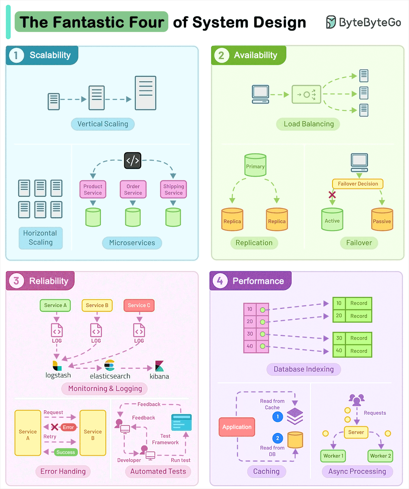
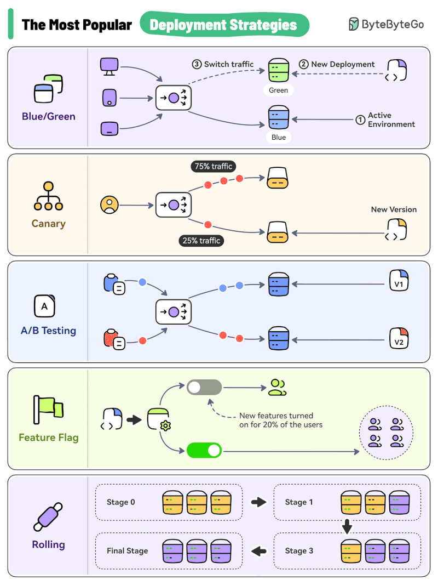

# Systems Design

A complex mix of coding and systems engienering skills.

This is what you need to build or work at Big Tech companies.

## ByteByteGo

<https://bytebytego.com/>

[ByteByteGo YouTube Channel](https://www.youtube.com/channel/UCZgt6AzoyjslHTC9dz0UoTw)

This is a good resource for systems design - they produce many high quality diagrams.

Annoyingly though, they never reply to my LinkedIn comments for which tool they used while mine are on GitHub here:

[HariSekhon/Diagrams-as-Code](https://github.com/HariSekhon/Diagrams-as-Code)

## System Design Four Pillars

## Deployment Strategies

