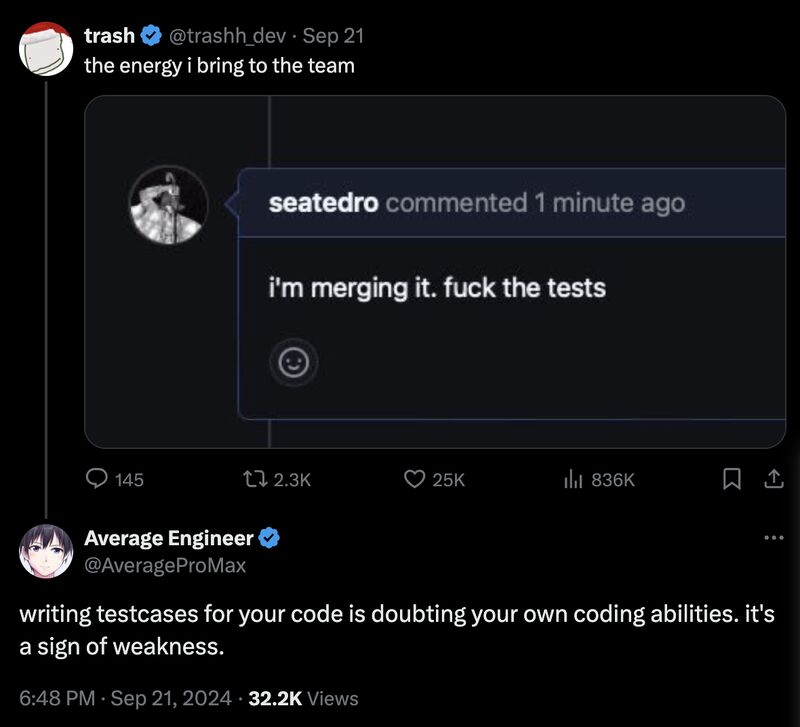
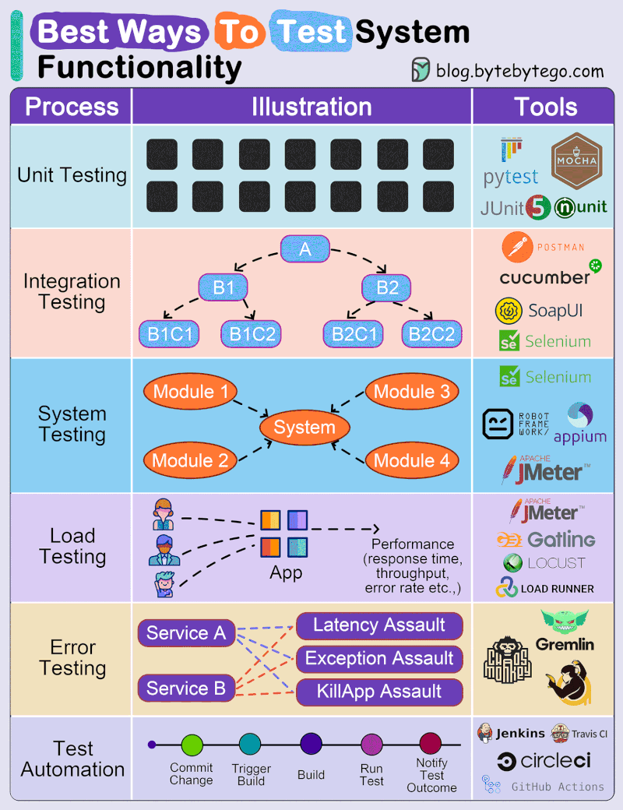
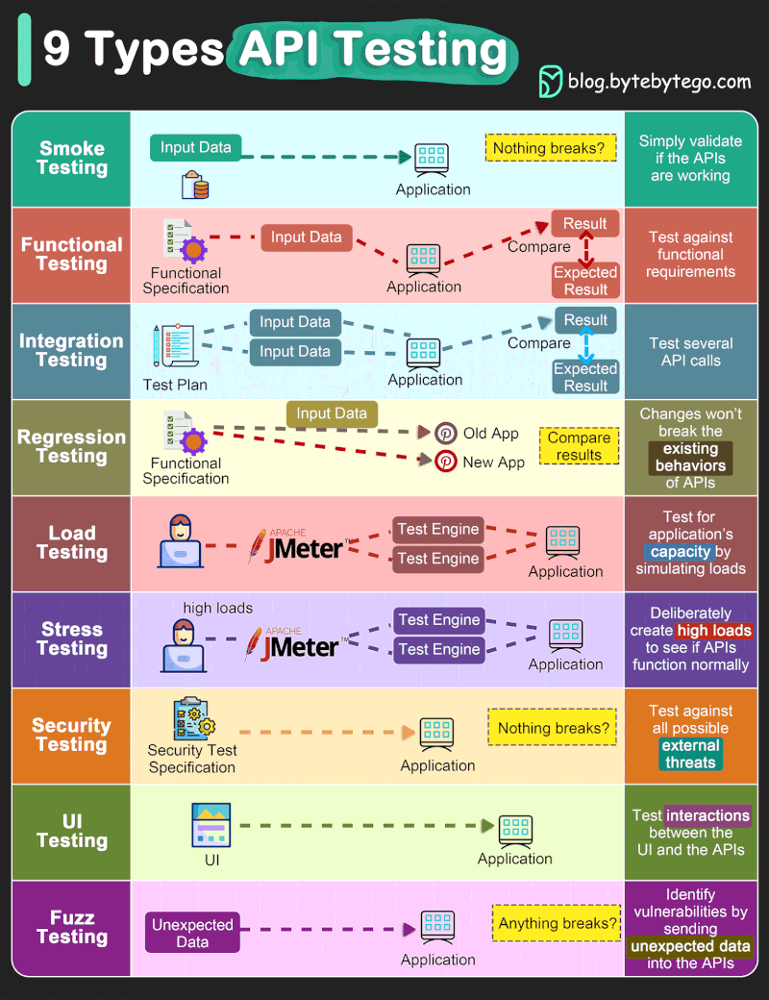
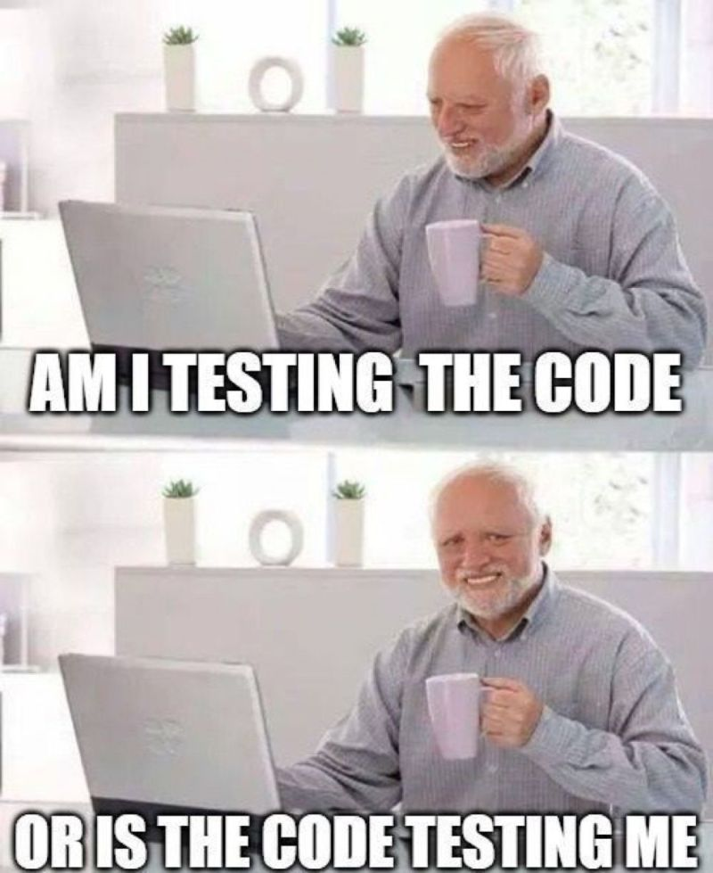
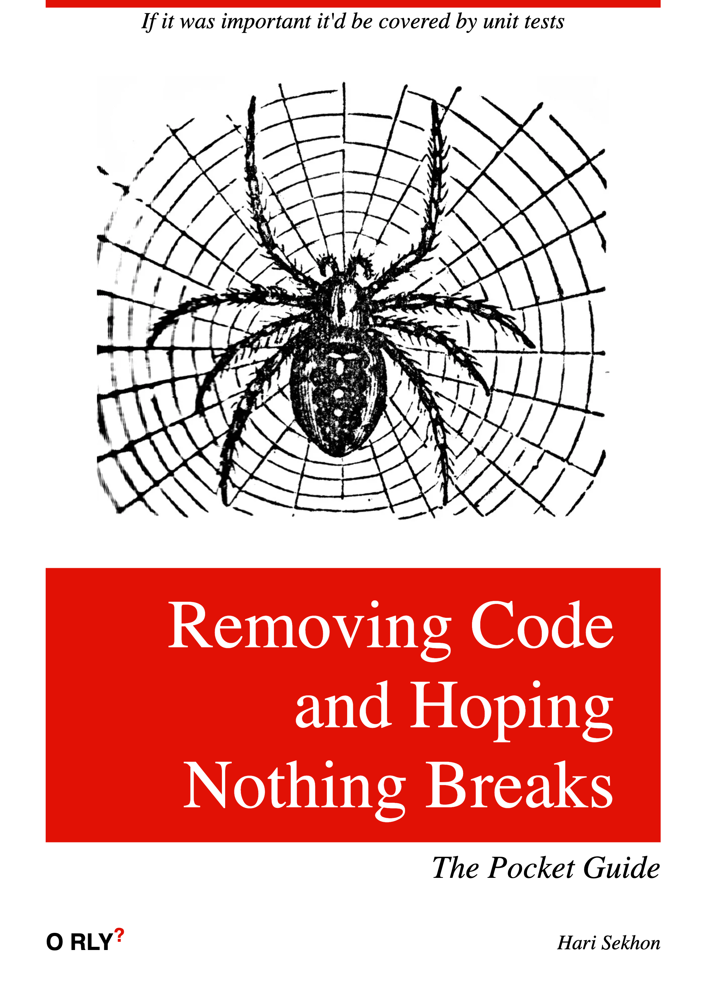

# Testing

<!-- INDEX_START -->

- [Test Driven Development](#test-driven-development)
- [Test Automation](#test-automation)
- [Diagrams](#diagrams)
  - [Different Testing Methods](#different-testing-methods)
  - [API Testing](#api-testing)
- [Memes](#memes)
  - [Feature Dev vs QA vs User Testing](#feature-dev-vs-qa-vs-user-testing)
  - [Testing Code or Code Testing Me](#testing-code-or-code-testing-me)
  - [Removing Code & Hoping Nothing Breaks](#removing-code--hoping-nothing-breaks)

<!-- INDEX_END -->

## Test Driven Development

You should write tests first because this will catch edge cases in your functions and you can then write your functions
to match the expected logic behaviour of your tests cases.

Don't be these people - it's funny because it's wrong:

## Test Automation

- [Selenium](https://www.selenium.dev/) - automates web browsers to test websites
  - use Selenium code to direct a given browser to query a website and check its response eg.
    [selenium_hub_browser_test.py](https://github.com/HariSekhon/DevOps-Python-tools/blob/master/selenium_hub_browser_test.py)
    in my [DevOps-Python-tools](devops-python-tools.md) repo
  - [Selenium Grid](https://www.selenium.dev/documentation/grid/) - spin up multiple Selenium controlled web browsers to
    test sites - example of this is in my [Kubernetes-configs](https://github.com/HariSekhon/Kubernetes-configs) repo
- [Appium](https://appium.io/docs/en/latest/) - uses the Selenium WebDriver standard to automated tests on iOS and
  Android eg. by converting UIAutomator2 on Android)

## Diagrams

### Different Testing Methods

### API Testing

## Memes

### Feature Dev vs QA vs User Testing

### Testing Code or Code Testing Me

### Removing Code & Hoping Nothing Breaks

