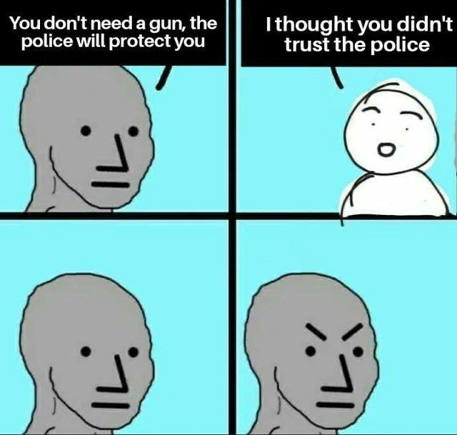
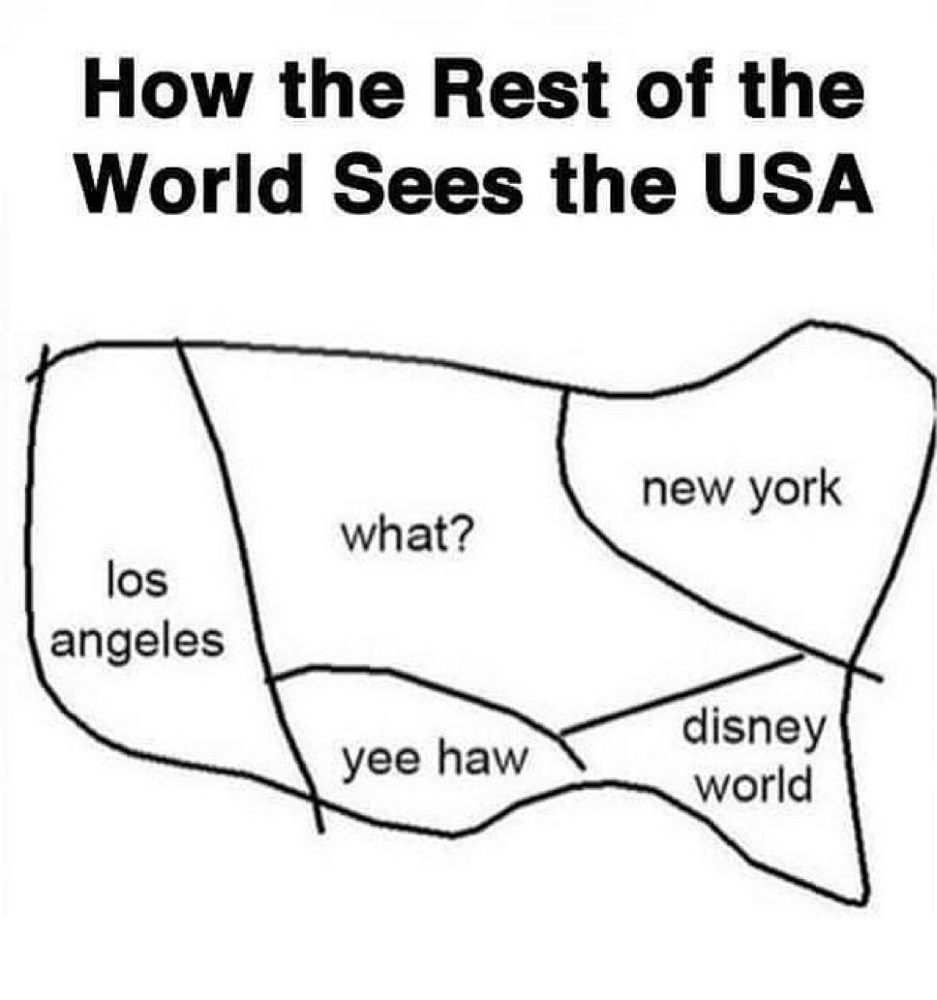

# Travel

Short links to this page:

[tinyurl.com/hari-travels](https://tinyurl.com/hari-travels)

[bit.ly/hari-travels](https://bit.ly/hari-travels)

I've worked on 4 continents and have travelled to over 40 countries at this point.

Whether Consulting internationally or visiting for a holiday, here are some useful tips from my extensive travels.

Updated regularly as I travel the world all year.

<!-- INDEX_START -->

- [Booking Sites](#booking-sites)
- [Flights](#flights)
  - [Flight Booking Sites](#flight-booking-sites)
  - [Flight Deals from the US](#flight-deals-from-the-us)
  - [Flight Gotchas](#flight-gotchas)
    - [Luggage](#luggage)
    - [Transfer Flight Timings](#transfer-flight-timings)
    - [Self Transfer](#self-transfer)
    - [Change Airport](#change-airport)
- [Hotels vs Hostels vs Airbnb](#hotels-vs-hostels-vs-airbnb)
  - [Internet - Hotel vs Airbnb](#internet---hotel-vs-airbnb)
  - [Parking - Hotel, Hostel & Airbnb](#parking---hotel-hostel--airbnb)
  - [Hostel Tips](#hostel-tips)
    - [Lockers](#lockers)
    - [Towels](#towels)
    - [Shower Gel](#shower-gel)
    - [Pillows](#pillows)
    - [WorldPackers](#worldpackers)
- [Taxis](#taxis)
- [Wifi](#wifi)
  - [Wifi Hotels](#wifi-hotels)
  - [Wifi Cafes & Restaurants](#wifi-cafes--restaurants)
  - [Wifi Speeds](#wifi-speeds)
- [Mobile Internet Access](#mobile-internet-access)
  - [EU Roaming](#eu-roaming)
  - [Rest of World](#rest-of-world)
    - [Digital e-sims](#digital-e-sims)
  - [International Calls using VoIP over the Internet](#international-calls-using-voip-over-the-internet)
- [ATMs and Foreign Cash Withdrawals](#atms-and-foreign-cash-withdrawals)
- [Restaurants & Dining Out](#restaurants--dining-out)
- [Translation](#translation)
- [Seasons - Timing Matters](#seasons---timing-matters)
- [Mosquito Repellent](#mosquito-repellent)
- [Health Insurance](#health-insurance)
- [Beware Foreign Police & Customs](#beware-foreign-police--customs)
  - [Carry Your Official Documents Everywhere For When You _Are_ Stopped](#carry-your-official-documents-everywhere-for-when-you-_are_-stopped)
  - [Don't Speed](#dont-speed)
  - [Do Not Even Jaywalk](#do-not-even-jaywalk)
- [Driving](#driving)
  - [Car Insurance](#car-insurance)
  - [International Driving Insurance](#international-driving-insurance)
    - [Temporary Car Insurance Cover](#temporary-car-insurance-cover)
  - [Driving Checklist](#driving-checklist)
  - [Additional EU Driving Checklist](#additional-eu-driving-checklist)
  - [EU Motorway Tolls](#eu-motorway-tolls)
  - [Do Not Speed](#do-not-speed)
  - [Parking](#parking)
- [EU Schengen Visa Calculator](#eu-schengen-visa-calculator)
- [Emigration](#emigration)
  - [Taxes](#taxes)
  - [Mail Redirection](#mail-redirection)
- [Countries](#countries)
  - [Albania](#albania)
    - [ATMs in Albania](#atms-in-albania)
    - [Taxis in Albania](#taxis-in-albania)
    - [Driving in Albania](#driving-in-albania)
    - [Tirana](#tirana)
    - [Lake Bovilla](#lake-bovilla)
    - [Durres](#durres)
    - [Elbasan](#elbasan)
    - [Pogradec](#pogradec)
    - [Shkoder](#shkoder)
  - [Austria](#austria)
    - [Motorway Tolls - e-Vignettes in Austria](#motorway-tolls---e-vignettes-in-austria)
    - [Vienna](#vienna)
      - [Metro in Vienna](#metro-in-vienna)
      - [Taxis in Vienna](#taxis-in-vienna)
      - [Parking in Vienna](#parking-in-vienna)
      - [Restaurants in Vienna](#restaurants-in-vienna)
    - [Graz](#graz)
      - [Parking in Graz](#parking-in-graz)
      - [Restaurants in Graz](#restaurants-in-graz)
  - [Belgium](#belgium)
    - [Antwerp](#antwerp)
    - [Brussels](#brussels)
    - [Bruges / Brugge](#bruges--brugge)
    - [Ghent / Gent](#ghent--gent)
    - [Liege](#liege)
    - [Waterloo](#waterloo)
  - [Bulgaria](#bulgaria)
    - [Motorway Tolls - Vignettes in Bulgaria](#motorway-tolls---vignettes-in-bulgaria)
    - [Sofia](#sofia)
    - [Veliko Tarnovo](#veliko-tarnovo)
    - [Ruse](#ruse)
  - [Cambodia](#cambodia)
    - [Visa for Cambodia](#visa-for-cambodia)
    - [Money in Cambodia](#money-in-cambodia)
    - [Taxis in Cambodia](#taxis-in-cambodia)
    - [Restaurants in Cambodia](#restaurants-in-cambodia)
    - [Phnom Penh](#phnom-penh)
    - [Bus Between Phenom Penh and Siem Reap](#bus-between-phenom-penh-and-siem-reap)
    - [Siem Reap](#siem-reap)
  - [Canada](#canada)
    - [Abbotsford](#abbotsford)
  - [Croatia](#croatia)
    - [Taxis in Croatia](#taxis-in-croatia)
    - [Zagreb](#zagreb)
    - [Split](#split)
    - [Zadar](#zadar)
    - [Dubrovnik](#dubrovnik)
  - [Cyprus](#cyprus)
  - [Czechia / Czech Republic](#czechia--czech-republic)
    - [Motorway Tolls - Vignettes in Czechia](#motorway-tolls---vignettes-in-czechia)
    - [Prague](#prague)
      - [Taxis in Prague](#taxis-in-prague)
      - [Parking in Prague](#parking-in-prague)
      - [Restaurants in Prague](#restaurants-in-prague)
    - [Brno](#brno)
    - [České Budějovice](#české-budějovice)
    - [Kutna Hora](#kutna-hora)
    - [Hradec Kralove](#hradec-kralove)
  - [Denmark](#denmark)
    - [Copenhagen](#copenhagen)
      - [Copenhagen Restaurants](#copenhagen-restaurants)
  - [Estonia](#estonia)
    - [Tallinn](#tallinn)
  - [France](#france)
    - [Dunkirk](#dunkirk)
    - [Paris](#paris)
  - [Georgia](#georgia)
    - [Georgia Flights](#georgia-flights)
    - [Taxis in Georgia](#taxis-in-georgia)
    - [Tbilisi Airport](#tbilisi-airport)
    - [Tbilisi](#tbilisi)
  - [Germany](#germany)
    - [Driving in Germany](#driving-in-germany)
    - [Bonn](#bonn)
    - [Berlin](#berlin)
    - [Brandenburg](#brandenburg)
    - [Cologne](#cologne)
    - [Dresden](#dresden)
    - [Dusseldorf](#dusseldorf)
    - [Essen](#essen)
    - [Frankfurt](#frankfurt)
    - [Hanover](#hanover)
    - [Königswinter](#königswinter)
    - [Potsdam](#potsdam)
  - [Hungary](#hungary)
    - [Avoid northern counties](#avoid-northern-counties)
    - [Taxis in Hungary](#taxis-in-hungary)
    - [Motorway Tolls - Vignettes in Hungary](#motorway-tolls---vignettes-in-hungary)
    - [Budapest](#budapest)
      - [Metro in Budapest](#metro-in-budapest)
      - [Restaurants in Budapest](#restaurants-in-budapest)
    - [Debrecen](#debrecen)
    - [Gyor](#gyor)
    - [Szolnok](#szolnok)
  - [Indonesia](#indonesia)
    - [Bali](#bali)
      - [Canguu](#canguu)
      - [Kuta](#kuta)
      - [Seminyak](#seminyak)
      - [Ubud](#ubud)
  - [Italy](#italy)
    - [Car Rentals in Italy](#car-rentals-in-italy)
    - [Rome](#rome)
    - [Venice](#venice)
  - [Laos](#laos)
    - [Taxis in Laos](#taxis-in-laos)
    - [Vientiane](#vientiane)
    - [High Speed Rail Between Vientiane and Luang Prabang](#high-speed-rail-between-vientiane-and-luang-prabang)
    - [Luang Prabang](#luang-prabang)
  - [Latvia](#latvia)
    - [Riga](#riga)
  - [Lithuania](#lithuania)
    - [Vilnius](#vilnius)
  - [Malaysia](#malaysia)
    - [Taxis in Malaysia](#taxis-in-malaysia)
    - [Kuala Lumpur](#kuala-lumpur)
      - [Bukit Bintag](#bukit-bintag)
      - [Chinatown](#chinatown)
  - [Moldova](#moldova)
    - [Chisinau](#chisinau)
  - [Montenegro](#montenegro)
    - [Driving in Montenegro](#driving-in-montenegro)
    - [Podgorica](#podgorica)
    - [Budva](#budva)
    - [Kotor](#kotor)
    - [Bar](#bar)
    - [Ulcinj](#ulcinj)
  - [Morocco](#morocco)
    - [Taxis in Morocco](#taxis-in-morocco)
    - [Tangiers](#tangiers)
  - [Netherlands](#netherlands)
    - [Amsterdam](#amsterdam)
  - [North Macedonia](#north-macedonia)
    - [Driving in North Macedonia](#driving-in-north-macedonia)
    - [Skopje](#skopje)
    - [Ohrid](#ohrid)
  - [Norway](#norway)
    - [Oslo](#oslo)
  - [Poland](#poland)
    - [Bydgoszcz](#bydgoszcz)
    - [Częstochowa](#częstochowa)
    - [Gdansk](#gdansk)
    - [Katowice](#katowice)
    - [Krakow](#krakow)
    - [Łódź](#łódź)
    - [Nowy Sącz](#nowy-sącz)
    - [Poznan](#poznan)
    - [Sopot](#sopot)
    - [Wroclaw](#wroclaw)
    - [Warsaw](#warsaw)
  - [Philippines](#philippines)
    - [Manilla](#manilla)
  - [Romania](#romania)
    - [Taxis in Romania](#taxis-in-romania)
    - [Motorway Tolls - e-Vignettes in Romania](#motorway-tolls---e-vignettes-in-romania)
    - [Bucharest](#bucharest)
    - [Brașov](#brașov)
    - [Cluj-Napoca](#cluj-napoca)
    - [Oradea](#oradea)
  - [Serbia](#serbia)
    - [Indoor Smoking, Outdoor Smoking, Smoking Everywhere in Serbia](#indoor-smoking-outdoor-smoking-smoking-everywhere-in-serbia)
    - [Taxis in Serbia](#taxis-in-serbia)
    - [Driving in Serbia](#driving-in-serbia)
    - [Belgrade](#belgrade)
    - [Novi Sad](#novi-sad)
    - [Nis](#nis)
  - [Singapore](#singapore)
  - [Slovakia](#slovakia)
    - [Motorway Tolls - e-Vignettes in Slovakia](#motorway-tolls---e-vignettes-in-slovakia)
    - [Bratislava](#bratislava)
    - [Kosice](#kosice)
  - [Slovenia](#slovenia)
    - [Taxis in Slovenia](#taxis-in-slovenia)
    - [Motorway Tolls - Vignettes in Slovenia](#motorway-tolls---vignettes-in-slovenia)
    - [Wifi in Slovenia](#wifi-in-slovenia)
    - [Ljubljana](#ljubljana)
    - [Bled](#bled)
    - [Novo Mesto](#novo-mesto)
  - [South Africa](#south-africa)
    - [Johannesburg](#johannesburg)
      - [Sandton](#sandton)
      - [Rosebank](#rosebank)
  - [Sweden](#sweden)
    - [Stockholm](#stockholm)
  - [Taiwan](#taiwan)
    - [Taxis in Taiwan](#taxis-in-taiwan)
    - [Taipei](#taipei)
      - [Taipei Hotels](#taipei-hotels)
      - [Taipei Restaurants & Attractions](#taipei-restaurants--attractions)
  - [Thailand](#thailand)
    - [ATMs in Thailand - Cash is Needed](#atms-in-thailand---cash-is-needed)
    - [Mobile Internet in Thailand](#mobile-internet-in-thailand)
    - [Taxis in Thailand](#taxis-in-thailand)
    - [Food in Thailand](#food-in-thailand)
    - [Bangkok](#bangkok)
      - [Food in Bangkok](#food-in-bangkok)
    - [Phuket](#phuket)
      - [Patong Beach](#patong-beach)
      - [Kata Beach](#kata-beach)
      - [Karon Beach](#karon-beach)
    - [Pattaya](#pattaya)
      - [Travel Between Bangkok and Pattaya](#travel-between-bangkok-and-pattaya)
      - [Pattaya Bars & Restaurants](#pattaya-bars--restaurants)
  - [Turkey](#turkey)
    - [Antalya Airport](#antalya-airport)
    - [Istanbul](#istanbul)
      - [Taxis in Istanbul](#taxis-in-istanbul)
      - [Restaurants in Istanbul](#restaurants-in-istanbul)
  - [UAE](#uae)
    - [Driving in UAE](#driving-in-uae)
    - [Abu Dhabi](#abu-dhabi)
      - [Restaurants in Abu Dhabi](#restaurants-in-abu-dhabi)
    - [Dubai](#dubai)
      - [Metro in Dubai](#metro-in-dubai)
      - [Taxis in Dubai](#taxis-in-dubai)
      - [Parking in Dubai](#parking-in-dubai)
      - [Weather in Dubai](#weather-in-dubai)
      - [Attractions in Dubai](#attractions-in-dubai)
      - [Restaurants in Dubai](#restaurants-in-dubai)
      - [Visas for Dubai](#visas-for-dubai)
      - [Banking in Dubai](#banking-in-dubai)
  - [United Kingdom](#united-kingdom)
    - [Best Areas in the UK](#best-areas-in-the-uk)
    - [Best Areas in London](#best-areas-in-london)
    - [Best Restaurants in London](#best-restaurants-in-london)
  - [USA](#usa)
    - [California](#california)
      - [Irvine](#irvine)
      - [Los Angeles](#los-angeles)
      - [Palo Alto](#palo-alto)
      - [San Diego](#san-diego)
      - [San Francisco](#san-francisco)
  - [Vietnam](#vietnam)
    - [Taxis in Vietnam](#taxis-in-vietnam)
    - [Hanoi](#hanoi)
    - [Ho Chi Minh (formerly known as Saigon)](#ho-chi-minh-formerly-known-as-saigon)

<!-- INDEX_END -->

## Booking Sites

Always compare 2-3 sites as you might think one will always get you a better deal,
but once in a while it'll screw you with a much higher price than the others.

[Agoda.com](https://www.agoda.com/) - the best site for use in Asia, and you really need to go to Asia, it's amazing.

[HostelWorld.com](https://www.hostelworld.com/) - best for solo hostel travellers - sometimes more expensive than Agoda
for the same places, but sometimes has hostels that other sites don't have at all.
People are often willing to pay a slight premium to book through HostelWorld just to get access to it's unique city chat
feature to meet other solo travellers to socialize.
The chat is a bit sluggish and buggy, so I use this chat to collect the IGs and then start a better Insta group chat.
HostelWorld usually takes a deposit (which doesn't go to the hostel and is non-refundable if you cancel), and then you
pay the hostel when you arrive.
This means you are slightly better off booking a shorter time on the app to pay less deposit but still get access to
the city chat and then extending your stay locally with the hostel - as long as the hostel isn't likely to run out of
capacity!
There is a limitation in the app / website that you cannot change your booked duration once purchased,
and beware that if you cancel the booking (eg. because you want to shorten the duration for example at the request of
your hostel to free up the bed on their system) you will lose both your deposit and access to the chat, and the customer
service support cannot undo the cancellation for you either.

[Kayak.com](https://www.kayak.com/) - usually cheaper than SkyScanner and had cheaper flights not found on Expedia.
  lI prefer Kayak to SkyScanner because I can filter for flights including luggage in the price
  and when following through to [eDreams](https://www.edreams.com/) or [Trip.com](https://trip.com/) flights I can
  upgrade to 25kg luggage for ~£4, which is important because I got charged $30 for having 22kg checked luggage -
  2kg over the 20kg default luggage allowance of many airlines.
  Booking.com and Kiwi.com are bad for this only option of adding 20kg checked luggage

[SkyScanner.net](https://www.skyscanner.net/) - had cheaper flights that weren't even found on Expedia,
and cheaper on the same flights too

[Booking.com](https://www.booking.com) - cheaper and more hotels than Expedia, but sucks because it only allows you to add 20kg checked
luggage, which left me getting screwed for a $30 surcharge for being 2kg over on my checked luggage

[Expedia](https://expedia.co.uk) - LEGACY DO NOT USE.
Was my usual go to as it usually had the most options at the last minute, until SkyScanner and Kayak
showed it up.
Beware if you are trying
to get a hotel immediately for a missed flight the app will shunt the results to the next day
and you will end up booking the wrong night and then having a horrible battle trying to get it refunded.
Booking.com is better for that scenario.
Also, if you book the wrong date or there is any issue Expedia support are the worst ever.
You will struggle to get any refund.
Use them to find the hotels and flights,
then go book directly with the airline or hotel and deal with them directly if there is any problem.
You'll usually get a slight discount or other perk and when there is a problem you will not be stuck suffering Expedia
chat support.

[AirBnb](https://www.airbnb.com) - compare the cost of apartments to hotels in each area, it alternates which is
cheaper depending on the country.

[LastMinute.com](https://lastminute.com) - ok for package holidays but assumed return flights,
less good for a digital nomad who is going one way and bouncing to the next place.

[OnTheBeach.co.uk](https://www.onthebeach.co.uk/) - good prices but nothing available for same/next day for last minute
travellers like me.

## Flights

Book ahead of time for better price comparisons.

Same goes for ferries if driving.

Favourite Airline: Air Arabia because they didn't tell me to put my laptop away during takeoff. One less pointless rule
enforced.

### Flight Booking Sites

Ranked by my success in finding affordable flights

- [Kayak.com](https://www.kayak.com/) - even cheaper than SkyScanner and had cheaper flights not found on Expedia
- [SkyScanner.net](https://www.skyscanner.net/) - had cheaper flights that weren't even found on Expedia, and cheaper on the same flights too
- [Booking.com](https://www.booking.com)
- [Agoda.com](https://www.agoda.com/) - better for hotels than flights
- [Expedia](https://expedia.co.uk) - fewer and more expensive flights
- [Google Flights](https://www.google.com/travel/flights)

### Flight Deals from the US

If you just want to go on hols and don't mind where, then you can use:

<https://www.going.com/>

Enter your nearest airport(s) and they will send you cheap deals to random destinations.

Unfortunately they do not serve airports outside the US at time of writing.

### Flight Gotchas

#### Luggage

Be careful with your luggage weight. I got charged $30 in Asia for being 2kg overweight.

It is usually much cheaper to just book a larger luggage weight in advance, such as 25kg instead of 20kg.

If doing short trips, you might be better off not taking checked luggage at all as budget airlines like Whizz Air charge
you a lot extra on top of the initial flight cost to have a checked luggage, and if only going somewhere for 2-3 days
you really only need a change of clothes and minimal toiletries.

The real problem is if you have lots of toiletries for skincare routines etc,
as it can be hard to get it through the airport security and need that checked luggage.

#### Transfer Flight Timings

**Do not take transfer flights with less than 3-4 hours between them.**

It is common for the first flight to be delayed by 1.5 hours
and then you don't have enough time to catch the second flight.
Even more so if you have to go through security again which can delay you by another 30-60 minutes.

I have gotten stranded overnight in Warsaw like this on the way from London to Tbilisi, with no replacement flight for
24 hours.
And of course there is no hotel availability at 11:30pm except for £200-300+ per night hotels.

#### Self Transfer

Avoid `Self Transfer`.

This is a hack by comparison sites matching unrelated airline flights.

If the first flight is delayed, which is common, the other airline won't care or wait for you.

You will lose the second flight you paid for.
They try to sell you additional insurance in this case to potentially offer you another
flight but who's to say that will be the next decent flight instead of the cheapest possible.

This is how you can get stranded at airports for awfully long periods of time wearing you down.

I've learnt this one the hard way when my flight from Tbilisi, Georgia, to Antalya, Turkey, was delayed by 1hr30mins
so I had no chance of catching the other flight which was only 2 hours apart.
Worse still it was at another terminal
that was 2km away so I even had to take a taxi to the other terminal for the other flight.

You will also lose time collecting luggage, going through a new check-in, security again etc.

Stick to the same airline transfers, they will be aware that their counterpart flight was delayed
and are more likely to hold the flight to give everyone time to transfer.

#### Change Airport

Beware there is no `CHANGE AIRPORT` stopover as you'd have to travel between airports across a city or region
and this makes it even more likely that you'll miss a connecting flight.

It's even worse than the `Self Transfer`.

## Hotels vs Hostels vs Airbnb

After a lot of travelling, I have come to the conclusion that you can judge a place by the cost of its accommodation.

In Croatia for example, you can pay £30-50 per night for hostel,
which is ridiculous as you could stay in a full private hotel room in Dubai for £55.

If a place has expensive accommodation, either consider travelling to somewhere else better value if holidaying,
or shorten your trip there and then go somewhere better value for longer.

**If you're travelling alone, don't waste your time & money on Hotels or Airbnbs, use hostels, they're more social and**
**1/3 of the price.
Save your money and spend it on good food in restaurants instead.
Hostels have lockers for your valuables like laptops (you may want to take your own stronger padlock).**

Hotels and [Airbnb](https://airbnb.com) vary as to which one is cheaper by location.

Check both.

The earlier you book the better deals you'll get.

Unlike restaurants where the food and prices are consistent,
hotels prices and availability fluctuate wildly, so I don't believe in trying for specific hotels -
search and see what is good at that time.

I have on many occasions booked accommodation in the airport lounge minutes before boarding planes
but I do not recommend this.
I have have private hosts cancel my accommodations the day before or even the same day of my arrival
(see [Morocco](#morocco)).

It's annoying to be booking at the last minute because you'll get the least good places for the most expensive prices.

### Internet - Hotel vs Airbnb

Hotel wifi is probably the worst wifi ever,
often averaging around 10Mbit/s, sometimes 7Mbit/s, I've even recorded it as low at 2Mbit/s,
and they tend to have frequent random outages.

The slow speeds - especially throughput and latency variability - can ruin even your audio conference calls, never mind
your video conference calls, especially if you are forced to do them through a corporate Windows Virtual Desktop which
is far more network expensive and latency sensitive.

I have been bitten by this several times.

If Digital Nomadding, try to get out to a cafe with good internet for conference calls, and test their speeds (see the
doc [Network - Speed Test](networking.md#network-speed-test)).
If it's less than 20Mbit/s, find somewhere else.
I've observed good places having wifi speeds of even 70-90Mbit/s and almost no contention due to low number of users.

Internet in Airbnb is either good high speed broadband or broken entirely for the duration.

At one hotel in Thailand, the room wifi was broken the entire week I was there.
I had to sit in the lobby to use the wifi network there, as did others,
and sometimes even that didn't work due to having run out of IP addresses from their DHCP address pool -
a trivial problem to fix if they had even an average IT engineer on hand or over the phone.
I spent all week hassling the reception staff daily pleading to put one on the phone for me to tell them how to fix
it without success).
It still wasn't working when I left there.

Hostels tend to be nearer the hotel end of the wifi internet spectrum, but not usually as bad as hotels in my experience
as the younger crowd of hostels is much more internet dependent and they know this.

### Parking - Hotel, Hostel & Airbnb

If driving, make sure to double check parking at hotels or Airbnbs.

If Expedia shows `Parking Available` include of `Parking Included`, that means there will be parking charges,
which can be quite high.

You have to scroll all the way to the bottom of the hotel listing to find out what the charges are in the small print.

When driving, I often prefer booking places a bit away from the centers to get easier parking as many central
accomodations, both hotels and airbnbs lack good parking.

Also, if you're only going into the centres in the evenings, often you can get cheap or even free parking.

Hostels are usually more central and have no parking, so that's an extra challenge to find external parking locations if
driving, such as my European Summer Road Trip Tours.

### Hostel Tips

#### Lockers

Hostels usually have lockers for valuables (check thel listing before booking).

Some have lockers with a key, others expect you to have a padlock (which they can usually rent to you).

If using hostels repeatedly, get yourself a padlock with a key rather than combination lock,
because aside from the fact someone can just spend a few hours to try all combinations, when you're putting stuff away
late at night, it's must easier with a key than trying to do a combination in the dark with your phone light.

#### Towels

Some hostels provide towels, others rent them to you, and others don't provide them at all.

If using hostels repeatedly,
buy yourself a nice fluffy towel with a high thread count instead of renting them,
it'll work out cheaper in the long run anyway.

#### Shower Gel

At most hostels you will need to take your own shower gel.

#### Pillows

Pillows tend to not be great in hostels.

So in Europe where I road trip, which gives me greater flexibility and luggage capacity, I take my 2 memory foam
pillows.

One could make do with taking one good pillow, but if flying even this might take up valuable space and weight in your
checked luggage suitcase.

#### WorldPackers

You can use [WorldPackers](https://www.worldpackers.com/) to volunteer at hostels in exchange for free board,
which is a great way of seeing the world when young on budget.

## Taxis

Airport taxis are a rip off all over the world. Do not use them.

Use the taxi apps for the specific country,
which are listed below, underneath each country.

Compare the different apps to get the best price, it only takes 2 minutes.

Taxis in some countries only accept cash,
even when ordering them using apps, such as in Albania,
or the airport taxis in Moldova and Malaysia.

Taxis in Thailand and Malaysia stopped at ATMs to get me to withdraw cash for them.

See the [ATM and Foreign Cash Withdrawals](#atms-and-foreign-cash-withdrawals) section below.

## Wifi

### Wifi Hotels

Hotel wifi is often awful, in both signal reliability and speed, even at relatively nice hotels.

### Wifi Cafes & Restaurants

Preserve your mobile data and battery life by not using 4G/5G except when you have to,
always get on the cafe / restaurant wifi.

### Wifi Speeds

I have listed wifi speeds at various venues I've used to digital nomad around as I live on wifi.

_"X/Y Mbit wifi"_ shorthand means X Mbit/s download and Y Mbit/s upload eg.
50/30 means 50 Mbit/s download speed and 30Mbit/s upload speed, as tested using
[network speed test](networking.md#speedtestnet).

## Mobile Internet Access

Always ensure you have mobile internet before you leave the airport or cross the border by car / coach.

Use the airport wifi to set up one of your e-sims using the lists below, or sims at the airports.

On rare occasion I wasn't able to get airport wifi working, and that could be a problem so it's better to sort the e-sim
on the wifi of your departing airport before you take off than arrive at the other end.

### EU Roaming

If you're not an EU resident or don't have an EU sim, skip to the next section [Rest of World](#rest-of-world).

I've used my UK sim from [Smarty](https://smarty.co.uk) across all the EU countries I visited as it permits use of your
plan's bundled service within EU countries at no extra charge, and the monthly contract is cheap as chips.

Now that is progress!

- included calls
- included texts
- up to 12GB of your data plan
  - I actually increased my data plan because I used it for GPS everywhere, and didn't want
    to risk running out

There is a tweak you need to make to your phone to enable it for roaming:

<https://smarty.co.uk/roaming-setup>

which basically comes down to changing your Mobile Service data MMS APN to `mob.asm.net` in your phone settings.

My UK phone number worked across all European countries I travelled through, including:

- Austria
- Bulgaria
- Croatia
- Estonia
- France
- Germany
- Hungary
- Lithuania
- Latvia
- Poland
- Romania
- Sweden
- Slovakia
- Slovenia

It stopped working when I got to Serbia which is not in the EU.

Going from EU to non-EU was a bit of a jarring experience.

There may be something to the EU integration project after all.

### Rest of World

#### Digital e-sims

You can buy data plans for a certain number of days.

Google [travel e-sims](https://www.google.com/search?q=travel+e-sims)
and add the country you are travelling to for more options.

Follow the installation instructions and make sure to enable `Data Roaming`
under the e-sim settings otherwise the internet won't connect.

- [Nomad](https://www.getnomad.app/) - a bit cheaper than Airalo,, I've started using this the most
- [Airalo](https://www.airalo.com/) - I used this a lot originally, second cheapest option
- [Saily](https://saily.com/) - haven't use this one yet
- [Holafly](https://esim.holafly.com/) - offers unlimited data but very expensive, usually not worth it given you typically don't use more
  than 1-3GB unless you're watching lots of videos on 4G instead of hotel wifi

<!-- -->

- [Fonus](https://www.fonusmobile.com/) - unlimited worldwide mobile plans

<!-- -->

- [Silent.link](https://silent.link) - Pay-as-You-Go prepaid, anonymous (no KYC, no name or even email),
  pay in [Bitcoin](bitcoin.md) or other [Crypto](crypto.md), account balance doesn't expire,
  but the per GB data rates are higher, priced in USD, and can vary quite substantially even within the same country eg.
  in Thailand it may be \$1.32 on a couple networks and then over \$7 on the True Thailand network.
  The e-sims above usually work out cheaper.
  Get Silent Link as a backup non-expiring balance in case the airport wifi doesn't work to get your e-sim above set up
  or the e-sim loses reception provider and you need GPS for navigation or emergencies

### International Calls using VoIP over the Internet

Because banks and other legacy providers will force you to call them, you can use one of these services:

- [Viber](https://account.viber.com/en/call-united-kingdom) - 1 week free trial, £5.99 afterwards for unlimited calls (or £1.79 for 100 mins a month),
  but again does not apply to premium or non-geographic numbers like banks often use,
  worked on Barclays number that MoreMins was not processing voice
- [MoreMins](https://www.moremins.com/) - quick, cheap and easy, has an app, £5 for 30 days of unlimited calls,
  use 0800 number to your bank, as premium / national numbers like banks are often using will incur high per-minute
  charges. Blocked me from using Barclays 0800 number. Possible bust option
- [Google Voice](https://voice.google.com/rates) - cheaper than Skype for national calls but hard to use as a foreigner,
  limited to 10 countries, need to use a [VPN](vpn.md) just to try to access it, disappointing usability
- [Skype](https://www.skype.com/en/international-calls/) - £5 for 400 minutes, expensive for national numbers like most
  banks and businesses use

## ATMs and Foreign Cash Withdrawals

ATMs in some countries charge a flat fee of between £5-7 for any withdrawal amount -
Thailand, Cambodia, Croatia and Albania spring to mind.

This means it's better to estimate how much you need up front and make fewer larger withdrawals.

Do not use your Wise card to withdraw cash from ATM machines overseas - they charged me almost \$7 as an
_'ATM withdrawal fee'_... on top of the \$5 the Cambodian ATM charged me.

My bank by comparison charged me only the exchange rate, which was very close to accurate, I checked.

Obviously don't withdraw cash using credit cards, they'll likely have the worst / highest unscrupulous charges.

## Restaurants & Dining Out

Use [Google Maps](https://maps.google.com) (see [Mobile Internet Access](#mobile-internet-access) section).

Filter by:

- `Top Rated` on phone or `4.5+` Star rating on desktop
- Distance
- Price eg. `£, ££` or `£££` if it's date night
- Prefer restaurants with higher number of reviews to reduce likelihood of fake reviews swaying / gaming the system
- Places with soft piano music are upmarket (expensive)

Places just outside the centres are often better value for money and top quality food,
but some central places are great too.

Restaurants that close earlier are usually better foodie places, often with more reasonable prices. You'll often pay a
premium for places that are open later, because there are less rival choices open at that time.

I leave a couple recommendations in each location listed below.

Some places don't have English menus -
these are often the best places that aren't so spoilt by foreign money and tourist trap
churn allowing them to lower their standards.

You will need to use a [Translation App](#translation) ...

## Translation

If travelling to a non-English speaking country, I recommend downloading the
[Google Translate](https://translate.google.com/about/) app:

- Translates typed words
- Translates spoken words into typed words and immediately translates them
- Translates pictures replacing words into another language
  - uses Google Lens [AI](ai.md)
- Large list of supported languages
- Optional: download language support when on wifi
  - didn't notice this making much impact on my data plan either way

## Seasons - Timing Matters

Don't bother with Europe outside of June to August,
the weather is miserable 9 months out of the year and still awful even in late May, supposedly end of Spring,
as well as by September.

## Mosquito Repellent

Buy a good mosquito repellent if you're travelling anywhere near the Mediterranean, Asia or Africa -
I even got eaten in Belgium in summer time!

I find that cream works better than spray.

It is no fun being itchy all the time because these little bastards are biting you every day and night and leaving
lumps all over you.

And you can't feel them land to catch them and can never seem to kill enough of them.

You *need* mosquito repellent. Don't miss it.

## Health Insurance

Not used these personally yet.

- [True Traveller](https://www.truetraveller.com/)
- [Genki](https://genki.world/)
- [Safety Wing](https://safetywing.com/)
- [Globelink](https://www.globelink.eu/)

## Beware Foreign Police & Customs

You may not understand how despicable institutional corruption is until you've had a first hand run-in with it.

I have been shaken down, fined or blackmailed by Police in countries ranging from South Africa to Latvia to Serbia,
had an
[invasive car search in Sweden](https://medium.com/@harisekhon/the-police-attention-you-get-driving-a-drug-dealer-looking-car-through-europe-d38c5919835f),
and was randomly stopped and questioned a couple times by the UK police on occasions I wore a hoodie
(with hood down during peak daytime 9am-2pm walking along the pavement slowly in broad daylight, not hiding my face).

<!-- TODO: link to medium article on random stop and search experiences -->

**Do not give the police any excuse to stop you.**

### Carry Your Official Documents Everywhere For When You _Are_ Stopped

Carry all of your documents on you safely in case you are stopped
(see [Driving](#driving) section checklist).

### Don't Speed

See the [Driving](#driving) section for more on this.

### Do Not Even Jaywalk

Do not walk across road crossings during red men pedestrian traffic signs as some countries have laws against
_"jay walking"_
which the police may choose
to only enforce against you as a foreigner etc. Some Police wait at major traffic light crossing
waiting for gullible foreigners to make this fineable mistake.

**ps. don't carry guns to other countries! You will almost certainly get put in jail !!**

**pps. Don't even carry tools or anything remotely sharp.
I've even had my shaving razors taken off me at airports -
you never know how they will treat you in a foreign place and it varies significantly.**

## Driving

Ferries are surprisingly expensive, similar or more in price compared a plane ticket.

This probably works out a little more economical if having more than one person in the car.

You should book ahead of time due to limited slots, and for better pricing.

EU countries have town symbols along routes which automatically drop the speed limit to 50kmph whether they declare it
explicitly or not.

This is a local knowledge that will get you done and your license revoked if you hit 100kmph. See [Latvia](#latvia).

### Car Insurance

Car insurance often includes 30-90 days cover in Europe, check each provider for details.

**Beware: UK car insurance covers only EU countries and one or two others like Switzerland and Serbia, but NOT**
**Montenegro, Albania or North Macedonia.**

Not coincidentally these are 3 out of the 4 non-EU countries left in the Balkans
and for good reason as they are clearly the least developed countries.

**You will be forced by the police to buy expensive insurance at the border in those countries if you cannot prove you**
**have a specific insurance covering their country.**

Top car comparison sites:

- [MoneySupermarket.com](https://www.moneysupermarket.com)
- [CompareTheMarket.com](https://comparethemarket.com)
- [Confused.com](https://motor.confused.com)

### International Driving Insurance

- [TourInsure](https://www.tourinsure.de/)
- [Lobagola](https://www.lobagola-insurance.com/)
  - [Lobagola Balkans](https://www.lobagola-insurance.com/insurance/balkans.html)

#### Temporary Car Insurance Cover

These are relatively very expensive in my experience so I avoid them.

- [GoShorty](https://goshorty.co.uk/temporary-car-insurance/european-car-insurance/) - extremely expensive, £30-36 for
  3 hours!
- [TempCover](https://motor.tempcover.com/) - expensive, quoted me £273 for just 28 days
- [DayInsure](https://www.dayinsure.com/)

### Driving Checklist

Police may refuse you entry or blackmail you out of money if you don't have all of the following documents:

- Passport:
  - South African police laid a trap pulling over foreigners coming out of
    [Sandton](#sandton) - primarily a rich foreigner area.
    My guess is they were targeting rental cars in an attempt to extort fines / bribes from foreigners not carrying
    their passports and even document imaginable including driving license and international driver's permit.
    <!-- TODO: medium story this full exchange -->
- UK driver's license
- International driver's permit (get this from the Post Office it's only around £5 but requires a passport photo)
- Insurance certificate
  - check it covers the specific country, see note above that non-EU countries are often not covered
- Vehicle Registration V5C paper proof of ownership
  - [Serbian](#serbia) police refused to accept digital proof of ownership via insurance certificate
  - they insisted on physical original paper copy
  - they said it was the equivalent to *"Passport for the car"*

### Additional EU Driving Checklist

Driving in the EU additionally requires:

- breakdown kit (AA does one), including:
  - high viz jacket (which must be available in the passenger compartment
  - breakdown triangle
  - headlamp converters

Headlamp converters are basically headlamp stickers that change the glare direction of your headlamps to shine the other
way because you drive on the right in Europe instead of the left like in the UK.

Apparently the French police are likely to pull you over and fine you if you don't have these.

### EU Motorway Tolls

Socialist Europeans find extra ways to tax you
and you need to buy motorway passes when driving in several European countries or face fines.

There are automated cameras so you are likely to get hit with fines if you don't buy one of these in advance.

See here for some details of which countries and prices.

<https://www.autoeurope.com/travel-tips/vignette-stickers/>

Specific countries purchase apps and websites are listed under each country.

### Do Not Speed

Do not speed, you only need to go a meagre 50kmh above the speed limit and the [Latvian](#latvia) police will revoke
your license.

This is easy to do in towns which are set to only 50kmph speed limits whether they explicitly declare it or not.

If you see a car pushing into the back of you, do not speed up.

It may be a police car that will only put on its siren after you've increased speed to breach the +50kmph maximum
penalty of €360 euros and a revoked license.

The extended time pulled over by the police not knowing if they are going to arrest you and impound your vehicle on top
of revoking your license will set you back a lot more time than any speed up would give you.

It's quite possible they do this on purpose 15 minutes from the Estonia border to catch unsuspecting foreigners driving
between the countries.

Let cars overtake you than fall for this unmarked police car entrapment.

### Parking

Use [Parkopedia](https://www.parkopedia.com/) to find parking and see its pricing up front to not get ripped off.
Occasionally the parking might be slightly more expensive than Parkopedia's latest knowledge.

There are apps for Parkopedia for iPhone and Android.

In the Parkopedia app, once you've selected the car park you can, share it to Waze to plan the journey there.

Do not use Waze to get to the city and then try to find parking, that's more difficult, and Waze will often send you to
some random part of a city, which has little there.

## EU Schengen Visa Calculator

I use a Google Sheets spreadsheet with formulas but this is also helpful.

This is easy to use as you just have to click your entry / exit dates:

<https://schengenareacalculator.com/>

This is less easy to use because you have to manually enter the dates:

<https://www.visa-calculator.com/>

## Emigration

### Taxes

Brits leaving in the middle of a UK tax year (April 6th - April 5th next year) will have a declare a split tax year to
HMRC.

It's best to plan ahead and leave just before April 5th to not contaminate another next tax year with HMRC able to claim
tax off you that quite frankly the UK doesn't deserve at this point.

Read this article on [my Medium](https://medium.com/@harisekhon) for more:

[Tax Advice for Emigrating or Going Digital Nomad](https://medium.com/@harisekhon/tax-advice-for-emigrating-or-going-digital-nomad-c100fba461ed)

### Mail Redirection

Brits may want to [redirect their mail overseas](https://www.postoffice.co.uk/mail/redirection) or
get a [PO Box](https://www.royalmail.com/receiving/po-box) to collect on return visits.

## Countries

Number of Countries: 43

- Countries in 2024: 18
  - UAE, France, Belgium, Germany, Poland, Lithuania, Latvia, Estonia, Sweden, Slovakia, Hungary, Serbia, Morocco,
    Moldova, Turkey, Georgia, Thailand, Vietnam
  - not counting my extensive month long
    [Tour of England and Wales](https://medium.com/@harisekhon/the-uk-decline-what-i-learnt-from-my-uk-tour-2024-84347efced9b)
    (the latter was borderline a different country, there are actually Welsh signs I can't read)
- Countries in 2025: 20
  - Vietnam (continued), Cambodia, Laos, Bali (Indonesia), Malayasia, Singapore, Taiwan, Serbia, Bulgaria, Romania,
    Hungary, Slovakia, Austria, Czechia, Poland, Slovenia, Croatia, Montenegro, Albania, North Macedonia
- Unique Countries since Emigrating from the UK in 2024: 33

Below are specific tips for each country, especially my favourite restaurants.

### Albania

_"Cheap and good"_ was how several people I met on my travels described
[Albania](https://maps.app.goo.gl/gEyUuDhZapAQ1b5dA). Get it before it changes.

I'm surprised how many Mercedes there were in Albania.
Many 20 years old, but many modern designs with customizations, AMGs etc.

Some of the roads aren't great though.

#### ATMs in Albania

ATMs in Albania usually charge you 600-700 leks (€6-€7) for a cash withdrawal,
on top of trying to get you to accept their ridiculous conversion fees
(always select Without Conversion as your bank may change you 3% but not some outrageous amount like they do).

Raiffeisen Bank ATMs were the worst I saw, trying to charge 800 leks (€8) for a cash withdrawal. Avoid that bank.

This means it's better to estimate how much you need for your stay
and withdraw it once instead of incurring the withdrawal charge again and again.

Most places take credit and debit cards, but not under a certain amount such as 500 leks (€5),
and some places will only accept cash so you will likely need some cash.

#### Taxis in Albania

The usual big names of Uber and Bolt aren't present.

- [Speed Taxi](https://speedtaxi.al/) - used this, more expensive than VrapOn Taxi. Only payment option was cash
- [VrapOn Taxi](https://vrapon.al/) -
  cheaper but not in English and didn't accept the SMS verification codes so I couldn't get it working in time.
  Only payment option was cash

#### Driving in Albania

**Beware: UK car insurance only covers the EU and one or two other countries like Switzerland and maybe Serbia, but**
**NOT Albania**.

**You will likely be forced to buy specific car insurance for Albania at a high price if you cannot prove you have an**
**insurance specifically covering Albania.**

Albania has _the_ worst roads I've seen in Europe with many places having unpaved roadswith everybody forced to drive
15-20mph over jagged stones and potholes and hoping your tyres don't get punctured.

Fuel is also surprisingly expensive compared to nearby Bulgaria and Romania.

#### Tirana

The capital [Tiranë](https://maps.app.goo.gl/NpB1ebWNjGFn6X2f9) is cheap, with hostels costing around £10 per night.

The [Hostel Albania Villa](https://maps.app.goo.gl/W3QgHAJusgWU9fY99) only had a couple parking spaces,
I was lucky to get one.

[Trip'n'Hostel](https://maps.app.goo.gl/wPZMw8J1ayfejN2C6) seemed to be more popular among those who didn't need parking.

- [Blloku](https://maps.app.goo.gl/h6vq5NJFVdBU7Cip6) - upmarket district with night life and boutique shopping, lots of
  Mercedes, Range Rovers and Porches there
- [Nalu](https://maps.app.goo.gl/EjXzGeANQ7SQ2g6aA) - excellent restaurant slightly off the beaten track, great food,
  locals who want to eat well, eat here. Prices are moderate, but worth it.
  The shrimp taco is very good with tempura shrimp, tomato, avocado, red onion and sweet chili - and at only €2.50 for
  each one, you have to try at least one.
  The linguine seafood is more expensive than at Bati, I didn't try it on this occasion to compare if it's worth the
  difference.
  The grilled octopus with confit cherry tomatoes and pepper cream was good with large tentacles as one would expect,
  and large parmesan flakes to garnish the orange coating the octopus.
  The greek salad was twice the size I expected, like a main plate with large slabs of feta on top, easily enough for 2
  people to share as a side, I finished it but had to leave one slab of feta as I was feta'd out.
  The milk baklava cake comes with a scoop of vanilla ice cream and is worth the fattening.
  This place deserves its 5 star rating
- [Bati Restaurant 1](https://maps.app.goo.gl/4CS4bZ8q2qzMhMys7) /
  [Bati Restaurant 2](https://maps.app.goo.gl/jskFtGmr5dycse6v9) /
  [Bati Restaurant 3](https://maps.app.goo.gl/SaZ8M282q9p75Myk6) - excellent upmarket seafood restaurant at surprisingly
  reasonable prices, good decor, ambience, and trendy pop music (many from my Upbeat & Sexual Pop
  [Spotify playlist](https://open.spotify.com/user/harisekhon)).
  This is a good place to bring a date. All three have the same menu.
  These have got to be among the best restaurants in Tirana, and deserve the high rating.
  Bati 2 is just off the main road such that I passed it twice trying to find it, but a hidden gem,
  busy, filled with locals even on a Wednesday night - had to wait for a table.
  The food was very good quality, although most of the fish dishes are priced by weight,
  which means they are not for people on a budget, but thankfully the seafood linguine was very reasonably priced at
  600 leks (€6).
  The tomato, garlic and parmesan bruschetta were a perfect starter - 6 small, slightly salty, bruschetta with tomato
  and parmesan flakes.
  I don't recall having better bruschetta than these anywhere, and for 250 leks (€2.50) you have to have them.
  The seafood linguine was similarly perfect, with al dente pasta, and a mix of seafood including prawns, octopus and
  muscles. It's not a big portion, a large bowl plate with the centre filled. This left space for dessert though.
  The _"Baked Cheesecake"_ is actually a Basque Burnt style cheesecake which does not have a biscuit base
  and comes with a caramelized top and a scoop of vanilla ice cream on the side, and only a few crumbs of biscuit
  garnish on the side.
  If you're thinking of New York style cheesecake with the biscuit base,
  you need to choose the plain cheesecake, not the baked one.
  The waiter's English wasn't that good so they failed to distinguish the difference properly, saying one was baked and
  came with ice cream but forgot to mention there was no biscuit base.
  The chef gave me an additional regular cheesecake when I queried why there was no biscuit base.
  Comparing the two, the Basque Burnt style _"Baked Cheesecake"_
  was the perfect amount of subtle sweetness, while the New York style cheesecake with apricot sauce on it was much
  sweeter.
  The only point I could possibly deduct for this place was
  that they had no juices, at all leaving me to buy mineral water in glass bottle.
  Wifi 92/34 Mbit/s
- [Jarna Traditional Restaurant](https://maps.app.goo.gl/qVvfQq6ktSNVtrH3A) - traditional Albanian restaurant,
  moderately priced, by the same owner as Bati restaurant trio above, and just round the corner from Bati 1.
  The homemade bread is amazing and comes hot with a dense texture.
  At only €1 you _have_ to have it, maybe two, and an extra one to take away!
  Pair it with the yoghurt starter which is similar to Greek tzatziki and goes really well together.
  The Lakror is like a big 16” pizza, enough for 2-3 people.
  The mains are meat heavy and priced by weight at 3000 leks per kg with minimum 400g order (1200 leks).
  The veal ribs skewer was decent and tender but at 400g hard to get through (perhaps for a post workout recovery day!).
  Next time I might try the "lamb or goat in a sack".
  More of a place for meat lovers as all the mains are meat except for the lakror.
  The Kasata Bllaca is an interesting neopolitan type multi-layered ice cream with some sweet fruit bits and sauce,
  like the homemade bread, I would definitely get this again too
- [Odas Garden](https://maps.app.goo.gl/ynkfuUvCcwV8KqcB7) - good food, moderate prices, very popular.
  It was recommended by one of my fellow foodie travel buddies.
  This place is apparently not a well kept secret at all as the place was packed out, and we had to queue for half an
  hour from 7:30-8pm on a Tuesday night to get a table.
  The waiting area became full of groups of people waiting for tables by the time we were seated.
  You would be well advised to book a table, especially if it's the weekend.
  The lamb cooked in a wooden stove was a good sized portion of meat,
  although some of the lamb was a bit dry and hard to get through, and came with potato slices.
  The veal chop was a decent size too.
  The Japrak (rice in grape vine leaves)
  looks quite different to the better known Greek style
  as the leaves were a light rather than dark green colour and came with few very large bundles,
  but tasted similarly good.
  The venue also had live traditional music, even on Tuesday evening,
  which was good but honestly too loud which makes it hard to talk,
  and we were sitting at the end of the garden nowhere near the band.
  They also charge 220 leks for live music per person on the bill too (just over €2)
- [PMG Steakhouse & Burgers](https://maps.app.goo.gl/v1LhaaoMNZwhHV6G6) - fillet steak burger for €10 comes with a thin
  fillet beef instead of a minced meat burger, was pretty good, comes with a few fries.
  They have no juices unfortunately
- [Yogurteria Tirana](https://maps.app.goo.gl/eJP8QttrjUnKoDv6A) /
  [Yogurteria Toptani](https://maps.app.goo.gl/1QNTwJGFuRs6k3mr5) /
  [Yogurteria Tirana, Bllok](https://maps.app.goo.gl/Ckpi33kTVa5GJugL8) - frozen yoghurt and ice cream chain.
  The first and second ones are on the ground and top floor of the Toptani Mall,
  the third is in the upmarket Blloku area.
  The frozen yoghurt is very tasty, shame they're not more generous with toppings
- [Old Bazaar](https://maps.app.goo.gl/KdhgSnjCqVmNEWRSA)
- [Pyramid of Tirana](https://maps.app.goo.gl/1vLsae32cALGSmGY6) - modern monstrosity of a pyramid for tourists to get
  views and pics of the city
- [Woodrow Wilson Square](https://maps.app.goo.gl/kkvkBFFBEe1Cybz86) roundabout in Blloku - several coffee shops and
  restaurants around it
- [Toptani Mall](https://maps.app.goo.gl/tfcu7TzA3m6tb9ui7) - the main mall in this area, with some brand shops, a
  supermarket on the -1 floor, 4th floor is mainly baby stuff, top floor has a Yogurteria
- [Stoa Meeting Place](https://maps.app.goo.gl/5CY84b3Coy1S7LFR6) - bar which had live outdoor music of a talented guy
  on guitar singing classic pop-rock songs, part of a pub crawl
- [Destil Creative Hub](https://maps.app.goo.gl/JHfvrEnNJVeqsc339) - recommended by a friend for food and service
  during the day, but at night it turned into a bar with karaoke - also part of a pub crawl

TODO:

There are a lot of restaurants with good ratings such as 4.7,
so this is a long TODO list of ones I still need to try.

- [D'Angelo Chocolate & Coffee (Blloku)](https://maps.app.goo.gl/PwikTirsyL1UNLaW9) - chocolate cafe, looks good
- [Ice Cream Mango](https://maps.app.goo.gl/z2yYZNR9A3jYRE2C6)
- [Fit Food Bar](https://maps.app.goo.gl/qFLQujbgVxspQA8fA) - on the
  [Woodrow Wilson Square](https://maps.app.goo.gl/kkvkBFFBEe1Cybz86) roundabout
- [green & protein Bllok \| Bowls, Salads, Juices & more](https://maps.app.goo.gl/UY6ehAEXadV2XAnV8)
- [Sophie Caffe, Sheshi Wilson](https://maps.app.goo.gl/1xREKvwNqMhYwdsk6) - good location on the roundabout to watch
  the world go by
- [Oda - Traditional Albanian Restaurant](https://maps.app.goo.gl/c9syV1dph16cTVBY6)
- [Fast Food Albania](https://maps.app.goo.gl/oNyEsGiqFVstW4Cr8) - popular late night fast food, open until 4am
- [Galeone Seafood Restaurant](https://maps.app.goo.gl/rwEfNHSDF9do2mhg7)
- [MORSI Tirana](https://maps.app.goo.gl/iUMNw6KhyBhkgGGM7) - Italian, reasonably priced burger, cheaper than PMG burger
  above
- [Figaro](https://maps.app.goo.gl/zrn8sU83U7WFQsPY6)
- [Blanc Bistro](https://maps.app.goo.gl/2Ufh5pmd6QsNWxyd9)
- [Il Paese 31](https://maps.app.goo.gl/sK3uAjG4LueuxKVAA) - looks good quality, but a bit quiet because it's on a side
  street in Blloku, take your date here to keep her to yourself for a quiet romantic evening
- [KOPE Steak House](https://maps.app.goo.gl/JtPTtnxdjMhACvUUA) - by the same owner as the Bati restaurant trio above,
  and just round the corner from Bati 1.
  Steak restaurant prices, which is to say, not cheap
- [Fresh Garden Restaurant](https://maps.app.goo.gl/6ZZXLBVUGKzYeuRZ6)
- [Salt Tirana](https://maps.app.goo.gl/tYeAZPreCs26nthKA)
- [Gjeli i Pazarit](https://maps.app.goo.gl/D6y8sy5knNs1MoBM7) - the staff was useless and ended up giving away two
  tables so I left and went to Nalu instead, which was higher rated anyway
- [Fish restaurant VILLA 78](https://maps.app.goo.gl/qdZdARA5NcRt3Ahz8)
- [The Burger](https://maps.app.goo.gl/8SjVfNdm8yC33eP68) - cheaper than PMG burger above
- [Burger Heaven](https://maps.app.goo.gl/hEBaB7yCXkePbaxa6) - cheaper than PMG burger above
- [L'INCONTRO Caffe & Bistrot](https://maps.app.goo.gl/WzZ7dNcCDiFgrgW7A) /
  [Cafe Botanica](https://maps.app.goo.gl/wowa6vmJLsTnKLUH8) /
  [Opera Cafe](https://maps.app.goo.gl/NuhEgJh9pV8z37b6A) - all three by the Opera theatre and Skanderbeg Square
- ["Small and more" cocktail bar](https://maps.app.goo.gl/MthK65kGmXKB6FRc9) - popular cocktail bar in the upmarket
  Blloku area, next to Nouvelle Vague and My Way - the busiest of the three of them on a Friday night
- [Nouvelle Vague Tirana](https://maps.app.goo.gl/6sBrB9zADb9s2y6f6) - highly recommended bar by a guy I met in Zadar,
  and has a very high rating, on a small side street in the upmarket Blloku area
- [My Way Bar](https://maps.app.goo.gl/StvwzcK8iDnJCFfe6) - next to Nouvelle Vague
- [Florum](https://maps.app.goo.gl/d8NgP6RTboPeRDqX8) - popular bar on a side street I stumbled across
- [Mulliri - ish Bllok](https://maps.app.goo.gl/MVZ1n3tKvgKvBzJL9) - coffee shop, better rated than Mon Cheri,
  which is everywhere
- [Mon Cheri - Bllok](https://maps.app.goo.gl/6WPZgxZt3FXXEjuh7) - if you're gonna try this coffee shop chain, try this
  one in the best area Blloku
- [Mystic Restaurant 2](https://maps.app.goo.gl/7opZ6YiWM1ZiBNat8) - restaurant in Blloku
- [Oxhakët](https://maps.app.goo.gl/9ebfqQuzeCgrUyks5) - Italian
- [Pizzarte](https://maps.app.goo.gl/J4RDEczA8RxhuR7R9)
- [EJA Restaurant](https://maps.app.goo.gl/grPhLs4ihneEQTcE9)
- [Capital Restaurant Piceri](https://maps.app.goo.gl/e6r4YzDY3FaFkJDR6)
- [Blùa Fish Restaurant](https://maps.app.goo.gl/bEsEY1uRQdNVbPzW9)
- [Bistro Park Restaurant](https://maps.app.goo.gl/DSM2gFojjwDarrxD8)
- [Restorant Kashta](https://maps.app.goo.gl/VCAar9EWviV7kXTs8)
- [Cedar-Bar,Club,Restaurant](https://maps.app.goo.gl/6h5dcEUNNb5JgqmL9)
- [Vjosa Restaurant](https://maps.app.goo.gl/A7rZmY436yF1qgE16)
- [Floga](https://maps.app.goo.gl/9jjBdBJE87srssMs6)
- [Spaghetti Western](https://maps.app.goo.gl/cHEKLV7FP8Xt3g8fA)
- [Pixel Gaming Arena](https://maps.app.goo.gl/o1EdrDcCguQSvjvZA) - interesting find for those of you who still play
  video games

#### Lake Bovilla

[Lake Bovilla](https://maps.app.goo.gl/bbsLa4sqKCJTi6zc8)
has great scenary but just one several km long unpaved rock filled road with potholes everywhere is the only way up or
down, and turns with no guardrails.

This is the worst _"road"_ I've ever seen in Europe.

I seriously thought I was going to puncture my tyres driving over such a large amount of jagged stones for such a long
way.

I'd hate to see the undercarriage of my car now, since a Mercedes AMG lowered body kit is exactly the wrong car
for this type of terrain, and I wouldn't have taken it had I known.

If I was to go here again, I'd rent a 4x4 SUV to take the wear and tear instead - 4x4 since on a couple of occasions
my 2 wheel drive slipped it's wheels on some steep gradients.

- [Bovilla restaurant](https://maps.app.goo.gl/JrF4wcaA39dfRdUq6) - the single restaurant at the top of mountain, has
  fresh squeeze orange juice, with a great view,
  but I didn't stay for dinner as I was scared of damaging my car tyres and getting stranded if trying
  to drive back down in the dark, never mind the potential of going off one of the edges!

#### Durres

Good seaside town approximately 40-60 mins drive from Tirana, depending on traffic.

Unfortunately it's split into two parts by the large docks and industrial cargo containers area in the middle.

The area north of the docks is not that big, you can cover it in an hour.

The area south of the docks is much larger as it runs for miles along the beach.

If you only have time for one area,
make sure you prioritize the south which has the long stretch of beach and most of the best restaurants.

The south area is where the real action is.

- [L'avenir](https://maps.app.goo.gl/daX7wtn33M72dHKj6) - popular restaurant with outdoor beachside seating on the main
  strip to see everybody go by, as well as a busy indoor seating area with larger tables for groups.
  Overall a decent venue with good rating.
  Food wise it's decent, but not the best like Nalu or Bati in Tirana.
  The mixed bruschetta are worth a try for only €3.50 since there are 8 of them of 4 varieties,
  but I preferred the 6 classic tomato, garlic and parmesan bruschetta at Bati above in Tirana.
  The l'avenir salad was decent with a few almond flakes, pieces of orange,
  dried apricot and sultanas throughout (waitress said pomegranate but they must have run out),
  which jazzed it up a bit, although relatively a bit pricey at €7.50.
  The grilled mixed seafood came on a big plate
  but wasn't a lot of food sitting in the middle, especially for €14, with a drizzle around the outside -
  3 squid heads, 2 prawns, 1 small octopus and another flat piece of squid,
  which 2 potato wedges, 2 carrot pieces, 1 broccoli and 1 cauliflower floret.
  A bit too measured out and not generous enough.
  The Rosse Lemonade is just Fentimans Rose Lemonade with a half passionfruit to make it look fancy,
  a bit of a mark up at €4 compared to the other soft drinks at €1.80.
  Wifi 55/57 Mbit/s
- [Yogurteria Durrës](https://maps.app.goo.gl/zdHpqS3aarWcYGYt7) - frozen yoghurt chain, cool relief on a hot seaside
  day. The frozen yoghurt is very tasty, shame they're not more generous with toppings

TODO:

- [Meison Bistro](https://maps.app.goo.gl/zgZM8fu8SjKhYjeL7)

#### Elbasan

[Elbasan](https://maps.app.goo.gl/ob7f42c3BgAYqkFB6) is a town with a small fort, useful for stopover between Tirana and
Pogradec.

- [Coffee House](https://maps.app.goo.gl/x6X58wAa5bPSHTV47) - has fresh squeezed orange juice, perfect for a stopover
  refreshment with nice decor and both indoor and outdoor seating. Cash only
- [Elbasan Castle](https://maps.app.goo.gl/iiMfbHCvSjsvhbTC9) - small local castle
- [King Mosque, Elbasan](https://maps.app.goo.gl/k5NrGtQyCE3SB9Z99)
- [Ethnographic Museum of Elbasan](https://maps.app.goo.gl/pPiKWTrC8oxs5V2h7)

TODO:

- [Pastiçeri Marsi](Pastiçeri Marsi) - dessert shop
- [Art Coffee Bistro](https://maps.app.goo.gl/J4vy7A59QfLKiNyR9)
- [Piceri Dibra](https://maps.app.goo.gl/dTThcq5g6Y86KvEX9) - cafe restaurant
- [Presto Pasta Elbasan](https://maps.app.goo.gl/camCKopH2EYzTSDL7)

#### Pogradec

[Pogradec](https://maps.app.goo.gl/pwQsVo8vCE35UdKa6) is a lakeside town next to the impressive and scenic
[Lake Ohrid](https://maps.app.goo.gl/zTx4seuagWd5CLF77) - amazing clear blue waters surrounded by mountain ranges,
picture perfect, with a long beachside promenade and good restaurants.

This is definitely one to revisit.

- [Beach](https://maps.app.goo.gl/NX6tv6JP1pJ23yi47)
- Parking - the north end of the beach above has an area of free parking, but beware, don't park
  in the bays facing the street - people parked on the street in front of those bays and completely blocked me in -
  I couldn't pull out and had to wait for them to return and move their car before I could leave!
- [Restorant Zgara Familjare](https://maps.app.goo.gl/azPLdHLA4sDJze8z9) - the grilled Koran fish is a must try here as
  it is local to the Ohrid Lake.
  It comes without any sides, so accompany it with the green peppers cooked in a light cheese sauce and olive oil base,
  which is a good size for a side.
  The homemade bread is good, but unfortunately I had it the night after Jarna in Tirana, which is a different level.
  This one is not as good as Jarna's as it doesn't come freshly hotly baked.
  I coupled it with tzatziki again, but the tzatziki was mediocre - needs more cucumber and *lot* more garlic, it's
  bland by Greek standards.
  They have a single homemade dessert,
  which is like a small baklava with 2 orange slices on the side,
  which was nice but too small to be satisfying as it was half the size of the one at Nalu in Tirana.
  They don't have freshly squeezed orange juice though, but neither do the neighbouring restaurants
- [Oborri Familjar](https://maps.app.goo.gl/T234X1Fy3hNvLR7v6) - highly rated fish restaurant but they only accept cash
  and I didn't want to get mugged by an Albanian ATM again taking out cash, and then being stuck with unused leks.
  Next time

#### Shkoder

[Shkodër](https://maps.app.goo.gl/M9ekVnhoA2WqawkYA) is a northern town on the Shkodra Lake, people also visit it for
the hiking trails.

In peak summer time it can be difficult to find accommodation as tourists descend on it for the lake and hiking trails.

The town itself only takes an hour to walk around so you can do this in a day trip or 1 night stopover.

- [Rruga Kolë Idromeno](https://maps.app.goo.gl/njNH3Wuo5VD4dKd47) - main tourist strip with restaurants
- [Rruga G'juhadol](https://maps.app.goo.gl/GfScSxTKQNEbr85E9) - main tourist side road with bars and restaurants at the
  north end
- [90 Pods hostel & co-working](https://maps.app.goo.gl/yQzQWPwJ8He6tx9dA) - very minimalist, only use it if you're on
  a budget. The "free parking" is street parking, which is in short supply and of course dangerous to leave a decent
  car. The car park opposite was €2 per 8 hours.
  On the plus side though, this hostel includes breakfast until 10:30am,
  with a whole trays of eggs, bread, cream cheese,
  piles of fresh natural looking imperfect tomatoes and cucumbers to make your own breakfast.
  Unfortunately, there isn't enough cookware or utensils so you have to wait for others to finish and wash up.
  It wouldn't hurt for them to buy a couple more pans and spatulas

TODO:

- [Ricordi Burger](https://maps.app.goo.gl/4RSL4PJrmrYjzzBk8) - highly rated burger restaurant with better prices than
  the tourist trap OPA below
- [Genti Breakfast&Restaurant](https://maps.app.goo.gl/Mn9SySXWjBsuJ5VLA)
- [@Barbs Restaurant By Baku](https://maps.app.goo.gl/haK5UUQKipwZJaVQ7)
- [Rozafa Sea Food](https://maps.app.goo.gl/q3nKLyQKbmVonC5v9) - popular late night restaurant off the main tourist
  strip
- [PURI](https://maps.app.goo.gl/fGs5xnrk2HzV7j3RA)
- [RETRO Sushi Pub & Co.](https://maps.app.goo.gl/hzVhafUoQ9ndYFWT9)
- [Fontana](https://maps.app.goo.gl/R6GtJLaXadt1Hipb6) - despite the mere 4.2 rating and being on the tourist strip, the
  pizzas looked good
- ["Traditional food" restaurant](https://maps.app.goo.gl/MHDymbZwYEQyrP1g8)

Not Recommended:

- [OPA Shkodër](https://maps.app.goo.gl/LGvFrPyQv2RMZiyB6) - overrated.
  The smash burger looked quite squished, like the classic
  meltdown scene the guy has for getting a flat burger that looks nothing like the juicy burger in the picture in the
  classic movie [Falling Down](https://www.imdb.com/title/tt0106856/).
  It tasted ok, but certainly not a gourmet burger by any stretch.
  The fries were like those dry chokey crinkle cut oven fries you get from the supermarket.
  I wish I had managed to eat at Ricordi Burger above but they closed due to "family issues" at 11pm that day.
  If ever trying OPA again, next time I'd go with the 4x chicken skewers and fries, it doesn't cost much more

### Austria

_"There are no kangaroos in Austria"_ 😉

Apparently the origin of this phrase is because Americans get Austria confused with Australia.

#### Motorway Tolls - e-Vignettes in Austria

You need to pay a motorway toll in Austria, similar to Bulgaria, Romania, Hungary and Slovakia.
Europeans and their stupid inconvenient taxes.

<https://www.austria.info/en-gb/planning/toll-vignette-and-go-box/>

You can buy the e-vignette online here:

<https://www.asfinag.at/en/toll/vignette/>

<https://tolltickets.com/en/products/austria/>

WARNING: there is an extra €18.50 toll each way across the alps on the way to Graz.

#### Vienna

##### Metro in Vienna

It's only €4.50 for a single trip between Vienna airport and the centre of Vienna.

##### Taxis in Vienna

It'll cost you over €30 from the airport to Vienna even on Bolt and Uber.

- [Uber](https://www.uber.com)
- [Bolt](https://apps.apple.com/us/app/bolt-request-a-ride/id675033630)

##### Parking in Vienna

Parking in Vienna is a nightmare, paid parking everywhere max 2 hours and parking garages are €50 a day.

Don't drive there.

##### Restaurants in Vienna

A good destination for a long weekend. This capital feels sparse to a Londoner, but is very touristy in the center.

The taxi driver said young people leave because there isn't enough to do,
but it's good for a weekend city break with the girlfriend, especially if you like central european architecture,
and the Casino Wien restaurant:

- [Casino Wien](https://www.casinos.at/casinos/wien/casino-restaurant) is probably the best restaurant in Vienna. It is
  above the casino, which was surprisingly not fancy at all, smokey and low grade.
  But the restaurant above was a different story.
  Try the Chateaubriand for two with your girlfriend - only top restaurants do it
- [Le Burger](https://maps.app.goo.gl/5zWSvCF6LKPTu6ss5) - Austrian burger chain, mostly in Austria but with the odd
  venue in Dubai and Germany.
  The seasonal Berry Burger was great with balsamic blueberries and cottage cheese it in, giving it a hint of sweetness,
  and fries and sweet potato fries with cranberry ketchup dip.
  There are literally 12 different dips to help yourself with.
  The White City chicken burger was also good, with spicy jalapeños, iceberg lettuce, coleslaw salad, white cheese and
  white BBQ sauce. You can have it with grilled or crunchy (fried) chicken, the latter is recommended
- [Zanoni & Zanoni](https://maps.app.goo.gl/ttUtq2Uccg9R6sqG8) - popular dessert place open until midnight. The
  sachertorte (chocolate cake) was good. 14/1 Mbit/s open wifi with no details required connect capture portal
- [Gelateria Castelletto](https://maps.app.goo.gl/WnSS97cHEc8ToEn58) - the other best dessert place I know of, also
  open late, but a bit more upmarket and pricier than Zanoni & Zanoni though
- [Bouvier at The Hoxton](https://maps.app.goo.gl/StZ7vaoUmjNo8zW88) - hotel restaurant, relatively a bit expensive as
  one would expect.
  They don't do eggs benedict past breakfast 11:30am, so one must choose from the all day menu.
  It's €10 for avocado toast, and €2 for each poached egg on it.
  That's 4x the price per egg compared to Thailand's commercial areas.
  €14 with 2 poached eggs and you'll still be hungry from that single piece of sourdough toast
- [Figlmüller](https://maps.app.goo.gl/9oPDkoVA64AijSfj8) - upmarket viennese restaurant, known for its fried pork
  schnitzel but I had the viennese boiled beef in the pot with chive sauce, apple horseradish and browned potatoes
  (which come grated). You'll want to add the sliced pancake which comes in a small bowl for you to transfer the soup
  into. There were 3 veal steaks in the soup pot, which was very filling, but I liked the horseradish and potato the
  best as the veal once removed from the soup pot for the main lacks seasoning. The sachertorte / sacher cake is nearly
  half the price at Zanoni & Zanoni 2 minutes away, and bigger by the look of it. Go to Zanoni for dessert instead.
  I was actually asked by a homeless Romanian man for my food through the open window,
  so I put the scraps of my veal steaks into a napkin and passed it to him. Quite a bit of begging in Vienna
- [Apapika Bowls](https://maps.app.goo.gl/rUBKMo3WCJ3o3DvS7) - hawaiian poke bowls. Had the ginger truffle beef, but
  would go with the teriyaki salmon next. No wifi!
- [Choi Cafe](https://maps.app.goo.gl/pjdYjrvWowze4h9DA) - small coffee and sandwich shop. €4.70 for a chai latte! But
  it was decent, not too sweet. 104/25 Mbit/s wifi
- [Abbey Restaurant](https://maps.app.goo.gl/bfYAVER9MHRirdXt7) - the tuna poke bowl was slow to arrive and although it
  didn't have much in it besides edamame and lettuce, the rice had a sweet and sometimes overpowering horshradish sauce.
  For poke bowls it's probably better to one of the specialist poke bowl places as you'll get more ingredients.
  Slow 1 Mbit/s wifi

Not Recommended:

- [Café Benedikt](https://maps.app.goo.gl/6GAo2E8e5qMHuFNx6) - overrated and over priced. Had ham and eggs, which was a
  single slice of ham with egg on it, they couldn't even get poached eggs correct after showing them on Google Translate
  and it seemed to be just egg white on a slice of ham, with the yellow missing for the vitamins. They're also cash
  only, and had several single old pensioners there, which was weird. I immediately went to Abbey Bar around the corner
  to eat again properly as the ham & eggs was inconsequential for €7.50.
  Their breakfast bundles seem even more overpriced at €16-20, without even muffins, the eggs come in a glass

#### Graz

The second largest city in Austria, has some nice architecture in the centre.

##### Parking in Graz

Parking is an absolute nightmare in Graz, like Vienna, everything is residence / paid parking.

I had to paid €18 for 24 hours parking here because the hostel had hardly any parking,
even 30 minutes walking distance outside the centre, and other places were even more expensive.

##### Restaurants in Graz

- [Kylo](https://maps.app.goo.gl/ZpDsXPbgsjcLiLEV7) - gentrified brunch cafe / restaurant.
  The Vulcano Eggs were decent (Vulcano ham is also known as parma ham), and the eggs come fried by default but I asked
  them to come poached instead, had to ask for butter for the sourdough toast though
  (who has toast without butter on it!)

### Belgium

Nice small country, easy to drive from the UK, perhaps 2-3 hours after a ferry from Dover to Calais.

#### Antwerp

Port city, not much there from what I recall, been to a good restaurant there but can't remember its name.

#### Brussels

A bit of a western capital dump with high immigration, graffiti etc.

#### Bruges / Brugge

West Belgium is nicer, with Bruges having a historic town catering to tourists with restaurants, ice creams and
coffee shops.

[Marco Polo Noodles](https://www.marco-polo-noodles.com/) is recommended on the main strip.

#### Ghent / Gent

City with a mix of old and new, not quite as nice as Bruges, but better than Brussels.

[Seli's Noodle Bar](https://www.selinoodlebar.be/) and [Soup Lounge](https://www.souplounge.be/) are both recommended
here, and both are very affordable.

#### Liege

Liege is worse than Brussels, with high incidence of homelessness and street begging.

#### Waterloo

Gentrified town just south of Brussels where Napoleon lost the famous battle.

[Le Bar À Soupe](https://www.facebook.com/people/Le-Bar-%C3%A0-Soupe/100063541241931/),
Savage Burger and [Thai Cafe](https://thai.cafe/en) are recommended here, with the latter being more expensive.
You will need your Google Translate camera app to translate the menu as they don't speak English.

### Bulgaria

#### Motorway Tolls - Vignettes in Bulgaria

Annoying road tax, but make sure you pay it to avoid more hassles from over bearing government.

The Vignettes toll booth guy told me to go to the Petrol station to pay instead, and something I couldn't understand.

Was easy to just book and pay using this app:

<https://vinetki.bg/en/>

Make sure your [Mobile Internet Access](#mobile-internet-access) is going to work before going to Bulgaria,
or pay for it in advance online before you arrive.

#### Sofia

- [Vitosha Boulevard](https://maps.app.goo.gl/8Sug4GPGr2pPUtEJ9) - north of the Google Maps pinpoint is where most of
  the restaurants and shops are
- [Constantinoff RestoBar](https://maps.app.goo.gl/qMQnibX9Y3mfWhcJ8) - upmarket bar restaurant on Vitosha boulevard
  with great menu, moderate to high prices depending on what you order, but great venue and good vibe.
  The big horse sujuk (sausage) with herby sliced potato and red pepper is both good in taste and portion size.
  Take a date here. 54/70 Mbit/s wifi
- [Shtastlivetsa Restaurant](https://maps.app.goo.gl/V18at2HgLF18vwpy8) - very good menu range, decor and ambience,
  one of the better places on Vitosha boulevard so international prices. The horse sujuk (sausage) is good, although
  the sweet potato fries were overcooked and charred, the small side salad was ok thought.
  This is a date place due to the ambience. 9/9 Mbit/s wifi
- [Lavelé Garden](https://maps.app.goo.gl/DaAqVruKfe6LoKsW9) - upmarket restaurant on Vitosha boulevard.
  Brunch menu until 5pm. The Full Balkan Breakfast is very good (but then it should be for 22BGM! ~£10), and the bread
  in it is excellent, soft infused with olive oil / butter. Ask for an extra egg as it only comes with one
  (1.50BGN extra). Good music, like my
  [Upbeat & Sexual Pop](https://open.spotify.com/playlist/64OO67Be8wOXn6STqHxexr?si=tAH3h23xTvmxjAyDnGZQSA) Spotify
  playlist, shazamming lots. 7.5/92 Mbit/s wifi
  - [Lavelé Kitchen&Bar](https://maps.app.goo.gl/EbyiN3C3QxN681Q46) - sister restaurant, but brunch menu only until 3pm
- [718 Breakfast & Brunch](https://maps.app.goo.gl/HJFmXxitMJcbuejz8) - gentrified cafe with western prices,
  obviously targeting foreigners. Has a reasonable acai bowl with banana, kiwi, granola, goji berry.
  The egg avocado sourdough toast was decent, but only comes with 1 egg
  (I ask for a second one for the protein, although this is overload and comes stacked as the sourdough isn't that big).
  The homemade passionfruit, basil and raspberry lemonade is good, but not worth the sugar for me, I'd rather have abs.
  11/16 Mbit/s wifi but was only getting 1.8/0.3 Mbit/s wifi when it was busy in the afternoon, making working difficult
- [Bistro Montanari](https://maps.app.goo.gl/RdUD2wSv1TECgPQN9) - very classic little bistro just off Vitosha boulevard,
  with lovely decor, laid back seating and 1930s style jazz music, reasonable food and drinks menu (3/4 alcoholic).x
  The bolognese was not as expected though, it had little meat and a penne like pasta instead of spaghetti, covered in
  parmesan. 13/44 Mbit/s wifi but the password is crazy long
- [StandArt Restaurant](https://maps.app.goo.gl/s6sunDXPuxSqpXFr6) - a little off the beaten track, but then good foodie
  places often are. They don't have the horse sausage any more, but the pork scallopini (3 thin steaks) in mouth
  tantalizing lemon & butter coating was excellent, it comes with salad, and although I asked for a side of mashed
  potatoes, I was served very crispy roasted herby potatoes, but they were also good too. 64/43 Mbit/s wifi
- [Beyond Brkfst](https://maps.app.goo.gl/hqeajmbxW4zLmkLG9) - eggs florentine (poached eggs with smoked salmon on
  sourdough toast) was decent, although the service was not good, but that might change. 282/113 Mbit/s wifi
- [Happy Bar & Grill](https://maps.app.goo.gl/qMQnibX9Y3mfWhcJ8) - popular chain restaurant with a good menu with a
  wide range of food from western to poke bowls, reasonable prices.
  The tuna and salmon poke bowl is an excellent healthy choice here for around 20BGN (~£8.70).
  There is also one on the 2nd floor of the [Mall of Sofia](https://maps.app.goo.gl/SjtzPAjcTZ2mViKLA).
  10/10 Mbit wifi, no password
- [Attitude food&wine](https://maps.app.goo.gl/11FYx4eDPHxhbf1R7) - good menu, moderate prices. The beef pasta was very
  good and well presented, with small cubes of good quality beef,
  although I felt the portion size could have been a bit bigger as it comes in big white bowl with drizzle on the side.
  The fattoush salad was even better, with great crispy bread wafers, kalamata olives and great dressing -
  it's not authentic compared to middle eastern standards such as what you'd get in Dubai, but was excellent
  nonetheless. Even after eating both of these I could have kept eating,
  partly because the flavours were good and partly because the portions are not big.
  The chicken breast in cream sauce with mashed potatoes is decent too.
  35/33 Mbit/s wifi
- [Coffee Fellows](https://maps.app.goo.gl/BweDirYcGYyMQm2V6) - popular with good indoor and outdoor seating to soak up
  the sunshine and a view of the hills at the south end of Vitosha Boulevard.
  Unfortunately it's a bit pricey, with coffees costing around £4 and the 70/40 Mbit/s wifi requires a receipt
  login code valid for 1 device for 1 hour and even the toilet requires the use of the QR code on the receipt 🙄.
  The wifi uses a RADIUS server (I know because I received a radius server not responding error message), and it really
  does reject your code with an error `no more sessions allowed for user .....`
  when you try to reuse the same code on a second device. Not recommended for digital nomadding.
- [Staria Chinar](https://maps.app.goo.gl/jwiUxptFTrMmm8o4A) - good Bulgarian restaurant, with lots of outdoor and
  indoor seating. The pork meatballs were reasonable, as side dishes the potatoes with dill and garlic were good,
  as were the grilled vegetables. Wifi was a bit sluggish, rated at 8/4 Mbit/s though
- [Serdika Center](https://maps.app.goo.gl/ucTqA8HWozq6QoUx7) - bigger better mall than the Mall of Sofia, with all the
  usual brands, but slightly farther from the center
- [Mall of Sofia](https://maps.app.goo.gl/8KBGRr5h19BARadM8) - small provincial level mall but adequate with usual
  brands, hardly Dubai Mall, but then nothing is
- [Central Sofia Market Hall](https://maps.app.goo.gl/fk1b6RSupbk19WpT9) - the WholeFoods of Sofia, very gentrified, but
  with prices to match

Recommended by LinkedIn connections:

- [Vodenitzata](https://maps.app.goo.gl/VZEiv1XuXWiR4P278)
- [Тихият кът](https://maps.app.goo.gl/ZJEqvZdUw7MGfjEdA)
- [Restaurant White River](https://maps.app.goo.gl/3zuEmQqXNFxF5H7m6)
- [Pod Metlite](https://maps.app.goo.gl/48Wd44h2rzu4dKgL9)
- [Banisha Mia Beykeri](https://maps.app.goo.gl/RifNbnkAiKhDjQE7A) - good banica apparently, get there before 9am when it's fresh

#### Veliko Tarnovo

The historical and cultural capital of Bulgaria.

Stopped over driving between Sofia and Bucharest.

You don't need more than 1-1.5 hours to walk around here.

It seems the nicest part is East of the Google pin for the city, between
[here](https://maps.app.goo.gl/TZmvGQTHSBsuA65LA)
and up the hill of small boutique stores
[here](https://maps.app.goo.gl/TZmvGQTHSBsuA65LA),
although [Marno Pole Park](https://maps.app.goo.gl/nsJpoJzRcE9YvMmv5) is small and nice too.

There are plenty of well rated restaurants here, these are just the ones I tried, there may be better ones:

- [Hedo fun bar & restaurant](https://maps.app.goo.gl/N38mUkRnepd3kf9A9) - go downstairs to the restaurant on the park
  for a nice al fresco dining experience. The pork tenderloin with peppercorn and creme sauce with a few mushrooms was
  good, but left me hungry, so I couldn't resist the American Pancake place below. 25/72 Mbit/s wifi, no password
- [Pantastic](https://maps.app.goo.gl/hJgf1Fjv2yymw1CD8) - American pancake chain - had the tropical pancake stack with
  pineapple, desiccated coconut and flake almonds, was good, although I thought the pancakes were a bit soft.
  [Upbeat pop music](https://open.spotify.com/playlist/64OO67Be8wOXn6STqHxexr?si=tAH3h23xTvmxjAyDnGZQSA) was playing,
  with some shazam-worthy songs. Amazing 285/155 Mbit/s wifi, password is on the wall

#### Ruse

My second stopover town in the north of Bulgaria on the way from Sofia to Bucharest.

You don't need more than 1-1.5 hours to walk around the center.

- [Good Food Vintage show cooking](https://maps.app.goo.gl/5xwypazYNioVo9yN6) - the food here is really good, the menu
  has a good range of options, it's in a central location, and busy with good atmosphere.
  It's moderate to pricey depending on what you order.
  The traditional National Bulgarian dish of pork cubes with vegetables in sauce is really good,
  and reasonably priced.
  The 'Snezhanka' strained yoghurt 'salad' starter is very good too, containing chopped cucumber
  (order it with garlic!), it's similar to greek Tzatziki, and comes in 3 balls like ice cream, sprinkled with
  crushed walnuts, with each ball topped with a Kalamata olive.
  If you want more of a salad-salad, try a classic shopska salad or one of the others
- [Happy Bar & Grill](https://maps.app.goo.gl/y9DaSZ5ZA8kpBsX46) - popular chain restaurant, same as in Sofia,
  tuna & salmon poke bowls, teriyaki beef with rice, sushi, good range of options

### Cambodia

If you have limited time, just do Siem Reap and skip the capital Phnom Penh, it has far better venues
and the Angkor Wat temple.

#### Visa for Cambodia

You need an eVisa or you will have to queue for a $30 visa when you arrive.

<https://www.evisa.gov.kh/>

#### Money in Cambodia

Take lots of small denominator dollars, especially \$10 and \$1 bills.

Cambodia accepts USD but often gives change in local Cambodian riel, which is of course useless outside of Cambodia.

If you just go to the ATM machine, aside from being charged \$5 for a withdrawal,
your withdrawal notes will be in \$100 bills,
that'll result in your first dining bill returning nearly 400,000 Cambodian riels,
which if you're only visiting for a short time you may have trouble spending in time.

Also, be careful restaurants and other locals don't give you fake dollars back.
Street vendors will usually only give change in local Cambodian currency, riels.

#### Taxis in Cambodia

Make sure to always use the Grab app, on the street they will charge you more, like most countries.

- [Grab](https://www.grab.com/) - taxi app

#### Restaurants in Cambodia

Cambodia uses US Dollars so it is relatively expensive compared to Thailand or Vietnam.

For example, a holy chilli basil meat dish that would be \$2-3 in Thailand will cost you $6-7 here.
A coffee will cost you \$3-4.

Also, 'Fish & Chips' seems to be more like fish goujons and chips,
and not the grand portions you may be used to in the West.

#### Phnom Penh

This capital is pronounced `puh-nom pen`.

Stay near the Royal Palace of Cambodia by the river, it's where all the bars and restaurants are.

If you stay in one of the places slightly West,
there is nothing much there and you'll lose 20+ minutes walking each way to the busy area, or have to take taxis.
They're cheap for a reason.

- [Phnom Penh Night Market](https://maps.app.goo.gl/E9T7UUWrn3ZHKUve8) - affordable street food 6-11pm, and
  3 scoop ice cream in a half coconut for \$1.50 with 'free' coconut water
  (lol if it was free it would come without a purchase)
- [Bassac Street](https://maps.app.goo.gl/fGsvZB92EzwiH69p6) - tourist street of bars and restaurants
  - [Hub Street Cocktails](https://maps.app.goo.gl/KACt4g44R1fYQFEj6) - busy with locals and live music on Saturday
    night
  - [Mama Wong's Dumpling and Noodle House](https://maps.app.goo.gl/ro2CqaBSfDB74gDn6) - one of my favourite places,
    very good dumpings (the bestseller pork, and the prawn & chive),
    the duck soup broth is flavourful with interesting thick yellow noodles,
    and the spring onion pancakes bestseller is surprisingly good but also fattening, if you're hungry, have it as a
    snack and you won't be afterwards.
    I was absolutely stuffed after 1 portion of dumplings (8 pieces) and one soup for $12 total.
    You will need multiple nights here.
    There are two dips, one of which is like a sweet vinegarette which is amazing
  - [CanCan](https://maps.app.goo.gl/uZnpwB3s9C4HQgEp9) - loud, busy and popular, good menu, opposite Mama Wong's
  - [Big MaMa](https://maps.app.goo.gl/QBeF2jJAWSzDaM1SA) - good menu, but pricey for Cambodia at $10-15 per main, most
    seating is on rooftop bar which was dead at 9pm on a Saturday night with just 2 individual single guys eating dinner
    there, while the street downstairs is buzzing with bars and restaurants
  - [Back Street Bar](https://maps.app.goo.gl/9WQL6C8eEfw1S8qi8) - decent menu and good prices
  - [Bat Muk Yu](https://maps.app.goo.gl/wr7R6NRY8B4PvUmE6) - popular beer garden with live music on Saturday night
  - [White Rabbit](https://maps.app.goo.gl/9gc11Ad8rKpfshVc6) - small cosy low light bar, good for an intimate date
- [Khemarak Phoumin Ave (130)](https://maps.app.goo.gl/XHBLfD7MyiPYoECK9) - the east end is the red light district of
  bar girls, but there are also a few good hotels and restaurants places that cater to foreigners
  - [Gastro 130 Restaurant & Bar 24/7](https://maps.app.goo.gl/TWWxsZ4wGN11L3Xs8) - very popular, well positions,
  good seating, a few plugs, can be loud at times, international priced menu
  - [Owl Cafe & Restaurant](https://maps.app.goo.gl/m4FLw8sHrSXx6ieY6) - slightly cheaper but still internationally
    priced by Cambodian standards of course
  - [La Croisette](https://maps.app.goo.gl/CUKpxpL4vz8ziqdd7) - fancy upmarket restaurant with a very good looking menu,
    but quite expensive at \$5-7 per non-alcoholic drink, at $10+ per alcoholic drink.
    Closes relatively early too at 11pm compared to surrounding places
  - [Lucky cafe](https://maps.app.goo.gl/V8Js6PcqUu5AxJ3r8) - quiet cafe, good wifi, plugs
- [Oknha Chhun St. (240)](https://maps.app.goo.gl/78V82nktxEsjQ95L6) - upmarket cafes and small boutique shops
  - [Barista 240](https://maps.app.goo.gl/4NxEW5B6MPwJcn9r8) - expensive by local standards, more than the most
    expensive places in Khemarak Phoumin Ave above (eg. \$8.50 for a Full English breakfast compared to \$5.50-\$6.50),
    \$4.50 for a juice, but the food and drinks menus are excellent, it's air conditioned, with wifi
    Extras like eggs are $1.50 each, which is triple what other places charge
  - [Melbourne Coffee](https://maps.app.goo.gl/SZc2oZCPy8uKLG3Q7) - good smoothies and toasties,
    double the price of Cambodian street food of course because it caters to foreigners. Fast wifi and plugs
  - [Planta](https://maps.app.goo.gl/uwWWd9ZgJ42z4HSq5) - excellent Acai smoothie with chewy bits, expensive at $4.50
    by local standards but so good I went back the next day for another one.
    Unfortunately dining in the glass is smaller than the plastic takeaway cup.
  - [Enso Cafe](https://maps.app.goo.gl/5PC7pkcEjC9ohA9P6) - upmarket cafe with good food menu, pricey but has lunch deals
    for $11.50
  - [Num Kruk](https://maps.app.goo.gl/pq3tASLWa4BTe12z9) - street food stall of very good beef Pho with a smell of
    cinnamon, which stopped me in my tracks and got me to try it for $2.50, between The Royal Palace and Melbourne Coffee
- [Royal Palace of Cambodia](https://maps.app.goo.gl/4DKHab79NUWV1WL46)
  - [Café Amazon Riverside](https://maps.app.goo.gl/EZz94RLyn7Q3U6CM9) - popular coffee chain near the palace with decent
    wifi and plugs. Drinks are $2.50+, internationally priced

#### Bus Between Phenom Penh and Siem Reap

This is the cheaper way to get between the two cities, it takes 5 hours, but has wifi, USB power sockets and
comfortable seats.

- [Viet Air Bus Express](https://vetairbus.com/en/transport/Phnom%20Penh/Siem%20Reap)
- [Giant Ibis Bus](https://www.giantibis.com/)

When booking seats if you want to sleep on the coach bus, or just find horns annoying, do not sit at the front,
the driver will honk the horn every 2 minutes when passing any vehicle or bike to warn them.

#### Siem Reap

Resort town with the Angkor Wat temple...

_"You what mate?"_ Yeah this name confused me
when I first heard it audibly by an English cockney I met at the airport and hung out with for a couple days.

- [Jungle Burger Sports Bar and Bistro](https://maps.app.goo.gl/6zqh9xV8dqqn51HL7) - Excellent menu, stylish venue with bar, tables, memorabilia all over the walls, and sports on big TV screens.
  Absolutely rammed at 7pm on a Saturday and for good reason. Wifi 45Mbit/s and plugs.
  Burgers are obviously the speciality here, with thick dense high quality patty, absolutely stuffing.
  I also recommend the big Jungle Juice.
  Open 7am - 10pm, great Breakfast burgers, and full English breakfast,
  which is the most expensive I've seen in Cambodia at \$7.99 but looks awesome
- [Footprint Cafes](https://maps.app.goo.gl/DB2DMSPwX2mEpR1f9) - fast wifi, comfortable padded chairs, plugs, books,
  cool downstairs, perfect working place, wifi 80-90Mbit/s, juices are small and expensive at \$3.50, smoothies same
  price, but overall it's great, and has food at reasonable international prices.
  Closes at 8pm so it's really a day place.
- [New Leaf Eatery](https://maps.app.goo.gl/o8fKjtjVAZMCgXjz7) - gentrified cafe (expensive) catering to westerners,
  internationally priced but good quality, has WiFi and plugs. The full English breakfast is good, the house limeade is
  refreshing and not sparkling,
  the apple & mango pie with chocolate ice cream was a step too far though,
  fattening, I ran up nearly a $20 bill here which for Cambodia is a *lot*
- [The Source Cafe](https://maps.app.goo.gl/5u7cKcTZYoNhdhBT6) - gentrified western cafe with wifi and plugs,
  reasonably comfortable seating, but closes early at only 5pm,
  has milkshakes (not common enough in Asia IMO).
  The Source Breakfast is basically a Full English breakfast except with spinach instead of sausage, quite good.
  The milkshake on top of it was a step too far, I was waddling around stuffed all afternoon. 50-60Mbit/s wifi
- [The Muffin Man](https://maps.app.goo.gl/mdAc5auh7kzZG9my7) - air conditioned cafe with gluten free muffin and cake
  options, lime juice was really good, chilled and refreshing.
  Wifi but the power plugs didn't work along the whole left wall as you enter
- [Wat Bong](https://maps.app.goo.gl/YHtNRxo2qcDTZEcC8) - good burger and fries \$7.50, fresh coconut \$1.50
  (don't have two, it's a laxative, you'll need to rush back to your hotel room), wifi and plugs
- [My Little Cafe](https://maps.app.goo.gl/aX6FwCC3EctXfw4V6) - cheapish, moderate English breakfast,
  cheaper local dishes,
  cheap drinks, \$1 coconut, \$2 juice, \$2.50 cocktails.
  The Khmer Muslim Beef Curry was far too sweet IMO. The beef was around 40% fat,
  but I have a sweet tooth and even I thought the sweetness was far too much,
  betraying the addition of too much sugar addition,
  which for the best cuisine should usually have plausible deniability
- [Sister restaurant](https://maps.app.goo.gl/mi68RoFDfH33JDJo9) - affordable local eats place, $3 beef skewers (x3)
  with vegetables and rice was great, didn’t like the lemon ice tea though (which I usually do, IMO it tasted weird).
  Has wifi and plugs
- [Biolab Café](https://maps.app.goo.gl/RGPWHKoW5Us8CGrm9) - upmarket cafe with good but pricey drinks, and reasonable
  priced food menu.
  Very nice interior, especially on the upper level (although that closes earlier around 8pm, instead of 10pm for the
  smaller downstairs). Low level ambient piano music, wifi and plugs available.
  A single meeting room is available although IMO expensive at \$10 per hour or \$80 per day (especially for Cambodia)
- [Temple Coffee n Bakery](https://maps.app.goo.gl/N2M3qPxDH3hER5xQA) - large two story unit on a prime corner location,
  large menu but pricey at \$3.75 for a juice, fast 50Mbit/s wifi, closes at midnight
- [Try Me](https://maps.app.goo.gl/gANdR1r9M1jhpq496) - reasonable quality, internationally priced, Fish amok was ok, but \$4.50, pineapple juice \$2,
  3x vegetable samosas were nice and crispy $1.50 my fav of what I had. Has wifi
- [The Red Piano](https://maps.app.goo.gl/gSUUduQpHCKdf7rKA) - price location at the central crossroad of Pub Street
  (their version of a Walking Street in Thailand or Vietnam).
  Better priced than opposite places, but shuts a little earlier at 00:30.

### Canada

It's been most of a lifetime since I've been so no restaurant recommendations for this one.

#### Abbotsford

Just outside Vancouver, the basements of their houses are bigger than UK houses.
They often have gyms, cinema rooms, and pool tables there, as well as spare bedrooms.

Coming back to the UK from there was quite a downgrade.

### Croatia

Croatia is expensive and service is often not good.

There are a lot of better countries to visit.

Some restaurants even refuse to split group bills, and I didn't find anywhere that serves breakfast past 12-1pm.

It's also too hot in Summer, if you're going to do it, do it in Spring or Autumn instead.

#### Taxis in Croatia

- [Bolt](https://bolt.eu/)
- [Wizi](https://wizi.hr/en/)

#### Zagreb

The capital - small and not a lot to do, don't waste more than 2 days here.

One English guy from Essex I met in Ljubljana, Slovenia,
just before I went to Zagreb said, _"What are you going to do in Zagreb for 5 nights?!"_.

_"Eat all their restaurants food"_, I replied. Yeah, he was right, don't spend more than 2 days here.

The [Museum of Broken Relationships](https://maps.app.goo.gl/s8EohssTuM1knTQr7) is worth a visit here, with artifacts
donated from around the world is sometimes heartbreaking real life stories.

- [Stari Fijaker](https://maps.app.goo.gl/Ug2upBMmqsTi9W9f7) - good Croatian restaurant, locals eat here too, moderately
  priced depending on what you have.
  The "Peasant's Lunch" plate was really good with a great mix of tasty food on it, and affordable.
  The Venison strew with gnocci had good deer meat pieces in sauce, but is a bit pricier.
  The apple strudel was average, could skip that next time
- [Submarine Burger Bogovićeva](https://maps.app.goo.gl/peaWm4BhKti6ybsC8) /
  [Submarine Burger Frankopanska](https://maps.app.goo.gl/7r5ah4qTbDRvFUBWA) - all-natural homemade gourmet burger
  chain.
  The Bogovićeva location was very lively with nearly all the tables full on a Wednesday night, and the burgers were
  very good.
  The original burger was good, the smokehouse burger was even better,
  and the salchipapas fries were very good with bbq mayo and many pieces of smoked sausage quarter slices made from
  black Slavonian pig and came in a portion easily big enough for 2 people to share
- [Curry Bowl](https://maps.app.goo.gl/RBtVDPfb6kAu16WB9) - great menu, flavours and reasonable prices.
  I had the butter squid which wasn't on the online menu but was really good and filling.
  I can skip the pol-sambol side next time as it doesn't add much, but the bread side was good, similar to garlic bread.
  We had a 10% discount leaflet from the hostel reception but one of our guys forgot to give it to the waiter! 🙈
- [Broom44](https://maps.app.goo.gl/7ZUkcKZghxAnKmy77) - cafe overlooking the central fruit market, the fresh squeezed
  orange juice was a tad small (typical in Europe), but the avocado toast with sunny side up eggs was really good, with
  a bit of onion and seasoning in the avocado spread and the toast was a thick sourdough which appeared to make it too
  bready but was just right actually
- [Pivnica Mali Medo](https://maps.app.goo.gl/a2AZkxeG8yPjzPK2A) - popular beer hall with lots of outdoor seating
  serving a sizeable selection of pizzas, beef goulash, burgers and some chicken/pork mains.
  The beef goulash with gnocchi came with a lot of meat for €15,
  but don't wait to eat it as it didn't come piping hot (also, eating it outdoors cool summer evening).
  Wifi didn't work
  - [Pivnica Medvedgrad Ilica](https://maps.app.goo.gl/QV49uj1qUosSFPDA6) - another one of this chain - burgers
    ingredients sound good and reasonably priced, and the mains sound good too.
    Slightly different menu at each site, doesn't have the goulash with gnocchi
- [Oakberry](https://maps.app.goo.gl/SjfD59FFKJxJanfs5) - international Acai chain
- [Dolac Market](https://maps.app.goo.gl/3DXxcMZ3boK3x5669)
- [Monument To King Tomislav](https://maps.app.goo.gl/Cv6GmBqmk3w474n89)

Brunch Problems: I walked around for 4 hours trying to find somewhere that would serve me breakfast / brunch in the
afternoon, without success.

Like in Slovenia, the culture is to stop breakfast menus at 12pm. In the end I went to the
[SPAR supermarket on Žerjavićeva](https://maps.app.goo.gl/vwPYcqi1oMJAaN546), bought my own eggs and made myself
scrambled eggs.

TODO:

- [Torikaya Ramen Bar](https://maps.app.goo.gl/zSGiH4zmTFq56ot77) - highly rated
- [Meet Mia](https://maps.app.goo.gl/U1mueWUnkzfFNMMr5) - breakfast / brunch but kitchen closes at 2pm
- [Balance brunch & bakery](https://maps.app.goo.gl/aDLj3sqSRdcWD5Tn8) - good
  [menu](https://balancebrunch.com/menu/menu.pdf) but a bit far out to the north east of central Zagreb
- [Pomalooo Bar & Brunch](https://maps.app.goo.gl/6qgSqzdPNYhEigYD9) - 30 minutes walk West of central Zagreb
  but good menu and moderate prices, breakfast, eggs, burgers etc.
- [Otto & Frank](https://maps.app.goo.gl/qcwwzbnEsoK3dkrN7) - breakfast until 12pm,
  burgers are a bit more affordable than Submarine Burger chain.
  Was quiet compared to Pivnica Mali Medo above which was busy a few minutes north on the same road
- [La Štruk](https://maps.app.goo.gl/TKY1UEL9tQTcwPE98)
- [BioMania Bistro](https://maps.app.goo.gl/L4a5qpiY7csHGDXR7) - vegan but interesting menu and highly rated
- [Batak Centar Cvjetni](https://maps.app.goo.gl/bsbDKuxmqfhDuq3E8) - interesting [menu](https://batak.hr/eng/menu-continental-croatia/)
- [Gostionica Ficlek](https://maps.app.goo.gl/UWDDxa5z2FGyKgvQ8) - Croatian tapas and mains, not cheap
- [Konoba Didov san](https://maps.app.goo.gl/eZBLLt4nuGcxHbA36) - looks good, not cheap
- [Plac Kitchen & Grill](https://maps.app.goo.gl/Dzj39HSF1esycUa47) - burgers and cevapi (minced meat kebabs)
- [Amadria Park Hotel Restaurant](https://maps.app.goo.gl/RciPepbijJddKVJg9) - upmarket hotel restaurant -
  date place

#### Split

Much better and more touristy than Zagreb.

Diocletian's Palace and the surrounding architecture and roman ruins give a real flavour of history.

Zadar seems to have more couples while Split seems to have more western early twenties people looking to party.
Watch out for those entrance fees (€10-30).
I can see why the veteran expat hostel owner at Zadar didn't like Split, but many people may prefer it.

- [Fig Split](https://maps.app.goo.gl/RVFnsbsNi1PZcBMH9) - excellent restaurant, had a queue. Doesn’t take reservations,
  expect to wait 20-30 mins for an outside table, less if accepting an inside table. Menu is good but not cheap, €20 for
  a blueberry-japaleno burger, €4.50 for a bottled juice. Has cocktails
- [Submarine Burger - Centar](https://maps.app.goo.gl/ZGjdvLug1fuHssns8) - same chain as above in Zagreb.
  Reasonable prices compared to some tourist trap restaurants, around €12 a burger and €4 for a drink, Tried the
  Italian burger this time, the Mmokehouse burger is still the best one IMO
- [Gelateria aMare](https://maps.app.goo.gl/pDiV4Adhx2FxGrmg6)
  ([second location](https://maps.app.goo.gl/f1rnNyuYA99umSLd7)) - excellent gelateria, amazing selection €2.80 per
  scoop.
  The pistacchio was exactly at the gelato standard as you'd expect,
  although smooth with nuts, and the coconut similarly good
- [Good Food](https://maps.app.goo.gl/ZdziYK7tdTe52drL6) - this is actually a better poke-style salad restaurant than
  burger restaurant, cheaper than Lola below, nearly half the price for a salad, so I stopped here when I saw it first
- [Diocletian's Palace](https://maps.app.goo.gl/675iBnbnepQPYEwt9) - yes that Diocletion - the Roman emperor - classic
  Roman architectural buildings and some ruins
- [West Bank](https://maps.app.goo.gl/TSCrmUtQXuVzaYwf8) - good place to watch the sunset and superyachts, has benches
- [Forest Park Marjan](https://maps.app.goo.gl/4D3wq5eaPWusmp6BA)
- [Plaža Ježinac Beach](https://maps.app.goo.gl/uZdzVqnRXHkeov7T8)
- [Kasjuni Beach](https://maps.app.goo.gl/dWNNm1ApkRKxhhEWA) - this is a 45 minute walk out of central Split,
  many people were taking taxis in and out
- [Bacvice Beach](https://maps.app.goo.gl/1vD3NQXTs7KMwqRD8) - small beach with a shallow shore, closer to the centre
  than Kasjuni beach

TODO:

- [Kat's Kitchen Brunch Club](https://maps.app.goo.gl/rSJ8KMFCdRakAH8dA) - recommended by veteran expat in Zadar, and
  highly rated on Google
- [Picasso Pizza & Bar](https://maps.app.goo.gl/c8wJuPa2kGaBzhBw6) - great decor and ambience, reasonable pizza prices
- [Lola Split](https://maps.app.goo.gl/Q2ib1A7ayjDo4bXt9) - medium priced restaurant with an Octopus salad for €18-20
- [Caffe bar La Linea](https://maps.app.goo.gl/jy6H4VHMEJbcMeJe8)
- [Froggyland](https://maps.app.goo.gl/4Q1MitBQ13EKxvde9) - museum of stuffed frogs simulating real-life human scenarios

Not recommended:

- [Oakberry Acai](https://maps.app.goo.gl/4XfidfNy6xv1FeU58) / [port stall](https://maps.app.goo.gl/HX3K6LLqBTRkyiGx6) -
  badly overpriced at €13 for a medium acai cup and most fruits are €1 extra.
  Was much better and cheaper in Bali.
  Also, way too many seeds and nuts drowned out the Açai itself,
  it was a struggle crunching way through so many seeds with a little acai around it -
  perhaps this is a strategy because seeds are cheaper than Acai?
  Go for a gelato instead, cheaper and nicer and there are many great places for it here like Gelato aMere above

#### Zadar

Small streets remind me of Venice.

Zadar seems to have more couples and families.

- [Restoran Bruschetta](https://maps.app.goo.gl/LkkubpbLcg7T9DNM6) - upmarket italian restaurant. Pork medallions with
  gnocchi was good, but the Pistachio Cheesecake was even better
- [Konoba Tovar](https://maps.app.goo.gl/iXWYGt11QBdmR6hQ8) - seafood restaurant on a side street. The mixed fried
  seafood was good, a very large prawn, whole squids and lots of small fried whitebait. Cash only
- [Colonna bar & caffe](COLONNA bar&caffe) - upmarket cocktail bar, €14-15 per fancy cocktail, which is double the price
  of another place in Zadar
- [Lazy Monkey Hostel](https://maps.app.goo.gl/4AuAhfD1WWdBJiw76) - a bar and free pool table, most people don't go out!
- [Sea Organ](https://maps.app.goo.gl/uWVaBETiy5dxipS58) - the best place to watch the sunset and take pics

Not recommended:

- [Coffee & Cake - Kavana Centar](https://maps.app.goo.gl/TGVsFniVxznAizucA) - Brazilian friend said their Acai is fake,
  just frozen fruit

#### Dubrovnik

Overrated and expensive. Even hostels here are more expensive than hotels in other countries.

Unless you're a yacht bro, or desperately want to see the steps from Game of Thrones,
this should be low down the list in terms of quality and value for money.

Not worth it at all in my opinion.

The Dubrovnik Riviera views on the drive down there from Split along the winding mountain roads
were a dangerous, but spectacular James Bond drive.

Restaurants here are quite expensive, with mains often in the €30 range.
By the time you order a couple drinks and add the pressured tip, you're looking at €50 per head.

Not Recommended:

- [Barba](https://maps.app.goo.gl/DALFKJv6Kn4QB4gN6) - the octopus burger that lures people in is reconstituted patty
  with fried breadcrumbs, not the real octopus tentacle you might imagine.
  The shrimp burger is similarly reconstituted and even more expensive, also not worth it in my opinion.
  The fries and onion rings in the meal version are good though, but without good quality burgers it's pointless

### Cyprus

Excellent holiday destination, but be warned, it is too hot in August.

It's been too many years since I've been so I don't have any restaurant recommendations for this one.

### Czechia / Czech Republic

I still call it Czech Republic and struggle with the new name of Czechia -
it's too similar a name to the war torn Chechnya.
They didn't think about about the negative branding on this rename.

#### Motorway Tolls - Vignettes in Czechia

Buy your e-vignette for Czechia here:

<https://edalnice.cz/en/#/validation>

#### Prague

A brilliant historic capital, famed for cheap good quality beer.
By the 2000s there were literally signs on the front of bars saying *"No English stag parties"*.
Such is the bad reputation of the English lads on holiday!

Prague has many good restaurants and excellent architecture in the old town.

Unfortunately the prices have gone up a lot in the years since I've first been,
expect Western priced restaurants, coffee shops and expensive hotels.
You may want to consider staying in a hostel here just due to the prices.

You will hear American accents often in Prague, it is this tourism that has caused the somewhat high prices.

##### Taxis in Prague

- [Bolt](https://bolt.eu/en-cz/) - usually a bit cheaper than Uber in my experience, but this can fluctate so check both
- [Uber](https://www.uber.com/cz/en/)

##### Parking in Prague

Parking is a nightmare in Prague, like many anti-car European cities, and due to residents parking permits.

You can use Park & Ride sites on the outskirts around the end of the metro lines,
although they rack up if leaving your car there for days or weeks.

[This article](https://www.hirecarprague.com/useful-info-about-prague/where-can-you-park-without-paying-free-parking-tips-in-prague-and-brno#:~:text=Outskirts.,%2C%20Vyso%C4%8Dany%2C%20Hodkovi%C4%8Dky%20%C4%8Di%20Kr%C4%8D.)
has suggestions for free street parking places.

Prague Airport Parking C is very expensive - 1400kc (£48) for 24 hours, 1800kc (£62) for 2 days.
Arrange a nearby parking next time

I parked at [Parkoviště](https://maps.app.goo.gl/1VKm9r9w2B6dtKTs6) Zličín as even the Park & Rides were full there,
but even out there it's still roughly €25 per week.

##### Restaurants in Prague

My favourite Brunch area is [Prague 3, Žižkov](https://maps.app.goo.gl/ZXwfEH74FakwwnyV8) as it has the most good
brunch restaurants and better prices, as well as my favourite Acai place.
My second favourite food area is [Prague 2, Vinohrady](https://maps.app.goo.gl/hjsApm13g4qdUYzN6),
as it also has a row of good brunch and coffee places on Angelicka.

- [Mexicka](https://maps.app.goo.gl/VSyN7FP2htPcRWPc7) - the best mexican I ever remember having, modern and vibrant,
  this is an unexpected hidden gem further out in Prague 7, an otherwise quiet neighbourhood. It's a large venue, packed
  out even on a Tuesday night, amazing for food and drinks, with 3 levels of tables and a bar on the middle floor.
  People reserve here. It thins out at 10pm as that is when the kitchen closes.
  This place is so good it's reminded me I need to go to Mexico.
  4 dishes nearly killed me, but they were worth it.
  The tortilla chips were very good and served with a large amount of guacamole (pro tip: ask for salsa and lime).
  The prawn tortilla was smaller than expected but tasted amazing.
  The pork mole with pineapple was amazing, good quality meat that pulls apart easily in a bed of brown sauce,
  order the rice and beans side to soak up all the sauce.
  The desserts look amazing too, but I was so stuff I just went with the acai banana sorbet and pina colada ice cream.
  This is a must-return-to place.
  I ended spending over 800 kc (£30) for one without alcohol, which is expensive for Prague,
  but this is an experience place, girls are taking pics all over the illuminated upper steps.
  I can't believe it only opened 3 months prior in March 2025 given how popular it is, and out of the way.
  Wifi is slow at 1 Mbit/s but people come here to socialize so probably nobody notices
- [Cacao](https://www.google.com/maps) - excellent menu and location overlooking the square in front of Palladium
  shopping center, so in the heart of Prague a few minutes from the famous clock tower and next to the powder tower.
  Catch the breakfast menu which is only available until 11am weekdays (who wakes up this early?!) or 1pm at weekends.
  Has a good selection of coffees/tea, even matcha/sencha/rooibos blood orange, lots of fresh juices, lots of smoothies,
  iced teas, detox waters, alcohols, breakfasts with eggs, Acai bowls, ice creams, cakes, baguettes, burgers, salads,
  poke and super food bowls.
  The croissant with cheddar, bacon and scrambled eggs (169kc) was not big enough though, and the cheese in it is not
  some grated cheddar but instead those preprocessed cheese slices you are not supposed to eat.
  I'd take the croissant with scrambled eggs variant (139kc) without the cheddar and bacon next time.
  Due to the not huge portion size, I ordered a second breakfast - the Eggs by Choice (159kc) - frieds or scrambed - I
  went with 3 x fried eggs rather than scrambled this time, with 1 bacon rasher, grilled tomato topped with parmesan,
  and "pastry" which is just a bread basket of 1 piece white and 1 piece brown bread.
  The Boost juice with pineapple, banana, kiwi and orange was as good as it could be,
  and comes in a tall slim glass, probably 250ml.
  The acai bowl is cheaper than other places but a bit small,
  comes with a small bowl of strawberries and granola & nuts, which can overpower the amount of acai, but still good.
  Wifi 8/13 Mbit/s
- [Bredovský Dvůr](https://maps.app.goo.gl/wbmfCjzZK1WWVjSx9) - on a side road in a central area, so less of a tourist
  trap, but it was still full, I had to wait for a table.
  The wild boar with mashed potatoes was good, although portion size could have been bigger and the onion jam was a bit
  savoury for my taste.
  The venison is even better with a slightly sweet red wine sauce (and apparently root vegetables blended into it)
  and 3 medium sized potato rosti triangles.
  This would be perfect if it was with mash and actual whole root vegetables, as the venison is good quality lean meat.
  The restaurant as a big screen TV on which the football was playing, but they have NO Wifi.
- [Crunch](https://maps.app.goo.gl/3qYxUCDFq9aN2Qr38) - good menu and reasonable prices as it's a bit away from the
  centre, but they didn't have ham so couldn't try the eggs benedict and went with the turkish eggs instead.
  The turkish eggs was surprisingly good though, it came with 3 poached eggs on a bed of yoghurt with a generous amount
  of olive oil and 1 sourdough toast. The yoghurt was not plain but had a a zing to it, like it was mixed with lemon.
  The "Protein Drink" is a chocolate milk but has this awful artificial sweet taste to it like protein shakes,
  I left half of it, skip that next time. Wifi 105/21 Mbit/s
- [Pausteria café restaurant garden](https://maps.app.goo.gl/R8m6KTiJEY9Hg96Y9) - good menu, all day breakfast, has Acai
  bowl. The Beef Rib main was a large drizzle style plate with 2 square pieces of beef, a potato dumpling ball that was
  almost like a cake, and a green vegetable puree. Not sure it was relatively worth it for 389kc (£13.60), but the Acai
  was decent, as was the chai latte. Overall blew 880 kc £32), which is pricey for Prague. Wifi 39/7 Mbit/s
- [Bistro Cafē Laskavá](https://maps.app.goo.gl/aEYi7nFrrLucC1gm9) - next to Gron above, lovely benedict (eggs benedict)
  is pricey gentrified at 285kc (£9.60), and comes on two halves of a croissant,
  which makes it lack a bit of the fill factor of a regular eggs benedict, but has bacon, a few small slices of avocado,
  half a passionfruit, and few sprinkles of pomegranate seeds.
  Very gentrified! Laskava has indoor and outdoor al fresco seating. Wifi is only 2/1 Mbit/s outside though
- [ACAI POKE superfood & espresso bar](https://maps.app.goo.gl/GTMiCCFtRGxyHFSh8) - my favourite Acai place in Prague.
  The brazilian lime poke bowl with mango,
  apple, berries and yoghurt is my favourite (the berries were frozen though), 260kc (£9).
  The "Hi, Barbie" and Superpower bowls are pretty similar.
  It's a bit of a walk if you're coming from the centre to Prague 3 Žižkov for it though. 81/40 Mbit/s wifi
- [Café Pavlač](https://maps.app.goo.gl/mdmM4dTRfNCLTkhe7) - very reasonably priced scrambled eggs and a garden out the
  back, as well as plenty of decent seating indoors
- [VinCaffé](https://maps.app.goo.gl/9igDfXQ33FDcCTkF9) - indoor and nice rear garden seating, all day brunch, and good
  daily weekday menu with very reasonable prices compared to most tourist trap places in Prague.
  The scrambled eggs with ham are totally worth it for 145 kc (£5), in a homemade style with 2 pieces of dark rye with
  nuts, and 2 pieces of white baguette, as well as a salad with a nice light dressing.
  Wifi 69/23 Mbit/s even in the garden
- [Bistro Sugar](https://maps.app.goo.gl/e1AohD1qMHWY2Vx37) - nice venue, reasonable prices, good scrambled eggs
  (189kc / £6.60), a few seats out front, nice interior. Wifi drops off outside though
- [Venue](https://maps.app.goo.gl/kqx8RZ3vg4b2ea2ZA) - brunch restaurant with 2 venues on 2 adjacent streets,
  [Rytířská](https://maps.app.goo.gl/E4dpjqSEQ8mJzQCm8) and [Havelská](https://maps.app.goo.gl/pJjv1UAPdnvpgDkH9). All
  day brunch, has scrambled eggs on a hot dog bun at moderate price but what brings me back is the Acai bowl - it's
  easily one of the best Acai bowls I've had in Prague, deep purple colour topped with nuts, coconut flakes, strawberry,
  blueberry and raspberry, a kumquat and a drizzle of almond butter, chia and pumpkin seeds.
  This is my second favourite Acai bowl in Prague after the Acai Poke place above.
  Open until 6pm and has a second location at [Dusni](https://maps.app.goo.gl/EimXByt64jX74e6X6).
  Wifi 33/5 Mbit/s
- [The Spot](https://maps.app.goo.gl/i8Bj5zRGHGzZSpSo6) - good brunch menu and prices. Has outdoor tables on the street
  and a bunch more inside. The scrambled eggs, while reasonably priced, wasn't that big. The Acai bowl was decent.
  Wifi 15/19 Mbit/s
- [Khromberry](https://maps.app.goo.gl/wXe8X751536WM21x5) - all day brunch, eggs benedict with salmon was very
  reasonably priced but not large, although it came on a very think square slice of bread.
  The venue was top notch in decor and the music my type too, similar to Thailand, hot girls singing chill.
  Stunning 529/43 Mbit/s Wifi
- [Honest Taste](https://maps.app.goo.gl/YfNEKLoGyCr6mjLX8) - breakfast restaurant that closes at 3pm
  (kitchen closes at 2:30pm).
  Eggs benedict was moderately priced at 240kc (£8) and good, with a good small vinaigrette side leaf salad.
  6/13 Mbit/s wifi
- [GRØN Bistro](https://maps.app.goo.gl/S7U5vCdyZ9Js8CrY6) - reasonable prices gentrified bistro, closes at 9pm, go for
  the food!
  The piri piri boneless chicken thigh is excellent, with homemade piri piri sauce and pineapple salsa,
  and comes with a piece of bread and a really good salad with pink pickles.
  Get a side of truffles potatoes to make the plate complete. Wifi 56/25 Mbit/s
- [Herbivore](https://maps.app.goo.gl/ATehbfWrdjUikmSo8) - vegan cafe, has Acai bowl which is small but very good,
  topped with mango, chia seeds and coconut flakes. It's small size is ok because at 165kc it's nearly half the price of
  other places, and makes a perfectly sized snack. Friendly staff too
- [Rio AÇAÍ A Smoothie Bar](https://maps.app.goo.gl/NSQhsSVAxoU2rQau8) - acai cup was better than expected for a
  commercial-chain-looking place, there are 3 options - I've had the Rio which lots of granola, chocolate flakes, and
  other crunchy bits, some fruit, peanut/almond butter. I've also had the Power which is also good, has some protein
  powder, peanuts, peanut butter, as well as strawberry,
  blueberry, banana, oats, chia seeds, hemp seeds etc. Within my top 3 acai places in Prague right now
- [Coffee and Riot](https://maps.app.goo.gl/FEFbdsGqQcGxyYVq7) - tucked away coffee shop that does brunch until 2pm
  Wednesday to Sunday (why only those days??). Wifi 25/0.8 Mbit/s
- [Palacinka](https://maps.app.goo.gl/KadbzY1nJPRxY7kYA) - scrambled eggs plate was nicely balanced with 2 sourdough
  half toasts, herb butter, lettuce, pink pickled cauliflower, although the scrambled eggs were a bit running for my
  preference. Only available weekdays though, which is weird. Wifi 6/4 Mbit/s even in outside seating by the street
- [U Matěje Kotrby Restaurant and Bar](https://maps.app.goo.gl/Vv2P72veUTERNFtq7) - the pork goulash in dark beer with
  bread dumplings, fresh red onions and pickled pepper, was one of the best I've had in Prague. Wifi 11/20 Mbit/s
- [Sweet & Pepper Days](https://maps.app.goo.gl/cWsk4zTSLVPon3Yo7) - good eggs benedict on a homemade flatbread with bok
  choi in a tasty asian-style sauce, but a bit pricey at 330kc, and 105kc for chai latte, golden milk latte or beetroot
  cocoa late, compared to 90kc at the adjacent place. Main and 2 drinks came to 540kc (£18) which is pricey for here
- [Coffee Factory](https://maps.app.goo.gl/rENuDDfPFsXg74TLA) - good menu, but western prices,
  as they are used to foreigners. Eggs benedict is 250kc (~£9). 46/33 Mbit/s wifi
- [Puro Gelato](https://maps.app.goo.gl/HZsGvXW3dZTUDUx99) - award winning ice cream shop, very popular. I had the mango
  sorbet, pink gooseberry sorbet and poppy seed ice cream, all great. Wifi 12/2 Mbit/s
- [Letenský zámeček a zahrádky na Letné](https://maps.app.goo.gl/beYT7M4wuV8dYhqt6) - upmarket beer garden restaurant at
  the top plateau of Letna Park with a good view and good menu. The beef rump steak with asparagus and potato fontain
  was good, the pea and spinach cream soup was also good and the chocolate cake with crushed pistachio centre was
  indulgently rich. They also give bread with balsamic vinegar dip.
  Overall a bit pricey, I spent nearly £25 without a drink and before tip
- [Krčma u Parašutistů](https://maps.app.goo.gl/Ea2PN2d27cgygp5S8) - popular local pub restaurant with czech dishes.
  I couldn't get a table here one evening so came back at 5:30pm before the rush.
  Had so much beef goulash by this point, and potato pancakes with that be grated & fried,
  so opted to go with the pork knuckle with cabbage and potato dumplings instead.
  Wifi 31/24 Mbit/s
- [Sad Man's Tongue](https://maps.app.goo.gl/hE7mDzv2r592roT76) - 1950s dive bar restaurant on a side street with a
  mango chilli burger called Chica Chica Boom (360kc / €15). Good menu, Western prices, has a large cocktail menu,
  the usual spirits but little variety of soft drinks, tea, coffee.
  It's a drinking and burger place.
  The fries came soft, would have been better if crispy.
  The mango chilli sauce is totally worth it though, ask for extra on the side to dip your fries.
  This is a good option if you wake up at 11pm and everything else is closed, the kitchen here is open until midnight.
  Wifi didn't work, and it's CASH ONLY
- [La Piccola Perla](https://maps.app.goo.gl/3BrVgTYGAdYQ38u76) - Italian, if you need a break from so much goulash,
  svickova etc. Has great pizzas. I had the piccola perla pizza with parma ham, salami, marinated red peppers,
  mozarella, tomato sauce and gorgonzola
- [Kozlovna U Paukerta](https://maps.app.goo.gl/x7ybwqKLophZyA9e6) - good menu, surprisingly good svitchkova (beef in
  cream sauce with cranberries) and Karlovy Vary dumplings, which are like Carlsbad dumplings, pieces of bread glued
  together with egg. Prices are a little on the moderately high side due to the fairly prime location on main road by
  bridge than some other places and being mostly tourists (eg. they don't have cesnecka like quite a few restaurants
  here because tourists don't know to ask for it, and the duck with red cabbage and dumplings is cheaper and twice the
  grams at Restaurace U Šumavy). 92/103 Mbit/s wifi
- [Lokál Nad Stromovkou](https://maps.app.goo.gl/vmcAsymPABEa7Yzz5) - popular pub restaurant with some outdoor seating
  and dog friendly as a lot of people from the Královská obora Stromovka park seem to come here, it was practically a
  dog convention outside.
  The pork with roasted potatoes is a speciality of this restaurant
  and came with a good sized slab of high quality lean pork,
  good sauce and was better than expected, although lacking a vegetable to complete the plate
- [Hostinec U Jendy](https://maps.app.goo.gl/uM2wRo2ChYDTtuMc8) - a bit south out of the main tourist areas, legit local
  place, decent prices, authentic food - this is where locals come to eat and drink.
  The waitress didn't speak English though, and brought me the wrong dish (the goats cheese salad,
  which also looked great, instead of the horseradish mustard sausage).
  The garlic soup (cesneckna) was decent, but nothing special and typically small (still hunting for best cesnecka),
  although for 50kc I shouldn't complain as other places charge 90-130kc.
  The sausage with horseradish and mustard (klobasa s krenemska horcice) is a classic czech staple,
  just don't eat it too often as processed meat increases your risk of cancer.
  The sirloin beef in sauce is actually svickova (in cream sauce) with legit bread dumplings (houskove knedliky) and a
  little cranberry and cream and costs 200kc instead of the 300kc the tourist places are charging. Wifi 24/8 Mbit/s
- [Restaurace U Pinkasů](https://maps.app.goo.gl/sxSUhiZSN4W9MM1a9) - surprisingly decent for a central commercial
  location. Legit beef goulash and dumplings with good sauce and a sweet pepper, although only 150g of beef.
  Many locals drink and eat here, there is a good beer garden at the back running along a historic old church for a nice
  setting experience. Kitchen closes at 9pm and until 9:15pm they only serve 3 traditional czech dishes.
  The goulash came suspiciously fast, they must have a pot simmering ready to go, but it was still decent
- [Husinec restaurace](https://maps.app.goo.gl/DRHXfpx8wCBD2tXG9) - lovely outdoor seating at the back, good menu
  (although no cesnecka soup unless it's soup of the day, which was Friday when I was there).
  Moderately touristy prices eg.
  the beef goulash with varied dumplings is 300kc (£10) - the sauce and dumplings were very good,
  but it was a bit light on meat (150g compared to 200g at other restaurants), and a lot of the meat was fat.
  The homemade chocolate fondant with vanilla ice cream was good, although a bit pricey at 190kc (£6.80),
  and it could have been bigger.
  A mix of tourists and locals - one downside is that many europeans smoke outside. 31/5 Mbit/s wifi
- [Cafe Louvre](https://maps.app.goo.gl/B6nLuNC6J5opguia7) - fancy cafe & restaurant with good decor and a couple czech
  specialities. The restaurant closes at 10pm but the cafe is open until 11:30pm where you can order the same food as
  the restaurant until 11pm. I had the pork shoulder in dark beer sauce with mashed potatoes, which came suspiciously
  quickly, but was good quality, albeit a little salty. The pork shoulder ia  large steak like piece in the centre of a
  moat of mashed potatoes holding in the dark sauce, with a stack of red onions on one side of the moat. No Wifi
- [be cafe Máj](https://maps.app.goo.gl/sU1FZzBTgisvN9n28) - the eggs benedict was nice on a toasted muffin but far too
  small as it only has 1 eggs and no ham or salmon. You get what you pay for, and you'd be better off paying for
  breakfast elsewhere unless you're on a diet.
  Better place to use just for a drink, has good seating and fast wifi 196/166 Mbit/s
- [Plzeňská restaurace U Sedlerů](https://maps.app.goo.gl/BXAK4ixex15R3vhB8) - the dark beer beef chilli goulash is
  good.
  There isn't a lot of meat, concentrated in the center of the plate and there is a lot of sauce, which is very good as
  that's where the flavour is.
  It doesn't come with dumplings unfortunately, you have to order them as a "side" although they come on the same plate
  in the goulash sauce.
  The Carlsbad Dumplings are good too (they are like pieces of bread glued together with egg)
  instead of the traditional czech dumplings.
  You need one of the two types of dumplings to mop up all the tasty sauce
- [Knedlin](https://maps.app.goo.gl/NhTxVVA9pTvHTBZs6) - dumpling shop with [a large variety](https://knedlin.cz/en/) of both sweet and savory dumplings.
  Ok for a snack. I had the pistacchio one. Fattening. They have no wifi!
- [ô-mai Coffee & Brunch](https://maps.app.goo.gl/eWNBWQU6C58PqGJv8) - a little south of the gentrified coffee shop
  boulevard of the places above, but eggs benedict is slightly more reasonably priced at 260kc.
  However, I didn't like the eggs benedict here due to the sriracha sauce and sweet brioche buns,
  it just didn't work for me, you may feel differently.
  I decided to give this place a second go and went with a normal scrambled eggs, which was also cheaper at 170kc and a
  better choice IMO. 80/40 Mbit/s wifi
- [The Bowls](https://maps.app.goo.gl/voc7pfFujH2phCHh8) - cheaper acai bowls than above, only 170kc (£5.80), but has
  more granola and little fruit by comparison, and the acai smoothie is watered down pink instead of purple. You get
  what you pay for. I would rather pay more for a better acai bowl at the above place. 5/3 Mbit/s wifi unreliable
  outside
- [Goodie Store & Café](https://maps.app.goo.gl/tAhdR1NS7C9FGE7C9) - convenient location only 2 blocks east of Muzeum,
  but the acai bowl is diluted and not pure, and for 235kc it's much better to go to ACAI POKE above
- [Beer Restaurant U Černého Medvěda (At the Black Bear)](https://maps.app.goo.gl/DByx8UcajYxx1vB56) - the potato soup
  with mushroom was ok, need to try their goulash
- [MyRaw Café](https://maps.app.goo.gl/acjCbKC1NuzfTbidA) - vegan cafe, but has an Acai smoothie bowl which is
  reasonable and topped with nuts and seeds granola, banana and strawberry. Wifi 92/25 Mbit/s
- [Červený Koŕal](https://maps.app.goo.gl/HTAR2u6kTg3So3457) - surprisingly decent reasonably priced Chinese food in the
  food court of [Máj Národní](https://maps.app.goo.gl/4CBcM613iaD9u9r18) shopping mall.
  For when you need a break from czech goulash, dumplings, duck etc. The name translates to Red Coral
- [Čínská Restaurace](https://maps.app.goo.gl/3ekUKBsu2i5CmEPt9) - literally translates to Chinese Restaurant - slightly
  pricier than Červený koŕal above but the portion size was large, you could split a main between two and just get 2 egg
  fried rice. The sechuan chicken wasn't spicy though, they probably figure the locals and Americans can't take chilli
- [Burrito Loco](https://maps.app.goo.gl/rsNkjggfaRUJU2s68) - good affordable late night burritos and tortilla chips.
  The smaller burrito is only 139kc (£4.80) for 200g, ok for a late night snack while not over eating.
  The grande (large) burrito  is 500g and really big for 179kc (£6.20).
  Ideally there should have been a size in between.
  The tortilla chips are cheaper 40kc when bought with a burrito, 75kc otherwise.
  The mango habanero salsa is spicy and sweet with a 3 chilli rating, and totally worth it.
  The next one down habanero salsa while 2 chillis rating is nowhere near as spicy
- [The Globe Bookstore And Café](https://maps.app.goo.gl/X7EFzUvZUxaB35VcA) - touristy bookstore themed cafe with
  American brunch until 12:30pm - fattening. Had the Jumberjack which is half a plate of 3 scrambled eggs, 2 french
  toasts with maple syrup, 2 bacon rashers burnt black, 2 small sausages, and "house fries" which is actually a bunch of
  potato squares fried until your fork can't pierce them. Perhaps a good stodgy breakfast to recover from a night of
  heavy drinking, but you cannot eat this every day. Slow wifi 3/0.4 Mbit/s
- [Palladium](https://maps.app.goo.gl/Hgs1KqvtPVcFec9J6) - central shopping mall with the usual Western brands

<!-- -->

- [Riegrovy Sady](https://maps.app.goo.gl/97rBm3YjG9PUZReJ8) - lovely park with a view
- [Letna Park](https://maps.app.goo.gl/iLvHHGyjmwxG3FXp7) - another nice park with a view, and the fancy beer garden
  listed above

<!-- -->

- Prague Airport - the food court restaurant is surprisingly reasonably priced and 34kc for a bottle of water is better
  than 50kc at the vending machines in the main terminal lounges

TODO:

- [Dergi Praha](https://maps.app.goo.gl/dUcN2wJz1KWnyQwbA) - Georgian restaurant with performances such as singing and
  sword fights, recommended by a travelling friend
- [Alma Café](Alma Café) - opposite Khromberry
- [Mistral Cafe](https://maps.app.goo.gl/3mZupmGDZWmQXpqB8) - brunch until 5pm
- [Golden Egg](https://maps.app.goo.gl/uJuBMHmWGKLv1aab6) - small local chain
- [Restaurant Matylda](https://maps.app.goo.gl/GeFhe3wxzdjtRKBC9) - check the daily menu
  [here](https://www.menicka.cz/2123-restaurant-matylda.html) for good lunch deals

#### Brno

You only need a couple hours to walk around Brno, some nice architecture, and the usual international brands.

- [Bavard cafe](https://maps.app.goo.gl/8FVSgxANxoSDrEYn8) - eggs benedict with bacon was good and large compared to
  some other places, although at 270kc (£9) this is expensive by local standards

#### České Budějovice

Historic town centre, you only need an hour to walk around it.

- [Esence Café](https://maps.app.goo.gl/ufQKqYwqNVzjPkGL9) - decent chai latte and serves brunch until 6pm. The
  scrambled eggs were decent, with 3 pieces of bread and a salad with a nice green dressing
- [Samson fountain](https://maps.app.goo.gl/keQ5mquKBD7kyRds5) - the fountain and town square, the main bit you want to
  see
- [Parking Senovážné Square](https://maps.app.goo.gl/mpEdejhKuix6TafJ7) - only 10kc (£3.50) for 2 hours on Sunday when
  I stopped there, enough time to walk around and have a coffee or brunch.
  Check Parkopedia if this is different other days as per the [Parking](#parking) section near the top

TODO:

- [Stromovka Park](https://maps.app.goo.gl/HXoX4cTCy1zcyDam8) - park if you have time

#### Kutna Hora

Unesco heritage city in the middle of Czechia with impressive cathedral, stopped there driving between Prague and
Wroclaw, Poland.

- [Turistka](https://maps.app.goo.gl/CpeEinY5krxvNM1L7) - gentrified coffee shop near the cathedral, most of the food is
  on the breakfast menu, catch it in the morning if you can
- [Blues Café](https://maps.app.goo.gl/YDow5fkGVqsJsNyy8) - quirky cafe
- [St Barbara's Cathedral](St Barbara's Cathedral) - the main tourist site in the town
- [Church of Saint James](Church of Saint James) - another historic church worth a look
- [Plague column / Morový sloup](https://maps.app.goo.gl/qr1NGVzdXXJy9HSC8) - historic landmark
- [Parkoviště Na Náměti](https://maps.app.goo.gl/1Tq5J6ZVyQe9nq6A8) - free parking (check Parkopedia for others)

#### Hradec Kralove

Nice small city centre with historic centre in the middle of Czechia,
stopped here driving between Prague and Wroclaw, Poland.

- [Šatlava](https://maps.app.goo.gl/iiGzLtmv6Df7b4v99) - upmarket czech restaurants with no menu online (probably
  because if you saw the prices you wouldn't come, ~30% more than czech restaurants in the centre of Prague).
  The mash was excellent, one of the few restaurants to rival my own,
  but the Dutch schnitzel was reconstituted and not worth it, the cucumber tartare and red onion jam were not great
  either - get the classic pork tenderloin schnitzel if you must.
  Next time I would go with the beef rump steak or confit duck (apparently a sizeable portion).
  42/10 Mbit/s wifi

### Denmark

#### Copenhagen

I worked out here for 4 months in 2017, but I returned to the UK early
(honestly to date who became my long-term girlfriend and 2nd baby mama, the one I loved the most).

I was also glad to return to the UK because the food in Denmark was nowhere near as good as London but
twice the price.

The weather was almost identically bad to the UK.

##### Copenhagen Restaurants

- [Halifax Burger](https://www.halifax.dk/) - Denmark's equivalent burger chain to Gourmet Burger Kitchen. This was my
  goto restaurant to get a consistent good quality after being disappointed in so many other restaurants in Denmark
- [Hooked](https://maps.app.goo.gl/zApDAR1MEfCotwze7) - fast food lobster restaurant, was ok, but only ate there once

### Estonia

The best of the three Baltic countries IMO, with prettier women and just generally feels slightly more developed.

#### Tallinn

Tallinn, the capital, can be done in 2 days. There are plenty of good restaurants to visit.

- [Olde Hansa](https://www.oldehansa.ee/) - Medievil restaurant, highly recommended. It's expensive but worth it.
  It has live medieval music, the staff wear tunics, and the food is fit for royalty. You can even get bear on the menu
- [Sessel Speakeasy](https://maps.app.goo.gl/eeedi9ZPgvYMSdGFA) - trendy bar above a book store with a view of the main
  street
- [Viru Lokaal](https://maps.app.goo.gl/RNdvDx8qSxHLKdUs9) - popular drinks venue on the main high street, open late
- [Lounge Deja Vu](https://maps.app.goo.gl/svuHeJZYqnpjQsc79) - popular cocktail bar
- [BWB Gastro Bar](https://maps.app.goo.gl/ate8zc3np1hEHGgw8) - another popular bar next to Lounge Deja Vu
- [Depeche Mode Baar](https://maps.app.goo.gl/xPtY6vaY4XxXYJvX9) - surprisingly cool bar playing Depeche Mode on a side
  street with trendy interior and some games machines
- [Villa Thai](https://maps.app.goo.gl/qNo16NR5M37nBaD76) - good quality, but not cheap

### France

A surprising number of people in France do not speak English at all.

If you've been travelling to other countries where they often accommodate English speakers this might come as a
surprise for a country close to England.

#### Dunkirk

Good for a stopover on your way to Beligum from the UK ferrying to Calais.

#### Paris

*"A less good version of London"* as my colleague described it.

The capital is heavily immigrated from Africa, with lots of graffiti and not very nice metro.

I have literally been told off for not speaking French as a visitor. Much less welcoming than other parts of the world.

The many Chateaux outside of Paris in the French countryside are nice though
(I used to go every year with a company for retreats).

### Georgia

Georgia was too cold by October.

#### Georgia Flights

Flights in and out of Georgia to the capital Tbilisi are a nightmare as it's hard to get a direct flight.
They often require stopover transfer flights in Turkey or other countries like Poland.

Flights in and out of the transfer cities are often delayed, causing you to miss your transfers
and end up stranded for 24 hours waiting for another flight to Tbilisi and having to take expensive hotels and rebook
flights at losses.

I missed my transfer flights both in and out of Tbilisi. This is probably one of the worst things about Georgia.

This is how I came up with the [Flights Gotchas section](#flights-gotchas).

#### Taxis in Georgia

Do not use Airport taxis, they are double the price of using the Bolt app.

- [Bolt](https://apps.apple.com/us/app/bolt-request-a-ride/id675033630) - used this was half the price of the official
  Airport taxi
- [Yandex Taxi](https://apps.apple.com/us/app/yandex-go-taxi-food-delivery/id472650686)

#### Tbilisi Airport

Tbilisi Airport wifi sucks.

It disconnects all the time and insists on giving a swipe right advertisement for investments before letting you
complete the networking setup.

Except you can't swipe on a laptop and pressing any combination of the right arrow and meta keys doesn't work.

So you can't connect your laptop to the airport wifi, only your phone.

#### Tbilisi

- [Chika](https://maps.app.goo.gl/ukVeBmmArPPczDGs7) - stylish gentrified cafe with good food and desserts too.
  The potato waffle with smoked salmon and poached on on top was a very good small plate meal in between meals.
  The Bumble coffee & orange juice mix was not my thing though.
  If you like chocolate try a Kartoshka little chocolate log dessert
- Santino - excellent 24x7 modcoffee bar - excellent drinks menu,
  good food menu, bit pricey by local standards but good ambience.
  They have _"Laptop Free Zone"_ stickers on every table (which I take exception to!) but it's quiet enough at night
  that it's not enforced.
  South just off Liberty Square a few doors closer to the square than
  [Bernard](https://maps.app.goo.gl/QG1TE4sq3LH7PXX89), not the Santino on Atoneli St that Google Maps finds which
  closes at 11pm.
- [Gloria Jean](https://maps.app.goo.gl/qKu3MUHQR5di9UpZ7) - good coffee shop in Liberty Square,
  the cherry juice is very nice, although the chai latte is a little too sweet IMO, ask them to add less powder
- [11:11 Cafe](https://maps.app.goo.gl/7kYuxEh4BPceUvev8) - good coffee spot but unfortunately always closes well before
  its Google Maps hours of midnight, often closed by 11pm.
  Gloria Jeans and Santino are far more reliable late night spots
- [Khinkali Bar N1](https://maps.app.goo.gl/D9igfusLuBNzkGue8) - affordable food place specializing in traditional
  Georgian dumplings called Khinkali
- [Salobie Bia](https://maps.app.goo.gl/9UhPzRVDgBT1mfFi8) - affordable local eats place set in a large basement with
  impressive art decor all around with good ambience and background piano music.
  Menu is a bit limited on non-alcoholic drinks.
  Recommended to me by a local
- [Pasanauri](https://maps.app.goo.gl/MQCwW54s7MRHsoNs6) - moderately priced good food,
  the Khinkali mixed meat dumplings were very good and affordable, the aubergine walnut while a recommended speciality
  I found a bit much, you'd need two aubergine lovers to manage it.
  There are also a couple lovely dogs that hang around to eat scraps and occasionally bark as passers by,
  whom I can only assume they sense are evil...
- [Ode Cafe](https://maps.app.goo.gl/Xs4Vq6zcoXEn9KpK6) - live piano music at alfresco outdoor dining, more limited menu
  than Pasanuri and bit pricier (you're probably paying for the piano) but still good.
  The 10 Khinkali big meat dumplings and Kharcho soup are both good, but together are too much food.
- [Ramekai](https://maps.app.goo.gl/NG1L1dCfpspMFB2u5) -
  Japanese sushi and ramen place if you want a break from Georgian food being soup and dumplings everywhere.
  Skip the deep fried popcorn chicken starter and go for the Miso Ramen.

### Germany

- [Driving in Germany](#driving-in-germany)
- [Bonn](#bonn)
- [Berlin](#berlin)
- [Brandenburg](#brandenburg)
- [Cologne](#cologne)
- [Dresden](#dresden)
- [Dusseldorf](#dusseldorf)
- [Essen](#essen)
- [Frankfurt](#frankfurt)
- [Hanover](#hanover)
- [Königswinter](#königswinter)
- [Potsdam](#potsdam)

#### Driving in Germany

The autobahn - the german highway - is long.

If you have a need for speed, Germany is probably one of the best places to drive your car.

Germany is a much bigger country which you feel after driving through Belgium and then hitting the much more vast
driving distances in Germany.

You can expect to drive for 8 hours to go from West to East Germany.

#### Bonn

TODO

#### Berlin

Berlin is a relatively affordable capital with good restaurants
and what feels like much lower population density than London.

It is not as popping as London at 9pm on a Saturday night as a result though.

#### Brandenburg

A small town to the West of Berlin with some old gothic buildings, a good place to walk around with an ice cream.

#### Cologne

Large cathedral city with a selection of restaurants.

[Fräulein Herborths](https://www.fraeuleinherborths.de/) is recommended here.

#### Dresden

Surprisingly nice, lots of historic architecture has survived the war, unlike Coventry
(both cities were victims of war crime bombings by both sides in WWII to try to demoralize the other side).

Coventry is a complete dump by comparison to Dresden.

- [Ayers Rock](https://maps.app.goo.gl/3pSVvUWNEmTQL6Ev5) - Australian restaurant with excellent menu.
  Had to do the Kangaroo steak, which comes with glazed granny smith horizontal apple slices,
  cranberry cream sauce, roasted macadamia nuts and country potatoes (€27).
  This kangaroo steak diverted me as I was on my way to Kutscherschänke - Uriges Wirtshau next door!
  The Kangaroo steak was slim and slighly gamey, drowned in cranberry cream sauce, which looks like a red wine sauce.
  The "country potatoes" are just crispy wedges.
  It was all amazing, totally worth it on all fronts.
  I could have eaten it twice in a row, and was still a bit hungry as it's a good sized plate but I hoovered it up, so
  added extra sides of bush beans with nuts and Australian bush bread with garlic butter.
  The bush beans are just long green beans with herbs, red onion and macadamia nuts (which I love),
  the bush bread comes in wedges that look like if bread was a cake slice.
  I could skip the beans, but the bush bread is worth it,
  I used it to mop up all the cranberry sauce from the kangaroo steak.
  I've just decided that macadamia nuts should be added throughout cooking, costs be damned.
  I blew €40 on just the food without drinks and before tip.
  But it was good.
  The burgers all look amazing too (apparently the best in town according to the waiter, and in this case I am not
  skeptical),
  and only while I was eating and still marvelling at the menu did I notice the triple steaks of beef,
  ostrich and kangaroo with mango-chili-chutney red-wine-honey-sauce, sweet mash and australian bush bread which I will
  definitely go with instead next time! (€33)
  They also have crocodile skewers (had them in Thailand already) with roasted veg and sweet potato mash, and of course
  Sirloin steak but why settle for something so common when you have this menu
  (although it does come with Tasmanian mountain pepper butter).
  Wifi is open capture portal 7/10 Mbit/s
- [Wilma Wunder Dresden](https://maps.app.goo.gl/dQytPtuNovsXJ39a9) - tourist trap restaurant chain but has a good
  seating and view of the Altmarkt square. Stopped here in a pinch since my first choice Rauschenbach deli was closed.
  The eggs benedict with smoked salmon was ok quality but small for €17!
  European prices suck.
  The bread also wasn't as good as the usual gentrified cafe sourdough.
  You might want to just get a drink here

TODO:

- [Kutscherschänke - Uriges Wirtshau](https://maps.app.goo.gl/pLfTUqNTBhoSBjwY6) - go for the Saxon black beer meat of
  beef with onions, red cabbage and homemade pretzel dumplings
- [Rauschenbach deli](https://maps.app.goo.gl/SQHHhKqAcSyrMnYd8) - was closed for the week but not updated on Google Maps

#### Dusseldorf

A city with a great selection of restaurants.

"Shawarma city" takeaway is recommended here, good food and good prices.
There is often a queue around the corner for it across the hours of the evening.

#### Essen

Surprisingly mass immigrated with a lot of graffiti, with homeless people along the high street.

Limited dining options, middle eastern probably being among the best options.

#### Frankfurt

Large metropolitan multicultural city with many restaurants.

[MA'LOA Poké Bowl](https://maloa.com/) is recommended, and [BKK Thai Street Food](https://bkkthaistreetfood.com/) is also popular.

#### Hanover

A city with a lot of middle eastern restaurants.

[Zambezi Springs](https://www.zambezi-springs.de/) is recommended here - rare access to good African cuisine.

#### Königswinter

Lovely small germanic town. This is what I imagined German paradise to look like.

[Gasthaus Lichtenberg](https://gasthaus-lichtenberg.de/) is recommended here.

#### Potsdam

City just outside the west of Berlin.

[KOI Sushi, Grill & Soup](https://koi-sushi-grill.eatbu.com/) is highly recommended here. They don't speak English but
it's worth the translation effort, excellent food and good prices.
The Thai tom yum soup and the sushi are recommended.

### Hungary

#### Avoid northern counties

Do not drive through the north Hungarian counties, there are serious ghettos that feel very unsafe:

Story here:

<https://medium.com/@harisekhon/the-revelation-of-why-hungary-is-so-anti-immigration-059259e51cf2>

#### Taxis in Hungary

- [Bolt](https://apps.apple.com/us/app/bolt-request-a-ride/id675033630)
- [FoTaxi](https://fotaxi.hu/en/passengers/taxi-application/) - local alternative

#### Motorway Tolls - Vignettes in Hungary

Hungary requires online tolls to be pre-paid before using its motorways to avoid a fine. 🙄

You must buy it before you travel as there is only a 60 minute grace period upon entering a motorway.

You can buy it online but prices vary a lot between €16-24 - this site was reasonable:

This had a lower service fee:

<https://www.hu-vignette.com/>

Than this site:

<https://en.autovignet.hu/>

#### Budapest

Good for a long weekend city break with the girlfriend.

Don't bother going outside of June - August. The weather was miserable even at the end of May.

##### Metro in Budapest

Budapest metro is surprisingly cheap and good. It's 450 HUF for a single journey ticket which works out to only 95p!

Download the [BudapestGo](https://bkk.hu/en/tickets-and-passes/budapestgo/) phone app
and you can purchase tickets
and scan the QR code to validate them at the entry points of the Metro.

The Metro shuts down around 11:30pm so don't stay out too late or you'll need a taxi.

##### Restaurants in Budapest

I felt most of the restaurants I tried in the 4.5 star region were overrated, as well as western priced,
with exception of Caviar & Bull and Grand Central Cafe which were high quality.

- [Caviar & Bull](https://caviarandbull.hu/menu/) - an amazing dining experience to take the girlfriend if you're in the mood to drop £300 on a
  fancy night out. The food is easily among the best I've ever had around the world, with little chef treats of unusual
  things sent to us to try that I can't name but were all amazing
- [Centrál Grand Cafe & Bar](https://maps.app.goo.gl/eMTeLshhMZSKJMrc9) - high class venue with live piano music and
  live violin, at least on the Saturday night I was there.
  Good drinks menu with a selection of interesting coffee based drinks, teas, fresh juices and alcohols.
  The food menu is similarly decent with good breakfast options with eggs benedict / royale, croissants, steak, salads,
  desserts etc.
  The fresh green juice was good (spinach-kale-apple-cucumber-lemon) and
  red juice (beetroot-red grape-ginger-orange-lime) are both great.
  Apricot and passion fruit tiramisu aws excellent in both presentation and flavour.
  Prices are moderately high but not high-high as one would expect for the class of the establishment.
  Definitely take your girlfriend here. 7/3 Mbit/s wifi
- [1000 Tea](https://maps.app.goo.gl/Be4a8HKNCweckq1M7) - excellent tea house with teas from around the world.
  Expensive though at £5 for a tea for one. 11/17 Mbit/s wifi, no password
- [Say Cheese](https://maps.app.goo.gl/HpJAcZFa66RNmieV7) - coffee and brunch, good menu with everyting from eggs to
  pancakes, bagels, and even an acai smoothie bowl.
  The eggs royale (poached eggs and salmon on muffin) is good, albeit not large, and sprinkled with pomegranate.
  The acai bowl is not very acai, it's diluted, but with the granola and fruit and nuts, is still good and worth having.
  562/51 Mbit/s wifi
- [Madal Cafe](https://maps.app.goo.gl/CSpgybKJECvzfZv39) - the chai latte is good, not very sweet, small venue
  downstairs but there is more seating upstairs. 35/0.2 Mbit/s wifi
- [Lumen Café](https://maps.app.goo.gl/XBNhrJ6DjmpSyMcZ8) - gentrified cafe with a nice outdoor arden seating, or at
  least it would be if it wasn't for the smokers, they serve shakshuka, which says it all about the gentrification.
  Breakfast finishes as 2pm and there isn't much protein on the menu.
  I went with the chicken sandwich as the highest protein option,
  which was surprisingly good in a toasted ciabatta style bread and the sauce really made it.
  It should be good it was more than £8 for the sandwich though. Gentrified. Wifi is a bit variable, 5/3 - 17/20 Mbit/s
- [San Ramon Caffee & Bar](https://maps.app.goo.gl/Eves7pgDjbhATFYV8) - eggs royale was ok but a bit too much
  hollandaise sauce. 231/30 Mbit/s wifi
- [Street Food Karavan Budapest](https://maps.app.goo.gl/rVTwbMKuU6DupKq56) - interesting popular street food enclave
- [Restaurante Fuego](https://maps.app.goo.gl/suQotrwMGXpUvyfP7) - reasonably priced hungarian Goulash soup. Also does
  chicken/duck mains with sides you have to order separately. 84/31 Mbit/s wifi
- [Gerlóczy Kávéház](https://maps.app.goo.gl/ELCAiwmxf89uBR5S8) - indoor and outdoor seating in a quiet triangle
  crossroads. Quiet on a Saturday night while there is a 45 minute queue to get into Fat Mama.
  The daily special grilled chicken breast fillet with safe fried polenta, carrot cream, seasonal buttered vegetables
  and chicken liver croquette
  Stunning 806/137 Mbit/s wifi
- [Mischenko kitchen](https://maps.app.goo.gl/VQvbR9umL8WRMTzB7) - the goulash soup was decent, albeit a bit small,
  starter size rather than main size.
  The kompot house made "juice" from mix fruit and berries is basically coloured water with almost no flavour,
  don't bother with it next time. 98/20 Mbit/s wifi even sitting outside on the terrace,
  but unfortunately they close the terrace an hour earlier at 10pm

TODO:

- [Hungarikum Bisztró](https://maps.app.goo.gl/ZB3oK5pfFW9MAofe9) - fully booked out for days :-/
- [Fat Mama](https://maps.app.goo.gl/hyN5NGZYXmbgmy4C7) - 45 minute queue for table on Sat evening, probably overrated
  due to being over commercialized, like Parasztkonyha below

Not recommended:

- [Parasztkonyha Restaurant](https://maps.app.goo.gl/28vif387fvTyTTtRA) - one of Hungary Top 20, with a queue to get in,
  but I felt the beef stew with grains was mediocre, especially for £15.
  I used to make much better more flavourful beef stew, theirs lacked wine and tomato reduction at the very least
- California Coffee Company - chain across Budapest with power chai lattes, go to independent places instead.
  29/28 Mbit/s wifi
- [Bulgarden](https://maps.app.goo.gl/CeYAbrmUbYTG2ecU8) - the goulash soup was watery and the beef had massive amounts
  of fat, probably half of it, and it came with no bread. Ordering the bruschetta doubled the cost and it was mediocre.
  225/15 Mbit/s wifi

#### Debrecen

Eastern city I've used as a stopover driving between Romania and Budapest.

Some nice architecture. <!-- and hot young women -->

- [Csokonai Étterem](https://maps.app.goo.gl/5X7LCR9P35XR33zv9) -
  the chef's special orange duck leg with pink pepper-citrus mango puree was excellent, it comes with savoy potatoes.
  41/16 Mbit/s wifi, no password, but unfortunately the toilets have passwords <!-- 666666 -->

#### Gyor

Stopover town between Bratislava and Budapest.

A few nice architectural bits, you probably don't need more than 1 hour to walk around the centre.

- [Palffy Restaurant](https://maps.app.goo.gl/Z6RrsJUR8pT9R77y7) - prime tourist location with lots of outdoor seating
  in the town square.
  Popular, food is a bit mediocre for the price as expected, had the venison stew with dumplings for £15,
  expected the dumplings to be better
- [Győr, Petőfi híd Parking](https://maps.app.goo.gl/8WxsHv5hi7ts1iwp9) - free parking, a short walk from the centre

#### Szolnok

A modest town with a small centre to the east of the country.

A useful stopover point but there is not much to do there, don't spend more than a couple days there.

You will struggle to get fed once it hits 9pm as the kichens close much earlier than their, so make sure you dine earlier.

- [Bajnok Étterem](http://uj.bajnoketterem.hu/) - best place I ate at here
- [New York café & bistro](https://www.newyorkbistro.hu/)
- [OneBistro](https://maps.app.goo.gl/fswF1W8nTAVzz9N97) - late night cheap eat open until 10pm
- [Guri Sörbisztró](https://www.facebook.com/profile.php?id=100040639554637) - best late night drinking spot open until midnight when everything else is dead. Try the pink
  tonic if you're non-alcoholic
- [Korzó Kávéház](https://maps.app.goo.gl/RarMxm48ziz5TxMX9) - another drinks only place open until midnight
- [TiszapArt Café](https://tiszamozi.hu/) - open until 11pm, with good lemonades

Not Recommended:

- [Evezős Csárda](http://www.evezoscsarda.hu/Etlap.cshtml) - despite its 4.5 rating on Google, I was not impressed with the food,
  either starter or main, and would give it a miss next time

### Indonesia

- [Bali](#bali)
- [Canguu](#canguu)
- [Kuta](#kuta)
- [Seminyak](#seminyak)

#### Bali

$35 visa on arrival.

Much more developed than expected, gentrified, full of Western restaurants and coffee shops.
Humid and hot, with a beach and bars busy even late on a Sunday night.

Watch out for restaurants - most of them add 15-17% to your bill for VAT and service.

It rains a lot here, though - it makes the UK look like drizzle country.
Bring your best umbrella, and flip flops because your trainers will get soaked whereas flip flops dry out faster.

##### Canguu

Surf town, more young attractive people and digital nomads.

- [Blacklist Coffee Roasters](https://maps.app.goo.gl/wSHe5knuDZCHAKxV6) - Fast wifi 30-70Mbit, split into two areas,
  area to the left back when you walk in is full of people on laptops and has plugs. Full breakfast is decent,
  as is the crispy proscuitto & eggs on sourdough toast, and a good range of drinks
- [Canteen Cafe](https://maps.app.goo.gl/W5tY3thHoQVsb2Ww5) - good food, reasonable prices, 170Mbit/s wifi and plugs.
  My pick here is the breakfast deal 1: 2 eggs & bacon on sourdough toast, fruit bowl and juice for only ~$7
- [Nalu Ice Cream](https://maps.app.goo.gl/vXDgJsAhNGkeyCJ18) - ice cream, milkshakes made from ice cream + milk.
  165Mbit/s WiFi
- [Tucker - Sandwich & Cocktail Bar](https://maps.app.goo.gl/bwHqw3z3KTDeXkXo8) - quiet during the day, 200Mbit download
  / 100Mbit upload WiFi, good menu and reasonable prices. The Med breakfast with an extra egg and sourdough toast is my
  pick here
- [Two Face / Coffee & Brunch](https://maps.app.goo.gl/1H5cTp9PLKti1DTk7) - good menu for both food and drinks,
  reasonable prices and 80Mbit/s wifi.
  The downside is it closes early at only 4pm.
  One of the 60k specials or the big breakie are my picks here.
- [Milk & Madu](https://maps.app.goo.gl/5E6Q149PQEN6jVUw9) - Decent menu, moderate prices, has milkshakes and juice
  mixes. Pasta Club Friday 5pm onwards only 65,000 ($4) for any pasta dish such as bolognese or lasagna.
  Wifi has no password but it's slow 17Mbit/s download / 2Mbit/s upload
- [Pizza Fabbrica - Canggu](https://maps.app.goo.gl/w6dQ5QMLbBqxePAV6) - Italian pizza, huge coconut, 45 Mbit/s download
  / 10Mbit/s upload wifi
- [Garden Canggu Bali](https://maps.app.goo.gl/Q9NK5497dR6X1Lu29) - affordable, good bolognese
- [Oakberry Acai Canggu](https://maps.app.goo.gl/C5zTrNiLbuQH6bHz9) - 125Mbit wifi and açai, what more can you ask for.
  £6 though
- [Luigi's Hot Pizza Canggu](https://maps.app.goo.gl/PJYevcFAgjApxzkv8) - popular pizza and drinks place with 90Mbit/s
  wifi
- [BB52 Burgers](https://maps.app.goo.gl/Upn2Vbb5APf4poag9) - good burgers and chips, open late until 3am and
  50% off Tuesdays until 11pm
- [Numero Quattro Echo Beach](https://maps.app.goo.gl/sqm6PWdAHB491ETL7) - high quality Italian, take a date here

##### Kuta

More touristy, older crowd, lots more accommodation, so cheaper than Canguu.

"Kuta is not the vibe" my Bali nomad friend said.

- [Warung Damar](https://maps.app.goo.gl/7RTmd7uHF56CQ8Mw8) - Indonesian, good menu, reasonable prices. Rendang curry is
  so popular here that sold out by 8pm! 28Mbit download / 13Mbits upload wifi
- [Crumb & Coaster](https://maps.app.goo.gl/TAjjMdkKN97DF9ed7) - hip coffee/juice brunch restaurant with nice ambience
  and 20-30Mbit/s wifi
- [Edgy Chef & Barista](https://maps.app.goo.gl/ENgKwjSo9DVa4H8d7) - good English breakfast with bacon medallions and
  good sausage, the garlic avocado side was a nice touch too. Has milkshakes, but juices are slightly above average
  price. Stunning 270Mbit/s up & down wifi
- [Dulang Kafe Kuta Square](https://maps.app.goo.gl/5ymrHvfSV3YCiXWs9) -
  good menu, ambience, reasonable prices, juice mixes, smoothies, asian and italian food,
  45Mbit download but only 6Mbit upload wifi
- [BS Kitchen Kuta](https://maps.app.goo.gl/LyUaEzyEzQNFgvBA9) - breakfast eggs and bacon including tea/coffee/juice for
  a mere ~\$4.
  The balinese chicken curry is very good and only \$3 - could have been bigger though.
  Had a side of fries as a top up, which also could have been bigger.
  60Mbit/s download / 30Mbits upload wifi
- [AMV Shooting & Sport Bar 88](https://maps.app.goo.gl/RT8Uao6384jJr8CS8) - live American rock music every night, they
  have talent. Crinkle fries come hot and crispy, very good snack, menu and prices are reasonable. WiFi is a bit slow
  at 7Mbit down / 5Mbit upload but you don’t come here the WiFi
- [Avera](https://maps.app.goo.gl/SMDFJfWvkzFBj1qx8) - good venue with bar view of the street, and live music every night
  (the music is much better in AMV Shooting & Sport Bar 88 above). Avoid their orange juice it's pre-made full of sugar.
  Food kitchen open until 2:45am, which is rare in Bali. Their seafood spaghetti is good
  Wifi is 30Mbit/s download / 15Mbit/s upload but requires a captcha portal password
- [Ground Zero Kitchen](https://maps.app.goo.gl/bBaxcnx1AckzCrTs9) - better juice menu than Avera across the street,
  venue is a bit smaller, also with live music, \$5 bolognese is cheaper than Avera across the road, but too salty.
  Wifi is also slow 3Mbit/s download, 13Mbit/s upload
- [Happy Sports Bar](https://maps.app.goo.gl/g4v3Y71bCZxvMzyj7) - decent menu prices, UFC or Boxing on TV and free pool
  table. Bolognese was better than expected, slightly sweet, and very affordable at around $4
- [Don Juan Mexican Restaurant and Bar](Don Juan Mexican Restaurant and Bar) - reasonable burrito and price
- [See You Cafe](https://maps.app.goo.gl/57aZzfXRdcRiEwoc7) - lovely gentrified cafe on an inter-connecting alley way.
  You'd need to know it's there to find it.
  Good menu, reasonable prices, glass straws, their anti-age juice is nice, as is their English breakfast.
  Their regular wifi tested at only 18Mbits/s download and 2Mbit/s upload on my phone but 65Mbit/s download and 35Mbit/s
  upload on my Mac, while their 5G wifi was 100Mbit/s download / 90Mbit/s
- [The Alleys Cafe](https://maps.app.goo.gl/nw6UFHF26SveQAYr6) - good menu and prices, 60Mbit/s wifi. The fish & chips
  is a fairly modest meal of only 2 pieces of battered fish and a moderate portion of french fries, but this leaves
  space for dessert and the caramelized banana split is excellent, with a thin layer of caramelization on each banana
  half and one scoop of chocolate and one scoop of vanilla ice cream
- [Chill Coffee Bar](https://maps.app.goo.gl/XnqADiUfMdYAzvBS9) - small coffee shop with acai bowl, smoothies, and
  pastries, not much in the way of substantial food, but impressive 200Mbit/s wifi

##### Seminyak

You can find places to eat on the beach for the view,
but their ratings aren't as good, so you might want to eat one place and just enjoy drinks on the beach instead.

- [Hibiscus Restaurant Seminyak](https://maps.app.goo.gl/P4Cf1GPwjmj7A65C9) - good quality food with excellent
  presentation, such as the chicken coconut soup and probably the beef rendang curry I've had in Bali with large tender
  high quality beef pieces, but the wifi is capture portal and very slow under 1Mbit/s
- [The Shisha House Seminyak](https://maps.app.goo.gl/adSpuYqKunfSKpbu8) - good food such as chicken skewers and fries,
  reasonable prices, larger seating upstairs with private garden. The English breakfast includes a drink and fruit bowl
  too. Wifi speed is excellent at 130Mbit/s bi-directional
- [Sisterfields](https://maps.app.goo.gl/LqZRPVAMnR7m7ddt5) - full breaky was good, although no sausage, acai bowl was
  very good, lots of fruit, nuts and berries. Prices were higher than on website, 60/8Mbit wifi but capture portal,
  didn't work on laptop, no pop-up (perhaps pop-up blocker), only phone. I hate capture portals
- [Mykonos Greek Restaurant Bali](https://maps.app.goo.gl/2AYMEahpGMpj4pEC7) - ignore the Google rating on this one, the
  chicken garlic shawarma and crispy fries for £6 with excellent tomato salsa dip containing garlic, onion and parsley.
  130/9 Mbit wifi
- [Pallas Greek Taverna](https://maps.app.goo.gl/WRSjJrqXQQ4jZtz5A) - chicken souvlaki (skewers) with fries, pitta and
  tzatziki dip are decent, although
- [Dua Sisi Kitchen & Bar](https://maps.app.goo.gl/zxPb6bcUTADfLSPG7) - meatball fettucini was decent, but slow
  15/3Mbit wifi
- [Oakberry Acai Seminyak](https://maps.app.goo.gl/4DpryxqRoLbCB19k7) - tasty, lots of fruit topics throughout,
  54Mbit wifi and plugs
- [Yogurt Republic Seminyak](https://maps.app.goo.gl/j8gxrbfZvSqvXR299) - the frozen yoghurt by weight is really good -
  the black charcoal coconut is the most novel flavour, with the green apple and mango flavours as my joint second
  picks here. It also has acai bowls, a little cheaper than Oakberry, decent but nowhere as much fruit as Oakberry
- [Bossman](https://maps.app.goo.gl/6hDtk7w1ohfBSxPo9) - small but busy burger joint, not cheap, 28/28 Mbit wifi

##### Ubud

Of [Eat, Love, Pray](https://www.imdb.com/title/tt0879870/) movie fame.

Several places are closed on Fridays and Saturdays.

- [Pilleyar bar & kitchen](https://maps.app.goo.gl/xXxL9sEBiXLzVUXJ8) - affordable tenderloin surf n turf, good juice
  and smoothie menu, has milkshakes, live music salsa dancing for free every Monday and Thursday.
  94Mbit wifi both directions
- [Tucky | Specialty Coffee & Brunch](https://maps.app.goo.gl/dnCTPd9ZNkv2R5s36) - busy early in day sold out of juices
  and lamb shoulder by 1pm, 9am-4pm, reopens at 4pm as a wine bar. Impressive 170Mbit/s wifi bi-directional
- [Rococo Warung](https://maps.app.goo.gl/H5sJCbQJStNGiC4g6) - very good prices, breakfast all day, 48/25Mbit WiFi
- [Kismet Bar & Kitchen](https://maps.app.goo.gl/nnHPVfWDp2kbeMjt7) - good venue, menu and prices, brunch menu until
  4pm. 38-48Mbit/s wifi
- [Baba Bistro](https://maps.app.goo.gl/UkNLrGmos1LJq7f26) - Mediterranean good food, juices are a bit small, moderately
  pricey, street view seating. The Mediterranean Beef Bowl with Wagyu beef, salad, humous and pita is very good.
  I needed a bit more food so added the chimicurri beef taco which was also really good. 30/19 Mbit/s wifi
- [Brasserie at Alaya](https://maps.app.goo.gl/bS3pfvKrXwWufu8A9) - upmarket hotel restaurant, decent menu
- [First Cafe Ubud](https://maps.app.goo.gl/sZh3aRgq4kdG2Gk86) - 100Mbit WiFi, reasonable prices, bit quiet though

### Italy

TODO: Italy Road Trip

<https://www.europediaries.com/tuscany-roadtrip/>
<https://www.visittuscany.com/en/ideas/top-10-day-trips-from-siena/>

#### Car Rentals in Italy

I haven't used these, my colleagues were discussing them:

- [TinLeggio](https://www.tinoleggio.it/)
- [LocAutoRent](https://www.locautorent.com/en/)

#### Rome

Been a long time, there are Gelato ice cream places everywhere.

#### Venice

Steps everywhere, do not go with children and especially not with a buggy. You will spend all day carrying the buggy up
and down steps, which is hardly a holiday.

Somewhat expensive, don't go for more than a long weekend.

Also, got caught in a storm just before leaving, check the weather forecasts.

### Laos

$40 for a visa on arrival, and long queues.
Expect to lose the day travelling to Laos even if you're coming from a nearby country like Cambodia.

Luang Prabang is nicer than Vientiane, it's more geared for tourists.

#### Taxis in Laos

- [Loca](https://loca.la/) - taxi app

#### Vientiane

- [Vientiane Night Market](https://maps.app.goo.gl/m6UCkzUvghCNcHC99) - clothes, personal electronics, cologne, there
  are streetfood restaurant huts opposite by the water fountains,
  but they are a bit pricier than they should be, restaurants like Nuan below are better priced
- [525 Eat & Drink](https://maps.app.goo.gl/qioyRpu9E5vMFzME6) - upmarket restaurant and bar, not cheap, but great
  quality, the Seafood pasta was the best I've had in years, even better than The State of Pasta below.
  Great date night with dim lighting, great outdoor seating, an inside dining and separate bar area.
  Only 20Mbit/s wifi but then you shouldn't be digital nomadding from such a great venue!
  The banoffee pie was loaded with a large cream top and a biscuit base
- [Maysa Cafe](https://maps.app.goo.gl/ju2jqTJorbtzFPCJ7) - good prices, fast wifi.
  The meals like seafood noodles and seafood holy basil are great and only 50,000 kip. Closes at 5pm unfortunately
- [Nuan](https://maps.app.goo.gl/rbBYKXNAC5AY9Xho8) - good food, prices and menu, 75Mbit/s fast wifi,
  but not comfortable metal chairs
- [Khop Chai Deu](https://maps.app.goo.gl/1NJqQyrSRegyFKZF7) - bar restaurant with both indoor and outdoor seating,
  open a bit later than other places until 11:30pm.
  The wedges with chilli garlic pepper are very good,
  grilled Lao beef with great spicy chilli dip, although the beef wasn't as good the second time around I had this,
  orange juice is good but half a wine glass, had to order 3 of them.
  Slow 3Mbit/s WiFi don’t try to work here.
  Moderately expensive, I paid $17 for an evening meal with OJs.
  Taro in coconut milk dessert probably wasn’t worth it
- [The State of Pasta](https://maps.app.goo.gl/nvBCkmMACSJJDWhB8) - good quality bologneses with parmesan,
  internationally priced as it caters to foreigners. Al Dente is very firm here.
  Doesn't have much in the way of a juice selection. Wifi is ~30Mbit/s.
  Closed on Wednesdays
- [Tango Pub Bar Restaurant](https://maps.app.goo.gl/mckJunysGY3fuXR4A) - closed on Wednesdays
- [Common Grounds Cafe & Bakery](https://maps.app.goo.gl/g8KHsoJ4CVp69jHD7) - $3 juice isn't big,
  but the Wifi is fast 80Mbit/s
- [Chokdee Café Belgian Beer Bar](https://maps.app.goo.gl/Phviu88WdaZz7G4z7) - selection of beers but not much choice
  for non-alcoholic.
  The Belgian fries were ok.
  Has food but used more as a drinking place than a food place.
  Wifi is slow at only 11Mbit/s
- [Naked Espresso Misay](https://maps.app.goo.gl/XZMpHLWDknPDpmbz9) - pricey and closes at 6pm, but
- [Café Sinouk Khemkhong](https://maps.app.goo.gl/9nY1cVa3yusjC4Rf9) - mediocre 35mbit/s wifi
- [Go Dunk](https://maps.app.goo.gl/DumQjpf88LN26HBp7) - bar with extremely loud live music, open until midnight,
  exclusively a young local crowd, 40Mbit/s wifi but you won't get any work done here
- [Mogul Gelato](https://maps.app.goo.gl/6rfpezdJ2NnPygK48) - $3 for 2 scoops is expensive by local standards but very
  good flaours and quality cones too.
  Has decent wifi, seating and plugs, located on the upper level of the
  [Naga Mall](https://maps.app.goo.gl/eYW8sxmcnBivniAy9)
- [Naga Mall Vientiane](https://maps.app.goo.gl/eYW8sxmcnBivniAy9) - better than the
  [Vientiane Center Lao](https://maps.app.goo.gl/p4RuTRkuZ7HtMJes6)

#### High Speed Rail Between Vientiane and Luang Prabang

This fast modern train gets you between these towns in only 2 hours, and it's a smooth ride.

You can buy tickets online or at the [Laos-China Railway ticket office](https://maps.app.goo.gl/MqSshJ4oRcMiQLeJ7) in
the other unimpressive [Vientiane Center Lao](https://maps.app.goo.gl/p4RuTRkuZ7HtMJes6).

You'll need 600Kip per ticket (\$25). This is cheaper and easier than flying between the towns.

The [Vientiane Railway Station](https://maps.app.goo.gl/5eGN8usMne4QYeKw5) is far out from the "centre" -
if Vientiane has such a thing - about 30 mins by taxi.

Similarly, you'll need a taxi to / from the [Luang Prabang Railway Station](https://maps.app.goo.gl/xRL7bo2vSQeiXqzb8),
which takes just over 20 minutes.

#### Luang Prabang

Much more touristy than Vientiane, and more internationally priced except for the Night Market.

Many of these are tourist restaurants due to the area, and cash seems to burn faster here as it's easy to spend \$15 per
head for a basic meal and a drink.

- [Luang Prabang Night Market](https://maps.app.goo.gl/mJy55E28FsR9j2bN6) - 5pm onwards, the West end has a good food
  market that seems to be where most people eat as it's the most affordable, full of young tourists
- [Manda de Laos](https://maps.app.goo.gl/ZgyoPoGQjrjF4LBk9) - the best restaurant I have found in Luang Prabang.
  Upmarket, expensive, but fantastic dining experience eating by a large internal lilly pond.
  This is the sort of luxury looking place you'd see on Love Island or something.
  Great menu, wifi only 15Mbit/s, but you probably shouldnt be working here.
  You will need to book a table here to be guaranteed entry. Fantastic tasting menu but \$84-\$105 per person net,
  which is outrageously expensive for Laos, I've never seen anything remotely this expensive here.
  Also, an additional 20% is added to total bill for VAT and service charge. The Mekong fish salad is mainly 2 pieces
  of fried fish with a small cucumber salad underneath them hidden by the fish pieces, good flavour.
  The orange juice was small for the price. This is an experience place, take your girlfriend here.
- [La Silapa Italian & Lao Kitchen](https://maps.app.goo.gl/Qc6qeAQ3yk6uwid29) - upmarket italian wood-fired pizza,
  good shake, 45Mbit/s wifi
- [Sena Steak House](https://maps.app.goo.gl/K4Nr2op8Ynts97Cz9) - open later than most places here until 11:30pm,
  kitchen closes at 11pm, 35Mbit wifi, mediocre bolognese, but good fresh orange juice, albeit expensive at \$3
- [Khmu Garden Restaurant](https://maps.app.goo.gl/VRbNLSzJG3hc8uXo6) - interesting concept, 35Mbit wifi
- [88 Chophouse restaurant & bar](https://maps.app.goo.gl/XxoD8EQBo6xP9PGv6) - reasonable food and drink prices,
  but bolognese was too small for \$4.50, orange juice decent but modest size for \$2,
  fish & chips was a bit low brow for \$5, 75Mbit wifi
- [Redbul Sport bar](https://maps.app.goo.gl/uiS548cgZFJnwKJG6) - open until 11:30pm, 33Mbit download but only 4Mbit
  upload wifi, kitchen closes at 10pm, bar until 11:30pm
- [LPMC Bar & Restaurant](https://maps.app.goo.gl/wpHhBUyiRmhgvdcX9) - quieter end of town but 160Mbit wifi
- [Outback Laos](https://maps.app.goo.gl/dhbzj7hNH1MojeFz5) - western bar, music too loud to work there
- [Chez Auguste - Café Crêperie](https://maps.app.goo.gl/2Hta8B5ypS9rk2sEA) - only 9Mbit wifi on porch
- [Best Cafe Luang Prabang](https://maps.app.goo.gl/3yvoiAKYLuWu7CL38) - 75Mbit wifi
- [Coffee Express](https://maps.app.goo.gl/q8FR8t8ZuP6nyAtp7) - nice venue, but only 10-15Mbit wifi, too slow for calls

### Latvia

The sour cabbage soup in a bread bowl is the local speciality.

See the [Do Not Speed](#do-not-speed) section.

#### Riga

Riga, the capital, is nice for a visit for perhaps 2 days.

You will run out of things to do.

- [Rozengrāls](https://rozengrals.lv/en/#nav) - Medieval restaurant with good menu and ambience. They do a suckling piglet spit roast only on
  Fridays and Saturdays
- [St. Peter's Church](https://maps.app.goo.gl/SJMk9s1zr36SYNPL8) - check out the view from St Peter's Church, they will
  charge €9 for entry to the tower though. Capitalism applies even to the church it seems
- [Dzintari Forest Park](https://maps.app.goo.gl/xLusynMkirWyvyUm7) - managed forest with a high tower for view
- [Dzintari Beach](https://maps.app.goo.gl/h8uuFn2PGAtiSzmd8) - surprisingly nice beach in the summer

### Lithuania

Lithuania is noticeably poorer than Poland.

There is a common Georgian restaurant chain which is well worth a visit for their traditional soup.

#### Vilnius

Vilnius, the capital, is worth a visit but you don't really need more than a couple days as it's not that big.

- [Chačapuri](https://www.facebook.com/GeorgianBakery/) - Georgian chain restaurant with an excellent traditional Georgian soup with beef and vegetables with
  a bit of spice. Another traditional dish Khachapuri is basically a similar to a pizza but with more dough around the
  edges - a bit bready for my liking but something you may want to try once
- [Senoji trobelė](https://maps.app.goo.gl/zGtFkEmH77d2gYw29) - lithuanian restaurant
- [Gloria](https://maps.app.goo.gl/jyyYB2NiC8d42F2s7)

### Malaysia

This former British colony has good English and like [UAE](#uae) even English three socket plugs.

April - July is best as the weather is cooler for outdoor travel.

Avoid December - February due to heavy rains.

#### Taxis in Malaysia

Take the train to Kuala Lumpur before midnight otherwise you will get
price gauged on taxis as Grab had no drivers left available.

- [Grab](https://www.grab.com/) - the main taxi app in Kuala Lumpur, has its own area opposite the airport entrance

#### Kuala Lumpur

##### Bukit Bintag

[Bukit Bintang](https://maps.app.goo.gl/Y96hjBXuxg9XaC216) is the best area to stay overall, with lots of restaurants,
the [Jalan Alor Food Street](https://maps.app.goo.gl/rqoK5MNxcRCR2oh8A) night market,
the luxury [Pavillion](https://maps.app.goo.gl/xLQ4FKexh3jNDv1D7) shopping center,
the bar street [Changkat Bukit Bintang](https://maps.app.goo.gl/KZMNXSDVS3gmTDHb9),
and affordable hotels.

- [Jalan Alor Food Street](https://maps.app.goo.gl/rqoK5MNxcRCR2oh8A) - night market full of food stalls and
  restaurants. Some of the restaurants can be a bit of a tourist trap though
- [Pavilion](https://maps.app.goo.gl/xLQ4FKexh3jNDv1D7) - fancy luxury brands mall with eateries around it
- [Damascus](https://maps.app.goo.gl/AQpz9GEUePHgQMoL8) - very popular, good food, good prices, lots of seating on
  multiple floors, open late.
  Fattoush salad was good and cheaper than surrounding restaurants.
  The chicken curry with mandi rice was good, and the Adani tea was so good I had two,
  and I don't usually even drink tea - sweet with cardamom and nutmeg.
  39/20 wifi on level 1, 270/240Mbit wifi on level 2, amazing!
- [Zhang LaLa Mee Tarik](https://maps.app.goo.gl/JHuC3KYRaF4XMRnE6) - popular ramen foodie restaurant with hand pulled
  noodles of perfect firmness, and very affordable.
  Braised beef soup comes with beef cubes, while the normal beef soup comes with thin flat beef strips, which I find are
  actually slightly easier to eat.
  Both are around £3 plus you can get an extra portion of free noodles with it.
  The hau gau prawn chinese dim sum dumplings were good and cheap at only £1.50.
  They sold out on my second visit so I tried the traditional siew mai dumplings but wasn't as keen on them.
  The 12 fried dumplings for $3 are good and with a nice slightly spicey dip, well worth it.
  Orange and Apple juices are good, coming in large glass mugs for £1 (remember to ask for it with no added sugar).
  Service was slow though, but that's because you're supposed to order online.
  Food delivery was fast once ordered online though.
  The only negative was the wifi was extremely slow at 1Mbit download and 0.16Mbit upload it didn't work properly.
  Good foodie place though. My midnight dumplings snack place
- [Arab Hadramot](https://maps.app.goo.gl/LHzcnyuYvE99of186) - good fattoush, the chicken cubes wrap is a bit small, but
  the few fries with it were very crispy and fluffy.
  The grape leaves starter in lemon juice is good too.
  Kitchen is open late until 1:30am, wifi is super fast at 360/130Mbit - amazing!
- [Restoran Ali Food Corner](https://maps.app.goo.gl/NAKybRsQNnHnLXSt5) - decent 24 hour cheap late night indian
  restaurant with large selection of food and fresh juices. Garlic naan is good and comes with 3 dips, and the lamb
  curry is also good with large pieces of meat
- [Luna Luna - Berjaya Times Square](https://maps.app.goo.gl/UCy75kFPbEghZMC1A) - the spicy buttermilk percik grilled
  chicken with rice and sambal potatos is good, add an egg for extra protein. The lychee lemonade is good if you have a
  sweet tooth. All in cost only me around £6. The wifi was broken though
- [Hometown Hainan Coffee](https://maps.app.goo.gl/zVA3MfzJtdktRhNA7) - tasty juices with honey and
  cheese & ham croissant with scrambled eggs. 22/8Mbit wifi
- [Kafe Dolce](https://maps.app.goo.gl/jkjp614kAKS32Mjs6) - coffee shop with toasties outside the Lalaport mall near the
  link bridge. Fast 37/27Mbit wifi

##### Chinatown

[Chinatown](https://maps.app.goo.gl/9JuMioce8MazLrfE6) is the best area in Kuala Lumpur for budget travelers,
the opposite of Bangkok.
It has plenty of restaurants as well as the [Petaling Street Market](https://maps.app.goo.gl/Gh1LkbUYu4uD8mie9) and the
[Central Market](https://maps.app.goo.gl/qcQPb5B6QC8sQbju9).

The Jalan Sultan road on the east side of the Petaling Market is better for late night eating,
and particularly the south part of that road.

The [Jalan Petaling](https://maps.app.goo.gl/CW7rrVZk1uHDDmY66) road on the south of the Petaling market has a few bars,
but nothing as busy as [Changkat](https://maps.app.goo.gl/KZMNXSDVS3gmTDHb9) in Bukit Bintang.

- [Petaling Street Market](https://maps.app.goo.gl/4Hs2cKZrZZC31htt8) - stalls of clothes, handbags and electronics in
  Chinatown surrounded by small Chinese restaurants. Haggle and ye shall receive
- [Central Market](https://maps.app.goo.gl/iqMaQ7appKxnSLdJ7) - indoor boutiques, arts and crafts, a small food court,
  worth a browse, with street food and jewellery stalls along the west outside
- [UpperDeck KL](https://maps.app.goo.gl/k4VqFiUPe6ezZFhG8) - good menu, try to get there for lunch when the prices of
  the same dishes are 2/3rd on the lunch menu
- [Taste of Medan](https://maps.app.goo.gl/dc5ZexF2Ve6iHye48) - Indonesian at Central Market Annexe, decent food and
  prices - the beef rendang platter was good and filling for ~£4, and the honey lemon drink is good for those with a
  slightly tweet tooth. Unfotunately the passionfruit sour plum drink was sold out. Next time
- [The Lankan](https://maps.app.goo.gl/2GdLE1WS3Wh9xzJ9A) - Sri Lankan, reasonably priced, fast wifi 21/11 using the
  2.4Ghz on phone, 300/180 using the 5Ghz network on laptop.
  The chicken curry with biryani rice was good in both taste and portion size
- [Mee Tarik Restoran](https://maps.app.goo.gl/FbHCnG5ra48RjAbk7) - same chain as in Bukit Bintang above, affordable,
  decent food. My midnight dumplings snack place
- [Nam Heong Chicken Rice](https://maps.app.goo.gl/4z8KxHqZJEd5RutW8) - forget the Google star rating, this place is
  full of asians eating here for a reason. Good food, reasonable prices.
  The mutton curry noodles are very good, I just wish the portion size was bigger.
  The noodles are made in house, and the curry sauce was very good too, although mutton is a bit fatty.
  You can get beef rendang noodles, or with rice. The chicken BBQ buns are very good, fluffy and sweet too

### Moldova

#### Chisinau

You'll need to withdraw local currency before you leave the airport.

There were hardly any taxis outside the airport and lots of people waiting around for them.

The wall said 150-200 Moldovan Leu to the centre but when taxi drivers finally showed up they started quoting me
300-400 and cash only.

After my experience in Turkey and this I have started to dislike how taxi drivers are taking tourists for mugs.

I ended up taking the Number 30 bus to the centre instead which was easy (again cash only, thanks to a good samaritan
because I made the mistake of not withdrawing cash before leaving the airport).
Some of these less developed countries like Moldova and Morocco demand cash usage (probably to evade taxes).

- [La Placinte](https://maps.app.goo.gl/6yVUsipRBWWSfpBp8) - affordable but good quality chain restaurant, there are
  several of them you don't have to go to this location

- [Andy's](https://maps.app.goo.gl/Fewkr3FsDjW2rZfUA) - affordable chain known for pizzas,
  the central one is 24x7 and packed at midnight on a Saturday as one of the few late night places available.

- [Keller Holz Gastropub](https://maps.app.goo.gl/pr7sK1L7MnSwy5py5) - good food and beer menus, very good ambience and
  location

- [Sensei Cafe](https://maps.app.goo.gl/7vMPz3KZbppy3iudA) - good looking menu, little pricey by local standards,
  outside terrace, has wifi, good ambience but shisha smokey indoors

- [Cartal](https://maps.app.goo.gl/aDCJVHnDE2z2rWKQ7) - decent food, moderate prices, small indoor bar seating,
  all restaurant seating is outdoors, card ok until 10pm, takes only cash 10pm-12am closing time

- [Daily Dose](https://maps.app.goo.gl/LoncFKxbs6hvBCwJ6) - busy trendy late night cocktails and desserts venue,
  no hot drinks for late night workers

- [Amor Amar](https://maps.app.goo.gl/EroDq4vsNi2Zzd78A) - trendy small late night drinks & dessert venue with good
  music, slightly expensive due to late night premium open until 2am

- [Grill House](https://maps.app.goo.gl/WBD1c5GHKspgDf8A6) - established in 1995, decent quality, price `£££` -
  the traditional Georgian soup Kharcho with veal is slightly spicey but very good and much bigger than anticipated,
  watch out you can still handle your main.
  New York Cheesecake was good, and fillet steak was decent but far from the best I've had internationally.
  For non-alcoholics with a sweet tooth the local Compot fruit juice drink is recommended,
  I had 3 of them and was probably well over my sugar intake a result.
  Regarding, steak on a price trade off I'd probably try one of the other steak places next time.

### Montenegro

#### Driving in Montenegro

**Beware: UK car insurance only covers the EU and one or two other countries like Switzerland and maybe Serbia, but**
**NOT Montenegro**.

**You will likely be forced to buy specific car insurance for Montenegro at a high price if you cannot prove you have**
**an insurance specifically covering Montenegro.**

The border police also checked UK MOT is valid
and may refuse to let you drive if it has lapse while you're road tripping overseas.

The Montenegro Riviera drive through the mountains is an impressive view, similar to Croatia's Dubrovnik Riviera,
winding mountain roads that look out of a James Bond movie, but it's not a drive for inexperienced drivers, as there are
sections without barriers where you could go off a cliff and die.

Also, due to the single lane most of the way, you can get stuck behind a slow lorry or coach,
and overtaking is very difficult and dangerous here.

#### Podgorica

[Podgorica](https://maps.app.goo.gl/5sVEgxF13kdGi8tz5) is the capital and has cheaper accommodation than Budva, but
on first impression there isn't too much to do there as it's not well centralized.

However, after spending a few extra days, I was still discovering things.
You could cram it into 2 days, but only if you know exactly what you're doing:

[Independence Square](https://maps.app.goo.gl/9psMfsFUKkcn6UH99) gives a false impression there isn't much around it,
except for [Bokeska](https://maps.app.goo.gl/E1fu9DuAwUZPusg99) and
[Njegoseva](https://maps.app.goo.gl/rKJHSioefKvLU6HJ7) roads with bars and restaurants, but if you enter
[Njegosev Park](https://maps.app.goo.gl/xErfQQfGBnQCTJCv5) and
cross the [Gazela](https://maps.app.goo.gl/A15VotP6dyxsM3Ev5) bridge to the
[Kruševac](https://maps.app.goo.gl/bihaD7moCmrVgR2VA) district, near there is
[Orthodox Temple of Christ's Resurrection](https://maps.app.goo.gl/xag5hLnBwrAo2qTF6),
and a boulevard of designer shops on [Bulevar Džordža Vašingtona](https://maps.app.goo.gl/r9xoTnKvYy7XKoMv7) and then to
the South West the [Big Fashion Mall](https://maps.app.goo.gl/fmCRpnKmQmakGR5S8), and
[City Kvart](https://maps.app.goo.gl/EtASfi6NuRtgJoem9) containing good restaurants, some of which are reviewed below.
Most of my favourite restaurants in Podgorica are all on or around City Kvart and
[Cetinjski Put](https://maps.app.goo.gl/FhwZ6sYMhnsSwhXY6):

- [SPAGO](https://maps.app.goo.gl/PcNvaneRfUHtPvYH9) -
  upmarket restaurant in City Kvart with excellent [menu](https://spagopodgorica.me/menu/),
  especially the exquisite and surprisingly reasonably priced dessert menu - probably the best dessert menu you'll find
  in Podgorica, if not all of Montenegro.
  The mains are not as cheap as the breakfasts and desserts, with the flank steak costing €33, but it was good quality,
  very lean and served with roasted vegetables, which left me space for dessert.
  It was hard to choose among the amazing dessert menu,
  which includes several rare and fancy homemade icecreams,
  crumbles, a whole cake collection (which unfortunately only come in whole cakes for special occasions).
  and their specials.
  The new Sne Nokle Twist special recommended by the waiter was surprisingly good -
  a variation on the traditional Montenegrin dessert
- [Arabian Tea House](https://maps.app.goo.gl/tLVTzV92J8DqD75n9) - Dubai Emirati restaurant by the Big Fashion Mall.
  Good food, reasonable prices, and big juices, unlike stingy European places giving 200ml,
  theirs is 400ml, Dubai portion size for €4!
  The Arabian House Special Meat Wrap (beef) was good, with fries and a good garlic sauce.
  The fattoush salad was also good, better than it looked judging by pics of smallish pita pieces.
  Wifi 37/28 Mbit/s. This place made me miss being in Dubai
- [Independence Square](https://maps.app.goo.gl/9psMfsFUKkcn6UH99) - the couple roads surrounding Independence Square
  have a few restaurants like Diplomat below,
  and there are small electric toy cars for kids to drive in the tourist square
- [Diplomat](https://maps.app.goo.gl/Fc3bcaDWkyGAPjpP6) - upmarket restaurant with inexpensive prices,
  breakfast until 12:30pm, street food until 7pm, a good dinner menu and daily specials on Tuesdays and Thursdays 1-6pm.
  The complimentary bread starter comes with one flatbread,
  one cake-slice-like bread and one mini-muffin-like bread and 2 balls of spreads -
  one purple beetroot, garlic and cream cheese, the other an orange colour spicy paprika and cream cheese, both very
  nice.
  The veal cheeks in red wine with mashed potatoes was also very good.
  The veal came very tender and easily pulled apart, with 3 very large chunks of meat.
  There was a little bit of soft fat in between the meat, but not much.
  The sauce was not too winey (I prefer more!) and the mashed potatoes were good quality too.
  One of Thursday's two daily specials is meatballs with mash,
  but the meatballs were soft, indicating low meat content and quality
  and the sauce was also an orange colour rather than rich red tomato sauce.
  I don't recommend the meatballs.
  Overall a good food experience with good ambience,
  well worth the modest pricing, the only downside is their juices are typically European small 200ml
- [Ginger Gastro Bar](https://maps.app.goo.gl/tWwU5aMaMtJ39LjYA) - the bbq burger was decent, with good fries, and the
  Ginger Mix juice was very strong with ginger and juice and also a good size, not too small like many European juices
- [Orthodox Temple of Christ's Resurrection](https://maps.app.goo.gl/xag5hLnBwrAo2qTF6) - fancy church, worth a visit
- [Njegosev Park](https://maps.app.goo.gl/yfg2v7FkzAEu3hTG9) - small but nice park with a walking bridge connecting to
  another smaller park on the other side of Podgorica on the way to Orthodox Temple of Christ's Resurrection, the
  designer shopping road and then south to the Big Fashion Mall
- [Big Fashion Mall](https://maps.app.goo.gl/fmCRpnKmQmakGR5S8) - good mall with the usual Western brands, Cinema, and a
  few restaurants, and outside is the City Kvart area full of restaurants
- [City Kvart](https://maps.app.goo.gl/EoQGerQ7KSrTw1BA7) - area with lots of good restaurants opposite the Big Fashion
  Mall
- [Park Forest Gorica](https://maps.app.goo.gl/SchsssB6AsTKYe1g8) - lovely family friendly park with wildlife placards
  and play areas
- [Klub Bocara](https://maps.app.goo.gl/FL1ehvkYSyNnjNmn6) - a good stop for refreshing drinks after a long walk in
  Gorica park, popular among couples, with a nice outdoor terrace under a canopy of trees for shade, both alcoholic
  beverages and fresh squeezed juices, with reasonable prices
- [Voli](https://maps.app.goo.gl/XxGyfWdvDiYEy7ws9) - small centrally convenient supermarket to pick up daily groceries
  and fresh juices, 400ml for €2.10, which is half the price and twice the size of neighbouring restaurants.
  Was getting fresh squeezed juices every day from here, but alas it was closed on Sunday
- [HDL](https://maps.app.goo.gl/ZFcW5oykr3RrUyxD6) - large cheap supermarket further out (use if driving)
- [Park Ljubović](https://maps.app.goo.gl/T2e9H7CmFYUHFrvu7)
- [King's Park](https://maps.app.goo.gl/tcG8RRQaS2yr5a6K6)
- [Karadjordjev Park](https://maps.app.goo.gl/DtoU21SRWTcGyjif9) - small but nice park with some bars to do pull ups
- [Petrovic Castle](https://maps.app.goo.gl/gbtUCXB58qeiGThV7) - looks like a modest suburban house in other countries!

The [Travel Break](https://maps.app.goo.gl/dcFAx3ukzYcAbPbW9) hostel is run by a good and experienced guy, Miro,
and has a couple parking spaces for those doing road trips.
The only downside is that there is a 10:30pm curfew against using the outside seating area to socialize,
to not annoy the neighbours with noise of conversations, and that is the only social area available.
The gate is also locked at 10pm, but you have a key for that.

The [Travel Break Guide to Podgorica](https://drive.google.com/file/d/14AXWpoW47xmCzBQgdBlNr4N88Y90FJCX/view) has some
more useful recommendations to make the most of your stay in Podgorica, including restaurants, shops, travel, trains,
buses, taxis etc.

TODO:

- [Cioccolatitaliani](https://maps.app.goo.gl/q6mbPZWmNp7SgKzT9) - cafe / restaurant / gelateria with fresh juices and
  decent menu
- [Itaka Library Bar](https://maps.app.goo.gl/EMrxXn1XTucghLF19) - €6 cocktails in a hidden local gem under the bridge
- [Picerija Ćošak](https://maps.app.goo.gl/N44VXD9rJivBLc6z8) - recommended by my hostel host, particularly their
  pancerote, a sort of dumpling with a special melted cheese and tomato sauce inside
- [Konoba 'Lanterna' Podgorica](https://maps.app.goo.gl/Ay3a8zq9tSr7ANadA) - highly rated, recommended to try the
  Podgoricki Popeci, traditiona montenegrin dish of veal steaks with prosciutto and cheese, then fried.
  The sauce was mayonnaise mustard with bits of garlic in it,
  and the local beer Pivo Podgorica is a local beer made only 4km away
- [Kaldrma - Podgorica](https://maps.app.goo.gl/vcm5aNtFEUPnFEyg6) - highly rated 4.9
- [SMASH Pub - Craft and Burger](https://maps.app.goo.gl/QyTbQunNvj4gEKxA7) - good looking burger menu at reasonable
  prices
- [CHi LE MA](https://maps.app.goo.gl/ddCu5jxAjMLwxX688) - asian restaurant
- [Antioch Restaurant](https://maps.app.goo.gl/zmvRWApKXjXa6dMV9) - turkish restaurant
- [Gloria Jean’s Coffee](https://maps.app.goo.gl/XP1mZqPEmJuorFho9) - international coffee chain I first discovered in
  Tbilisi, Georgia
- [MEAT](https://maps.app.goo.gl/Cspeh1AGzvGe7voaA) - steak restaurant near Big Fashion Mall

#### Budva

[Budva](https://maps.app.goo.gl/BTwu7AepwwxJJLs59)
is a popular beach town, and not very big, so accommodation is more expensive than the capital Podgorica.

- [Old Town of Budva](https://maps.app.goo.gl/ewqLZvi62Mj17gM68) - small streets in the fortress, with restaurants and
  souvenir shops
- [Pastabar](https://maps.app.goo.gl/ncRF7J8B9A4XKCE4A) - the Seafood Pasta was good quality with large deshelled
  prawns.
  The Tika Masala pasta with chicken was decent too if you fancy something different.
  The orange juice, and apple & lime & mint juices were very good, fresh squeezed and a good size (~400ml), much better
  than the small 200-250ml juices often served in this region of Europe
- [Restaurant Porto](https://maps.app.goo.gl/dbVA175fTP5vhNHQ7) - good decor and food at reasonable prices.
  The best part was the house bread which came hot with a high quality fish pate.
  My friend ordered 3rds of it so I was dying by the time the main courses came.
  For seafood, the stuffed squid containing risotto and baby octopus in tomato sauce was good at €16.
  For meat, the traditional montenegro pork neck stuffed with parma ham, comes with fries was solid at €14.
  It is apparently the recipe of a president of the region from 100 years ago.
  The greek salad was a good size and quality of ingredients, especially for only €4
  The orange juice could have been bigger at only 250ml
- [Fluffy pancakes Budva](https://maps.app.goo.gl/fNGHmnxfiQs958pD8) - has ice cream at €2.50 per scoop - the
  passionfruit sorbet was the best most distinctive one here, and more creamy than watery as other sorbets often are
- [Moritz Eis](https://maps.app.goo.gl/fmpaoPZ5CtHfeeSV7) /
  [Moritz Eis Budva](https://maps.app.goo.gl/Ce6upCjbMWtiX4Ut5) -
  decent selection of ice creams, €3.50 per scoop.
  I chose the tangerine sorbet as it was the most refreshing out the various flavours I sampled here
- [Populist Burger And Beyond](https://maps.app.goo.gl/bjX3NJK9un7QHLCH8) - the steak burger was very good,
  and comes with skinny fries for €17, the €4 orange juice was fresh squeezed in a tall slim glass.
  Unfortunately the fresh squeezed orange juice is limited daily supply and they ran out when I ordered a second one.
  No Wifi!
- [Školijera](https://maps.app.goo.gl/uvaFjr6bkS5RQRd1A) - cheap eats reasonable Gryros wrap place, open late
- [Home of Gyros by Naky's (Budva Setaliste)](https://maps.app.goo.gl/hTPZE2AVbRhgXjih6) - ignore the low Google rating,
  this is a decent popular late night cheap eats with decent Gyros wrap, although not large

TODO:

- [Le Petit Bar](https://maps.app.goo.gl/TD8L6yqFmmoJw8Ub7) - coffees, cocktails and cakes, open until late, good for
  socializing

#### Kotor

[Kotor](https://maps.app.goo.gl/GsDU7TfnTqobkDp77) is a small historic fortified town with yachts, cruise ships,
and cats lounging around waiting to get petted by the many tourists on the small fortress
streets.

You will need just over 1 hour to wander around the fortress -
longer if you're stopping for coffee, shopping, dining, or attending the cats museum.

- [Kotor Old Town](https://maps.app.goo.gl/axtUTEmtTkYGy6to9) - in the fortress
- [Mon Bistro Cafétéria](https://maps.app.goo.gl/Q1Ao3cANc49JrsEh8) - nice coffee hop with outdoor seating with fans.
  They had cakes, including a pistachio cake of the day.
  The yoghurt, berry, granola cup with sachet of honey for €5 which was a yummy snack
- [Shopping Centre Kamelija](https://maps.app.goo.gl/gxVeouPK3PoNL13y5) - a small shopping centre with reasonably priced
  parking at €2 an hour, if you can get a space.
  The toilets in this mall even charge you €1 if you don't have a shopping receipt,
  so go buy a drink or something in the supermarket first to use its receipt to enter the toilets for free.
- [Kotor Cats Museum](https://maps.app.goo.gl/sRLyBjuAPeBADQyw5)

#### Bar

[Bar](https://maps.app.goo.gl/6HxgncYoNrxoFNhz5) is a small seaside town, but the beach is not as good as Budva which is
much more popular.

- [KARUBA PIZZA & PUB](https://maps.app.goo.gl/HbpbUxpy6qZh9fk98) - decent menu but slightly touristy prices.
  The fresh squeezed orange juice was good and a decent size for €3 filling a 330ml glass, slightly more than Perbacco
  next door.
  The octopus salad was quite large, a serious main, but then it should be for €18, slightly less than Perbacco next
  door too.
  It contains a good amount of octopus tentacle, a lot of lettuce as well as cherry tomatoes, red onions and some
  garlic, but also a lot of green olives (stone in) which were at the very strong olive flavour end of the spectrum,
  probably too strong for the salad.
  If you're not a fan of olives, make sure you ask them to not add them.
  Wifi 36/28 Mbit/s
- [Bar Promenade](https://maps.app.goo.gl/v9ULTeZpgaxfSeCP9) - promenade with palm trees and restaurants
- [King Nikola's Palace](https://maps.app.goo.gl/ApKD1r4VKn8bo2Y68) - was closed when I was there
- [Park muzeja](https://maps.app.goo.gl/qqxXMpVdhYCCA5V58) - nature reserve next to Bar Promenade and King Nikola's
  Palace
- [Topolica Sports Hall](https://maps.app.goo.gl/3u1DqWZohiLr2gc17) - tonnes of
  [parking](https://maps.app.goo.gl/wWX9TLmqt8t7Zkdg7) here, a restaurant and sports facilities eg. a gym, and a big
  competitive karate club
- [Topolica City Beach](https://maps.app.goo.gl/6HZ1zGzcw1hxCLAq6) /
  [Barska plaza](https://maps.app.goo.gl/meTe4SvHHzP7xQAX9) - small pebble beach with harbour, nothing special,
  Bar promenade runs parallel to it
- [Church of St. Jovan Vladimir](https://maps.app.goo.gl/gcJNG8rwBHsnYTxF9)

TODO:

- [Chico Rico](https://maps.app.goo.gl/ekZz6W8tyLa2xfHo9) /
  [Skerovic Plaza](https://maps.app.goo.gl/kUdm4qTvP9ebFFww5) - beaches to the north of Bar Promenade
- [Caffe Pizzeria Perbacco](https://maps.app.goo.gl/BBhhozLefqvv1t547) - slightly pricier than Karuba above, but
  similar menu and similarly highly rated
- [Pizza Pub PULENA](https://maps.app.goo.gl/UEcARcZHZpio9kb78) - popular and highly rated, everybody sitting outside
  had pizzas - save it for a fat day
- [JALA street food](https://maps.app.goo.gl/A6SRt7uiKQrbBkMt9) - affordable burgers and tortillas
- [Central Park Cafe Montenegro](https://maps.app.goo.gl/hY4KyXBtz7mp3GP76)

#### Ulcinj

[Ulcinj](https://maps.app.goo.gl/n9ohwBapsZjztAND7) is a popular seaside town, more concentrated and touristy than Bar.

- [Old Town of Ulcinj](https://maps.app.goo.gl/xkRj3Mmpcd6h6RXB9) - has the highest rated restaurants, up on the cliff
- [Small Beach](https://maps.app.goo.gl/ZdP8KBZY4wgMteKA9) - a strip of restaurants faces this beach for the sea alcove
- [HEIST Bar](https://maps.app.goo.gl/NQEDCZ2vMvgugyMv7) - trendy small bar with seating facing the street to watch
  passers by

TODO:

Several of the highest rated restaurants are in the Old Town at the top of the cliff:

- [Restaurant Antigona](https://maps.app.goo.gl/VDj85uDjWpEvHL757)
- [Terra Promessa Restaurant](https://maps.app.goo.gl/b18P5fxoxxEm2nMy8)
- [Restaurant Taphana](https://maps.app.goo.gl/W1ZXZjCmEPxhdDNd7)
- [Restaurant Dulcinea 1984](https://maps.app.goo.gl/hFANjRTM7MAVaw4p7)

<!-- -->

Other well rated restaurants to try:

- [Ke Muji](https://maps.app.goo.gl/r221Ts2ENDgQWiBf9)
- [City Cafe](https://maps.app.goo.gl/Uv9ro6fz8G3FkAmRA)
- [Viva Caffé-Bistro](https://maps.app.goo.gl/mpV31D5x2yTt15X8A)
- [La Tavola - Steakhouse & Pizzeria](https://maps.app.goo.gl/Uhr1Ss8WdJ5CwsVC8)
- [Restaurant Bonita](https://maps.app.goo.gl/Jiq1SETudSdN1F2F8)
- [Savana](https://maps.app.goo.gl/zkPfjRxxKQgim7T37)
- [Restoran Prime](https://maps.app.goo.gl/84NMD3R7CKauoY216)
- [Ćevabdžinica 9](https://maps.app.goo.gl/8jRdXgiHihbS5Hpi8)
- [Restaurant Rozafa](https://maps.app.goo.gl/JpbCgDSEMTfaLGTf6)
- [Coda Pastry & Brunch](https://maps.app.goo.gl/ctnNYJ38gGYXTG8T7)
- [Pontee...restorant...pizzeria](https://maps.app.goo.gl/sjhSNr5CyVRKcLPg7)
- [Papillon](https://maps.app.goo.gl/NewBdhLGYVq1NoDz8)
- [Restorant Pizzeria Elita](https://maps.app.goo.gl/FJkufers8tCKLqsW8)
- [Buongiorno Caffe](https://maps.app.goo.gl/eaZHQePR5sc6G1hz8)
- [Restoran Pizzeria Palma](https://maps.app.goo.gl/cJ2UBfYfdZNjfyoGA)
- [Restaurant Pizzeria Zani London](https://maps.app.goo.gl/KHrdMdCvyaY74Jhk9)
- [L'Angolo](https://maps.app.goo.gl/dotxQm988FkWMzmn7)
- [Cafe & Restaurant Liburna](https://maps.app.goo.gl/fZZqWAK7xQNPD7o68)
- [Corona National Restaurant](https://maps.app.goo.gl/4fAaVHXpjG8s8Cdr8)

### Morocco

The menus are in French!

There are stray cats everywhere.

I got food poisoning in Morocco.

If you have a curious nose, Morocco is a land of intrigue with a bounty of interesting produce in bazaars.
Not all smells are pleasant though.
If you have a sensitive nose you may have had your nasal fill pretty quickly
(or if you're struggling with food poisoning with many smells making your frequently stomach churn for days).
Do not book a long time in Morocco on your first visit in case you don't like the constant smells.

In the bazaars, do not let local people _"help"_ you by leading to you places,
they are clearing getting kickbacks by the owners to lead you to 3.7 star places that you would not choose.
When you decide to not stay, and they don't get their kickbacks, they then start hassling your for direct *tips*.

Use Google Maps instead (see the [e-sim data section](#digital-e-sims) above) and rely on reviews of places with high
numbers of reviews to reduce the likelihood of swaying / gaming the system via fake reviews.

Below are some I have visited personally and the better ones I'd recommend.

There are also old women almost shouting at you as you pass by in native language (presumably aggressive begging).
This is probably what western feminists would be doing if they weren't
[stealing so much of your income](https://avoiceformen.com/featured/research-finds-that-as-a-group-only-men-pay-tax/)
via the high tax and inflationary money printing feminist-socialist welfare state.
I prefer the Moroccan system here as this situation implies more consent for men (you can safely ignore them),
but actually the Moroccan tax rates are still far too high (of course they are, they have universal suffrage).

#### Taxis in Morocco

- [InDrive](https://indrive.com/en-ma) - cheaper and good taxi app, you can pre-agree the fee up front
  (still have to pay cash not in app)
- [Careem](https://www.careem.com/) - the same super popular Careem app that I still had installed from [Dubai](#dubai)
  worked here without having to change anything
- Airport Taxis are the worst - do not use them - they overcharged me 3x
  - they quote every idiot coming out of the airport 150 MAD which I only realized was a rip off when I asked a local
    and was recommended to use the InDrive app to go back to the airport - it quoted me only 54 MAD for an instant
    guarantee of any driver in the area without me bidding a price which could be lower
  - The Airport Taxis are thieves, and they also even insist on cash

#### Tangiers

Beach city in northern Morocco.

- [Le Mekong](https://maps.app.goo.gl/Kot4Ec67qZNFuxTy8) - great sushi and vietnamese food.
  The spicy shrimp with rice was great and the Isla Blanca fried sushi with pineapple was excellent.
  They also do wooden boats filled with a selection of sushi.
  Has Wifi.

- [Boutique Burger](https://maps.app.goo.gl/k1D2MvJyEvzLWZcf6) - possibly the best fries I've ever had anywhere, crispy deep fried on the outside and light
  and fluffy on the inside. The popular Texas pulled beef burger was great, the greek salad was a good size with very
  good ingredients but an average dressing. Of course there is fresh orange juice at a reasonable price, as there is in
  many places in Morocco. Bring your travel adapter because there's Wifi and plugs by the tables.

- [Restaurant Cafe La Playa](https://maps.app.goo.gl/Lrep4uahqy88cERR6) - cash only but great Moroccan food, prices and service, with a very comfortable
  upstairs lounge area and wifi. I recommend the Tajine with beef and prunes, the Moroccan salad (side) and the lentils
  starters. The bread is home made and very good too, fresh squeezed juices are both well priced and good sizes.
  Wifi and plugs available upstairs, and if you site on one end youhave an open window view of the sea.
  Worth the discovery.
  Cash only.

- [Abou Tayssir](https://maps.app.goo.gl/MNNY17v67nSgrCZ16) - the Fattoush salad was amazing, the meat + rice dish of the day was ok but I'd probably go with
  individual plates next time. Fresh squeezed juice was good. Prices were similar to other places. No wifi, cash only

- [Alma Kitchen & Coffee](https://maps.app.goo.gl/9bD1hQnonnX2w3TZ8) - good but a bit expensive by local standards

### Netherlands

#### Amsterdam

Was only here briefly for work and cannot remember the fancy restaurant work took me to.

Must re-visit for longer to fill out this section.

Obviously, everybody knows about [De Wallen](https://maps.app.goo.gl/CeM2ddZPFvj9zV7d7) :wink:.

### North Macedonia

#### Driving in North Macedonia

It took **3 hours** to get through the Albanian - Macedonian border.

**Beware: UK car insurance only covers the EU and one or two other countries like Switzerland and maybe Serbia, but**
**NOT North Macedonia**.

**Border police said every UK insurance is not valid there, only in EU -
so they specifically challenge every British car and when I checked the small print they were
right (probably similar for all EU cars, which is why the border queue takes so long).**

**The border police held my passport and forced me to go buy insurance specifically for North Macedonia from a 24 hour
office on site - €50 for 15 days - almost twice the price of my regular insurance - a relatively high insurance premium
for my ignorance and being caught out by small print!**

Street Lighting -
most of the country's roads outside the cities are not lit,
even the motorways and main trunk roads across the country so you'll need to drive with your beam on.

Single Lane - most of the roads between Ohrid in the south and Skopje in the north were single lane, so
I was frequently getting stuck behind slow lorries or coaches, and overtaking is very difficult and dangerous here.

There is no e-Vignettes online toll like in several other European countries,
but there are toll booths on motorways that accept cards - it's roughly 50p per toll -
I got hit with 3 or 4 of them between Ohrid and Skopje,
but they're more of a stopping inconvenience than a substantial cost compared to Poland where you can pay an outrageous
€10 for a single toll crossing or some other European countries where you can pay €10-20 for an online pass.

#### Skopje

[Skopje](https://maps.app.goo.gl/HsirTdkXtsbqHKRg7) (pro-nounced Sko-pyeh) is the capital of North Macedona, in the
north of the country near the Serbian and Kosovan borders.

ps. where is _"South"_ Macedonia - they must be hinting that Greece is South Macedonia!

- [Healthy Junk Food corner](https://maps.app.goo.gl/74q7p2rTzzRxg7ow7) - probably the best thing you'll eat in Skopje -
  healthy homemade naan wraps with succulent chicken and home made seasoning mixes, and cheap at only 215 mkd (€3.50)!
  They don't sell drinks at this time so bring your own from the neighbouring grocery store.
  This is a very unique proposition by a lovely married couple Maria & Nikhil mixing local and asian fusion who
  have really brought the magic of both taste and healthiness to their food - even the fries are air fried for
  healthiness. Try to get there before 4pm as they have a tendency to run out of their special home made naans that they
  use for the wraps because they prepare everything fresh the same day and don't want any wastage.
  The flame naanwich is their signature with the most herbs and spices,
  followed by the Heritage, and the Lemon & Herb is an easy choice for anybody.
  The Peri Peri is a bit spicy, but if you really like spice ask them for the spicy sauce on the side to dip or drip
  into your naanwich
- [Blueberry & Basil | Brunch & Coffee shop](https://maps.app.goo.gl/LYh4owx9UitDTkiAA) - versatile brunch menu with
  mix of breakfasts such as Eggs Benedict and American breakfast, pancakes, yoghurt & acai bowls, salads, coffee and
  cakes.
  The Blueberry Basil pancakes were amazing - fluffy pancakes with blueberries,
  basil cream for contrast and lemon curd sauce for a sweet dipping base.
  The best pancakes I've had a long time.
  The ACAI bowl is small but nice.
  The cafe closes at 5pm, but the kitchen closes at 4pm so get there early in the afternoon.
  Wifi 274/73 Mbit/s
- [The Brunch Cafe](https://maps.app.goo.gl/fAaLrch9qw7ybDiR9) - the 3 fried eggs on avocado toast was a good size and
  really hit the spot, and came with a bit of crispy streaky bacon the side. Has fresh squeezed orange juice pre-bottled
  by [markt.mk](https://markt.mk)
- [Brunch Healthy Foods & Snacks](https://maps.app.goo.gl/fCg1GCyF73zJKcN47) - cakes and freshly squeezed juices, not
  great seating though.
  The "carrot cake" looked like an orange topped cheesecake,
  but it was still good for 150mkd, and the Winter Flu juice was a really good juice mix for 150mkd
- [Urban Skopje](https://maps.app.goo.gl/KVa87SqEiNFxFMBc7) - coffee / juice truck stall in
  [City Park](https://maps.app.goo.gl/gYz6SMPGeKsmG93M8) - 150 mkd (€2.50) for a small freshly squeeze juice with ice,
  it's lower rating is probably because it's not as good value for money as the food at Healthy Junk Food corner,
  but is welcome relief on a hot day
- [Café Nomad](https://maps.app.goo.gl/9c6exiAbQ8GowMA9A) - freshly squeezed juices also in City Park
- [Chloé Café](https://maps.app.goo.gl/ygzUj18iwDVf3zmc7) - busy night drinking spot
- [Van Gogh Bar](https://maps.app.goo.gl/wvwveR3K8pozkjD49) - refused to split the bill - bring cash
- [The Artist Pub](https://maps.app.goo.gl/sH1QBXEVcqU8VUz8A) - live music Wednesdays and Fridays, more of a food menu
- [Café „Hosh“](https://maps.app.goo.gl/tPwGwCNCiFDNgScD9) - 100 mkd fresh orange juice, cheaper than 150 elsehwere
- [Ла-Сди (La Sdi)](https://maps.app.goo.gl/iZgQ1aW4fgw22jht5) - 24 hour grocery store - when you fany a late night
  ice cream or need some bottled water, or eggs for the morning
- [Macedonia Square](https://maps.app.goo.gl/3dx6RHXayFjP8aNp7) - tourist area
- [Old Bazaar - Skopje Old Town](https://maps.app.goo.gl/mCA6gtT7C1VmmEbN8) - must visit bazaar in the Skopje Fortress,
  with markets, shops and cafes
- [Diamond Mall](https://maps.app.goo.gl/toAywX1JLRho5bh37) - mall with designer shops
- [Ramstore Shopping Center](https://maps.app.goo.gl/MQA8bFYGrwE11c8YA) - lower key mall

Not Recommended:

- [Beer Garden](https://maps.app.goo.gl/dsdzwQPsyRYf8gdn7) - ok for drinks but their chicken souvlaki skewers were raw
  in the middle in all three of our orders - do not eat here unless you want to get food poisoning, we had to leave our
  food and they still charged us for it.
  This is what happens when you let the group convince you to just eat here because they're hungry and can't wait

TODO:

- [Fod Mood](https://maps.app.goo.gl/3ELiRtUV29sa6nLn7)
- [Buddha Express](https://maps.app.goo.gl/bkBHZVKWnLRe1qWRA) - pan-asian restaurant, recommended by Maria & Nikhil from
  Healthy Junk Food Corner 888
- [Saman Coffee & Brunch](https://maps.app.goo.gl/9wDzgnjD9oU7958W8) - vegetarian
- [Nesto Zdravo](https://maps.app.goo.gl/TMVBv31mjj4jwSZU6) - health food restaurant
- [East Gate Mall](https://maps.app.goo.gl/Z5D5T1X4TdZgYeaq5)
- Burgerslut [Center](https://maps.app.goo.gl/JajGBWfS667mNBct8) /
  [Kisela Voda](https://maps.app.goo.gl/eM5izAegoG6tCiGJA) - with a name like this, one just has to try it!
  The second one has a higher review rating, perhaps a better venue
- [Sarajeva SteakHouse Diamond Mall](https://maps.app.goo.gl/DsH94CZkSzs2cfbq6) - upmarket looking steakhouse
- [Amigos - Železnička](https://maps.app.goo.gl/eiHmoeQMr9J9gzhi7)
- [Salud](https://maps.app.goo.gl/RJZXTyimuHKRAaji6)

#### Ohrid

TODO: after being stuck at the border for 3 hours I ran out of time to stop here.

Must revisit this for Lake Ohrid as the view of it was amazing in Pogradec, Albania.

### Norway

#### Oslo

Nice to visit for a couple days,
but everything was closed and quiet at 4pm on a Sunday afternoon when I arrived,
very different to the hustle and bustle of London.

### Poland

One of my favourite countries.

I was very surprised how nice Poland was upon arriving, not just in one or two places either, but across the country's
major towns and cities.

- Low immigration
- Feels safer than the UK (supported by crime stats)
- Food is good and moderately priced
- Airbnbs are expensive though
- Poland is not a cheap country any more
- Large country that takes 6-8 hours to drive across
- Parking is often cheap or free after 8pm, which is great for going out to get dinner in the centres.
- Good cheap Metro

#### Bydgoszcz

Historic town with lovely centre and plenty of good restaurants.

An excellent stopover choice when driving across Poland.

[Apteka Restauracja & Koktajlbar](https://restauracjaapteka.pl/menu/) is a recommended stop here for dinner and drinks.

#### Częstochowa

Not much there, dead if you're trying to use it for a late night stopover.

#### Gdansk

A large port city in the north of Poland.

Good restaurants and old town.

Not cheap. My Airbnb cost me more than in Dubai.

One of my colleagues is a contractor in Gdansk so gave me the local tour.

Taxis may rip you off if they hear you speak English.
He said you can get away without paying them if they don't put the meter on.
I don't know if this is true as I was driving so didn't try it.

He compared Uber like taxis apps when we went out.

Gdansk has ferry connections to Sweden.
There was zero border control coming off the ferry from Sweden to Gdansk, which surprised me.

- [Slaska 19](https://www.tripadvisor.com/Restaurant_Review-g274725-d13810673-Reviews-Slaska_19-Gdansk_Pomerania_Province_Northern_Poland.html) - good restaurant away from the centre with an affordable weekday lunch menu and good wifi

#### Katowice

Surprisingly busy city with large central communal areas and nightlife.

- [Tatiana](https://maps.app.goo.gl/SPMj5Dqi9yBez8xv6) - decent restaurant
- [Alahamora - magiczna kawiarnia](https://alahamora.pl/) - a cafe treat for Harry Potter fans.
  Unfortunately they have no wifi.

#### Krakow

Tourist hotspot.

*"F\*ck Warsaw, go to Krakow!"*, one of my Polish colleagues told me. He was right.

#### Łódź

Medium sized city, mall and restaurants, but lacks the historical centre attraction of other Polish cities.

#### Nowy Sącz

Nice small centre, good for a coffee stopover.

- [Sofi Len Cafe](https://www.instagram.com/sofilen_kawiarnia)

#### Poznan

Historic town with lovely centre and plenty of good restaurants.

My first stopover in Poland when driving from Germany. I was pleasantly surprised how nice it was.

An excellent stopover choice when driving across Poland.

#### Sopot

The most expensive area in Poland, near Gdansk.

Good beaches, restaurants, and walkways.

#### Wroclaw

Pronounced Vrot-swaaf... not row-claw!

- [Pierogarnia Rynek 26](https://maps.app.goo.gl/9GRJGoTSKP2qz7eG7) - the best pierogi I ever had (polish dumplings).
  They've taken something usually commodity and turned it into a delicacy.
  The 6 x meat variety were good (I had them boiled,
  you can have them baked too) were good and came with a perfect slightly sweet cream dip.
  The 4 x sweet desert (boiled) with fruits and creams were even better, amazing, and came with a sweet dipping cream.
  Excellent, I'd come back just for these.
  The chef's special starter of peach wrapped in bacon was also very good, contrasting the sweet peach with the savory
  and salty bacon, with cream drops on top, and sitting on a bed of arugula with balsamic drizzle - hit ones taste buds
  from all sides!
- [Folgujemy](https://maps.app.goo.gl/8h5fb6W99gtENVcU7) - small gentrified bistro, the scrambled eggs were good (30pln)
  , add the bacon (+6pln) and avocado (+8pln) = 44pln (£8.60). Breakfast is only
  available until 11:45 weekdays, but all day at weekends. No wifi!!
- [Restauracja Česká](https://maps.app.goo.gl/DhETuFck1MZ9MmQ48) - czech restaurant, chain of two, the other being my
  favourite in Warsaw. This one has a great outdoor terrace on a main strip if you can get a table on it.
  Get the classic traditional cesnecka garlic soup, and goulash
- [Gniazdo](https://maps.app.goo.gl/ARvLXgYN6VLLLYxx7) - eggs benedict with bacon or avocado 38pln (£7.50).
  The bacon was streaky with fat throughout but was not well done as it should be if eating bacon fat.
  Go with the avocado instead of bacon if you want a healthy option.
  The hollandaise sauce was mild with some mustard grains but not a mustardy flavour
  and the eggs were slightly overcooked so not runny.
  12/25 Mbit/s wifi
- [Wrocławski Rynek](https://maps.app.goo.gl/UY1nAXGukyFXJ1em6) - the historical town square with many restaurants
- [Galicja](https://maps.app.goo.gl/BfjQfgReuiXgZYgR6) - elegant restaurant, but was absolutely dead on a Saturday
  night, apparently due to some festival. It also closes early at 9pm.
  The chicken soup with beef dumplings and vegetable strips was surprisingly good,
  a flavourful broth poured in front of me on the small beef dumplings, which were solid first beef, none of that
  spongey rubbish one often finds in dumplings.
  The duck with red cabbage with cranberries was very good too, coming with small potato cylinders on a big plate with
  drizzle sauce, it is fine dining over quantity.
  The lunch special of soup + main + dessert for 30 pln (£6) works out much cheaper than the evening menu,
  perhaps why it was deserted, as the above two cost me 82 pln (£16), plus tip, without any drinks or dessert.
  Waitress said they had bad wifi, and didn't know the wifi password.
  Overall you might want to go with one of the lively places in the Wrocławski Rynek historical market square

#### Warsaw

Decent low pressure capital, but expensive already in terms of Airbnbs,
and in the centre people will be trying to
[entice you into strip clubs](https://medium.com/@harisekhon/salemanship-101-strip-clubs-1e2f4ed90296).

One of my colleagues moved back to Warsaw as a contractor.

Warsaw airport is deserted after 11pm as there were no night flights, it is better than many other airports but it is
not London Heathrow. This is also a big problem if you miss you transfer flight, as I did on the way to Tbilisi!

- [ČESKÁ beer restaurant](https://maps.app.goo.gl/h8kMmcnCpri5R1bv6) - czech restaurant, chain of two, the other being
  my favourite in Wroclaw. Get the classic traditional cesnecka garlic soup, and goulash
- [Hato Sushi](https://maps.app.goo.gl/64ebeUXGC8A9iJ9MA) - catch the lunch menu if you can
- [Warszawa Wschodnia](https://maps.app.goo.gl/F1f7ATy6Re3eYE4V9) - french and polish, pricey but good quality
- [Złote Tarasy](https://maps.app.goo.gl/MKRDUTHwfyUFXaPT9) - central shopping mall

TODO:

- [Soul Kitchen](https://maps.app.goo.gl/Hv9o99jWHwBPRHhVA) - highly rated upmarket restaurant, but couldn't get in
  here without a reservation
- [Bułkę przez Bibułkę](https://maps.app.goo.gl/StZzWDg2bZofJ2fG7) - breakfast restaurant

### Philippines

It's been too long since I've been to remember any particular restaurants,
but the restaurants I went to catered to mainly rich foreigners and were often empty.

It's very hot, and take mosquito repellent, you will need it.

The streets are overpopulated and wealth inequality is substantial,
which means a foreigner can live well with Western money.

Famed for its relatively more traditional women,
many men known as *"Passport Bros"* go to find something more resembling wives than even married men in the West have.

There are a lot of missing signs, apparently because locals take them down and melt them for the metal to get money.

#### Manilla

In the capital, the malls were relatively sparse since a lot of the poorer locals were kept out by security.

Kidnappings of the children of the rich is also a problem, with gated communities having their own security forces.

### Romania

#### Taxis in Romania

- [Smarty](https://www.smarty-app.com/) - substantially cheaper than either Star Taxi or Bolt
- [Star Taxi](https://www.startaxi.com/) - apparently the most used Taxi app in Romania, but hassle to register with new
  app and then the Apple Pay card setup was decline, so I ended up using trusty old Bolt instead which I had used around
  SE Asia on Asian Winter Tour 2024-2025
- [Bolt](https://bolt.eu/)

#### Motorway Tolls - e-Vignettes in Romania

If driving, you need to buy a vignette toll to use the motorways.

You can buy e-vignettes at a website like this:

[https://www.roviniete.ro](https://www.roviniete.ro/en/info/cumpara-rovinieta-electronica-online)

Otherwise you'll need to pull over at the first petrol station at the border and buy it there.

The vignette is by calendar day, so if you're driving late at 11pm+ and arriving after midnight you'll need 2 days toll
cover.

It's €2.50 for a 1 day pass or €5.30 for 30 day vignette pass -
so it's a no brainer to just get the 30 days to cover your entry and exit. You'll need your car registration certificate
(from the UK this is the red V5C) and chassis serial number, which is on the certificate.

If crossing into Romania from Bulgaria across [The Bridge of Friendship](https://maps.app.goo.gl/r4ifvsuaRKKF37AJ6),
the bridge toll is €4 and can be paid by card at the bridge entry. Apparently no money, no ~~honey~~ friendship!

#### Bucharest

You only need 2-3 days in Bucharest, I made the mistake of booking a week.

Restaurant availability on a Saturday night is very poor, similar to Edinburgh, you may want to reserve a table.

- [Reina Brasserie](https://maps.app.goo.gl/HFkz2ocUxQNVSjDq6) - excellent menu and reasonable prices, good ambience,
  good drinks menu from wine & cocktails to beers, milkshakes and coffees. Good service, plenty of seating, more seating
  downstairs, and all day breakfast available too.
  The beef schnitzel portion size is substantial and comes pre-cut, while the patatas bravas are excellent, crispy and
  light, and all covered in large square parmesan shavings. Excellent food quality. Fast 241/263 Mbit/s wifi
- [Chocoloco Bistro](https://maps.app.goo.gl/KcHNXk7c8zhtzp7j9) - as naughty as it sounds.
  Upmarket coffee & hot chocolate shop with a wide variety of desserts, especially chocolate and pistachio based ones,
  cakes, crepes, waffles, pancakes, milkshakes, and even a brunch menu with eggs and salmon until 3:30pm
  (the bistro part). The pistachio milkshake it good, a little sweet with cream on top
  - [Chocoloco Old Town](https://maps.app.goo.gl/9B6ZeLwoLXLKZJDe9) - chain of two
- [Restaurant TOKA](https://maps.app.goo.gl/vWTSiBiqmyrMNLQa8) - upmarket restaurant but away from the centre so you'll
  get better food.
  The creamy chicken and walnut soup was amazing,
  the best in its class I've had in years, flavourful and bigger than expected, with high quality cubes of chicken,
  plus comes with 4 slices of seeded toasts. Add the provided lemon for an extra zing - they also served chilli flakes,
  olive oil and balsamic vinegar platter. I'd return just for this soup alone.
  The rabbit with rice is good too, and comes with large chunks of meat, but watch out for all the small bones.
  Wifi is slow at only 7/1 Mbit/s and only works in the rear section of the restaurant
- [Mom](https://maps.app.goo.gl/TfS4yye1AgkJbtqv6) - the mom burger is very good, with a big juicy patty and covered in
  a really great sauce, and comes with well seasoned crispy fries. 16/103 Mbit/s wifi
- [Sip Coffee & Wine](https://maps.app.goo.gl/FYcWDgsnejtGEjRn6) - gentrified coffee shop with downstairs wine bar, with
  some trendy cushions on the window ledge as seats facing the road outside. Typical western prices, £3 for a coffee and
  £3 for a slice of cake. The hojicha (Japanese green tea) latte and vegan cherry chocolate cake were both good.
  54/89 Mbit/s wifi
- [Bogdania Bistro](https://maps.app.goo.gl/pr2HNbwvkfkZSvas7) - very nice bistro with reasonable prices by
  international standards. The sea bass with black lentils was good, it comes with lemon and artisan salt flakes.
  The mixed side salad is a good accompaniment. 96/48 Mbit/s wifi even sitting outside
- [French Bakery](https://maps.app.goo.gl/puKvwPqPZmfzJLUM8) - small coffee and dessert shop on the main road. The fruit
  tart is very good, the latte is decent (I'm not a coffee connoisseur to really judge this). 36/37 Mbit/s wifi,
  although it needed a router reboot to start working properly
- [Artichoke Social House](https://maps.app.goo.gl/Gm4XXdSZiVZrS4nF9) - coffee / cocktails, dark outdoor seating with
  small candles, good young person's date place, but people are sitting in coats even in May, almost no indoor seating,
  which is basically an alcove by the toilet.
  The pre-pressed orange turmeric juice is very good, albeit small at 200ml for £3.20.
  Trendy places 🙄. They don't do the hot milk drink you see on the online menu unless its winter, not even in May when
  its cold. 104/3 Mbit/s wifi, but not really a digital nomad working place unless it's summer, given there is
  almost zero indoor seating and a "no laptops" policy after 6pm or at weekends!
- [Ruby Coffee Nuts & Chocolate](https://maps.app.goo.gl/ZSx4uSuzbnRp3Bp99) - the Ruby Ginger Juice with ginger, fresh
  orange juice, lemon and honey was good, although came in a martini class so a bit small.
  The Happy smoothie was very good too, but also small, it came in what looks like a small jam jar.
  The venue has a selection of chocolates, nuts, jams and gift hampers.
  This is the sort of place one accommodates one's girlfriend.
  Good selection of teas, coffees, juices, smoothies, alcohols, beers, wines and cocktails. 26/29 Mbit/s wifi
- [Uzina Coffee](https://maps.app.goo.gl/nK99id1Vqw2Rw2uu8) - nice prana chai latte with whole star anise.
  104/103 Mbit/s wifi
- [Waterloo Taverne](https://maps.app.goo.gl/CbyTrUR6qr7Vrt5AA) - probably the best Belgian restaurant in Bucharest,
  classy with piano music.
  The candied duck leg with mashed potatoes and truffles is good,
  but not too filling so if you don't have a starter you'll have space for dessert.
  They of course have a big selection of Moules Frites (chips and mussels),
  steaks, chicken, starters and a selection of Belgian beers.
  68/11 Mbit/s wifi, but signal is too poor to work at the front of the restaurant,
  so sit in the middle or back of the restaurant if you need wifi
- [Excalibur](https://maps.app.goo.gl/TBTnH6CXjqwG5YTi8) - medievil themed restaurant with excellent menu, popular for
  groups and dates. Has various beef, pork and chicken dishes and platters for groups. Internationally priced.
  The beef goulash in bread bowl is unfortunately mediocre at best compared to many other places across Europe,
  and comes too dry. Try one of the other dishes next time, they sound better.
  Closes at 12, but kitchen closes at 11pm, but they may not serve soups at last order time.
  The lemonade is exactly as you'd make it at home. 6/3 Mbit open wifi 'lancelot'
- [Coffee Store](https://maps.app.goo.gl/ieZMPGMnYUjTo8Xv6) - coffees, spiced chai latte, pastries. Also serves a
  range of alcoholic drinks as many do in this area
- [Cismigiu Gardens](https://maps.app.goo.gl/2DyWEWiJJLfmkrB56) - popular managed gardens park, romantic walks with many
  couples, boat rides, cafes and a large play area of climbing activities and slides for kids
- [Izvor Park](https://maps.app.goo.gl/7GRnzRYaZG3HBU1s6) - good flat grassy park for dogs

TODO:

- [Hygge - Social Kitchen](https://maps.app.goo.gl/vjGH1FJfUzxDopYs7) - reasonably priced burgers, but their kitchen
  closes at 9:30pm
- [AveForchetta](https://maps.app.goo.gl/dn5AD1Mdz78KB5e88) - very busy, no seats at 7:30pm on a Saturday
- [La Romana](https://maps.app.goo.gl/yFnFQQWYTUerj6hx6) - popular ice cream shop open until 11am
- [Velocità](https://maps.app.goo.gl/1oEzjdzS1SUigf1ZA) - another popular ice cream & coffee shop busy until late 11pm
- [Coftale Specialty Coffee Shop](https://maps.app.goo.gl/mpHNJQBb2QDwxbWY8)
- [DeSoi](https://maps.app.goo.gl/AS5U2nniUEnq5nBa8) - bistro with nice interior, looks like a semi coffee restaurant
- [buoni e bravi - Piața Sfântul Ștefan](https://maps.app.goo.gl/7LeZjQp3j4Zd51eq6) - well rated restaurant
- [Simbio](https://maps.app.goo.gl/nRh9QZyXoVWa95WC6) - affordable foodie restaurant
- [Noa Restoclub](https://maps.app.goo.gl/tJ2LD1Me1j8XrBaWA) - steak restaurant
- [Arto](https://maps.app.goo.gl/pBEaGx8uk1gS9q7f9) - fancy restaurant

Not recommended:

- [Papila](https://maps.app.goo.gl/Yt2pedUuWkHRJ55E7) - expensive, small and busy, no seats at 6:30pm on a Saturday.
  The dinner set combination menu is relatively expensive compared to other Bucharest restaurants.
  The lunch menu from 12-17:00 is a bit cheaper, but I still spent £27 for 2 courses and a Kimchi side, without even
  a drink. On the lunch menu the noodle soup starter with minced meat was almost the size of a main dish,
  but not worth it in flavour or at nearly £9. Skip it or pick one of the other soups for half the price next time.
  The chicken thigh with lemon syrup sauce was sold out so I tried the beer battered seabass burger, which comes with
  pickles but no fries. It was ok. The spicy kimchi side was a bit too much at a whole bowl full, as kimchi is usually
  served in a mini dish no bigger than your palm, and it cost £4-5. The Papila network wifi has no password, just a
  capture terms. At 17:50, with the restaurant nearly entirely empty at the end of the lunch period, sitting stuffed
  from having over ordered, but disappointed in flavours, and 1 minute after I settled the bill with a tip... within
  30 seconds of opening my laptop to ironically write this restaurant review, the waitress immediately informed me that
  I can't use my laptop because of a strict no laptop policy. I looked around the empty restaurant, then back at her,
  it wasn't like they needed the space, packed up and left for Ruby's above to write this review.
  I didn't even get a minute to run a wifi speed test.
  Lack of customer service and common sense. I'd skip Papila next time, I've seen what they've got,
  the food was nothing special and the service was better at other restaurants too.
  Overall a disappointing restaurant.
- [Subura Bistro](https://www.youtube.com/watch?v=sP2tUW0HDHA) - Italian with a good range of pizzas and pastas.
  Well rated by the tagliatelle bolognese was too mediocre, I wouldn't order this again, I left half of it, not worth
  it. Perhaps the pizzas are better. 6/18 Mbit/s wifi
- [Gyros Thessalonikis](https://maps.app.goo.gl/hWBebuEHi4ikz9oC8) - Greek souvlaki. If you have to eat late night and
  the other places kitchens are closed. I got food poisoning there though, so better to plan and eat earlier at other
  places

#### Brașov

Stopped over here between Bucharest and Cluj-Napoca.

It turns out this is nicer than Bucharest and is a historic town.

I should have stayed here. Next time.

- [Sergiana](https://maps.app.goo.gl/hvmRHMq8SmGBJVbTA) - local transylvanian chain, bigger than I imagined.
  Wild boar medallion in hazelnut crust with mushroom,
  caramelized cranberry sauce and mashed potatoes was amazing in both flavour, textual and presentation.
  Don't waste your appetite on the free bread and pork crackling, it's worth the wait.
  The caramelized cranberries at the sides are very sweet and good when mixed in to the mash,
  but you should probably leave some of them at the side unless you have an extremely sweet tooth.
  The Papanasi romanian sweet cheese dumplings with sour cream and jam were ok, they're like 2 dough balls with filling
  but quite fattening and a step too far after such a great main. I'd skip it next time.
  The blueberry juice is natural mixed with grape juice and very sweet, 14.5% sugar!
  Worth it to sip on if you have a sweet tooth like me.

#### Cluj-Napoca

University town. The Old Town centre is nice but only about a 4 block square so you only need a couple hours for it,
but much more for all the gentrified coffee shops and restaurants.

There are huge gated houses with expensive cars like Porsche, Mercedes and BMW SUVs just north of the Old Town, which
explains why some of the restaurants in the Old Town are pricey. It is very common to see Mercedes, BMW and Audis around
Old Town.

- [Mozart Café](https://maps.app.goo.gl/ksPUrUC6Jjh7zf1M8) - an experience place on the outer rim of the Old Town,
  centre with amazing decor, classical music playing and the best menu of teas and coffees I've ever seen,
  as well as rich cakes, waffles and ice cream sundaes.
  Wifi has no password but a jaw dropping 614/545 Mbit/s speed tested
- [Form Café](https://maps.app.goo.gl/wKqZEHMb3WyXS4UQ9) - trendy buzzing late night bar restaurant cafe with hip-hop
  playlist and a good menu range and prices
- [Arta Café](https://maps.app.goo.gl/cCuXbZ3ybwjtQjUa7) - the masala chai latte was so good I went back for it again
  all 3 days I was here. It comes with a whole cinnamon twig and dried orange slice on it, which I like to eat. Closes
  at midnight on Fri-Sat but only 10pm on Sun - Thurs.
  Wifi speeds have ranged widely eg, 2, 15, 28, 31 Mbit/s download and 12-22 Mbit/s upload at different times and nights
- [Eggcetera](https://maps.app.goo.gl/a4kDMSjMMcMsmW6N6) - gentrified coffee shop (pricey) with good menu egg breakfast
  menu. Unfortunately, "No laptop" policy on the big long bench table, which is pretty much the entire seating of the
  restaurant. No laptop policy was announced within 30 seconds of pull out laptop. There are 3 small tables stool tables
  on which a laptop can be used apparently but of course all were occupied by diners.
  The eggs royale with smoked salmon was excellent, but then it should be for £9, with excellent use of salt flakes to
  create contrast with the soft sweet half buns under the salmon and cream cheese. My top pick breakfast place here.
  191/49 Mbit/s wifi
- [Garlic - bites&tales](https://maps.app.goo.gl/kLoXsBSXH58Q3vod9) - popular restaurant with a good menu, substantial
  garlic options. I had the pork tenderloin in gorgonzola sauce with sweet potato fries (I had them swapped for oven
  baked potatoes with garlic), which was good and hit the spot with a good portion size of meat and carbs.
  242/233 Mbit/s wifi
- [Insomnia Cafe](https://maps.app.goo.gl/QzFbAGNB96uyqr1t5) - open until 2am,
  good range of both alcoholic and caffeinated drinks, and even milk with honey and cinnamon for those wanting a night
  cap without caffeine.
  41/9 Mbit/s wifi
- [Sage Bistro](https://maps.app.goo.gl/35VEWQDeG1nrX1856) - a slightly less busy bar-restaurant on a side street with
  a reasonable menu and prices.
  The grilled bone-in pork chop with truffle mashed potatoes looks amazing,
  but I went with the homemade burger as I needed the bigger more food (the weight in grams in listed).
  The fries were over-done.
  Next time get the pork chop special.
  The mixed greens salad comes undressed but olive oil and balsamic is provided, so it turns out well.
  Jaw dropping 481/248 Mbit/s wifi

#### Oradea

Nice architecture town.

Stopped over 1 night between Cluj-Napoch and Debrecen on the way to Budapest.
You only need 1 hour to walk around the centre.

- [Meron - Specialty Coffee](https://maps.app.goo.gl/trGnyoFCGPLQqmTe9) - chain coffee shop on the main parade.
  The eggs royale (poached eggs with smoked salmon) was very good in both presentation and flavours,
  and even has pear pieces around it. The smoked salmon is salty though so you'll need the table water.
  94/85 Mbit/s wifi, no password
- [Merci Bistro & Coffee Oradea](https://maps.app.goo.gl/RzrfYzrJb3n4TjoS7) - duck leg with mashed potatos, assorted
  side salad. 430/281 Mbit/s wifi

### Serbia

I used the [Airalo](https://www.airalo.com/) e-sim data only for $14 for 5GB valid for 30 days.

On subsequent visits I've used the [Nomad](https://www.getnomad.app/) e-sim
as it was cheaper - 1GB or 3GB for £3.38 or £6.76, respectively.

#### Indoor Smoking, Outdoor Smoking, Smoking Everywhere in Serbia

It is still legal to smoke indoors in Serbia.

This really isn't the EU.

Unfortunately people seem to smoke a lot in Serbia.
I've changed tables while dinning outdoors at al fresco restaurants, only to have someone else then start smoking next
to me at another table.

I've moved indoor tables to escape from smokers,
and even cut short a coffee evening in frustration with people chain-smoking nearby due to getting fed up with all the
smoke inside the coffee shop.

You have to feel sorry for the Serbian wait staff subjected to second-hand smoke all day every day at work.

Quite shocking that Serbia permits this.

I've asked the locals about this and they said there are a couple non-smoking venues *"but nobody goes there"*.

#### Taxis in Serbia

- [Car Go](https://appcargo.com/en) - like Uber. Usually the cheapest but wait times seem much longer than advertised, and sometimes it didn't
  find any drivers, so I had to use Yandex Go or Pink Taxi below instead
- [Yandex Go](https://go.yandex/) - a bit pricier than Car Go but seems to have more drivers
- [Pink Taxi](https://pinktaxi.info/) - has mixed reviews, but it worked
- Lux Taxi app couldn't even register using my UK mobile number - I got
  [this error](https://www.linkedin.com/posts/harisekhon_imagine-having-a-top-taxi-app-in-belgrade-activity-7242252581597585409-MRlJ) 🤪

#### Driving in Serbia

It took over **3 hours** to get through the Hungarian - Serbian border.

I asked a guy in the queue of cars in front of me and he said 3-4 hours was common.

**IMPORTANT** - Make sure you have every document possible including your vehicle registration otherwise the Serbian police
will either refuse to let you in or blackmail you out money. Don't ask me how I know this.

See the [Driving Checklist](#driving-checklist) above.

I also saw several people pulled over by Serbian police.

Be wary of Serbian police. *"You are not in the EU now"* as they said to me.

Overall, a horrible experience driving to Serbia and I would not do it again.

You immediately feel like you've gone from Europe to some dangerous 3rd world country where you are more worried about
the police themselves and corruption.

My car also broke down - the battery was a right-off after leaving it in storage for 7 months.
Even buying an overpriced Noco boost charger for £150 (at 40% above UK price) and emptying its charge into it twice
didn't  work, and nor did jump cabling from a truck.

#### Belgrade

The capital is reasonable in the center. Overall it is slightly cheaper to dine than other European cities.

The top end of the range is typically comparable to other european cities.

The lower end is typically about half that.

- [Street Pasta Bar - Sremska](https://maps.app.goo.gl/woUhBnmt8973aEqH7) - is my top pick here - cheap, fresh juices,
  good wifi and young crowd (probably due to it being cheap).
  I've spent many hours on their wifi with regular top ups of juices and smoothies because they're so affordable,
  on top of lunch and dinner.
  Closes earlier than other restaurants at 9pm so it's better as a daytime place.
  Non-smoking, a rare find in Belgrade
- [Elephant's Food House](https://maps.app.goo.gl/aK24TL7T6c3cm3xKA) - another good cheap lunch type place.
  Closes early at 6pm
- [Kafeterija Magazin 1907](https://maps.app.goo.gl/PwaZbmMLMU7zTr1Z6) - good coffee shop with 2 levels right in the
  centre, often busy and open late until 11pm
- [Fit Bar](https://maps.app.goo.gl/S6nsPw9Ckj9v34Jg8) - small healthy eat place, chocolate protein porridge is good on the breakfast menu but the Energizer
  shake is my favourite here that keeps me coming back. One of the rare no smoking places in Belgrade. 40/18 Mbit/s
  wifi. There are a couple of popular bars next door to here too
- [Boutique #2](https://maps.app.goo.gl/1svhc4v3bq3aAwfh7) - prime location restaurant for drinks or food on the main
  parade, very popular and good
- [Trattoria Pepe](https://maps.app.goo.gl/gdP9dLWxAVzGYEdV6) - excellent Italian 5 minutes walk from the centre - worth the walk
- [Oskar](https://maps.app.goo.gl/xtbibPCagq1qP5jCA) - good quality restaurant, a few minutes off the beaten track
  (usually better finds because they survive on foot and not tourist trap). 43/31 Mbit/s wifi
- [Burger House Bros Centar](https://maps.app.goo.gl/C5FyhgFp16gPN11H9) - very good burger restaurant
- [Casa Nova](https://maps.app.goo.gl/mPPNKEYf2M5FKnm49) - has both outdoor and a non-smoking section on the upper level
  rear section (quiet section, everybody in Belgrade seems to smoke)
- [Velika Skadarlija](https://maps.app.goo.gl/jHfCipxrNiK4Bzg66) - good restaurant with great outdoor seating area, with
  the odd plug if you need it
- [Restoran Kosmaj](https://maps.app.goo.gl/9QK4fMvPjWVTVyZW7) - on the main road, but the food was good
  eg. beef goulash with mash was decent, less salty than Oskar but a bit more fat on the beef. 12/2 Mbit/s wifi
- [Smash Burgers](https://maps.app.goo.gl/38WxX9dnwcSn67Pq7) - fast food, for £7.50 for a burger and fries without a
  drink, should perhaps have got a proper restaurant meal for £9 instead.
  The burger was very fast food, fries were mediocre,
  but the Habanero SOS sauce for dipping the fries was amazing (of course it was, it contains sugar),
  although getting the staff to give me a dish to put the sauce in was a challenge.
  The wifi worked at the bar but not at the main seating bench so no speed test here
- [Obilićev venac road](https://maps.app.goo.gl/kLPuPNVYTPoscB3v6) - tourist trap road full of restaurants just off the
  main square, trade prices for buzziness
  - [Hari's Creperie](https://maps.app.goo.gl/jph8LKEq9Cv8HkpTA) - sweet & savory crepes, pizza, salads, all day
    breakfast menu even including full english breakfast.
    The Hari's Special salad is an interesting mix of salad and fruit,
    but has perhaps too many raisins, so not died food.
    Decent but pricey due to the location. Only 5/1 Mbit/s wifi
  - [Choco Caffe](https://maps.app.goo.gl/V5uHT5oQBejE7Y4c8) - on tourist trap street but decent, there is live music
    across the road which is plenty loud enough while sitting outside
  - [Stamevski](https://maps.app.goo.gl/jQYhSot45w6J3rTa8) - dessert restaurant with amazing looking cakes, has pistachio
    milkshake, although very fattening version. Wifi was slow as hell at 0.3/0.05 Mbit/s

I __don't__ recommend:

- [Monument Ruski car](https://maps.app.goo.gl/4xVEg12nPafTc17M9) - excellent location but tiny drinks
- [April](https://maps.app.goo.gl/RjcpcFRxeHTuQMpDA) - tourist trap prices
- [Ćevap kod Dekija](https://maps.app.goo.gl/9tzTUWr9Pc6UvsiS9) - overrated. The spicy sausages were mostly fatty bits,
  the minced meat cevap rolls were squishy and the bunless Serbian burger was the least bad part with some onions mixed
  in. Should have gone to Burger House Bros instead and gotten a proper meat burger.
  This was so bad I left a lot of the sausages and the cevap, and went to FitBar for a protein shake instead.
  Venue has 14/8 Mbit/s wifi

#### Novi Sad

Good central district of restaurants.

Cheaper Airbnbs as 1.5 hour drive from Belgrade.

- [Petrus Caffe](https://maps.app.goo.gl/1sZJoLAsLn5Vkq6m8) - excellent restaurant, very popular with large outdoor
  seating area and excellent drinks menus, good for dining or drinks, open until midnight
- [Kombinat](https://maps.app.goo.gl/6Z2CV3UbhZTDLAaCA) - cool late night cafe open until 11pm
- [Loft Downtown](https://maps.app.goo.gl/xQdXBJek5JBX17i49) - very popular cafe & restaurant with outdoor seating
- [Bistro "Pastai"](https://maps.app.goo.gl/Vro8m7vM3eiKFzKn7) - a local cheap eat pasta place with good juices

#### Nis

Southern city on the way from Belgrade to Sofia, Bulgaria.

- [Kod Rajka](https://maps.app.goo.gl/U3grzPEDWyktKjNW8) - good serbian restaurant. The chicken in mushroom sauce is big
  and all chicken. The sopska salad (tomato, cucumber and onion, covered in shredded feta, is very good). The orange
  juice was sold out, and the homemade lemonade was just squeezed lemon, probably worth skipping that next time.
  23/10 Mbit/s wifi

### Singapore

This city state is one of the most developed places in Asia and one of the most expensive cities in the world.

This is another former British colony, like UAE, that has retained English speaking and English 3-pin plugs.

The food is more expensive and less good than the rest of Asia, and the hotels are expensive too.

Keep your visit short - 2-3 days should be enough to see the centre.

It's hard for me to give many recommendations here as I didn't stay long and wasn't impressed with the food at most
places (my friend who lived in Singapore for 10 years did warn me that the food there wasn't great).

- [Din Tai Fung](https://maps.app.goo.gl/6qjPc9t86kmGZRF78) - Taiwanese chain with a good array of noodle soups and
  dumplings (both savory and sweet, and mochi). The prawn & pork dumplings are good, you can have them as dumplings or
  as wontons in the spicy sesame sauce which is slightly spicey but not too much. It does not come as a soup, but as
  noodles in a base sauce with the dumplings, very yummmy
- [Poulet + Brasserie - ION Orchard](https://maps.app.goo.gl/ESLenpPGBj9GP3Pm6) - the quarter chicken with mash and
  french onion rice was good - think of it like a french Nandos without spice
- [Black Tap Craft Burgers & Beers](https://maps.app.goo.gl/f7kycwaSj1gj4rYw8) - same chain as in Dubai Mall, decent
  burgers at gentrified prices

I __don't__ recommend:

- [Collins](https://maps.app.goo.gl/RicdTvwnQSzVG1zE7) at Marina Square - wasn't impressed with the Wagyu steak.
  The fries were ok though, and the watermelon feta balsamic salad was good
- [Saizeriya](https://maps.app.goo.gl/ibx8L9VYLS45mLaP8) - very low quality chain restaurant - it was the first place I
  tried in Singapore and was sorely disappointed - it's cheap but not worth wasting one of your day's meals on in my
  opinion. I found very little meat in the bolognese and the garlic focaccia was small and much less good than I'd
  imagined as that's a hard thing to get wrong. IMO it was the worst food I've eaten in Asia

### Slovakia

#### Motorway Tolls - e-Vignettes in Slovakia

Buyt this before using the motorways driving around Slovakia.

Use the official site rather than resellers, it's cheaper:

<https://eznamka.sk/selfcare/purchase>

#### Bratislava

Bratislava is nowhere near as big as Budapest, you probably don't need more than 3 nights here.

- [Urban House](Urban House) - very popular highly rated bar restaurant. The truffle roasted chicken was good - it comes
  with truffle potatoes au gratin, glazed carrots, green aparagus, truffle sauce, portobello mushrooms and fresh
  truffle. The Buffalo & Hot Honey pizza was even better, with prosciutto ham,
  buffalo chilli honey, burrata, pumpkin seeds, mozarella, jalapeno, pomodoro, capers and parmesan.
  The desserts were really good too - the pinacolada cake was excellent, with pineapple,
  coconut, yuzu, mango, Malibu, white chocolate, vanilla.
  The jasmine mango cheesecake was great too, with white chocolate, mango and passionfruit
- [Le Papillon](https://maps.app.goo.gl/qnf4XpgV5PNMQqoR6) - excellent good menu and moderate prices, especially
  considering the prime location on one of the main strip. Popular, good ambience, music, decor, indoor and outdoor
  seating. Food is modern Slovak fusion, rather than traditional,
  means many dishes with flair, home made sauces, sauteed meats, great healthy options like fancy salads, drinks etc.
  The chicken steak with sweet potatoes, bacon-onion chutney and herb chilli pesto and fig was great.
  TODO: try the beef bowl with egg, and chicken bowl with salad, mango and pomegranate.
  Excellent light meals perhaps in between other meals. 911/47 Mbit/s wifi
- [Buny Bakery](https://maps.app.goo.gl/cyQYGzUTbhYdreQd8) - truffle eggs benedict with ham was surprisingly good,
  although could have been bigger, and it should be good for €13!
  The bacon benedict for €12 is also really good, although similar to the truffle eggs benedict, could be bigger.
  The kitchen closes at 15:50 unfortunately, had on my second visit I had to have the foccaccia serano ham from the
  counter display, which while fancy looking, lacks much nutritional substance as it's mainly bread, and probably isn't
  worth €8. 356/42 Mbit/s wifi
- [Koliba Kamzík Zelená](https://maps.app.goo.gl/PrcVvnPB4wbVgqaSA) - upmarket restaurant on a side street so less of a
  tourist trap.
  The garlic soup with smoked cheese and herb croutons is a traditional cesnecka soup,
  which is common in Czechia too.
  My friend had the pork belly and didn't rate it though.
  I don't recommend getting pork belly anywhere as it is fatty.
  It came quickly and was pretty good, although I've had better, such as in my czech restaurant pick in Warsaw.
  Beef sirloin with bacon on creamy vegetable sauce comes with 2 large homemade streamed dumplings filled with
  cranberries. Wifi network "Aplend" is open with 94/10 Mbit/s speed
- [Otto](https://maps.app.goo.gl/C7CUXnotEU7mm6aK7) - serves breakfast until 3pm. The eggs benedict comes with homemade
  ham and a mildly mustard hollandaise sauce, which was all very good. 6/8 Mbit/s wifi
- [Mondieu](https://maps.app.goo.gl/dwtCzwTZmc2TAdS28) - upmarket cafe restaurant chain with outdoor seating overlooking
  the river, good menu of breakfasts, mains, smoothies, and even acai bowl.
  Kitchen closes 1 hour before and breakfast is only served until 11:30 weekdays and 12:30 weekends unfortunately.
  9/2 Mbit/s wifi outside. Most venues in Bratislava, as well as Prague and Dubai
- [Bratislava Flagship Restaurant](https://maps.app.goo.gl/RwJ5kwom3JpC2pFY9) - very busy commercial tourist restaurant
  with nice historic decor in the main upper floor of restaurant.
  Prices are a bit high eg. €19 for the duck leg with cabbage, and a very small side salad of tomatoes, cucumber and
  peppers was €4.
  The cesnakovy (garlic soup)is decent, with lots of cheese at the bottom,
  although not much soup volume, only 330ml, and comes in a mug with 2 sided handle, and only 2 small slices of bread.
  There is a version served in a whole bread bowl.
  Tables are mostly not reservable and given to walk-ins.
  The restaurant's wifi network isn't found in the top level,
  VisitBratislava was found instead but wouldn't connect due to weak signal.
  The top level has large long benches
  where tour guides lead in old insuffferable American tourist groups from places like California
  (you know the type, boomers that have parasited the wealth out of the new generations via asset inflation).
  The restaurant closes at 10pm but the kitchen closes at 9:30pm
- [Eggstro](https://maps.app.goo.gl/xZcXH3jG4xFcXPTm8) - has no poached eggs, apparently everybody is asking for them.
  I had the scrambled eggs on toast with avocado and smoked salmon, but I thought the portion size wasn't large.
  Stunningly fast 710/52 Mbit/s wifi
- [Tsuki - Asian food & Sushi & Poke & Cafe Viet Nam](https://maps.app.goo.gl/12Cq6FHdQdNudSAVA) - 2 restaurants in one,
  the Salmon Poke bowl was really good. They weren't on the menu I saw which was full of sushi, but I asked the waiter
  for it after seeing it on Google Maps. 47/8 Mbit/s wifi

#### Kosice

Small city with a nice historic centre, but none of the venues I tried impressed me.

Would try [Slavia](https://www.kaviarenslavia.sk/jedalny-listok/) if I were to visit gain.

### Slovenia

#### Taxis in Slovenia

- [Bolt](https://bolt.eu/)
- [Wizi](https://wizi.si/)
- [Uber](https://www.uber.com/si/en/)
- [Hopin Taxi](https://www.hopin.si/)
- [Metro Taxi Ljubljana](https://www.metro.si/)

#### Motorway Tolls - Vignettes in Slovenia

You must purchase a vignette for using Slovenia's motorways, you can buy them online here:

<https://www.gov.si/en/topics/tolls/>

Alternatively you can buy them at the border by taking the other lane for it. Save time, buy it online.

#### Wifi in Slovenia

Slovenia has surprisingly bad wifi in many places ranging from the hostel to coffee shops and restaurants,
it is painfully slow and unreliable.

Do not stay at Hostel Tivoli again, the wifi didn't work a lot of the time.

If you do stay at Hostel Tivoli,
walk through the park to the centre, it's a much nicer walk and shaded most of the way by trees.

#### Ljubljana

**No Grocery Store Alcohol after 9pm!**

Many young people have the smart idea of buying cheap alcohol at the grocery store and drinking in the lovely park but
beware that even grocery stores open later until 10pm like [Mercator](https://maps.app.goo.gl/AgYuahno5jAfhyEM6) will
not sell alcohol to you past 9pm.
I believe this is a government regulation to force you to pay the tourist trap bars!
... which means more tax revenue for government too.
You don't hate the government enough. :wink:

- [Wonderland](https://maps.app.goo.gl/p5TD6eByJPzzmAft7) - in "Hotel Center", I walked past it and struggled to find
  it following Google Maps, but worth the find.
  A perfect Instagrammable place with excellent decor and great menu full of fancy drinks, desserts, all day brunch with
  eggs, acai and oatmeal bowls, pistacchio specials, "Instagrammable Coffees" eg. Ferrero Rocher coffee or pistacchio
  coffee with rims of pistacchios or other nuts, the wonder mocha looks amazing, a full range of cocktails and
  mocktails, salads and main courses.
  The classic breakfast (€12) is my preferred breakfast here, with 3 sunny side up fried eggs, 2 bacon rashers, 3 small toasts and mushrooms.
  The Eggs Royale with salmon was good too, and the extra poached egg for €2.30 wasn't really necessary
  as it's a decent amount of food.
  The Eggs Benedict doesn't come with ham so it's a bit basic,
  for €1 difference it's better to go with the Eggs Royale and get some salmon,
  or else the classic breakfast with bacon and 3 eggs.
  The Acai bowl is rich, cold, with frozen berries, granola and heart biscuits.
  Wifi 6/4 Mbit/s
- [Barbarella Juice Bar](https://maps.app.goo.gl/11iGQAXvdURCNM9B6) - fresh juices, smoothies, sandwiches, salads, soup,
  acai smoothie / oat / yoghurt bowls. Wifi is open but slow 2/0.2 Mbit/s. Closes at 8pm so get there early
- [R&B Cafe Roasters](https://maps.app.goo.gl/Sbg5YAFzo3xGMkxP9) - gentrified coffee shop, with a name like this you
  just have to visit it. Closes at 6pm.
  The Acai bowl comes deep but not wide so has a moderate amount of fruit toppings, granola and almond flakes.
  The Acai bowl at Barbarella is better though, in both toppings and richness with a deeper darker purple. No Wifi!
- [Patron Tacos & Bar](https://maps.app.goo.gl/gGj3kgaThCyAD8wo8) - popular tacos restaurant with reasonable prices and
  nice outdoor seating, inside with stool seating, outdoor benches probably aren't great for winter.
  The horchata drink (€4) is really nice, a sweet coconut milk drink with a cinnamon stick in it,
  and comes in a good size (400ml?) unlike a lot of juice drinks here which are often a meagre 2dl (200ml).
  The fried white fish taco (€5.50) comes absolutely loaded, you will struggle to not drop pieces all over your plate.
  The shrimp taco (€5.50) is smaller and seriously spicy - they apologise on the menu that they cannot make it less
  spicey, probably because the chilli paste covering the shrimp is already made.
  Two tacos were plenty of food for me, they made a mistake and brought me 2 fish tacos instead of 1 shrimp one,
  so when they brought me the missing shrimp one I ended up with 3 tacos
  and couldn't finish the spare white fish taco anyway.
  Overall good value for money compared to other places in the city, and a contender for the best €15 I spent in
  Ljubljana. Wifi 9/8 Mbit/s
- [Pop's Place Burger Bar](https://maps.app.goo.gl/pbmCcioYuthJ73Va8) - good burgers, not too big.
  The fries with herbs and parmesan has a lot of grated parmesan on it, totally worth it.
  The homemade lemonade with ginger is good but not sweet. Wifi 39/8 Mbit/s
- [Le Petit Cafe](https://maps.app.goo.gl/zyFidPCx2SHuYSYC6) - popular restaurant with good outdoor seating. Breakfast
  menu ends at 12pm though so get there early.
  The eggs royale with salmon is decent but not too big since it's only the 2 topped muffins comes with nothing on the
  side. Could have eaten two of them.
  Wifi 1.8/0.8 Mbit/s
- [Slovenska Hiša - Figovec](https://maps.app.goo.gl/VYKV7YAM4BFZyRLRA) - service was very slow to seat, 4 staff members
  walked past and ignored me and the crowd of people that developed behind me queuing at the door for about 10 minutes,
  until one of them finally acknowledged our existence and said "You'll all have to wait!" in an abrupt manner.
  Charming! The menu is actually pretty good though, with a good selection and reasonable pricing.
  The restaurant occupancy and ambience was good too.
  The goulash came extremely quickly, they obviously keep it ready to go,
  and was actually quite good, with a mix of pork, beef and deer - one of the better ones I've had across Europe,
  although still not as good as my exe's one (just like no Italian restaurant has ever made a bolognese as good as mine,
  they probably wouldn't be willing to spend as much on ingredients).
  The goulash is a stew and came with warm sliced baguette (which would have been better buttered but with the staff
  situation I decided not to bother asking for butter as the food would probably be cold if I did).
  The Wifi didn't work but managed to use another nearby open wifi
- [Hot Horse](https://maps.app.goo.gl/rg1xGNevG82NCmer8) - large bap horse burgers from reconstituted meat, quite good,
  located in [Tivoli Park](https://maps.app.goo.gl/ZWRyGipZuc1y58md8)
- [Hallo Leskovac](https://maps.app.goo.gl/Jr9bHb8sub1pWuiDA) - late night burger and cevapcici fast food
- [Captain's Cabin](https://maps.app.goo.gl/XNuxkEiSZVWT7q936) - dive bar with Spotify juke box
- [Central Market](https://maps.app.goo.gl/PKRS1xz6Qn9appfVA)
- [Open Kitchen Market](https://whereisthemarket.com/market/open-kitchen-market-ljubljana/) - lots of food stalls every
  Friday from mid-March to October

TODO:

- [Cacao](https://maps.app.goo.gl/MspPuhR3sFcCDPDd9) - popular coffee and ice cream shop, looks amazing
- [Pop’s Pizza](https://maps.app.goo.gl/FQqDVQyRhdHCteoLA) - the pizzas look good
- [Raw Pasta](https://maps.app.goo.gl/ocyXWNgDY9Ajih2x5)
- [Tink Superfood Poke Bowls](https://maps.app.goo.gl/29KBhEG1eSQVMuyH6)
- [Oakberry Acai](https://maps.app.goo.gl/XeAicSGEJwfA5VPP6) - usual chain for Acai

#### Bled

A good day trip destination with a large picturesque lake, historic churches, food stall parade, souvenirs and many
restaurants.
Visited by many foreigners and locals.

It's only around 35 minutes from Ljubljana bombing down the motorway by car, but you can also get there by bus.

- [Lake Bled](https://maps.app.goo.gl/4HNweRwz223Ho1mEA) - the walking trail around the lake is around 6km which will
  take you roughly 1 hour 30 minutes, depending on how often you stop to take pictures as there are many scenic
  viewpoints
- [Bled Castle](https://maps.app.goo.gl/4hMngTakzocVPHDm9) on a cliff edge
- [Restavracija Central Bled](https://maps.app.goo.gl/si5qLojW1ea5DJDu8) - good menu and moderate prices.
  The "Central plate", like a mixed grill, was good with a lot of meat: Rumpsteak, pork tenderloin, Carnolian sausage
  with Slovenian cottage cheese rolled dumpling and sautéed potatoes with onions in natural sauce.
  Fast Wifi 453/142 even outside

#### Novo Mesto

For the 7th biggest city in Slovenia, this is one horse town that was dead on a Sunday afternoon.

Ok for a 1 hour stopover, but not much there.

Much of the public street parking is free on Sundays.

- [Bistro Marof](https://maps.app.goo.gl/35ZiLXoQAttw85HL8) - has a good selection of ice creams outside, and good
  outdoor covered seating as well as decently styled interior air conditioned seating.
  There is parking outside too.
  Wifi 7/4 Mbit/s
- [Parkirišče - Novi trg](https://maps.app.goo.gl/TtqcF8UyUJCbiqY19) - public car park with plenty of space, free on
  Sundays

### South Africa

A dangerous high crime country due to high inequality (the Gini coefficient of inequality correlates to crime).

You will need a car in South Africa as its road infrastructure and distancing is similar to the US.

Make sure to lock your doors immediately to reduce risk of carjacking.

#### Johannesburg

Johannesburg, the capital, is where the biz is, where people cite Cape Town by the beach for leisure.

Houses have bars on their windows, barred gates with 2 dogs, and guns for good reason.
Violent home invasions are a common problem -
one of my colleauges in the UK emigrated from South Africa after a home invasion
where they pulled the gate off and invaded a mere 30 minutes after his family had left.
You may only get one close call like that in life.

Stick to the foreigner areas of Sandton and Rosebank. Seriously.

##### Sandton

Has a good mall, restaurants and hotels. The Da Vinci hotel is nice for example.

Nelson Mandela square should be relatively safe thanks to being surrounded by restaurants and mall with security.

##### Rosebank

Also has a mall and good restaurants.

Restaurants on the street outside the mall are patrolled by street security to ensure you make it back to your car.

### Sweden

Ferry from Tallinn in Estonia to Sweden and then another ferry down to Gdanks, Poland, is a way out if your license gets suspended for speeding in Latvia.

Police pulled me over coming off the ferry from Tallinn, Estonia,
and did a very invasive search of my car and all luggage, they opened everything, down to my toiletries and car bonnet.

Story here:

<https://medium.com/@harisekhon/the-police-attention-you-get-driving-a-drug-dealer-looking-car-through-europe-d38c5919835f>

#### Stockholm

The centre of Stockholm is ok for a day or two, probably not more. It's weirdly broken up into small island-like lands,
and lacks the impressive design and architecture of the central european capitals.
The girls are pretty of course.

The roads are not well designed and it's easy to take a wrong turn,
and parking in a problem in the centre, unlike Warsaw for example.

Do not stay in Kista. Mass immigrated and not one of the safest feeling places.
The Memory Hotel in Kista was cheap for a reason - it was absolutely dead in August like I have never seen before,
no staff most of the time or seeing other guests.

[Restaurang Kryp In](https://restaurangkrypin.se/) is good in the centre.

### Taiwan

#### Taxis in Taiwan

My usual Grab which is popular in SE Asia isn't available in Taiwan, they have Uber and FindTaxi:

- [Uber](https://www.uber.com/tw/en/)
- [FindTaxi](https://apps.apple.com/hk/app/findtaxi/id1023750145?l=en-GB) - never received the SMS verification despite
  several tries so never used this. Ended up using my existing Uber app

#### Taipei

Taipei was too urban for my liking after having toured other parts of SE Asia.

Taipei's structure is surprisingly spread out in an American size layout,
making it take a while to walk around and ages to cross the streets,
with long waits at crossings, and crossings giving 40 to 79 seconds to cross the 6-8 lane roads!

I don't see this region as having enough attractiveness or cost effectiveness to want to visit, which is why I see few
tourists here compared to other countries in SE Asia.

##### Taipei Hotels

Taipei hotels can be more expensive than other destinations in SE Asia
and for some reason their check-ins only seem to be from 5pm instead of 2pm,
even when their checkout is earlier at 11am rather than 12pm.

##### Taipei Restaurants & Attractions

This would be a longer list below but I didn't stay in Taipei for more than a few days,
as I prefer other parts of SE Asia, so you'll have to do more Google Maps / Searches yourself to find and try the rest.

- [Busan Restaurant](https://maps.app.goo.gl/RJhrUyyLzeiC3F5R6) - very popular busy Korean restaurant with top notch
  food at reasonable prices, free red lemon tea and barley tea, as well as free water.
  The beef bibimbap was very good, a really complete nutrition meal with beef, egg, rice, vegetables and even glass
  noodles.
  It's been years since I had a bibimbap this good.
  It even came with a small miso seaweed soup with egg,
  although on my second visit they only gave me a sweetcorn soup with egg.
  92/35 Mbit wifi
- [Nowhere Taipei Mexican Bistro](https://maps.app.goo.gl/7R6V7DvF1dtUYwiy6) - Good burrito for £6.50, 82/40 Mbit wifi
- [Nearby Cafe 2](https://maps.app.goo.gl/Uw7WwtsH71dbvxa98) - late night cafe with alcohol as well as food, open until
  midnight with 80/37 Mbit wifi.
  Was half full of people on laptops at 11pm on a Wednesday night.
  Not cheap at £3.50 for a hot milk with honey
- [Raohe Street Night Market](https://maps.app.goo.gl/HTbYGvSmtKxpyLAB8) - Bustling with food, some tourists and mostly
  local Asians
- [HiHi Coffee / Hi Drink](https://maps.app.goo.gl/uzcEgnYzSLt9kdyp8) - small trendy cafe with good music and fast
  69/49 Mbit wifi that serves alcohol and hot drinks until 1am.
  A bit expensive at 160TWD (£3.70) for a tea though

### Thailand

A fast life strategy place. Lots of tattoos and marijuana coffee shops.

#### ATMs in Thailand - Cash is Needed

You will need cash, big time. Thailand is cheap but lots of places do not take cards.

The ATM machines are thieves and will charge you £5 to withdraw almost any amount of cash,
so you may as well withdraw a larger sum so you get conned by them less often.

If they offer a conversion fee, decline, your bank may change you 3% but ATMs conversion fees are way higher.

#### Mobile Internet in Thailand

I used True5G which has kiosks all over the airport.

You can get 30 days for around £27 or 180 days for around £30.

It works out slightly more expensive than Airalo but the latter one is the best price for such long durations
and even beat my usual Airalo which is better for short term.

#### Taxis in Thailand

If you haven't already set up your card to prepay on the Grab app, you'll need cash.

- [Grab](https://www.grab.com/) - taxi app

#### Food in Thailand

Thai food is great - Pad Thai, Pad Ka Prow
(more commonly called Chilli Holy & Basil in Thailand for some reason even though abroad they use its actual name -
probably because they expect foreigners not to recognize the name),
and Pineapple Rice are some classics to try.

Forget "juice smoothies", they're 10-20% juice, the rest is blended ice and sugar.
If you ask for one without sugar you'll realize it tastes of nothing because it's so diluted.
You're just drinking overpriced sugar water with a little fruit for colour.
If you ask for one which is actually juice, they will ask for double the price. :roll_eyes:

#### Bangkok

[Khao San road](https://maps.app.goo.gl/DQifXctJYKgqZ5b88) is the place to be.

It's buzzing even at midnight on a Sunday or Monday.

Plenty to eat and drink, with many foreigners partying.

Do not stay on Khao San itself or the noise will likely stop you sleeping as it is loud.

[ChinaTown](https://maps.app.goo.gl/miPJtaRt114RaDXJ7) is another good area with many restaurants and street food,
but mostly shuts down by midnight, and I found the hotel to be expensive at £50 per night.

[Khao San road](https://maps.app.goo.gl/DQifXctJYKgqZ5b88) is best for travellers on a budget as it has more affordable
hotels.

##### Food in Bangkok

Mostly eat street food, it's way cheaper than restaurants which charge multiple times the prices.

- [The Fat Cow Yaowarat](https://maps.app.goo.gl/KW3bgC8bSPGrXxT88) - gourmet burger restaurant, the Fat Cow burger was
  good, fries were a small portion though. This is expensive for local standards at £8 for a burger and fries, that's
  4x what you can eat street for for

#### Phuket

This is the place to go in Thailand.

The 1980s and 1990s lives on here - live music of the greatest era in known existence.
Take the person you love here.

I am never going back to the West after this.

You will need to fly to Phuket, even within Thailand.

##### Patong Beach

Party central. Most people go here first.

- [Bangla Walking Street](https://maps.app.goo.gl/qYdBQqnzLsSjwGQ58) - the centre of Patong - full of both bars and
  GoGo bars (Thailand's version of strip clubs where anything goes and you can take the girls home).
  Don't waste your time on the Russian strip clubs, drinks are twice the price of the Thai GoGo bars and you aren't
  taking the girls home unless you want them to demand your whole wallet like you're a simp.
  Quiet during the daytime, have a lazy afternoon drink after the beach,
  starts to pick up more around 6pm onwards until around 3am
- [Banzaan Fresh Market](https://maps.app.goo.gl/XEHcwEopZ6QTs3qD9) - late afternoon to around 11pm this is the best
  place to eat in Patong, if not all of Phuket. Cheap street food, Thai food, Steaks sliced, Skewers, Sushi, Dumplings,
  Coconut ice cream in a half coconut with toppings like fruits is so good I started getting it every day
- [Malin Plaza](https://maps.app.goo.gl/s3XeKmtPtYHk6Bbb7) - the second best streetfood market, and best open at
  lunchtime, I get lunch here every day
- [Bangla Night Market](https://maps.app.goo.gl/tKuApZ5UvCG6mtPX8) - the third best street food place in Patong,
  more expensive than the other two
- [Fat Mama](https://maps.app.goo.gl/PwiSNjzcYane8Y73A) - burger restaurant when you need a break from all the amazing
  Thai food
- [Pizzeria Da Moreno Patong](https://maps.app.goo.gl/7E537Gn6SC559EFcA) - good pizza restaurant
- [Kangaroo](https://maps.app.goo.gl/KK8xzeYcrongkopLA) - bar with wifi where you can sit facing the road
- [Harem](https://maps.app.goo.gl/bka3VAynHKxt11Cm9) - the best GoGo bar in Patong, likely all of Phuket.
  Take your friend here when you want to corrupt him, or your girlfriend if you want to test her
- [Soi Seadragon](https://maps.app.goo.gl/vCQySkXwFTV2VLLT9) - U-shaped road of wall-to-wall GoGo bars (strip clubs)
  with regular bars in the middle
- [Patong Beer Complex](https://maps.app.goo.gl/2ufVagf2uiKRBB9o6) - bunch of outdoor bars, it's not actually closed
  like Google Maps says
- [Thanon Prachanukhro](https://maps.app.goo.gl/ykoRiHvdfucDy2ho8) - more bars between here and the beach but less busy,
  more locals
- [Big C](https://maps.app.goo.gl/NhbNtNgV8kHBcbP76) - probably the best Hypermarket to restock your supplies
- [Jungceylon](https://maps.app.goo.gl/aVbhAuNJ9jXUEtJo6)) - mall, nothing to write home about, but if you need it,
  or just a reprieve from the sun
- [Bangla Boxing Stadium](https://maps.app.goo.gl/zuFTnTJcHEhZSaKN6) /
  [Patong Boxing Stadium](https://maps.app.goo.gl/FqEcatw3FaJ88ruR9) -
  the first one, Bangla, is more central opposite my favourite Banzan Night Market
  and you can hear the ring announcer from across the street - definitely an experience to have while in Thailand.
  It's full of foreigners because £50 for a ticket is outrageous by local standards and one of the things you'll spend
  the most money on in Thailand

##### Kata Beach

Peaceful beach with a night market with good food, fresh fruits and drinks.

Mostly Russian tourists.

- [Kata Night Market](https://maps.app.goo.gl/37YSykPMbrWLFCXi9) - I eat here almost every day for lunch or dinner,
  good food, good prices
- [Sugar Shack](https://maps.app.goo.gl/TuxHc3yQu41ztYc3A) - good food, reasonable prices, a little higher than the
  food market across the road but very reasonable by Thai restaurant standards, busy, friendly accommodating staff
- [The Pizza Company](https://maps.app.goo.gl/kDtrtkG1PSLqpPLq5) - good deep pan pizza when you need a break from Thai
  food, has wifi, open until 3am
- [Pimwilai](https://maps.app.goo.gl/B7QoBRSESodkeUBm6) - bar with live music, free pool, comfy couches and wifi,
  open late until 2am
  - there is a bunch of bars next to it too if you prefer but I think this is one of the better ones in terms of
    location and setup

##### Karon Beach

Busier bars than Kata, and similarly Russian tourists.

- [The Garage](https://maps.app.goo.gl/ebXbXatSMqUcFuTH9) - my favourite bar in Karon, very popular, with wifi and
  reasonable drink prices - I love the 1980s legendary American music they sing -
  it's even better than listening to Spotify due to the seriously heavy banging base from the band
- [Sutin Bar](https://maps.app.goo.gl/ypwBzeSXgNK2duK980) - busy bar with live music with wifi
- [Mama Jin](https://maps.app.goo.gl/7XwpFzJKzSFXxEpC8) - good food, prices and service
- [Kiri Burger](https://maps.app.goo.gl/Vn9gWoALFUpqzhd67) - burger bar with reasonable prices and drinks,
  closes early at 10pm for some weird reason, despite having prime seating on the Karon roundabout,
  with last order at 9:30pm
- [Capri Noi](https://maps.app.goo.gl/TNe2dAaUXzF9crxF9) - restaurant with steak when you need a change
- [Wat Karon](https://maps.app.goo.gl/ghAkJ9oThPRi92X28) - Tue / Friday bi-weekly market of clothes and foods -
  time catching this it's great

#### Pattaya

Beach town that is virtually a brothel. Do not go.

But if you insist...

##### Travel Between Bangkok and Pattaya

Getting to Pattaya from Bangkok will cost you 1500-2000BHT
or you can just taxi to the bus station for 100-20BHT and then take a coach for 131 BHT,
but annoyingly they'll charge you an extra 40BHT for a large suitcase, and 20BHT for a small hand luggage sized suitcase
at boarding time.

##### Pattaya Bars & Restaurants

- [Tree Town Night Market](https://maps.app.goo.gl/aG5Si6wkohWUEqtp9) - best street food place in Pattaya, good prices,
  my usual lunch stop, it's not only for nights
- [Pattaya Walking Street](https://maps.app.goo.gl/KwwBUW6tfWEPXvVp8) - the main high street at the end of the beach,
  full of bars and GoGo bars (Thai strip clubs)
- [Muzzik Cafe](https://maps.app.goo.gl/rqMCQJDX9ei3t7RK7) - live music bar
- [Russo Touristo](https://maps.app.goo.gl/kXPyxdGA681SwEBm7) - Russian bar & restaurant with a dance floor
- [Jalwa Club](https://maps.app.goo.gl/vJnQR86WNMREMXF3A) - best club in Pattaya along with Jannaat
- [Jannaat Club](https://maps.app.goo.gl/L5uWkW7XRRYeHBQH8) - banging popular nightclub - weirdly these two Indian clubs
  are the most banging in Pattaya - I would never have believed it until I saw it as it's not like that in the West
- [Boss Club](https://maps.app.goo.gl/sDiQN6mWpbbXGHNA6) - big nightclub, also Indian, 3rd best
- [Club Panda](https://maps.app.goo.gl/ogcBAHKm9YD9Ls9p9) - Chinese entry only, how racist!!
- [XS A GoGo](https://maps.app.goo.gl/ftw8HELZuDDk6vWGA) - the best GoGo bar in Walking Street IMO, 3 podiums, busy,
  only negative is staff are pushy about ordering more drinks after 30-45 mins because it's busy
- [Baccara A Go Go](https://maps.app.goo.gl/Tr49bG1AN3ZXeQVq9) - the other best GoGo bar in Pattaya,
  more subtle if you're in the good girl / school girl look
- [Pattaya Soi 6](https://maps.app.goo.gl/1xqhb4ctpBaqTm9e6) - the best bar road in Pattaya, women will literally try
  to pull you into bars - best place to go before Soi L K Metro or Walking Street later in the evening
- [Soi Pattaya 7](https://maps.app.goo.gl/BvehRDwrnrTz812P6)
- [Soi Buakhao](https://maps.app.goo.gl/GDp3R8eC25YDQLkSA) - the main bar strip in Tree Town -
  you will get catcalled with Thai women from the afternoon onwards.
  The worst thing about this area is it's full of rough old English yobs.
  If one's only experience of English people was from here... I'd expect Thais to hate them.
- [Soi L K Metro](https://maps.app.goo.gl/23ecF3E7dQPLU6D29) - L-shaped road of GoGo bars, best time is 9-10pm onwards
- [Albatross Coffee Roasters](https://maps.app.goo.gl/N5VNi8xLPhnqKbC49) - overpriced coffee shop with wifi
- [Central Pattaya Mall](https://maps.app.goo.gl/mQx2jiWgY63xAUvL6) - mall with wifi
- [Terminal 21](https://maps.app.goo.gl/5QMTom5qbRvA1zpA8) - good mall with a good street food market outside

### Turkey

Inflation and rent prices make this not a good value for money destination.

Expensive restaurants and there are only so many times you can eat kebab / mixed grill / dips.

#### Antalya Airport

I had a stop over and missed my connecting flight due to a 2 hour delay by the first flight.

The wifi in Antalya is even worse than in Istanbul. You need to swipe your passport at a kiosk to get a code for a
crappy minimal wifi, medium signal, but crippled bandwidth that web pages don't load. It was unusable on my laptop and
I had to rely on my Expedia app on my phone to eventually load enough for me to book a flight out of there.

This was the worst wifi experience I ever remember, even worse than Istanbul and Tbilisi.

The wifi was so terrible that after an hour of struggling to use it I ended up paying €6 for the
_"High Speed Internet"_, which was also unusable and kept cutting out.

#### Istanbul

Istanbul is one big tourist trap.

I am shocked how expensive Istanbul is, triply so arriving from Morocco.

Everybody seems to be out to overcharge you or cheat you as you will see in both the taxis and restaurants sections
below:

##### Taxis in Istanbul

Taxi drivers are terrible for trying to scam tourists in Istanbul.

One taxi driver quoted me _"20 Euros"_ (not even their local currency) to go literally 1 mile down the road!

Even an official black taxi in London wouldn't charge you that much.

I asked 2 taxi drivers
to take me from Gayrettepe to Sultanahmet and they flat out refused in Turkish without speaking English.

I tried the [BiTaksi](https://www.bitaksi.com/en) app and it failed to find drivers for me several times,
even with tips pre-added.
I ended up walking the last mile to my accommodation.

I managed to get a taxi to the airport using [BiTaksi](https://www.bitaksi.com/en) when leaving
but the taxi driver charged me 1080 lira (£21) on the BiTaxi app and then another 1700 lira (£33) on card in person at
the end of the ride, and just after I tapped my card to pay, the app then also charged me (probably because he ended the
journey on his app only after this), thereby not only overcharging me but also cheating me by charging me twice.
I reached out to BiTaksi several times via in app chats and emails to request a refund for at least one of the double
charges but they never responded.

This pretty much sums up the experience in Turkey.

##### Restaurants in Istanbul

Restaurants will often cost £30 per head without alcohol for mediocre food that would be cheaper even in the UK.

£6 for an orange juice when it was £1.50-£2 in Morocco the week earlier...
£2-4 for a water. Meanwhile in the supermarkets a fresh squeezed juice in a bottle is £1.50 or a 500ml water bottle for 10-20p.

The locals says it is because of the rent prices and that Antalya is even more expensive.

It hardly even matters which restaurant you go to, it's like they're all roughly price fixing rather than competing.

Google Maps reviews can't be trusted - almost everywhere seems to have 4.7, 4.8, 4.9, or 5.0 ratings for places that
would be 4.1 - 4.3 in the rest of the world.

You follow to a _"recommended"_ place and find it even more overpriced than the others.
Either reviews are not factoring in price or there is a lot of fake review inflation in Istanbul.

The airport is, expectedly even worse.
£17 for a bolognese that would be £5-8 anywhere else, £20 for a burger etc.
The burgers look lowed grade compared to Gourmet Burger Kitchen back home.

I can't honestly recommend many places in Istanbul as I was not impressed, but here are a couple:

- [Hafiz Mustafa 1864](https://www.google.com/maps/search/Hafiz+Mustafa/@41.0088626,28.9685038,15.55z?entry=ttu&g_ep=EgoyMDI1MDgxMC4wIKXMDSoASAFQAw%3D%3D) -
  famous dessert shop chain, highly rated for good reason.
  A few of them are 24 hours with people enjoying socializing there even well past midnight
- [Coffee No.4](https://maps.app.goo.gl/dATVSgQKREc3RzGC7) - the ground pistacchio speciality is amazing, and brewed in
  a traditional hot sand - a little pricey but I loved it

<!-- -->

- [Hagia Sophia Grand Mosque](https://maps.app.goo.gl/RzSr4B9S1WodNvTP6)
- [Topkapi Palace Museum](https://maps.app.goo.gl/mmV1dPjXYsAFZSGBA)
- [Galata Tower](https://maps.app.goo.gl/w3bqNYg6CRigXsJR8)

Wasn't impressed:

- [Bistro corner cafe restaurant](https://maps.app.goo.gl/NGeUjbeJJe7gqSEYA)
- [Paradise seafood kebap restaurant](https://maps.app.goo.gl/9sV4cVQp55vjbyEZ6)
- [Cozy Garden Fish And Meat Restaurant](Cozy Garden Fish And Meat Restaurant)

TODO:

- [La Terrasse Karaköy](https://maps.app.goo.gl/x3ZuuXwzGfrdCcEX7)
- [Hidden Garden](https://maps.app.goo.gl/UTaW8RRBgru5T7Ev5)
- [Food Palace 1981 Anatolian Restaurant](https://maps.app.goo.gl/mYGeoaaJkDcW13eVA)
- [The First Ottoman Lounge](https://maps.app.goo.gl/F79T1ZVfapehFsqf7)

### UAE

The United Arab Emirates is one of the most civilized and safe societies I have ever seen.

It is one of my favourite countries in the world, but is best suited to very successful people due to the high cost of
living caused by the influx of millionaires fleeing high tax social democracies.

They have zero tolerance for criminals or welfares spongers, which is why it is so safe and they don't tax half your
income.

UAE would literally deport half of the UK, who are net drains to the state, which is why it's such a nicer place.

#### Driving in UAE

Do not use Google Maps in Dubai, it is awful.

It will give you wrong directions or verbal instructions that do not match the map direction,
leading you to taking many wrong turns which can cost you half an hour in journey time as you try to navigate around
large blocks of motorways.

Use Waze instead.

#### Abu Dhabi

The capital of the UAE.

More relaxed, than Dubai.

##### Restaurants in Abu Dhabi

- Paradiso - I dropped nearly £100 just for my half, but I did get the steak... good quality, the price of drinks adds up

#### Dubai

Dubai is more of a city-state than a city as Europeans would understand it.

It would be extremely difficult to walk due to the large distances and high heat.

*"I don't walk anywhere in Dubai"* one of my Brit guys there told me. I saw why after I arrived. Even a 15 minute walk
to lunch will leave you a sweaty mess by the time you get there.
People drive with air conditioning and dive into malls, offices and restaurants with air conditioning.

I used Virgin Mobile on a prepaid contract for around £200 for the year which was the cheapest deal I could find.

##### Metro in Dubai

Good for the areas it covers.

Very cheap, typically 3 or 5 dirhams per for a single one-way journey using a prepaid Nol card
depending on if you're going 1 or 2 zones.
This works out to a mere 65p or £1.10!!

Buy a Nol card immediately for 25 dirhams which has 19 dirhams of credit already pre-loaded on it.

##### Taxis in Dubai

You will need a car or taxi to really get around.

[Careem](https://www.careem.com/) is the everything app, including Taxis.

It does everything from Uber-style taxis, to food delivery, to rental bicycles.

##### Parking in Dubai

Parking is easy in most of the malls but really difficult near the Dubai World Trade Center.

The [Al Saada parking](https://maps.app.goo.gl/hGDTeF9eKRzmPYV69) is a large free open air car park that is a gem known
only to the local workers.
Occasionally it is blocked off for DWTC events, but there is another smaller open air car park around the block
[here](https://maps.app.goo.gl/jMzPUWreB5ypQ1gw9).
I avoid using the Al Mustaqbal car park as it is expensive at 10 AED per hour.

##### Weather in Dubai

The weather is so hot even by May some people use sun umbrellas - so hot that it broke my car phone holder.
Rich people usually leave Dubai and go to Europe for the summer.
Copying them was how a lot of the European countries on this list were covered!

##### Attractions in Dubai

Dubai has a good mix of beaches and malls.
It is built in the US style where a mall is not just a shopping venue but a destination with lots of restaurants & cafes
as well as activities.

- [Dubai Marina](https://maps.app.goo.gl/4NuAPJvdNj69mmqy5) - long walk with boats and restaurants -
  an excellent place to rent an e-scooter via Lime or bike via Careem since it's a 7km oval
- [JBR Beach](https://maps.app.goo.gl/pR6TbPo8jbWeu7sM6) - popular tourist beach with the usual mix of restaurants
  and cafes
- [Downtown / Dubai Mall / Burj Khalifa area](https://maps.app.goo.gl/kdrUMenKN1bQd2tP8) - not just a mall,
  everything is here, countless restaurants and coffee shops (relatively expensive) and
  even indoor skating and aquarium with sharks and rays, the water fountains and surrounding area
- [Dubai Marina Mall](https://maps.app.goo.gl/pAcde92GnfexCE2N8) - smaller mall on the Marina but high quality,
  everything from Wagamama to Waitrose to designer shops and good restaurants
- [Dubai Hill Mall](https://maps.app.goo.gl/uwsPNDjDJjBystDi9) - large suburban mall with all the usual shops and
  restaurants
- [Mall of the Emirates](https://maps.app.goo.gl/Qo3gmeqpzxHU8goj9) - popular mall with even indoor skiing,
  in the Al Barsha area which is mostly asian rather than western mix international like Dubai Mall or Dubai Marina Mall
- [Kite Beach](https://maps.app.goo.gl/9s53Wg9S7vV7Rd8w5) - long popular beach with cafes for cool drinks, e-scooters,
  and hipster restaurants at the north end
- [Dubai Festival City Mall](https://maps.app.goo.gl/oEg1ZAUTMaPLGAULA) - another very good large mall near Dubai Creek
- [City Centre Mirdif Mall](https://maps.app.goo.gl/XR684KR9Zw7teHKL9) - another very good and large mall near Dubai Creek
- [Deira City Center Mall](https://maps.app.goo.gl/dnovu1E47J96KpNp9) - another good mall with an Acai Spot,
  restaurants, and all the usual brands
- [City Walk](https://maps.app.goo.gl/Suov6sK76gn9aXP96) - cafes and restaurants in an outdoor retail complex with a
  tree-lined esplanade and central fountain
- [Global Village](https://www.tripadvisor.com/Attraction_Review-g295424-d2038312-Reviews-Global_Village-Dubai_Emirate_of_Dubai.html) -
  only open October to April

##### Restaurants in Dubai

Often restaurants outside of the malls are better in terms of prices.

- [Doors in Dubai Mall](https://maps.app.goo.gl/9s53Wg9S7vV7Rd8w5) - fancy upmarket restaurant overlooking the
  Burj Khalifa water fountains. Go for a special occasion. You will pay £10 per juice
- [Tashas](https://maps.app.goo.gl/rHzL2Sbo8uxodN3E9) - high quality restaurant with indoor and outdoor seating on the
  Dubai Marina
- [Moshi](https://maps.app.goo.gl/xLCidAUmxFmP1XyT6) - small place with great asian food, Thai Tom Yum soup and Sushi,
  just outside the Mall of the Emirates
- [Acai Spot](https://maps.app.goo.gl/ogJxLHpscsk4fVTBA) - chain Acai cafe throughout Dubai, pricey but good.
  I usually get the tropical or make your own
- [Angel Cakes Dubai Hills Park](https://maps.app.goo.gl/CJVaPFEXE9Xcs3CY8) - gentrified cafe serving food, cakes and
  drinks.
  Small chain, also available at Dubai Mall and Bluewaters (next to JBR)
- [Habib Beirut](https://maps.app.goo.gl/TdwLSXHzvYqwhKLe8) - good lebanese on the Marina, a short walk from
  Dubai Marina Mall
- [Alyasamin Aldimashqi](https://maps.app.goo.gl/DtF6nwJy9mGDeVAh9) - good Syrian restaurant opposite Deira City Center Mall
- [Greenland](https://maps.app.goo.gl/NGURNp991VaCpFNR8) - local indian chain, 24x7, affordable,
  big selection of fresh juices
  There are outlets in various areas of Dubai
- [JusGrill](https://maps.app.goo.gl/9ia8SB2jGbaGxBU69) - local cheap eats in Al Rigga serving Indian, Chinese &
  Filipino food
  The Pancit Bihon (Filipino equivalent of singapore noodles) is good,
  as is the spicy Prawn Schezwan Fried Rice which contains lots of fresh green chillis.
  There is a large selection of fresh juices,
  but the Coconut Shake and Mango Passion Special are particularly good (I was getting one of these two daily)
- [Umami](https://maps.app.goo.gl/LcKVp4C6sZ72t1Nv6) - Japanese chain in the mall food courts, cheap and cheerful for
  a bento box, my pick if you're caught in a mall food caught with too much fast food
- [Favoreat](https://maps.app.goo.gl/pJXGbtYvb6EPHU6A9) - outside City Center Deira Mall, it has an Ethiopian menu that
  is good with that special sour pancake thing they do with a variety of foods on it
- [Al Rigga Night Market](https://maps.app.goo.gl/dVxrrWQwxGW1KoNQ7) - full of cheap eats, and the market opposite,
  bustling at midnight, open until 2am

##### Visas for Dubai

You are required to get a medical blood screening, chest x-ray, biometrics like fingerprinting to get a visa here.

Once you have residence you are no longer allowed to use your UK driver's license
and will get a shock as your car rental company refuses to release the car to you.

You will then need to Careem around the city to get your Emirates ID and then your Drivers License which will require
local bank or cash payment.

##### Banking in Dubai

- [Mashreq](https://www.mashreq.com/) is the easiest to use, app-only like Starling or Monzo
  - but I lost 5% on a GBP-to-GBP transfer from ADCB to Mashreq... Bitcoin transaction fees are
    [usually much lower](https://ycharts.com/indicators/bitcoin_average_transaction_fee).
- [ADCB](https://www.adcb.com/en/personal/) is the next best, but the premium account is a big hassle and has a
  substantial minimum balance requirement of 500,000 AED that many people will not be able to meet
  - See the 5% loss above sending GBP-to-GBP from ADCB to Mashreq (estimate 1.68% on ADCB's side even using a premium account)
  - I calculated a GBP to AED transfer within ADCB cost 1.66% hidden in a worse conversion rate. This is outrageous if
    you were to transfer or convert large amounts of money such as your life savings.
- [Emirates NBD](https://www.emiratesnbd.com/en) has a bad reputation among my peers for being a lot of hassle
  - they were a hassle to open, wanting salary certificate
  - even closing the account is difficult apparently according to my colleague at the time (too much questioning)
- [HSBC](https://www.hsbc.ae/) was a similar hassle to NBD above wanting salary certificate addressed specifically to them
  - they actually rejected my employer's salary certificate because it wasn't addressed specifically to their bank
  - much more hassle, not like HSBC back in the UK, most UK banks just open accounts easily
  - even already having an HSBC UK account didn't help me

### United Kingdom

See [The UK Decline - What I Learnt on UK Tour 2024](https://medium.com/@harisekhon/the-uk-decline-what-i-learnt-from-my-uk-tour-2024-84347efced9b) article for a tour of pictures of why you will not want to
visit most of the UK today.

#### Best Areas in the UK

The best remaining parts of the UK (nearly all in the South of England):

- Central London (not most of outer London which is ghettoized) - see section below as London is big
- [Oxford](https://maps.app.goo.gl/gP2h4d7aRoq2Fzx29)
- [Cambridge](https://maps.app.goo.gl/ZgTir3NfqvxucahEA)
- [Reading](https://maps.app.goo.gl/sPzxGJPXa59LGvHM6)
- Surrey:
  - [Richmond](https://maps.app.goo.gl/yPh8mShGfzVQHBcy6) and [Kingston](https://maps.app.goo.gl/M9HuE2gAX62EjEW7A) and
    their surrounding areas such as:
    - [Richmond Park](https://maps.app.goo.gl/PdfMZLVtS5SgSGYK9) - it has deer and lots of lovely areas.
      Take a picnic, there is a Whole Foods in central Richmond if you want to splurge -
      they call it _"Whole Paycheck"_ for a reason!
    - [Hampton Court Palace](https://maps.app.goo.gl/6dy7Ma2t832Y6mXK6) gardens
    - [Bushy Park](https://maps.app.goo.gl/aZybp3DBTMM6LJ6a8) which also has deer
  - [Guildford](https://maps.app.goo.gl/MEpmEjHJbAqvraVM8)
  - [Surrey Hills](https://maps.app.goo.gl/ktbzh6Cnfszf8qT36) / [Box Hill](https://maps.app.goo.gl/2XxsX32w9P1o9sao8)
  - [Reigate](https://maps.app.goo.gl/jVpfDNn47rKbUNUd7)
- Somerset:
  - [Bath](https://maps.app.goo.gl/wEBK9mJPCH96j5P26) - ancient Roman bath town
- Hampshire:
  - [Winchester](https://maps.app.goo.gl/qcvnr5q2rkPygp4s8) - the Great Hall of Winchester Castle houses the medieval
    round table linked to King Arthur
- Hertfordshire
  - [St Albans](https://maps.app.goo.gl/jh4eURxb9r1kiiW78) and the Roman [Verulamium Park](https://maps.app.goo.gl/2hMD9RxjvHJaLVQ8A)
- West Midlands:
  - [Royal Leamington Spa](https://maps.app.goo.gl/VQtgaZ2GaCVu95Cc8) - gentrified town with nice Regency architecture
    and broad boulevards
  - [Stratford-upon-Avon](https://maps.app.goo.gl/QR8Kccb5uEaSSyRe6) - Shakespear's Birthplace
- North Yorkshire:
  - [York](https://maps.app.goo.gl/WKAd4mEKRLyDVrtQ8) - probably the most gentrified part of the north due to the
    historic architecture dating back to Roman times, lots of nice coffee shops
- Gloucestershire:
  - [Cotswolds](https://maps.app.goo.gl/Ltn9WceBcb2xESS79)
- Kent:
  - [Canterbury](https://maps.app.goo.gl/d1kENYard7Drq6jV8) - historic city dating back to Roman times with historic
    architecture
  - [BlueWater](https://maps.app.goo.gl/zerwEJAEKUbvE8LT7) - the largest mall in the UK (you need a car to get there, but
    there are extensive free car parks surrounding it)
- Scotland:
  - [Edinburgh](https://maps.app.goo.gl/Y11wKh8RJ4u11AEN6) - small historic city. The restaurants get booked out, so need
    reservations
- various AONB - Areas of Oustanding Natural Beauty - legally protected green areas

Most of the areas apart from Central London are small enough you can cover their key central parts in 1-2 days each.

#### Best Areas in London

Central London you could easily spend over 2 weeks to just see the highlights, eg.
a day at each of these:

1. Natural History Museum (excellent)
1. Kensington & Kensington Palace Gardens (excellent multi-area kids playground) & the large Hyde Park (these are joined)
1. Big Ben, Houses of Parliament, London Eye, Sea Life aquarium, South Bank restaurants & seasonal street food stalls
1. Buckingham Palace & St James Park, Belgravia, Chelsea
1. Oxford Street and Regent Street for shopping
1. Picadilly, China Town, Soho restaurants and bars
1. The British Museum
1. Knightsbridge - Harrods famous department store has nearly everything, even posh food and souvenir teas
1. Marylebone & Regents Park
1. Notting Hill market, street food, clothing and restaurants (market runs on Saturdays only)
1. Richmond & Richmond Park (excellent)
1. Hampton Court Palace gardens & Bushy Park (excellent)
1. Tower Bridge & Borough Market
1. Greenwich, the Cutty Sark, Royal Observatory, Mudchute Farm
1. Camden Town, Kings Cross, Angel, Islington
1. Westfields mall at Shepherds Bush (it's better than the one at Stratford)
1. Shoreditch, Baribican, Spitalfields Market, Brick Lane for authentic Indian cuisine on a night out

You will not be able to hit all the good areas with good restaurants in 2 weeks actually because London has so many,
there are other areas like the City financial district around Bank of England through to Canary Wharf,
as well as other zone 2-5 areas like Earl's Court, Fulham, Putney, Barnes, Hammersmith, Wimbledon, Twickenham,
Teddington, Ealing Broadway, South Woodford, Wanstead, Bromley, Beckenham, Chessington theme park etc.

#### Best Restaurants in London

London is easily the restaurant capital of the world,
not even California can boast the variety and quality of London restaurants, nor can any other city on this list.

I prioritize food quality and price,
so we'll start with more independent and affordable places, then move to more fancy further down.

There are simply far too many great restaurants in London to list them all, especially from 2 decades of memories,
and nobody can agree on a definitive top list, but here is a good start:

- [Taro (Soho)](https://maps.app.goo.gl/xbh6RB5YUFj6njTi9) - foodie place for Japanese noodles and sushi. The bento
  boxes here were my favourite
- [Yalla Yalla](https://maps.app.goo.gl/WK3RLN6t9pCkUGkN6) - a favourite Lebanese of mine in Soho.
  The sujuk sausages in lemon zesty sauce were my favourite of any place,
  and I've forever been disappointed in Turkish restaurants sujuk by comparison.
  Fattoush salad is a must here (or any lebanese / syrian or similar restaurant!).
  The houmous with lamb is a worthy upgrade too and stuffed vine leaves are always good.
  I liked the homemade lemonades as they were exotic mixes (Pomegranate & Orange Blossom, Watermelon & Rose, or Apple, Mint & Ginger).
  The Mouhalabia dessert was my favourite here.
  There is also a sister restaurant [Yalla Beirut](https://maps.app.goo.gl/Gn5NZE72UkdQv1Za7) at Tower Hill
- [Black Bear Burger](https://maps.app.goo.gl/mu94ZHu3mVo3mbM49) - the black bear and brisket burger were both good, as
  were the fries
- [Hiba Street Food](https://maps.app.goo.gl/7wwTZAgRghbvPNv27) - good Lebanese food
- [Wagamama](https://www.wagamama.com/) - modern Japanese chain,
  soup noodle bowls, pan fried noodles, and some rice based dishes with fresh squeezed juices.
  Top picks here:
  - Starters:
    - Chilli Squid - coated in a light batter with a lovely sweet chilli dip - these are almost the same price as mains
      so relatively expensive yet everybody keeps ordering it's probably their best & most popular starter
    - Ebi Katsu - prawns in breadcrumbs with a great chill & garlic dip - be sure to ask for extra lime and drown the
      breadcrumbs in lime individually just before dipping them in the chilli and eating them for maximum impact!
    - Lollipop Prawn Kushyaki - marinated in lemongrass & chill - drown them in lime juice from the caramelized half lime
    - Chicken Yakitori starter
    - Gyoza are ok but not elite - the best ones are the crispy fried with duck filling and sweet cherry hoisin dipping
      sauce, followed by the steam chicken filled with chilli, soy & sesame dipping sauce.
      I haven't tried the new beef & kimchi ones yet
  - Mains:
    - Chicken Katsu Curry is a mild non-spicy sauce coating breadcrumbed chicken with white rice - easily one of the
      most popular dishes
    - Chill Chicken Ramen (soup bowl) - easily one of the most popular dishes - ask for it with Udon noodles instead of
      Ramen, they're better, and ask for extra lime for it.
      It is much better than the Grilled Chicken Ramen.
      There is also a beef variation but it's more expensive
    - Firecracker Prawn / Chicken - one of my favourite ever picks, but be warned it is seriously spicy!
      The prawn variation is better because the chicken requires more chewing so your mouth will get more burnt from the
      spice. Pro tip: ask for extra lime and drown it in lime to get maximum tastebud activation of spicy and lime
    - Prawn / Chicken Raisukaree Curry - mild coconut curry with rice and mangetout
    - Yaki Udon - pan fried udon noodles with chicken and prawns - simple but effective
    - Duck Donburi - teriyaki sauce coated shredded duck on white rice, not one of their bigger dishes, but tasty, so
      I used to order this when less hungry
    - Chicken & Prawn Pad Thai - for the less adventurous who just want some basic noodle dish - kids love this one too
    - Tantanmen Beef Brisket Ramen - korean bbq beef, it's ok, but mainly because you've already eaten the above ones
      too much and need something new becaues the kids make you take them here every weekend
  - Kids love the mini chicken yaki soba noodle bowl (ask for it with udon noodles instead it's better)
  - Drinks:
    - I like the Positive and High Five juices the most
  - Desserts:
    - Coconut Reika Ice Cream - 3 scoops of coconut ice cream with coconut flakes and passionfruit sauce, good to share
      in a couple
    - Banana Katsu - tastes great but it's two small pieces of banana and one scoop of vanilla ice cream - I wish it was
      bigger because I could eat 2-3 of these
    - White Chocolate & Ginger Cheesecake - very decent cheesecake
- [GBK - Gourmet Burger Kitchen](https://www.gbk.co.uk/) - good selection of big juicy burgers, good chunky fries, and
  milkshakes.
  I used to dine in the Soho branch weekly with my regular group of my foodie colleagues,
  and later when I worked at a less social investment bank I still got Kiwi Burger takeaways from here regularly.
  The menu changes slightly periodically, with occasional specials.
  The Habanero Burger used to be elite before they switched to overly sweet cost optimized Habanero Jam.
  The Kiwi Burger was another favourite with pineapple and eggs toppings, but they don't do it any more either.
  Please tell GBK to bring them back!
  The Taxi Driver, Texan, Rocketman or Gravy Train would be my remaining picks,
  or just try the basic Classic if not feeling adventurous.
  I'm not as keen on the chicken burgers here
- [Patty & Bun](https://www.pattyandbun.co.uk/) - one of my favourite burger chains, I used to get a takeaway from the
  Tottenham Court Road one every other day when I worked in the area.
  I loved their chips & dip, as well as their 3 main burgers, Ari Gold, Smokey Robinson and Jose Jose Chilli Burger
- [Honest Burgers](https://www.honestburgers.co.uk/) - another good burger chain.
  The chilli burger is my favourite here. I've been to the St Albans one outside London in the home county too
- [Wahaca](https://www.wahaca.co.uk/) - modern Mexican chain, I used to go to the Soho branch weekly with my colleagues.
  THe tacos are good sides/extra to have here.
  I used to like the steak and chicken mains, but it looks like they don't do them any more.
  I particularly like the Horchata sweet milk drink with cinnamon
- [Busaba](https://www.busaba.com/) - Thai chain, nice decor and food, portions and drinks not too big but nice
- [Burger & Lobster](https://www.burgerandlobster.com/) - their original gimmick was they used to price both their
  lobster and their burger at a flat £20, making it an expensive burger or an affordable lobster.
  Unfortunately, the lobster is now £40
- [Flat Iron](https://flatironsteak.co.uk/) - affordable steak chain, good for the price
- [Ippudo](https://www.ippudo.co.uk/) - Japanese
- [Nandos](https://www.nandos.co.uk/) - everybody loves Nandos peri-peri chicken chain,
  so like Wagamama, it's everywhere.
  Not as affordable as it used to be, but still not as expensive as some other places.
  The mixed olive starter is a popular choice here.
  The usual pick for mains is 1/2 chicken (or 1/4 chicken if not that hungry) with 2 sides of chips and rice.
  Drown the rice in Medium / Garlic / Wild Herb sauces, eat it,
  then use the rice bowl to pour the sauces in to heavily dunk each individual chip in for maximum flavour impact!
  For the experienced you can upgrade to Hot or XXX Hot but do not do this as a beginner
  because nearly all the sauces are more spicy than you would have at another restaurant
- [Roosters Peri Peri Chicken](https://www.roosterspiripiri.com/) - affordable peri peri chicken chain.
  Chicken wrap with fries and rice were my picks here
- [Big Easy](https://www.bigeasy.co.uk/) - much better American BBQ than TGI Fridays
- [Pho](https://www.phocafe.co.uk/) - vietnamese noodle soup chain, like the Vietnamese Wagamama. Summer rolls and Pho
  soup are the obvious picks here
- [Franco Manca](https://www.francomanca.co.uk/) - I'm not big on this chain, but some people might like it
- [Browns](https://www.browns-restaurants.co.uk/#/) - moderately upmarket brasserie chain of british food
- [Carluccio's](https://www.carluccios.com/) - mid-market Italian restaurant chain
- [Zizzi](https://www.zizzi.co.uk/) - Italian restaurant chain - the Rustica pizzas are a good size here
- [Rosas Thai](https://rosasthai.com/) - Thai restaurant chain, passable, but independent Thai places are better for
  both food and price / value for money though
- [Dishoom](https://www.dishoom.com/) - modern Indian chain
- [Banana Tree](https://bananatree.co.uk/) - south east asian chain
- [Bone Daddies](https://bonedaddies.com/) - well rated and they highly rate their bone broth, I don't recall rating it
  as highly
- [Pizza Express](https://www.pizzaexpress.com/) - good quality upmarket pizza restaurant

More upmarket (expensive) restaurants:

- [Dinner by Heston Blumenthal](https://maps.app.goo.gl/dpiPUpg9QDXEt47VA) - creative menu, unique
- [The Ivy](https://ivycollection.com/) - I took my ex-girlfriend to the one in Richmond, it was good.
  The scallops starter with pea puree stood out in my memory. Mains instead steaks, burgers and seafood
- [Yauatcha Soho](https://maps.app.goo.gl/P12FCb2DTgPei6Xh8) - upmarket Chinese with dim sum, the red fez desserts with
  edible gold on top were as tasty as there were impressive looking in the blue glass windows
- [Hakkasan](https://maps.app.goo.gl/J88xeebe9y5FUo3n7) - upmarket Chinese with dim sum and stylish decor
- [Gaucho](https://gauchorestaurants.com/) - upmarket Argentinian steak restaurant chain - very good - I recommend you get the Fillet
  Mignon medium rare (it's the most tender, leanest, highest quality steak).
  It still doesn't have desserts after all these years, I have no idea why
- [Sticks n Sushi](https://www.sticksnsushi.com/gb/en/) - upmarket (expensive) sushi restaurant chain
- [Salt Yard](https://maps.app.goo.gl/uKhJrjkdyznutkQw5) - upmarket tapas, not cheap, I took my ex-girlfriend here when
  we were in the first few months of dating
- [Gordan Ramsey](https://www.gordonramsayrestaurants.com/restaurants-and-bars/) - the famous celebrity chef's
  restaurants are usually good, and while not cheap, not the most expensive in London either
- [Sake No Hana](https://maps.app.goo.gl/hcr4okhpzNuoRKGs6) - sushi & cocktails - good but expensive. I took my
  ex-girlfriend here for our second date and blew around £300. Closed down now unfortunately
- [Hawksmoor](https://thehawksmoor.com/) - well rated steakhouse, I didn't think it was that special compared to the
  more unique restaurants above
- [Buenos Aires Argentinian Steakhouse](https://www.barestaurant.com/) - Gaucho is better
- [Julie's](https://maps.app.goo.gl/EZBf4R2S28GyGvdAA) - upmarket french restaurant at Holland Park

See also:
[Michelin restaurant guide - London.](https://guide.michelin.com/en/gb/greater-london/london/restaurants?sort=distance)

TODO:

- [The Original Ivy, West End](https://maps.app.goo.gl/cMGmGuMNARRFaTry9) - I've been to the branches but not this
  original venue
- [Fig & Walnut Kitchen](https://maps.app.goo.gl/2SpF2XRoJPS13AEL7)
- [Mine Mane](https://maps.app.goo.gl/h5PvQnuSFWiC7YBN9) - Greek
- [SushiSamba](https://maps.app.goo.gl/XaZpQ5ezdu7E9nrv9) - friends & colleagues were telling me about this for years
  but I never got round to going. Highly rated but expensive
- [Nobu London (Old Park Lane)](https://maps.app.goo.gl/ASnEAirLSpzotzyE6) - I never went because my first exe hated
  them for selling endangered tuna
- [Fogo De Chao](https://fogodechao.com/) - Brazilian steakhouse
- [The Clove Club](https://maps.app.goo.gl/mi6hUwqfkkifDnqj8) - modern British
- [Fallow](https://maps.app.goo.gl/Q5vKLsQKkTSmB9NR7) - modern British
- [OMA](https://maps.app.goo.gl/EKaNqoC77BX5o7Ne6) - Greek
- [Nostimo Mediterranean Gastronomy](https://maps.app.goo.gl/wmPzKGdA1TtJG5Pq5) - Greek
- [Blacklock Soho](https://maps.app.goo.gl/qM2AKeMprvKKWyHE6)
- [Shack-Fuyu Soho](https://maps.app.goo.gl/QPRv8HbSLTDqobE26)
- [Doppo](https://maps.app.goo.gl/oqhjQYpxQZhy6Psw7)
- [BAO Soho](https://maps.app.goo.gl/eXZJEUwV4XNwj6EA8)
- [Scarlett Green](https://maps.app.goo.gl/5e8SVCXL1VG1pZ7k6)
- [Berenjak Soho](https://maps.app.goo.gl/9SJLUVAAhNiUebsJ9) - Iranian
- [Dirty Bones Soho](https://maps.app.goo.gl/pYtRe5WgrDZDgbsB7)
- [Govinda's Vegan & Vegetarian Restaurant](https://maps.app.goo.gl/CYTRHdLLXUxRr1fQ9)
- [Barrafina](https://maps.app.goo.gl/hUAAt93zJUTR1aFXA) - upmarket (expensive) spanish tapas

Not Recommended:

- [The Real Greek](https://www.therealgreek.com/) - the worst blandest least authentic Greek food I ever had. Don't
  waste your money or one of your meals on this mediocrity
- [Bill's](https://bills-website.co.uk/) - mediocre burgers, don't go unless you have no other choice
- [Cote](https://www.cote.co.uk/) - didn't like their chicken, for the price you can eat a lot of better places. I don't
  get the appeal or niche of this chain
- [Yo Sushi](https://yosushi.com/) - it used to be a lot better, I used to go often, now it doesn't seem worth the
  price.
- [Itsu](https://www.itsu.com/) - mediocre Japanese chain, don't bland yourself to death
  It's not terrible, it's just that you could eat better or for less elsewhere now
- [TGI Fridays](https://www.tgifridays.co.uk/) - mediocre American chain.
  For this money, you could get better variations at places like Big Easy.
  Not worth the damage to your health or your wallet

A couple of my other favourite independent places like [Ichi Ricki](https://maps.app.goo.gl/3zM4cY9M4fPEZYbM9),
Po Cha korean bibimbap at Tottenham Court Road, Ping Pong upmarket dim sum chain, are permanently
closed down, as are other notables Shaka Zulu and Sake No Hana. Damn London rent prices, the big chains are taking over.

### USA

You will get finger printed entering the country.

I've worked up and down that Los Angeles part...

#### California

California, the once golden place is not what it used to be after doubling its population from mass immigration.

Weather is great though, restaurants are decent (London's restaurants are better though).

Many of these places are only places to go on company expense as the hotels will set you back quite a lot per night.

Americans are now fleeing the failing Democrat state for Texas, which will then become the next domino to fall.

[In-and-Out Burger](https://www.in-n-out.com/) is a popular burger chain local to California, considered better than your
average chain by many locals.
The _"animal fries"_ covered in fried onions and gravy was too much even for me though.

- [Irvine](#irvine)
- [Los Angeles](#los-angeles)
- [Palo Alto](#palo-alto)
- [San Diego](#san-diego)
- [San Francisco](#san-francisco)

##### Irvine

A nicer more suburban manufactured city than LA, with decent shops and restaurants.

##### Los Angeles

A giant square grid of blocks. From the plane it looks like The Matrix.

Hollywood boulevard is nothing fancy in the grand scheme of things.
It's just a tourist strip of a few restaurants and shops.

Rodeo Drive is the upmarket shopping road of expensive designer brands.

Beverley Hills are not as fancy as one would believe from Beverley Hills Cop movies.
More like a $1M+ middle class area.

[Lucille's Smokehouse BBQ](https://lucillesbbq.com/menu) is the best BBQ I've had in the entire world.
I've been searching for a BBQ place to match it across countries for over a decade now and nothing has come close.
The warm apple-cinnamon bun starters are amazing as are the giant beef ribs with the best BBQ glaze I've ever had.
My colleagues and I drove half way across LA to go to this because everybody knows it is the best.
If you're in LA or one of their expanded locations, do not miss it.
Looks like they now have a couple branches in Vegas and one in Phoenix, Arizona too.

[Crustacean](https://crustaceanbh.com/menu/) in Beverley Hills is a good upmarket seafood restaurant with fish in the
see-through floor as you enter. Impressive. Recommended if you want something a bit more upmarket.

##### Palo Alto

A tech hub town with serious tech millionaire money, as evidenced by things like the McLaren showroom.

It was the first place I ever recall seeing a Tesla in 2013. When the traffic lights turned green,
for a moment I thought our car wasn't even moving relative to seeing it take off and leaving us behind in our
Infinity Q37.

Quite nice area, if you can afford it.

##### San Diego

A somewhat more chill city than Los Angeles and San Francisco.

Restaurants were not that cheap though.

##### San Francisco

Too expensive for even most of my engineer colleagues at Cloudera to live in.

There were homeless people on every block in 2013 when I was there. It's apparently much worse now.

Beware if you walk just one block west of the central shopping district you'll end up on the road of Tenderloin
which is full of drug addicts in broad daylight.
Walking through a group of 4 drug addicts on the pavement is not a pleasant experience
even if you think you could take them.
Not recommended for women.

[Boudin](https://boudinbakery.com/) is a local chain famous for its sour dough bread and soup in bread bowls.

### Vietnam

#### Taxis in Vietnam

If you haven't already set up your card to prepay on the Grab app, you'll need cash.

- [Grab](https://www.grab.com/) - taxi app

#### Hanoi

Don't got to Hanoi in the winter - it is not Thailand, it is cold and you will need a jacket due to the high lattitude.

- [Mình ơiii!](https://maps.app.goo.gl/863GxZHZ6r25ocM69) - small venue, summer rolls prawn were sold out,
  udon noodle pork soup was small but great, and the spring rolls come very hot fresh and crispy, fair prices too
- [Saltfee](https://maps.app.goo.gl/hXC6XCDmBDemKJAV9) - the Guaberry iced tea is very nice, has wifi and a
  small balcony overlooking the street on the upper level
- [Hidden Alley](https://maps.app.goo.gl/uCTs4Xji1J4kubf47) - hidden gem, great interior with low lighting,
  interesting menu and wifi
- [Laika Cafe](https://maps.app.goo.gl/DNCerEaNfxDj1J2h8) - interesting drinks menu, outdoor terrace seating and wifi.
  The plum / passionfruit ice cream teas with jelly pieces was surprisingly good!
- [Puku Cafe & Bar](https://maps.app.goo.gl/srUuuBWUHQN8KDKn7) - 24x7 with wifi and reasonable prices, the stir fried
  beef noodles are really good, and also the peach iced tea or orange lemongrass peach iced tea with peach slices in them
- [Aroi Dessert Cafe](https://maps.app.goo.gl/YDd36mNVNmnx84zYA) -
  open 24 hours with good upper level seating as well as street seating, not only until 10:30pm as Google says.
  The `Aroi Dessert Cafe` wifi runs out of IP addresses, ask them for the password for the `Aroi Staff` wifi instead
- [Le Monde Steak](https://maps.app.goo.gl/C3AZkhWGYY7CfUAo8) - steaks, pasta, good drinks, reasonable prices and wifi
- [Hong Haoi](https://maps.app.goo.gl/tHagvFRbC1Ugm9dJA) - popular restaurant in Old Town, small and busy
  The recommended fried fish is good and the juice is fresh squeezed,
  although not big (uses those milkshake glasses that are narrow at the bottom).
- [Don Duck](https://maps.app.goo.gl/joEGkujXGGJo4Nrq8) - small popular affordable restaurant specializing in duck.
  Reasonable prices, but the spring rolls weren't crispy and the duck soup while very affordable could have had better
  cuts of duck and less duck skin. Still for this price one shouldn't complain

#### Ho Chi Minh (formerly known as Saigon)

I much prefer this to Hanoi, it is ~1000km south with much better weather, better tourist areas,
but more expensive to eat and drink there.

[District 1](https://maps.app.goo.gl/HM1EcK3Tnrf25aR4A) is where you want to stay here.

- [Ben Thanh Market](https://maps.app.goo.gl/SePL2UKPEa75bHo16) - indoor market with food, juices, clothes, souvenirs
  etc. Eat here, it's much cheaper than most restaurants in the area
- [Đ. Bùi Viện](https://maps.app.goo.gl/ydZUkM2HUPgdwt7r5) - Walking Street of bars, clubs and restaurants. Buzzing,
  but expensive. Eat elsewhere, stop here for drinks and dancers
- [Ben Nghe Street Food](https://maps.app.goo.gl/JuWedMQJtq9JKjwQ8) - international mix of street food vendors, twice
  the price of the cheap eats places in Ben Thanh Market, but more variety and better social benches seating
- [The Hungry Pig](https://maps.app.goo.gl/W5KcfRHYC9jFLiYi9) - very good full english breakfast, paninis, burgers,
  big drink sizes, reasonable prices. The bacon is well done just the way I like it, in both the english breakfast and
  panini. The 'Fish & Chips' is more like fish goujons and chips, and smaller portion than a grand Fish & Chips of
  England. This is my favourite place for breakfast
- [Little HaNoi Egg Coffee](https://maps.app.goo.gl/XjfTPMq31ci2xJf86) - eggs, salmon, avocado type breakfast, good
  drinks such as peach ice tea with peaches in it
- [Quán ăn Bác Hiền](https://maps.app.goo.gl/hKbmBcmTAdyyXKzm7) - excellent cheap street food restaurant, ignore the
  mediocre Google rating, the locals eat and socialize here, you will eat and drink well for less than everywhere else
- [Chez Mimosa Cafe](https://maps.app.goo.gl/3ohXRm9hDWdbLRRL7) - affordable 3 course breakfast with a drink included,
  good quality, has wifi
- [Kyobashi Sushi Izakaya](https://maps.app.goo.gl/3RAoMiRfzMuvHKRh8) - very good quality, soup noodles, sushi, skewers
  moderately priced, in thhe area of bar girls where you will seconded everywhere
- [Acai Bliss](https://maps.app.goo.gl/eUyM3zA7J8d2nuxE6) - acai bowls for around £5, good by international standards
  but expensive for here, was quite Sunday midday, and a bit of a walk from the main areas
- [Pure Bowls](https://maps.app.goo.gl/c7QKZc6f4fukao1x9) - another acai bowl place near Ben Thanh
- [Codonut](https://maps.app.goo.gl/z6P2dpn1nGb8goeb8) - coconut ice cream falvours in coconut bowl, with toppings,
  open late until 1am for late night treats, with seat both inside and on the street to people watch
- [Melbourne Cafe](https://maps.app.goo.gl/F7CbiqbHkB3en9kQA) - good mixed juices, English breakfast, pancake stacks,
  wifi, moderate prices, vietnamese food at the back of menu is cheaper
- [Me In Noodle](https://maps.app.goo.gl/FjkCyUYhGCk9inxb8) - next to Ben Thanh Market, very interesting noodles menu,
  twice the price of the cheap places inside the Ben Thant market hall but full busy with foreigners,
  and the adjacent Mama's Kitchen restaurant has a different menu and also full
- [Hello Saigon](https://maps.app.goo.gl/VNXgnuDVmC1VyD1u5) - good food, reasonable prices,
  the seafood crispy taro salad is good but cold, the mango and peach teas are too sweet despite asking them to reduce
  sugar and second time around no sugar, must be due to lots of syrup
- [Chez Gilbert Saigon](https://maps.app.goo.gl/z4LGFADNZZauuWrA6) - has breakfast / lunch deal specials, but they're
  not as big and filling as the above places. Good if you need wifi though
- [Xèo Restaurant - MeKong](https://maps.app.goo.gl/xWnpeWFSWwf1ygWZ7) - good food, reasonable prices, seafood rice
  noodles were very tasty, portion could have been a bit bigger but then I’m probably just greedy
- [Kyobashi Sushi Izakaya](https://maps.app.goo.gl/cJYkDmYnLzmE6hTRA) - high quality Japanese restaurant, very good
  good with reasonable prices, serving noodle soups and a great selection of sushi and grill skewers, slightly off the
  beaten track in the alleys with lots of bar girls
- [Vincom Center](https://maps.app.goo.gl/Fn87yQusZTwmsZMJ8) - shopping center with a lot of good looking restaurants
  on the lowest floor. Will be pricier than Ben Thanh Market
- [SIPFÉ coffee & sweets](https://maps.app.goo.gl/f3vBwFMg1XvLEhqu7) - fancy coffee place, nice drinks. Lots of girls
  dressing up and having their friends take pics of them due to the nice surroundings
- [Antiko Kafe 24/7](https://maps.app.goo.gl/2eMS2EFFkAbipvgS8) - 24 hour student cafe, 3 floors.
  Tropical iced tea was good and full of fruit.
  There is lots of seating, wifi, plugs, lots of students there at midnight
- [Phê La - Hồ Tùng Mậu](https://maps.app.goo.gl/wBQrLuBZRovBHpp67) - busy coffee shop with big teas, wifi and lots of
  seating upstairs, many people are on laptops there, and there are plugs to charge. Ignore the mediocre Google rating
  and look at how busy it is with mainly locals...
- [Maan+ Coffee & Tea](https://maps.app.goo.gl/TgbhdK8oPWzaYbgV7) - popular late night tea / coffee place used mainly by
  locals with lots of street seating, open until 2am
- [KOI Café](https://maps.app.goo.gl/Qu4B3oRg2jptfkMRA) - opposite the Saigon center mall.
  Bubble tea shop on ground floor, coffee shop on 1st floor, seating on 2nd floor for teas from ground floor.
  Wifi code required from receipt (10 digit integer) for 120 minutes (this seems stingy compared to other coffee shops)
  and the plugs do not hold the adapters. Not as good as Phe La down the road
- [7 Bridges Craft Beer Taproom & Restaurant / Lê Thánh Tôn](https://maps.app.goo.gl/gNu4NjdCwXFotyqh6) -
  drinks downstairs, cosy restaurant on 3rd floor, good for a date
- [Go2 Bar](https://maps.app.goo.gl/9JRJdoUwsQZ3JKj8A) - listen to the live music from Lost in Saigon across the street
  at a more comfortable distance and volume, and the drinks are cheaper too. People watch the entrance to Walking Street
- [Carmen Bar](https://maps.app.goo.gl/66UqEuGme1PBFdo39) - expensive romantic bar with live music, use this only for
  dates, it is opposite and alongside expensive high end luxury hotels
- [YOYO BEER GARDEN Hồ Con Rùa](https://maps.app.goo.gl/e2CTUE1vqqh7NHF7A) - banging and full at night, mostly locals
- [Quan Pho Con Bo Vang](https://maps.app.goo.gl/gibc8HohmBNtcSUB7) - cheap local eats place
